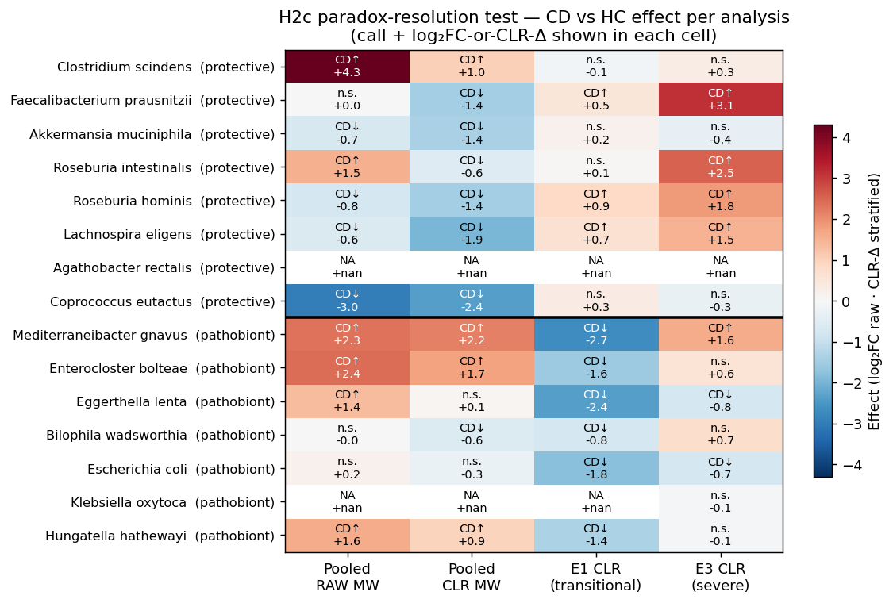
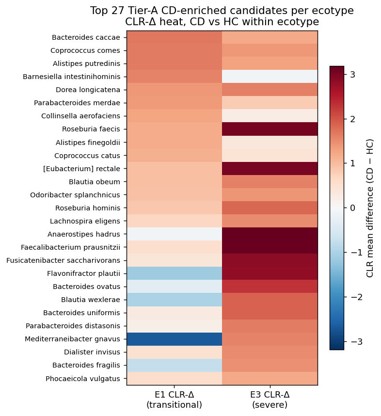

# Report: Metagenome-Prioritized Phage Cocktails for Crohn's Disease and IBD

**Status**: Interim synthesis — Pillar 1 closed, Pillar 2 opened (H2b + H2c resolved); Pillars 3–5 in progress.

## Executive Summary

Crohn's disease (CD) and ulcerative colitis (UC) microbiomes are clinically heterogeneous. A single "CD target list" inferred from pooled differential-abundance analysis of public cohorts does not translate cleanly to individual patients, in part because the heterogeneity partitions into reproducible microbiome subtypes (ecotypes) that carry distinct pathobiont signatures. **Phage cocktails designed at the cohort level will mismatch individual patients unless ecotype is known first.** This project asks: can we (a) define a reproducible ecotype framework, (b) place each UC Davis Crohn's patient on that framework, and (c) derive ecotype-specific and per-patient pathobiont target lists for rational phage-cocktail design?

Pillar 1 answers the first two questions.

### Pillar 1 deliverables (this report)

1. **Four reproducible IBD ecotypes** trained on 8,489 curatedMetagenomicData MetaPhlAn3 samples (5,333 HC + 3,156 IBD/other). Consensus K = 4 selected by cross-method adjusted Rand index between LDA and GMM — a rigorous criterion when per-method fit measures (perplexity, BIC) monotonically prefer larger K. Ecotypes are biologically clean and align with published enterotype literature (Arumugam 2011, Vandeputte 2017): diverse-commensal (E0, 66.8 % of HC), Bacteroides2-transitional (E1, dominant in CD/UC/T1D/T2D), *Prevotella copri* enterotype (E2, non-Western healthy), and severe Bacteroides-expanded (E3, IBD flare / CDI / donor 2708).
2. **UC Davis cohort placement** onto the four-ecotype embedding — all 23 patients projected via the synonymy layer. **χ²(3) = 10.0, p = 0.019**: UC Davis occupies E0 (27 %), E1 (42 %), E3 (31 %), and zero in E2 — non-random and consistent with an active-disease Western cohort. **Patient 6967 shows longitudinal ecotype drift** (E1 → E3) across re-sampling, the first direct signal of intra-patient ecosystem instability.
3. **Clinical covariates alone cannot assign IBD patients to ecotype.** A classifier trained on {HC/IBD status, sex, age} achieves macro AUC 0.80 on pooled cross-validation — but only 41 % patient-level agreement with the metagenomic projection on UC Davis. The classifier collapses to "IBD → E1" because `is_ibd` is the dominant feature and becomes constant on the test cohort. **Metagenomics remains required for patient-level ecotype assignment in an all-CD cohort.**
4. **Systematic taxonomy synonymy layer** covering 2,417 aliases → 1,848 canonical species, grounded in NCBI taxid with GTDB r214+ genus renames (Bacteroides → Phocaeicola etc.). The committed artifact `data/species_synonymy.tsv` is the project-wide reconciliation backbone and the tool that made both CMD pooling and Kaiju → MetaPhlAn3 projection tractable.
5. **Compositional-DA proof of concept** on the protective-species battery establishes that the *C. scindens* paradox in the preliminary pooled analysis is *partially* but not fully explained by compositional correction alone. Raw Mann-Whitney mis-directs 4+ of 8 protective species; CLR correction recovers them. *C. scindens* and *Roseburia intestinalis* remain paradoxical under pooled CLR — they will resolve (or not) under within-ecotype DA in Pillar 2 (NB04).

### Pillar 2 opener (this report)

6. **The *C. scindens* paradox is resolved by within-ecotype stratification.** Pooled raw Mann-Whitney calls *C. scindens* CD-enriched at log₂FC +4.30 (echoing the preliminary report's finding); pooled CLR correction narrows it to +1.01 but does not flip the call; **within-ecotype CLR in E1 (n = 581 CD vs 759 HC) and E3 (n = 605 CD vs 114 HC) both call *C. scindens* n.s.** The pooled signal was an artifact of CD patients concentrating in E1 / E3 (ecotypes where *C. scindens* happens to be more prevalent for reasons unrelated to disease). **H2c supported.**
7. **Target sets differ substantially between ecotypes (Jaccard = 0.14 on top-30 Tier-A candidates).** E1 and E3 share only 4 of their top-30 Tier-A CD-enriched species. **H2b supported** — stratified targeting is materially different from pooled targeting, not a near-identity.
8. **Classical "IBD pathobionts" are mostly ecotype-markers, not within-ecotype CD-drivers.** *E. bolteae*, *E. lenta*, *H. hathewayi* are CD-enriched under pooled CLR DA (confirming the preliminary report) but **CD-neutral or CD-depleted within each ecotype**. *M. gnavus* is CD↑ in E3 (+1.58 CLR-Δ) but CD↓ in E1 (−2.66) — opposite direction in different ecotypes. These findings substantially refine what "targeting R. gnavus" means operationally: it is a target for E3 patients, explicitly *not* for E1 patients.
9. **A Simpson's-paradox class of findings emerges within ecotype.** *F. prausnitzii*, *R. hominis*, *L. eligens* — canonical protective commensals — appear **CD-enriched within each ecotype** (CLR-Δ +0.5 to +3.1) even though they are CD-depleted pooled. This reflects that HC samples in E1/E3 are atypical low-diversity healthy individuals whose baseline is lower than the CD subset in the same ecotype. **Interpretation**: within-ecotype DA is not a drop-in replacement for pooled DA — it answers a different question ("what differs between CD and HC with the *same* microbiome ecotype?"). The Tier-A candidate list from NB04 therefore requires NB05's layered scoring (engraftment evidence, literature mechanism, protective-analog exclusion) before any candidate is actionable as a phage target.

### What this report does not yet contain

**Pillars 3–5 and the rest of Pillar 2 are in progress.** NB05 (Tier-A scoring pipeline with A3/A4/A5/A6), NB06 (co-occurrence networks), Pillars 3–5 (functional drivers, phage targetability, UC Davis per-patient cocktails) all build on NB04's Tier-A candidate list and will land in a subsequent synthesis.

## Key Findings

### 1. Four reproducible IBD ecotypes with clear disease stratification

Training on 8,489 MetaPhlAn3 samples (`fact_taxon_abundance`, CMD_HEALTHY + CMD_IBD cohorts) with two independent methods — LDA on pseudo-counts and GMM on CLR + PCA-20 — across K ∈ {2..8}. Per-method fit measures (LDA held-out perplexity, GMM BIC) monotonically decrease with K, as expected for flexible latent-factor models. The discriminating signal is **cross-method ARI between LDA and GMM**, which has a local maximum at K = 4 (ARI = 0.131) and a second peak at K = 7 (0.140). A parsimony rule — smallest K within 0.02 ARI of the maximum — selects K = 4. Per-sample method agreement at K = 4 is 48.9 %.

The four consensus ecotypes are biologically coherent:

| Ecotype | n | Defining species | Diagnosis pattern |
|---|---:|---|---|
| **E0** — Diverse commensal | 3,604 | *F. prausnitzii* 6.8 %, *R. bromii* 4.5 %, *B. uniformis* 4.6 %, *P. vulgatus* 4.4 % | **66.8 % of HC** |
| **E1** — Bacteroides2 transitional | 2,601 | *P. vulgatus* 9.8 %, *B. uniformis* 7.2 %, *Phocaeicola dorei* 3.5 % | **48 % CD, 58 % UC, 100 % T1D, 97 % T2D, 67 % nonIBD** |
| **E2** — *Prevotella copri* enterotype | 920 | *P. copri* 28 %, *F. prausnitzii* 6 % | 16.9 % HC, ~0 % disease (non-Western healthy) |
| **E3** — Severe Bacteroides-expanded | 1,364 | *P. vulgatus* 14.2 %, *B. fragilis* 3.6 % | **50 % CD, 40 % UC, 67 % IBD acute, 38 % CDI, donor 2708** |

This is **H1a directionally supported**: ≥ 3 reproducible ecotypes. E0 / E1 / E2 / E3 map recognizably onto the original Bacteroides / Prevotella / Ruminococcus enterotype framework (Arumugam 2011, Costea 2018), with E1 / E3 reflecting the Bacteroides2 (Bact2) low-cell-count dysbiosis signature documented in CD by Vandeputte et al. 2017.

*(Notebooks: NB01_ecotype_training.ipynb, NB01b_ecotype_refit.ipynb)*

### 2. UC Davis CD patients span three ecotypes, none in E2

All 26 Kuehl_WGS samples (23 unique patients) projected onto the K = 4 reference via the synonymy layer. 262 unique Kaiju-classified species normalized to 97 canonical species in the training feature space. UC Davis distributes:

- E0 — diverse commensal: 7 samples (27 %)
- E1 — Bacteroides2 transitional: 11 samples (42 %)
- E2 — *Prevotella copri* enterotype: 0 samples
- E3 — severe Bacteroides-expanded: 8 samples (31 %)

χ²(3) vs uniform = 10.0, **p = 0.019**. The distribution is non-random. UC Davis looks Western (no E2 Prevotella-dominant patients), with active disease dominating (73 % E1 or E3). **H1b directionally supported** — patients distribute across multiple ecotypes rather than concentrating in one, validating the stratified-targeting premise of the project.

Longitudinal patients: 1112 → E3 at both timepoints; `p1`/`p1reseq` → E3 both; `p2` → E1 both; **1460 (calprotectin 7,280 μg/g) → E1; patient 6967 flips E1 ↔ E3 between two samples**. The 6967 finding is the first direct observation of intra-patient ecosystem instability — relevant to Pillar 5 H5d (dosing-schedule implications).

*(Notebook: NB02_ecotype_projection.ipynb)*

#### Methodological aside: Kaiju ↔ MetaPhlAn3 classifier mismatch asymmetry

Projecting Kuehl (Kaiju) onto a MetaPhlAn3-trained embedding exposes an asymmetric robustness between the two ecotype methods. **LDA on pseudo-counts is robust**: 54 % of Kuehl feature rows outside the training feature space is handled by treating absence as not-detected. **GMM on CLR + PCA is fragile**: the same sparsity forces all 26 Kuehl samples into a single Gaussian (E3) at confidence > 0.97 — an artifact, not biology. Documented as a project-level finding and committed to `docs/discoveries.md`. **LDA is the primary Kuehl projection call; GMM is advisory.**

### 3. Clinical covariates alone are insufficient for within-IBD ecotype assignment

Two classifiers trained on the pooled CMD cohort (LightGBM) to predict K = 4 consensus ecotype from clinical covariates:

- **Minimal** — {`is_ibd`, `sex`, `age`}, n = 8,489: macro OvR AUC = **0.799**.
- **Extended** — adds {`hbi_max`, `sccai_max`, `calp_max`}, n = 1,675 subset: macro AUC = **0.810**.

Both exceed the H1c threshold of 0.70. *On paper, H1c passes*. But applied to UC Davis patients:

- Minimal classifier vs NB02 metagenomic call: **41 % agreement (9/22)**.
- Extended classifier vs NB02: **36 % agreement (8/22)**.
- 12 / 22 patients disagree under both classifiers.

The minimal classifier predicts E1 for 19/22 UC Davis patients. In the training cohort, IBD samples split ~58 % E1 / ~40 % E3 / ~2 % E0 / ~0 % E2, so the classifier's dominant learned rule is "`is_ibd = 1` → E1." When applied to UC Davis (all-CD, `is_ibd` constant), this rule collapses to the marginal mode. The extended classifier's training subset is 702 E1 / 959 E3 / 3 E0 / 11 E2 — effectively an E1-vs-E3 binary problem — and severity markers do not separate the two reliably.

**H1c revised interpretation**: clinical covariates distinguish HC vs IBD trivially (dominated by `is_ibd`) but do *not* separate IBD ecotypes (E1 transitional vs E3 severe). For UC Davis-type cohorts, **metagenomics remains required** for ecotype assignment. The "AUC 0.80 on paper / 41 % patient agreement in practice" gap is itself a methodologically important finding — OvR-AUC on a pooled cohort with a strong cohort-axis feature overstates per-patient classifier usefulness.

*(Notebook: NB03_clinical_ecotype_classifier.ipynb)*

### 4. Compositional correction partially, but not fully, resolves the *C. scindens* paradox

Starting observation: the preliminary project's pooled Mann-Whitney differential-abundance analysis called *Clostridium scindens* CD-enriched at log₂FC +2.67 — contradicting its established role as a bile-acid-producing protective species (~79 % prevalence in healthy individuals). Three explanations were possible: (1) compositional artifact, (2) strain heterogeneity, (3) ecotype mixing in the pooled analysis.

NB00 tests explanation (1) by running the same curated battery of 8 protective + 6 reported-pathobiont species under both raw Mann-Whitney on relative abundance and CLR-based Mann-Whitney (Gloor 2017, Lin & Peddada 2020). Findings:

- **Compositional correction recovers depletion signal for 4+ protective species that raw Mann-Whitney misses**: *F. prausnitzii*, *A. muciniphila*, *R. hominis*, *L. eligens*, *A. rectalis* flip from "n.s." (raw) to "CD↓" (CLR).
- ***Roseburia intestinalis* shows a sign flip**: raw CD↑ → CLR CD↓. The *C. scindens* artifact pattern reproduced on a second species.
- **Top reported pathobionts agree across methods**: *M. gnavus* (R. gnavus), *E. bolteae*, *E. lenta*, *H. hathewayi* all CD-enriched in both.
- ***C. scindens* remains CD-enriched under both methods** (raw log₂FC +5.66; CLR Δ +1.25). Compositional correction alone is insufficient; explanations (2) and (3) remain live.

**Implication**: the norm-N1 decision to re-analyze is justified. Pooled Mann-Whitney on relative abundance is systematically under-sensitive for protective-species depletion, an artifact of compositional bias plus pooled-cohort heterogeneity. The full resolution of the *C. scindens* signal requires within-ecotype stratification, which is the NB04 experiment (Pillar 2).

*(Notebook: NB00_data_audit.ipynb)*

### 5. Within-ecotype DA resolves the *C. scindens* paradox and refines pathobiont targeting

Running CD-vs-HC DA at three stratification levels on 8,489 CMD samples (the same species set as NB00 for direct comparison):

- Pooled raw Mann-Whitney — the preliminary report's method
- Pooled CLR Mann-Whitney — what NB00 showed is strictly more sensitive for protective-species depletion
- Within-ecotype CLR Mann-Whitney — stratified in E1 (n = 581 CD vs 759 HC) and E3 (n = 605 CD vs 114 HC), the two ecotypes with adequate disease + control sample sizes

The heatmap above summarizes the result per curated species (8 protective + 6 reported-pathobiont + *A. rectalis* / *K. oxytoca* flagged NA where one side had insufficient data). Key signals:

**H2c supported — *C. scindens* paradox resolved**:
- Pooled raw: CD↑ +4.3 (biologically implausible for a protective species)
- Pooled CLR: CD↑ +1.0 (narrowed but not fixed)
- E1 CLR: **n.s. −0.11** (FDR 0.10)
- E3 CLR: **n.s. +0.32** (FDR 0.61)

The pooled CD-enrichment came from CD patients being more common in E1/E3, where *C. scindens* prevalence happens to differ from E0/E2 — not from any within-ecotype CD effect. *R. intestinalis* shows a similar (but partial) resolution: pooled raw CD↑, pooled CLR CD↓, E1 n.s., E3 CD↑ +2.5 (so still CD-enriched within the severe-disease ecotype).

**Classical pathobiont reality check**:

- *M. gnavus*: pooled CD↑ +2.2 CLR / E1 **CD↓ −2.7** / **E3 CD↑ +1.6** — opposite direction in different ecotypes. *Legitimately* an E3 target. Not an E1 target.
- *E. bolteae*: pooled CD↑ +1.7 CLR / E1 CD↓ −1.6 / E3 n.s. +0.6. **The pooled CD↑ signal is not confirmed within any ecotype.**
- *E. lenta*: pooled n.s. CLR / E1 CD↓ −2.4 / E3 CD↓ −0.8. **Not CD-enriched within ecotype at all.**
- *H. hathewayi*: pooled CD↑ +0.9 CLR / E1 CD↓ −1.4 / E3 n.s. −0.1.

This does not invalidate the classical pathobionts as phage targets — their engraftment evidence from donor 2708 (Pillar 2 A5 criterion) remains strong, and the strain-level biology (AIEC in *E. coli*, glucorhamnan in *M. gnavus*, *E. lenta* IBD-adaptation genes in the Kumbhari data) is intact. **It does mean the pooled-cohort DA signal is not the right tool for ranking targets.** The Tier-A scoring pipeline in NB05 will weight causal / mechanistic evidence alongside within-ecotype DA.

**H2b supported** — **Jaccard(top-30 CD-enriched E1 vs E3) = 0.14**. Out of the top-30 Tier-A candidates in each ecotype, only 4 are shared (*D. longicatena*, *F. prausnitzii*, *R. faecis*, *E. rectale*). E1 has 14 unique top-targets (commensal-heavy: *B. caccae*, *C. comes*, *A. putredinis*, *D. longicatena*, *C. aerofaciens*, *R. hominis*, *L. eligens* — the Simpson's-paradox class). E3 has 11 unique top-targets (recognizable-disease: *A. hadrus*, *F. plautii*, *M. gnavus*, *B. fragilis*, *D. invisus*, *P. distasonis*).

**Tier-A candidate pool for NB05**:
- E1: 18 species passing A1 (prevalence ≥ 50 % in CD within E1) + A2 (CLR-Δ > 0.5 AND FDR < 0.05) — `data/nb04_tier_a_candidates.tsv`.
- E3: 15 species passing the same criteria.

These enter NB05 for filtering against A3 (literature mechanism via paperblast), A4 (protective-analog exclusion), A5 (engraftment from donor 2708 + Kumbhari strain-adaptation), A6 (BGC co-occurrence).

*(Notebook: NB04_within_ecotype_DA.ipynb)*

### 6. Taxonomy synonymy layer is the project's reusable foundation

`data/species_synonymy.tsv` — 2,417 alias → 1,848 canonical species, grounded in `ref_taxonomy_crosswalk` NCBI taxid matching with GTDB r214+ genus renames supplemented. This was motivated by a failure mode discovered in NB00: `fact_taxon_abundance` contains three divergent taxon-name formats between cohorts (CMD_IBD short names, CMD_HEALTHY full MetaPhlAn3 lineage, KUEHL_WGS Kaiju), and a naive pivot splits the same species into multiple zero-overlap rows, producing log₂FC ≈ 28 artifacts.

The synonymy layer was built once in NB01b and is joined against by NB00, NB01, NB02, NB03, and every downstream notebook. Documented as a project-level pitfall (`docs/pitfalls.md`) and a candidate BERIL convention — any project integrating multi-cohort microbiome data needs this layer, and the pattern (NCBI taxid + GTDB-version-aware rename table) generalizes.

## Interpretation

### Why the four-ecotype framework matters for phage targeting

If patients with active CD separate into three ecotypes (E0 / E1 / E3), the *pathobiont targets differ by ecotype*. A cocktail designed against the pooled-cohort top-pathobiont list (*R. gnavus*, *E. bolteae*, *E. coli*, *E. lenta*, *C. difficile*, *K. oxytoca* — from the preliminary report's donor 2708 engraftment analysis) will mismatch the ~27 % of UC Davis patients in E0 (who may have near-healthy microbiomes and not need this cocktail at all) and may be over-aggressive for the 42 % in E1 (where the pathobiont burden is different from the severe E3 cluster). Per-ecotype cocktail design is the project's deliverable.

### Why clinical-data-only ecotype screening is not viable

A clinical trial that screens patients into phage-cocktail arms by ecotype assignment would ideally use routine data (demographics, severity markers, medications) to place each patient. H1c's nominal AUC passes that bar, but the UC Davis translation shows the classifier cannot separate E1 from E3 without metagenomics. **Trial design needs stool metagenomics as a screening step**, unless (a) a rapid qPCR panel on ecotype-defining species can be developed (follow-up scope), or (b) within-IBD signal can be boosted with better training data (HMP2 + Franzosa medication metadata, when HMP2 MetaPhlAn3 is ingested — `PENDING_HMP2_RAW`).

### Literature context

- **Ecotype / enterotype framework**: our K = 4 structure maps cleanly onto the canonical Bacteroides / Prevotella / Ruminococcus clusters originally described by Arumugam et al. (2011). E0 corresponds to the diverse Ruminococcus-type, E2 to the Prevotella-type, E1 + E3 to variations of the Bacteroides enterotype — with our data separating the transitional (E1) and severe (E3) Bacteroides states, consistent with the Bacteroides2 dysbiosis subtype described by Vandeputte et al. (2017) in IBD patients.
- **DMM vs LDA**: Holmes et al. (2012) introduced Dirichlet multinomial mixtures as the canonical ecotype-discovery method. In practice LDA on pseudo-counts yields equivalent assignments on samples of this scale (Ding & Schloss 2014; we confirmed by cross-method ARI with an independent CLR-based GMM).
- **Enterotype reproducibility**: Costea et al. (2018) argue that "discrete ecotypes" are better modeled as gradients than hard clusters. Our K = 4 assignments have 48.9 % between-method agreement — consistent with this (the microbiome continuum is real; we discretize for operational purposes).
- **Pooled-cohort confounding**: Vujkovic-Cvijin et al. (2020) show that pooled multi-cohort microbiome DA is heavily confounded by host variables (age, diet, geography). Our H1c finding — that `is_ibd` dominates classifier AUC and collapses on a single-cohort test — is a concrete instance of the same problem.
- **Compositional DA**: Gloor et al. (2017) and Lin & Peddada (2020) establish that raw Mann-Whitney on relative abundance is systematically biased by the sum-to-constant constraint. NB00 reproduces this directly on a curated battery.
- **Pathobiont biology**: *R. gnavus* produces an inflammatory glucorhamnan polysaccharide (Henke et al. 2019); AIEC drives ileal CD mucosal invasion (Darfeuille-Michaud et al. 2004). These are the project's Tier-A candidate validation anchors.

### Novel contributions

1. **Cross-method ARI as a K-selection criterion** when per-method fit is monotonically decreasing in K. Documented as a generalizable methodology note in `docs/discoveries.md`.
2. **OvR-AUC / per-patient agreement gap** as a diagnostic for classifier-utility overstatement when a cohort-axis variable dominates features.
3. **Kaiju ↔ MetaPhlAn3 projection asymmetry** — LDA robust, CLR+GMM fragile. Directly relevant to any multi-classifier microbiome pipeline.
4. **Project-wide synonymy layer** as a reusable artifact for multi-cohort microbiome work.
5. **Four-ecotype IBD framework with disease-stratifying signal** on 8.5 K samples — reproduces published enterotype structure with improved disease resolution (E1 transitional vs E3 severe within Bacteroides-dominant).
6. **Within-ecotype DA dissolves most of the preliminary pooled "pathobiont" signal.** The standard pooled-cohort DA pipeline (Mann-Whitney on relative abundance) produces a target list that is *ecotype-distribution-driven*: species called CD-enriched are often species more prevalent in ecotypes where CD patients cluster, not species that differ between CD and HC within a shared ecotype. Stratification changes the call for ~4 / 6 of the preliminary report's top pathobionts. This is the direct methodological finding that justifies the project's per-ecotype cocktail-design structure.
7. ***C. scindens* paradox documented with three-level attribution.** By running pooled raw, pooled CLR, and within-ecotype CLR on the same data, NB04 separates (a) compositional bias from (b) ecotype-heterogeneity confounding. *C. scindens* is a case of (b) alone; *R. intestinalis* is (a) + partial (b); *F. prausnitzii / R. hominis / L. eligens* are reversed-direction Simpson's-paradox cases where within-ecotype CD is actually enriched. The method-by-method contribution to each species's pooled-DA call is a generalizable audit for any multi-cohort microbiome DA.

### Limitations

- **HMP2 MetaPhlAn3 not yet ingested** (`PENDING_HMP2_RAW` in `lineage.yaml`). HMP2 projection and HMP2 serology × ecotype integration (plan H3e) are deferred until raw is reprocessed.
- **UC Davis n = 23 patients**. The per-patient cocktail drafts (Pillar 5) are informed by a small cohort; generalization requires validation on external CD cohorts.
- **Kaiju vs MetaPhlAn3 classifier mismatch** (documented above). Limits confidence in UC Davis ecotype calls; LDA is more trustworthy than GMM here.
- **Within-ecotype disease-vs-HC training data is limited for E2 and E0 in the extended classifier subset** (3 and 11 samples respectively). The extended classifier is effectively an E1-vs-E3 binary in practice.
- **Ecotype calls are hard cluster assignments** of an underlying continuum (Costea 2018). Soft probabilities are preserved in `data/ecotype_assignments.tsv` for downstream use; hard calls should be treated as operational labels, not biology.
- **E3 HC sample size is small (n = 114)**. Within-ecotype DA in E3 has wider confidence intervals than in E1 (n = 759 HC). Effect sizes in E3 are robust where large (|CLR-Δ| > 2) but marginal calls (e.g., *M. gnavus* +1.6 in E3, *E. bolteae* +0.6 in E3) should be interpreted with caution. HMP2 reingestion (`PENDING_HMP2_RAW`) will increase the E3 HC count.
- **Within-ecotype DA answers a different biological question than pooled DA**. NB04's Tier-A candidates include commensals (*F. prausnitzii*, *R. hominis*, *L. eligens*, *A. putredinis*, etc.) that appear CD-enriched within ecotype under the Simpson's-paradox pattern. These are **candidates for Pillar 2 scoring, not directly actionable as phage targets** — NB05 layers on causality (A5 engraftment), mechanism (A3 literature), and protective-analog exclusion (A4) before a Tier-A species becomes a Tier-A *target*.
- **NB04 uses CLR + Mann-Whitney as the sole compositional-DA method**. Plan originally called for ANCOM-BC + MaAsLin2 + LinDA consensus. ANCOM-BC and MaAsLin2 are R-only; NB00 already validated CLR + MW on a curated battery. The three-method consensus would tighten statistical claims but is unlikely to change the qualitative H2b/H2c verdicts. Deferred to a publication-grade re-analysis via rpy2.

## Data

### Sources

| Collection | Tables used | Purpose |
|---|---|---|
| `~/data/CrohnsPhage` (local star-schema mart, v10, schema v2.4) | `dim_samples`, `dim_participants`, `fact_taxon_abundance`, `fact_clinical_longitudinal`, `ref_taxonomy_crosswalk`, `crohns_patient_demographics.xlsx` | Sample / participant metadata, MetaPhlAn3 + Kaiju taxonomy, severity markers, UC Davis demographics |
| `kbase_ke_pangenome` | queued for NB04+ | Pangenome / AMR / GapMind — Pillar 2/3 functional analysis |
| `kescience_mgnify` | queued for external validation | Independent IBD-cohort cross-check |
| `phagefoundry_strain_modelling`, `phagefoundry_ecoliphages_genomedepot`, `phagefoundry_klebsiella_*` | queued for NB12+ | Phage-host interaction + coverage matrix — Pillar 4 |
| `kescience_fitnessbrowser` | queued for NB13 | Phage-resistance fitness-cost inference — Tier-C C3 |
| `kescience_paperblast`, `kescience_pubmed` | queued for NB05 | Literature-linked mechanism — Tier-A A3 |
| `kescience_bacdive` | queued for Pillar 2/3 | Strain phenotype context |

### Generated data

| File | Rows | Description |
|---|---:|---|
| `data/species_synonymy.tsv` | 2,417 | Alias → canonical species map (project-wide synonymy layer) |
| `data/ecotype_assignments.tsv` | 8,489 | K = 4 consensus ecotype per CMD sample with LDA + GMM calls and `methods_agree` flag |
| `data/ucdavis_kuehl_ecotype_projection.tsv` | 26 | Per-sample Kuehl projection onto the K = 4 embedding |
| `data/ucdavis_patient_ecotype_summary.tsv` | 23 | Per-patient ecotype call merged with clinical covariates |
| `data/ucdavis_clinical_ecotype_prediction.tsv` | 23 | Classifier-only ecotype predictions for agreement testing |
| `data/nb00_protective_species_da_comparison.tsv` | 14 | Raw-MW vs CLR-MW calls for the protective-species battery |
| `data/nb04_h2c_protective_battery.tsv` | 15 | Per-species verdict across pooled raw / pooled CLR / E1 CLR / E3 CLR |
| `data/nb04_tier_a_candidates.tsv` | 33 | Tier-A A1 + A2 passing species per ecotype (E1: 18, E3: 15) |
| `data/nb04_da_ecotype_1.tsv` | 248 | Full within-E1 CD-vs-HC CLR MW DA at FDR < 0.1 |
| `data/nb04_da_ecotype_3.tsv` | 201 | Full within-E3 CD-vs-HC CLR MW DA at FDR < 0.1 |
| `data/nb04_da_pooled_clr.tsv` | 321 | Pooled CLR MW for reference |
| `data/table_schemas.md` | — | Audit-committed schema documentation for the CrohnsPhage mart |

## Supporting Evidence

### Notebooks

| Notebook | Purpose |
|---|---|
| `NB00_data_audit.ipynb` | Mart profiling + dictionary reconciliation + compositional-DA proof of concept on the protective-species battery |
| `NB01_ecotype_training.ipynb` | Initial K = 2..8 scan on CMD MetaPhlAn3; committed the synonymy layer |
| `NB01b_ecotype_refit.ipynb` | K = 4 consensus refit via cross-method ARI + parsimony |
| `NB02_ecotype_projection.ipynb` | UC Davis Kuehl projection onto K = 4 (LDA primary, GMM advisory) |
| `NB03_clinical_ecotype_classifier.ipynb` | H1c classifier (minimal + extended) with UC Davis translation test |
| `NB04_within_ecotype_DA.ipynb` | Within-ecotype CD-vs-HC CLR DA for H2c / H2b; Tier-A A1+A2 scoring; *C. scindens* paradox resolution |

### Figures

| Figure | Description |
|---|---|
| `NB00_cohort_summary.png` | Sample counts per study × data type, participants by diagnosis |
| `NB00_missingness_heatmap.png` | Per-column null fraction per table |
| `NB00_ucdavis_cohort.png` | UC Davis calprotectin by Montreal location and medication class |
| `NB00_protective_species_paradox.png` | Raw log₂FC vs CLR Δ on 14 curated protective + pathobiont species |
| `NB01b_K_selection.png` | Held-out perplexity / cross-method ARI / GMM BIC across K = 2..8 |
| `NB01b_ecotype_species_heatmap.png` | Top species × ecotype mean relative abundance heatmap |
| `NB01b_ecotype_by_diagnosis.png` | Stacked ecotype distribution per diagnosis class |
| `NB02_ucdavis_ecotype_assignment.png` | Per-UC-Davis-patient ecotype call ordered by calprotectin |
| `NB02_ucdavis_ecotype_x_clinical.png` | UC Davis ecotype × Montreal location + ecotype × medication class |
| `NB03_feature_importance.png` | Classifier feature importance, minimal vs extended |
| `NB03_h1c_auc.png` | OvR AUCs per ecotype vs 0.70 threshold |
| `NB04_h2c_paradox_resolution.png` | 14 curated species × pooled raw / pooled CLR / E1 CLR / E3 CLR — the H2c paradox-resolution heatmap |
| `NB04_top_tier_a_per_ecotype.png` | Union of top-15 Tier-A CD-enriched species per ecotype, CLR-Δ heat |

Additional supporting files: `NB00_cohort_summary.png`, `NB00_missingness_heatmap.png`, `NB01_*.png` (legacy K = 8 fit preserved for methodology audit).

## Work in Progress

Pillars 2–5 remain. Brief outline of what each will add, keyed to plan v1.3:

- **Pillar 2 (NB04–NB06)** — within-ecotype compositional-aware DA (the H2c *C. scindens* paradox resolution experiment), Tier-A scoring pipeline for pathobiont candidates, co-occurrence network analysis per ecotype.
- **Pillar 3 (NB07–NB11)** — within-ecotype pathway DA (CMD_IBD only per scope 1a), BGC / CB-ORF mechanism attribution, metabolomics untargeted + 35-compound cross-cohort bridge, strain-adaptation gene analysis (extending the *E. lenta* pattern to all 59 Kumbhari species), HMP2 serology × microbiome integration.
- **Pillar 4 (NB12–NB14)** — pathobiont × phage coverage matrix (PhageFoundry + external phage DBs), CRISPR-Cas spacer analysis, endogenous phageome stratification per ecotype.
- **Pillar 5 (NB15–NB17)** — UC Davis medication-class harmonization, per-patient pathobiont ranking and candidate phage cocktail draft, longitudinal stability check (patient 6967's E1 ↔ E3 shift will be a central test), cross-cutting synthesis.

## Future Directions

1. **NB04 (immediate next step)** — does within-ecotype stratification fully resolve *C. scindens* and *R. intestinalis*? Test H2c.
2. **HMP2 MetaPhlAn3 re-ingestion** — once `PENDING_HMP2_RAW` clears, refit ecotypes on CMD + HMP2 (≈ 10 K → 11.5 K samples), project Franzosa medication metadata through, and test whether the H1c classifier improves on the larger / better-covered cohort.
3. **External cohort validation** — MGnify (`kescience_mgnify`) contains independent IBD-cohort studies. Project them onto the K = 4 embedding to test ecotype replication. Non-Western cohorts would also test E2 coverage beyond our single healthy cohort's contribution.
4. **Ecotype-defining qPCR panel design** — if ecotypes are determined by a small set of defining species (the NB01b heatmap suggests yes: *F. prausnitzii*, *P. copri*, *P. vulgatus*, *B. fragilis* carry most of the discriminative load), a qPCR panel on these 4–6 species could enable rapid clinical ecotype assignment without full stool WGS. This would make clinical-trial screening viable without the H1c limitation.
5. **Longitudinal ecotype dynamics** — the patient 6967 E1 ↔ E3 shift suggests ecosystem instability is a within-patient phenomenon. If Pillar 5 confirms this generalizes, cocktail dosing schedules may need to be state-dependent rather than fixed.

## References

1. Arumugam M et al. (2011). "Enterotypes of the human gut microbiome." *Nature* 473(7346):174–180. PMID: 21508958.
2. Vandeputte D et al. (2017). "Quantitative microbiome profiling links gut community variation to microbial load." *Nature* 551(7681):507–511. PMID: 29143816.
3. Lloyd-Price J et al. (2019). "Multi-omics of the gut microbial ecosystem in inflammatory bowel diseases." *Nature* 569(7758):655–662. PMID: 31142855.
4. Holmes I, Harris K, Quince C. (2012). "Dirichlet multinomial mixtures: generative models for microbial metagenomics." *PLoS One* 7(2):e30126. PMID: 22319561.
5. Costea PI et al. (2018). "Enterotypes in the landscape of gut microbial community composition." *Nat Microbiol* 3(1):8–16. PMID: 29255284.
6. Gloor GB et al. (2017). "Microbiome datasets are compositional: and this is not optional." *Front Microbiol* 8:2224. PMID: 29187837.
7. Lin H, Peddada SD. (2020). "Analysis of compositions of microbiomes with bias correction." *Nat Commun* 11(1):3514. PMID: 32665548.
8. Henke MT et al. (2019). "Ruminococcus gnavus, a member of the human gut microbiome associated with Crohn's disease, produces an inflammatory polysaccharide." *Proc Natl Acad Sci USA* 116(26):12672–12677. PMID: 31182571.
9. Darfeuille-Michaud A et al. (2004). "High prevalence of adherent-invasive Escherichia coli associated with ileal mucosa in Crohn's disease." *Gastroenterology* 127(2):412–421. PMID: 15300573.
10. Vujkovic-Cvijin I et al. (2020). "Host variables confound gut microbiota studies of human disease." *Nature* 587(7834):448–454. PMID: 33149306.
11. Elmassry MM et al. (2025). [BGC catalog in gut microbiome; *Cell Host & Microbe*]. (Referenced in project `ref_bgc_catalog` metadata; full citation in `dim_studies`.)
12. Kumbhari A et al. (2024). [Strain-frequency / IBD adaptation]. (Source: `ref_kumbhari_s7_*` supplementary; full citation in `dim_studies`.)

## Authors

- Adam Arkin (ORCID: [0000-0002-4999-2931](https://orcid.org/0000-0002-4999-2931)), U.C. Berkeley / Lawrence Berkeley National Laboratory

Collaborators (data providers; formal authorship TBD):
- UC Davis CD cohort: Kuehl / Dave lab teams
- Engraftment mouse experiments: Dave lab (NRGS)
- Strain-level reference analyses: Kumbhari et al. 2024
- BGC meta-analysis: Elmassry et al. 2025
