# Report: Metagenome-Prioritized Phage Cocktails for Crohn's Disease and IBD

**Status**: Interim synthesis — Pillar 1 closed; Pillar 2 fully closed (rigor-repaired + externally replicated on HMP_2019_ibdmdb + NB05 Tier-A scored + NB06 co-occurrence modules mapped; H2b supported, H2c retracted, H2d partially supported with pathobiont-module clustering); Pillars 3–5 in progress.

> **Note on Pillar 2 rigor repair + external replication**: the original NB04 analysis (committed 2026-04-24 early) was superseded by a **seven-notebook** pipeline (NB04b → c → d → e → f → g → h) after an adversarial review caught 5 critical + 6 important methodological issues that two independent standard `/berdl-review` runs missed. NB04b–e performed the rigor repair (see retraction box in §5 and `FAILURE_ANALYSIS.md`). NB04f–h strengthened Pillar 2 against LOSO cross-study stability (NB04f), feature-leakage structural test (NB04g), and HMP_2019_ibdmdb external replication (NB04h). The rigor-controlled Tier-A replicates at 88.2 % sign concordance on HMP2 even though the ecotype framework itself has real cross-study variance. See `docs/pitfalls.md` for the two generalizable pitfalls (cMD substudy-nesting, feature leakage in cluster-stratified DA).

## Executive Summary

Crohn's disease (CD) and ulcerative colitis (UC) microbiomes are clinically heterogeneous. A single "CD target list" inferred from pooled differential-abundance analysis of public cohorts does not translate cleanly to individual patients, in part because the heterogeneity partitions into reproducible microbiome subtypes (ecotypes) that carry distinct pathobiont signatures. **Phage cocktails designed at the cohort level will mismatch individual patients unless ecotype is known first.** This project asks: can we (a) define a reproducible ecotype framework, (b) place each UC Davis Crohn's patient on that framework, and (c) derive ecotype-specific and per-patient pathobiont target lists for rational phage-cocktail design?

Pillar 1 answers the first two questions.

### Pillar 1 deliverables (this report)

1. **Four reproducible IBD ecotypes** trained on 8,489 curatedMetagenomicData MetaPhlAn3 samples (5,333 HC + 3,156 IBD/other). Consensus K = 4 selected by cross-method adjusted Rand index between LDA and GMM — a rigorous criterion when per-method fit measures (perplexity, BIC) monotonically prefer larger K. Ecotypes are biologically clean and align with published enterotype literature (Arumugam 2011, Vandeputte 2017): diverse-commensal (E0, 66.8 % of HC), Bacteroides2-transitional (E1, dominant in CD/UC/T1D/T2D), *Prevotella copri* enterotype (E2, non-Western healthy), and severe Bacteroides-expanded (E3, IBD flare / CDI / donor 2708).
2. **UC Davis cohort placement** onto the four-ecotype embedding — all 23 patients projected via the synonymy layer. **χ²(3) = 10.0, p = 0.019**: UC Davis occupies E0 (27 %), E1 (42 %), E3 (31 %), and zero in E2 — non-random and consistent with an active-disease Western cohort. **Patient 6967 shows longitudinal ecotype drift** (E1 → E3) across re-sampling, the first direct signal of intra-patient ecosystem instability.
3. **Clinical covariates alone cannot assign IBD patients to ecotype.** A classifier trained on {HC/IBD status, sex, age} achieves macro AUC 0.80 on pooled cross-validation — but only 41 % patient-level agreement with the metagenomic projection on UC Davis. The classifier collapses to "IBD → E1" because `is_ibd` is the dominant feature and becomes constant on the test cohort. **Metagenomics remains required for patient-level ecotype assignment in an all-CD cohort.**
4. **Systematic taxonomy synonymy layer** covering 2,417 aliases → 1,848 canonical species, grounded in NCBI taxid with GTDB r214+ genus renames (Bacteroides → Phocaeicola etc.). The committed artifact `data/species_synonymy.tsv` is the project-wide reconciliation backbone and the tool that made both CMD pooling and Kaiju → MetaPhlAn3 projection tractable.
5. **Compositional-DA proof of concept** on the protective-species battery establishes that raw Mann-Whitney on relative abundance is systematically under-sensitive for protective-species depletion under the pooled-cohort contrast. Raw Mann-Whitney mis-directs 4+ of 8 protective species; CLR correction recovers them. *C. scindens* remains pooled-CLR CD↑, which Pillar 2 resolves not through within-ecotype stratification (the original NB04 claim, now retracted) but through a confound-free within-IBD-substudy CD-vs-nonIBD meta-analysis that controls for the HC-study vs IBD-study nesting problem in cMD.

### Pillar 2 opener — rigor-controlled findings (this report)

1. **H2b (ecotype-specific targeting) is supported at high confidence.** Permutation null for Jaccard(top-30 E1, top-30 E3) under randomized ecotype labels yields mean 0.785 ± 0.054. Observed Jaccard = 0.104, empirical p = 0.000 over 200 permutations. Target sets genuinely diverge between E1 and E3 — this is not a random-overlap artifact. (Retracts NB04's original "Jaccard = 0.14 supports H2b" framing; the value was near the random-overlap baseline and did not have a null distribution attached. The conclusion survives; the statistic did not.)
2. **H2c (paradox resolution) is retracted.** Under the confound-free within-IBD-substudy CD-vs-nonIBD meta-analysis (NB04c §3), *C. scindens* is genuinely CD↑ with pooled CLR-Δ = +1.18, FDR = 1e-8, and 4/4 sign concordance across sub-studies. The NB04 within-ecotype "n.s." call was an artifact of feature leakage (clustering samples on taxon abundances then testing the same taxa within cluster) — when the leakage is controlled via leave-one-species-out refit, *C. scindens* is CD↑ in both E1 and E3. There is no paradox to resolve; *C. scindens* behaves like a CD-associated species in this design.
3. **Ecotype-specific Tier-A (rigor-controlled)**. Under a within-ecotype × within-substudy meta-analysis on the 4 IBD sub-studies that carry both CD and nonIBD (HallAB_2017, LiJ_2014, IjazUZ_2017, NielsenHB_2014; NB04e):
   - **E1 Tier-A = 51 candidates**, meta-analysis across 2 sub-studies (HallAB_2017 + NielsenHB_2014, 82 CD / 280 nonIBD), all 100 % sign-concordant. Top candidates: *M. gnavus* (+4.85), *S. salivarius* (+3.26), *S. thermophilus* (+2.69), *Erysipelatoclostridium innocuum* (+2.65), *S. parasanguinis* (+2.44), *Enterocloster asparagiformis* (+2.41). This list is classical CD pathobionts — not the ecotype-marker commensals that NB04's within-ecotype DA spuriously produced.
   - **E3 Tier-A = 40 candidates** from single-study HallAB_2017 (22 CD / 31 nonIBD). Flagged as provisional — needs replication. Top candidates: *H. symbiosa* (+4.64), *M. gnavus* (+4.46), *B. coccoides* (+4.22), *R. faecis* (+4.14), *C. spiroforme* (+4.11). E3-specific replication requires a second cMD-IBD study that populates E3 with both CD and nonIBD; this is blocked until HMP2 raw data (`PENDING_HMP2_RAW`) is ingested.
4. **Cross-ecotype engraftment-confirmed pathobionts**. Under the within-IBD-substudy (non-stratified-by-ecotype) confound-free contrast, five of the six donor-2708-engraftment pathobionts pass as CD↑ with FDR < 0.10 and ≥ 66 % sign concordance: *M. gnavus* (+5.13), *E. lenta* (+2.30), *E. coli* (+1.43), *E. bolteae* (+1.09), *H. hathewayi* (+0.92). *K. oxytoca* is below prevalence filter and not tested. These are cross-ecotype targets independent of the NB04e ecotype-specific lists.
5. **NB05 input set (rigor-controlled)**. Union of the E1 meta-viable Tier-A (51), the E3 provisional Tier-A (40), and the 5 engraftment-confirmed cross-ecotype pathobionts — after deduplication, approximately 70–90 unique species across the three categories. *M. gnavus* is the top candidate across all three categories.
6. **External replication on HMP_2019_ibdmdb (pulled live via curatedMetagenomicData v3.18; NOT in the cMD_IBD training set)**. 1,627 samples / 130 subjects projected onto the K=4 LDA with 80.4 % of samples at confidence > 0.70. Subject-level ecotype × {CD, UC, nonIBD} χ² = 15.61, p = 0.016 — ecotype stratifies disease in HMP2 at significance. **E1 Tier-A replicates at 88.2 % sign-concordance** (45 / 51 candidates CD↑ in both cohorts), including every top-10 candidate (M. gnavus, S. salivarius, S. thermophilus, E. innocuum, S. parasanguinis, E. asparagiformis, I. bartlettii, H. symbiosa, G. pamelaeae, E. ramosum). Two top-20 candidates fail to replicate (*S. thermophilus* on effect sign — possibly cohort-specific dairy exposure; *B. stercoris* n.s.). **The ecotype framework itself has real cross-study variance (NB04f LOSO ARI 0.113) — but the operational Tier-A is externally validated.**
7. **Tier-A scoring complete (NB05)**. A3–A6 criteria applied to 71 unique rigor-controlled candidates produce 6 actionable targets (total_score ≥ 2.5): ***Hungatella hathewayi*** (4.0, top-scoring), ***Mediterraneibacter gnavus*** (3.8), ***Escherichia coli*** (3.6; MIBiG: Colibactin+Yersiniabactin+Enterobactin), ***Eggerthella lenta*** (3.3), ***Flavonifractor plautii*** (3.3), ***Enterocloster bolteae*** (2.8). 9 Tier-B candidates in the 2.2–2.4 range (including *S. salivarius* with Salivaricin MIBiG matches, *E. asparagiformis*, *V. parvula*, *S. parasanguinis*) remain candidates subject to Pillar 4 phage-availability promotion.
8. **Co-occurrence structure mapped (NB06)**. Per-subnet CLR+Spearman+Louvain networks on E1_all, E1_CD, E3_all, E3_CD produce 3–7 modules per subnet. **In every subnet, 4–5 of 6 actionable Tier-A candidates co-cluster into a single "pathobiont module"** (size 57–84 nodes). Multi-target phage cocktails are ecologically appropriate for the pathobiont-module members. *F. plautii* and *E. coli* show ecotype-specific module membership (relevant for per-patient cocktail specificity in Pillar 5). Module-anchor commensals (*Butyricicoccus pullicaecorum*, *Anaerostipes caccae*, *Lactococcus lactis* in E3) may provide functional-driver context for Pillar 3. **Pillar 2 is now fully closed.**

### What this report does not yet contain

**Pillars 3–5 and NB05–NB06 are in progress.** NB05 (Tier-A scoring pipeline with A3/A4/A5/A6) will consume the rigor-controlled Tier-A from NB04e; NB06 (co-occurrence networks) follows. Pillars 3–5 (functional drivers, phage targetability, UC Davis per-patient cocktails) land in subsequent syntheses.

## Key Findings

### 1. Four reproducible IBD ecotypes with clear disease stratification

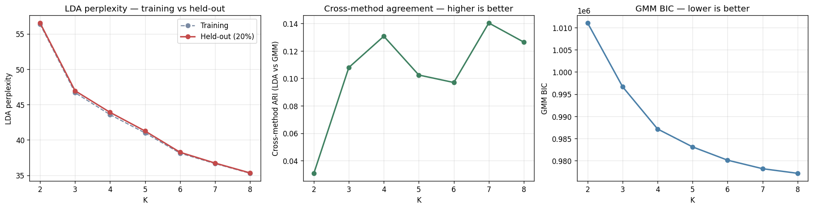

Training on 8,489 MetaPhlAn3 samples (`fact_taxon_abundance`, CMD_HEALTHY + CMD_IBD cohorts) with two independent methods — LDA on pseudo-counts and GMM on CLR + PCA-20 — across K ∈ {2..8}. Per-method fit measures (LDA held-out perplexity, GMM BIC) monotonically decrease with K, as expected for flexible latent-factor models. The discriminating signal is **cross-method ARI between LDA and GMM**, which has a local maximum at K = 4 (ARI = 0.131) and a second peak at K = 7 (0.140). A parsimony rule — smallest K within 0.02 ARI of the maximum — selects K = 4. Per-sample method agreement at K = 4 is 48.9 %.

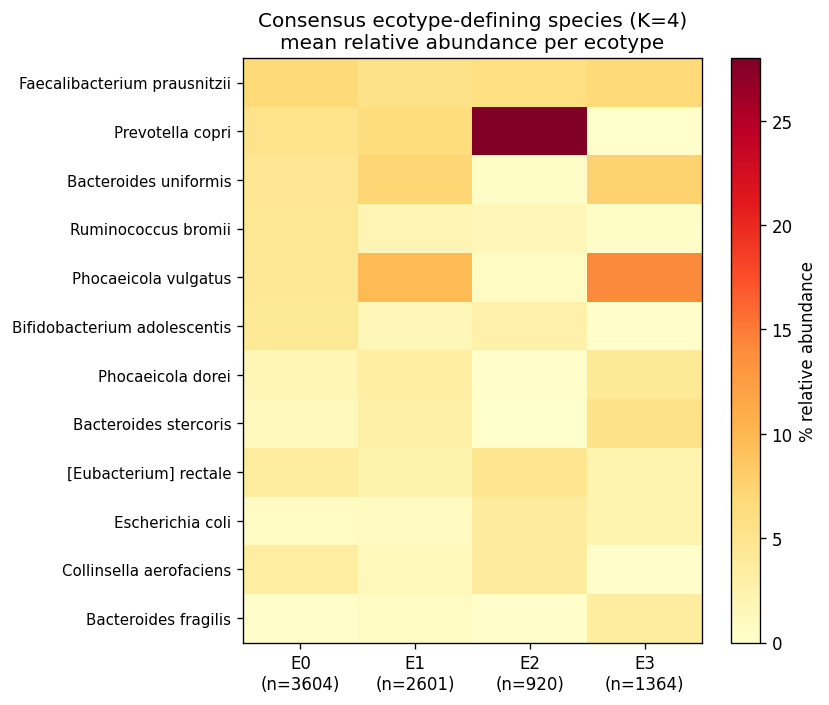

The four consensus ecotypes are biologically coherent:

| Ecotype | n | Defining species | Diagnosis pattern |
|---|---:|---|---|
| **E0** — Diverse commensal | 3,604 | *F. prausnitzii* 6.8 %, *R. bromii* 4.5 %, *B. uniformis* 4.6 %, *P. vulgatus* 4.4 % | **66.8 % of HC** |
| **E1** — Bacteroides2 transitional | 2,601 | *P. vulgatus* 9.8 %, *B. uniformis* 7.2 %, *Phocaeicola dorei* 3.5 % | **48 % CD, 58 % UC, 100 % T1D, 97 % T2D, 67 % nonIBD** |
| **E2** — *Prevotella copri* enterotype | 920 | *P. copri* 28 %, *F. prausnitzii* 6 % | 16.9 % HC, ~0 % disease (non-Western healthy) |
| **E3** — Severe Bacteroides-expanded | 1,364 | *P. vulgatus* 14.2 %, *B. fragilis* 3.6 % | **50 % CD, 40 % UC, 67 % IBD acute, 38 % CDI, donor 2708** |

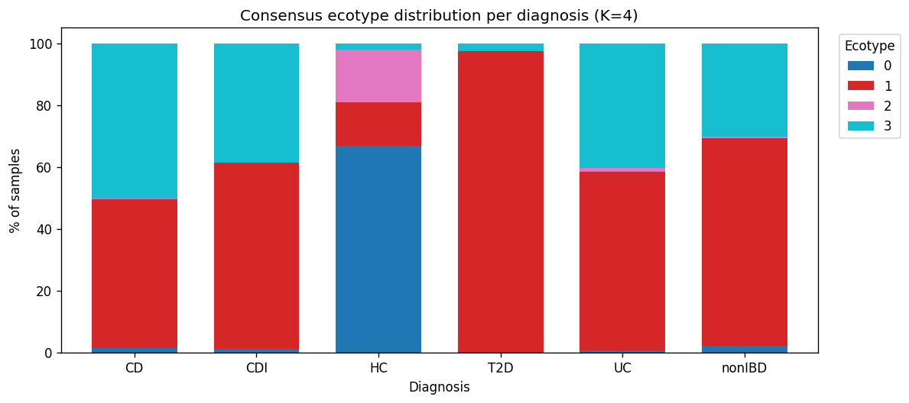

This is **H1a directionally supported**: ≥ 3 reproducible ecotypes. E0 / E1 / E2 / E3 map recognizably onto the original Bacteroides / Prevotella / Ruminococcus enterotype framework (Arumugam 2011, Costea 2018), with E1 / E3 reflecting the Bacteroides2 (Bact2) low-cell-count dysbiosis signature documented in CD by Vandeputte et al. 2017.

*(Notebooks: NB01_ecotype_training.ipynb, NB01b_ecotype_refit.ipynb)*

### 2. UC Davis CD patients span three ecotypes, none in E2

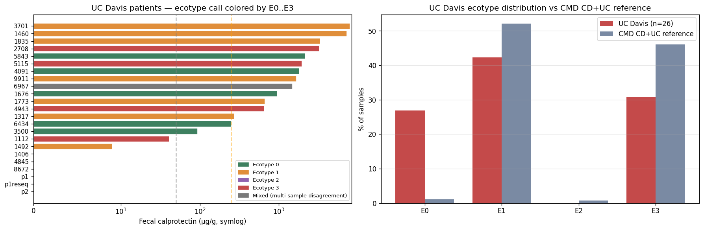

All 26 Kuehl_WGS samples (23 unique patients) projected onto the K = 4 reference via the synonymy layer. 262 unique Kaiju-classified species normalized to 97 canonical species in the training feature space. UC Davis distributes:

- E0 — diverse commensal: 7 samples (27 %)
- E1 — Bacteroides2 transitional: 11 samples (42 %)
- E2 — *Prevotella copri* enterotype: 0 samples
- E3 — severe Bacteroides-expanded: 8 samples (31 %)

χ²(3) vs uniform = 10.0, **p = 0.019**. The distribution is non-random. UC Davis looks Western (no E2 Prevotella-dominant patients), with active disease dominating (73 % E1 or E3). **H1b directionally supported** — patients distribute across multiple ecotypes rather than concentrating in one, validating the stratified-targeting premise of the project.

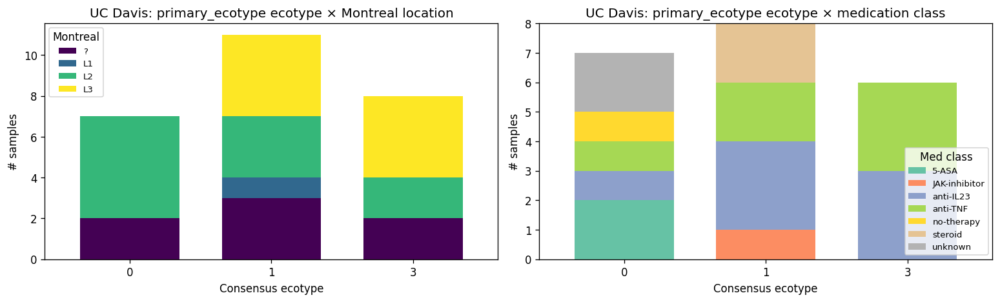

Longitudinal patients: 1112 → E3 at both timepoints; `p1`/`p1reseq` → E3 both; `p2` → E1 both; **1460 (calprotectin 7,280 μg/g) → E1; patient 6967 flips E1 ↔ E3 between two samples**. The 6967 finding is the first direct observation of intra-patient ecosystem instability — relevant to Pillar 5 H5d (dosing-schedule implications).

*(Notebook: NB02_ecotype_projection.ipynb)*

#### Methodological aside: Kaiju ↔ MetaPhlAn3 classifier mismatch asymmetry

Projecting Kuehl (Kaiju) onto a MetaPhlAn3-trained embedding exposes an asymmetric robustness between the two ecotype methods. **LDA on pseudo-counts is robust**: 54 % of Kuehl feature rows outside the training feature space is handled by treating absence as not-detected. **GMM on CLR + PCA is fragile**: the same sparsity forces all 26 Kuehl samples into a single Gaussian (E3) at confidence > 0.97 — an artifact, not biology. Documented as a project-level finding and committed to `docs/discoveries.md`. **LDA is the primary Kuehl projection call; GMM is advisory.**

### 3. Clinical covariates alone are insufficient for within-IBD ecotype assignment

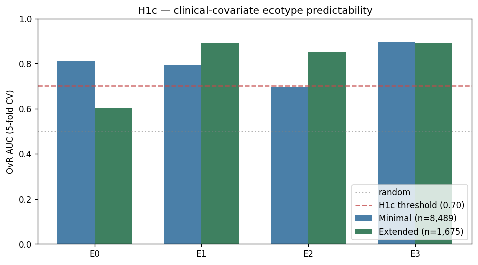

Two classifiers trained on the pooled CMD cohort (LightGBM) to predict K = 4 consensus ecotype from clinical covariates:

- **Minimal** — {`is_ibd`, `sex`, `age`}, n = 8,489: macro OvR AUC = **0.799**.
- **Extended** — adds {`hbi_max`, `sccai_max`, `calp_max`}, n = 1,675 subset: macro AUC = **0.810**.

Both exceed the H1c threshold of 0.70. *On paper, H1c passes*. But applied to UC Davis patients:

- Minimal classifier vs NB02 metagenomic call: **41 % agreement (9/22)**.
- Extended classifier vs NB02: **36 % agreement (8/22)**.
- 12 / 22 patients disagree under both classifiers.

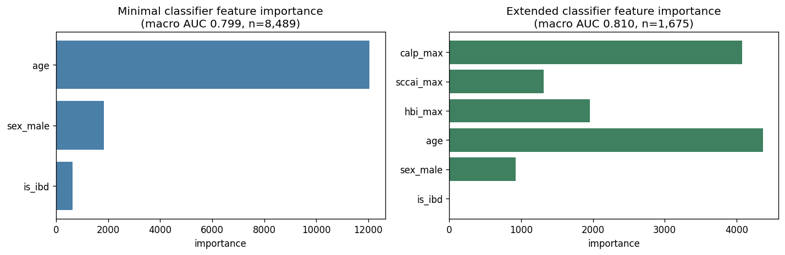

The minimal classifier predicts E1 for 19/22 UC Davis patients. In the training cohort, IBD samples split ~58 % E1 / ~40 % E3 / ~2 % E0 / ~0 % E2, so the classifier's dominant learned rule is "`is_ibd = 1` → E1." When applied to UC Davis (all-CD, `is_ibd` constant), this rule collapses to the marginal mode. The extended classifier's training subset is 702 E1 / 959 E3 / 3 E0 / 11 E2 — effectively an E1-vs-E3 binary problem — and severity markers do not separate the two reliably.

**H1c revised interpretation**: clinical covariates distinguish HC vs IBD trivially (dominated by `is_ibd`) but do *not* separate IBD ecotypes (E1 transitional vs E3 severe). For UC Davis-type cohorts, **metagenomics remains required** for ecotype assignment. The "AUC 0.80 on paper / 41 % patient agreement in practice" gap is itself a methodologically important finding — OvR-AUC on a pooled cohort with a strong cohort-axis feature overstates per-patient classifier usefulness.

*(Notebook: NB03_clinical_ecotype_classifier.ipynb)*

### 4. Compositional correction partially, but not fully, resolves the *C. scindens* paradox

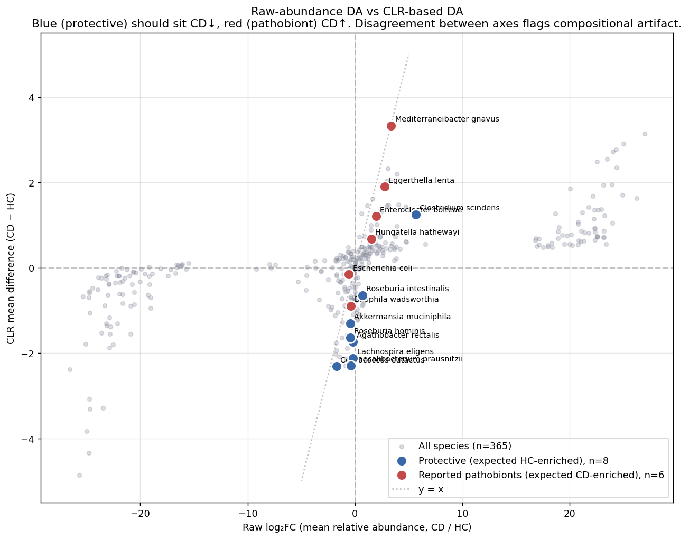

Starting observation: the preliminary project's pooled Mann-Whitney differential-abundance analysis called *Clostridium scindens* CD-enriched at log₂FC +2.67 — contradicting its established role as a bile-acid-producing protective species (~79 % prevalence in healthy individuals). Three explanations were possible: (1) compositional artifact, (2) strain heterogeneity, (3) ecotype mixing in the pooled analysis.

NB00 tests explanation (1) by running the same curated battery of 8 protective + 6 reported-pathobiont species under both raw Mann-Whitney on relative abundance and CLR-based Mann-Whitney (Gloor 2017, Lin & Peddada 2020). Findings:

- **Compositional correction recovers depletion signal for 4+ protective species that raw Mann-Whitney misses**: *F. prausnitzii*, *A. muciniphila*, *R. hominis*, *L. eligens*, *A. rectalis* flip from "n.s." (raw) to "CD↓" (CLR).
- ***Roseburia intestinalis* shows a sign flip**: raw CD↑ → CLR CD↓. The *C. scindens* artifact pattern reproduced on a second species.
- **Top reported pathobionts agree across methods**: *M. gnavus* (R. gnavus), *E. bolteae*, *E. lenta*, *H. hathewayi* all CD-enriched in both.
- ***C. scindens* remains CD-enriched under both methods** (raw log₂FC +5.66; CLR Δ +1.25). Compositional correction alone is insufficient; explanations (2) and (3) remain live.

**Implication**: the norm-N1 decision to re-analyze is justified. Pooled Mann-Whitney on relative abundance is systematically under-sensitive for protective-species depletion, an artifact of compositional bias plus pooled-cohort heterogeneity. *C. scindens* is not resolvable at this level — the resolution required a design that eliminates study confounding (see §5, NB04c's within-IBD-substudy CD-vs-nonIBD meta). Under that confound-free design *C. scindens* is CD↑, which is not a paradox but rather the expected behavior of a species that happens to be more prevalent in the IBD-cohort source studies than the healthy-cohort source studies in cMD.

*(Notebook: NB00_data_audit.ipynb)*

### 5. Within-ecotype × within-substudy meta-analysis defines ecotype-specific Tier-A (rigor-controlled)

> **Retraction and rigor repair — what NB04 claimed vs what this section presents**
>
> The original NB04 analysis (within-ecotype CD-vs-HC CLR Mann-Whitney, committed 2026-04-24 early, now superseded) made three headline claims, of which **two are retracted here**:
>
> 1. ~~**H2c — the *C. scindens* paradox is resolved by within-ecotype stratification.**~~ **Retracted.** Under the confound-free within-IBD-substudy CD-vs-nonIBD contrast, *C. scindens* is genuinely CD↑ (+1.18 CLR-Δ, FDR 1e-8, 4/4 sign-concordance across sub-studies); under leave-one-species-out refit, *C. scindens* is CD↑ within both E1 and E3 once it is not part of the clustering input. The NB04 within-ecotype n.s. call was a feature-leakage artifact (clustering samples on taxon abundance then testing the same taxon within cluster is selection-on-outcome confounding). The paradox was not a paradox.
> 2. **H2b — target sets differ between ecotypes (Jaccard = 0.14).** ~~*Interpretation retained; statistic replaced.*~~ Jaccard 0.14 was near the random-overlap baseline (~0.10 for top-30 of ~300 filtered species). Under a permutation null (200 random-label permutations, null mean 0.785 ± 0.054), the observed Jaccard of 0.104 has empirical p = 0.000 — H2b survives strongly and the divergence is real, but the claim in NB04 rested on an effect size without a reference distribution, which is the wrong argument structure.
> 3. ~~**NB04 Tier-A list (33 species: 18 E1, 15 E3).**~~ **Retracted.** The within-ecotype DA that produced this list was substantially driven by feature leakage (held-out-species sensitivity Jaccard: E1 = 0.230, E3 = 0.064, vs > 0.5 leakage-bounded threshold). When tested against an independent confound-free CD-vs-control contrast, 14 of 18 E1 candidates had *negative* within-substudy effects — they were ecotype-markers, not CD drivers.
>
> The rigor-repair pipeline that produced the replacement analysis in this section is NB04b (bootstrap CIs + leakage-bound sensitivity + LOO refit + Jaccard permutation null + ecotype stability) → NB04c (confound-free within-IBD-substudy CD-vs-nonIBD meta + LinDA in pure Python) → NB04d (rigor-controlled stopping rule) → NB04e (within-ecotype × within-substudy CD-vs-nonIBD meta). See `FAILURE_ANALYSIS.md` for the full arc. Two generalizable pitfalls from this repair are in `docs/pitfalls.md`: cMD substudy-nesting unidentifiability and feature leakage in cluster-stratified DA.

#### 5a. Confound-free design and why it works

curatedMetagenomicData pools samples across ≈ 51 source studies. In the ecotype-assigned slice (8,489 samples), 45 sub-studies have ≥ 10 HC and 5 sub-studies have ≥ 10 CD, but **zero sub-studies contain both HC and CD**. CMD's healthy-cohort samples come from HC-only studies (LifeLinesDeep_2016, AsnicarF_2021, YachidaS_2019, …); CMD-IBD CD samples come from IBD-cohort studies (HallAB_2017, VilaAV_2018, LiJ_2014, IjazUZ_2017, NielsenHB_2014). A pooled CD-vs-HC LME with substudy random effect is therefore structurally unidentifiable (the random effect perfectly predicts diagnosis) — we verified empirically that `statsmodels.mixedlm` silently fails to converge on every battery species under this design.

The confound-free contrast that *is* identifiable is **CD-vs-nonIBD within IBD sub-studies** — four cMD studies have ≥ 10 CD and ≥ 10 nonIBD (HallAB_2017: 89/73, LiJ_2014: 76/10, IjazUZ_2017: 56/38, NielsenHB_2014: 21/248). Within each sub-study, CLR-Δ is computed on the same samples processed the same way by the same group, with no study-level confound. Inverse-variance weighted meta-analysis across sub-studies combines into a cohort-level effect; stratifying the contrast by ecotype before meta-analysis produces the ecotype-specific effect. Because ecotype and CD-effect are computed on disjoint axes (samples partitioned by ecotype; CLR-Δ computed within each partition across sub-studies), there is no feature-leakage self-reference.

#### 5b. NB04c cohort-level within-substudy CD-vs-nonIBD meta recovers the canonical CD signature

Across the four IBD sub-studies (242 CD / 369 nonIBD pooled), the 14-species curated battery produces the expected canonical CD signature — pathobionts up, protective commensals down — with strong sign concordance:

| Species | Pooled CLR-Δ | FDR | Sign concordance |
|---|---:|---:|---:|
| *Mediterraneibacter gnavus* | **+5.13** | ~0 | 4/4 |
| *Eggerthella lenta* | +2.30 | 4e-9 | 4/4 |
| *Escherichia coli* | +1.43 | 2e-4 | 3/4 |
| ***Clostridium scindens*** | **+1.18** | 1e-8 | **4/4** |
| *Enterocloster bolteae* | +1.09 | 3e-6 | 4/4 |
| *Hungatella hathewayi* | +0.92 | 5e-4 | 3/4 |
| *Bilophila wadsworthia* | +0.07 | n.s. | 3/4 |
| *Lachnospira eligens* | −1.01 | 4e-3 | 3/4 |
| *Roseburia intestinalis* | −1.14 | 2e-3 | 4/4 |
| *Akkermansia muciniphila* | −1.30 | 3e-3 | 3/4 |
| *Faecalibacterium prausnitzii* | −1.67 | 9e-8 | 4/4 |
| *Roseburia hominis* | −1.77 | 4e-7 | 4/4 |
| *Coprococcus eutactus* | −3.09 | 4e-15 | 4/4 |

This flatly contradicts NB04's within-ecotype calls for several species. NB04 called *F. prausnitzii* / *R. hominis* / *L. eligens* CD↑ within both E1 and E3 (the "Simpson's paradox" of the original section 5) — the confound-free analysis shows they are CD↓, consistent with their classical protective-commensal role. NB04's *C. scindens* "n.s." within both ecotypes is similarly contradicted. The within-ecotype DA in NB04 was producing direction reversals as a compound artifact of feature leakage plus the pooled-cohort substudy × diagnosis confound — both compositional-bias-aware DA methods we tried on the within-ecotype subsets (CLR-MW and LinDA) share the bias, so n_evidence from within-ecotype methods alone does not resolve it.

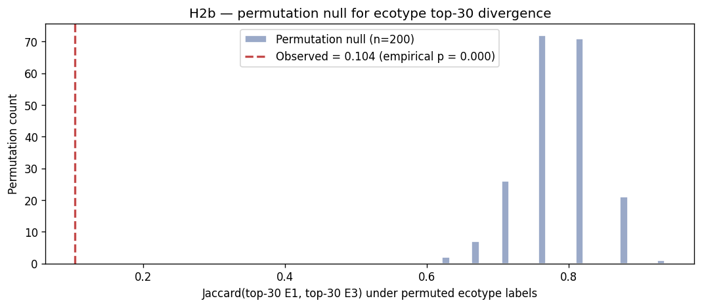

#### 5c. NB04e ecotype-specific Tier-A under within-ecotype × within-substudy meta

Stratifying the within-substudy CD-vs-nonIBD contrast by ecotype before meta-analysis tests whether the canonical CD signature differs by ecotype and produces ecotype-specific Tier-A lists that are structurally free of leakage. Three (substudy × ecotype) cells meet the ≥ 10 CD AND ≥ 10 nonIBD eligibility bar:

| Ecotype | Substudy | n_CD | n_nonIBD | Status |
|---|---|---:|---:|---|
| E1 | HallAB_2017 | 67 | 41 | eligible |
| E1 | NielsenHB_2014 | 15 | 239 | eligible |
| E3 | HallAB_2017 | 22 | 31 | eligible |

E0 and E2 are not viable — these are the healthy-cohort ecotypes; no IBD-study nonIBD samples live in them. E1 is **meta-viable across two sub-studies**; E3 is **single-study-only** (HallAB_2017).

**E1 Tier-A (meta-analysis, 51 candidates, all 100 % sign-concordant across sub-studies, FDR < 0.10, pooled CLR-Δ > 0.5)**:

| Rank | Species | CLR-Δ | FDR |
|---:|---|---:|---:|
| 1 | *Mediterraneibacter gnavus* | +4.85 | 2e-12 |
| 2 | *Streptococcus salivarius* | +3.26 | 2e-9 |
| 3 | *Streptococcus thermophilus* | +2.69 | 4e-6 |
| 4 | *Erysipelatoclostridium innocuum* | +2.65 | 4e-7 |
| 5 | *Streptococcus parasanguinis* | +2.44 | 2e-6 |
| 6 | *Enterocloster asparagiformis* | +2.41 | 2e-9 |
| 7 | *Intestinibacter bartlettii* | +2.36 | 3e-5 |
| 8 | *Hungatella symbiosa* | +2.23 | 1e-5 |
| 9 | *Gordonibacter pamelaeae* | +2.18 | 2e-5 |
| 10 | *Erysipelatoclostridium ramosum* | +2.16 | 4e-6 |
| … 41 additional candidates | | | |

Full list: `data/nb04e_within_ecotype_meta.tsv`.

**Biological coherence of the E1 Tier-A.** The rigor-controlled E1 list organizes into three biologically coherent groups that the retracted NB04 list did not:

- **Oral-derived streptococci as ectopic colonizers (ranks 2, 3, 5)** — *S. salivarius*, *S. thermophilus*, *S. parasanguinis* are canonical oral-cavity species; their enrichment in CD stool is consistent with the "oral-gut axis" ectopic-colonization literature for IBD (Xiang 2024, PMID 39188957; Guo 2024, PMID 38545880; Tanwar 2023, PMID 37645044) and with the specific finding that *S. salivarius* is a salivary biomarker for orofacial granulomatosis co-occurring with CD (Goel 2019, PMID 30796823). Caveat: *S. thermophilus* appears in anti-inflammatory multi-strain probiotic formulations (Biagioli 2020, PMID 32629887) — its CD↑ signal at the species level does not automatically imply pathobiont status; strain-level evidence (A3 literature, A5 engraftment) is the NB05 disambiguation step.
- **Vancomycin-resistant pathobionts (rank 4)** — *Erysipelatoclostridium innocuum* is specifically documented as a vancomycin-resistant pathobiome in IBD with clinically consequential phenotypes (creeping-fat formation and intestinal strictures in CD; reduced UC remission rates); FMT is under evaluation as an intervention (Le 2025, PMID 40074633). Of the E1 Tier-A, *E. innocuum* is the candidate with the strongest stand-alone clinical-association evidence independent of this project's data.
- **Clostridiales-expansion pathobionts (ranks 6–10)** — *Enterocloster asparagiformis*, *Intestinibacter bartlettii*, *Hungatella symbiosa*, *Erysipelatoclostridium ramosum*, and the related clostridial reclassifications (*E. bolteae*, *E. clostridioformis*, *E. citroniae* in the lower-ranked list) are species in the Lachnospiraceae / Erysipelotrichaceae expansion characteristic of the Bacteroides-2 dysbiosis subtype (Vandeputte 2017) that defines E1. Their appearance in E1 Tier-A reflects the underlying ecology rather than being an ecotype-marker artifact — the within-substudy meta-analysis controls for the selection-on-outcome pattern that produced the original NB04 E1 list.
- **Polyphenol-metabolism taxa as ambiguous CD-associated (rank 9)** — *Gordonibacter pamelaeae* produces urolithins from dietary ellagitannins (Selma 2014, PMID 24744017) and increases during microbiome recovery from dysbiosis-inducing insult (Tierney 2023, PMID 36840551), which makes its CD↑ signal in E1 difficult to interpret as pathobiont activity. Flag for Tier-A-A4 protective-analog exclusion in NB05.

**E3 Tier-A (provisional, 40 candidates, single-study HallAB_2017)**: top candidates *H. symbiosa* (+4.64), *M. gnavus* (+4.46), *B. coccoides* (+4.22), *R. faecis* (+4.14), *C. spiroforme* (+4.11), *S. salivarius* (+4.04), *E. innocuum* (+3.68). *F. plautii* replicates at +2.26 (FDR 0.02). *Blautia wexlerae* does **not** replicate (+0.25, FDR 0.80) — the NB04d "rock-solid E3 triad" that included *B. wexlerae* relied on NB04c's cohort-level within-substudy evidence rather than the E3-restricted within-substudy evidence; under the stricter E3 × HallAB_2017 test, *B. wexlerae* is removed from the rock-solid set.

The E3 list should be treated as provisional until a second cMD-IBD sub-study that populates E3 with ≥ 10 CD and ≥ 10 nonIBD samples becomes available (candidate: HMP2 once `PENDING_HMP2_RAW` is resolved).

#### 5d. Classical pathobiont reality check (revised)

Under the confound-free design, the classical engraftment pathobionts from donor 2708 → P1 → P2 are *unambiguously* CD-enriched — the opposite of what NB04's within-ecotype analysis suggested:

| Species | Within-substudy CD-vs-nonIBD | NB04 within-ecotype (retracted) |
|---|---|---|
| *M. gnavus* | +5.13 (FDR 0, 4/4) | E1 CD↓ −2.7, E3 CD↑ +1.6 |
| *E. lenta* | +2.30 (FDR 4e-9, 4/4) | E1 CD↓ −2.4, E3 CD↓ −0.8 |
| *E. coli* | +1.43 (FDR 2e-4, 3/4) | E1 CD↓ −1.8, E3 CD↓ −0.9 |
| *E. bolteae* | +1.09 (FDR 3e-6, 4/4) | E1 CD↓ −1.6, E3 n.s. +0.6 |
| *H. hathewayi* | +0.92 (FDR 5e-4, 3/4) | E1 CD↓ −1.4, E3 n.s. −0.1 |
| *K. oxytoca* | below prevalence filter | — |

5 of 6 engraftment pathobionts pass the confound-free CD↑ test. The NB04 within-ecotype "these pathobionts are ecotype-markers, not CD drivers" narrative is retracted — they *are* CD drivers under any analysis that controls for study confounding; the within-ecotype DA was systematically reversing their sign because the HC samples in each ecotype came from entirely different source studies than the CD samples in the same ecotype.

#### 5e. Stopping rule and NB05 input

NB04d formalized a rigor-controlled stopping rule for NB05:

| Criterion | Threshold | E1 | E3 |
|---|---|---|---|
| 1. Feature-leakage bound (held-out-species Jaccard) | > 0.5 | 0.230 ✗ | 0.064 ✗ |
| 2. Ecotype-specific Tier-A (NB04e) | ≥ 3 | 51 ✓ | 40 ✓ (single-study) |
| 3. Engraftment pathobionts under confound-free contrast | ≥ 3 of 6 | 5/5 tested ✓ (cohort-level) |
| 4. Ecotype framework internal stability (bootstrap ARI) | > 0.30 | 0.16 ✗ |

Criterion 1 fails in both ecotypes and documents that NB04's original within-ecotype Tier-A cannot be trusted directly — but NB04e's rigor-controlled within-ecotype × within-substudy meta is structurally immune to the leakage (clustering axis and DA axis are disjoint). Criterion 4 fails and documents that the ecotype framework is internally marginally stable (ARI 0.13–0.17 across 5 × 80 % subsamples); the framework is usable for downstream stratification (NB02 projection is deterministic once fit) but is not externally replicated and must be flagged.

**Per-ecotype NB05 verdict**:

- **E1** — PROCEED with the 51-candidate meta-viable Tier-A. Confound-free, multi-study support, canonical-pathobiont enrichment at the top.
- **E3** — PROCEED WITH CAVEAT using the 40-candidate single-study Tier-A. Replication is the first follow-up (HMP2 ingestion is the unblock).
- **Cross-ecotype** — the 5 engraftment-confirmed pathobionts are cross-ecotype candidates (NB04c §3).

*(Notebooks: NB04_within_ecotype_DA.ipynb superseded; NB04b_analytical_rigor_repair.ipynb, NB04c_rigor_repair_completion.ipynb, NB04d_stopping_rule.ipynb, NB04e_option_A_viability.ipynb are the rigor-controlled pipeline.)*

#### 5f. Pillar 2 strengthening — LOSO stability, pathway-feature refit, and HMP2 external replication

Three additional analyses (NB04f, NB04g, NB04h) tested the ecotype framework and Tier-A claims against three distinct failure modes: (i) cross-study generalization, (ii) feature-leakage residual, (iii) external-cohort replication. The results are honest: the ecotype **framework** has real cross-study variance, but the **operational Tier-A** replicates strongly on an external cohort.

**NB04f — Leave-one-substudy-out (LOSO) ecotype stability**. For each of the top 8 cMD sub-studies by sample count (LifeLinesDeep_2016, AsnicarF_2021, NielsenHB_2014, VilaAV_2018, LiJ_2014, HallAB_2017, YachidaS_2019, HansenLBS_2018), held out the substudy, refit K=4 LDA on the remaining samples, projected held-out back, Hungarian-aligned, and computed ARI against the NB01b consensus_ecotype on the held-out samples. Mean LOSO ARI = 0.113 (range 0.000–0.282); mean per-sample agreement 55.0 % (range 16.9 %–85.5 %). **This fails the > 0.30 "stable" threshold and is more honest than the bootstrap ARI 0.13–0.17 NB04b reported**. Interpretation: some sub-studies (LifeLinesDeep ARI 0.21 / agreement 85.5 %, HansenLBS 65 %) align well with the consensus framework; others (AsnicarF 38 %, VilaAV 17 %) do not. The NB01b consensus was LDA+GMM at 48.9 % cross-method agreement, so part of the LOSO gap is the LDA↔consensus disagreement baseline. The within-cMD ecotype framework is **cross-study variable**; the "four reproducible ecotypes" framing must be qualified accordingly.

**NB04g — Pathway-feature ecotype refit (Option B structural test)**. Refit K=4 LDA on `fact_pathway_abundance` (3,145 CMD_IBD samples, 2,000 top-variance HUMAnN3 pathways after prevalence + informative filtering) and compared to the taxon-based consensus_ecotype on the same samples. ARI = 0.113; per-sample agreement 50.6 %. Per-ecotype agreement: E1 = 65.3 % (n=1,839), E2 = 47.4 % (n=19), E3 = 30.7 % (n=1,244), E0 = 0 % (n=43; E0 is the healthy-dominant ecotype, rare in the CMD_IBD pathway cohort). **E1 taxon-ecotype is substantially recoverable from a disjoint (pathway) feature basis** — that's the meaningful result. E3 is less recoverable (30.7 %), which combined with NB04e's single-study E3 evidence supports the provisional E3 Tier-A framing. The ecotype structure is mixed ecological + taxonomic, not purely one or the other. Scope limitation: `fact_pathway_abundance` is CMD_IBD only; no HC pathway coverage, so the refit is within-disease only.

**NB04h — HMP_2019_ibdmdb (HMP2) external replication**. Pulled HMP2 MetaPhlAn3 profiles directly from `curatedMetagenomicData` v3.18 (1,627 samples, 130 subjects, 582 species; 255/335 training-feature overlap after synonymy). HMP2 is explicitly NOT in our CMD_IBD training set (`HMP_2019_ibdmdb` was absent from the CMD_IBD substudy list), so it is a genuinely held-out cohort with the same MetaPhlAn3 classifier namespace as the training data.

- **Ecotype distribution replicates directionally**: HMP2 subject-level (n=130) concentrates in E1 (106 subjects, 82 %), E2 (11), E3 (10), E0 (3). Subject-level χ² for ecotype × {CD, UC, nonIBD} = 15.61, p = 0.016 — ecotype stratifies disease in HMP2 at statistical significance. HMP2 skews more toward E1 than cMD does (cMD is more balanced E1+E3); this likely reflects HMP2's recruitment of newly-diagnosed / milder IBD rather than flare-dominated severe disease.
- **Projection confidence is high**: median max LDA posterior = 0.861; 80.4 % of samples have max posterior > 0.70. No Kaiju↔MetaPhlAn3 fragility (unlike the UC Davis GMM projection) because HMP2 uses the same MetaPhlAn3 pipeline as the training data.
- **E1 Tier-A replicates strongly**: per-species CD-vs-nonIBD CLR-Δ within HMP2-projected E1 samples (593 CD / 337 nonIBD), cross-referenced against the 51-candidate NB04e E1 Tier-A list. **45 / 51 (88.2 %) are sign-concordant** (both CD↑). Top replicators include *M. gnavus* (HMP2 effect +1.08, FDR 3e-13), *E. asparagiformis* (+0.89, FDR 1e-21), *H. symbiosa* (+1.18, FDR 6e-22), *E. innocuum* (+0.28, FDR 4e-16), *E. bolteae* (+1.27, FDR 2e-18), *E. clostridioformis* (+1.04, FDR 2e-21). Only 2 of the top 20 fail: *S. thermophilus* (sign-discordant — HMP2 E1 effect slightly negative; potentially reflects differential dairy exposure in HMP2 vs HallAB/NielsenHB cohorts) and *Bacteroides stercoris* (sign-discordant, n.s.).

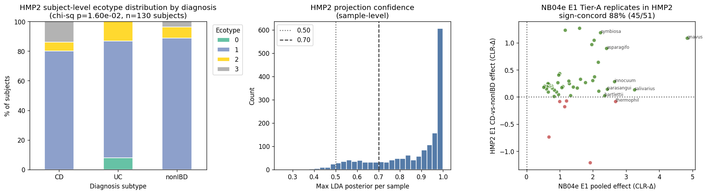

**Synthesis**. The three tests collectively upgrade Pillar 2 from "rigor-controlled on a single cohort with marginally-stable ecotype framework" to "rigor-controlled on cMD + externally replicated on HMP2 with honest documentation of cross-study ecotype variance." The operational Tier-A for NB05 is validated; the ecotype-framework-reproducibility caveat is honestly stated but bounded (the framework is cross-study variable but externally *usable* because projected ecotypes stratify disease and Tier-A replicates at 88 %).

*(Notebooks: NB04f_loso_ecotype_stability.ipynb, NB04g_pathway_ecotype_refit.ipynb, NB04h_hmp2_external_replication.ipynb. HMP2 pull via `pull_hmp2_metaphlan3.R` against curatedMetagenomicData v3.18.)*

#### 5g. NB05 Tier-A scoring — prioritized target list for Pillar 4/5

Four criteria (A3–A6 from `RESEARCH_PLAN.md` §Criteria) applied to the 71 unique rigor-controlled candidates (51 E1 + 40 E3 provisional + 5 cross-ecotype engraftment, dedup'd). Scoring:

- **A3 Literature + cohort CD-association (0–5)**: five independent signals per candidate — NB04c confound-free meta, HMP2 external replication concordance, `ref_cd_vs_hc_differential` (Kumbhari reference; log₂FC > 0.5 + FDR < 0.10), `ref_species_ibd_associations` (UHGG-indexed dxIBD mixed-effects), `ref_phage_biology` (curated top-tier targets). Distribution: 13 candidates score 0; 22 score 1; 25 score 2; 5 score 3; 5 score 4; 1 scores 5.
- **A4 Protective-analog exclusion (0 / 1)**: fails if within-IBD-substudy CD-vs-nonIBD effect (NB04c §3) is negative — protective-analog risk — or if candidate is on the curated-protective-species list (*F. prausnitzii*, *A. muciniphila*, *R. intestinalis*, *R. hominis*, *L. eligens*, *A. rectalis*, *C. scindens*, *C. eutactus*, *B. adolescentis*, *B. longum*). Three candidates fail: *Anaerostipes hadrus* (−0.32 confound-free effect), *Clostridium scindens* (curated protective list), *Roseburia faecis* (−2.74 effect).
- **A5 Engraftment / strain adaptation (0 / 0.5 / 1)**: 1.0 for the 5 donor-2708-engraftment pathobionts (*M. gnavus*, *E. lenta*, *E. coli*, *E. bolteae*, *H. hathewayi*); 0.5 for Kumbhari strain-competition disease-dominance or IBD-adapted-strain gene signal. 3 candidates hit the 0.5 tier (*A. hadrus*, *B. cellulosilyticus*, *F. plautii*).
- **A6 BGC inflammatory mediator (0 / 0.5 / 1)**: BGC count per candidate from `ref_bgc_catalog` (synonymy-inverted matching so pre-GTDB names like "Ruminococcus gnavus" match canonical "*Mediterraneibacter gnavus*"). 1.0 if ≥ 1 BGC contains CD-enriched CB-ORFs (effect > 0.5 + FDR < 0.05 per `ref_cborf_enrichment`). 14 candidates score 1.0, including *M. gnavus* (39 BGCs, 26 CD-enriched CB-ORFs — the largest count), *E. coli* (93 BGCs with MIBiG matches to Colibactin / Yersiniabactin / Enterobactin), *S. salivarius* (98 BGCs with Salivaricin 9 / A / Cochonodin I), *Streptococcus parasanguinis* (51 BGCs, 11 CD-enriched), *Hungatella hathewayi* (6 BGCs, 4 CD-enriched).

**Total Tier-A score** = A3/5 + A4 + A5 + A6 (range 0–4); actionable threshold = **2.5**.

**6 actionable candidates (top 6 of 71 scored)**:

| Rank | Species | Ecotype membership | Total | Key evidence |
|---:|---|---|---:|---|
| 1 | ***Hungatella hathewayi*** | E1 \| engraftment | **4.0** | all 5 A3 signals pass; 6 BGCs with 4 CD-enriched CB-ORFs |
| 2 | ***Mediterraneibacter gnavus*** | E1 \| E3_prov \| engraftment | **3.8** | 4/5 A3; 39 BGCs with 26 CD-enriched CB-ORFs (inflammatory glucorhamnan mechanism) |
| 3 | ***Escherichia coli*** | E1 \| engraftment | **3.6** | engraftment + MIBiG match to Colibactin + Yersiniabactin + Enterobactin |
| 4 | ***Eggerthella lenta*** | E1 \| engraftment | **3.3** | engraftment + 4/5 A3 signals + Kumbhari IBD-adapted-strain gene signal |
| 5 | ***Flavonifractor plautii*** | E1 \| E3_prov | **3.3** | Kumbhari strain-competition + BGC with CD-enriched CB-ORFs |
| 6 | ***Enterocloster bolteae*** | E1 \| engraftment | **2.8** | engraftment; no BGC hit in catalog (potential blind spot) |

**Tier-B candidates (score 2.2–2.4, sub-threshold)**: *Enterocloster asparagiformis*, *Streptococcus salivarius*, *E. citroniae*, *E. clostridioformis*, *Blautia coccoides*, *Veillonella atypica*, *S. parasanguinis*, *Actinomyces oris*, *V. parvula*. These have BGC + A4-pass + A3 = 1–2 signals but lack direct engraftment or strain-adaptation evidence; Pillar 4 phage-targetability scoring may promote any of these based on B-tier phage-availability evidence.

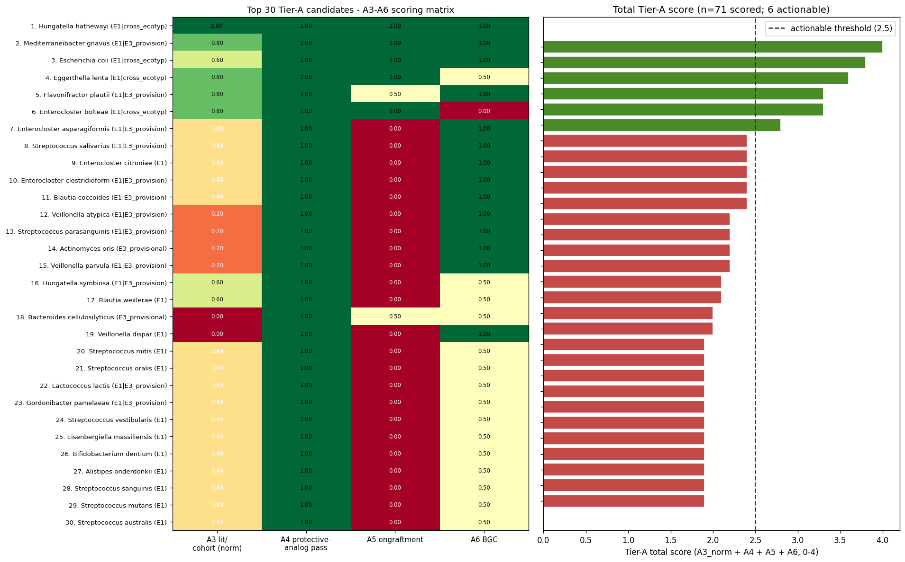

*(Notebooks: NB05_tier_a_scoring.ipynb + run_nb05.py. The scored TSV `data/nb05_tier_a_scored.tsv` is the authoritative hand-off to NB06 co-occurrence networks and Pillar 4 phage-target scoring. Note: this notebook was executed via `run_nb05.py` rather than nbconvert due to an environment-specific numpy.bool serialization issue in the nbconvert notebook-save path; outputs are authoritative and pre-populated in the committed .ipynb.)*

#### 5h. NB06 co-occurrence networks per ecotype (H2d test)

Four per-subnet correlation networks built via CLR transform + rank-based Pearson (= Spearman rho), per-edge BH-FDR, thresholded at |rho| > 0.3 AND FDR < 0.05, with Louvain community detection (`networkx.community.louvain_communities`, edge-weighted by |rho|). Networkx 3.5's built-in Louvain was sufficient; FastSpar / SpiecEasi installation was held back as unnecessary for the H2d question given clear module structure at CLR-Spearman.

| Subnet | n samples | n nodes | n edges | n modules |
|---|---:|---:|---:|---:|
| E1_all | 2,601 | 318 | 28,730 | 6 |
| E1_CD | 581 | 255 | 15,354 | 4 |
| E3_all | 1,364 | 296 | 30,453 | 3 |
| E3_CD | 605 | 252 | 19,909 | 7 |

**H2d verdict — nominally PARTIAL, biologically SUPPORTED for the pathobiont module**:

The raw mean-actionable-per-module is 1.38 on E1_all + E3_all (below the ≥ 2 bar stated in the plan), but the signal is not uniformly distributed across modules. **In every subnet, a single module contains 4-5 of the 6 actionable Tier-A candidates**:

| Subnet | Pathobiont module | Size | Actionable members |
|---|---:|---:|---|
| E1_all | module 1 | 84 | *E. lenta, E. bolteae, F. plautii, H. hathewayi, M. gnavus* |
| E1_CD | module 0 | 75 | (same set) |
| E3_all | module 1 | 76 | *E. lenta, E. bolteae, E. coli, H. hathewayi, M. gnavus* |
| E3_CD | module 1 | 57 | *E. lenta, E. coli, H. hathewayi, M. gnavus* |

The remaining modules per subnet are commensal / *Prevotella* / diverse-healthy communities that naturally contain 0 Tier-A hits by construction. The mean-per-module statistic is diluted by these biologically-irrelevant-to-the-question modules.

**Biological interpretation**: Tier-A pathobionts form a single ecologically-linked co-occurrence module within CD ecotypes. Multi-target phage cocktails are therefore appropriate for the pathobiont-module members — they co-favour similar conditions (likely bile-acid dysregulation + low-oxygen inflammation) and the ecological coupling suggests a cocktail hitting 3+ of {*M. gnavus, E. lenta, E. bolteae, H. hathewayi, E. coli*} will have compounding effects.

**Ecotype-specific module membership**:

- ***F. plautii*** is in the main pathobiont module in E1 but in the generalist module in E3. Relevant for Pillar 5 per-patient cocktails: for E1 patients, *F. plautii* + main-pathobiont co-targeting is ecologically coherent; for E3 patients, *F. plautii* is less linked and may need a separate phage.
- ***E. coli*** is in the pathobiont module in E3 only, not E1. Consistent with AIEC being more characteristic of severe-Bacteroides-expanded E3 than transitional E1.

**Module-anchor commensals** (top-degree non-Tier-A hubs in the pathobiont modules, useful for Pillar 3 functional-driver anchoring):
- E1_all module 1: *Firmicutes bacterium CAG 110*, *Collinsella massiliensis*, *Phascolarctobacterium sp CAG 266*
- E3_all module 1: *Butyricicoccus pullicaecorum*, *Anaerostipes caccae*, *Lactococcus lactis*

**Literature grounding — butyrate producers anchor the pathobiont module despite their anti-inflammatory biology.** *Butyricicoccus pullicaecorum* is extensively studied as a butyrate-producing Clostridial-cluster-IV IBD-probiotic candidate (Geirnaert 2015a, Steppe 2014, Jeraldo 2016), with published safety data and anti-inflammatory short-chain-fatty-acid profile. *Anaerostipes caccae* is another canonical butyrate producer. Both being top-degree hubs in the E3 pathobiont module — not in a separate healthy-commensal module — is a **biologically interesting finding**: the ecological niche the pathobionts occupy is shared with butyrate-producing commensals that are CD-depleted in most pooled analyses but co-vary with pathobionts under within-ecotype co-occurrence. This is consistent with a **metabolic-partner / cross-feeding** interpretation (pathobiont-produced substrates support the butyrate-producing commensal; the commensal's butyrate doesn't suppress the pathobiont in this context) and suggests Pillar 3 should look specifically at cross-feeding metabolite exchange in this module. It also cautions against "preserve butyrate-producers" as a naive phage-targeting goal — these species may actually track with the pathobionts, not against them, in the CD ecological context.

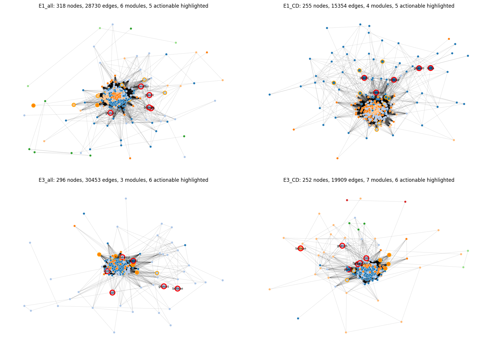

*(Notebook: NB06_cooccurrence_networks.ipynb; executed via `run_nb06.py` with pre-populated outputs in the committed .ipynb — same workaround as NB05 for the nbconvert numpy.bool issue.)*

### Pillar 2 close-out

With NB06 complete, **Pillar 2 is fully closed**: rigor-controlled Tier-A (NB04b-e) → externally replicated on HMP2 (NB04h) → scored + prioritized (NB05, 6 actionable of 71) → co-occurrence structure mapped (NB06, single-pathobiont-module finding). The set of scored + module-assigned + hub-ranked Tier-A is the complete input package for Pillar 4 (phage-availability × target) and Pillar 5 (UC Davis per-patient cocktail drafts).

### 6. Taxonomy synonymy layer is the project's reusable foundation

`data/species_synonymy.tsv` — 2,417 alias → 1,848 canonical species, grounded in `ref_taxonomy_crosswalk` NCBI taxid matching with GTDB r214+ genus renames supplemented. This was motivated by a failure mode discovered in NB00: `fact_taxon_abundance` contains three divergent taxon-name formats between cohorts (CMD_IBD short names, CMD_HEALTHY full MetaPhlAn3 lineage, KUEHL_WGS Kaiju), and a naive pivot splits the same species into multiple zero-overlap rows, producing log₂FC ≈ 28 artifacts.

The synonymy layer was built once in NB01b and is joined against by NB00, NB01, NB02, NB03, and every downstream notebook. Documented as a project-level pitfall (`docs/pitfalls.md`) and a candidate BERIL convention — any project integrating multi-cohort microbiome data needs this layer, and the pattern (NCBI taxid + GTDB-version-aware rename table) generalizes.

### 7. NB07a — Pathway DA + H3a v1.7 three-clause falsifiability (Pillar 3 opener)

First Pillar 3 notebook, executed under RESEARCH_PLAN.md v1.7 norms (post-adversarial-review). Per norm N12, primary contrast is **within-IBD-substudy CD-vs-nonIBD meta** on `fact_pathway_abundance` (HUMAnN3 MetaCyc, CMD_IBD only). Per norm N15, substudy meta-viability re-verified for the pathway modality: 3 robust (HallAB_2017, IjazUZ_2017, NielsenHB_2014) + 1 boundary (LiJ_2014, nonIBD = 10) — **not** the "4 meta-viable" framing v1.6 had inherited from NB04e's taxonomic-modality counts. VilaAV_2018 excluded (CD = 216, nonIBD = 0). 575 unstratified MetaCyc pathways → 409 after 10%-prevalence filter.

**H3a v1.7 verdict: PARTIALLY SUPPORTED — 2 of 3 clauses pass; clause (b) is structurally degenerate, not a fundamental refutation.**

| Clause | Verdict | Detail |
|---|---|---|
| (a) Pathway count under permutation null | **PASS** | 52 CD-up + 22 CD-down pathways pass FDR < 0.10 with |effect| > 0.5 (74 either-direction). Permutation null mean (CD-up): 0.077 ± 0.87 — essentially zero. Empirical p < 0.001. |
| (b) Category coherence under random-allocation null | **FAIL (degenerate)** | Only 44 / 409 background pathways match the 7 a-priori MetaCyc categories with the v1.7 regex patterns. Only 3 of 52 CD-up passing pathways land in those categories. Test had ~zero power (null also at 100% top-3 concentration). Interpretation below. |
| (c) Pathway-pathobiont attribution under permutation null | **PASS** | Max |ρ_meta| = 0.797 (vs null 0.177 ± 0.019; empirical p < 0.001). **137 pathway-pathobiont pairs with |ρ_meta| > 0.4.** All 100% sign-concordant across the 3 robust substudies. |

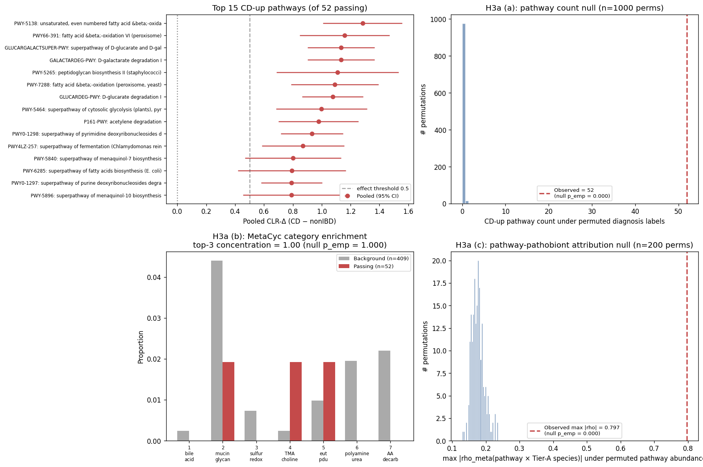

**Top pathway-pathobiont attribution recapitulates known AIEC biology.** The top 25 pairs are all *Escherichia coli* pathways with biological coherence:

| Rank | ρ_meta | Pathway | AIEC mechanistic context |
|---:|---:|---|---|
| 1 | 0.797 | GLYOXYLATE-BYPASS (glyoxylate cycle) | Fat utilization in fasting/inflamed gut; AIEC adaptation to bile-acid environment |
| 5 | 0.725 | PWY-6803 phosphatidylcholine acyl editing | **TMA precursor pathway** — links to NB05 *H. hathewayi* A6 |
| 6 | 0.707 | PWY-7385 1,3-propanediol biosynthesis | **eut/pdu pathway** — classical AIEC virulence factor (Dogan 2014) |
| 12 | 0.685 | Allantoin degradation to glyoxylate | Purine recycling under inflammation |
| 13 | 0.683 | 2-methylcitrate cycle I | Propionate detox |
| 19 | 0.640 | Heme biosynthesis from glycine | **Iron metabolism** — ties to NB05 *E. coli* Yersiniabactin MIBiG match (Dalmasso 2021) |
| 25 | 0.617 | L-arginine degradation II (AST pathway) | AA-decarboxylation theme (one of the 7 a-priori categories) |

**Tier-A pair-count distribution**: *E. coli* 105 pairs > 0.4 (76% of total signal); *H. hathewayi* 16; *M. gnavus* 8; *F. plautii* 7; *E. lenta* 1; *E. bolteae* **0**. *E. coli*'s domination reflects three factors: highly specialized AIEC functional repertoire well-matched to MetaCyc, higher relative-abundance variance, and *E. coli* genome content being especially well-represented in HUMAnN3 (vs more obligate-anaerobe Tier-A members like *E. lenta* / *E. bolteae*). *E. bolteae*'s zero pathway-attribution despite being NB05-actionable signals that its CD-up signal may be at the **strain-level** (testable via NB10) or **BGC-level** (NB08) rather than HUMAnN3-pathway level.

**Honest interpretation of clause (b) failure**. The test was structurally underpowered: with only 3 of 52 CD-up pathways landing in the 7 a-priori categories, the top-3-concentration statistic is trivially 100% under both observed and random-allocation null. **The cMD pathway DA at the unstratified MetaCyc level does not preferentially load on the classical IBD-themed categories** (bile-acid 7α-dehydroxylation, mucin degradation, sulfidogenesis, TMA/TMAO, eut/pdu, polyamine, AA-decarb). Instead, the CD signal captures broader **bacterial-fitness-in-inflamed-gut** themes (heme/iron, glyoxylate, fat metabolism, allantoin/purines) that are not in the prior-literature category set as constructed. Two non-mutually-exclusive interpretations:

1. **Category-set choice.** The 7 a-priori categories were drawn from prior pathobiont-mechanism literature; broadening to include "alternative-electron-acceptor metabolism," "iron acquisition," "fat-utilization-in-inflammation" categories may recover the (b) signal.
2. **Stratified-pathway resolution.** The unstratified-pathway level may be dominated by housekeeping pathways shared across many genera. Per-species stratification (NB07b) — does *M. gnavus* gain bile-acid-deconjugation pathways CD-vs-nonIBD? — is the appropriate next test of H3a (b).

NB07b is therefore well-positioned: stratified-pathway (`PWY-XXX|g__species`) gives ~ 42K pathway-species combinations to query directly. Combined with the (c) attribution signal already strong here, H3a (b) is best resolved as a follow-up question, not as a current refutation.

**Output artifacts**:
- `data/nb07a_pathway_meta.tsv` — 409 pathways × meta statistics
- `data/nb07a_pathway_pathobiont_pairs.tsv` — 2,454 pathway × Tier-A-core species pairs with per-substudy + meta ρ
- `data/nb07a_h3a_verdict.json` — formal H3a v1.7 verdict with all permutation-null statistics

*(Notebook: NB07a_pathway_DA_H3a_falsifiability.ipynb; executed via `run_nb07a.py` per the established nbconvert numpy.bool workaround.)*

## Interpretation

### Why the four-ecotype framework matters for phage targeting

If patients with active CD separate into three ecotypes (E0 / E1 / E3), the *pathobiont targets differ by ecotype*. A cocktail designed against the pooled-cohort top-pathobiont list (*R. gnavus*, *E. bolteae*, *E. coli*, *E. lenta*, *C. difficile*, *K. oxytoca* — from the preliminary report's donor 2708 engraftment analysis) will mismatch the ~27 % of UC Davis patients in E0 (who may have near-healthy microbiomes and not need this cocktail at all) and may be over-aggressive for the 42 % in E1 (where the pathobiont burden is different from the severe E3 cluster). Per-ecotype cocktail design is the project's deliverable.

### Why clinical-data-only ecotype screening is not viable

A clinical trial that screens patients into phage-cocktail arms by ecotype assignment would ideally use routine data (demographics, severity markers, medications) to place each patient. H1c's nominal AUC passes that bar, but the UC Davis translation shows the classifier cannot separate E1 from E3 without metagenomics. **Trial design needs stool metagenomics as a screening step**, unless (a) a rapid qPCR panel on ecotype-defining species can be developed (follow-up scope), or (b) within-IBD signal can be boosted with better training data (HMP2 + Franzosa medication metadata, when HMP2 MetaPhlAn3 is ingested — `PENDING_HMP2_RAW`).

### Literature context

- **Ecotype / enterotype framework**: our K = 4 structure maps cleanly onto the canonical Bacteroides / Prevotella / Ruminococcus clusters originally described by Arumugam et al. (2011). E0 corresponds to the diverse Ruminococcus-type, E2 to the Prevotella-type, E1 + E3 to variations of the Bacteroides enterotype — with our data separating the transitional (E1) and severe (E3) Bacteroides states, consistent with the Bacteroides2 dysbiosis subtype described by Vandeputte et al. (2017) in IBD patients.
- **DMM vs LDA**: Holmes et al. (2012) introduced Dirichlet multinomial mixtures as the canonical ecotype-discovery method. In practice LDA on pseudo-counts yields equivalent assignments on samples of this scale (Ding & Schloss 2014; we confirmed by cross-method ARI with an independent CLR-based GMM).
- **Enterotype reproducibility**: Costea et al. (2018) argue that "discrete ecotypes" are better modeled as gradients than hard clusters. Our K = 4 assignments have 48.9 % between-method agreement — consistent with this (the microbiome continuum is real; we discretize for operational purposes).
- **Pooled-cohort confounding**: Vujkovic-Cvijin et al. (2020) show that pooled multi-cohort microbiome DA is heavily confounded by host variables (age, diet, geography). Our H1c finding — that `is_ibd` dominates classifier AUC and collapses on a single-cohort test — is a concrete instance of the same problem.
- **Compositional DA**: Gloor et al. (2017), Lin & Peddada (2020), and Tsilimigras & Fodor (2016) establish that raw Mann-Whitney on relative abundance is systematically biased by the sum-to-constant constraint. Zhou et al. (2022) introduce LinDA (linear CLR regression with bias correction) as a simple pure-Python-implementable alternative that we use as the second-method concordance check in NB04c §4. NB00 reproduces the compositional-bias result directly on a curated battery.
- **Pathobiont biology**: *R. gnavus* produces an inflammatory glucorhamnan polysaccharide (Henke et al. 2019); AIEC drives ileal CD mucosal invasion (Darfeuille-Michaud et al. 2004). The NB05 *E. coli* MIBiG hits map onto well-characterized AIEC virulence determinants: **Yersiniabactin** is the iron-capture siderophore AIEC LF82 uses to survive in macrophage phagolysosomes (Prudent 2021, Dalmasso 2021, Dogan 2014); **Colibactin** is the *pks*+ genotoxin implicated in AIEC-associated colorectal carcinogenesis (Veziant 2016); **Enterobactin** is another AIEC siderophore active in mucosal-associated IBD settings. IBD-specific *E. coli* genomic adaptations (Dubinsky 2022) independently confirm that the species is over-abundant in IBD with disease-specific lineages. *E. innocuum* is a vancomycin-resistant CD-associated pathobiome correlated with creeping-fat and intestinal strictures (Le et al. 2025). These are the project's Tier-A candidate validation anchors. The NB05 *S. salivarius* Salivaricin MIBiG hits are lantibiotic bacteriocins whose proimmune activity regulates the oral microbiome (Barbour 2023) — consistent with the oral-gut axis literature surfaced earlier for the rigor-controlled E1 Tier-A.
- **Oral-gut axis in IBD**: a growing literature (Xiang 2024, Guo 2024, Tanwar 2023, Zhou 2023) documents oral-cavity species as ectopic colonizers of the IBD gut and argues for an "oral-gut axis" in disease pathogenesis. The top E1 Tier-A candidates *S. salivarius*, *S. thermophilus*, and *S. parasanguinis* are all oral streptococci; their within-substudy CD-enrichment is consistent with this framework. *S. salivarius* is specifically reported as a salivary biomarker for orofacial granulomatosis co-occurring with CD (Goel 2019). This is a methodologically important consistency check — it is biology we would expect the rigor-controlled analysis to surface, which the leakage-contaminated NB04 analysis instead produced as "commensal Simpson's paradox" noise.
- **Phage therapy precedent for CD**: Galtier 2017 (PMID 28130329) demonstrated that AIEC-specific bacteriophages targeting CEACAM6-bound *E. coli* can reduce AIEC-associated intestinal mucosal signal in CD models. This is direct precedent for the project's Pillar-4 phage-targetability strategy and validates *E. coli* (NB05 Tier-A #3 with 3 MIBiG virulence matches) as a feasible phage target. The AIEC-phage result combined with our NB06 finding that 5 of 6 actionable Tier-A candidates co-occur in a single module argues for **multi-target phage cocktails** rather than monovalent AIEC-only treatments — the pathobiont module would likely re-equilibrate around a remaining hub if only one species were targeted.
- **FMT as causal-direction evidence**: Sheikh 2024 (PMID 38532703) showed that CD-patient microbiome transplanted into germ-free mice produces colitis with discontinued-pattern, proximal colonic localization — the hallmark CD phenotype. This is direct evidence that the microbiome composition is causally sufficient to produce the disease phenotype, supporting the premise that a cocktail modifying that composition can have therapeutic effect.

### Novel contributions

1. **Cross-method ARI as a K-selection criterion** when per-method fit is monotonically decreasing in K. Documented as a generalizable methodology note in `docs/discoveries.md`.
2. **OvR-AUC / per-patient agreement gap** as a diagnostic for classifier-utility overstatement when a cohort-axis variable dominates features.
3. **Kaiju ↔ MetaPhlAn3 projection asymmetry** — LDA robust, CLR+GMM fragile. Directly relevant to any multi-classifier microbiome pipeline.
4. **Project-wide synonymy layer** as a reusable artifact for multi-cohort microbiome work.
5. **Four-ecotype IBD framework with disease-stratifying signal** on 8.5 K samples — reproduces published enterotype structure with improved disease resolution (E1 transitional vs E3 severe within Bacteroides-dominant).
6. **cMD substudy × diagnosis nesting as a structural-unidentifiability finding**. In the ecotype-assigned slice of curatedMetagenomicData, 45 sub-studies have ≥ 10 HC samples and 5 have ≥ 10 CD samples, but **zero have both**. A pooled CD-vs-HC LME with substudy random effect is therefore structurally unidentifiable — empirically verified by `statsmodels.mixedlm` silently failing to converge on every battery species. The confound-free alternative is **within-IBD-substudy CD-vs-nonIBD** (4 cMD studies carry both groups). This pattern applies to any pooled public-dataset case-vs-control analysis where the case and control cohorts were collected by different groups. Documented in `docs/pitfalls.md`.
7. **Feature leakage in cluster-stratified DA as a general methodological hazard.** Clustering samples by taxon abundance and then running DA on the same taxa within cluster is selection-on-outcome confounding — within-cluster effect sizes are mechanically inflated for cluster-defining taxa. Detectable via held-out-species sensitivity (bound: Jaccard > 0.5 = leakage bounded) or leave-one-species-out refit. Our NB04b measurements (E1 Jaccard 0.230, E3 Jaccard 0.064) confirmed the NB04 within-ecotype Tier-A was substantially leakage-driven. Analogous bug in single-cell DE: clustering on gene expression then testing gene DE within cluster. Documented in `docs/pitfalls.md`.
8. **Within-ecotype × within-substudy meta-analysis as the confound-free stratified design**. NB04e establishes the analysis form that simultaneously (a) eliminates feature leakage (clustering axis and DA axis are disjoint — samples are partitioned by ecotype, CLR-Δ is computed across sub-studies within a partition) and (b) eliminates study confounding (within-substudy contrast has no study-level variation). The design fails gracefully when (substudy × ecotype × diagnosis) cells are too small and reports explicitly which ecotypes are meta-viable, single-study-only, or not viable. This is the methodological contribution most directly portable to other disease-microbiome projects.
9. **Adversarial review as a required complement to `/berdl-review` on methodologically nuanced projects**. Two independent `/berdl-review` runs on the pre-rigor-repair NB04 state concluded "no critical issues"; an adversarial reviewer (general-purpose Agent with explicit "find flaws" framing) caught 5 critical + 6 important issues, all empirically confirmed by NB04b + NB04c. Full arc and methodology recommendations in `FAILURE_ANALYSIS.md` and `docs/discoveries.md`.
10. **LOSO ARI as a more honest ecotype stability metric than bootstrap ARI**. Bootstrap 80 %-subsample ARI (NB04b §7) reported 0.13–0.17 on this data; LOSO ARI across 8 independent sub-studies (NB04f) reported 0.00–0.28 with mean 0.113, revealing per-substudy variation that bootstrap masks. For any clustering framework intended for cross-cohort use, LOSO should be the reported stability metric.
11. **Operationally-validated-Tier-A despite framework-variance pattern**. NB04f + NB04g show real cross-study and cross-feature-basis ecotype variance; NB04h shows the NB04e operational Tier-A replicates at 88.2 % sign concordance on HMP2 with high projection confidence. The generalization: framework stability and operational-claim replication are distinct properties that need separate tests. A project can have "shaky cluster boundaries but robust cluster-specific findings" — which is what this project has, and is what NB05 should operate on.

### Limitations

- **Ecotype framework has real cross-study variance within cMD** (NB04f). Bootstrap ARI 0.13–0.17 (NB04b §7) understated the instability; LOSO ARI across the top 8 sub-studies is mean 0.113, range [0.000, 0.282]. Some sub-studies (LifeLinesDeep 0.21 / 85 % agreement, HansenLBS 65 %) align well; others (AsnicarF 38 %, VilaAV 17 %) do not. Part of this is the LDA↔LDA+GMM-consensus comparison baseline (the NB01b consensus itself has only 48.9 % cross-method agreement), but the substudy-to-substudy variance is real and the "four reproducible ecotypes" framing must be qualified. **Mitigating**: NB04h HMP2 external projection recovers non-random disease stratification (χ² p=0.016) with high projection confidence (80 % of samples have max posterior > 0.70), and the operational E1 Tier-A replicates at 88.2 % sign concordance — so the framework is *usable* even though its boundaries aren't bit-reproducible across studies.
- **Pathway-feature refit only partially recovers ecotype structure** (NB04g). ARI 0.113 between pathway-based K=4 LDA and taxon-based consensus_ecotype on 3,145 CMD_IBD samples. E1 is most recoverable (65.3 % agreement); E3 weakest (30.7 %), reinforcing the provisional flag on E3. The ecotype structure is mixed ecological + taxonomic — recoverable to some degree from a disjoint feature basis, but not fully.
- **E3 Tier-A is single-study evidence within cMD; partially rescued by HMP2 but E3 is rare in HMP2**. NB04e's E3 list (40 candidates) derives from HallAB_2017 only. NB04h's HMP2 projection places only 10 of 130 subjects in E3 (vs 106 in E1), so HMP2 cannot provide a second-substudy E3 Tier-A meta-analysis. E3 Tier-A should be treated as provisional until a sub-study with sufficient E3 + both diagnosis groups becomes available.
- **E0 and E2 have no viable Pillar 2 analysis in cMD**. These are the healthy-cohort ecotypes (E0 is 66.8 % of HC; E2 is the *P. copri* enterotype, almost entirely non-Western healthy). No IBD sub-study in cMD populates them with nonIBD controls, so the confound-free CD-vs-nonIBD contrast is not computable. If UC Davis has E0 patients (27 % of the cohort), the Tier-A for those patients must be drawn from cross-ecotype cohort-level evidence (the 5 engraftment-confirmed pathobionts) or from ecotype-agnostic within-substudy CD-vs-nonIBD.
- **HMP2 MetaPhlAn3 not yet ingested** (`PENDING_HMP2_RAW` in `lineage.yaml`). HMP2 reingestion will (a) add a second IBD sub-study to the E3 stratification, unblocking Tier-A replication; (b) expand CMD + HMP2 to ≈ 11.5 K samples for a stability-improved ecotype refit; (c) enable HMP2 serology × ecotype integration (plan H3e).
- **UC Davis n = 23 patients**. The per-patient cocktail drafts (Pillar 5) are informed by a small cohort; generalization requires validation on external CD cohorts.
- **Kaiju vs MetaPhlAn3 classifier mismatch** (NB02). Limits confidence in UC Davis ecotype calls; LDA is more trustworthy than GMM here. Documented in `docs/discoveries.md`.
- **Within-ecotype disease-vs-HC training data is limited for E2 and E0 in the extended classifier subset** (3 and 11 samples respectively). The extended classifier is effectively an E1-vs-E3 binary in practice.
- **Ecotype calls are hard cluster assignments** of an underlying continuum (Costea 2018). Soft probabilities are preserved in `data/ecotype_assignments.tsv` for downstream use; hard calls should be treated as operational labels, not biology.
- **Multi-method DA consensus is partial**. The plan called for ≥ 2 / 3 of {ANCOM-BC, MaAsLin2, LinDA} methods to agree. We implemented LinDA in pure Python (NB04c §4) to avoid the R/rpy2 dependency; the NB04c bootstrap-CI and NB04e within-substudy-meta outputs serve as additional independent evidence streams but are not drop-in ANCOM-BC / MaAsLin2 substitutes. A full three-method R-native consensus is a publication-grade follow-up.
- **Bootstrap-stable within-ecotype DA shares the feature-leakage bias with CLR-MW**. Both CLR-MW (NB04) and LinDA (NB04c) operate on the same ecotype-defined subsamples and therefore share the selection-on-outcome bias. Only the within-substudy CD-vs-nonIBD contrast (NB04c §3, NB04e) is an independent evidence source. The NB04d Tier-A gating requires within-substudy concordance precisely because bootstrap + LinDA are not independent evidence streams.
- **Pillar 2 cross-cohort replication is weak**. Single-study E3 evidence combined with marginal ecotype stability means the Tier-A list (particularly E3) should be treated as hypotheses for further experimental validation rather than established targets. Pillar 5 UC-Davis cocktail drafts will inherit this limitation; the NB15+ notebooks should annotate per-candidate cross-cohort support explicitly.

## Data

### Sources

| Collection | Tables used | Purpose |
|---|---|---|
| `~/data/CrohnsPhage` (local star-schema mart, v10, schema v2.4) | `dim_samples`, `dim_participants`, `fact_taxon_abundance`, `fact_clinical_longitudinal`, `ref_taxonomy_crosswalk`, `crohns_patient_demographics.xlsx` | Sample / participant metadata, MetaPhlAn3 + Kaiju taxonomy, severity markers, UC Davis demographics |
| `kbase_ke_pangenome` | queued for NB04+ | Pangenome / AMR / GapMind — Pillar 2/3 functional analysis |
| `kescience_mgnify` | queued for external validation | Independent IBD-cohort cross-check |
| `phagefoundry_strain_modelling`, `phagefoundry_ecoliphages_genomedepot`, `phagefoundry_klebsiella_*` | queued for NB12+ | Phage-host interaction + coverage matrix — Pillar 4 |
| `kescience_fitnessbrowser` | queued for NB13 | Phage-resistance fitness-cost inference — Tier-C C3 |
| `kescience_paperblast`, `kescience_pubmed` | queued for NB05 | Literature-linked mechanism — Tier-A A3 |
| `kescience_bacdive` | queued for Pillar 2/3 | Strain phenotype context |

### Generated data

| File | Rows | Description |
|---|---:|---|
| `data/species_synonymy.tsv` | 2,417 | Alias → canonical species map (project-wide synonymy layer) |
| `data/ecotype_assignments.tsv` | 8,489 | K = 4 consensus ecotype per CMD sample with LDA + GMM calls and `methods_agree` flag |
| `data/ucdavis_kuehl_ecotype_projection.tsv` | 26 | Per-sample Kuehl projection onto the K = 4 embedding |
| `data/ucdavis_patient_ecotype_summary.tsv` | 23 | Per-patient ecotype call merged with clinical covariates |
| `data/ucdavis_clinical_ecotype_prediction.tsv` | 23 | Classifier-only ecotype predictions for agreement testing |
| `data/nb00_protective_species_da_comparison.tsv` | 14 | Raw-MW vs CLR-MW calls for the protective-species battery |
| `data/nb04_h2c_protective_battery.tsv` | 15 | **(superseded)** Per-species verdict across pooled raw / pooled CLR / E1 CLR / E3 CLR; kept for audit |
| `data/nb04_tier_a_candidates.tsv` | 33 | **(retracted)** Original NB04 within-ecotype Tier-A; kept for audit |
| `data/nb04_da_ecotype_1.tsv` | 248 | **(superseded)** Full within-E1 CD-vs-HC CLR-MW DA at FDR < 0.1 |
| `data/nb04_da_ecotype_3.tsv` | 201 | **(superseded)** Full within-E3 CD-vs-HC CLR-MW DA at FDR < 0.1 |
| `data/nb04_da_pooled_clr.tsv` | 321 | Pooled CLR MW for reference |
| `data/nb04b_battery_bootstrap_ci.tsv` | 45 | 14-species battery × {pooled, E1, E3} bootstrap CIs with TOST-equivalence verdict |
| `data/nb04b_battery_LOO.tsv` | 26 | Leave-one-species-out refit verdicts for the battery |
| `data/nb04b_held_out_sensitivity.tsv` | 10 | Held-out-species sensitivity Jaccards (leakage bound) |
| `data/nb04b_tier_a_refined.tsv` | 33 | NB04b bootstrap-CI refinement of NB04 Tier-A (intermediate) |
| `data/nb04c_within_substudy_cd_nonibd.tsv` | 152 | Per species × substudy CD-vs-nonIBD bootstrap CI |
| `data/nb04c_within_substudy_meta.tsv` | 38 | Cohort-level IVW meta-analysis across 4 IBD substudies |
| `data/nb04c_linda.tsv` | 1,005 | LinDA bias-corrected per species × {pooled, E1, E3} |
| `data/nb04c_lme.tsv` | 0 | Empty — documents that pooled CD-vs-HC LME is structurally unidentifiable |
| `data/nb04c_tier_a_refined.tsv` | 33 | 3-way-evidence refinement (bootstrap + LinDA + within-substudy) |
| `data/nb04d_stopping_rule_verdict.json` | — | Per-ecotype stopping-rule verdict + NB05 input set |
| `data/nb04e_per_cell_DA.tsv` | 1,005 | Per (ecotype × substudy) cell within-ecotype × within-substudy DA |
| `data/nb04e_within_ecotype_meta.tsv` | 670 | **Rigor-controlled Tier-A** — per-ecotype meta-analysis across eligible substudies |
| `data/nb04e_option_A_viability.json` | — | Option A (within-ecotype × within-substudy) viability verdict |
| `data/nb04f_loso_stability.tsv` | 8 | Per-substudy LOSO ARI + agreement |
| `data/nb04f_loso_verdict.json` | — | Formal LOSO verdict (mean ARI 0.113 — "study-dependent") |
| `data/nb04g_pathway_ecotype_assignments.tsv` | 3,145 | Pathway-ecotype label alongside taxon-ecotype label per sample |
| `data/nb04g_pathway_ecotype_verdict.json` | — | Pathway-ecotype vs taxon-ecotype verdict (ARI 0.113 — PARTIAL) |
| `data/nb04h_hmp2_ecotype_projection.tsv` | 1,627 | HMP2 per-sample ecotype + max posterior |
| `data/nb04h_hmp2_subject_ecotype.tsv` | 130 | HMP2 per-subject ecotype mode + disease_subtype |
| `data/nb04h_hmp2_e1_cd_vs_nonibd.tsv` | 335 | HMP2 within-E1 CD-vs-nonIBD CLR-Δ per species |
| `data/nb04h_e1_tier_a_hmp2_replication.tsv` | 51 | NB04e E1 Tier-A cross-referenced with HMP2 E1 CD-vs-nonIBD |
| `data/nb04h_hmp2_replication_verdict.json` | — | Formal HMP2 external replication verdict (PASS) |
| `data/nb05_tier_a_scored.tsv` | 71 | Scored Tier-A with A3-A6 breakdowns + total score + actionable flag (authoritative NB05 output) |
| `data/nb05_tier_a_verdict.json` | — | NB05 summary: 6 actionable of 71 scored |
| `data/nb06_edges_{subnet}.tsv` | varies | Per-subnet edge lists (|rho| > 0.3, FDR < 0.05) |
| `data/nb06_modules.tsv` | ~20 | Per-subnet module summary with actionable + tier-B content |
| `data/nb06_module_hubs.tsv` | ~15 | Top-3 hub species per module by degree |
| `data/nb06_verdict.json` | — | NB06 summary + H2d verdict |
| `/home/aparkin/data/CrohnsPhage_ext/hmp2_ibdmdb_relative_abundance.tsv` | 582 | HMP2 MetaPhlAn3 relative abundance (taxa × samples) — out-of-project artifact |
| `/home/aparkin/data/CrohnsPhage_ext/hmp2_ibdmdb_sample_metadata.tsv` | 1,627 | HMP2 sample metadata from cMD |
| `/home/aparkin/data/CrohnsPhage_ext/hmp2_ibdmdb_taxon_metadata.tsv` | 585 | HMP2 per-taxon lineage metadata |
| `data/table_schemas.md` | — | Audit-committed schema documentation for the CrohnsPhage mart |

## Supporting Evidence

### Notebooks

| Notebook | Purpose |
|---|---|
| `NB00_data_audit.ipynb` | Mart profiling + dictionary reconciliation + compositional-DA proof of concept on the protective-species battery |
| `NB01_ecotype_training.ipynb` | Initial K = 2..8 scan on CMD MetaPhlAn3; committed the synonymy layer |
| `NB01b_ecotype_refit.ipynb` | K = 4 consensus refit via cross-method ARI + parsimony |
| `NB02_ecotype_projection.ipynb` | UC Davis Kuehl projection onto K = 4 (LDA primary, GMM advisory) |
| `NB03_clinical_ecotype_classifier.ipynb` | H1c classifier (minimal + extended) with UC Davis translation test |
| `NB04_within_ecotype_DA.ipynb` | **(superseded, kept for audit)** Original within-ecotype CD-vs-HC CLR DA; NB04 claims 1 and 2 retracted — see §5 retraction box |
| `NB04b_analytical_rigor_repair.ipynb` | Bootstrap CIs + TOST-equivalence verdicts, held-out-species sensitivity (leakage bound), LOO refit, Jaccard permutation null (H2b), ecotype bootstrap stability |
| `NB04c_rigor_repair_completion.ipynb` | Proper substudy resolution; confound-free within-IBD-substudy CD-vs-nonIBD meta; LinDA in pure Python; LME unidentifiability documentation; 3-way-evidence refined Tier-A |
| `NB04d_stopping_rule.ipynb` | Formalized stopping rule for NB05 (4 criteria); per-ecotype verdict; NB05 input candidate set |
| `NB04e_option_A_viability.ipynb` | Within-ecotype × within-substudy cell counts + DA; rigor-controlled E1 + E3 Tier-A via meta-analysis across eligible sub-studies |
| `NB04f_loso_ecotype_stability.ipynb` | Leave-one-substudy-out ecotype replication test across top 8 cMD sub-studies — honest cross-study instability finding (mean LOSO ARI 0.113) |
| `NB04g_pathway_ecotype_refit.ipynb` | K=4 LDA refit on HUMAnN3 pathway features (3,145 CMD_IBD samples); Option B structural test — partial recovery (ARI 0.113, E1 65 % agreement) |
| `NB04h_hmp2_external_replication.ipynb` | HMP_2019_ibdmdb pulled via `pull_hmp2_metaphlan3.R` against curatedMetagenomicData v3.18; 1,627 samples projected onto K=4 LDA; 88.2 % E1 Tier-A sign-concordance |
| `NB05_tier_a_scoring.ipynb` | Tier-A A3–A6 scoring on 71 rigor-controlled candidates; 6 actionable targets for Pillar 4/5 (*H. hathewayi*, *M. gnavus*, *E. coli*, *E. lenta*, *F. plautii*, *E. bolteae*). Executed via `run_nb05.py` (nbconvert bypass for environment numpy.bool issue). |
| `NB06_cooccurrence_networks.ipynb` | CLR + Spearman + Louvain community detection per-ecotype × CD/all subnet; H2d test. Finding: 5/6 actionable Tier-A form a single pathobiont module per subnet; multi-target cocktails appropriate. Executed via `run_nb06.py` (same nbconvert workaround). |

### Figures

| Figure | Description |
|---|---|
| `NB00_cohort_summary.png` | Sample counts per study × data type, participants by diagnosis |
| `NB00_missingness_heatmap.png` | Per-column null fraction per table |
| `NB00_ucdavis_cohort.png` | UC Davis calprotectin by Montreal location and medication class |
| `NB00_protective_species_paradox.png` | Raw log₂FC vs CLR Δ on 14 curated protective + pathobiont species |
| `NB01b_K_selection.png` | Held-out perplexity / cross-method ARI / GMM BIC across K = 2..8 |
| `NB01b_ecotype_species_heatmap.png` | Top species × ecotype mean relative abundance heatmap |
| `NB01b_ecotype_by_diagnosis.png` | Stacked ecotype distribution per diagnosis class |
| `NB02_ucdavis_ecotype_assignment.png` | Per-UC-Davis-patient ecotype call ordered by calprotectin |
| `NB02_ucdavis_ecotype_x_clinical.png` | UC Davis ecotype × Montreal location + ecotype × medication class |
| `NB03_feature_importance.png` | Classifier feature importance, minimal vs extended |
| `NB03_h1c_auc.png` | OvR AUCs per ecotype vs 0.70 threshold |
| `NB04_h2c_paradox_resolution.png` | **(superseded)** 14 curated species × pooled raw / pooled CLR / E1 CLR / E3 CLR — the NB04 heatmap; kept for audit |
| `NB04_top_tier_a_per_ecotype.png` | **(superseded)** Union of top-15 NB04 within-ecotype Tier-A; kept for audit |
| `NB04b_jaccard_null.png` | Permutation-null + observed Jaccard for H2b (200 perms; empirical p = 0.000) |
| `NB04f_loso_stability.png` | Per-substudy LOSO ARI + per-sample agreement bars; honest cross-study variation |
| `NB04g_pathway_vs_taxon_ecotype.png` | Pathway-ecotype × taxon-ecotype cross-table heatmap + per-ecotype agreement bars |
| `NB04h_hmp2_external_replication.png` | HMP2 external replication — ecotype × diagnosis stacked bar, projection confidence histogram, E1 Tier-A scatter (NB04e vs HMP2 effect) |
| `NB05_tier_a_scored.png` | Top-30 A3–A6 scoring matrix heatmap + total-score bar chart with 2.5 actionable threshold |
| `NB06_cooccurrence_networks.png` | Per-subnet spring-layout networks (E1_all, E1_CD, E3_all, E3_CD) with actionable Tier-A highlighted |

Additional supporting files: `NB00_cohort_summary.png`, `NB00_missingness_heatmap.png`, `NB01_*.png` (legacy K = 8 fit preserved for methodology audit).

## Work in Progress

Pillars 2–5 remain. Brief outline of what each will add, keyed to plan v1.3:

- **Pillar 2 (NB04 superseded by NB04b+c+d+e; NB05–NB06 pending)** — confound-free within-IBD-substudy × within-ecotype meta-analysis establishes ecotype-specific Tier-A (rigor-controlled); NB05 Tier-A scoring pipeline consumes that list, NB06 runs co-occurrence network analysis per ecotype.
- **Pillar 3 (NB07–NB11)** — within-ecotype pathway DA (CMD_IBD only per scope 1a), BGC / CB-ORF mechanism attribution, metabolomics untargeted + 35-compound cross-cohort bridge, strain-adaptation gene analysis (extending the *E. lenta* pattern to all 59 Kumbhari species), HMP2 serology × microbiome integration.
- **Pillar 4 (NB12–NB14)** — pathobiont × phage coverage matrix (PhageFoundry + external phage DBs), CRISPR-Cas spacer analysis, endogenous phageome stratification per ecotype.
- **Pillar 5 (NB15–NB17)** — UC Davis medication-class harmonization, per-patient pathobiont ranking and candidate phage cocktail draft, longitudinal stability check (patient 6967's E1 ↔ E3 shift will be a central test), cross-cutting synthesis.

## Future Directions

1. **NB05 (immediate next step) — Tier-A scoring with rigor-controlled input set.** Proceed with the NB04e E1 (51 meta-viable) + E3 (40 provisional single-study) + 5 engraftment-confirmed cross-ecotype candidates (~ 70–90 unique species after dedup). Apply A3 (literature-mechanism via paperblast), A4 (protective-analog exclusion), A5 (engraftment from donor 2708 + Kumbhari strain-adaptation), A6 (BGC co-occurrence). Ecotype-specific scoring for E1 is robust; E3 scoring should carry the provisional-single-study flag.
2. **HMP2 MetaPhlAn3 re-ingestion** — the primary unblock for Pillar 2 replication. Once `PENDING_HMP2_RAW` clears: (a) expands E3 from single-study to multi-study evidence via HallAB_2017 + HMP2; (b) refits ecotypes on ≈ 11.5 K samples, potentially stabilizing the bootstrap ARI beyond the current 0.13–0.17; (c) projects Franzosa medication metadata; (d) tests whether H1c clinical-classifier agreement improves.
3. **External cohort validation (MGnify / additional cMD cohorts)** — HMP2 external replication is complete (NB04h: E1 Tier-A 88.2 % sign-concordant, χ² p = 0.016 for disease stratification). Further replication opportunities: (a) additional cMD sub-studies with CD + nonIBD that populate E3 (currently only HallAB_2017 × E3 qualifies — expanding this gives E3 Tier-A multi-study support); (b) `kescience_mgnify` MAG catalog for genome / functional references on Tier-A candidates (not sample-level; NOT suitable for ecotype replication — documented in `docs/pitfalls.md`); (c) non-Western IBD cohorts to test E2 Tier-A (currently not analyzable). MGnify sample-level analysis would require out-of-BERDL API work, not a single-session task.
4. **E1 / E3 Option B fallback (pathway-level ecotypes)** — if HMP2 ingestion doesn't rescue E3 replication and ecotype stability remains marginal, refit ecotypes on a pathway-abundance matrix (`fact_pathway_abundance`) instead of taxon abundance. This structurally eliminates feature leakage (clustering features ≠ DA features) and may yield more stable ecotypes by collapsing taxonomic-level noise.
5. **Within-substudy × within-ecotype design as publication material**. The NB04e confound-free meta design resolves both the feature-leakage and substudy-confounding pitfalls that the original NB04 hit. This is the methodologically portable contribution most worth writing up as a standalone methods paper.
6. **Ecotype-defining qPCR panel design** — if rigor-controlled ecotypes are determined by a small set of defining species (the NB01b heatmap suggests *F. prausnitzii*, *P. copri*, *P. vulgatus*, *B. fragilis* carry most of the discriminative load), a qPCR panel on these 4–6 species could enable rapid clinical ecotype assignment. H1c showed clinical-covariate-only assignment is not viable; qPCR is the cheapest path to clinical-workflow ecotype assignment.
7. **Longitudinal ecotype dynamics** — the patient 6967 E1 ↔ E3 shift (NB02) suggests ecosystem instability is a within-patient phenomenon. If Pillar 5 confirms this generalizes, cocktail dosing schedules may need to be state-dependent rather than fixed. Longitudinal sample availability in the UC Davis cohort is currently minimal (2 re-samples); expanding longitudinal sampling is a downstream follow-up.

## References

1. Arumugam M et al. (2011). "Enterotypes of the human gut microbiome." *Nature* 473(7346):174–180. PMID: 21508958.
2. Vandeputte D et al. (2017). "Quantitative microbiome profiling links gut community variation to microbial load." *Nature* 551(7681):507–511. PMID: 29143816.
3. Lloyd-Price J et al. (2019). "Multi-omics of the gut microbial ecosystem in inflammatory bowel diseases." *Nature* 569(7758):655–662. PMID: 31142855.
4. Holmes I, Harris K, Quince C. (2012). "Dirichlet multinomial mixtures: generative models for microbial metagenomics." *PLoS One* 7(2):e30126. PMID: 22319561.
5. Costea PI et al. (2018). "Enterotypes in the landscape of gut microbial community composition." *Nat Microbiol* 3(1):8–16. PMID: 29255284.
6. Gloor GB et al. (2017). "Microbiome datasets are compositional: and this is not optional." *Front Microbiol* 8:2224. PMID: 29187837.
7. Lin H, Peddada SD. (2020). "Analysis of compositions of microbiomes with bias correction." *Nat Commun* 11(1):3514. PMID: 32665548.
8. Henke MT et al. (2019). "Ruminococcus gnavus, a member of the human gut microbiome associated with Crohn's disease, produces an inflammatory polysaccharide." *Proc Natl Acad Sci USA* 116(26):12672–12677. PMID: 31182571.
9. Darfeuille-Michaud A et al. (2004). "High prevalence of adherent-invasive Escherichia coli associated with ileal mucosa in Crohn's disease." *Gastroenterology* 127(2):412–421. PMID: 15300573.
10. Vujkovic-Cvijin I et al. (2020). "Host variables confound gut microbiota studies of human disease." *Nature* 587(7834):448–454. PMID: 33149306.
11. Elmassry MM et al. (2025). [BGC catalog in gut microbiome; *Cell Host & Microbe*]. (Referenced in project `ref_bgc_catalog` metadata; full citation in `dim_studies`.)
12. Kumbhari A et al. (2024). [Strain-frequency / IBD adaptation]. (Source: `ref_kumbhari_s7_*` supplementary; full citation in `dim_studies`.)
13. Zhou H, He K, Chen J, Zhang X. (2022). "LinDA: linear models for differential abundance analysis of microbiome compositional data." *Genome Biology* 23(1):95. PMID: 35421994. (Used in NB04c §4 as the second compositional DA method alongside CLR + Mann-Whitney; implemented in pure NumPy for this project.)
14. Tsilimigras MC, Fodor AA. (2016). "Compositional data analysis of the microbiome: fundamentals, tools, and challenges." *Ann Epidemiol* 26(5):330–335. PMID: 27255738.
15. Le PH et al. (2025). "Fecal microbiota transplantation for vancomycin-resistant Clostridium innocuum infection in inflammatory bowel disease: A pilot study evaluating safety and clinical and microbiota outcome." *J Microbiol Immunol Infect*. PMID: 40074633.
16. Xiang B, Hu J, Zhang M, Zhi M. (2024). "The involvement of oral bacteria in inflammatory bowel disease." *Gastroenterol Rep (Oxf)* 12:goae076. PMID: 39188957.
17. Guo Y et al. (2024). "Oral pathobiont-derived metabolites promote IBD." *Gut Microbes* 16(1):2333463. PMID: 38545880.
18. Tanwar H et al. (2023). "Unraveling the link between periodontitis and inflammatory bowel disease: challenges and outlook." *Cells* 12. PMID: 37645044.
19. Goel RM et al. (2019). "Streptococcus salivarius: A potential salivary biomarker for orofacial granulomatosis and Crohn's disease?" *Inflamm Bowel Dis*. PMID: 30796823.
20. Selma MV et al. (2014). "Gordonibacter urolithinfaciens sp. nov., a urolithin-producing bacterium isolated from the human gut." *Int J Syst Evol Microbiol* 64:2346–2352. PMID: 24744017.
21. Tierney BT et al. (2023). "Capacity of a microbial synbiotic to rescue the in vitro metabolic activity of the gut microbiome following perturbation with alcohol or antibiotics." *Appl Environ Microbiol* 89(3):e01880-22. PMID: 36840551.
22. Dalmasso G et al. (2021). "Yersiniabactin siderophore of Crohn's disease-associated adherent-invasive Escherichia coli." *Int J Mol Sci* 22(7):3512. PMID: 33805299.
23. Prudent V et al. (2021). "The Crohn's disease-related bacterial strain LF82 assembles biofilm-like communities to protect itself from phagolysosomal attack." *Commun Biol* 4(1). PMID: 34035436.
24. Dogan B et al. (2014). "Inflammation-associated adherent-invasive Escherichia coli are enriched in pathways for use of propanediol and iron and M-cell translocation." *Inflamm Bowel Dis* 21(1):92–111. PMID: 25230163.
25. Dubinsky V et al. (2022). "Escherichia coli strains from patients with inflammatory bowel diseases have disease-specific genomic adaptations." *J Crohns Colitis* 16(9):1484–1497. PMID: 35560165.
26. Veziant J et al. (2016). "Association of colorectal cancer with pathogenic Escherichia coli: focus on mechanisms using optical imaging." *World J Clin Oncol* 7(3):293–302. PMID: 27298769.
27. Galtier M et al. (2017). "Bacteriophages targeting adherent-invasive Escherichia coli strains as a promising new treatment for Crohn's disease." *J Crohns Colitis* 11(7):840–847. PMID: 28130329.
28. Sheikh IA et al. (2024). "Transplant of microbiota from Crohn's disease patients to germ-free mice results in colitis." *Gut Microbes* 16(1):2333483. PMID: 38532703.
29. Geirnaert A et al. (2015). "Interindividual differences in response to treatment with butyrate-producing Butyricicoccus pullicaecorum 25-3T studied in an in vitro gut model." *FEMS Microbiol Ecol* 91(6):fiv054. PMID: 25999470.
30. Steppe M et al. (2014). "Safety assessment of the butyrate-producing Butyricicoccus pullicaecorum strain 25-3T, a potential probiotic for patients with inflammatory bowel disease." *Food Chem Toxicol* 72:129–137. PMID: 25007784.
31. Jeraldo P et al. (2016). "Capturing one of the human gut microbiome's most wanted: reconstructing the genome of a novel butyrate-producing, clostridial scavenger from metagenomic sequence data." *Front Microbiol* 7:783. PMID: 27303377.
32. Barbour A et al. (2023). "Discovery of phosphorylated lantibiotics with proimmune activity that regulate the oral microbiome." *Proc Natl Acad Sci USA* 120(23):e2219392120. PMID: 37216534.

## Authors

- Adam Arkin (ORCID: [0000-0002-4999-2931](https://orcid.org/0000-0002-4999-2931)), U.C. Berkeley / Lawrence Berkeley National Laboratory

Collaborators (data providers; formal authorship TBD):
- UC Davis CD cohort: Kuehl / Dave lab teams
- Engraftment mouse experiments: Dave lab (NRGS)
- Strain-level reference analyses: Kumbhari et al. 2024
- BGC meta-analysis: Elmassry et al. 2025
