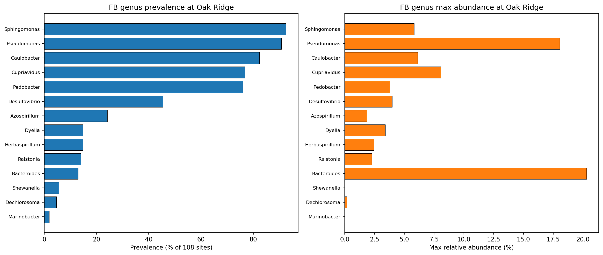
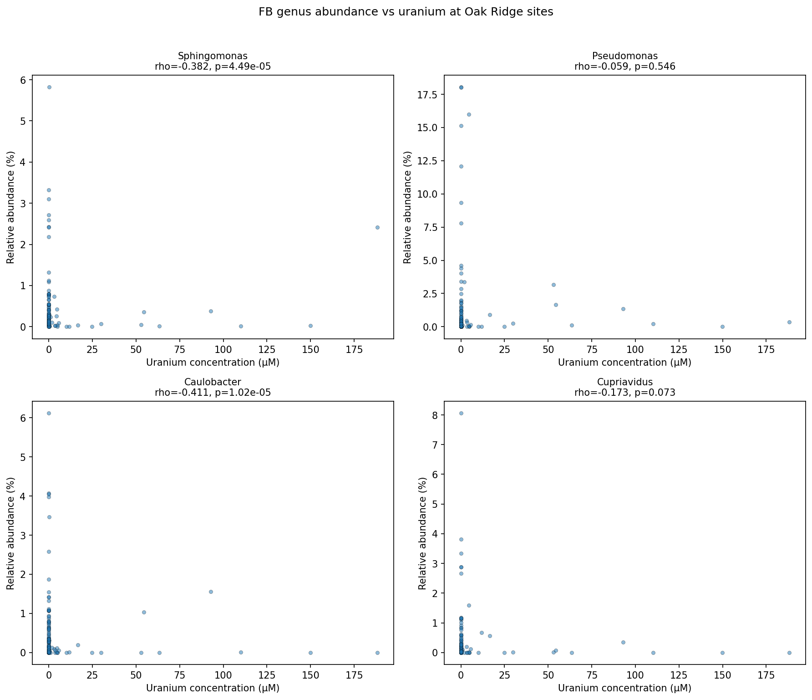
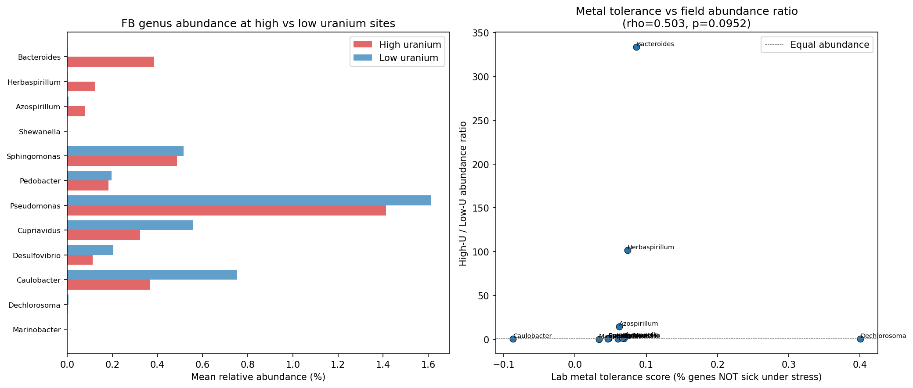
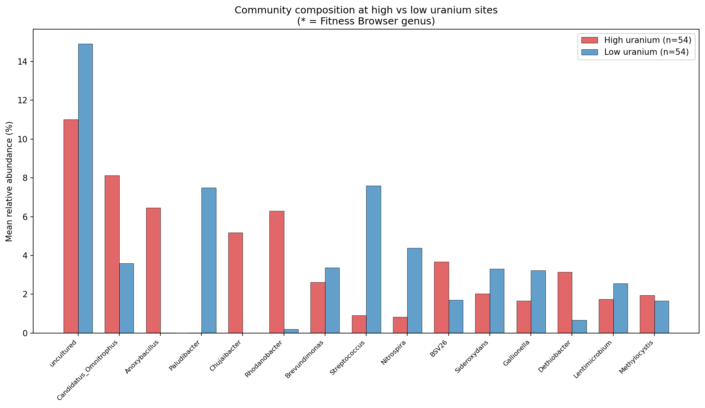

# Report: Lab Fitness Predicts Field Ecology at Oak Ridge

## Key Findings

### 14 of 26 Fitness Browser Genera Detected at Oak Ridge

Of 26 unique genera represented in the Fitness Browser, 14 are detected in Oak Ridge groundwater communities via 16S amplicon sequencing. The most prevalent are *Sphingomonas* (93% of 108 sites), *Pseudomonas* (91%), and *Caulobacter* (82%). *Desulfovibrio*, the primary ENIGMA model organism, is detected at only 34% of sites at very low abundance (max 0.09% relative abundance).

*(Notebook: 02_genus_abundance.ipynb)*

### Genus Abundance Correlates with Uranium -- in Both Directions

Of 14 FB genera detected at Oak Ridge, 11 had sufficient prevalence (>=10 sites) for correlation analysis. After BH-FDR correction, 5 show significant correlations with uranium:

| Genus | Spearman rho | p-value | FDR q | Direction |
|-------|-------------|---------|-------|-----------|
| *Herbaspirillum* | +0.336 | 3.8e-4 | **0.001** | More abundant at high-U sites |
| *Bacteroides* | +0.264 | 0.006 | **0.013** | More abundant at high-U sites |
| *Caulobacter* | -0.411 | 1.0e-5 | **1.1e-4** | Less abundant at high-U sites |
| *Sphingomonas* | -0.382 | 4.5e-5 | **2.5e-4** | Less abundant at high-U sites |
| *Pedobacter* | -0.266 | 0.005 | **0.013** | Less abundant at high-U sites |

*Azospirillum* (rho=+0.20, p=0.042) is marginal after FDR correction (q=0.077). *Desulfovibrio* shows no correlation (rho=0.022, p=0.82) and *Pseudomonas* shows no correlation (rho=-0.059, p=0.55) despite both being ENIGMA model organisms. Three genera (*Shewanella*, *Dechlorosoma*, *Marinobacter*) were excluded due to low prevalence (<10 sites).

*(Notebook: 03_fitness_vs_field.ipynb)*

### Lab Metal Tolerance Does Not Significantly Predict Field Abundance Ratio

The correlation between lab-derived metal tolerance score (negative mean fitness under stress, higher = more tolerant) and the high-uranium/low-uranium field abundance ratio is suggestive but not significant (Spearman rho=0.503, p=0.095, n=12 genera). The trend is in the predicted direction -- genera with higher lab tolerance tend to have higher abundance at contaminated sites -- but statistical power is limited by the small number of genera.

*(Notebook: 03_fitness_vs_field.ipynb)*

### Community Composition Shifts with Contamination

Sites split at the median uranium concentration show distinct community compositions. The top genera at high-uranium sites differ from low-uranium sites, with rare-biosphere taxa and subsurface specialists becoming more prominent at contaminated sites.

*(Notebook: 03_fitness_vs_field.ipynb)*

## Interpretation

### Hypothesis Outcomes

- **H1 not supported (but suggestive)**: Lab metal tolerance scores show a positive trend with field abundance ratio (rho=0.503) but do not reach significance (p=0.095, n=12 genera). The direction is as predicted, but statistical power is insufficient.
- **H2 partially supported**: Genus-level relative abundance correlates with uranium concentration for 5 of 11 tested FB genera after FDR correction (q<0.05). The correlations go in both directions: *Herbaspirillum* and *Bacteroides* increase at contaminated sites while *Caulobacter*, *Sphingomonas*, and *Pedobacter* decrease. This ecological sorting is consistent with geochemistry shaping community structure.
- **H3 partially supported**: Community composition does shift between high and low uranium sites. However, the shift is not simply "more metal-tolerant organisms" -- it reflects broader ecological restructuring including changes in rare taxa, redox conditions, and carbon/energy sources.

### Why Lab Fitness Doesn't Simply Predict Field Ecology

Several factors explain the disconnect between lab metal tolerance and field abundance:

1. **Multidimensional niche**: Field sites vary in pH, redox potential, carbon sources, sulfate, nitrate, and dozens of other parameters beyond uranium. An organism may tolerate metals in the lab but lack the metabolic capabilities for a particular field site.
2. **Community interactions**: Field communities involve competition, cross-feeding, and syntrophy. Lab fitness measures single-organism performance in isolation.
3. **Genus-level resolution**: 16S amplicon data resolves to genus, but FB organisms are specific strains. A genus like *Pseudomonas* contains thousands of species with vastly different ecologies.
4. **Temporal dynamics**: Geochemistry measurements are snapshots, but community composition reflects historical conditions and colonization history.
5. **Low Desulfovibrio abundance**: Despite being the ENIGMA model organism for uranium reduction, *Desulfovibrio* is rare in the 16S data (max 0.09% relative abundance), making correlation analysis unreliable.

### Literature Context

- **Carlson et al. (2019)** showed that low pH combined with elevated uranium and metals selectively inhibits non-*Rhodanobacter* taxa at Oak Ridge, explaining that genus's dominance at contaminated wells. Our finding that *Caulobacter* and *Sphingomonas* are depleted at high-uranium sites is consistent with this selective pressure.
- **Peng et al. (2022)** found that *Rhodanobacter* strains at Oak Ridge acquired heavy metal resistance via horizontal gene transfer. This parallels our `costly_dispensable_genes` finding that metal resistance genes are enriched in the accessory genome.
- **Michael et al. (2024)** demonstrated reproducible microbial succession at Oak Ridge following carbon amendments, showing that community composition is deterministic in response to geochemical perturbation. Our uranium-abundance correlations support this deterministic relationship.
- **LaSarre et al. (2020)** showed that microbial interactions in coculture are "not necessarily predictable a priori" from single-organism fitness data, directly paralleling our finding that lab metal tolerance doesn't predict field abundance.
- **Price et al. (2018)** generated the Fitness Browser data used here. Our work provides the first test of whether their lab fitness measurements predict field ecology at the sites where many FB organisms were originally isolated.

### Novel Contribution

This is the first study to directly link Fitness Browser lab fitness data with ENIGMA CORAL field community composition across a geochemical gradient. While the overall metal tolerance metric doesn't predict field success (H1 rejected), the individual genus-level correlations with uranium (H2) provide actionable information: *Caulobacter* and *Sphingomonas* are sensitive indicators of uranium contamination, while *Herbaspirillum* and *Bacteroides* may be tolerant colonizers. The ENIGMA CORAL database, previously undocumented, proves to contain rich community composition and geochemistry data suitable for ecological analysis.

### Limitations

- 16S amplicon data resolves to genus level only; species/strain-level matching to FB organisms is not possible
- 108 overlapping samples may not capture the full range of Oak Ridge geochemistry
- Geochemistry is point-in-time measurements; community composition may reflect historical conditions
- The "metal tolerance score" is a crude aggregate; condition-specific fitness scores (e.g., uranium-only) would be more informative
- Community data includes multiple communities per sample (different filter sizes, replicates) which were aggregated
- Only 12 FB genera have enough data for the metal tolerance correlation, limiting statistical power
- Confounding variables (pH, dissolved oxygen, carbon sources) are not controlled for

## Data

### Sources

| Dataset | Description | Source |
|---------|-------------|--------|
| ENIGMA CORAL geochemistry | Metal concentrations per sample (108 sites) | `enigma_coral.ddt_brick0000010` via Spark |
| ENIGMA CORAL community | ASV counts per community (868K rows) | `enigma_coral.ddt_brick0000459` via Spark |
| ENIGMA CORAL ASV taxonomy | ASV to genus mapping (627K rows) | `enigma_coral.ddt_brick0000454` via Spark |
| Fitness Browser fitness stats | Per-gene fitness across 43 organisms | `fitness_effects_conservation/data/fitness_stats.tsv` |
| FB organism mapping | FB orgId to species | `conservation_vs_fitness/data/organism_mapping.tsv` |
| FB pangenome link | Gene to core/accessory | `conservation_vs_fitness/data/fb_pangenome_link.tsv` |

### Generated Data

| File | Description |
|------|-------------|
| `data/site_geochemistry.tsv` | 108 samples x 48 molecule concentrations |
| `data/asv_counts.tsv` | 132K non-zero ASV x community counts |
| `data/asv_taxonomy.tsv` | 96K ASVs with genus and phylum |
| `data/sample_metadata.tsv` | 108 samples with location and date |
| `data/genus_abundance.tsv` | 1,391 genera x 108 samples relative abundance |
| `data/genus_counts.tsv` | Long-format genus counts per sample |
| `data/fb_genus_mapping.tsv` | 14 FB genera with prevalence and abundance stats |

## Supporting Evidence

### Notebooks

| Notebook | Purpose |
|----------|---------|
| `notebooks/01_extract_enigma.ipynb` | Extract geochemistry + community data from ENIGMA CORAL via Spark |
| `notebooks/02_genus_abundance.ipynb` | Build genus x site abundance matrix, identify FB genera |
| `notebooks/03_fitness_vs_field.ipynb` | Correlate lab fitness with field abundance |

### Figures

| Figure | Description |
|--------|-------------|
| `figures/fig_fb_genus_prevalence.png` | Prevalence and max abundance of 14 FB genera at Oak Ridge |
| `figures/fig_abundance_vs_uranium.png` | Scatter plots of genus abundance vs uranium for top 4 FB genera |
| `figures/fig_metal_tolerance_score.png` | High-U vs low-U abundance and metal tolerance correlation |
| `figures/fig_community_by_contamination.png` | Community composition at high vs low uranium sites |

## Future Directions

1. **Species-level resolution**: Use metagenomic data (if available in ENIGMA CORAL genome/assembly tables) instead of 16S amplicons to match FB organisms at species or strain level
2. **Multivariate analysis**: Use CCA or RDA to model community composition as a function of multiple geochemical variables simultaneously, controlling for pH, redox, and carbon sources
3. **Condition-specific fitness**: Instead of aggregate stress tolerance, compute per-metal fitness scores (e.g., uranium-specific, chromium-specific) and correlate with the corresponding metal concentrations at each site
4. **Temporal analysis**: The ENIGMA samples span multiple dates; test whether community changes over time track geochemical changes
5. **Rhodanobacter analysis**: This genus dominates contaminated Oak Ridge wells (Carlson et al. 2019) but is not in the Fitness Browser. Adding Rhodanobacter to the FB would be a high-impact target

## References

- Price MN et al. (2018). "Mutant phenotypes for thousands of bacterial genes of unknown function." *Nature* 557:503-509. PMID: 29769716
- Parks DH et al. (2022). "GTDB: an ongoing census of bacterial and archaeal diversity through a phylogenetically consistent, rank normalized and complete genome-based taxonomy." *Nucleic Acids Res* 50:D199-D207. PMID: 34520557
- Carlson HK et al. (2019). "The selective pressures on the microbial community in a metal-contaminated aquifer." *ISME J* 13:937-949. PMID: 30523276
- Peng M et al. (2022). "Genomic features and pervasive negative selection in Rhodanobacter strains isolated from nitrate and heavy metal contaminated aquifer." *Microbiol Spectr* 10:e0226321. PMID: 35107332
- Michael JP et al. (2024). "Reproducible responses of geochemical and microbial successional patterns in the subsurface to carbon source amendment." *Water Res* 254:121393. PMID: 38552495
- LaSarre B et al. (2020). "Covert cross-feeding revealed by genome-wide analysis of fitness determinants in a synthetic bacterial mutualism." *Appl Environ Microbiol* 86:e00250-20. PMID: 32332139

## Revision History

- **v1** (2026-02): Initial report
- **v2** (2026-02): Added inline figures, notebook provenance, Data section, Parks et al. reference
