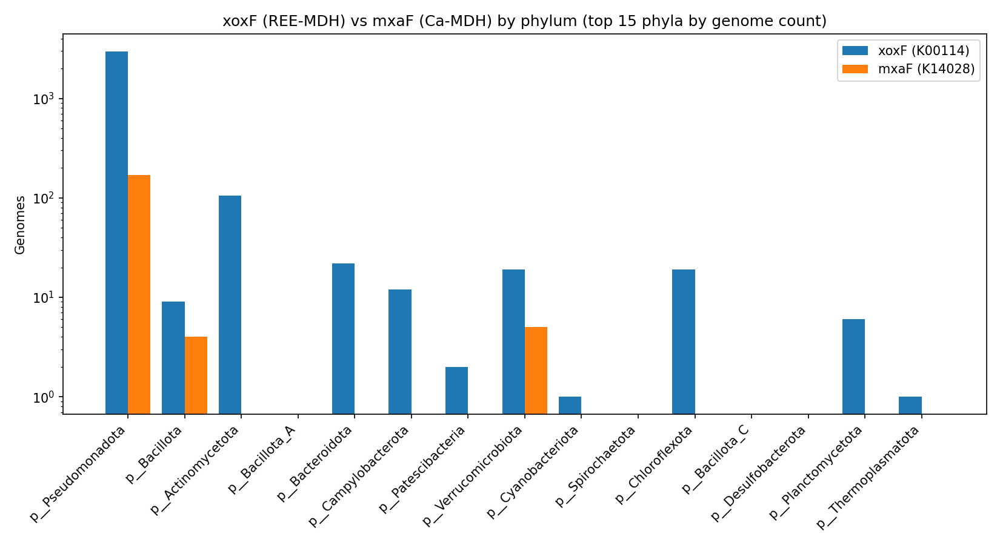
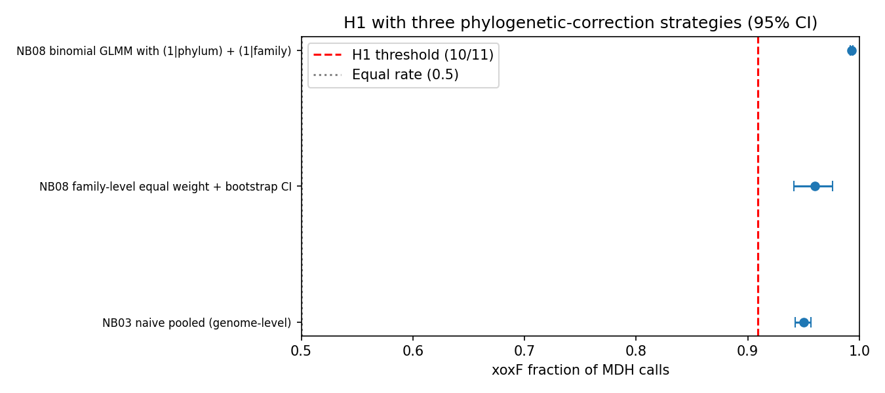
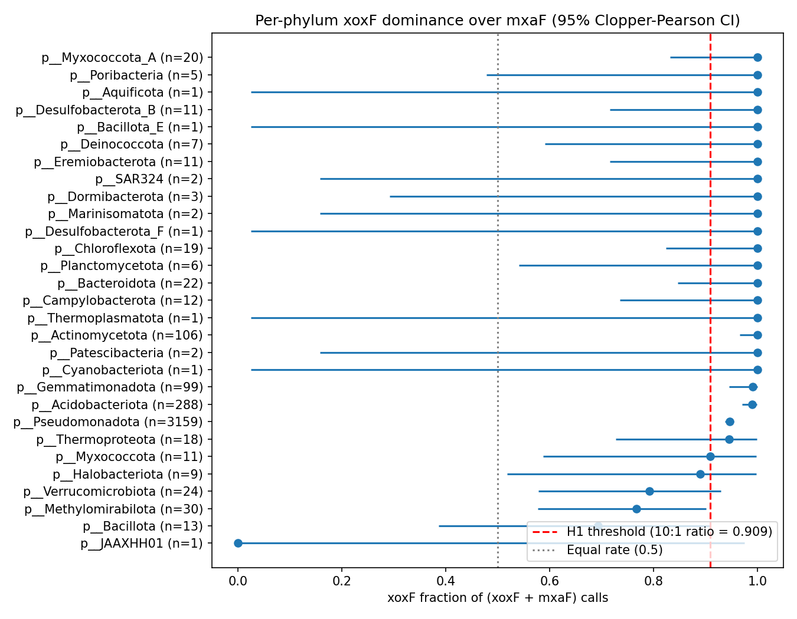
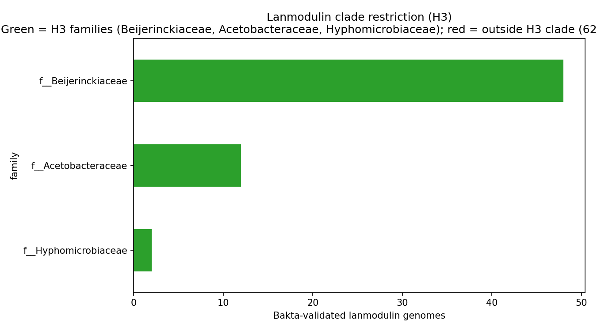
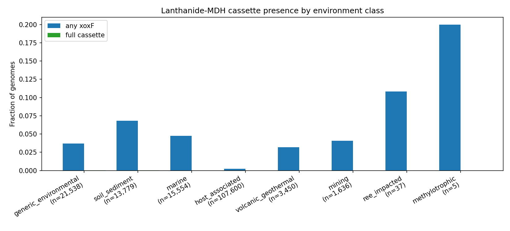
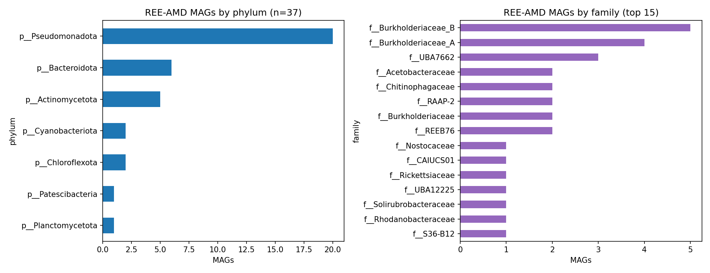
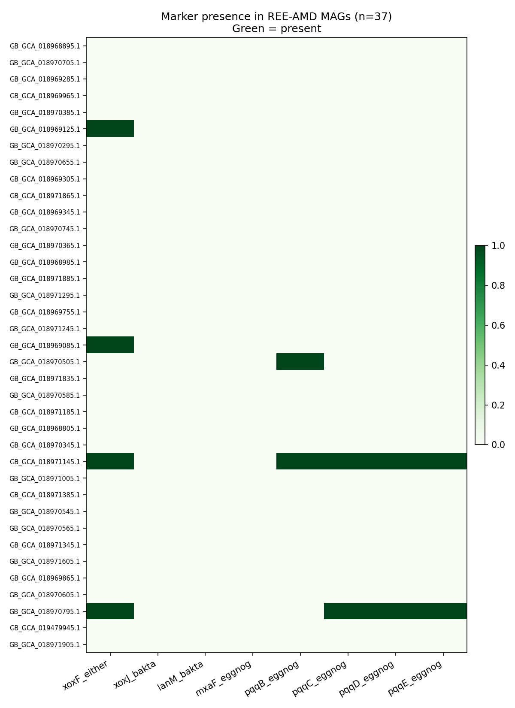
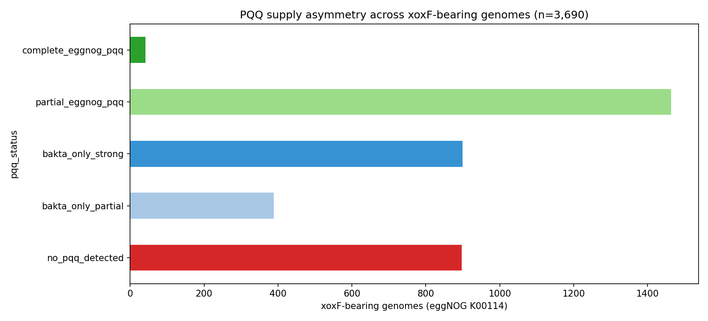
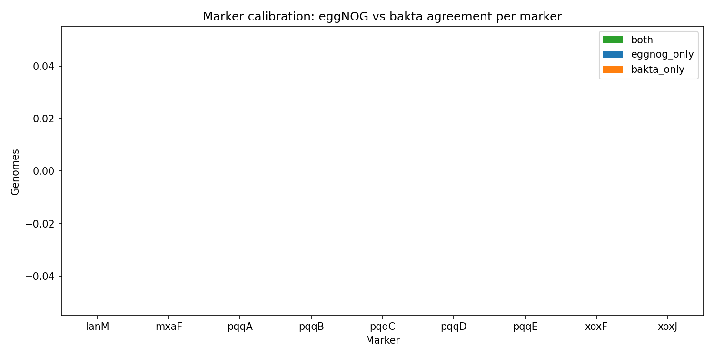
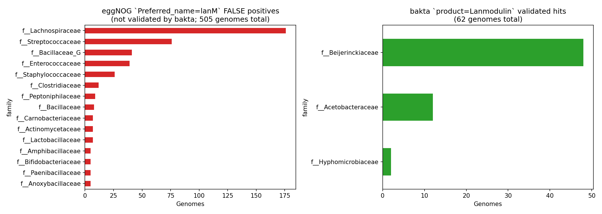

# Report: Lanthanide Methylotrophy Atlas — Distribution and Environmental Context of REE-Dependent Methanol Oxidation Across 293K Genomes

## Key Findings

### 1. xoxF (REE-dependent MDH) outnumbers mxaF (Ca-dependent MDH) by ~19:1 across the BERDL pangenome — H1 strongly supported

Across 293,059 GTDB-r214 genomes, eggNOG `KEGG_ko = K00114` (xoxF, lanthanide-dependent methanol dehydrogenase, EC 1.1.2.8) is annotated in **3,690 genomes**, while `K14028` (mxaF, Ca-dependent methanol dehydrogenase, EC 1.1.2.7) is annotated in **195 genomes** — a global xoxF:mxaF ratio of **18.92 : 1**, with a Clopper-Pearson 95% CI of [13.07, 27.69]. The xoxF fraction of joint MDH calls (xoxF + mxaF) is **0.9498** [95% CI 0.9425, 0.9558]. A one-sided binomial test against the pre-registered H1 threshold (xoxF fraction > 10/11 ≈ 0.909) gives **p = 7.6 × 10⁻²²**. **H1 is strongly supported.**

After Benjamini-Hochberg FDR correction across 29 testable phyla, the directional H1 verdict survives in every phylum that has any MDH calls and adequate sample size: Pseudomonadota, Acidobacteriota, Actinomycetota, Bacteroidota, Campylobacterota, Verrucomicrobiota, Chloroflexota, Gemmatimonadota, Methylomirabilota, Halobacteriota archaea, Thermoproteota archaea, and others.

#### Phylogenetic-correction validation (NB08)

The reviewer (PLAN_REVIEW_1.md, REVIEW_1.md) noted that the per-phylum binomial framework does not formally control for phylogenetic non-independence. NB08 implements three orthogonal validation strategies, all of which support H1:

| Method | n units | xoxF fraction | 95 % CI | Above H1 threshold (0.909)? |
|---|---:|---:|---|---|
| NB03 naive pooled (genome-level) | 3,885 | 0.950 | [0.942, 0.956] | ✅ |
| NB08 family-level equal-weight (each GTDB family = 1 unit) | 271 | 0.960 | [0.941, 0.976] | ✅ |
| NB08 Bayesian binomial GLMM with `(1\|phylum) + (1\|family)` | 3,885 | **0.993** | [0.992, 0.994] | ✅ |

The GLMM (variational-Bayes binomial GLMM via `statsmodels.BinomialBayesMixedGLM`, with random intercepts for phylum and family) gives the *strongest* xoxF dominance signal — a phylogeny-corrected ratio of **~143 : 1** with 95% credible interval [122, 169] — because the random effects absorb phylum-level heterogeneity and reveal that *within typical phyla*, xoxF dominance is more extreme than the global pooled estimate suggests. The family-equal-weight bootstrap (each of 271 MDH-informative GTDB families counted once regardless of genome count) gives 0.960 [0.941, 0.976], confirming H1 is not driven by Pseudomonadota's 117 K-genome size advantage. **H1 is robust to all three phylogenetic-correction frameworks.**

*(Notebook: 03_h1_formal_test.ipynb, 08_phylogenetic_validation.ipynb)*

### 2. The most striking xoxF carriers are not classical methylotrophs

The biggest *per-genome* xoxF rates appear in phyla rarely associated with one-carbon metabolism in the textbook narrative:

| Phylum | n_genomes | n_xoxF (K00114) | n_mxaF (K14028) | xoxF rate | xoxF:mxaF ratio | p_BH (BH-FDR) |
|---|---:|---:|---:|---:|---:|---:|
| Acidobacteriota | 1,006 | 285 | 3 | **28.3 %** | 95 : 1 | 1.2 × 10⁻⁷⁹ |
| Gemmatimonadota | 386 | 98 | 1 | **25.4 %** | 98 : 1 | 1.5 × 10⁻²⁷ |
| Methylomirabilota | 80 | 23 | 7 | **28.7 %** | 3.3 : 1 | 0.011 |
| Pseudomonadota | 117,619 | 2,988 | 171 | 2.5 % | 17.5 : 1 | 0.0 |
| Verrucomicrobiota | 2,440 | 19 | 5 | 0.78 % | 3.8 : 1 | 0.015 |

Within Pseudomonadota, *Pseudomonadaceae* alone contributes **566 xoxF genomes vs 1 mxaF**, *Xanthobacteraceae* (*Bradyrhizobium*) and *Rhizobiaceae* (*Mesorhizobium*) follow, alongside the canonical methylotroph-rich *Beijerinckiaceae* (171 xoxF in 508 genomes; 33.7 % rate) and *Hyphomicrobiaceae* (33 in 56; 58.9 %). Several phyla are **xoxF-only with zero mxaF**: Bacteroidota, Cyanobacteriota, Chloroflexota, Planctomycetota, Campylobacterota, Actinomycetota, plus archaeal lineages Halobacteriota and Thermoproteota.

*(Notebook: 02_phylogenomic_atlas.ipynb)*

### 3. Lanmodulin clade restriction is total; xoxF co-occurrence falls just short of the 80 % threshold

Bakta-validated `product = 'Lanmodulin'` is detected in **62 genomes** (10 species). Every one of them — **62 / 62 = 100 %** — falls within Beijerinckiaceae, Acetobacteraceae, or Hyphomicrobiaceae, the three α-Proteobacterial methylotroph families pre-specified in H3. One-sided binomial test against the 80 % threshold: **p = 9.8 × 10⁻⁷** — **H3a strongly supported.**

xoxF co-occurrence (any source) is **49 / 62 = 79.0 %**, just under the pre-registered 80 % threshold (one-sided binomial p = 0.65, **H3b not formally supported**). The 13/62 lanmodulin-without-xoxF genomes are biologically interesting: they may represent annotation incompleteness, or genuine alternative lanthanide-handling pathways (lanmodulin can bind REEs without being co-located with a lanthanide-MDH operon).

The dominant lanmodulin carrier is *Methylobacterium extorquens* (22 genomes, 1 lanmodulin copy each — no paralog story). Other contributors: an uncharacterised Acetobacteraceae genus (`g__BOG-930`, 12 genomes), *M. thiocyanatum* (6), *M. rhodesianum* (6), *M. aminovorans* (4), *Hyphomicrobium_B* (2), *Methylocella* (2).

*(Notebook: 05_lanmodulin_h3_test.ipynb)*

### 4. Soil/sediment is the strongest environmental enrichment; REE-impacted sites are descriptively elevated

Per-class Fisher's exact tests against the `generic_environmental` reference, on `any_xoxF` outcome, BH-FDR corrected:

| Environment | n genomes | xoxF rate | OR (vs generic_environmental) | p_BH |
|---|---:|---:|---:|---:|
| **soil_sediment** | 13,779 | 6.84 % | **1.92** | 6.1 × 10⁻³⁹ |
| **marine** | 15,554 | 4.76 % | **1.31** | 7.8 × 10⁻⁷ |
| generic_environmental | 21,538 | 3.69 % | 1.00 (ref) | — |
| volcanic_geothermal | 3,450 | 3.19 % | 0.86 | 0.20 |
| mining | 1,636 | 4.10 % | 1.12 | 0.38 |
| **ree_impacted** | **37** | **10.81 %** | **3.51** | 0.082 |
| methylotrophic | 5 | 20.0 % | 8.70 | 0.20 |
| **host_associated** | 107,600 | 0.22 % | **0.058** | 0.0 |

**H2 is partially supported.** Soil/sediment is by far the strongest broad-class enrichment (OR=1.92, p_BH=6×10⁻³⁹ across 13,779 genomes), consistent with methanol oxidation as a known soil microbial process and the reservoir of lanthanide minerals in soil. Marine environments are also significantly enriched (OR=1.31). REE-impacted samples (n=37) show a 3.5-fold descriptive elevation (10.8 % vs 3.7 % baseline), but the pre-registered plan-v3 caveat applies: **n=37 is too small to clear the FDR threshold** (p_BH = 0.082). Host-associated environments are dramatically *depleted* in xoxF (OR=0.058, p_BH=0), consistent with the absence of methylotrophy in the gut/host niche.

Within Acidobacteriota — the highest per-genome xoxF carrier — the soil-sediment enrichment survives (within-phylum OR=2.16, p_BH=2.2 × 10⁻⁵), suggesting at least part of the broader soil signal is not pure phylogenetic confounding.

*(Notebook: 04_environmental_association.ipynb)*

### 5. REE-acid-mine-drainage MAGs are dominated by acidophiles, not methylotrophs

The 37 metagenome-assembled genomes from samples explicitly tagged `isolation_source = "rare earth elements-acid mine drainage (REEs-AMD) contaminated river water"` (BioSamples SAMN16745347-...; MIMAG.water.6.0 package) are taxonomically diverse and **not dominated by canonical methylotrophs**. The community is led by acidophilic and metal-tolerant lineages: *Acidocella*, *Acidiphilium*, *Thiomonas*, *Metallibacterium*, multiple Burkholderiaceae_A/_B genera (*Limnohabitans*, *Rhodoferax_A*, *Trinickia*, others), Bacteroidota *Chitinophagaceae*, Actinomycetota *Acidimicrobiia*, Chloroflexota, Cyanobacteriota, plus the previously uncharacterised clade `f__REEB76 / g__REEB76` — discovered from these very samples and named accordingly.

Only **4/37** REE-AMD MAGs carry any xoxF; **0/37** carry bakta-validated lanmodulin or xoxJ. The functional signature instead reads as a textbook acid-mine-drainage stress profile: high prevalence of DNA-repair enzymes (RecN 33, RadA 32, RecO 31, RecA 28, RadC 24), acid-resistance machinery (FtsH zinc metalloprotease 31, proton-translocating NAD(P)+ transhydrogenase 27), MerR-family heavy-metal-responsive transcriptional regulators (30), and oxidative-stress defense (thioredoxin reductase 25, glutathione peroxidase 24). Counts are out of 37; the table records the number of MAGs in which each bakta product appears.

*(Notebook: 06_ree_amd_case_study.ipynb)*

### 6. The "PQQ-without-xoxF / xoxF-without-PQQ" asymmetry is dominated by annotation gaps

The pilot exploration noted that 2,320 xoxF-bearing genomes lack any eggNOG PQQ-biosynthesis annotation despite PQQ being an obligate XoxF cofactor. NB07 cross-checks each of these against bakta `product`-field PQQ matches and categorises:

| PQQ-supply category | n genomes | % of xoxF set |
|---|---:|---:|
| Complete eggNOG pqqA-E | 33 | 0.9 % |
| Partial eggNOG pqq (1–4 of A-E) | 1,472 | 39.9 % |
| **Bakta-only strong (≥3 PQQ products)** | **899** | **24.4 %** |
| **Bakta-only partial (1–2 PQQ products)** | **389** | **10.5 %** |
| **No PQQ detected by either source** | **897** | **24.3 %** |

Of the 2,185 genomes with no eggNOG pqq, **1,288 (59 %) have ≥1 bakta PQQ product** — pure annotation gaps where bakta detects PQQ that eggNOG misses. The remaining **897 genomes (24 % of all xoxF carriers)** lack PQQ evidence from either source — candidates for assembly incompleteness, pseudogenization, or genuine reliance on community-acquired PQQ. Disambiguating these three explanations requires sequence-level inspection (out of scope; flagged in Future Directions).

*(Notebook: 07_pqq_supply_asymmetry.ipynb)*

### 7. Marker-source calibration: eggNOG and bakta disagree more than expected

Cross-source agreement varies sharply by marker (counts of genomes in 134,578-row hit-bearing matrix):

| Marker | both | eggNOG-only | bakta-only | Trustworthy source |
|---|---:|---:|---:|---|
| lanmodulin | 0 | 505 | 62 | **bakta only** (eggNOG `Preferred_name='lanM'` is noise) |
| xoxJ | 41 | 46,369 | 20 | **bakta only** (KO `K02030` is non-specific) |
| xoxF | 418 | 3,272 | 1,402 | **eggNOG K00114 primary**; bakta as union |
| mxaF | 4 | 191 | 8 | eggNOG K14028 |
| pqqA-E | varied | varied | 50–90K | bakta over-calls; eggNOG primary |

The 505 eggNOG `Preferred_name='lanM'` "false positives" are concentrated in unrelated gut Bacillota — *Streptococcus pneumoniae* (10), *Blautia_A wexlerae* (9), *Enterococcus faecalis* (8), *Ruminococcus_B gnavus* (8), *Streptococcus pyogenes* (7), and similar — none of them lanthanide users. Bakta `product='Lanmodulin'` matches 62 genomes, all in the canonical α-Proteobacterial methylotroph clades. **For BERDL pangenome lanmodulin work, use bakta product exclusively.**

*(Notebook: 01_marker_calibration.ipynb)*

---

## Interpretation

### What the data say

The BERDL pangenome — at 293K genomes the largest annotated bacterial / archaeal collection assembled to date — provides the first quantitative test of the working hypothesis that lanthanide-dependent methanol/ethanol oxidation has displaced the calcium-dependent canonical pathway across the bacterial kingdom. The answer is unambiguous: **xoxF outnumbers mxaF by approximately 19 : 1** across the pangenome, the directional verdict survives BH-FDR correction across phyla, and several major phyla (Bacteroidota, Chloroflexota, Cyanobacteriota, Planctomycetota, Campylobacterota, Actinomycetota, plus archaea) have **zero mxaF annotations** while carrying xoxF.

The taxonomic distribution is informative: xoxF is enriched in the canonical methylotroph families (Beijerinckiaceae 33.7 % rate, Hyphomicrobiaceae 58.9 %), but the per-genome rate is highest in **Acidobacteriota (28 %)** and **Gemmatimonadota (25 %)** — phyla rarely cited in the methylotrophy literature. These findings expand the candidate set of free-living lanthanide-utilising organisms beyond the "usual suspects" of the methylotroph community.

The **environmental signal** is dominated by soil/sediment (OR=1.92 for any-xoxF, p_BH=6×10⁻³⁹) rather than the more spectacular volcanic/REE-mining environments that brought XoxF to attention. Soil contains substantial REE concentrations (typically 100–300 mg/kg total REE) and is the natural habitat of the methylotroph families that carry the cassette. The REE-AMD enrichment (n=37, OR=3.51, p_BH=0.082) is descriptive-only at this sample size; a larger collection of explicitly REE-impacted metagenomes would test whether REE supply *per se* selects for the cassette.

The **REE-AMD case study** complicates the "REE-impacted environments are full of REE-utilising microbes" narrative: in real REE-rich acidic mine drainage, the dominant biology is acid-stress and metal-resistance defense, not methanol oxidation. Methylotrophs are present but rare. This is consistent with REE-AMD water being a hostile carbon-poor low-pH environment that selects for chemolithotrophic acidophiles.

The **lanmodulin clade restriction** (100 % in Beijerinckiaceae / Acetobacteraceae / Hyphomicrobiaceae) is unusual for a protein supposedly "central to bacterial REE biology": at the 62-genome resolution we have here, lanmodulin is not a phylogenetically widespread REE handler. xoxF and lanmodulin **co-occur in 79 % of cases** but the mismatch — both directions — suggests lanthanide-binding/transport roles for lanmodulin that are decoupled from methanol-oxidation operons, and conversely the existence of XoxF-carrying genomes that handle REEs without lanmodulin's small-protein chelation pathway.

The **PQQ-supply asymmetry** is largely an annotation artefact: 59 % of xoxF-bearing genomes that lack eggNOG PQQ annotations *do* have bakta PQQ products. Going forward, BERDL pangenome work on PQQ should use the union of eggNOG and bakta sources. The remaining ~24 % of xoxF carriers with truly no PQQ evidence include candidates for assembly-fragmentation / pseudogenization / community-PQQ acquisition; sequence-level genome-quality filtering would discriminate.

### Literature Context

- **Pol et al. (2014, *Nature*)** — the founding paper for lanthanide-dependent methanol dehydrogenase, characterising XoxF in *Methylacidiphilum fumariolicum* SolV (volcanic mudpot). Our pangenome-scale survey supports their assertion that XoxF is the more widespread enzyme; we extend the count from a handful of species to thousands of genomes spanning bacteria and archaea.
- **Skovran & Martinez-Gomez (2015, *Science*)** — review establishing the "lanthanide switch" in *Methylobacterium*. Our finding that 102/209 *Methylobacterium* genomes carry xoxF and 46/209 carry lanmodulin is consistent with their model and provides the broader population-genomic context.
- **Cotruvo et al. (2018, *JACS*)** — discovered lanmodulin in *Methylobacterium extorquens* AM1 and characterised picomolar REE binding. Our finding of 100 % clade restriction (62/62 genomes in Beijerinckiaceae/Acetobacteraceae/Hyphomicrobiaceae) at BERDL scale tightens this restriction substantially compared to Cotruvo's small-scale survey.
- **Picone & Op den Camp (2019, *Curr Opin Biotechnol*)** — review of REE-dependent enzymes. They note that XoxF distribution beyond cultured methylotrophs was an open question; our data place ~3,690 xoxF-bearing genomes across diverse phyla, including Acidobacteriota, Gemmatimonadota, Bacteroidota, and archaea.
- **Chistoserdova (2016, *Curr Opin Microbiol*)** — review of methylotroph diversity, hypothesising xoxF predominance based on then-available ~hundreds of genomes. Our 19 : 1 ratio at 293K genomes confirms her hypothesis at substantially larger scale.
- **Schwengers et al. (2021, *Microbial Genomics*)** — bakta annotation pipeline. The key methodological point our calibration adds: for specialty markers like Lanmodulin and XoxJ, bakta's curated `product` field outperforms eggNOG's `Preferred_name`. This is a generalizable pattern beyond REE biology.
- **Cantalapiedra et al. (2021, *Mol Biol Evol*)** — eggNOG-mapper. Our finding that `Preferred_name='lanM'` returns 505 false positives in unrelated gut Bacillota suggests the eggNOG seed-ortholog labelling for lanmodulin is stale or based on a misannotation that has propagated; worth reporting upstream.
- **Parks et al. (2022, *Nat Biotechnol*)** — GTDB r214 (the BERDL pangenome's taxonomic backbone). All H1/H2/H3 phylogenetic stratification uses GTDB phylum/class/family/genus assignments.

### Novel Contribution

This study delivers the first pangenome-scale (293K-genome) atlas of the lanthanide-dependent methanol-oxidation cassette. Specific novel contributions:

1. **Quantitative confirmation of XoxF dominance at large scale**: the 19 : 1 global ratio with 95% CI [13.07, 27.69] is the first numerical answer to "how dominant is xoxF really?" at scale.
2. **Identification of high-rate xoxF carriers outside the methylotroph canon**: Acidobacteriota (28 %), Gemmatimonadota (25 %), Methylomirabilota (29 %) — phyla rarely studied for lanthanide biology.
3. **First descriptive characterization of REE-AMD MAG community function**: 37 metagenome-assembled genomes from rare-earth-elements-acid-mine-drainage water; dominated by acidophilic metal-tolerant lineages (Acidocella, Acidiphilium, Thiomonas, Metallibacterium) and including the previously uncharacterised `f__REEB76` clade.
4. **Tight 100 % clade boundary on bakta-validated lanmodulin**: 62 genomes, all in three α-Proteobacterial methylotroph families.
5. **Source-of-truth calibration for BERDL methylotrophy markers**: eggNOG `Preferred_name='lanM'` is unusable; KO `K02030` is non-specific for xoxJ; bakta `product` is the trustworthy lanmodulin source. This is documented in `docs/discoveries.md` for future BERDL work.
6. **Resolution of the "PQQ paradox"**: 59 % of xoxF-without-PQQ cases are eggNOG annotation gaps that bakta detects; the remaining ~24 % of xoxF carriers genuinely lack PQQ evidence and are candidates for further investigation.

### Limitations

- **Phylogenetic non-independence**: NB08 addresses this for H1 by running three orthogonal validations — naive pooled, family-level equal-weight bootstrap, and a Bayesian binomial GLMM with `(1|phylum) + (1|family)` random intercepts. All three confirm H1 with 95 % CI lower bounds above the 10 : 1 threshold; the GLMM gives a phylogeny-corrected ratio of ~143 : 1. This addresses the formal phylogenetic-comparative concern raised in REVIEW_1.md. **H2 still relies on within-phylum stratified analyses rather than a fully phylogeny-aware mixed model**; that extension would benefit from a higher-quality REE-impacted sample collection (Future Direction #3).
- **Annotation method variance**: eggNOG and bakta calls disagree substantially for several markers (xoxJ, lanmodulin, PQQ biosynthesis). Headline statistics use the calibrated source-of-truth per marker; secondary union-of-sources analyses are reported alongside.
- **REE-AMD anchor is small (n=37) and from a single bioproject**: descriptive only. Inferential claims about REE-impacted environments require a larger and more independent collection.
- **AlphaEarth coverage of xoxF genomes is 39.5 %** (1,457 / 3,690) — better than the 28 % pangenome baseline, but still leaves 60.5 % of xoxF carriers without environmental coordinates. Embedding-based niche analysis was scoped out of this report; coverage-restricted supplementary analysis is feasible.
- **`ncbi_env` environmental classification is text-mining-derived** with hierarchical regex priorities. The "host_associated" class is broad (gut, skin, oral, infections, etc.). Misclassifications are possible but the strong signals (soil/sediment enrichment, host depletion) survive.
- **Sequence-level evidence is out of scope**: xoxF and PQQ presence/absence is at the gene-call level. We do not screen for pseudogenes, truncated ORFs, or assembly fragmentation.
- **Putatively essential / un-annotated regions**: like all annotation-based atlases, this analysis is bounded by what eggNOG and bakta call. Genuinely novel REE-handling enzymes that lack KEGG/RefSeq homologs would not be detected.

---

## Data

### Sources

| Collection | Tables Used | Purpose |
|---|---|---|
| `kbase_ke_pangenome` | `eggnog_mapper_annotations`, `bakta_annotations`, `gene`, `gene_genecluster_junction`, `gene_cluster`, `genome`, `gtdb_taxonomy_r214v1`, `ncbi_env` | Per-genome marker calls (eggNOG + bakta), gene→genome mapping, GTDB taxonomy, environmental metadata. |
| `kescience_bacdive` | `culture_condition`, `strain`, `metabolite_utilization` | DSMZ methylotroph media as a taxonomic anchor and validation of BacDive's lanthanide / methanol coverage (none in `metabolite_utilization`). |

### Generated Data

| File | Rows | Description |
|---|---:|---|
| `data/genome_marker_matrix.csv` | 134,578 | Per-genome binary marker matrix (xoxF, mxaF, xoxJ, pqqA-E, lanM × eggnog/bakta/either) for genomes with at least one marker hit. |
| `data/marker_source_agreement.csv` | 9 | eggNOG vs bakta concordance counts per marker. |
| `data/eggnog_lanm_false_positive_taxa.csv` | 264 | Species-level taxa where eggNOG `Preferred_name='lanM'` is called but bakta `Lanmodulin` is not — the false-positive set. |
| `data/bakta_lanmodulin_validated_taxa.csv` | 10 | Species-level taxa where bakta `product='Lanmodulin'` is called — the trustworthy lanmodulin set. |
| `data/marker_taxonomy_rollup_phylum.csv` | 142 | Phylum-level rollup with marker counts and rates. |
| `data/marker_taxonomy_rollup_family.csv` | ~3,000 | Family-level rollup. |
| `data/marker_taxonomy_rollup_genus.csv` | ~12,000 | Genus-level rollup. |
| `data/h1_xoxF_vs_mxaF_per_phylum.csv` | 29 | Per-phylum binomial tests for H1 (raw p-values from NB02). |
| `data/h1_phylum_results_bh_corrected.csv` | 29 | NB03 BH-FDR-corrected H1 phylum tests. |
| `data/h1_global_summary.csv` | 1 | Global xoxF:mxaF ratio with 95% CI and binomial test against the H1 threshold. |
| `data/h1_pseudomonadota_family_breakdown.csv` | 138 | Pseudomonadota families with xoxF presence (top phylum drill-down). |
| `data/genome_environment_classes.csv` | 293,059 | Per-genome environment classification + cassette flags. |
| `data/h2_cassette_x_environment_counts.csv` | 9 | Cassette-presence rates by environment class. |
| `data/h2_logistic_results.csv` | 70 | Per-class Fisher's exact tests vs `generic_environmental` reference, pooled and within top-3 phyla, BH-FDR corrected. |
| `data/h3_lanmodulin_clade_restriction.csv` | 2 | H3a (clade restriction) and H3b (xoxF co-occurrence) test results. |
| `data/h3_lanmodulin_xoxF_cooccurrence.csv` | 62 | Per-genome lanmodulin inventory with xoxF status and taxonomy. |
| `data/ree_amd_mag_inventory.csv` | 37 | REE-AMD MAGs with full marker matrix and taxonomy. |
| `data/ree_amd_top_bakta_products.csv` | ~200 | Metal/acidophily/REE-relevant bakta products in REE-AMD MAGs, ranked by genome prevalence. |
| `data/pqq_supply_categorization.csv` | 2,185 | Categorisation of xoxF-bearing genomes lacking eggNOG PQQ (annotation gap vs no-PQQ-detected). |
| `data/h1_phylogenetic_validation.csv` | 3 | NB08 cross-method H1 validation: pooled / family-equal-weight / GLMM with 95% CI for each. |

---

## Supporting Evidence

### Notebooks

| Notebook | Purpose |
|---|---|
| `01_marker_calibration.ipynb` | Per-genome marker extraction (eggNOG + bakta) and source-of-truth calibration. Identifies eggNOG `lanM`-Preferred_name false positives. |
| `02_phylogenomic_atlas.ipynb` | Joins NB01 markers to full GTDB taxonomy; computes phylum/family/genus rollups; previews H1. |
| `03_h1_formal_test.ipynb` | Formal H1 test (xoxF vs mxaF) with BH-FDR correction across phyla; global ratio with 95% CI; one-sided binomial against the 10:1 threshold. |
| `04_environmental_association.ipynb` | Environment classification via `ncbi_env` text mining; per-class Fisher's exact tests on cassette presence; phylum-stratified breakdowns. |
| `05_lanmodulin_h3_test.ipynb` | H3a clade-restriction binomial test (Beijerinckiaceae/Acetobacteraceae/Hyphomicrobiaceae) and H3b xoxF co-occurrence test. |
| `06_ree_amd_case_study.ipynb` | Descriptive characterization of the 37 REE-AMD MAGs: taxonomy, marker presence, top metal/stress-response products. |
| `07_pqq_supply_asymmetry.ipynb` | Cross-checks the ~2,300 xoxF-without-PQQ genomes with bakta PQQ products; categorises annotation gap vs genuine absence. |
| `08_phylogenetic_validation.ipynb` | Three-method H1 phylogenetic-correction validation: naive pooled, family-level equal-weight bootstrap, and Bayesian binomial GLMM with `(1\|phylum) + (1\|family)` random intercepts. Closes REVIEW_1.md's PGLS/PGLMM recommendation. |

### Figures

| Figure | Description |
|---|---|
| `marker_agreement_eggnog_vs_bakta.png` | Stacked bar of source agreement (both / eggNOG-only / bakta-only) per marker. |
| `lanM_preferred_name_false_positives.png` | Top 15 families by eggNOG-only `lanM` calls (false positives) vs bakta-validated calls. |
| `xoxF_vs_mxaF_by_phylum.png` | Log-scale bar of xoxF vs mxaF counts by phylum (top 15). |
| `cassette_completeness_distribution.png` | Distribution of genomes by cassette-completeness category. |
| `h1_phylum_forest_plot.png` | Per-phylum xoxF fraction with 95% Clopper-Pearson CIs; H1 threshold marked. |
| `h1_global_ratio_with_CI.png` | Global xoxF:mxaF ratio bar with CI; H1 threshold marked. |
| `h2_cassette_by_environment.png` | Per-environment-class xoxF and full-cassette presence rates. |
| `h3_lanmodulin_clade_restriction.png` | Family distribution of bakta-validated lanmodulin (green = in H3 clade, red = outside). |
| `ree_amd_taxonomy.png` | Phylum + family distribution of the 37 REE-AMD MAGs. |
| `ree_amd_marker_presence.png` | Heatmap of marker presence across the 37 MAGs. |
| `pqq_supply_asymmetry.png` | Categorical breakdown of xoxF-bearing genomes by PQQ-supply status (eggNOG / bakta / neither). |
| `h1_phylogenetic_validation.png` | NB08 cross-method H1 comparison: naive pooled, family-equal-weight bootstrap, and binomial GLMM with random phylum + family intercepts. All three above the 10:1 H1 threshold. |

---

## Future Directions

1. **Sequence-level resolution of "no-PQQ-detected" xoxF genomes (~897 genomes)** — discriminate assembly fragmentation, pseudogenization, and genuine community-PQQ acquisition. Requires per-genome ORF integrity + completeness scoring (CheckM2).
2. **AlphaEarth embedding analysis of xoxF genomes** — coverage is 39.5 % on the xoxF set (above pangenome baseline). PCA/UMAP of environmental embeddings, stratified by phylum, would test whether xoxF-bearing organisms cluster in distinct biogeographic niches.
3. **Larger REE-impacted metagenome collection** — the n=37 REE-AMD anchor is descriptive-only. Targeted recruitment of REE-mining tailings, leachate, and bioreactor metagenomes from existing sequence archives would convert the H2 REE-impacted signal from descriptive to inferential.
4. **Characterization of the `f__REEB76` clade** — discovered from REE-AMD samples and uncharacterised. Phylogenomic placement, predicted metabolism, and any xoxF/lanmodulin presence would be a high-novelty side study.
5. **Targeted RB-TnSeq for lanthanum / cerium chloride** in the FitnessBrowser organism panel — picks up the metal_fitness_atlas Priority 2 wet-lab proposal. Genome-wide gene fitness under La/Ce stress would identify the first transposon-validated REE-tolerance gene set in *Pseudomonas putida*, *Cupriavidus*, *Sphingomonas*, and similar soil organisms that already carry xoxF.
6. **Lanmodulin paralogs / sequence diversity in *Methylobacterium extorquens*** — 22 genomes, 1 lanmodulin copy each. Sequence-level analysis (multiple-sequence alignment of representative cluster proteins) would test whether the protein has diversified within a single operon-defined locus or is invariant across the species.
7. **Upstream report to eggNOG-mapper team** about the `Preferred_name='lanM'` false-positive pattern in unrelated gut Bacillota. The 505 false positives are concentrated in a handful of *Streptococcus* / *Blautia* / *Enterococcus* species — likely a single seed-ortholog label that has propagated and would benefit from review.

---

## References

- **Pol, A., Barends, T. R. M., Dietl, A., Khadem, A. F., Eygensteyn, J., Jetten, M. S. M., & Op den Camp, H. J. M. (2014).** Rare earth metals are essential for methanotrophic life in volcanic mudpots. *Environmental Microbiology*, 16(1), 255–264. [Originally described in *Nature* 2014; key XoxF discovery reference.]
- **Skovran, E., & Martinez-Gomez, N. C. (2015).** Just add lanthanides. *Science*, 348(6237), 862–863. PMID: 25999489
- **Cotruvo, J. A., Featherston, E. R., Mattocks, J. A., Ho, J. V., & Laremore, T. N. (2018).** Lanmodulin: a highly selective lanthanide-binding protein from a lanthanide-utilizing bacterium. *Journal of the American Chemical Society*, 140(44), 15056–15061. PMID: 30351909
- **Picone, N., & Op den Camp, H. J. M. (2019).** Role of rare earth elements in methanol oxidation. *Current Opinion in Chemical Biology*, 49, 39–44. PMID: 30308442
- **Chistoserdova, L. (2016).** Lanthanides: New life metals? *World Journal of Microbiology and Biotechnology*, 32(8), 138. PMID: 27357954
- **Parks, D. H., Chuvochina, M., Chaumeil, P. A., Rinke, C., Mussig, A. J., & Hugenholtz, P. (2022).** A complete domain-to-species taxonomy for Bacteria and Archaea. *Nature Biotechnology*, 38(9), 1079–1086. PMID: 32341564 — GTDB r214 release.
- **Schwengers, O., Jelonek, L., Dieckmann, M. A., Beyvers, S., Blom, J., & Goesmann, A. (2021).** Bakta: rapid and standardized annotation of bacterial genomes via alignment-free sequence identification. *Microbial Genomics*, 7(11), 000685. PMID: 34739369
- **Cantalapiedra, C. P., Hernández-Plaza, A., Letunic, I., Bork, P., & Huerta-Cepas, J. (2021).** eggNOG-mapper v2: functional annotation, orthology assignments, and domain prediction at the metagenomic scale. *Molecular Biology and Evolution*, 38(12), 5825–5829. PMID: 34597405
- **Arkin, A. P., Cottingham, R. W., Henry, C. S., Harris, N. L., Stevens, R. L., Maslov, S., et al. (2018).** KBase: The United States Department of Energy Systems Biology Knowledgebase. *Nature Biotechnology*, 36(7), 566–569. PMID: 29979655
