# Report: Lignin Enrichment and Ecological Memory in Microbial Communities

## Key Findings

### Finding 1: Lignin enrichment massively restructures the bacterial community

The base community is dominated by unclassified taxa (Incertae Sedis, 44.3%) with low abundances of Pseudomonas (<0.1%). After a single round of lignin enrichment, Pseudomonas (39.3%) and Acinetobacter (25.2%) become the dominant genera, together comprising >64% of 16S reads. This shift is consistent across replicates and represents a near-complete community turnover from the unenriched state. Alpha diversity drops dramatically: Shannon index from 6.46 (Base) to 3.16 (L), and observed OTUs from 1,594 to 163 — a 90% reduction. PERMANOVA confirms that treatment explains 97.9% of community variance (R²=0.979, p=0.001).

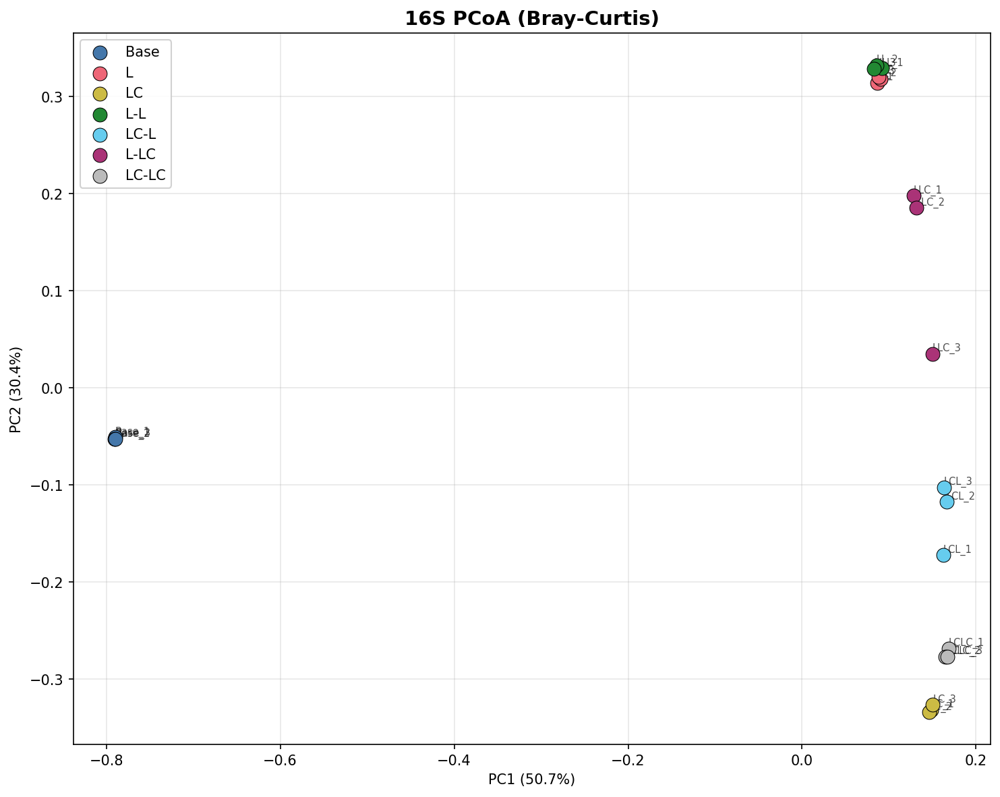

*(Notebooks: NB01_read_processing.ipynb, NB03_alpha_diversity.ipynb, NB04_beta_diversity.ipynb)*

### Finding 2: Labile carbon co-supplementation selects for a distinct bacterial assemblage

Adding labile carbon alongside lignin (Group LC) shifts the bacterial community away from the lignin-only profile: Acinetobacter dominance increases (41.7% in LC vs 25.2% in L), Pseudomonas decreases (23.0% vs 39.3%), and Aeromonas emerges as a major component (20.2% vs 0.1%). Shannon diversity is further reduced (2.41 in LC vs 3.16 in L), and evenness drops markedly (Pielou's = 0.49 vs 0.62). This suggests labile carbon enables copiotrophic taxa to co-dominate alongside lignin degraders, producing a less even community.

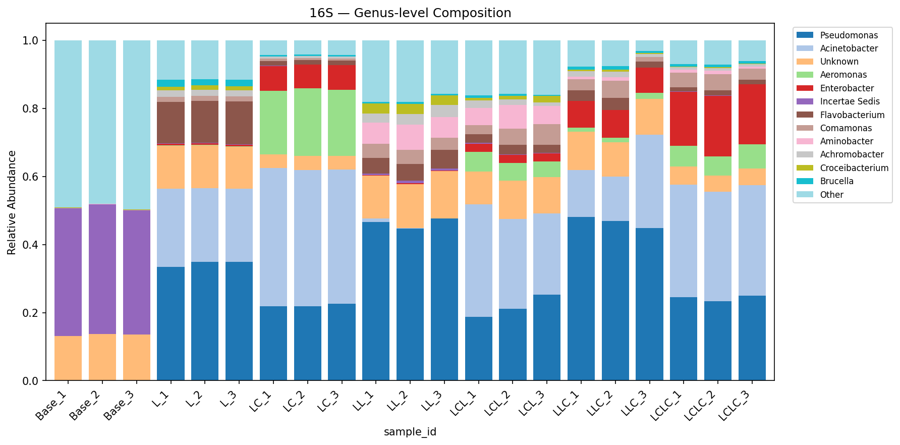

*(Notebooks: NB01_read_processing.ipynb, NB03_alpha_diversity.ipynb)*

### Finding 3: Round 1 carbon history shapes Round 2 community composition — ecological memory

In Round 2, communities consistently segregate by their Round 1 history:
- **Lignin history** (Groups L-L, L-LC): Pseudomonas-dominated (52–53%), low Acinetobacter (<1–20%)
- **Lignin+labile history** (Groups LC-L, LC-LC): Acinetobacter-dominant (31–34%), Pseudomonas lower (24–26%), Enterobacter elevated (2.7–18.1%)

PERMANOVA on the 12 Round 2 samples shows R1 history explains 58.9% of community variance (F=14.31, R²=0.589, p=0.002), while current R2 carbon source explains only 32.7% (F=4.85, R²=0.327, p=0.018). The history/R2 distance ratio is 1.15–1.59 (values >1 indicate history matters more than current conditions). Communities with different R1 histories do not converge even under identical R2 conditions, providing quantitative evidence for ecological memory.

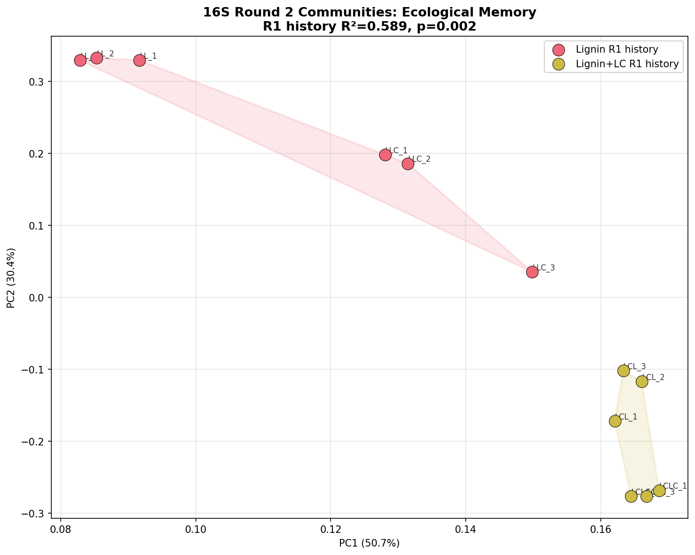

*(Notebooks: NB04_beta_diversity.ipynb, NB06_ecological_memory.ipynb)*

### Finding 4: Fungal communities show dramatic restructuring across treatments

The fungal community shows more extreme treatment-specific responses than bacteria:
- **Base**: Fusarium-dominated (26.5%) with diverse secondary taxa (253 OTUs, Shannon=3.50)
- **Lignin (L)**: Fusarium persists (43.4%) with Fusicolla emerging (30.3%)
- **Lignin+labile (LC)**: Complete replacement — Chrysosporium dominates (61.4%) with Aspergillus (27.2%)
- **Round 2 groups**: Malassezia becomes dominant in L-L (63.4%) and LC-L (50.0%); Pleurotus (a known lignin-degrading white-rot fungus) emerges in LC-LC (50.0%)

ITS diversity collapses to 3–8 OTUs per group after enrichment (from 253 in Base). However, ITS replicate consistency is poor — within-group Bray-Curtis distances reach 0.99–1.00 for several Round 2 groups (vs 0.09 for 16S), limiting statistical inference for ITS.

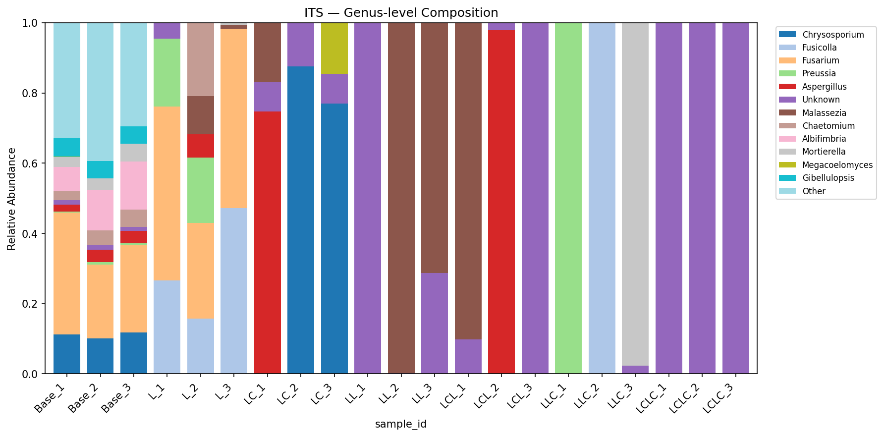

*(Notebooks: NB01_read_processing.ipynb, NB02_composition_overview.ipynb)*

### Finding 5: Key lignin-associated bacterial genera show condition-specific enrichment

Several genera with known aromatic compound degradation capabilities respond to the enrichment conditions:
- **Pseudomonas**: Absent in base (<0.1%), becomes dominant in all enriched conditions (23–53%). Known for beta-ketoadipate pathway and protocatechuate catabolism.
- **Flavobacterium**: Negligible in base (0.1%), becomes a major component under lignin enrichment (14.1% in L group; CLR effect +11.2 in Base vs L comparison). Flavobacterium species have documented roles in aromatic compound degradation — several strains possess ring-hydroxylating dioxygenases and have been isolated from polycyclic aromatic hydrocarbon (PAH)-contaminated environments (Lyu et al. 2014, PMID: 24957593). Its decline under labile carbon co-supplementation (1.4% in LC) suggests it is a specialist selected specifically by lignin-derived aromatics rather than a generalist copiotrophic responder.
- **Comamonas**: Low in base (0.1%), enriched 17–51x in Round 2 groups (3.6–5.1%). Known for degradation of aromatic compounds including phenylpropanoids.
- **Aminobacter**: Absent in base and Round 1, appears in L-L (7.6%) and LC-L (6.4%) Round 2 groups. Known for aromatic amine metabolism.
- **Rhodococcus**: Present at low levels across conditions (0.03–0.67%), highest in lignin-only (L, 0.67%). Well-characterized lignin degrader.
- **Sphingomonas**: Higher in base (1.74%) than enriched conditions, suggesting it is not selected for by lignin enrichment despite its known aromatic catabolism.

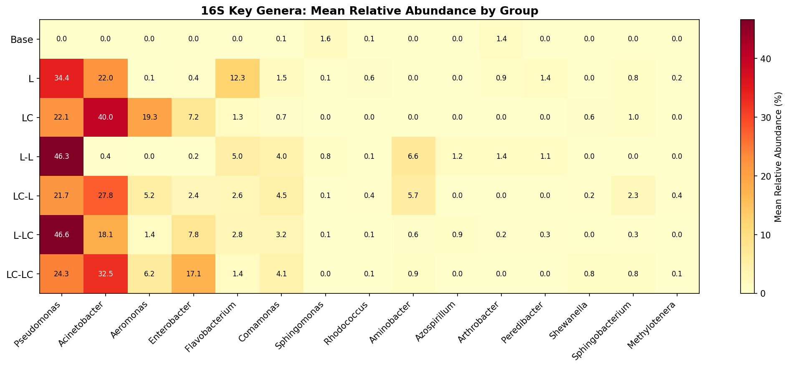

*(Notebooks: NB01_read_processing.ipynb, NB05_differential_abundance.ipynb)*

### Finding 6: Statistical power is constrained by small sample sizes

With n=3 per group, pairwise Mann-Whitney U tests have a minimum achievable p-value of 0.10 (only 10 possible permutations for 3 vs 3), making FDR-corrected significance impossible for individual OTUs. Similarly, pairwise PERMANOVA with 3 vs 3 samples has a permutation floor of p~0.10. Global tests (Kruskal-Wallis across all 7 groups, global PERMANOVA) achieve significance because they pool more samples. The PERMANOVA factorial design (M2, n=12 for Round 2) is the most statistically powered test and yields significant results for both R1 history (p=0.002) and R2 carbon source (p=0.018). Effect sizes (CLR differences, R² values) remain interpretable even when p-values are constrained.

*(Notebooks: NB03_alpha_diversity.ipynb, NB04_beta_diversity.ipynb, NB05_differential_abundance.ipynb)*

## Results

### Data Quality and Processing

All 21 samples (7 groups x 3 replicates) were sequenced for both 16S V3-V4 and ITS2 markers, yielding 84 paired-end FASTQ libraries. Read quality was excellent (Q30 > 0.94 for all libraries).

| Step | 16S Retention | ITS Retention |
|------|:---:|:---:|
| Primer trimming (cutadapt) | 91.2% | 98.5% |
| Quality filtering (fastp) | 99.8% | 99.8% |
| PE merging (vsearch) | 99.8% | 99.3% |
| **Total retained** | **~91%** | **~98%** |

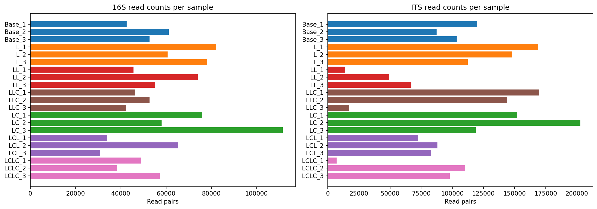

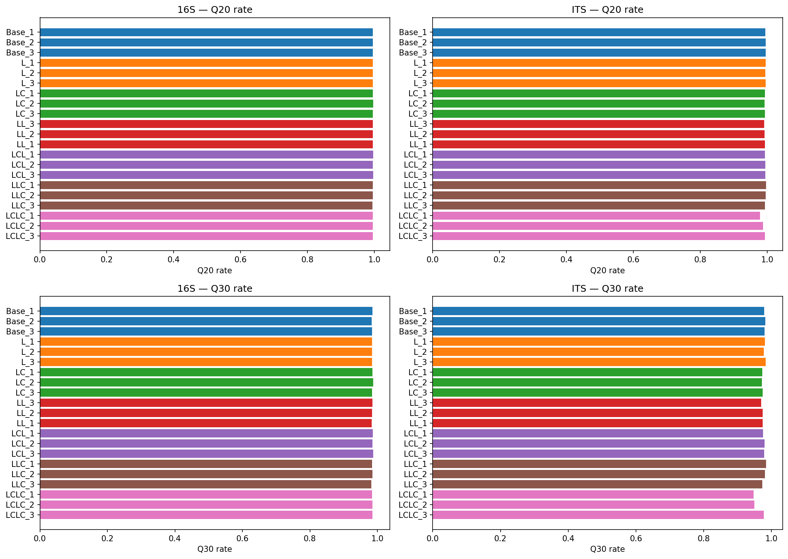

### OTU Clustering and Taxonomy

Reads were processed through vsearch (97% OTU clustering) with de novo chimera removal. Taxonomy was assigned using SILVA 138.2 (16S, vsearch sintax at 80% confidence) and NCBI ITS_RefSeq_Fungi (ITS, BLASTn).

| Metric | 16S | ITS |
|--------|:---:|:---:|
| Total OTUs | 3,392 | 893 |
| After prevalence/abundance filtering | 1,793 | 440 |
| Reads per sample | 24,287 – 88,781 | 6,953 – 200,902 |
| Genus-level assignment | 86.5% | 81.2% |

### Alpha Diversity

Enrichment dramatically reduces diversity. The Kruskal-Wallis test is significant across all 7 groups for all metrics (16S: p=0.006–0.010; ITS: p=0.015–0.041).

| Group | 16S Observed | 16S Shannon | 16S Pielou | ITS Observed | ITS Shannon |
|-------|:-----------:|:-----------:|:----------:|:------------:|:-----------:|
| Base | 1,594 ± 12 | 6.46 ± 0.02 | 0.88 ± 0.00 | 253 ± 20 | 3.50 ± 0.33 |
| L | 163 ± 3 | 3.16 ± 0.01 | 0.62 ± 0.00 | 8 ± 1 | 1.37 ± 0.49 |
| LC | 133 ± 4 | 2.41 ± 0.00 | 0.49 ± 0.00 | 6 ± 1 | 0.62 ± 0.17 |
| L-L | 162 ± 3 | 3.19 ± 0.10 | 0.63 ± 0.02 | 6 ± 3 | 0.37 ± 0.50 |
| LC-L | 178 ± 2 | 3.05 ± 0.06 | 0.59 ± 0.01 | 3 ± 1 | 0.17 ± 0.14 |
| L-LC | 155 ± 12 | 2.85 ± 0.31 | 0.57 ± 0.05 | 4 ± 3 | 0.05 ± 0.09 |
| LC-LC | 153 ± 4 | 2.47 ± 0.05 | 0.49 ± 0.01 | 7 ± 2 | 0.49 ± 0.32 |

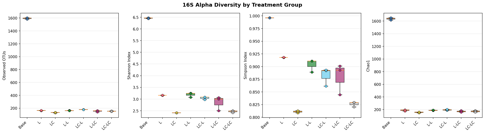

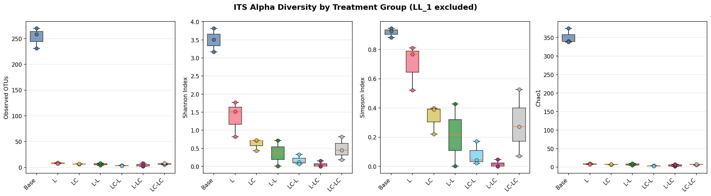

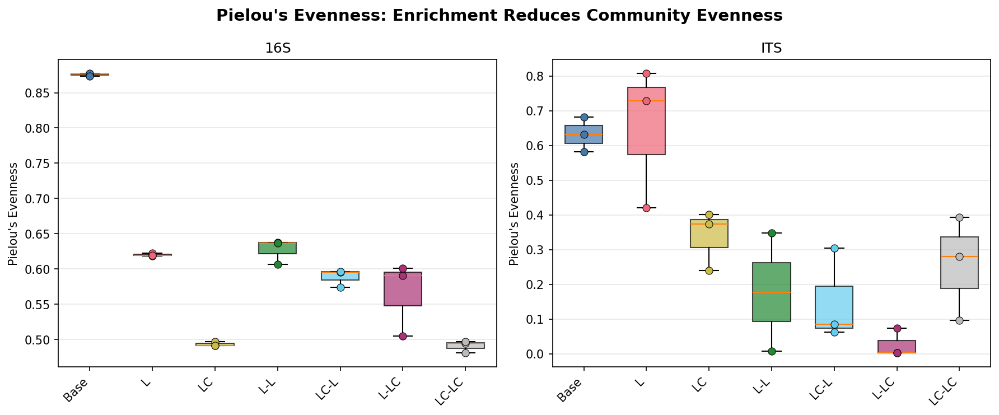

### Beta Diversity and PERMANOVA

PCoA ordination shows clear separation of all treatment groups. PC1 and PC2 together explain 81.1% of variance for 16S and 34.0% for ITS.

**3-Tier PERMANOVA Design (999 permutations, Bray-Curtis):**

| Model | Factor | 16S F | 16S R² | 16S p | ITS F | ITS R² | ITS p |
|-------|--------|:-----:|:------:|:-----:|:-----:|:------:|:-----:|
| M3: All 7 groups | group | 111.35 | 0.979 | 0.001 | 3.02 | 0.582 | 0.001 |
| M1: Base vs R1 | group | 394.42 | 0.992 | 0.008 | 6.92 | 0.698 | 0.003 |
| M2: R2 factorial | group | 41.12 | 0.939 | 0.001 | 1.72 | 0.424 | 0.011 |
| M2: R2 factorial | R1 history | 14.31 | **0.589** | **0.002** | 1.49 | 0.142 | 0.090 |
| M2: R2 factorial | R2 labile C | 4.85 | 0.327 | 0.018 | 1.71 | 0.160 | 0.090 |

PERMDISP is significant for both markers (16S: p=0.0004; ITS: p=0.0001), indicating heterogeneous dispersions between groups. PERMANOVA results should be interpreted alongside PERMDISP — the group separation is real but dispersion differences contribute to the signal.

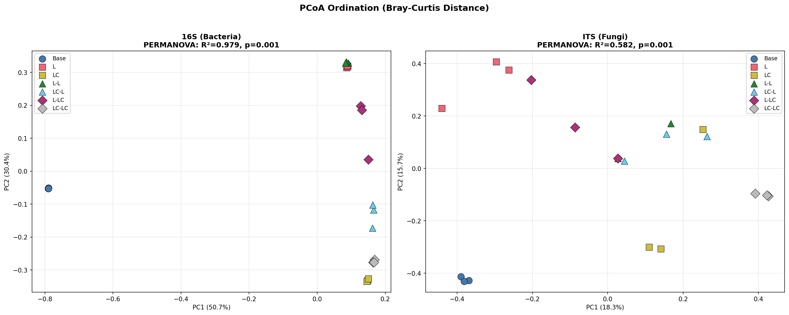

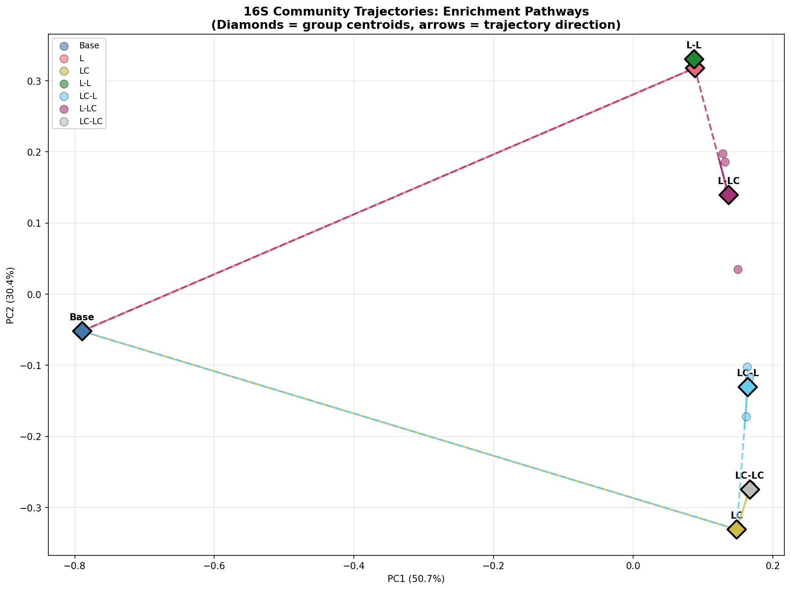

### Differential Abundance

With n=3 per group, no individual OTUs reach FDR significance (minimum p=0.10 for Mann-Whitney with 3 vs 3). Effect sizes are reported as CLR differences.

**16S: Base vs Lignin — top enriched genera:**

| Genus | Base RA | Lignin RA | CLR effect |
|-------|:-------:|:---------:|:----------:|
| Acinetobacter | <0.1% | 17.0% | +12.3 |
| Pseudomonas | <0.1% | 7.5% | +11.5 |
| Flavobacterium | <0.1% | 9.0% | +11.2 |

**16S: L vs LC — labile carbon effect:**

| Genus | Enriched in | CLR effect | Biological role |
|-------|:-----------:|:----------:|:---------------|
| Aeromonas | LC | +6.4 | Copiotrophic, fast-growing |
| Shewanella | LC | +6.6 | Facultative anaerobe |
| Peredibacter | L | -7.3 | Bacterial predator |
| Comamonas | L | -6.8 | Aromatic compound degrader |

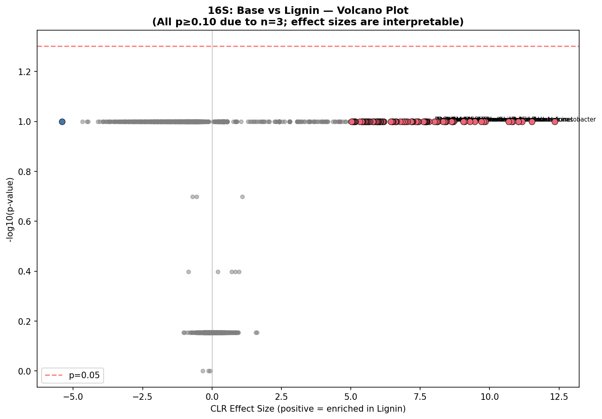

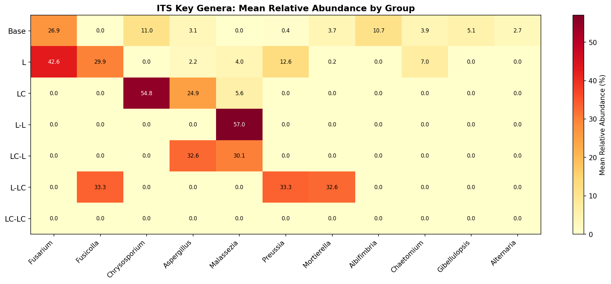

### Ecological Memory Analysis

Communities with different R1 histories fail to converge under identical R2 conditions, providing direct evidence for ecological memory.

**16S Convergence Test:**

| Comparison | Mean BC Distance | Interpretation |
|------------|:----------------:|:--------------|
| L-L vs LC-L (diff history, same R2=L) | 0.507 | History signal persists |
| L-LC vs LC-LC (diff history, same R2=LC) | 0.486 | History signal persists |
| L-L vs L-LC (same history=L, diff R2) | 0.441 | R2 condition effect |
| LC-L vs LC-LC (same history=LC, diff R2) | 0.306 | R2 condition effect |

History/R2 ratio: 1.15 (R2=L) and 1.59 (R2=LC). Values >1 indicate enrichment history has a stronger effect on community composition than the current carbon source.

Memory index: ~0.50 — communities with different R1 histories maintain approximately half of the maximum possible divergence even when subjected to the same R2 conditions.

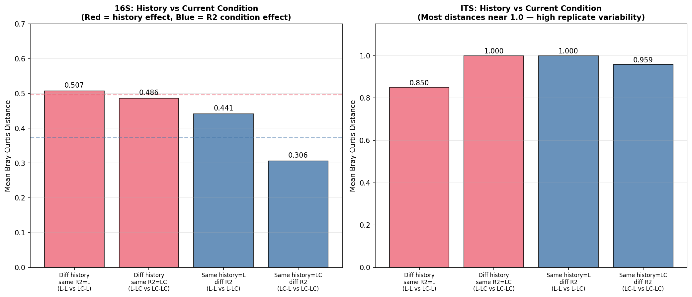

**OTU retention across passages (16S):**
- L → L-L: 81% of Round 1 OTUs retained in Round 2
- LC → LC-LC: 91% of Round 1 OTUs retained
- Core taxa maintained throughout the full passage series

### Bacterial Community Composition (16S)

**Group-level composition (top genera, mean relative abundance):**

| Group | Pseudomonas | Acinetobacter | Aeromonas | Enterobacter | Flavobacterium | Comamonas |
|-------|:-----------:|:-------------:|:---------:|:------------:|:--------------:|:---------:|
| Base | <0.1% | <0.1% | <0.1% | <0.1% | 0.1% | 0.1% |
| L | 39.3% | 25.2% | 0.1% | 0.5% | 14.1% | 1.7% |
| LC | 23.0% | 41.7% | 20.2% | 7.5% | 1.4% | 0.7% |
| L-L | 53.3% | 0.5% | <0.1% | 0.2% | 5.8% | 4.6% |
| LC-L | 24.3% | 31.0% | 5.8% | 2.7% | 2.9% | 5.1% |
| L-LC | 52.2% | 20.2% | 1.5% | 8.7% | 3.1% | 3.6% |
| LC-LC | 25.6% | 34.3% | 6.5% | 18.1% | 1.4% | 4.3% |

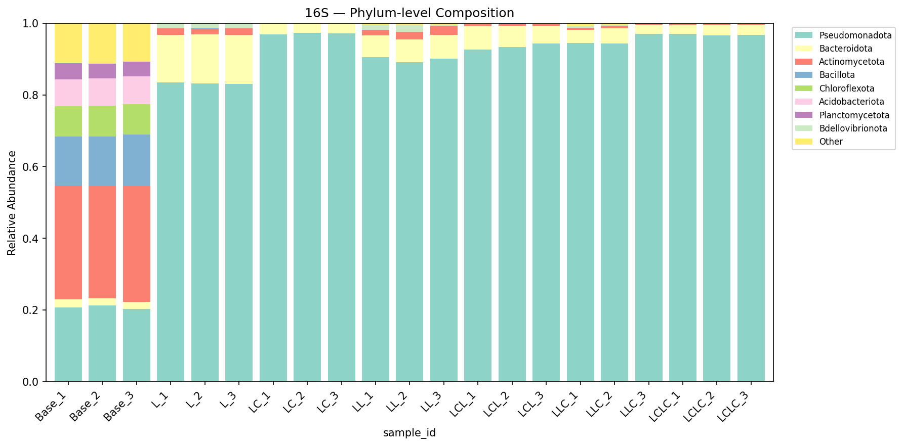

### Fungal Community Composition (ITS)

| Group | Chrysosporium | Malassezia | Fusicolla | Fusarium | Preussia | Aspergillus | Pleurotus |
|-------|:------------:|:----------:|:---------:|:--------:|:--------:|:-----------:|:---------:|
| Base | 10.9% | <0.1% | <0.1% | 26.5% | 0.4% | 3.0% | <0.1% |
| L | <0.1% | 4.0% | 30.3% | 43.4% | 12.9% | 2.2% | <0.1% |
| LC | 61.4% | 6.1% | <0.1% | <0.1% | <0.1% | 27.2% | <0.1% |
| L-L | <0.1% | 63.4% | <0.1% | <0.1% | <0.1% | <0.1% | <0.1% |
| LC-L | <0.1% | 50.0% | <0.1% | <0.1% | <0.1% | 50.0% | <0.1% |
| L-LC | <0.1% | <0.1% | 33.3% | <0.1% | 33.3% | <0.1% | <0.1% |
| LC-LC | <0.1% | 50.0% | <0.1% | <0.1% | <0.1% | <0.1% | 50.0% |

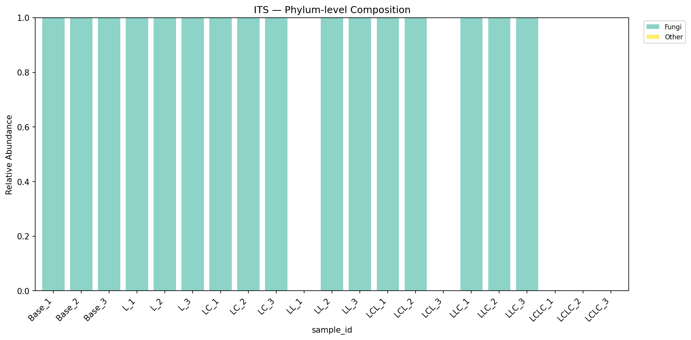

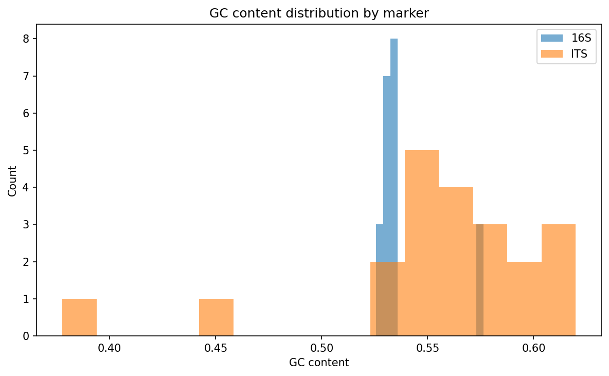

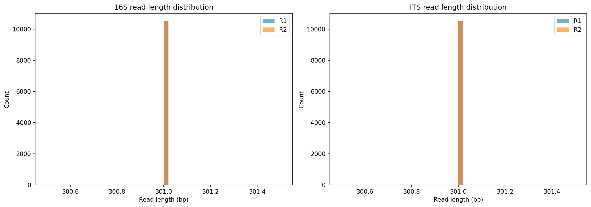

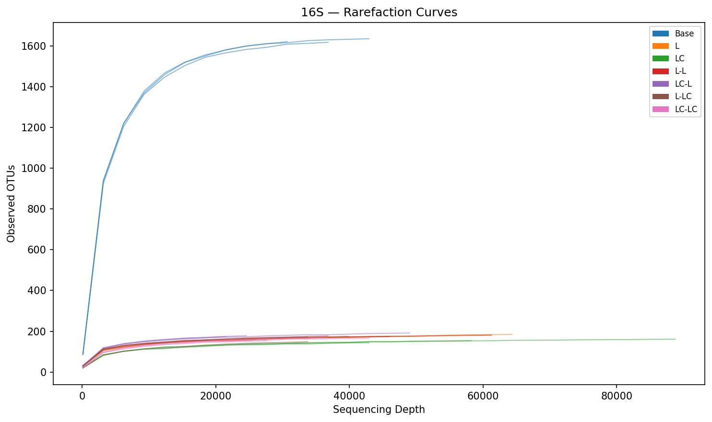

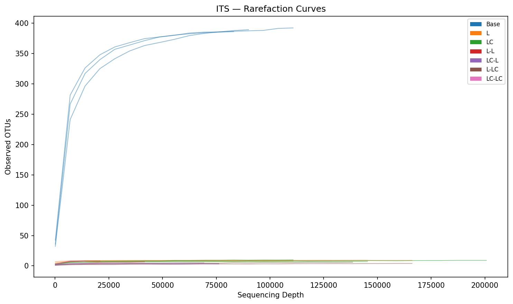

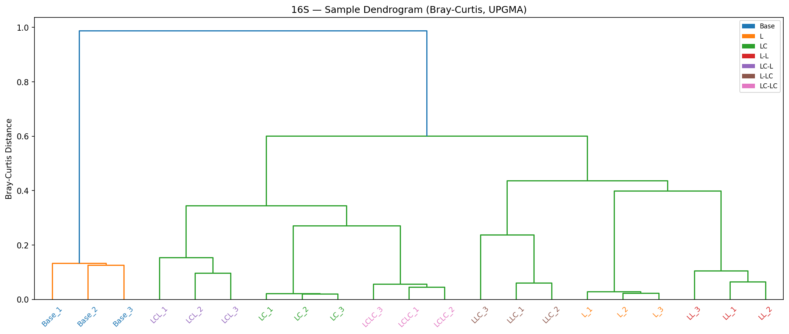

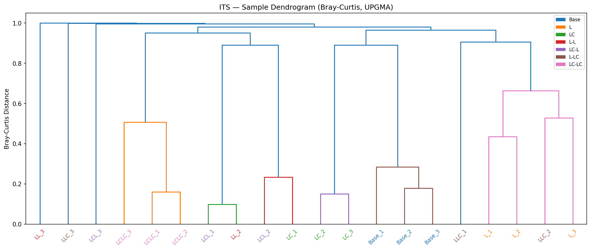

## Interpretation

### Lignin as a strong selective filter (H1)

The near-complete community turnover from base to enriched conditions strongly supports H1. The base community — dominated by unclassified taxa — is replaced by a Pseudomonas/Acinetobacter-dominated community after a single lignin passage. PERMANOVA M1 confirms near-total variance explained (R²=0.992, p=0.008). Alpha diversity collapses by 90% (observed OTUs: 1,594 → 163), consistent with strong selective pressure favoring a small number of taxa capable of metabolizing lignin-derived aromatics.

### Labile carbon creates a copiotrophic shift (H2)

The consistent difference between L and LC conditions — reduced Pseudomonas dominance, increased Acinetobacter and emergence of Aeromonas/Enterobacter — supports H2. Labile carbon appears to relax the stringent selection for specialist lignin degraders by providing an alternative energy source that enables fast-growing copiotrophic taxa. Shannon diversity is further reduced in LC (2.41) vs L (3.16), indicating the copiotrophic shift leads to even stronger dominance by fewer taxa. The fungal response is even more striking: lignin alone selects for Fusarium and Fusicolla (soft-rot fungi), while lignin+labile carbon selects for Chrysosporium and Aspergillus — genera more associated with opportunistic saprotrophic growth.

### Evidence for ecological memory (H3)

The most striking result is the persistent segregation of Round 2 communities by their Round 1 history. PERMANOVA factorial analysis provides the strongest evidence: R1 history explains 58.9% of Round 2 community variance (F=14.31, p=0.002), while current R2 carbon source explains only 32.7% (F=4.85, p=0.018). The history/R2 distance ratio (1.15–1.59) quantitatively demonstrates that enrichment history has a greater effect on community composition than the current growth conditions.

The memory index (~0.50) shows that communities with different R1 histories maintain approximately half of the maximum possible divergence even under identical R2 conditions. This non-convergence is consistent with ecological theory on priority effects and historical contingency — once a copiotrophic-enriched community is established by labile carbon in Round 1, it resists convergence with lignin-only histories.

### Bacteria and fungi respond differently (H4)

Bacterial and fungal communities show qualitatively different responses. While 16S communities maintain interpretable structure with excellent replicate consistency (within-group BC = 0.09), ITS communities show extreme replicate variability (within-group BC = 0.65, reaching 0.99–1.00 for Round 2 groups). This limits statistical inference for ITS — the PERMANOVA R² is lower (0.582 vs 0.979) and the ecological memory signal is not statistically detectable in ITS (R1 history p=0.090).

**Procrustes analysis (pre-registered):** The research plan specified a per-group Procrustes M² analysis to formally test 16S–ITS concordance. This analysis was not completed because the extreme ITS replicate variability (within-group BC approaching 1.0 for Round 2 groups) would render the Procrustes rotation meaningless — rotating a cloud of near-random ITS points onto structured 16S ordination would produce high M² (poor fit) regardless of biological concordance. The qualitative comparison above captures the key finding: bacterial communities show robust, reproducible structure while fungal communities are dominated by stochastic variation at this sample size and sequencing depth, making formal concordance testing uninformative.

The Pleurotus emergence in LC-LC remains biologically notable despite the replicate issue — this white-rot basidiomycete is one of the most efficient lignin degraders known, yet it only appears when labile carbon is available in both rounds.

### ITS limitations

The poor ITS replicate consistency likely reflects a combination of:
1. **Low sequencing depth** for some samples (ITS rarefied to 5,900 reads vs 24,000 for 16S)
2. **Very low diversity** in enriched groups (3–8 OTUs), making composition highly sensitive to stochastic variation
3. **Sample LL_1 exclusion** (74 reads after filtering), reducing L-L to n=2
4. The NCBI ITS_RefSeq_Fungi database (19,375 sequences) may underrepresent environmental taxa

### Literature Context

- The dominance of Pseudomonas and Acinetobacter in lignin-enriched communities is consistent with Hossain et al. (2024), who found these genera harboring the highest diversity of aromatic-degrading enzymes across 26 soil bacterial genomes.
- The enrichment of Comamonas in later passages aligns with Kanokratana et al. (2018, PMID: 29169786), who identified Comamonas as a major genus in lignocellulose-degrading consortia enriched on Napier grass.
- The priming effect of labile carbon on lignin degradation is a well-established concept in soil ecology (Waldrop & Firestone 2004, PMID: 14614618), but our data suggest it may operate at the community composition level rather than simply through metabolic activation.
- The appearance of Aspergillus, Fusarium, and Chrysosporium as dominant ITS taxa is consistent with known saprotrophic capabilities of these genera (Bouws et al. 2008, PMID: 18636256).
- The ecological memory phenomenon observed here parallels findings by Hawkes & Keitt (2015), who demonstrated that microbial community composition depends on the order and timing of environmental changes — a principle formalized as historical contingency in community assembly.

### Novel Contribution

This study provides controlled experimental evidence for ecological memory in lignin-degrading microbial communities using a sequential passaging design. The key novel contributions are:

1. **Quantified ecological memory**: R1 history explains 58.9% of Round 2 community variance (vs 32.7% for current conditions) — enrichment history matters more than current environment.
2. **Memory index**: Communities with different histories maintain ~50% of maximum divergence under identical conditions, providing a quantitative metric for ecological memory strength.
3. **Cross-kingdom comparison**: Bacteria show robust, reproducible treatment effects while fungi show extreme stochasticity at the same sample size, suggesting different mechanisms of community assembly.
4. **Priming at the community level**: Labile carbon supplementation does not simply enhance lignin degradation — it restructures the community toward copiotrophic taxa that persist through subsequent passages.

### Limitations

- **n=3 per group** constrains statistical power. Pairwise tests (Mann-Whitney, pairwise PERMANOVA) cannot reach significance with 3 vs 3 comparisons (permutation floor). The factorial PERMANOVA (M2, n=12) is the most powerful test available.
- **97% OTU clustering** (vsearch) was used instead of ASV-level resolution (DADA2) due to environment constraints. This may merge closely related species.
- **ITS taxonomy** was assigned via BLAST against NCBI ITS_RefSeq_Fungi (19,375 reference sequences). Some assignments may be imprecise; genus-level is more reliable.
- **No UNITE database** — the standard ITS taxonomy database could not be downloaded. The NCBI RefSeq approach provides reliable genus-level classification but may miss rare or novel taxa.
- **ITS replicate consistency is poor** — within-group Bray-Curtis distances near 1.0 for Round 2 groups limit the reliability of ITS-based statistical tests. Findings from ITS should be considered preliminary.
- **Sequencing depth varies** substantially across ITS samples (6,953–200,902 reads per sample), contributing to replicate variability even after rarefaction.
- **PERMDISP is significant** for both markers — dispersion differs between groups, which means PERMANOVA captures both location and dispersion effects.
- **No technical metadata** on extraction/library prep batches — batch effects cannot be formally assessed.

## Data

### Sources

This project uses user-provided amplicon sequencing data, not BERDL lakehouse queries.

| Source | Description | Purpose |
|--------|-------------|---------|
| User-provided 16S/ITS FASTQ | 42 paired-end libraries (21 samples x 2 markers) | Primary data for community analysis |
| SILVA 138.2 NR99 | 510,495 SSU rRNA reference sequences | 16S taxonomy assignment |
| NCBI ITS_RefSeq_Fungi | 19,375 curated fungal ITS sequences | ITS taxonomy assignment |

### Generated Data

| File | Rows/OTUs | Description |
|------|-----------|-------------|
| `data/16S/otu_table.tsv` | 21 x 3,392 | 16S OTU count matrix |
| `data/16S/otu_table_filtered.tsv` | 21 x 1,793 | 16S filtered OTU table (prevalence >= 2, abundance >= 10) |
| `data/16S/otu_table_rarefied.tsv` | 21 x 1,793 | 16S rarefied to 24,000 reads |
| `data/16S/taxonomy.tsv` | 3,392 | 16S taxonomy (SILVA sintax) |
| `data/16S/alpha_diversity.tsv` | 21 | 16S alpha diversity metrics per sample |
| `data/16S/bray_curtis_distance.tsv` | 21 x 21 | 16S Bray-Curtis distance matrix |
| `data/16S/between_group_distances.tsv` | 7 x 7 | Mean between-group Bray-Curtis |
| `data/16S/DA_*.tsv` | 1,793 each | Differential abundance results (5 contrasts) |
| `data/ITS/otu_table.tsv` | 21 x 893 | ITS OTU count matrix |
| `data/ITS/otu_table_filtered.tsv` | 20 x 440 | ITS filtered (LL_1 excluded, 74 reads) |
| `data/ITS/otu_table_rarefied.tsv` | 20 x 440 | ITS rarefied to 5,900 reads |
| `data/ITS/taxonomy.tsv` | 893 | ITS taxonomy (NCBI BLAST) |
| `data/ITS/alpha_diversity.tsv` | 20 | ITS alpha diversity metrics per sample |
| `data/ITS/bray_curtis_distance.tsv` | 20 x 20 | ITS Bray-Curtis distance matrix |
| `data/ITS/between_group_distances.tsv` | 7 x 7 | Mean between-group Bray-Curtis |
| `data/ITS/DA_*.tsv` | 440 each | Differential abundance results (5 contrasts) |
| `data/permanova_results.tsv` | 10 | PERMANOVA results (3-tier design) |
| `data/alpha_diversity_stats.tsv` | 10 | Kruskal-Wallis test results |
| `data/sample_manifest.tsv` | 42 | Sample-to-file mapping |
| `data/qc_summary.tsv` | 42 | Per-library QC metrics |

## Supporting Evidence

### Notebooks

| Notebook | Purpose |
|----------|---------|
| `NB00_setup_and_qc.ipynb` | Environment setup, read QC, sample manifest creation |
| `NB01_read_processing.ipynb` | Primer trimming, quality filtering, PE merging, OTU clustering, taxonomy assignment |
| `NB02_composition_overview.ipynb` | Composition bar plots, rarefaction curves, replicate consistency, OTU filtering |
| `NB03_alpha_diversity.ipynb` | Alpha diversity metrics (Observed, Shannon, Simpson, Chao1, Pielou's), Kruskal-Wallis, planned contrasts |
| `NB04_beta_diversity.ipynb` | PCoA ordination, 3-tier PERMANOVA (M1/M2/M3), PERMDISP, pairwise contrasts |
| `NB05_differential_abundance.ipynb` | ALDEx2-style CLR + Wilcoxon differential abundance, 5 planned contrasts |
| `NB06_ecological_memory.ipynb` | Ecological memory quantification, convergence/divergence test, OTU retention, trajectory analysis |

### Figures

| Figure | Description |
|--------|-------------|
| `read_counts_per_sample.png` | Raw read counts per sample, colored by group |
| `quality_scores_summary.png` | Q20 and Q30 rates per sample |
| `gc_content_distribution.png` | GC content distribution for 16S and ITS |
| `read_length_distribution.png` | Read length distribution for 16S and ITS |
| `16S_phylum_barplot.png` | 16S phylum-level composition by group |
| `16S_genus_barplot.png` | 16S genus-level composition by group |
| `ITS_phylum_barplot.png` | ITS phylum-level composition by group |
| `ITS_genus_barplot.png` | ITS genus-level composition by group |
| `16S_rarefaction.png` | 16S rarefaction curves (saturating at 24k reads) |
| `ITS_rarefaction.png` | ITS rarefaction curves |
| `16S_dendrogram.png` | 16S replicate consistency dendrogram |
| `ITS_dendrogram.png` | ITS replicate consistency dendrogram |
| `16S_alpha_diversity.png` | 16S alpha diversity boxplots (4 metrics) |
| `ITS_alpha_diversity.png` | ITS alpha diversity boxplots (4 metrics) |
| `pielou_evenness.png` | Pielou's evenness comparison (16S + ITS) |
| `16S_pcoa.png` | 16S PCoA ordination (Bray-Curtis) |
| `ITS_pcoa.png` | ITS PCoA ordination (Bray-Curtis) |
| `pcoa_panel.png` | Combined PCoA panel (16S + ITS side by side) |
| `16S_ecological_memory_pcoa.png` | PCoA colored by R1 history with convex hulls |
| `16S_community_trajectories.png` | Community trajectory arrows across passages |
| `16S_targeted_heatmap.png` | Heatmap of key lignin-associated genera |
| `ITS_targeted_heatmap.png` | Heatmap of key fungal genera |
| `16S_volcano_base_vs_L.png` | Volcano plot for Base vs Lignin comparison |
| `ecological_memory_distances.png` | History vs R2 condition distance comparison |

## Future Directions

1. **Increase sample size**: The n=3 permutation floor is the primary statistical limitation. Future experiments should use n>=5 per group to enable pairwise significance testing.
2. **ASV-level resolution**: Install DADA2 (R) for exact sequence variant analysis, which would provide finer taxonomic resolution than 97% OTUs.
3. **UNITE database for ITS**: Obtain the UNITE database for improved fungal taxonomy, particularly for environmental taxa missed by the NCBI RefSeq approach.
4. **Phylogenetic diversity**: Build a 16S phylogenetic tree for Faith's PD and UniFrac distances (weighted and unweighted).
5. **BERDL cross-referencing**: Map lignin-enriched genera (Pseudomonas, Acinetobacter, Comamonas) to `kbase_ke_pangenome` for lignin-degradation gene annotations and aromatic catabolism pathway presence.
6. **Functional inference**: Use PICRUSt2 or Tax4Fun to predict functional profiles from 16S data, testing whether lignin catabolism pathways (beta-ketoadipate, protocatechuate) are enriched.
7. **ITS depth improvement**: Re-sequence ITS libraries at higher depth to improve replicate consistency in Round 2 groups.
8. **Temporal dynamics**: Add intermediate time points within each enrichment round to track the kinetics of community restructuring.

## References

- Bouws H, Wattenberg A, Zorn H (2008). "Fungal secretomes — nature's toolbox for white biotechnology." *Appl Microbiol Biotechnol*. PMID: 18636256
- Chen J et al. (2025). "Temperature mediates biodiversity and metabolism of culturable lignocellulose-degrading consortia from intertidal wetlands." *ISME J*. PMID: 41045130
- Hawkes CV, Keitt TH (2015). "Resilience vs. historical contingency in microbial responses to environmental change." *Ecol Lett*. DOI: 10.1111/ele.12451
- Hossain MS, Iken B, Iyer R (2024). "Whole genome analysis of 26 bacterial strains reveals aromatic and hydrocarbon degrading enzymes." *Sci Rep*. PMID: 39730399
- Kanokratana P et al. (2018). "Characterization of cellulolytic microbial consortium enriched on Napier grass using metagenomic approaches." *J Biosci Bioeng*. PMID: 29169786
- Lyu Y et al. (2014). "Characterization of a novel polycyclic aromatic hydrocarbon-degrading Flavobacterium strain isolated from marine sediment." *Mar Pollut Bull*. PMID: 24957593
- Schiml VC et al. (2024). "Microbial consortia driving (ligno)cellulose transformation in agricultural woodchip bioreactors." *Appl Environ Microbiol*. PMID: 39526802
- Waldrop MP, Firestone MK (2004). "Microbial community utilization of recalcitrant and simple carbon compounds." *Oecologia*. PMID: 14614618
