# Report: Metabolic Capability vs Metabolic Dependency

## Key Findings

### H1 Supported: A Substantial Fraction of Complete Pathways Are Functionally Neutral

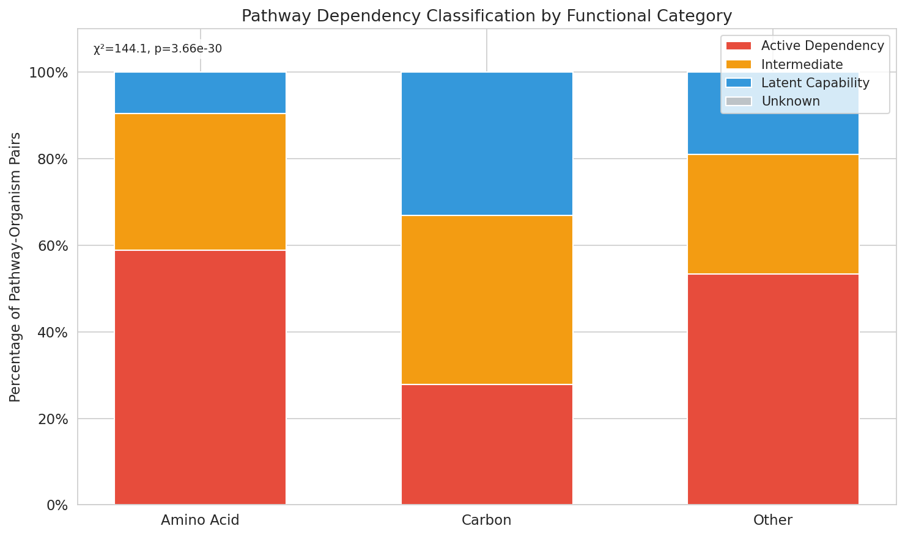

Across 1,695 pathway-organism pairs from 48 organisms, **15.8% of genomically complete pathways were classified as latent capabilities** — pathways the genome encodes but that show no detectable fitness importance under tested conditions (mean |t-score| < 1.0, < 5% essential genes). An additional 32.3% fell in an intermediate zone.

Pathway category strongly predicted dependency class (χ²=163.6, df=4, p=2.5×10⁻³⁴). Carbon source utilization pathways were most likely to be latent (24.3% latent, 39.8% active), while amino acid biosynthesis pathways were predominantly active (63.5% active, 6.5% latent). "Other" category pathways were rarely latent (2.9% latent, 86.8% active).

The latent fraction varied substantially across organisms (range 0–31.6%, mean 15.0%), with *Pseudomonas syringae* strains and *Klebsiella michiganensis* showing the highest proportions.

*(Notebooks: 02_map_pathways_to_fitness.ipynb, 03_classify_pathway_dependencies.ipynb)*

---

### H2 Mixed: Pathway-Level Conservation Undifferentiated; Pangenome Openness Correlated with Latent Rate

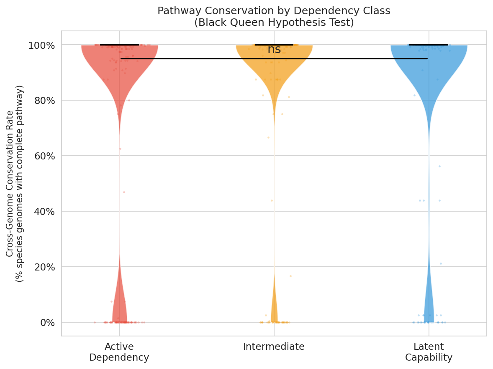

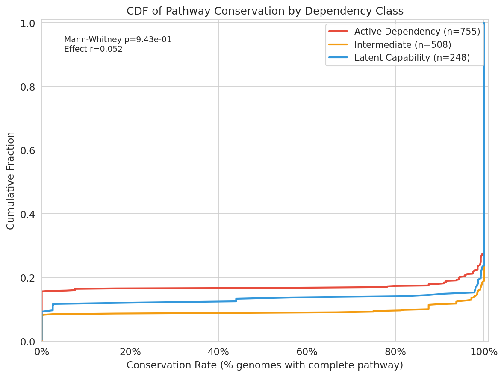

The Black Queen Hypothesis (H2) was tested at two levels, with contrasting outcomes:

**H2a — Pathway-level conservation (not supported).** Conservation rates (fraction of species genomes carrying a complete pathway) did not differ between latent capabilities and active dependencies:

| Dependency Class | n | Mean conservation | Median |
|---|---|---|---|
| Active dependency | 755 | 0.829 | 1.000 |
| Intermediate | 508 | 0.907 | 1.000 |
| Latent capability | 248 | 0.869 | 1.000 |

Latent capabilities showed slightly *higher* mean conservation than active dependencies (Mann-Whitney U, p = 0.94 for active > latent; rank-biserial r = 0.052). H2a is not supported.

**H2b — Pangenome openness (supported).** After aggregating 41 organisms to 22 unique species clades (to ensure independence — multiple Fitness Browser strains from the same clade share a single pangenome openness value), the fraction of latent capabilities per clade correlated positively with pangenome openness (Spearman ρ = 0.69, p = 0.0004, n = 22 clades). Clades with more fitness-neutral complete pathways tend to have more dynamic, less-conserved pangenomes — consistent with the Black Queen framework at the species level.

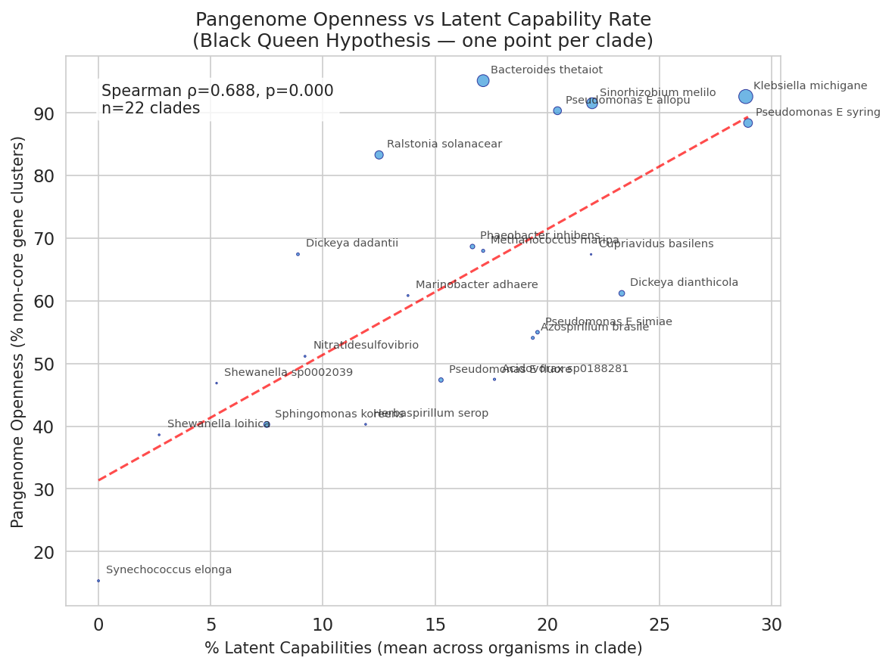

*(Notebook: 04_black_queen_test.ipynb)*

---

### H3 Supported: All Target Species Show Distinct Metabolic Ecotypes

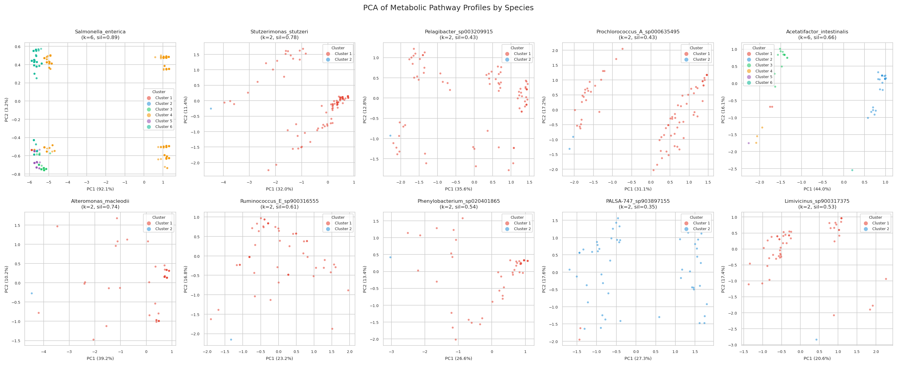

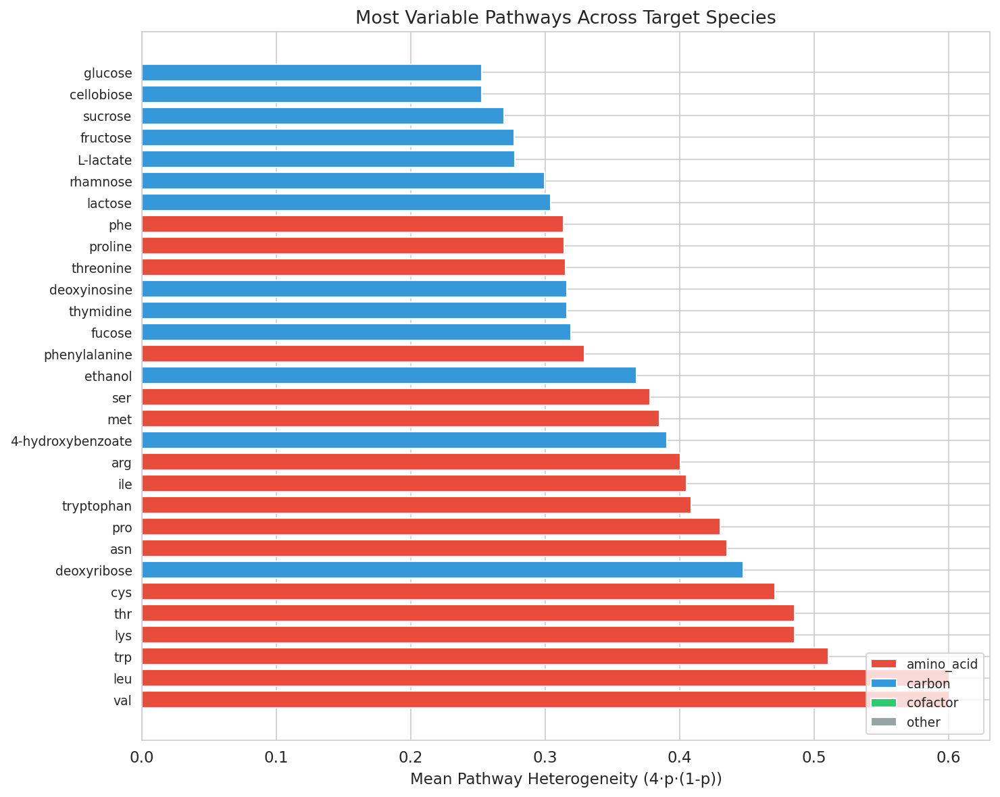

All 10 target species (≥50 genomes, ≥15 variable pathways) showed meaningful metabolic clustering (all silhouette scores > 0.2). Silhouette scores ranged from 0.35 (*PALSA-747* sp.) to 0.89 (*Salmonella enterica*), indicating that some species have near-perfect metabolic separation while others show softer ecotype boundaries.

| Species | Genomes | Clusters (k) | Silhouette |
|---|---|---|---|
| *Salmonella enterica* | 11,396 | 6 | 0.894 |
| *Stutzerimonas stutzeri* | 149 | 2 | 0.780 |
| *Alteromonas macleodii* | 56 | 2 | 0.738 |
| *Acetatifactor intestinalis* | 59 | 6 | 0.657 |
| *Ruminococcus* E sp. | 53 | 2 | 0.609 |
| *Phenylobacterium* sp. | 51 | 2 | 0.544 |
| *Limivicinus* sp. | 50 | 2 | 0.528 |
| *Pelagibacter* sp. | 79 | 2 | 0.430 |
| *Prochlorococcus* A sp. | 74 | 2 | 0.429 |
| *PALSA-747* sp. | 51 | 2 | 0.349 |

Metabolic clusters correlated significantly with isolation environment in *Salmonella enterica* (χ²=1570.2, df=25, p<0.0001) and *Phenylobacterium* sp. (χ²=12.2, df=1, p=0.0005), but not in marine organisms (*Stutzerimonas*, *Alteromonas*).

The most heterogeneous pathways across species were valine/leucine biosynthesis (heterogeneity=0.60), tryptophan (0.51), and lysine/threonine (0.49) — all amino acid biosynthesis pathways.

**Selected heatmaps:**

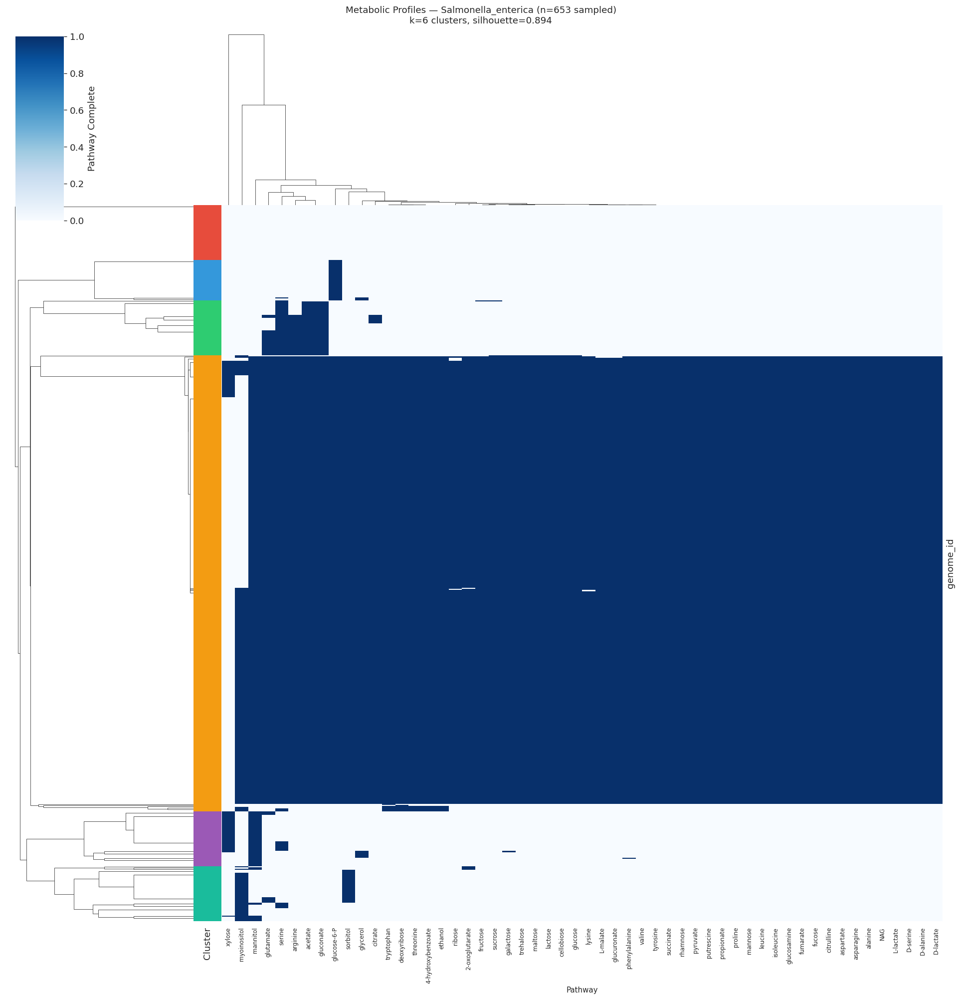

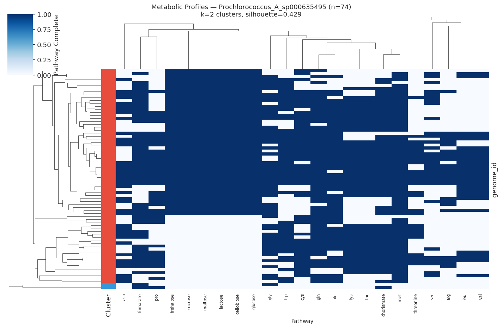

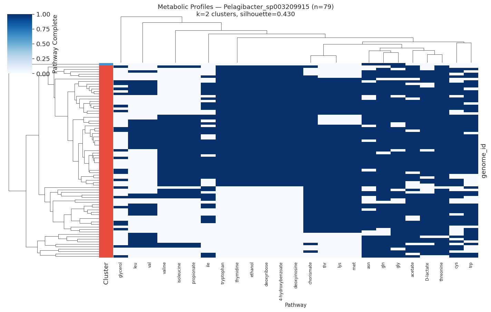

*(Notebook: 05_metabolic_ecotypes.ipynb)*

---

## Results

### Organism Coverage

Pathway fitness metrics were computed for 48 organisms from the Fitness Browser, spanning diverse proteobacteria, firmicutes, and other phyla. For each organism, SEED subsystem annotations were used as a proxy to map GapMind pathway members to Fitness Browser genes.

### Classification Thresholds

Pathways were classified as:
- **Active dependency**: mean |t-score| > 2.0 OR >20% essential genes
- **Latent capability**: mean |t-score| < 1.0 AND <5% essential genes
- **Intermediate**: between thresholds

**Threshold sensitivity**: Varying the active threshold ±25% (1.5–2.5) and latent threshold ±25% (0.75–1.25), the latent fraction ranged from 4.7% to 21.1% (SD = 5.9 percentage points across 16 threshold combinations). At the default thresholds the result is 15.8%. The large intermediate zone (32.3%) means the latent fraction is moderately sensitive to threshold tightening. The qualitative conclusion — that a non-trivial fraction of complete pathways are fitness-neutral, with carbon pathways most affected — holds across the full range tested.

### Pathway Category Breakdown

| Category | Active | Intermediate | Latent | Total |
|---|---|---|---|---|
| Amino acid biosynthesis | 467 (63.5%) | 220 (29.9%) | 48 (6.5%) | 735 |
| Carbon source utilization | 355 (39.8%) | 320 (35.9%) | 217 (24.3%) | 892 |
| Other | 59 (86.8%) | 7 (10.3%) | 2 (2.9%) | 68 |
| **Total** | **881 (51.9%)** | **547 (32.3%)** | **267 (15.8%)** | **1,695** |

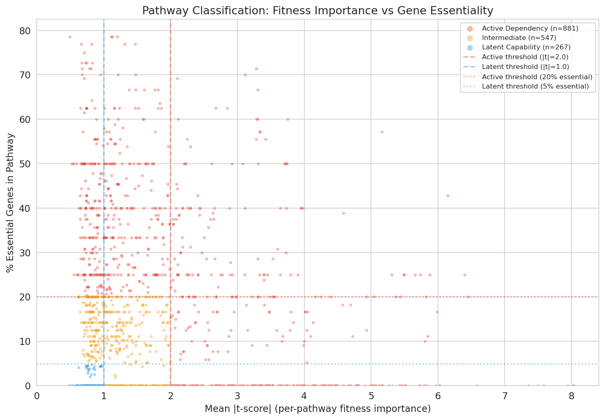

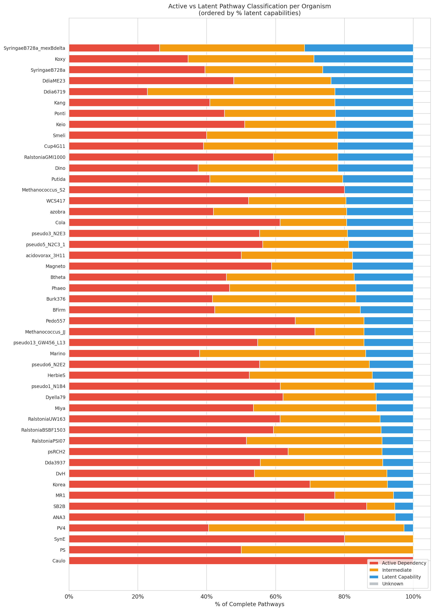

### Pangenome Openness Context

Pangenome openness data was queried for 7,334 species from `kbase_ke_pangenome.pangenome`. Among well-sampled pathogens (>2,500 genomes), *Klebsiella pneumoniae* was most open (99.05% open; 0.95% core genes), while *Mycobacterium tuberculosis* was most closed (97.4% open; 2.6% core genes). Among 22 species clades with fitness data and matched pangenome data (41 organisms aggregated to unique clades), latent capability rate and pangenome openness were positively correlated (Spearman ρ = 0.69, p = 0.0004).

### Excluded Pathways

Two GapMind pathways had no matching SEED subsystem role descriptions and are absent from all analyses: **deoxyribonate** and **myoinositol**. The full-name GapMind entries **phenylalanine** and **tyrosine** also lacked SEED coverage, but their 3-letter equivalents (`phe` and `tyr`) are present via abbreviation-based matching and are included. The pathway **alanine** appears in fitness metrics but was excluded from classification for all organisms due to fewer than 3 SEED-annotated genes meeting the minimum coverage threshold.

---

## Interpretation

### H1: Latent Capabilities Are Real and Pathway-Type Dependent

The 15.8% global latent fraction confirms that genomic completeness alone is an imperfect proxy for functional importance. The striking difference between carbon utilization (24.3% latent) and amino acid biosynthesis (6.5% latent) reflects the distinct selective pressures on these pathway types.

Amino acid biosynthesis pathways are largely essential: they supply fundamental building blocks, and organisms cannot simply scavenge all amino acids from the environment in all growth conditions tested. Carbon source utilization pathways, by contrast, are highly condition-dependent — a pathway for utilizing deoxyribose or ethanol may be encoded but never activated in a lab setting, making it appear latent even if ecologically important. This interpretation is consistent with Ramoneda et al. (2023), who found that amino acid auxotrophies are taxonomically widespread but concentrated in nutrient-rich environments (e.g., host-associated organisms), and with D'Souza et al. (2014), who showed that biosynthetic gene loss provides a ~13% fitness benefit when metabolites are available from neighbors.

### H2: Mixed Results — Pangenome Openness Supports the Black Queen Framework; Pathway Conservation Does Not

The positive correlation between per-clade latent capability rate and pangenome openness (ρ = 0.69, p = 0.0004, n = 22 clades, H2b) provides clade-level support for the Black Queen framework: bacterial clades that carry more fitness-neutral complete pathways also have more dynamic pangenomes, consistent with ongoing streamlining. However, at the pathway level, conservation rates did not distinguish latent from active pathways (H2a). This divergence suggests that the Black Queen signal operates at the level of genome dynamics and community context, rather than being detectable in per-pathway cross-genome conservation ratios.

The failure to detect lower pathway-level conservation in latent capabilities likely also reflects methodological constraints:

1. **Measurement granularity**: `conservation_rate` here captures whether the pathway is complete in each genome in the species clade. This is a coarse measure — it does not detect partial gene erosion (individual gene deletions within an otherwise complete pathway).

2. **Species-level averaging**: The fitness experiments cover only 48 organisms; many organisms in the same species clade may not have been fitness-tested, inflating apparent conservation of pathways that are "complete" but untested.

3. **SEED-proxy noise**: Mapping GapMind pathway membership via SEED subsystem annotations introduces false positives (genes in related subsystems) that dilute the fitness signal, potentially mis-classifying pathways that would otherwise differ in conservation.

4. **Evolutionary lag**: The Black Queen Hypothesis predicts ongoing gene loss, but the time frame over which this is detectable may exceed what current genome sampling captures. Latent capabilities may be mid-loss in some lineages, but still appear conserved at species level.

This contrasts with D'Souza et al. (2014) and Morris et al. (2012), who demonstrated gene loss in experimental and natural populations respectively. The discrepancy may reflect that the BERDL analysis operates at the species level across many taxa, while the Black Queen signal may be strongest within single evolving lineages or communities.

### H3: Metabolic Ecotypes Are Widespread and Environment-Linked in Copiotrophs

The finding that all 10 target species form distinct metabolic ecotypes (silhouette > 0.2) demonstrates that within-species metabolic pathway heterogeneity is a general feature, not an exception. The strongest ecotype structure appeared in *Salmonella enterica* (silhouette=0.89, k=6), where clusters strongly correlated with clinical, food, and environmental isolation sources. This mirrors the well-established epidemiological serovars of Salmonella, and is consistent with Van Rossum et al. (2020), who highlighted strain-level metabolic differentiation in human microbiome species.

The non-significant environment-cluster association in marine organisms (*Stutzerimonas*, *Alteromonas*, *Pelagibacter*, *Prochlorococcus*) may reflect: (a) insufficient metadata resolution in NCBI isolation source fields for marine isolates; (b) metabolic clusters that track depth or nutrient zone rather than discrete source categories; or (c) that metabolic differences in these oligotrophs are driven by gene content differences that GapMind pathway annotations do not capture at the relevant resolution. Nowinski et al. (2023) found that ecological divergence in marine bacteria is shaped by gene content and expression — a signal that pathway-level clustering may partially miss.

The most variable pathways — valine/leucine (0.60), tryptophan (0.51), lysine/threonine (0.49) biosynthesis — represent pathways where some populations have retained biosynthetic independence while others have lost it, consistent with the ecological partitioning of amino acid dependencies observed by Ramoneda et al. (2023) across 26,277 bacterial genomes.

### Literature Context

- **H1 aligns with** D'Souza et al. (2014), who showed biosynthetic gene loss carries a fitness benefit when metabolites are exogenously available, suggesting many "complete" pathways in nutrient-rich environments may already be functionally neutral.
- **H1 aligns with** Ramoneda et al. (2023), who mapped amino acid auxotrophies across >26,000 genomes using GapMind and found that auxotrophies cluster in nutrient-rich, host-associated environments — consistent with carbon-pathway latency in copiotrophic organisms.
- **H2b aligns with** Morris et al. (2012) (Black Queen Hypothesis), who proposed that gene loss in *Prochlorococcus* and *Pelagibacter* is driven by selection; the positive ρ = 0.69 correlation between latent fraction and pangenome openness (across 22 independent species clades) is consistent with this clade-level dynamic.
- **H2a (pathway-level) aligns with** Schakel et al. (2025), who showed that cross-feeding-based gene loss requires spatial structuring and is not straightforwardly predicted by the fitness cost of gene retention alone — consistent with why simple conservation-rate ratios do not discriminate latent from active pathways.
- **H3 aligns with** Tschoeke et al. (2020) (Prochlorococcus collective) and Nowinski et al. (2023), which both describe metabolic ecotypes within marine bacterial species defined by gene content differences — consistent with the pathway-based clustering observed here.

### Novel Contribution

This analysis provides, to our knowledge, the first systematic quantification of the **latent capability fraction** — complete-but-fitness-neutral pathways — across a diverse set of bacterial species using genome-wide fitness data. The finding that carbon source utilization pathways are 3.7× more likely to be latent than amino acid biosynthesis pathways (24.3% vs 6.5%) is a specific, testable prediction: organisms in nutrient-rich environments should disproportionately lose carbon-pathway genes over evolutionary time, while amino acid biosynthesis genes are retained under stronger purifying selection.

### Limitations

- **SEED-proxy pathway mapping** introduces noise; a direct gene-to-pathway mapping (using GapMind gene assignments) would improve precision.
- **Fitness experiments are biased toward laboratory conditions**: lab media may not reflect the full range of conditions under which pathways are expressed, inflating the latent fraction.
- **Conservation measurement is pathway-level, not gene-level**: cannot detect partial pathway erosion or progressive gene loss within a pathway.
- **Ecotype analysis is observational**: the environment-cluster correlations in *Salmonella* and *Phenylobacterium* suggest causal links to ecological selection, but confounding by phylogenetic structure is possible without explicit phylogenetic correction.
- **48-organism fitness coverage** is a small fraction of the 293,000 genomes with pathway predictions; results may not generalize to all taxonomic groups.
- **NB02 organism-to-clade taxonomy matching failed**: an attempt to link Fitness Browser organisms to GapMind species clades via NCBI taxonomy IDs from `kbase_ke_pangenome.gtdb_metadata` returned zero matches because the relevant column contained boolean strings rather than numeric taxids. Downstream analyses therefore use organism-level fitness aggregates without an explicit clade-level linkage, which may reduce the precision of the H2a conservation comparison.

---

## Data

### Sources

| Collection | Tables Used | Purpose |
|---|---|---|
| `kbase_ke_pangenome` | `gapmind_pathways`, `pangenome`, `gtdb_metadata` | Pathway completeness predictions (305M rows, 80 pathways, 293K genomes); pangenome openness; NCBI taxonomy for organism matching |
| `kescience_fitnessbrowser` | `genefitness`, `gene`, `seedannotation` | Gene-level fitness scores (48 organisms); essentiality inference; SEED subsystem proxy for pathway membership |

### Generated Data

| File | Rows | Description |
|---|---|---|
| `data/gapmind_genome_pathways.csv` | 23,424,480 | Per-genome pathway completeness (genome_id, species, pathway, best_score, is_complete) |
| `data/gapmind_species_summary.csv` | 27,690 | Per-species pathway statistics |
| `data/pathway_fitness_metrics.csv` | 3,065 | Per-(organism, pathway) fitness aggregates from SEED-proxy mapping |
| `data/pathway_classification.csv` | 1,695 | Dependency class assignments (active/intermediate/latent) |
| `data/pathway_conservation.csv` | 1,511 | Per-pathway conservation rates in species clade |
| `data/pangenome_openness.csv` | 7,334 | Species-level pangenome openness metrics |
| `data/pathway_heterogeneity.csv` | 800 | Per-(species, pathway) heterogeneity scores for 10 target species |
| `data/metabolic_ecotypes.csv` | 12,018 | Genome cluster assignments with PCA coordinates |
| `data/ecotype_cluster_summary.csv` | 10 | Clustering quality (silhouette, k) per species |
| `data/pathway_cluster_signatures.csv` | 370 | Pathway markers distinguishing each ecotype (chi-square, Bonferroni-corrected p-values, rate range per cluster) |

---

## Supporting Evidence

### Notebooks

| Notebook | Purpose |
|---|---|
| `01_extract_gapmind_pathways.ipynb` | Extract and aggregate GapMind predictions from Spark (`kbase_ke_pangenome.gapmind_pathways`) |
| `02_map_pathways_to_fitness.ipynb` | Map pathways to Fitness Browser genes via SEED annotations; compute fitness aggregates |
| `03_classify_pathway_dependencies.ipynb` | Classify pathways as active/intermediate/latent; chi-square tests; figures |
| `04_black_queen_test.ipynb` | Join pathway classes with pangenome conservation; test H2 |
| `05_metabolic_ecotypes.ipynb` | Hierarchical clustering and PCA of within-species pathway variation; ecotype detection |

### Figures

| Figure | Description |
|---|---|
| `figures/nb03_stacked_bar.png` | Stacked bar chart: dependency class distribution by pathway category |
| `figures/nb03_scatter.png` | Scatter: mean \|t-score\| vs % essential genes, colored by dependency class |
| `figures/nb03_organism_overview.png` | Per-organism breakdown of active vs latent pathway counts |
| `figures/nb04_conservation_boxplot.png` | Box plot: conservation rate by dependency class |
| `figures/nb04_conservation_cdf.png` | CDF of conservation rates by dependency class |
| `figures/nb04_openness_scatter.png` | Pangenome openness vs. per-clade latent capability rate (Spearman ρ=0.69, p=0.0004, n=22 clades) |
| `figures/nb05_pathway_heterogeneity.png` | Top 30 most variable pathways across target species |
| `figures/nb05_pca_all_species.png` | PCA of pathway profiles for all 10 target species, colored by cluster |
| `figures/nb05_heatmap_*.png` | Clustered heatmaps (genomes × pathways) for each of the 10 target species |

---

## Future Directions

1. **Gene-level conservation analysis**: Replace pathway-level conservation with per-gene dN/dS or gene presence/absence across a phylogeny to directly test the Black Queen prediction of progressive gene loss.
2. **Direct GapMind gene mapping**: Use GapMind's per-step gene assignments (rather than SEED-proxy) to improve pathway-to-fitness mapping precision and reduce false positives.
3. **Longitudinal validation**: Identify lineages with recent gene loss events (singletons or auxiliary genes in pangenome) in pathways classified as latent, and verify that these represent actual deletion events in the phylogeny.
4. **Environmental metadata enrichment**: Supplement NCBI isolation source with trait databases (e.g., BacDive, GTDB environmental labels) to improve resolution of the ecotype-environment association test.
5. **Cross-species latency patterns**: Test whether organisms with higher latent fractions are more likely to encode public-goods pathways or co-occur with cross-feeding partners in community datasets.

---

## References

- Morris JJ, Lenski RE, Zinser ER. (2012). "The Black Queen Hypothesis: evolution of dependencies through adaptive gene loss." *mBio* 3(2):e00036-12. DOI: 10.1128/mBio.00036-12

- D'Souza G, Waschina S, Pande S, Bohl K, Kaleta C, Kost C. (2014). "Less is more: selective advantages can explain the prevalent loss of biosynthetic genes in bacteria." *Evolution* 68(9):2559-2570. PMID: 24910088

- Price MN, Wetmore KM, Waters RJ, Callaghan M, Liu H, Kuehl JV, et al. (2018). "Mutant phenotypes for thousands of bacterial genes of unknown function." *Nature* 557:503–509. DOI: 10.1038/s41586-018-0124-0

- Price MN, Deutschbauer AM, Arkin AP. (2022). "Filling gaps in bacterial catabolic pathways with computation and high-throughput genetics." *PLoS Genetics* 18(4):e1010156. DOI: 10.1371/journal.pgen.1010156

- Price MN, Shiver AL, Day LA, Torres M, Lesea HP, et al. (2024). "Improving the annotation of amino acid biosynthesis pathways: GapMind 2024." *bioRxiv*. DOI: 10.1101/2024.10.14.618325

- Price MN, Arkin AP. (2024). "Interactive tools for functional annotation of bacterial genomes." *Database* baae089. DOI: 10.1093/database/baae089

- Ramoneda J, Jensen TBN, Price MN, et al. (2023). "Taxonomic and environmental distribution of bacterial amino acid auxotrophies." *Nature Communications* 14:7608. DOI: 10.1038/s41467-023-43435-4

- Van Rossum T, Ferretti P, Maistrenko OM, et al. (2020). "Diversity within species: interpreting strains in microbiomes." *Nature Reviews Microbiology* 18:491–506. DOI: 10.1038/s41579-020-0368-1

- Nowinski B, Feng X, Preston CM, Birch JM, et al. (2023). "Ecological divergence of syntopic marine bacterial species is shaped by gene content and expression." *ISME Journal* 17:813–823. DOI: 10.1093/ismej/wrad008

- Behringer MG, Ho WC, Meraz JC, et al. (2022). "Complex Ecotype Dynamics Evolve in Response to Fluctuating Resources." *mBio* 13(2):e03467-21. PMID: 35575545

- Schakel OF, Fritts RK, Zmuda AJ, et al. (2025). "Microbial cross-feeding stabilized by segregation of a dependent mutant from its independent ancestor." *ISME Journal* wraf131. PMID: 40568968

- Tschoeke D, Salazar VW, Vidal L, et al. (2020). "Unlocking the Genomic Taxonomy of the *Prochlorococcus* Collective." *Microbial Ecology* 82:41–53. DOI: 10.1007/s00248-020-01526-5
