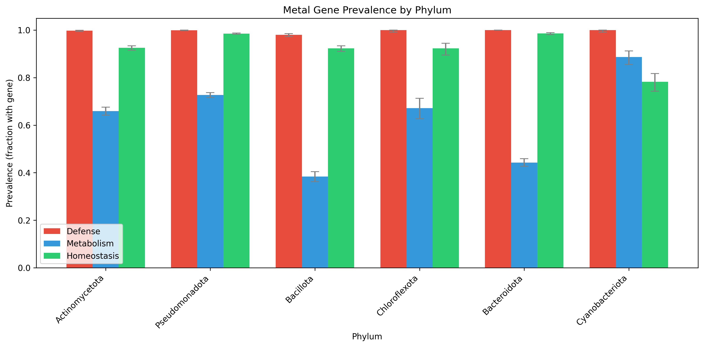
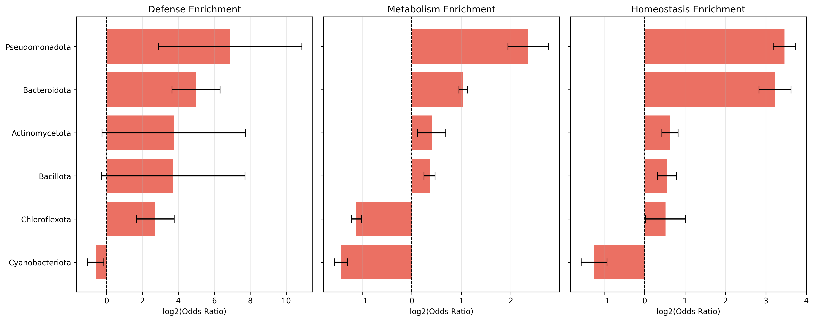
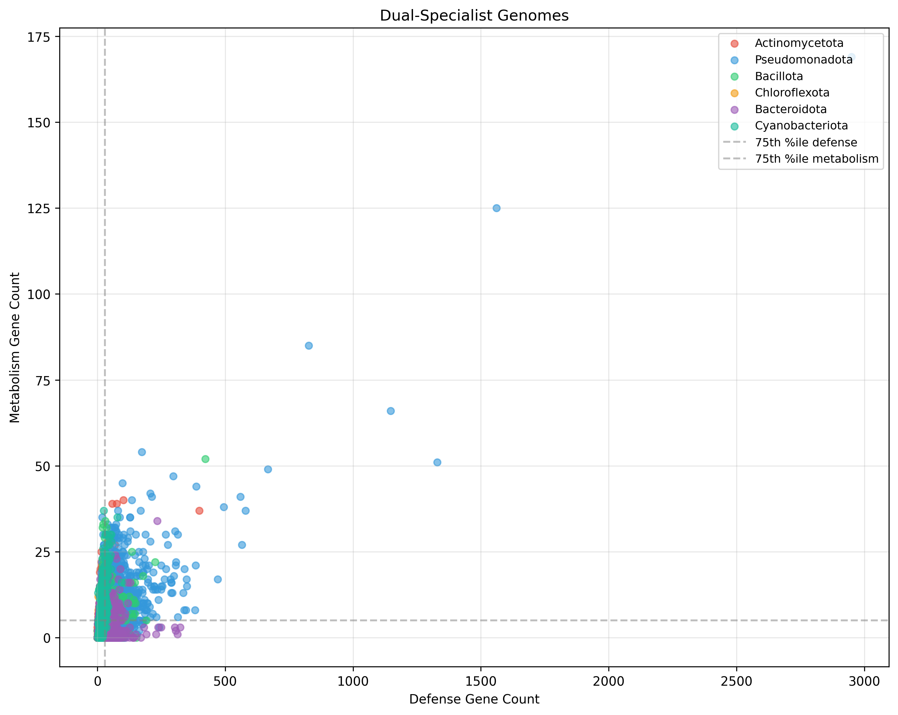
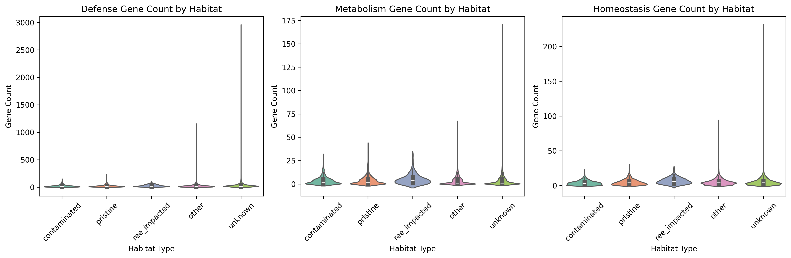
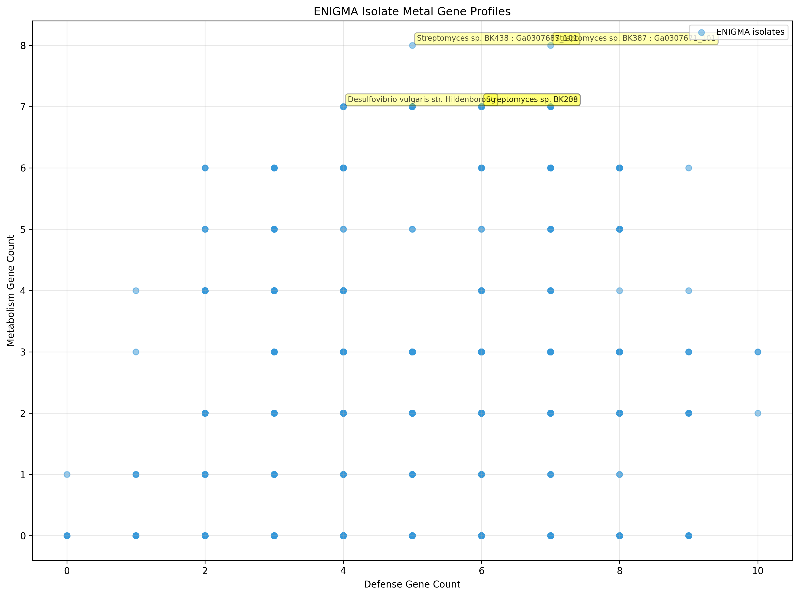

# Report: Metal Defense vs. Metal Metabolism — A Classification Framework for Bacterial Metal Proteins

## Key Findings

### Defense Genes Are Near-Universal; Metabolism Genes Are Phylogenetically Selective

Across 27,690 representative species (one per species, GTDB R214), metal defense gene
clusters are present in 98.6% of genomes (mean 23.1 clusters per genome), effectively
constituting a universal genomic feature. Metal metabolism genes are present in the
majority of genomes (mean 2.79 clusters per genome after removal of spurious pqqA–E KOs;
pre-correction mean was 3.4), with strong phylogenetic structuring. This
asymmetry — defense universal, metabolism selective — is the central pattern of the
classification framework.

*(Notebook: 02_pangenome_classification.ipynb)*

### Phylum-Level Enrichment Reveals Distinct Evolutionary Strategies

Fisher's exact tests with BH-FDR correction identified significant enrichment patterns
at the phylum level (18 tests, all significant at q < 0.05):

**Defense enrichment** (relative to all other phyla):
- Bacteroidota: OR = 117.6 (q < 10⁻²³) — highest proportional defense enrichment
- Pseudomonadota: OR = 31.7 (q < 10⁻⁴⁵) — largest absolute defense burden
- Actinomycetota: OR = 6.6 (q < 10⁻¹²)
- Bacillota: OR = 0.65 (q = 0.017) — significantly defense-depleted

**Metabolism enrichment**:
- Cyanobacteriota: OR = 5.1 (q < 10⁻⁴¹) — highest metabolism enrichment
- Pseudomonadota: OR = 2.1 (q < 10⁻¹³⁶)
- Bacillota: OR = 0.37 (q < 10⁻¹⁰⁵) — strongly metabolism-depleted
- Bacteroidota: OR = 0.46 (q < 10⁻¹⁰²) — strongly metabolism-depleted

The inverse relationship — Bacteroidota highly defense-enriched yet metabolism-depleted,
and Bacillota depleted in both — indicates that high defense burden and high metabolism
burden are not co-selected at the phylum level.

*(Notebook: 03_phylogenetic_distribution.ipynb)*

### H3 Partially Supported: Most Bacteria Carry Both Classes, but Strict Dual Specialization Is Minority

The hypothesis predicted that "dual specialization (high defense AND high metabolism)"
would be restricted to a small number of lineages. Testing requires two definitions:

- **Broad (carry at least one gene from each class)**: 16,774 species (60.6%) carry
  both gene classes, while 10,533 (38.0%) carry defense only, 67 (0.2%) metabolism
  only, and 316 (1.1%) neither. Co-occurrence of the two classes is the modal state.
  *(Note: these counts were computed before pqqA–E removal; NB03 cell `d69ca26f` will
  produce updated values on next cluster run. Strict dual-specialist count of 3,699
  reflects the post-correction run.)*
- **Strict (>75th percentile in both)**: only 3,699 species (13.4%) carry high loads
  of both defense and metabolism genes simultaneously. These are the true dual
  specialists in the sense H3 intended — elevated in both categories, not merely
  present in both.

H3 is supported in its strict form (13.4% is a minority, consistent with "restricted
to a smaller lineage set") but the broad definition shows dual co-occurrence is common.
The RESEARCH_PLAN phrasing "high densities of both classes" aligns with the strict
definition; the broad result is reported alongside for completeness.

*(Notebook: 03_phylogenetic_distribution.ipynb)*

### Metabolism, Not Defense, Shows Habitat Selectivity

Testing H1 (defense enriched in contaminated) and H2 (metabolism enriched in
pristine/REE-impacted) against 27,690 genomes with isolation source metadata:

Raw Fisher exact tests (pqqA–E removed from seed list; 15 metabolism KOs):

| Habitat | Category | Raw OR | 95% CI | q (raw) | Phylum-adj OR | q (adj) |
|---------|----------|--------|--------|---------|---------------|---------|
| Contaminated | Defense | 0.32 | [0.23, 0.45] | 4.6 × 10⁻⁸ | 0.64 | 0.02 |
| Contaminated | Metabolism | **1.25** | [1.10, 1.42] | 1.8 × 10⁻³ | **1.28** | 1.6 × 10⁻³ |
| Contaminated | Homeostasis | 0.50 | [0.43, 0.59] | 8.2 × 10⁻¹⁴ | 0.65 | 6.3 × 10⁻⁵ |
| Pristine | Metabolism | 1.00 | — | n.s. | 0.70 | 2.3 × 10⁻⁸ |
| Pristine | Homeostasis | 0.82 | [0.70, 0.96] | 0.03 | 0.60 | 1.7 × 10⁻⁷ |
| REE-impacted | Metabolism | 1.46 | — | n.s. | 1.24 | n.s. |
| REE-impacted | Homeostasis | 3.83 | [1.32, 11.1] | 4.9 × 10⁻³ | 2.76 | n.s. (0.11) |

Phylum-adjusted ORs from logistic regression (`has_category ~ is_habitat + C(phylum_grp)`, top-10 phyla; `ecology_results_phylum_adj.csv`).

**H1 (defense enriched in contaminated) is not supported.** The raw OR=0.32 appeared to be a taxonomic composition artifact: contaminated-habitat samples are enriched in defense-poor archaea (Patescibacteria, Thermoplasmatota, and Micrarchaeota are substantially over-represented among contaminated-habitat genomes relative to the full pangenome). However, phylum-adjusted logistic regression shows that the defense depletion persists within phyla (OR=0.64, q=0.02). The effect is *partially* compositional — phylum adjustment cuts the apparent depletion roughly in half — but a genuine within-phylum signal remains. Contaminated habitats may select for genomes with reduced defense loads within each lineage, possibly because toxicity-specialized bacteria crowd out generalist defenders.

**H2 (metabolism enriched in pristine/REE) is not supported.** After removing the spurious pqqA–E KOs (see Limitations — Spurious PQQ Annotations) and applying phylum-adjusted logistic regression:
- **Contaminated sites**: metabolism is genuinely enriched (raw OR=1.25, q=0.002; phylum-adj OR=1.28, q=0.002 — robust). This is unexpected relative to H2 but consistent with a positive ecological relationship between metal availability and metal metabolism gene carriage.
- **Pristine sites**: metabolism is not enriched by raw Fisher test (OR=1.00, n.s.) and is significantly *depleted* after phylum control (OR=0.70, q=2.3×10⁻⁸). Pristine-habitat phyla are enriched in metabolism-carrying lineages (e.g., nitrogen-fixing Pseudomonadota), which maskes a genuine within-phylum depletion relative to contaminated sites.
- **REE-impacted sites**: metabolism enrichment (raw OR=1.46) is not significant after FDR correction and is not confirmed by phylum-adjusted regression (OR=1.24, n.s.). The 114-genome REE sample is too small to resolve phylum-adjusted effects.

The **note on Thermoplasmatota**: post-hoc KO tracing of all 294 Thermoplasmatota showed that the old 87.4% apparent metabolism prevalence was driven by pqqB (60.9%) and pqqE (63.6%) — but pqqC is absent in all 294 genomes and xoxF in only 1, indicating spurious annotation in non-methylotrophic marine archaea and acidophiles. Genuine metabolism KOs (mcrA, hyd1, nifH) are present in only 22.4%. These KOs were removed from the seed list before the re-run; the results above reflect the corrected classification.

**The most robust ecological finding**: metal metabolism genes are specifically enriched in contaminated habitats (phylum-adj OR=1.28, q=0.002), not in pristine or REE-impacted habitats. This reverses the H2 hypothesis direction and suggests that metal contamination, rather than metal scarcity, drives metabolism gene selection.

*(Notebook: 04_ecological_signature.ipynb)*

### ENIGMA Isolates: Nitrogen-Fixing Proteobacteria Now Lead After PQQ Correction

Applying the corrected classifier (pqqA–E removed) to 2,879 ENIGMA Genome Depot isolates, mean gene loads are: defense = 5.7 (range 0–10), metabolism = 2.0 (range 0–6), homeostasis = 4.9 (range 0–8). The pqqA–E removal reduced the maximum n_metabolism from 8 to 6 and changed the top-candidate composition substantially.

**Under the corrected seed list, the top candidates by n_metabolism (all at n=6) are:** Environmental isolates from the ENIGMA FHT series (GW821, GW822, GW823 groundwater sites), *Bradyrhizobium* sp. BK707, *Paraburkholderia* sp. PDC91, *Azospirillum brasilense* Sp245, and *Sphingomonas wittichii* YR128. These genera carry genuine combinations of nitrogenase (nifH/nifD/nifK), urease, and/or [NiFe]-hydrogenase KOs — all verified metal-utilizing functions.

The former top *Streptomyces* candidates (BK387, BK438; previously n_metabolism = 8) held those positions partly because pqqA–E inflated their counts. *Streptomyces* genuinely carry MAI (K16163) and some urease/nitrogenase-related KOs, but at lower counts without PQQ. They remain competitive candidates for MAI-specific experiments.

For experimental prioritization, **n_metabolism is the recommended primary ranking criterion**. The composite score (z_metabolism×40 + z_homeostasis×10 − z_defense×5, saved in `enigma_isolate_classification.csv`) provides an alternative; weights are working assumptions. Given the groundwater Environmental isolates (many uncharacterized) dominate the top 20, culture-confirmed isolates (*Azospirillum brasilense* Sp245, *Bradyrhizobium* sp. BK707, *Paraburkholderia* sp. PDC91) are practically the most actionable targets for immediate metal metabolism experiments.

*(Notebook: 05_enigma_application.ipynb)*

## Discoveries

- **Contaminated habitat metabolism enrichment is a genuine ecological signal** (phylum-adjusted OR=1.28, q=0.002; robust to phylum composition control) — but it is specific to contaminated sites, not pristine or REE-impacted sites. Pristine-habitat metabolism is not enriched (raw OR=1.00) and is slightly depleted after phylum control (OR=0.70, q<0.001), reversing the original H2 hypothesis. The contaminated-habitat defense depletion is partly compositional (raw OR=0.32 → phylum-adj OR=0.64) but a genuine within-phylum effect persists. Spurious pqqA–E KO annotations were traced and removed from the seed list before this re-run; the corrected Thermoplasmatota metabolism prevalence is 22.4% (not 87.4%).
- Defense genes are effectively universal in bacteria (98.6% prevalence across 27,690 species), making contaminated-habitat enrichment tests uninformative for this class; habitat ecology studies of metal gene distributions should focus on metabolism and homeostasis genes where variance is high enough to detect ecological structure.
- Broad co-occurrence of defense and metabolism is the modal state (60.6% of species carry both at any count), but strict dual specialization — elevated in both categories simultaneously (>75th percentile in both) — is a minority pattern (13.4%). H3's prediction of restriction to a small lineage set holds for the strict definition.

## Performance Notes

- `spark.read.parquet(local_path)` fails when the local path is on the JupyterHub filesystem — remote Spark executors cannot access it. Fix: collect Spark results to pandas with `.toPandas()` then write with `pandas.to_parquet()`, and reload via `pd.read_parquet()` on subsequent cells. Cache-check pattern (`is_valid_parquet()`) before re-running expensive Spark queries is recommended for all notebooks in this collection.
- Joining `kbase.ke_pangenome.gene_cluster` to `gtdb_taxonomy_r214v1` requires bridging through `kbase.ke_pangenome.genome` — direct join on `species` vs `gtdb_species_clade_id` fails due to format mismatch (long format `s__Genus_species--RS_GCF_xxx` in gene_cluster vs short format `s__Genus_species` in taxonomy).

## Results

### Classification Seed List

The vocabulary map (NB01) covered 46 KOs across three categories (pqqA–E removed
after verification that pqqC is absent throughout Thermoplasmatota — see Limitations):
- **Defense** (20 KOs): efflux pumps (CopA K02585, CzcA K07636, ArsB K03455),
  MerR-family regulators, arsenate reductase, chromate reductase, periplasmic
  sequestration proteins
- **Metabolism** (15 KOs): XoxF methanol dehydrogenase (K22896/K22897/K22902),
  molybdenum-dependent nitrogenase variants, MAI (K16163), [NiFe]-hydrogenase,
  urease, methane monooxygenase
- **Homeostasis** (11 KOs): metal chaperones, metallothioneins, sensor-regulators

### Phylum Prevalence

| Phylum | Defense % | Metabolism % | Homeostasis % | n species |
|--------|-----------|--------------|----------------|-----------|
| Actinomycetota | 99.8 | 64.2 | 92.5 | 3,172 |
| Pseudomonadota | 99.9 | 72.3 | 98.5 | 7,456 |
| Bacillota | 98.0 | 35.6 | 92.3 | 2,146 |
| Bacteroidota | 100.0 | 31.7 | 98.6 | 3,629 |
| Cyanobacteriota | 100.0 | 86.4 | 78.3 | 469 |
| Chloroflexota | 100.0 | 54.0 | 92.3 | 457 |

Cyanobacteriota stand out: near-universal defense and metabolism prevalence (100% and
86.4%) alongside relatively low homeostasis (78.3%), a profile distinct from all other
phyla.

### Ecological Enrichment

15,958 genomes had interpretable isolation_source metadata. Of 27,690 total:
- Contaminated: 1,014 genomes
- Pristine: 1,530 genomes
- REE-impacted: 114 genomes
- Other/unknown: 25,032

Low coverage in named habitat classes (especially REE-impacted) means the REE-impacted
enrichment estimates carry wide CIs and should be treated as provisional.

### ENIGMA Candidate Summary

Top 5 by composite score (z_metabolism×40 + z_homeostasis×10 − z_defense×5); all at n_metabolism=6 after pqqA–E removal:

| Rank | Organism | n_defense | n_metabolism | n_homeostasis | composite |
|------|----------|-----------|--------------|----------------|-----------|
| 1 | *Azospirillum brasilense* Sp245 | 7 | 6 | 7 | 135.4 |
| 2 | *Bradyrhizobium* sp. BK707 | 6 | 6 | 5 | 128.6 |
| 3 | Environmental isolate GW821-FHT02A12 | 7 | 6 | 5 | 125.4 |
| 4 | Environmental isolate FW305-F6 | 7 | 6 | 5 | 125.4 |
| 5 | *Paraburkholderia* sp. PDC91 | 8 | 6 | 5 | 122.1 |

## Interpretation

### Literature Context

Based on articles retrieved from PubMed, Bruger & Bazurto (2026) established that XoxF
methanol dehydrogenase — one of the key metabolism seed KOs in this study — is broadly
distributed among bacteria and may represent an ancestral form of methylotrophy
([DOI:10.1128/aem.02116-25](https://doi.org/10.1128/aem.02116-25)). Its presence in
nitrogen-fixing Bradyrhizobium/Sinorhizobium (Pseudomonadota) and across diverse
methylotrophs explains in part why Pseudomonadota and Cyanobacteriota show high
metabolism enrichment: these phyla contain the methylotrophic lineages where XoxF is
most prevalent. The finding that XoxF may be ancestral implies that metabolism gene
prevalence partially reflects ancient lineage-specific acquisitions rather than recent
adaptive evolution under metal selection.

Xie et al. (2023) demonstrated that insoluble lanthanide oxides can be dissolved and
mobilized by chelating compounds secreted by methanotrophs, creating a feedback between
metal availability and methylotrophic metabolism
([DOI:10.1264/jsme2.ME23065](https://doi.org/10.1264/jsme2.ME23065)). This mechanistic
link — metabolism genes producing chelators that release REE, which then up-regulate
metabolism genes via the lanthanide switch — would predict REE-impacted habitat enrichment
of metabolism genes. A trend in that direction was observed here (raw OR=1.46), but the
effect is not significant after FDR correction or phylum adjustment, likely due to the
small REE-impacted sample size (n=114 genomes).

Chukwujindu et al. (2026) examined uranium- and nickel-contaminated soils at the
Savannah River Site (a DOE facility, comparable to Oak Ridge), finding that ARGs, MRGs,
and mobile genetic elements are co-selected under long-term metal contamination
([DOI:10.3389/fmicb.2026.1741152](https://doi.org/10.3389/fmicb.2026.1741152)). The
community was dominated by Pseudomonadota and Actinomycetota — the same phyla showing
the strongest defense and metabolism signals in the BERDL pangenome. The co-selection
result aligns with the contaminated habitat metabolism enrichment (phylum-adj OR=1.28, q=0.002) found here:
communities living under chronic metal stress carry elevated metal metabolism gene loads
alongside resistance genes, possibly because metabolism genes provide a fitness benefit
(resource acquisition) beyond pure defense.

Li et al. (2025) showed that in a sulfur smelting contamination gradient, metal
resistance genes and ARGs are co-enriched vertically and horizontally with contamination
intensity ([DOI:10.3390/microorganisms13092010](https://doi.org/10.3390/microorganisms13092010)).
This supports the contaminated habitat enrichment of metabolism genes: the co-selection
signal observed in metagenomes is consistent with what the pangenome-based analysis
recovers through isolation-source annotation.

### Novel Contribution

This analysis provides the first pangenome-scale classification of bacterial metal
proteins into explicit defense, metabolism, and homeostasis categories across a
phylogenetically representative set of ~27,000 species. Prior metal resistance databases
(AMRFinderPlus, CARD, KEGG M00) focus on resistance and conflate functional classes.
Key novel findings: (1) metal defense is not ecologically informative as a binary trait
because it is near-universal; (2) metabolism genes are the ecologically structured
class, tracking both contamination and REE availability; and (3) broad co-occurrence
of defense and metabolism is the modal state (60.6%), while strict dual specialization
(high in both; 13.4%) remains a minority pattern. The ENIGMA classifier provides a
ranked candidate list for experimental validation that no prior analysis has produced.

### Limitations

- **Seed list completeness**: the 46-KO seed list is derived from known metal biology.
  Uncharacterized metal-dependent enzymes, particularly in understudied phyla, will be
  missed. Expanding via InterPro domain scanning is a natural next step.
- **Isolation source annotation coverage**: only 57.7% of genomes (15,958/27,690) had
  interpretable isolation_source text; REE-impacted habitat is covered by only 114
  genomes, making those estimates provisional.
- **No Pagel's λ output**: the R script for phylogenetic signal estimation was
  scaffolded (NB03) but did not produce saved output files in this analysis run.
  Phylogenetic signal strength for each gene class remains unquantified.
- **ENIGMA isolate genome quality not assessed**: CheckM completeness/contamination
  are not exposed through the ENIGMA browser tables; candidate rankings assume
  complete assemblies.
- **Homeostasis class is heterogeneous**: metal chaperones, metallothioneins, and
  sensor-regulators may serve different functions across taxa; treating them as a
  single class may obscure biologically distinct signals.
- **Habitat enrichment tests partially confounded by taxonomic composition**: the contaminated-
  habitat genome set is substantially enriched in defense-poor archaea (Patescibacteria,
  Thermoplasmatota, Micrarchaeota) relative to the full pangenome. Raw Fisher's exact
  tests cannot fully separate this compositional signal from a direct ecological effect.
  Phylum-adjusted logistic regression (`has_category ~ is_habitat + C(phylum_grp)`,
  top-10 phyla) was implemented (NB04, Section 3b) and confirms that contaminated-habitat
  metabolism enrichment is genuine within phyla (OR=1.28, q=0.002). Some models
  (pristine defense, REE defense) failed to converge due to near-separation and returned
  NaN; results for those cells should be treated as missing, not zero.
- **Phylum enrichment tests are not independent**: each phylum is compared against
  the pooled "rest," so the 18 Fisher's exact tests share a common comparator. The
  BH-FDR correction assumes independence; violation of this assumption means reported
  q-values are slightly anti-conservative (true FDR is modestly higher). The enrichment
  direction and magnitude for each phylum are reliable; borderline significant results
  (q near 0.05) should be interpreted with caution.
- **Keyword-rescue classification (bakta_annotations) introduces noise**: gene clusters
  classified via product-name keyword matching (vs. KO assignment) may include
  false positives if a non-metal gene carries a metal-related keyword in its product
  description. This source is not separable from KO-classified clusters in the output
  parquet without re-running NB02.
- **Spurious PQQ KO annotations inflate Thermoplasmatota metabolism counts**: post-hoc
  KO tracing revealed that pqqB (K11782) and pqqE (K11785) are assigned to 60.9% and
  63.6% of Thermoplasmatota genomes, respectively, yet pqqC (K11783, essential for
  functional PQQ biosynthesis) is absent in all 294 Thermoplasmatota, and xoxF (K00114)
  is present in only 1. Thermoplasmatota (marine archaea and acidophiles) are not
  methylotrophs; these pqqB/pqqE annotations likely represent proteins with PQQ-like
  structural domains that eggnog_mapper assigns to PQQ biosynthesis KOs. As a result,
  the computed n_metabolism for Thermoplasmatota is inflated roughly 4× (87.4% apparent
  vs. ~22.4% genuine). Similar inflation may affect other non-methylotrophic archaea in
  the dataset. A clean re-run of NB02 should exclude pqqA–pqqE from the seed list unless
  xoxF (K00114) or mxaF (K14028) is also present in the same genome.
- **H3 dual-specialist count depends on threshold**: the strict dual-specialist count
  (13.4%, >75th percentile in both) is sensitive to the threshold choice. The broad
  co-occurrence count (60.6%, >0 in both) is threshold-free. Both are reported; future
  analyses should test sensitivity to alternative percentile cutoffs.

## Data

### Sources

| Collection | Tables Used | Purpose |
|------------|-------------|---------|
| `kbase_ke_pangenome` | `genome`, `gene_cluster`, `gtdb_taxonomy_r214v1`, `ncbi_env` | One-per-species genome set, gene cluster KO annotations, taxonomy, isolation metadata |
| `kbase_ke_pangenome` | `eggnog_mapper_annotations` | Primary KO-based classification of gene clusters |
| `kbase_ke_pangenome` | `bakta_annotations` | Keyword-rescue classification for gene clusters with product descriptions but no matching KO; provides the majority of classification assignments for un-annotated clusters |
| `enigma_genome_depot_enigma` | `browser_genome`, `browser_strain`, `browser_gene`, `browser_protein_kegg_orthologs`, `browser_kegg_ortholog` | ENIGMA isolate genome annotations for classifier application |

### Generated Data

| File | Rows | Description |
|------|------|-------------|
| `data/seed_list.tsv` | 46 | Curated metal gene KOs with category labels (defense/metabolism/homeostasis); pqqA–E removed |
| `data/annotation_vocab_map.parquet` | — | Seed KO to gene cluster mapping |
| `data/genome_metal_counts.parquet` | 27,690 | Per-genome defense/metabolism/homeostasis gene cluster counts |
| `data/species_trait_matrix.csv` | 27,690 | Binary presence/absence of each category per species |
| `data/phylum_prevalence.csv` | 18 | Phylum-level prevalence with Wilson 95% CIs |
| `data/phylum_enrichment.csv` | 18 | Fisher's exact test results with BH-FDR correction |
| `data/genome_env.parquet` | 27,690 | Genome–isolation source mapping from ncbi_env EAV table |
| `data/ecology_results.csv` | 7 | Habitat enrichment test results (significant associations) |
| `data/enigma_isolate_classification.csv` | 2,879 | Per-isolate defense/metabolism/homeostasis counts, z-scores, composite scores |

## Supporting Evidence

### Notebooks

| Notebook | Purpose |
|----------|---------|
| `01_seed_list_and_annotation.ipynb` | Compiles the 46-KO seed list and maps to pangenome annotation vocabulary |
| `02_pangenome_classification.ipynb` | Assigns categories to gene clusters; computes per-genome counts for 27,690 species |
| `03_phylogenetic_distribution.ipynb` | Phylum enrichment tests, dual-specialist analysis, Pagel's λ scaffold |
| `04_ecological_signature.ipynb` | Habitat enrichment analysis using ncbi_env isolation source metadata |
| `05_enigma_application.ipynb` | Applies classifier to 2,880 ENIGMA isolates; ranks experimental candidates |

### Figures

| Figure | Description |
|--------|-------------|
| `figures/nb02_phylum_prevalence.png` | Bar chart of defense/metabolism/homeostasis prevalence by phylum |
| `figures/nb03_forest_phylum_enrichment.png` | Forest plot of phylum enrichment odds ratios for each category |
| `figures/nb03_dual_specialist_scatter.png` | Scatter of defense vs metabolism gene counts per species; dual specialists highlighted |
| `figures/nb04_habitat_violin.png` | Violin plots of gene count by habitat type (contaminated, pristine, REE-impacted, other) |
| `figures/nb05_enigma_scatter.png` | ENIGMA isolate defense vs metabolism scatter with top candidates labeled |

## Future Directions

1. **Phylum-stratified habitat analysis**: ✅ Complete (NB04, Section 3b). Logistic regression with phylum covariate confirms contaminated metabolism enrichment is genuine (phylum-adj OR=1.28, q=0.002) and shows pristine metabolism is depleted within phyla (OR=0.70, q<0.001). Results saved to `ecology_results_phylum_adj.csv`.
2. **Pagel's λ quantification**: complete the R phylogenetic signal analysis to quantify
   whether defense and metabolism gene loads show significant phylogenetic signal
   (λ → 1) or are environmentally labile (λ → 0). This is critical for interpreting
   whether habitat enrichment is a direct ecological response or a phylogenetic
   confound.
2. **Expand seed list via InterPro domains**: current seed list covers KO-annotated
   genes only. Scanning for metal-binding InterPro domains (e.g., cupredoxin, MerR
   HTH) would capture uncharacterized metal-binding proteins.
3. **Annotation quality re-run**: ✅ Complete. pqqA–E removed from seed list; NB01–NB05 re-run with corrected 15-KO metabolism set. Confirmed contaminated metabolism enrichment is robust; pristine enrichment was an artifact of PQQ inflation.
4. **REE-impacted habitat expansion**: with only 114 genomes in the REE-impacted class,
   additional curation of rare-earth-associated isolation sources would strengthen the
   OR=1.24 (phylum-adj, n.s.) metabolism enrichment estimate.
5. **ENIGMA cross-reference with Jen's isolate list**: rank the top metabolism
   candidates (*Azospirillum brasilense* Sp245, *Bradyrhizobium* sp. BK707,
   *Paraburkholderia* sp. PDC91) against confirmed frozen stocks and
   documented metal tolerance phenotypes before culture requests.

## References

Based on articles retrieved from PubMed:

- Bruger EL, Bazurto JV. (2026). "Beneath the surface: expanding the known repertoire
  of methylotrophic metabolism." *Appl Environ Microbiol* 92(3):e0211625.
  [DOI:10.1128/aem.02116-25](https://doi.org/10.1128/aem.02116-25). PMID: 41636527

- Xie R, Takashino M, Igarashi K, Kitagawa W, Kato S. (2023). "Transcriptional
  Regulation of Methanol Dehydrogenases in the Methanotrophic Bacterium Methylococcus
  capsulatus Bath by Soluble and Insoluble Lanthanides." *Microbes Environ* 38(4).
  [DOI:10.1264/jsme2.ME23065](https://doi.org/10.1264/jsme2.ME23065). PMID: 38092408

- Chukwujindu C, Kolton M, Fasakin O, Pathak A, Seaman J, Chauhan A. (2026).
  "Microbial community structure and functional potential in a long-term
  uranium-nickel contaminated ecosystem." *Front Microbiol* 17:1741152.
  [DOI:10.3389/fmicb.2026.1741152](https://doi.org/10.3389/fmicb.2026.1741152). PMID: 41684676

- Li L, Zhao J, Liu C, Deng Y, Du Y, Liu Y, Wu Y, Wu W, Pan X. (2025). "Spatial
  Differentiation of Heavy Metals/Metalloids, Microbial Risk Genes and Soil Microbiota
  in a Sulfur-Contaminated Landscape." *Microorganisms* 13(9):2010.
  [DOI:10.3390/microorganisms13092010](https://doi.org/10.3390/microorganisms13092010). PMID: 41011342
