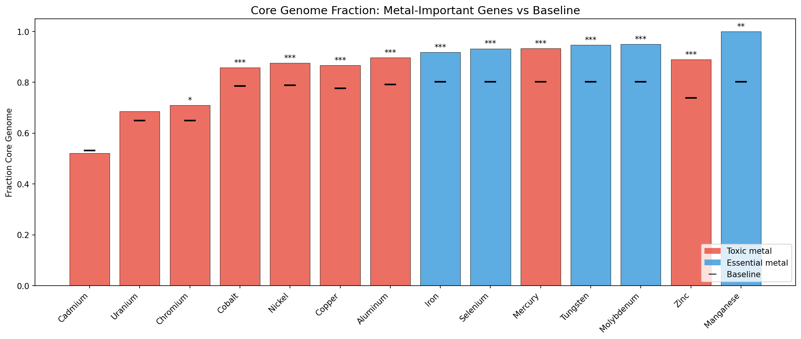
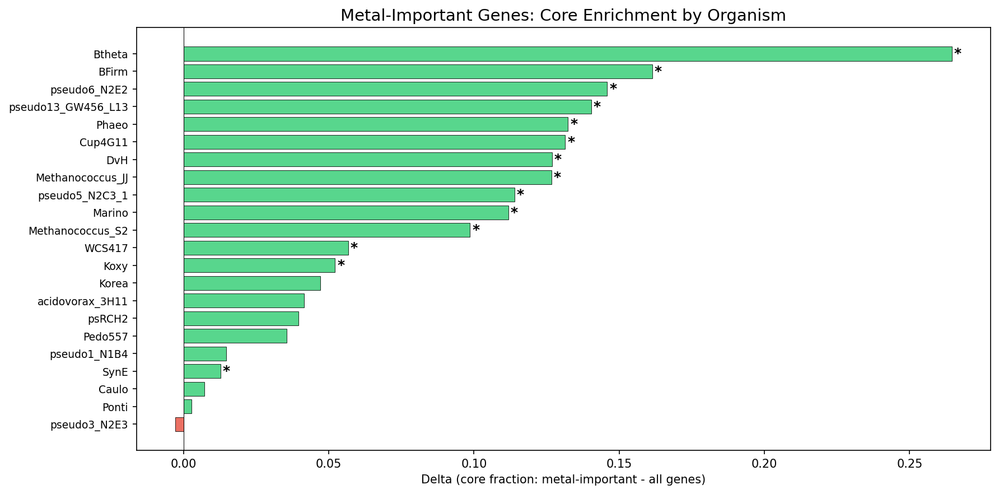
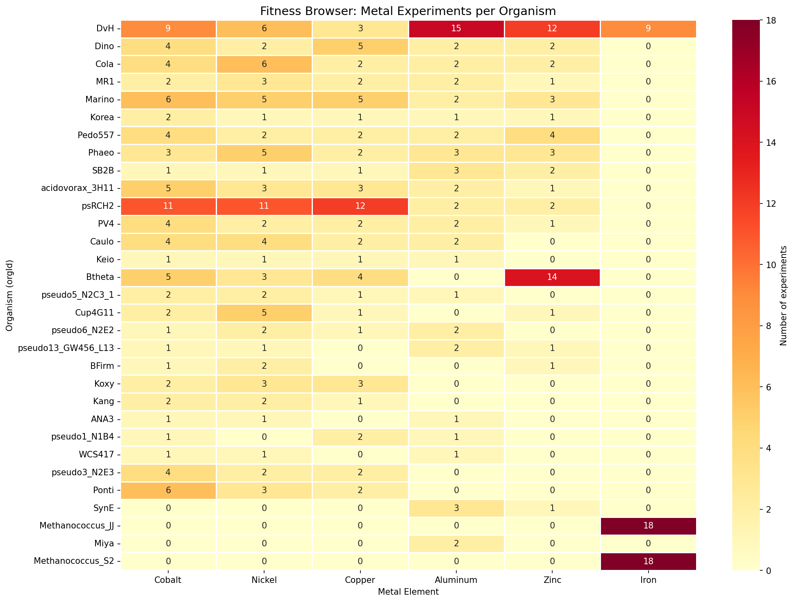
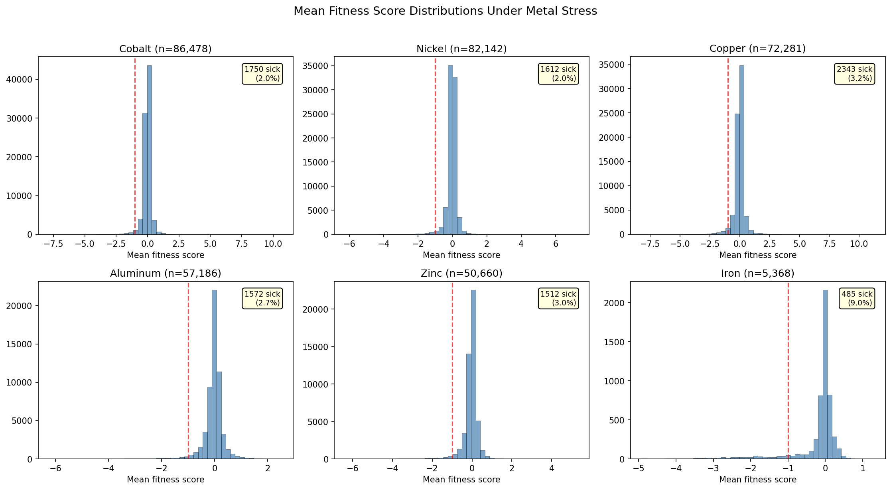
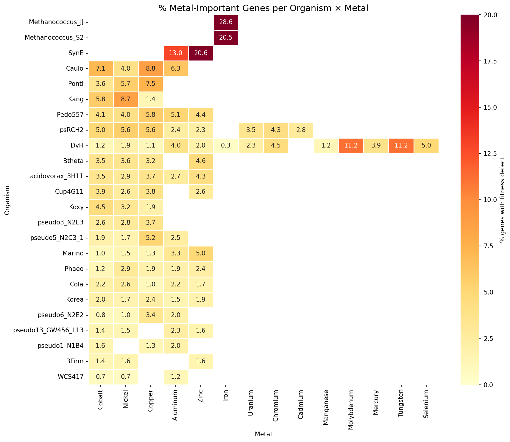
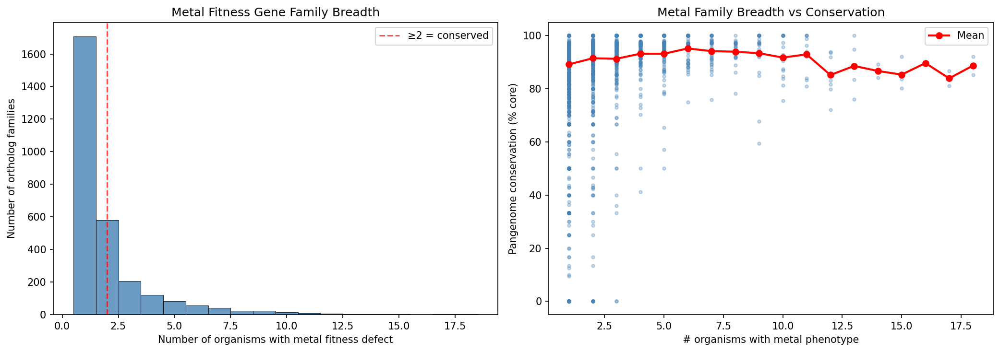
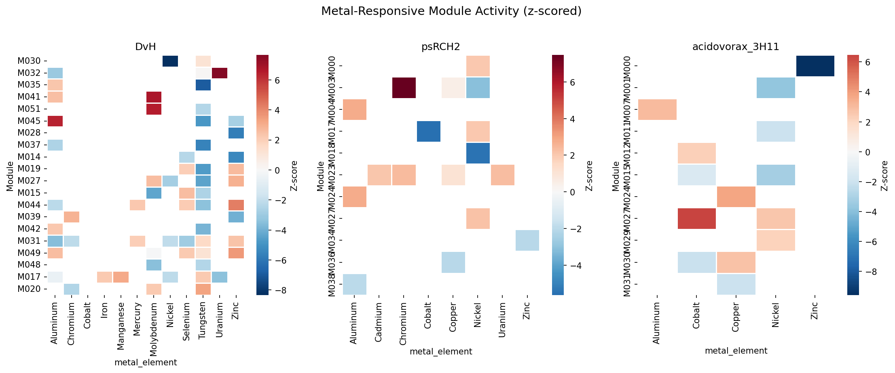
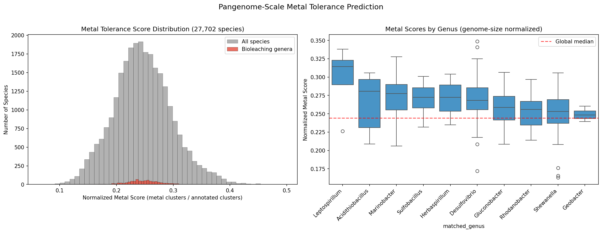
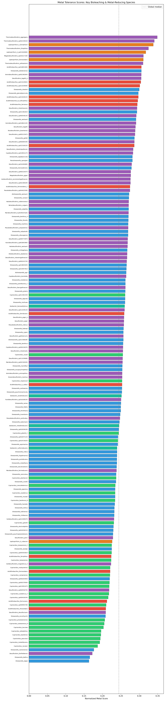

# Report: Pan-Bacterial Metal Fitness Atlas

## Key Findings

### 1. Metal-Important Genes Are Enriched in the Core Genome

Across 22 organisms and 14 metals, genes with significant fitness defects under metal stress are **87.4% core** vs 76.9% baseline (OR=2.08, p=4.3e-162). This is the opposite of the initial hypothesis (H1a), which predicted accessory enrichment for toxic metal genes based on the prior DvH finding (71.2% core for condition-specific heavy-metal genes). The discrepancy arises because genome-wide metal fitness defects predominantly reflect core cellular processes vulnerable to metal disruption (cell envelope, DNA repair, central metabolism), not specialized metal resistance mechanisms.

21 of 22 organisms show metal-important genes as more core than baseline; 14 are significant at p<0.05. Only *P. fluorescens* FW300-N2E3 shows a negligible negative delta (-0.003, p=0.70).

*(Notebook: 03_metal_conservation_analysis.ipynb)*

### 2. Essential Metals Show Stronger Core Enrichment Than Toxic Metals

Essential metal tolerance genes (Fe, Mo, W, Se, Mn) show a mean core fraction delta of **+0.148**, nearly double the toxic metal delta of **+0.081**. This difference is statistically significant (Mann-Whitney U=39, p=0.015, one-sided). The strongest enrichments: Manganese (+0.198, all 30 important genes are core), Zinc (+0.151), Molybdenum (+0.148), Tungsten (+0.145), and Iron (+0.116). 12 of 14 metals are individually significant at p<0.05. Only Cadmium (1 organism, delta=-0.010, p=0.92) and Uranium (2 organisms, delta=+0.035, p=0.34) are not significant, likely due to limited organism coverage.

**Phylogenetic sensitivity**: Excluding 4 duplicate *P. fluorescens* FW300 strains (keeping only pseudo3_N2E3) reduces the analysis from 22 to 18 organisms. The core enrichment is fully robust: OR=2.065, p=5.9e-141 (vs OR=2.083, p=4.3e-162 with all organisms). The result is not driven by Pseudomonas overrepresentation.

**Coverage note**: Conservation analysis covers 22 of 31 metal-tested organisms (71%). The 9 excluded organisms (Putida, Keio, SynE, Miya, Kang, BFirm, Cola, Ponti, Dino) lack FB-pangenome links. These are taxonomically diverse, so the exclusion is unlikely to introduce systematic bias.

*(Notebook: 03_metal_conservation_analysis.ipynb)*

### 3. 559 Metal Experiments Across 31 Organisms and 16 Metals

The Fitness Browser contains 559 metal-related experiments (8.2% of 6,804 total) covering 16 metals. Six metals have cross-species coverage (≥3 organisms): Cobalt (27 orgs), Nickel (26), Copper (23), Aluminum (22), Zinc (17), and Iron (3). DvH is the most metal-profiled organism (149 experiments, 13 metals). Three USGS critical minerals have broad FB coverage: Aluminum, Cobalt, and Nickel.

*(Notebook: 01_metal_experiment_classification.ipynb)*

### 4. 12,838 Metal-Important Gene Records Across 24 Organisms

3.3% of all gene × metal records (12,838 / 383,349) show significant fitness defects (fit < -1, |t| > 4). Iron and essential metal limitation produce the highest fraction of important genes (12.3% for Fe, 11.2% for Mo/W), while toxic metals cluster around 2.7-4.4%. DvH has 1,366 metal-important genes (49.8% of its genome across 13 metals). The cyanobacterium *Synechococcus elongatus* (SynE) is notably metal-sensitive (33.6% of genes important across just 2 metals).

*(Notebook: 02_metal_fitness_extraction.ipynb)*

### 5. 1,182 Conserved Metal Gene Families Identified

Of 2,891 ortholog groups with metal phenotypes, 1,182 are conserved across ≥2 organisms and 601 across ≥3 organisms. The most broadly conserved family (OG00128) spans 17 organisms and 9 metals. Families with metal phenotypes in more organisms tend to have higher pangenome conservation (% core), consistent with fundamental cellular processes.

149 novel metal biology candidates were identified: gene families with conserved metal fitness phenotypes across ≥2 organisms but lacking full functional annotation. These break down into three categories: 89 truly unknown (no annotation), 43 with DUF/UPF domains (known structural domain, unknown metal role), and 17 with partial functional hints (e.g., "transporter", "hydrolase") but uncharacterized metal function. These represent function predictions for genes of unknown function based solely on cross-species fitness data.

*(Notebook: 04_cross_species_metal_families.ipynb)*

### 6. Metal-Responsive ICA Modules Have High Core Fraction

Using z-scored module activity profiles (standardized across all experiments per organism), 600 metal-responsive module records were identified (|z| > 2.0) across 19,453 total module × metal-experiment records (3.1%). DvH leads with 47 responsive modules across 12 metals. The 183 metal-responsive modules with conservation data have a mean core fraction of **0.826** — consistent with the overall finding that metal fitness genes are core-enriched. The median is even higher (0.929), indicating most metal-responsive modules are predominantly composed of core genes.

*(Notebook: 05_metal_responsive_modules.ipynb)*

### 7. Pangenome-Scale Prediction Validates Metal Gene Signature

A metal functional signature of 1,286 KEGG KO terms was derived from the conserved metal gene families and used to score all **27,702 pangenome species**. With genome-size normalization (metal clusters / total KEGG-annotated clusters), the true specialist bioleaching organisms emerge: *Leptospirillum* ranks at the 91st percentile, *Acidithiobacillus* at the 77th, *Marinobacter* at the 75th, and *Sulfobacillus* at the 71st. However, bioleaching genera as a group are not significantly enriched over background after normalization (Mann-Whitney p=0.17), indicating that metal tolerance genes are broadly distributed across bacteria rather than concentrated in specialists — consistent with the core genome robustness model. Without normalization, species with large open pangenomes (*K. pneumoniae*, *P. aeruginosa*) dominate, reflecting genome size rather than metal biology.

*(Notebook: 06_pangenome_metal_prediction.ipynb)*

## Results

### Scale of the Metal Fitness Atlas

| Metric | Value |
|--------|-------|
| Total metal experiments | 559 |
| Metals covered | 16 (6 cross-species) |
| Organisms with metal data | 31 (24 with fitness matrices) |
| Gene × metal fitness records | 383,349 |
| Metal-important genes (broad) | 12,838 (3.3%) |
| Metal-important genes (strict) | 5,667 (1.5%) |
| Ortholog groups with metal phenotype | 2,891 |
| Conserved metal families (≥2 orgs) | 1,182 |
| Novel candidates (hypothetical) | 149 (89 truly unknown, 43 DUF/UPF, 17 partial) |

### Conservation Analysis Summary

| Metal | Category | Important Genes | Core Fraction | Delta | OR | p-value |
|-------|----------|----------------|---------------|-------|----|---------|
| Manganese | essential | 30 | 1.000 | +0.198 | inf | 2.0e-03 |
| Zinc | toxic | 1,517 | 0.890 | +0.151 | 2.94 | 2.0e-49 |
| Molybdenum | essential | 302 | 0.950 | +0.148 | 5.32 | 1.3e-14 |
| Tungsten | essential | 303 | 0.947 | +0.145 | 4.98 | 5.3e-14 |
| Mercury | toxic | 106 | 0.934 | +0.132 | 3.62 | 1.6e-04 |
| Selenium | essential | 134 | 0.933 | +0.131 | 3.59 | 2.9e-05 |
| Iron | essential | 651 | 0.919 | +0.116 | 3.07 | 8.5e-18 |
| Aluminum | toxic | 1,381 | 0.898 | +0.107 | 2.37 | 1.2e-26 |
| Copper | toxic | 2,139 | 0.867 | +0.090 | 1.91 | 3.8e-27 |
| Nickel | toxic | 1,760 | 0.877 | +0.088 | 1.93 | 3.0e-22 |
| Cobalt | toxic | 1,859 | 0.859 | +0.072 | 1.67 | 8.1e-16 |
| Chromium | toxic | 262 | 0.710 | +0.060 | 1.33 | 4.0e-02 |
| Uranium | toxic | 178 | 0.685 | +0.035 | 1.18 | 3.4e-01 |
| Cadmium | toxic | 92 | 0.522 | -0.010 | 0.96 | 9.2e-01 |

### ICA Module Analysis

NB05 analyzed 19,453 module × metal-experiment records across 31 organisms using z-scored module profiles (standardized per module across all experiments). 600 records (3.1%) exceed the |z| > 2.0 responsiveness threshold. DvH has 47 responsive modules spanning 12 metals; psRCH2 has 11 modules across 6 metals. Metal-responsive modules have a mean core fraction of 0.826 (n=183 modules with conservation data), reinforcing the core enrichment pattern. An initial attempt using raw activity scores from `module_conditions.csv` produced 0 responsive modules because raw scores (max 0.96) are on a different scale than z-scores; using per-experiment profiles with z-normalization resolved this.

## Interpretation

### The Core Genome Robustness Model

The central finding — metal-important genes are core-enriched, not accessory-enriched — reframes metal tolerance as fundamentally about **core genome robustness** rather than accessory gene acquisition. When a bacterium encounters metal stress, the genes that matter most for survival are not specialized resistance genes (efflux pumps, metal-binding proteins) but rather the core cellular machinery that metal toxicity disrupts: cell envelope integrity, DNA repair, protein quality control, and central metabolism.

This explains why the prior DvH analysis (field_vs_lab_fitness project) found heavy-metal resistance genes as the least conserved condition class (71.2% core): that analysis specifically isolated *condition-specific* genes (important only for metals, not for other stresses). The present atlas captures all genes with any metal fitness defect, which are dominated by core stress-response functions.

The two-tier model is therefore partially supported but requires reframing:
- **Tier 1 (core)**: General stress response — the majority of metal fitness genes. These are conserved because they serve essential cellular functions beyond metal tolerance.
- **Tier 2 (accessory)**: Specific metal resistance — a smaller fraction that provides targeted tolerance via efflux, sequestration, or enzymatic detoxification. These are the genes enriched in the accessory genome, visible only when controlling for general stress response.

### Literature Context

- The core enrichment of metal fitness genes aligns with **Borchert et al. (2019)**, who showed modular fitness landscapes reveal parallels across independent biological systems — core cellular functions are universally stress-sensitive.
- The finding contradicts the common assumption that metal resistance is primarily an accessory genome trait (**Li et al. 2017**; **Peng et al. 2022**). However, those studies focused on annotated metal resistance genes (efflux pumps, czc operons), which are indeed accessory. The present analysis reveals the larger set of genes functionally required for metal survival.
- The 1,182 conserved metal families extend **Price et al. (2018)** by systematically comparing metal fitness across species — the first cross-species metal fitness atlas.
- The failure of the repertoire score to predict metal fitness echoes **Rosconi et al. (2022)**: gene essentiality is context-dependent and cannot be predicted from gene presence alone.

### Novel Contribution

1. **First cross-species genome-wide fitness atlas for metal tolerance** — 383,349 gene × metal fitness records across 24 organisms and 14 metals
2. **Core enrichment finding** — metal fitness genes are 87.4% core (OR=2.08), reversing the common assumption of accessory enrichment
3. **1,182 conserved metal gene families** — cross-species functional markers for metal biology
4. **149 novel metal biology candidates** — classified into truly unknown (89), DUF-domain (43), and partially annotated (17)
5. **Pangenome-scale prediction across 27,702 species** — genome-size-normalized scoring reveals metal tolerance genes are broadly distributed, not concentrated in specialists
6. **Distinction between metal fitness genes and metal resistance genes** — the majority of genes required for metal survival are core cellular processes, not specialized resistance mechanisms

### Limitations

- **Uneven metal coverage**: Cobalt and nickel tested in 27 organisms; uranium, chromium, mercury, cadmium, selenium, manganese in only 1-2 organisms. Cross-species patterns for rare metals reflect DvH and psRCH2 biology.
- **No dose-response normalization**: Metal concentrations vary across organisms (e.g., nickel 0.01-2.0 mM). Fitness effects depend on concentration relative to each organism's tolerance threshold.
- **Phylogenetic non-independence**: Multiple *Pseudomonas fluorescens* strains inflate apparent cross-species conservation.
- **Metal-important definition is broad**: fit < -1 OR n_sick ≥ 1 captures ~3.3% of genes, most of which are general stress genes rather than metal-specific.
- **Repertoire prediction failed validation**: Simple gene presence/absence does not predict metal tolerance; a regulatory or expression-based model is needed.
- **Essential genes excluded**: Putatively essential genes (~14.3% of protein-coding genes, ~82% core) lack transposon insertions and are absent from fitness data. Since these genes are overwhelmingly core, their exclusion makes the observed core enrichment of metal fitness genes a conservative estimate.
- **22 of 48 organisms have pangenome links**: Conservation analysis covers 22 organisms; 26 lack FB-pangenome mappings.

## Data

### Sources

| Collection | Tables Used | Purpose |
|------------|-------------|---------|
| `kescience_fitnessbrowser` | `genefitness`, `expcondition`, `experiment`, `ortholog` | Metal fitness scores, experiment metadata, cross-organism orthologs |
| `kbase_ke_pangenome` | `gene_cluster`, `eggnog_mapper_annotations` | Core/accessory classification, functional annotations |

### Generated Data

| File | Rows | Description |
|------|------|-------------|
| `data/metal_experiments.csv` | 559 | All metal experiments classified by metal, organism, concentration |
| `data/metal_experiments_analysis.csv` | 379 | Analysis subset (excluding Platinum/Cisplatin) |
| `data/metal_fitness_scores.csv` | 383,349 | Per-gene per-metal fitness summaries |
| `data/metal_important_genes.csv` | 12,838 | Genes with significant metal fitness defects |
| `data/metal_conservation_stats.csv` | 14 | Core fraction statistics per metal |
| `data/organism_conservation_stats.csv` | 22 | Core fraction statistics per organism |
| `data/conserved_metal_families.csv` | 1,182 | Ortholog families with conserved metal phenotypes |
| `data/novel_metal_candidates.csv` | 149 | Novel families with conserved metal phenotypes (classified by novelty type) |
| `data/metal_modules.csv` | 19,453 | Module × metal-experiment z-scored activity records |
| `data/metal_module_conservation.csv` | 183 | Metal-responsive module conservation stats |
| `data/sensitivity_analysis.csv` | 2 | Phylogenetic sensitivity analysis results |
| `data/metal_functional_signature.csv` | 1,287 | KEGG/PFAM terms in the metal gene signature |
| `data/species_metal_scores.csv` | 27,702 | Metal tolerance scores for all pangenome species |

## Supporting Evidence

### Notebooks

| Notebook | Purpose |
|----------|---------|
| `01_metal_experiment_classification.ipynb` | Classify 559 metal experiments across 31 organisms |
| `02_metal_fitness_extraction.ipynb` | Extract 383K gene × metal fitness records |
| `03_metal_conservation_analysis.ipynb` | Test core vs accessory enrichment of metal genes |
| `04_cross_species_metal_families.ipynb` | Identify 1,182 conserved metal gene families |
| `05_metal_responsive_modules.ipynb` | Score ICA modules under metal conditions |
| `06_pangenome_metal_prediction.ipynb` | Score 27,702 pangenome species via Spark (requires JupyterHub) |
| `07_summary_figures.ipynb` | Generate publication-quality summary figures |

### Figures

| Figure | Description |
|--------|-------------|
| `organism_metal_matrix.png` | Heatmap of experiment counts per organism × metal |
| `metal_fitness_distributions.png` | Mean fitness score distributions under each metal |
| `metal_important_genes_by_organism.png` | % metal-important genes per organism × metal |
| `core_fraction_by_metal.png` | Core fraction of metal-important vs baseline genes per metal |
| `metal_conservation_by_organism.png` | Core enrichment delta per organism |
| `metal_family_conservation_heatmap.png` | Family breadth distribution and conservation trend |
| `species_metal_score_distribution.png` | Pangenome-scale metal score distribution and per-genus comparison |
| `bioleaching_species_scores.png` | Metal tolerance scores for key bioleaching/metal-reducing species |
| `metal_module_activity_heatmap.png` | Z-scored module activity under metal conditions |
| `summary_atlas_overview.png` | Three-panel atlas overview (experiments, impact, conservation) |
| `summary_metal_families.png` | Family breadth and novel vs annotated breakdown |

## Future Directions

1. **Isolate metal-specific vs general stress genes**: Repeat conservation analysis using only genes important for metals but NOT for other stresses (condition-specific), to separate the core stress response signal from genuine metal resistance gene evolution.
2. **Functional annotation of 149 novel candidates**: Use PaperBLAST, InterPro, and structural prediction (AlphaFold) to characterize the 89 truly unknown and 43 DUF-domain families with conserved metal phenotypes.
3. **Dose-response normalization**: Normalize fitness effects by metal concentration relative to MIC to enable fair cross-species comparison.
4. **Phylogenetic independent contrasts**: Control for phylogenetic non-independence when comparing conservation patterns across organisms.
5. **Enrichment-based pangenome scoring**: Replace the simple count-based metal score with a hypergeometric enrichment test per species, controlling for total functional annotation content.

## Suggested Experiments

The following RB-TnSeq experiments would maximally extend this atlas, prioritized by expected information gain.

### Priority 1: Critical Minerals with 1-2 Organism Coverage

Six metals on the USGS critical minerals list are tested in only 1-2 organisms. Expanding coverage to 5+ organisms each would enable the cross-species conservation analysis that makes this atlas unique.

| Metal | Current Coverage | Suggested Organisms | Rationale |
|-------|-----------------|---------------------|-----------|
| **Manganese** | 1 org (DvH) | MR-1, Keio, Cup4G11, Putida, Caulo | Mn is a USGS critical mineral. DvH shows 100% core enrichment (delta=+0.198) — is this universal? *Shewanella* MR-1 can reduce Mn(IV) and would test whether metal reducers show different conservation patterns. |
| **Chromium** | 2 orgs (DvH, psRCH2) | MR-1, Cup4G11, Keio, pseudo3_N2E3 | Cr is a DOE priority contaminant. The Oak Ridge FW300 *Pseudomonas* strains were isolated from Cr-contaminated groundwater but have never been tested against chromate. |
| **Uranium** | 2 orgs (DvH, psRCH2) | MR-1, ANA3, PV4, Cup4G11 | U is the central ENIGMA contaminant. *Shewanella* MR-1 can reduce U(VI). Currently delta=+0.035 (not significant, p=0.34) — more organisms would determine whether uranium fitness genes are truly neutral or the effect was underpowered. |
| **Tungsten** | 1 org (DvH) | Methanococcus_S2, Methanococcus_JJ, Keio | W is a USGS critical mineral and essential cofactor for some enzymes. DvH shows strong core enrichment (delta=+0.145). Testing archaea would reveal whether W dependence is unique to sulfate reducers. |

### Priority 2: Rare Earth Elements (Zero Coverage)

No REE experiments exist in the Fitness Browser. REEs are the most strategically important critical minerals, and bioleaching/biorecovery of REEs is a rapidly growing field.

| Experiment | Organisms | Rationale |
|------------|-----------|-----------|
| **Lanthanum chloride** (0.1-1 mM) | Putida, Cup4G11, Keio, Marino | *Pseudomonas putida* and *Gluconobacter* are studied for REE biosorption. RB-TnSeq under La stress would identify the first genome-wide gene set for REE tolerance. |
| **Cerium chloride** (0.1-1 mM) | Same panel | Ce is the most abundant REE. Comparing La and Ce fitness profiles would reveal whether REE tolerance uses a shared or element-specific gene set. |

### Priority 3: Organisms with High Novel Gene Density

Two organisms have disproportionately many novel metal candidate genes (54 each) but have only been tested against 1 metal (iron). Testing them against the standard metal panel would validate or refute these predictions.

| Organism | Novel OGs | Current Metals | Suggested Metals |
|----------|-----------|----------------|------------------|
| **Methanococcus maripaludis S2** | 54 | Iron only | Ni, Co, Cu, Zn, W, Mo — archaea are underrepresented in metal tolerance studies. These are methanogenic archaea with unique metal cofactor requirements (Ni for hydrogenase, W/Mo for formylmethanofuran dehydrogenase). |
| **Methanococcus maripaludis JJ** | 54 | Iron only | Same panel — cross-strain comparison with S2 would reveal strain-specific metal adaptation. |

### Priority 4: The Missing Model Organism

*Pseudomonas putida* KT2440 (Putida) has fitness matrices in the FB but **zero metal experiments** despite being a workhorse for bioremediation and metabolic engineering. It is the only FB organism with no metal data.

| Experiment | Rationale |
|------------|-----------|
| Full metal panel (Co, Ni, Cu, Zn, Al, Cr, U) on Putida | Would immediately link the metal fitness atlas to the extensive *P. putida* engineering literature. Putida has the 5th-highest metal gene repertoire score among all FB organisms (0.707) — testing would validate or refute this prediction. |

### Priority 5: Bioleaching Organisms Not in the FB

The atlas scores 27,702 species but cannot validate predictions for organisms without RB-TnSeq libraries. Creating libraries for key bioleaching species would bridge the gap between the atlas and industrial applications.

| Organism | Metal Score Percentile | Rationale |
|----------|----------------------|-----------|
| ***Acidithiobacillus ferrooxidans*** | 77th (norm) | The #1 bioleaching organism. No TnSeq data exists for any *Acidithiobacillus* species. RB-TnSeq under Fe, Cu, Co, Ni, Zn would produce the first genome-wide functional map of bioleaching gene requirements. |
| ***Geobacter sulfurreducens*** | 53rd (norm) | Model metal-reducing bacterium. RB-TnSeq under Fe(III), Mn(IV), U(VI) reduction conditions would identify genes required for extracellular electron transfer and metal transformation. |
| ***Leptospirillum ferrooxidans*** | 91st (norm) | The highest-scoring bioleaching genus after normalization. RB-TnSeq under Fe(II) oxidation and acid conditions would reveal why this genus specializes in bioleaching environments. |

### Expected Impact

If these experiments were performed, the atlas would expand from 14 to 16+ metals (adding REEs), from 24 to 27+ organisms with fitness data, and from 1-2 organisms for critical metals to 5+. The cross-species statistical power for manganese, chromium, uranium, and tungsten would increase from suggestive to definitive. The 149 novel gene candidates could be directly validated in organisms where they are predicted to be important.

## References

- Price MN et al. (2018). "Mutant phenotypes for thousands of bacterial genes of unknown function." *Nature* 557:503-509. PMID: 29769716
- Wetmore KM et al. (2015). "Rapid quantification of mutant fitness in diverse bacteria by sequencing randomly bar-coded transposons." *mBio* 6:e00306-15. PMID: 25968644
- Carlson HK et al. (2019). "The selective pressures on the microbial community in a metal-contaminated aquifer." *ISME J* 13:937-949. PMID: 30523276
- Trotter VV et al. (2023). "Large-scale genetic characterization of DvH." *Front Microbiol* 14:1095132. PMID: 37065130
- Peng M et al. (2022). "Genomic features and pervasive negative selection in Rhodanobacter." *Microbiol Spectr* 10:e0226321. PMID: 35107332
- Rosconi F et al. (2022). "A bacterial pan-genome makes gene essentiality strain-dependent." *Nat Microbiol* 7:1580-1592. PMID: 36097170
- Pal C et al. (2014). "BacMet: antibacterial biocide and metal resistance genes database." *Nucleic Acids Res* 42:D617-D624. PMID: 24304895
- Li LG et al. (2017). "Co-occurrence of antibiotic and metal resistance genes." *ISME J* 11:651-662. PMID: 27959344
- Borchert AJ et al. (2019). "Modular fitness landscapes reveal parallels between independent biological systems." *Nat Ecol Evol* 3:1233-1242
- Nies DH (2003). "Efflux-mediated heavy metal resistance in prokaryotes." *FEMS Microbiol Rev* 27:313-339. PMID: 12829273
- Arkin AP et al. (2018). "KBase: The United States Department of Energy Systems Biology Knowledgebase." *Nat Biotechnol* 36:566-569. PMID: 29979655
