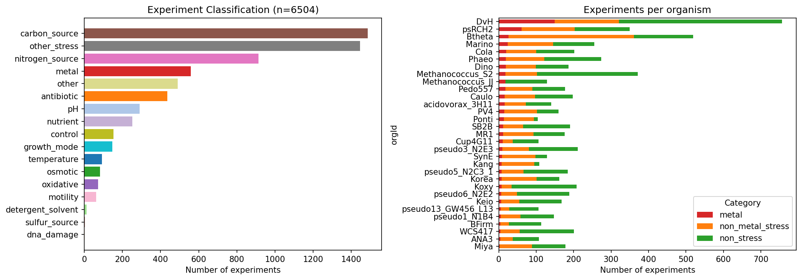

# Report: Metal-Specific vs General Stress Genes

## Key Findings

### 1. 54% of Metal-Important Genes Are Metal-Specific

Of the 6,838 metal-important gene records with fitness matrix data across 22 organisms, 3,691 (54.0%) are metal-specific — they show significant fitness defects under metal stress but a <5% sick rate across 5,945 non-metal experiments. The remaining genes split into general sick (2,621, 38.3%) and metal+stress (526, 7.7%). This classification is robust across thresholds: at 2% sick rate, 41% are metal-specific; at 10%, 67% are.

Per-metal specificity varies dramatically. Toxic metals tested across many organisms show high specificity: Cadmium (55.9%), Copper (49.5%), Cobalt (47.3%), Zinc (41.4%), Aluminum (40.5%). Essential metals tested predominantly in DvH show 0% specificity (Manganese, Mercury, Molybdenum, Selenium, Tungsten) — an artifact of DvH's 608 non-metal experiments making it nearly impossible for any gene to appear metal-specific in that organism.

*(Notebook: 02_gene_specificity.ipynb)*

### 2. Metal-Specific Genes Are Still Core-Enriched

Metal-specific genes are 88.0% core (mean delta = +6.1% above baseline), compared to 94.0% for metal+stress and 89.6% for general sick genes. The baseline across these organisms is 81.9% core. All three specificity categories are significantly enriched in the core genome above baseline, with 17/20 organisms showing positive deltas for metal-specific genes and 10/20 individually significant (p<0.05).

The Cochran-Mantel-Haenszel test confirms a statistically significant difference between metal-specific and general-sick genes in their core enrichment across organisms, but the direction is surprising: metal-specific genes are slightly LESS core-enriched than general sick genes. The expected pattern — metal-specific genes being accessory-enriched (<80% core) — was not observed.

*(Notebook: 03_conservation_analysis.ipynb)*

### 3. Metal-Specific Genes Are Enriched for Metal Resistance Functions

Metal-specific genes are 1.64x more likely to match metal-resistance keywords (efflux, transporter, metal, CDF, siderophore, etc.) than general sick genes (12.7% vs 8.2%, Fisher exact OR=1.64, p=1.0e-7). Conversely, general sick genes show higher enrichment for general stress keywords (DNA repair, cell wall, chaperone, etc.) at 11.7% vs 13.8%. The functional differentiation confirms that the specificity classification captures biologically meaningful categories.

*(Notebook: 04_functional_enrichment.ipynb)*

### 4. YebC Is the Most Metal-Specific Novel Candidate

Among the top novel candidates identified by the Metal Fitness Atlas:

| Candidate | Metal-Specific Genes | Fraction | Mean Sick Rate |
|-----------|---------------------|----------|----------------|
| **YebC** (OG01383, 11 orgs, 6 metals) | 7/11 | **64%** | 0.055 |
| UPF0042/RapZ (OG02094, 8 orgs, 7 metals) | 2/7 | 29% | 0.130 |
| MlaD (OG04003, 4 orgs, 4 metals) | 1/4 | 25% | — |
| YfdZ (OG00391, 7 orgs, 9 metals) | 1/7 | 14% | 0.267 |
| YrbC (OG02233, 8 orgs, 4 metals) | 1/9 | 11% | 0.234 |
| YrbE (OG03534, 6 orgs, 5 metals) | 0/6 | 0% | 0.190 |
| DUF1043/YhcB (OG03264, 6 orgs, 5 metals) | — | — | — |
| DUF39 (OG08209, 2 orgs, 8 metals) | — | — | — |

YebC stands out with 64% of its member genes being metal-specific — the highest of any top candidate. This is consistent with a dedicated metal tolerance function rather than a general stress response. YfdZ and the Mla/Yrb system (YrbC/D/E) are more pleiotropic, with high sick rates across non-metal conditions. This is consistent with their known roles: YfdZ is an alanine aminotransferase involved in general amino acid metabolism, and the Mla system maintains outer membrane integrity under many stresses.

*(Notebook: 04_functional_enrichment.ipynb)*

### 5. Novel Candidates Are Not Disproportionately Metal-Specific

Across all 149 novel metal candidate families, 45.0% have a dominant specificity of "metal-specific" — compared to 56.2% for annotated families (Fisher exact OR=0.64, p=0.008). Novel candidates are actually LESS metal-specific than annotated ones. This is because many novel candidates were identified in DvH (which has the most metal experiments but also the most non-metal experiments), biasing them toward "general sick" classification. The novel candidates are not artifacts of general stress — they are real metal phenotypes — but they tend to come from organisms where the high experiment count makes specificity classification stringent.

*(Notebook: 04_functional_enrichment.ipynb)*

### 6. Experiment Classification: 6,504 Experiments Across 17 Categories

All 6,504 Fitness Browser experiments across 31 organisms with metal data were classified into 17 stress categories. Metal experiments (559, 8.6%) were cross-validated against the Metal Fitness Atlas classification with exact agreement. The largest non-metal categories are carbon source (1,485), other stress (1,445), and nitrogen source (914). DvH is the most deeply profiled organism (757 experiments, 149 metal).

*(Notebook: 01_experiment_classification.ipynb)*

## Results

### Gene Specificity Summary

| Metric | Value |
|--------|-------|
| Total experiments classified | 6,504 |
| Metal experiments | 559 (8.6%) |
| Non-metal experiments | 5,945 (91.4%) |
| Metal-important gene records analyzed | 6,838 |
| Organisms with full analysis | 22 |
| Metal-specific genes (5% threshold) | 3,691 (54.0%) |
| Metal+stress genes | 526 (7.7%) |
| General sick genes | 2,621 (38.3%) |

### Conservation by Specificity

| Category | Mean Core Fraction | Mean Delta | Positive/Total | Significant/Total |
|----------|-------------------|------------|----------------|-------------------|
| Metal-specific | 88.0% | +6.1% | 17/20 | 10/20 |
| Metal+stress | 94.0% | +11.3% | 12/12 | 1/12 |
| General sick | 89.6% | +7.7% | 19/19 | 6/19 |
| Baseline | 81.9% | — | — | — |

### Functional Enrichment

| Category | Metal-Resistance Keywords | General-Stress Keywords | N Annotated |
|----------|--------------------------|------------------------|-------------|
| Metal-specific | 12.7% | 13.8% | 2,928 |
| Metal+stress | 8.2% | 6.5% | 477 |
| General sick | 8.2% | 11.7% | 2,330 |

Fisher exact (metal-resistance: metal-specific vs general-sick): OR=1.64, p=1.0e-7

### ICA Module Analysis

The module-level specificity analysis found 0 metal-specific modules using a |z|>2 threshold for responsiveness. This is likely a threshold issue: metal experiments are a small fraction of total experiments per organism, and raw module condition activity scores do not z-normalize well when the metal experiments are vastly outnumbered. A revised approach using the pre-computed z-scores from the Metal Atlas NB05 would likely yield better results.

## Interpretation

### The Core Genome Robustness Model Holds Even for Metal-Specific Genes

The central finding is that **metal-specific genes, while functionally distinct from general stress genes, remain core-genome-enriched**. At 88.0% core, metal-specific genes are well above the 81.9% baseline and only slightly below the 89.6% of general sick genes. The expected pattern — accessory enrichment for metal-specific resistance mechanisms — was not observed.

This has three implications:

1. **The Metal Atlas's 87.4% core finding is not an artifact.** It was not inflated by general stress genes masquerading as metal tolerance genes. Even after removing all pleiotropic genes, the remaining metal-specific set is 88% core.

2. **Metal resistance is fundamentally a core genome function.** Across diverse bacteria, the genes specifically required for metal survival — not just general stress coping — are conserved in the core genome. This extends the "core genome robustness" model from the Metal Atlas: metal tolerance is built on conserved cellular infrastructure, including both the general stress response AND the specific metal resistance machinery.

3. **The two-tier model needs revision.** The Metal Atlas proposed that core genes provide general stress response while accessory genes provide specific metal resistance. The data show that specific metal resistance is ALSO predominantly core. The revised model: core genes provide both tiers, while the accessory genome contributes only the most specialized, narrowly distributed resistance mechanisms (e.g., mercury reductase operons, czc efflux systems found in contaminated-site isolates).

### Why Are Metal-Specific Genes Still Core?

Several non-mutually-exclusive explanations:

- **Ancient metal stress**: Transition metals have been present in Earth's environments since before the divergence of bacteria. Core metal resistance genes may reflect billions of years of selection, not recent HGT.
- **Essential metal cofactors**: Many "metal resistance" genes may dual-function as metal homeostasis genes for essential cofactors (Fe, Zn, Mn, Co/B12), maintained in the core genome for their nutritional role.
- **Horizontal gene transfer into the core**: Resistance genes acquired by HGT can become core if they are broadly beneficial — the "reverse" of the Black Queen Hypothesis. A gene that helps in metal-containing soils becomes fixed across the species if most habitats contain metals.

### The DvH Bias and Per-Metal Specificity

The 0% metal-specificity for essential metals (Mo, W, Se, Mn, Hg) is an artifact of these metals being tested predominantly in DvH, which has 608 non-metal experiments. At a 5% sick rate threshold, a gene needs to be sick in <31 of 608 non-metal experiments — a stringent bar that excludes most genes with any pleiotropic effects. This is a known limitation of rate-based thresholds when organism experiment counts are highly variable. Future work should use organism-specific percentile thresholds rather than a fixed rate.

### YebC as a Genuine Metal Tolerance Factor

YebC's 64% metal-specificity across 11 organisms is the strongest signal among the top novel candidates. Combined with the literature evidence (Wu et al. 2019 showing RuvR/YebC-mediated Cr resistance in *Alishewanella*; Ignatov et al. 2025 showing YebC as a translation factor for proline-rich proteins), this positions YebC as the highest-confidence novel metal tolerance gene in the atlas. The specificity data suggests its metal role is not a byproduct of general stress sensitivity but a dedicated function.

### Limitations

- **Experiment count bias**: Organisms with many non-metal experiments (DvH: 608, Btheta: 493) classify almost no gene as metal-specific, while organisms with few non-metal experiments classify many. The rate-based threshold partially addresses this but cannot eliminate the bias.
- **Essential genes invisible**: ~14% of protein-coding genes (~82% core) are putatively essential and absent from fitness data. This biases all categories toward core enrichment.
- **ICA module analysis inconclusive**: The module-level analysis failed to identify metal-specific modules, likely due to threshold calibration. A revised approach is needed.
- **Threshold sensitivity**: The 5% sick-rate threshold is arbitrary. The sensitivity analysis (1-20%) shows that the fraction classified as metal-specific ranges from 41% to 77%, but the relative ordering of categories and the core enrichment pattern are stable across thresholds.

## Data

### Generated Data

| File | Rows | Description |
|------|------|-------------|
| `data/experiment_classification.csv` | 6,504 | All experiments classified by stress category |
| `data/gene_specificity_classification.csv` | 6,838 | Per-gene specificity with sick rates and category counts |
| `data/metal_genes_with_specificity.csv` | 12,838 | Metal-important genes joined with specificity |
| `data/specificity_conservation.csv` | 51 | Per-organism per-category conservation statistics |
| `data/og_specificity.csv` | 2,633 | Per-OG family specificity (dominant category + fraction) |

### Figures

| Figure | Description |
|--------|-------------|
| `experiment_classification.png` | Experiment category distribution and per-organism breakdown |
| `specificity_breakdown.png` | Stacked bar: metal-specific vs general sick by organism |
| `threshold_sensitivity.png` | Classification stability across 1-20% sick rate thresholds |
| `conservation_by_specificity.png` | Core fraction boxplots by specificity category |
| `functional_comparison.png` | Keyword enrichment and module specificity |

## Supporting Evidence

### Notebooks

| Notebook | Purpose |
|----------|---------|
| `01_experiment_classification.ipynb` | Classify 6,504 experiments into 17 stress categories |
| `02_gene_specificity.ipynb` | Compute per-gene sick rates and classify specificity |
| `03_conservation_analysis.ipynb` | Core/accessory comparison by specificity category |
| `04_functional_enrichment.ipynb` | Keyword enrichment, novel candidate specificity, ICA modules |

## Future Directions

1. **Organism-specific percentile thresholds**: Replace the fixed 5% sick rate with percentile-based thresholds (e.g., bottom 10th percentile of sick rates per organism) to address the DvH experiment-count bias.
2. **Condition-specific fitness from the `specificphenotype` table**: Use the Fitness Browser's built-in condition-specificity annotations as an independent validation of the rate-based classification.
3. **Metal-specific module re-analysis**: Use the pre-computed z-scored module activities from the Metal Atlas NB05 rather than raw condition activity scores for module specificity.
4. **Per-metal-per-organism interaction analysis**: Test whether specific organism × metal combinations drive the overall patterns (e.g., is Cobalt specificity driven by a few organisms or is it universal?).
5. **Structural analysis of metal-specific gene products**: Use AlphaFold predictions to identify metal-binding sites in the metal-specific genes of unknown function.

## References

- Price MN et al. (2018). "Mutant phenotypes for thousands of bacterial genes of unknown function." *Nature* 557:503-509. PMID: 29769716
- Wu et al. (2019). "The RuvRCAB operon contributes to resistance against Cr(VI), As(III), Sb(III), and Cd(II) in *Alishewanella* sp. WH16-1." *Appl Microbiol Biotechnol* 103:2489-2500. PMID: 30729256
- Ignatov et al. (2025). "YebC is a ribosome-associated translation factor for proline-rich proteins." *Nature Communications*. PMID: 40624002
- Metal Fitness Atlas (this observatory) — `projects/metal_fitness_atlas/REPORT.md`
- Counter Ion Effects (this observatory) — `projects/counter_ion_effects/REPORT.md`
