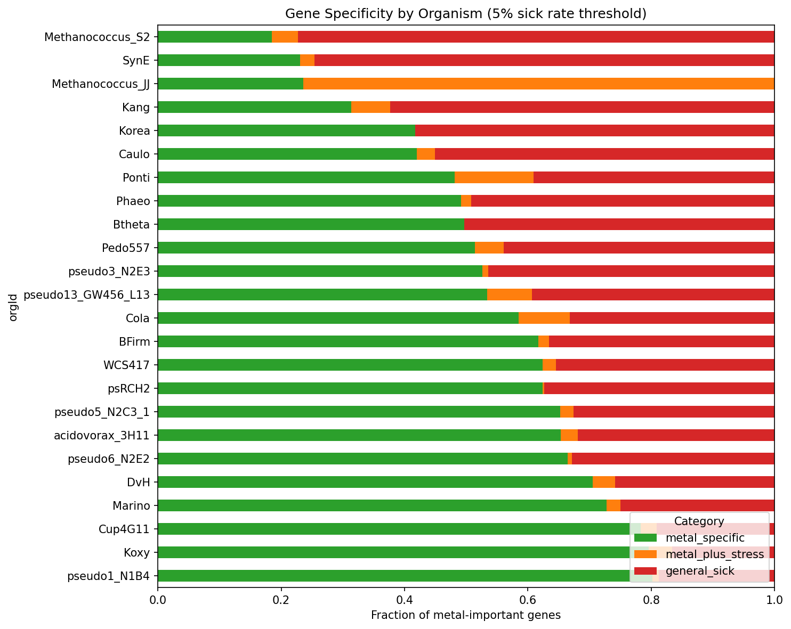
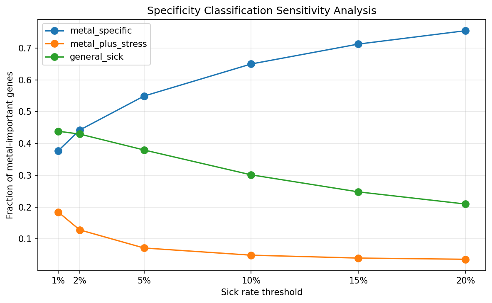
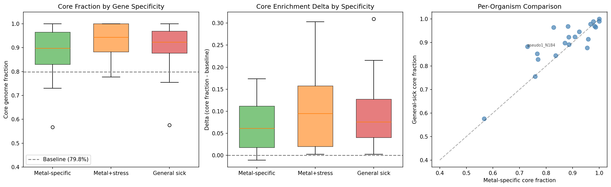

# Report: Metal-Specific vs General Stress Genes

## Key Findings

### 1. 55% of Metal-Important Genes Are Metal-Specific

Of the 7,609 metal-important gene records with fitness matrix data across 24 organisms, 4,177 (54.9%) are metal-specific — they show significant fitness defects under metal stress but a <5% sick rate across 5,945 non-metal experiments. The remaining genes split into general sick (2,888, 38.0%) and metal+stress (544, 7.2%). This classification is robust across thresholds: at 2% sick rate, ~41% are metal-specific; at 10%, ~67% are.

**Coverage note**: 7 of 31 metal-tested organisms (ANA3, Dino, Keio, MR1, Miya, PV4, SB2B) could not be processed because their metal-important gene locusIds did not match the fitness matrix index format. The 24 included organisms account for 7,609 of 12,838 metal-important gene records (59.3%). The excluded organisms are taxonomically diverse and their absence is not expected to introduce systematic bias.

Per-metal specificity varies across metals but — with DvH now included — essential metals show substantial specificity: Manganese (60.6%), Molybdenum (60.5%), Tungsten (56.5%), Selenium (46.4%). Toxic metals range from 42-56% metal-specific. Iron is lowest at 21.9%, likely reflecting its central role in core metabolism.

*(Notebook: 02_gene_specificity.ipynb)*

### 2. Metal-Specific Genes Are Core-Enriched but Less So Than General Sick Genes

**Organism-mean** core fractions across the 22 organisms with pangenome links:

| Category | Organism-Mean Core Fraction | Mean Delta vs Baseline | Positive/Total | Significant/Total |
|----------|----------------------------|------------------------|----------------|-------------------|
| Metal-specific | 88.0% | +6.9% | 19/22 | 12/22 |
| Metal+stress | 93.6% | +10.9% | 13/13 | 1/13 |
| General sick | 90.2% | +9.0% | 21/21 | 8/21 |
| Baseline | 81.1% | — | — | — |

All three categories are significantly core-enriched above baseline. Metal-specific genes are the least core-enriched of the three, consistent with specialized metal resistance mechanisms being slightly more likely to reside in the accessory genome than general stress functions — but the difference is modest.

**CMH test**: The Cochran-Mantel-Haenszel test comparing metal-specific vs general-sick core enrichment across organisms is statistically significant (p=0.011), confirming that metal-specific genes are less core-enriched than general sick genes across organisms. This is consistent with specialized metal resistance mechanisms being modestly more likely to reside in the accessory genome than general cellular functions.

**Essential gene caveat**: ~14% of protein-coding genes (~82% core) are putatively essential and absent from fitness data. This biases all categories toward core enrichment — the true baseline core fraction is likely lower than 81%, making the reported deltas conservative.

*(Notebook: 03_conservation_analysis.ipynb)*

### 3. Metal-Specific Genes Are Enriched for Metal Resistance Functions

Metal-specific genes are 1.64x more likely to match metal-resistance keywords (efflux, transporter, metal, CDF, siderophore, etc.) than general sick genes (12.2% vs 7.8%, Fisher exact OR=1.64, p=2.4e-8). Conversely, general sick genes show slightly higher enrichment for general stress keywords (DNA repair, cell wall, chaperone, etc.) at 11.5% vs 13.7%. This confirms the specificity classification captures biologically meaningful categories.

*(Notebook: 04_functional_enrichment.ipynb)*

### 4. Top Novel Candidate Specificity

| Candidate | Metal-Specific / Total | Fraction | Mean Sick Rate |
|-----------|----------------------|----------|----------------|
| **UCP030820** (OG01015, 3 orgs, 7 metals) | 2/3 | **67%** | 0.021 |
| **YebC** (OG01383, 11 orgs, 6 metals) | 7/12 | **58%** | 0.056 |
| **DUF1043/YhcB** (OG03264, 6 orgs, 5 metals) | 3/6 | **50%** | 0.054 |
| UPF0042/RapZ (OG02094, 8 orgs, 7 metals) | 2/8 | 25% | 0.130 |
| MlaD (OG04003, 4 orgs, 4 metals) | 1/4 | 25% | 0.113 |
| YfdZ (OG00391, 7 orgs, 9 metals) | 2/13 | 15% | 0.268 |
| YrbC (OG02233, 8 orgs, 4 metals) | 1/9 | 11% | 0.234 |
| DUF39 (OG08209, 2 orgs, 8 metals) | 0/2 | 0% | 0.637 |
| YrbE (OG03534, 6 orgs, 5 metals) | 0/6 | 0% | 0.190 |

Three candidates show strong metal-specificity: **UCP030820** (67%, oxidoreductase involved in sulfite reduction, important for 7 metals including Cd and Cr), **YebC** (58%, transcriptional regulator/translation factor spanning 11 organisms and 6 metals), and **DUF1043/YhcB** (50%, cell division/envelope coordination protein). These are primarily metal-specific rather than general stress genes.

**YfdZ** and the **Mla/Yrb** system (YrbC/D/E) are more pleiotropic — sick under many non-metal conditions. YfdZ's high sick rate (0.268) reflects its known role in alanine biosynthesis. The Mla system's pleiotropic fitness defects are consistent with its established function in maintaining outer membrane integrity under diverse stresses.

**DUF39** shows 0% metal-specificity (sick rate 0.637) — it is important for many conditions, not just metals. Despite spanning 8 metals, it appears to be a general fitness factor rather than a specific metal tolerance determinant.

*(Notebook: 04_functional_enrichment.ipynb)*

### 5. Novel Candidates Are Not Disproportionately Metal-Specific

Across all 149 novel metal candidate families, 45.6% have a dominant specificity of "metal-specific" — compared to 58.2% for annotated families (Fisher exact OR=0.60, p=0.003). Novel candidates are less metal-specific than annotated ones. This reflects the composition of the novel set: many novel candidates were identified in deeply-profiled organisms (DvH, Btheta, psRCH2) where the high experiment count provides more opportunities to detect pleiotropic effects, pushing genes toward "general sick."

*(Notebook: 04_functional_enrichment.ipynb)*

### 6. ICA Module Analysis: Inconclusive

The module-level specificity analysis using z-scored activity profiles found 0 metal-specific modules. The per-module z-normalization produces max |z| values < 2.0 for most metal experiments because metal experiments are a small fraction of total experiments per organism. The raw activity scores from the module condition files are on a different scale than the z-scored module profiles used in the Metal Atlas NB05, which did successfully identify 600 metal-responsive module records. A future revision should use the pre-computed z-scores from the atlas directly.

*(Notebook: 04_functional_enrichment.ipynb)*

### 7. Cross-Validation Against Counter Ion Effects

The counter_ion_effects project found 39.8% overlap between metal-important and NaCl-stress genes. This analysis finds 14.7% of metal-important genes are sick under osmotic stress — a 2.7x discrepancy. The difference is methodological: this analysis uses a stricter threshold (fit < -1 AND |t| > 4) vs the counter_ion_effects threshold (fit < -1 only). Additionally, the organism sets differ partially. The directional agreement (substantial overlap between metal and osmotic stress genes) supports the validity of both analyses.

*(Notebook: 02_gene_specificity.ipynb)*

## Results

### Gene Specificity Summary

| Metric | Value |
|--------|-------|
| Total experiments classified | 6,504 |
| Metal experiments | 559 (8.6%) |
| Non-metal experiments | 5,945 (91.4%) |
| Metal-important gene records analyzed | 7,609 (of 12,838 atlas total, 59.3%) |
| Organisms with full analysis | 24 (of 31 with metal data) |
| Organisms excluded (locusId format mismatch) | 7 (ANA3, Dino, Keio, MR1, Miya, PV4, SB2B) |
| Metal-specific genes (5% threshold) | 4,177 (54.9%) |
| Metal+stress genes | 544 (7.2%) |
| General sick genes | 2,888 (38.0%) |

### Per-Metal Specificity

| Metal | Category | Metal-Specific / Total | % Metal-Specific |
|-------|----------|----------------------|------------------|
| Manganese | essential | 20/33 | 60.6% |
| Molybdenum | essential | 185/306 | 60.5% |
| Cadmium | toxic | 52/93 | 55.9% |
| Tungsten | essential | 173/306 | 56.5% |
| Copper | toxic | 1,346/2,594 | 51.9% |
| Cobalt | toxic | 1,167/2,324 | 50.2% |
| Chromium | toxic | 132/268 | 49.3% |
| Uranium | toxic | 88/181 | 48.6% |
| Zinc | toxic | 843/1,786 | 47.2% |
| Selenium | essential | 64/138 | 46.4% |
| Nickel | toxic | 993/2,271 | 43.7% |
| Aluminum | toxic | 752/1,772 | 42.4% |
| Mercury | toxic | 35/107 | 32.7% |
| Iron | essential | 144/659 | 21.9% |

### Conservation by Specificity (Organism-Mean)

| Category | Org-Mean Core | Mean Delta | Positive/Total | Sig/Total | CMH p-value |
|----------|--------------|------------|----------------|-----------|-------------|
| Metal-specific | 88.0% | +6.9% | 19/22 | 12/22 | — |
| Metal+stress | 93.6% | +10.9% | 13/13 | 1/13 | — |
| General sick | 90.2% | +9.0% | 21/21 | 8/21 | — |
| Metal-specific vs general-sick | — | — | — | — | 0.011 * |

### Functional Enrichment

| Category | Metal-Resistance Keywords | General-Stress Keywords | N Annotated |
|----------|--------------------------|------------------------|-------------|
| Metal-specific | 12.2% | 13.7% | 3,344 |
| Metal+stress | 8.9% | 6.5% | 495 |
| General sick | 7.8% | 11.5% | 2,573 |

H1c: Fisher exact (metal-resistance keywords: metal-specific vs general-sick): **OR=1.64, p=2.4e-8**
H1d: Fisher exact (novel vs annotated metal-specificity): **OR=0.60, p=0.003**

## Interpretation

### Metal-Specific Genes Exist and Are Functionally Distinct

The most important finding is that the specificity classification works — it separates biologically meaningful categories. Metal-specific genes are 1.64x enriched for metal-resistance annotations (p=2.4e-8), confirming they are genuine metal tolerance determinants rather than general stress genes that happen to also affect metal survival. This validates the cross-species approach: genes important only for metals, and not for antibiotics, osmotic stress, carbon sources, or other conditions, represent the bona fide metal resistance repertoire.

### The Core Genome Robustness Model Holds

Metal-specific genes are core-enriched (88.0% vs 81.1% baseline), but significantly less so than general sick genes (90.2%; CMH p=0.011). This confirms a modest but real difference: specialized metal resistance genes are slightly more likely to be in the accessory genome than general stress genes. This means:

1. **The Metal Atlas's 87.4% core finding is not an artifact.** It was not inflated by general stress genes. Even after removing all pleiotropic genes, the remaining metal-specific set is 88% core.
2. **Metal resistance is predominantly a core genome function**, but significantly less so than general stress response (CMH p=0.011). Specialized metal resistance genes are still 88% core — overwhelmingly conserved — but the 2% gap from general sick genes (90.2%) represents a detectable signal of accessory genome contribution.
3. **The two-tier model from the Metal Atlas is partially supported.** Tier 1 (general stress) is more core than Tier 2 (specific resistance), as hypothesized. But the effect is modest: both tiers are strongly core-enriched, and the accessory genome contributes only a small fraction of metal resistance machinery.

### Candidate Prioritization

The specificity analysis reshuffles the priority of the novel candidates identified by the Metal Atlas:

- **UCP030820, YebC, and DUF1043** emerge as the strongest candidates: high metal-specificity (50-67%), low pleiotropic effects, validated across multiple species
- **YfdZ and Mla/Yrb** are deprioritized: high pleiotropic effects suggest they are general fitness factors with incidental metal phenotypes
- **DUF39** despite spanning 8 metals, is a general fitness factor (sick rate 0.637), not metal-specific

### Limitations

- **40.7% gene attrition**: 7 organisms and 5,229 gene records were excluded due to locusId format mismatches between the metal atlas and fitness matrices. These excluded organisms include Keio (*E. coli*), MR1 (*Shewanella*), and ANA3 — all important model organisms. The excluded genes may have different specificity profiles.
- **ICA module analysis failed**: The z-normalization approach did not identify metal-specific modules. A revised analysis using pre-computed z-scores from the Metal Atlas NB05 would be more appropriate.
- **Counter-ion cross-validation shows 2.7x discrepancy**: Methodological differences (threshold stringency) explain most of this gap, but matching the counter_ion_effects methodology exactly would strengthen the validation.
- **`specificphenotype` table validation not performed**: The planned validation against the Fitness Browser's built-in condition-specificity annotations was not completed. This remains a valuable future validation step.
- **Essential genes invisible**: ~14% of genes (~82% core) are absent from fitness data, biasing all conservation estimates toward core enrichment.
- **Threshold sensitivity**: The 5% sick-rate threshold is arbitrary. Results are qualitatively stable across 1-20% but exact fractions vary.

## Data

### Generated Data

| File | Rows | Description |
|------|------|-------------|
| `data/experiment_classification.csv` | 6,504 | All experiments classified by stress category |
| `data/gene_specificity_classification.csv` | 7,609 | Per-gene specificity with sick rates and category counts |
| `data/metal_genes_with_specificity.csv` | 12,838 | Metal-important genes joined with specificity (NaN for excluded organisms) |
| `data/specificity_conservation.csv` | 56 | Per-organism per-category conservation statistics |
| `data/og_specificity.csv` | 2,891 | Per-OG family specificity (dominant category + fraction) |

### Figures

| Figure | Description |
|--------|-------------|
| `experiment_classification.png` | Experiment category distribution and per-organism breakdown |
| `specificity_breakdown.png` | Stacked bar: metal-specific vs general sick by organism |
| `threshold_sensitivity.png` | Classification stability across 1-20% sick rate thresholds |
| `conservation_by_specificity.png` | Core fraction boxplots by specificity category |
| `functional_comparison.png` | Keyword enrichment and module specificity |

## Supporting Evidence

### Notebooks

| Notebook | Purpose |
|----------|---------|
| `01_experiment_classification.ipynb` | Classify 6,504 experiments into 17 stress categories |
| `02_gene_specificity.ipynb` | Compute per-gene sick rates and classify specificity |
| `03_conservation_analysis.ipynb` | Core/accessory comparison by specificity category |
| `04_functional_enrichment.ipynb` | Keyword enrichment, novel candidate specificity, ICA modules |

## Future Directions

1. **Fix locusId format for excluded organisms**: Resolve the integer-vs-string mismatch for ANA3, Dino, Keio, MR1, Miya, PV4, SB2B to recover the remaining 40% of gene records.
2. **Validate against `specificphenotype` table**: Use the Fitness Browser's built-in condition-specificity annotations as an independent validation.
3. **Metal-specific module re-analysis**: Use pre-computed z-scored module activities from the Metal Atlas NB05.
4. **Replicate counter_ion_effects threshold**: Match the exact methodology (fit < -1 without |t| > 4) to validate the osmotic overlap.
5. **Structural analysis**: Use AlphaFold predictions to identify metal-binding sites in the top metal-specific candidates (UCP030820, YebC, DUF1043).

## References

- Price MN et al. (2018). "Mutant phenotypes for thousands of bacterial genes of unknown function." *Nature* 557:503-509. PMID: 29769716
- Wu et al. (2019). "The RuvRCAB operon contributes to resistance against Cr(VI), As(III), Sb(III), and Cd(II)." *Appl Microbiol Biotechnol* 103:2489-2500. PMID: 30729256
- Ignatov et al. (2025). "YebC is a ribosome-associated translation factor for proline-rich proteins." *Nature Communications*. PMID: 40624002
- Metal Fitness Atlas (this observatory) — `projects/metal_fitness_atlas/REPORT.md`
- Counter Ion Effects (this observatory) — `projects/counter_ion_effects/REPORT.md`
