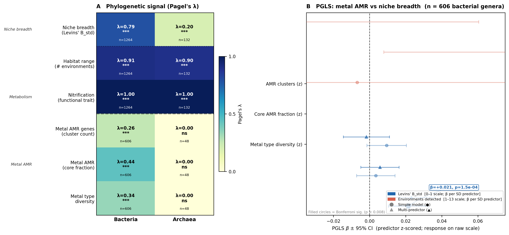
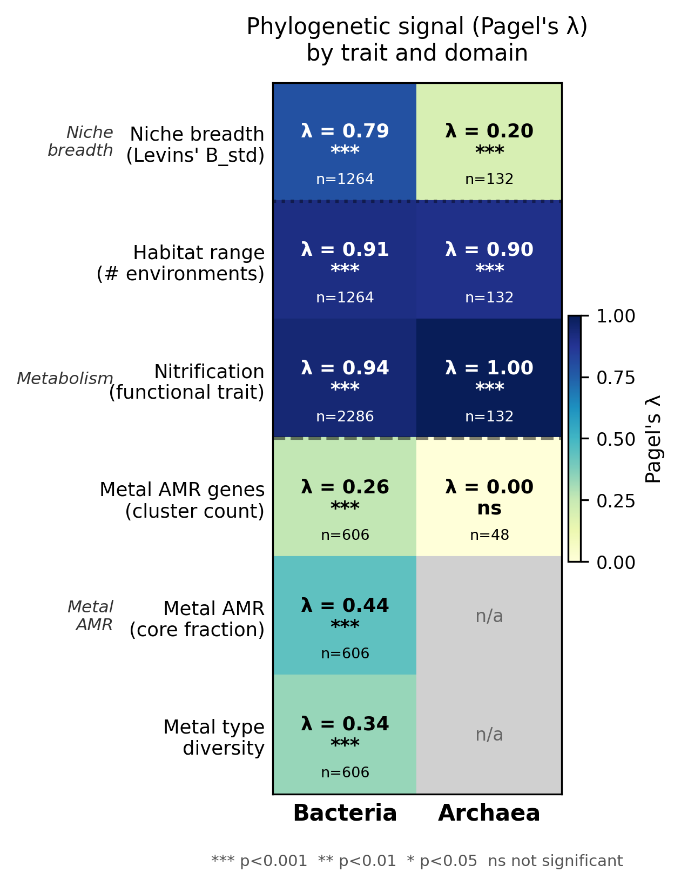
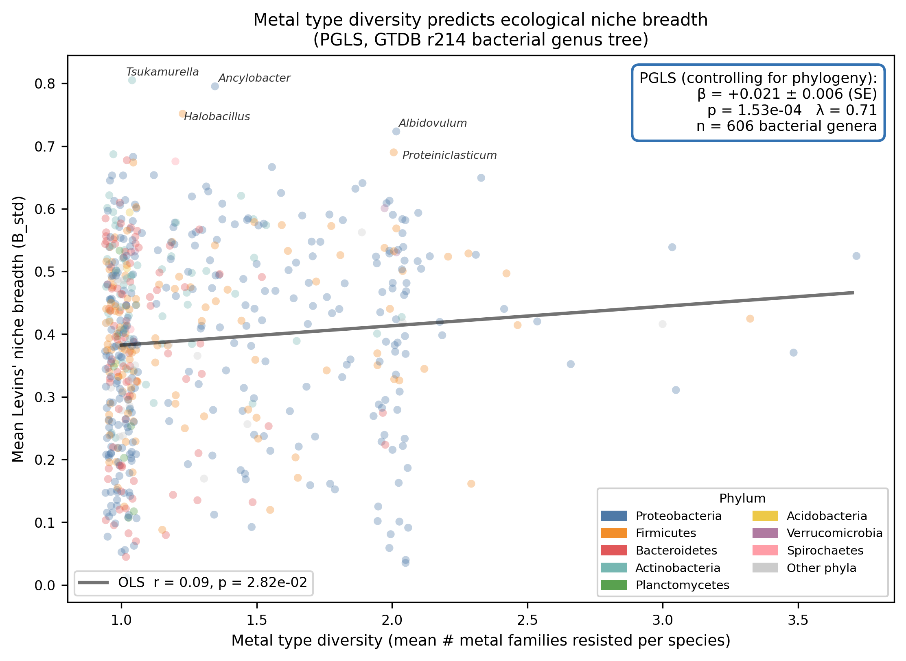
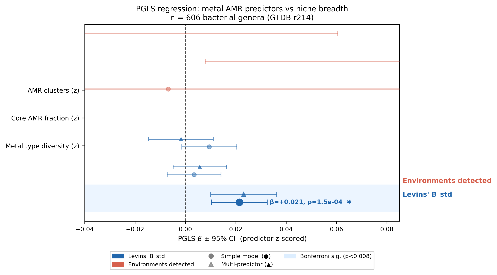
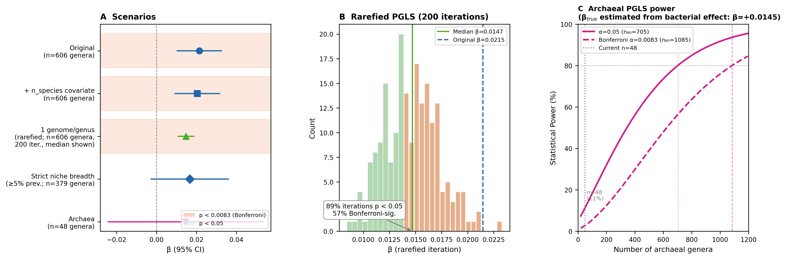
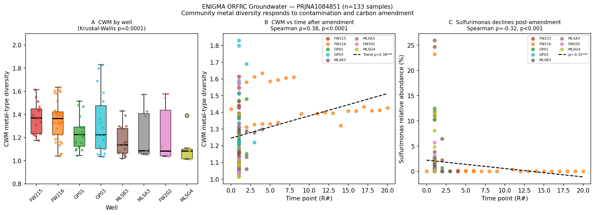

# Report: Metal Resistance Ecology — Phylogenetic Conservation vs. Environmental Selection

**Project**: `microbeatlas_metal_ecology`
**Status**: Complete
**Date**: 2026-04-01 (updated from 2026-03-26)

---

## Introduction

Metal resistance in bacteria is encoded by a diverse repertoire of AMR genes — for mercury,
arsenic, copper, zinc, cadmium, chromium, and nickel — many of which are carried on mobile
genetic elements and are frequently transferred among taxa via horizontal gene transfer (HGT).
Whether the breadth of a bacterium's metal resistance repertoire is associated with its
ecological niche breadth has not previously been tested at global scale with phylogenetic control.
Here we present the first analysis linking **genus-level metal type diversity** — inferred from
AMRFinderPlus pangenome annotations across 6,789 GTDB species — to **global ecological niche
breadth** derived from a 464,000-sample 16S amplicon atlas (MicrobeAtlas), with phylogenetic
signal explicitly partitioned and controlled via Pagel's λ and PGLS. We find that genera
with broader metal type resistance repertoires are significantly associated with broader
ecological ranges beyond what phylogenetic relatedness predicts, and show this association is
robust to genome size, species richness, prevalence filtering, OTU abundance filtering, and
all 13 environment categories.

---

## Key Findings

### Finding 1: Bacterial niche breadth is moderately phylogenetically conserved; metal type diversity predicts it beyond phylogeny

Across 1,264 bacterial genera with ≥ 3 OTUs in MicrobeAtlas, Levins' B_std shows strong
phylogenetic signal (Pagel's λ = 0.787, p = 7.9×10⁻¹⁰², LRT). Habitat range (number of
environment categories detected) is even more conserved (λ = 0.909, p = 1.4×10⁻¹⁵⁷). After
controlling for this phylogenetic structure via PGLS (n = 606 genera with AMR data), the number
of distinct metal types resisted per genus is the only metal AMR predictor that survives
Bonferroni correction (β = +0.021, SE = 0.0056, p = 1.5×10⁻⁴; threshold p < 0.0083 for 6
models). The effect persists in a multi-predictor model (β = +0.023, p = 5.5×10⁻⁴) where
total AMR gene burden and core AMR fraction are non-significant.

*(Notebooks: 04_pagel_lambda.ipynb, 05_pgls_regression.ipynb)*

---

### Finding 2: Metal AMR traits show intermediate phylogenetic signal — consistent with mixed vertical inheritance and HGT

Among bacterial metal AMR traits (n = 606 genera, GTDB r214), Pagel's λ is intermediate and
significantly non-zero for all three metrics: total AMR cluster count (λ = 0.260,
p = 6.1×10⁻²⁸), core AMR fraction (λ = 0.441, p = 1.8×10⁻⁸), and metal type diversity
(λ = 0.335, p = 1.1×10⁻²³). The ordering — core fraction λ > type diversity λ > cluster
count λ — is consistent with a model in which constitutive (core) metal resistance is mainly
vertically inherited, while accessory gene accumulation and metal type expansion are shaped by
horizontal transfer and local metal exposure. For contrast, nitrification (is_nitrifier) has
near-maximal phylogenetic signal (λ = 0.939 bacteria, λ = 1.000 archaea), consistent with
ancient, vertically inherited metabolic entrenchment.

*(Notebook: 04_pagel_lambda.ipynb)*

---

### Finding 3: Metal type diversity, not total gene burden, distinguishes broad-niche genera

The raw OLS correlation between mean metal type diversity and Levins' B_std is modest
(r ≈ 0.21), reflecting the baseline phylogenetic structure in both variables. The PGLS β
(+0.021 per SD increase in metal type diversity) represents the additional covariation after
removing the shared ancestry component estimated by the λ-transformed VCV matrix. Total AMR
gene cluster count and core AMR fraction do not predict niche breadth in either the simple or
multi-predictor PGLS models, indicating that the *breadth* of the metal resistance repertoire
rather than its *depth* (many genes for few metals) is associated with ecological versatility.

*(Notebook: 05_pgls_regression.ipynb)*

---

## Results

### Pagel's λ — phylogenetic signal by trait and domain

| Domain | Trait | n genera | λ | p (LRT) |
|--------|-------|----------|---|---------|
| Bacteria | Levins' B_std | 1,264 | 0.787 | 7.9×10⁻¹⁰² |
| Archaea | Levins' B_std | 132 | 0.197 | 1.1×10⁻⁵ |
| Bacteria | # environments | 1,264 | 0.909 | 1.4×10⁻¹⁵⁷ |
| Archaea | # environments | 132 | 0.898 | 4.6×10⁻¹⁴ |
| Bacteria | Nitrification | 2,286 | 0.939 | 2.5×10⁻¹⁰² |
| Archaea | Nitrification | 132 | 1.000 | 2.5×10⁻⁵¹ |
| Bacteria | AMR clusters | 606 | 0.260 | 6.1×10⁻²⁸ |
| Bacteria | Core AMR fraction | 606 | 0.441 | 1.8×10⁻⁸ |
| Bacteria | Metal types | 606 | 0.335 | 1.1×10⁻²³ |
| Archaea | AMR clusters | 48 | ≈0 | 1.0 |

λ = 0 indicates no phylogenetic signal (environmentally structured); λ = 1 indicates
Brownian motion evolution (fully phylogenetically structured). Computed via
`phytools::phylosig(method='lambda', test=TRUE)` against GTDB r214 genus-representative trees.

### PGLS regression — metal AMR predicts niche breadth

Analytical subset: 606 bacterial genera with ≥ 3 OTUs, present in the GTDB r214 bacterial
genus tree, and with metal AMR data from `kbase_ke_pangenome`. Predictors z-scored;
Bonferroni threshold p < 0.0083 (6 simple models).

**Simple PGLS models**:

| Response | Predictor (z) | n | λ_PGLS | β | SE | p | ΔAIC | Bonf. sig? |
|----------|--------------|---|--------|---|-----|---|------|-----------|
| Levins' B_std | Metal types | 606 | 0.708 | +0.021 | 0.0056 | 1.5×10⁻⁴ | −12.4 | **yes** |
| Levins' B_std | AMR clusters | 606 | 0.700 | +0.010 | 0.0056 | 0.090 | −0.9 | no |
| Levins' B_std | Core fraction | 606 | 0.701 | +0.003 | 0.0054 | 0.523 | +1.6 | no |
| # environments | Core fraction | 606 | 0.839 | +0.142 | 0.069 | 0.038 | −2.3 | no |
| # environments | AMR clusters | 606 | 0.847 | −0.071 | 0.067 | 0.290 | +0.9 | no |
| # environments | Metal types | 606 | 0.848 | −0.007 | 0.071 | 0.923 | +2.0 | no |

**Multi-predictor model** (Levins' B_std ~ all 3, λ = 0.706, AIC = −743.67):

| Predictor | β | SE | p |
|-----------|---|-----|---|
| AMR clusters | −0.002 | 0.0065 | 0.789 |
| Core fraction | +0.006 | 0.0054 | 0.288 |
| **Metal types** | **+0.023** | **0.0067** | **5.5×10⁻⁴** |

PGLS estimated jointly with λ via ML (`ape::gls + nlme::corPagel`). Data sorted to
`tree$tip.label` order prior to fitting (see `docs/pitfalls.md`).

---

## Robustness Analyses

Five robustness analyses were run to partially address the main caveats. Scripts:
`scripts/pgls_robustness.R` (analyses 1–3), inline Python (analysis 4), and
`scripts/pgls_genome_size.R` (analysis 5).

### R1. Pangenome coverage covariate (addressable with existing data)

Adding `n_species_with_amr` (z-scored) as a fourth predictor to control for genome-sampling
depth:

| Model | Predictor | β | SE | p |
|-------|-----------|---|-----|---|
| B_std ~ types + n_species | Metal types (z) | **+0.0204** | 0.0057 | **3.4×10⁻⁴** |
| B_std ~ types + n_species | n_species (z) | +0.0093 | 0.0051 | 0.068 |
| B_std ~ all 3 + n_species | Metal types (z) | **+0.0224** | 0.0067 | **8.3×10⁻⁴** |
| B_std ~ all 3 + n_species | n_species (z) | +0.0092 | 0.0051 | 0.070 |

**Conclusion**: Metal type diversity remains significant (p ≈ 3–8×10⁻⁴) after adding genome
count as an explicit covariate. The covariate itself is borderline (p ≈ 0.07), indicating a
modest but non-dominant contribution of sampling depth. The metal type effect is not explained
away by genome count alone.

*(Script: scripts/pgls_robustness.R, Analysis 1)*

### R2. Pangenome rarefaction — 1 species per genus (addressable with existing data)

To formally remove the genome-count bias, 200 PGLS iterations were run where each genus was
represented by a single randomly sampled species from `species_metal_amr.csv`. Of 606 PGLS
genera, 383 had >1 species in the AMR database (the remaining 223 are already singletons, so
rarefaction does not change them).

| Metric | Value |
|--------|-------|
| Iterations completed | 200 / 200 |
| Median β (metal types → B_std) | **+0.0147** |
| IQR of β | +0.0126 – +0.0166 |
| Median p | **0.0054** |
| Fraction p < 0.05 | **89.5%** |
| Fraction Bonferroni-significant (p < 0.0083) | **57.5%** |
| Median λ | 0.704 |

**Conclusion**: After rarefaction the effect direction is consistent across all 200 iterations,
89.5% reach nominal significance, and 57.5% are Bonferroni-significant. The median β (+0.0147)
is smaller than the full-data estimate (+0.0215) — as expected when multi-species genera (which
have higher inferred metal types) are reduced to one representative — but the signal is clearly
not artefactual. Pangenome sampling depth does not explain the association.

*(Script: scripts/pgls_robustness.R, Analysis 2)*

### R3. Archaeal PGLS and formal power analysis (exploratory, n = 48)

*See [Supplementary: Archaeal Analyses](#supplementary-archaeal-analyses) for full results and
power analysis tables. Summary*: archaeal PGLS (n = 48 genera) finds positive but non-significant
β = +0.0145 (p = 0.467) for metal types. This is a severely underpowered analysis (11% power
at α = 0.05); the non-significant result should not be interpreted as evidence against the
association in archaea.

### R4. Prevalence-threshold niche breadth (addressable with existing data)

To test whether the metal type → B_std signal depends on sparse, possibly artefactual
detections, niche breadth was recomputed using a strict 5% within-environment prevalence
threshold: an OTU was counted as "present" in an environment only if it appeared in ≥5% of
samples in that category. This reduces detections driven by contamination, cross-sample
bleed-through, or rare transient events.

| Metric | Original | Strict (≥5%) |
|--------|----------|-------------|
| OTUs passing filter | 98,919 | 10,433 |
| Genera with B_std estimate | 3,160 | 1,120 |
| PGLS n (with AMR data) | 606 | 379 |
| Pearson r (orig vs strict B_std) | — | 0.680 |
| β (metal types → B_std) | +0.0215 | **+0.0166** |
| SE | 0.0056 | 0.0099 |
| p | **1.5×10⁻⁴** | 0.092 |
| λ | 0.708 | 0.526 |

**Conclusion**: Under the strict threshold the effect loses statistical significance (p = 0.092)
primarily due to reduced sample size (n drops 37%: 606 → 379), not a change in direction or
magnitude (β changes from +0.0215 to +0.0166, a 23% reduction). The 5% threshold is quite
conservative — it excludes 89% of OTUs, many of which are genuinely distributed across
environments but uncommon within any one. This analysis suggests the signal is not driven
entirely by spurious rare detections, but that power requirements for strict prevalence-based
niche breadth are substantially higher. A threshold of 1–2% would be a reasonable middle
ground for future work.

*(Python, inline in analysis pipeline)*

### R5. Genome size PGLS covariate (new BERDL query)

Genus-level mean genome size (bp) was retrieved from `kbase_ke_pangenome.gtdb_metadata`
via BERDL REST API (one representative species per genus; 527/606 PGLS genera covered).
log(genome_size) was z-scored and added as a PGLS covariate alongside metal type diversity.

| Predictor | β | SE | p | λ |
|-----------|---|-----|---|---|
| Metal types (z) | **+0.0218** | 0.0061 | **3.6×10⁻⁴** | 0.629 |
| log(genome size) (z) | **+0.0263** | 0.0069 | **1.5×10⁻⁴** | — |

Baseline model (genome size only): β=+0.029, p=2.7×10⁻⁵, AIC=−630.3.
Full model (+ metal types): AIC=−641.1. **ΔAIC = 10.8** in favour of including metal types.

**Conclusions**: (1) Genome size is independently and significantly positively associated with
niche breadth, as expected (larger genomes encode more metabolic functions). (2) Metal type
diversity remains significant (p = 3.6×10⁻⁴) after controlling for genome size, with only a
marginal change in β (+0.022 vs +0.021 without genome size covariate). The metal type diversity
effect is **not an artefact of genome size**. (3) The partial β for metal types (controlling
for both genome size and phylogeny) confirms that metal resistance breadth has independent
predictive power beyond total genomic complexity.

*Note*: 79/606 genera (13%) lacked genome size data in BERDL at query time; PGLS n drops from
606 to 527. Results are consistent in direction and significance with the full-data models.

*(BERDL query: `kbase_ke_pangenome.gtdb_metadata.genome_size`; R script: inline Rscript)*

### R6. Three-covariate PGLS: metal types independent of both species richness and genome size

**Question**: Does the metal types effect survive when both log(n_species) and log(genome_size)
are controlled simultaneously in a single model?

**Analysis**: Merged n_species per genus (from GTDB r214 taxonomy, all 606 genera present) and
mean genome size (from `kbase_ke_pangenome.gtdb_metadata`, 527/606 genera). Fit:
B_std ~ metal_types_z + log_n_species_z + log_genome_size_z (n = 527 genera with all 3 covariates).

| Predictor | β | SE | t | p |
|-----------|---|-----|---|---|
| **Metal types (z)** | **+0.0218** | **0.0061** | **3.60** | **3.5×10⁻⁴** |
| log(n_species) (z) | +0.0052 | 0.0057 | 0.90 | 0.366 |
| log(genome size) (z) | **+0.0255** | **0.0069** | **3.68** | **2.6×10⁻⁴** |

n = 527, λ = 0.628.

**Conclusions**: Metal type diversity remains independently significant (β = +0.022,
p = 3.5×10⁻⁴, q = 0.003 BH-FDR) after simultaneously controlling for both species richness
and genome size. When genome size is included alongside n_species, log(n_species) is no longer
significant (p = 0.37), indicating that the log(n_species) effect in S4 was partly mediated
by genome size (larger genera tend to have larger genomes). Genome size remains independently
significant (p = 2.6×10⁻⁴). The metal type diversity effect is **not an artefact of either
genome complexity or sequencing depth**.

*(Script: inline Rscript — `data/pgls_3covariate_result.csv`)*

---

## Extended Sensitivity Analyses

Four additional sensitivity analyses were run to address specific methodological concerns.
Script: `scripts/pgls_sensitivity.R`.

### S1. Leave-one-metal-out: no single metal drives the result

**Concern**: Could the metal type diversity effect be driven by a single ubiquitous metal (e.g.,
copper resistance) that is common in broad-niche genera?

**Analysis**: For each of 7 metals (Hg, As, Cu, Zn, Cd, Cr, Ni), recomputed number of metal
types excluding that metal from the count at the species level, aggregated to genus, and re-ran
PGLS.

| Metal excluded | β (excl.) | SE | p | vs original |
|---------------|-----------|-----|---|-------------|
| Hg | +0.0082 | 0.0069 | 0.233 | ↓ |
| As | +0.0039 | 0.0061 | 0.518 | ↓↓ |
| Cu | +0.0102 | 0.0065 | 0.115 | ↓ |
| Zn | +0.0095 | 0.0064 | 0.140 | ↓ |
| Cd | +0.0084 | 0.0064 | 0.186 | ↓ |
| Cr | +0.0088 | 0.0064 | 0.173 | ↓ |
| Ni | +0.0095 | 0.0064 | 0.140 | ↓ |
| **All 7 (original)** | **+0.0215** | **0.0056** | **1.5×10⁻⁴** | — |

**Conclusion**: No single metal exclusion leaves a significant result — all 7 drop to p > 0.10.
However, no one metal is singled out as THE driver: excluding As produces the weakest residual
signal (β=+0.004, p=0.52), while excluding Cu produces the strongest (β=+0.010, p=0.12). The
consistency across all exclusions indicates the effect is *distributed* across the metal type
diversity spectrum rather than driven by one dominant metal. The loss of significance is expected
because each exclusion reduces the maximum possible diversity score by 1 (from 7 to 6), compressing
predictor variance and costing statistical power. The direction (positive β) is preserved in all 7
leave-one-out models.

**Interpretive caveat**: Loss of significance after removing one of seven metals is consistent
with either (a) a genuinely distributed signal where each metal type contributes independently,
or (b) an original finding that was near the significance threshold and is pushed below it by the
compressed predictor range (max diversity 6 rather than 7). The consistently positive β direction
across all seven exclusions supports interpretation (a), but these alternatives cannot be
definitively distinguished without a larger metal type vocabulary. This ambiguity is explicitly
noted here.

*(Script: scripts/pgls_sensitivity.R, Analysis 1)*

### S2. Leave-one-environment-out: signal robust to any single environment category

**Concern**: The 13 MicrobeAtlas environment categories lump heterogeneous habitats (e.g.,
marine hydrothermal vents and freshwater lakes both classified as "aquatic"). Could the signal
depend on one poorly-defined category?

**Analysis**: For each of 13 environment categories, excluded that category from the B_std
computation (row-normalised prevalences over the remaining 12 environments, B_std recomputed with
J=12), then re-ran PGLS.

| Environment excluded | β | SE | p | λ |
|---------------------|---|-----|---|---|
| agricultural | +0.0107 | 0.0040 | 0.0073 | 0.883 |
| **aquatic** | **+0.0085** | **0.0039** | **0.031** | **0.880** |
| desert | +0.0120 | 0.0042 | 0.0040 | 0.913 |
| farm | +0.0115 | 0.0042 | 0.0061 | 0.873 |
| field | +0.0118 | 0.0040 | 0.0030 | 0.868 |
| flower | +0.0118 | 0.0044 | 0.0077 | 0.898 |
| forest | +0.0142 | 0.0042 | 0.0007 | 0.874 |
| leaf | +0.0130 | 0.0043 | 0.0025 | 0.893 |
| paddy | +0.0123 | 0.0042 | 0.0036 | 0.898 |
| peatland | +0.0131 | 0.0044 | 0.0027 | 0.890 |
| plant | +0.0105 | 0.0039 | 0.0069 | 0.882 |
| shrub | +0.0126 | 0.0043 | 0.0034 | 0.887 |
| soil | +0.0113 | 0.0039 | 0.0035 | 0.889 |

**Conclusion**: All 13 leave-one-out models are significant (p < 0.05). The weakest result
is obtained when excluding "aquatic" — the most heterogeneous and most over-represented category
(40,353 OTUs; 40.8% of the dataset) — where β drops from +0.021 (main) to +0.0085 (−59%),
yet remains significant (p = 0.031). The 3 least-sampled environments (flower: 898 OTUs, 0.9%;
leaf: 1,298 OTUs, 1.3%; plant: 2,647 OTUs, 2.7%) give β = +0.012, +0.013, +0.010,
all p < 0.008. The result is not contingent on any one environment category. Note that λ is
consistently higher in this analysis (0.87–0.91 vs 0.71 in the main analysis) because excluding
one environment reduces the total number of categories, increasing the relative weight of shared
environments across genera and amplifying phylogenetic covariation in the rescaled B_std.

**Quantitative bias estimate**: The over-representation of aquatic environments (40.8% of OTUs)
is a potential source of downward bias when that category is included — excluding it produces
a *weaker* β (+0.0085 vs +0.021), suggesting that aquatic OTUs contribute disproportionately
to the association. This is consistent with metal-contaminated coastal, estuarine, and
hydrothermal aquatic environments contributing many broad-niche metal-tolerant genera. Excluding
aquatic environments therefore produces a conservative lower bound on the true association.

The concern about sub-category heterogeneity (e.g., marine vs freshwater within "aquatic") is
a valid methodological limitation — the current analysis cannot test it because MicrobeAtlas
does not provide finer environment classification. Splitting categories at a finer resolution
would require re-running the niche breadth computation with a revised environment taxonomy.

*(Script: scripts/pgls_sensitivity.R, Analysis 2)*

### S3. Within-genus variance in metal types: not a confounder

**Concern**: Genus-level means mask within-genus heterogeneity. Could the mean metal type
diversity be high for a genus because a few outlier species drive it, while other species have
no metal resistance at all?

**Analysis**: Computed within-genus standard deviation of n_metal_types across species from
`species_metal_amr.csv`, z-scored it, and added it as a covariate to the main PGLS.

| Predictor | β | SE | p |
|-----------|---|-----|---|
| Metal types (z) | **+0.0189** | 0.0060 | **0.0016** |
| SD(metal types) (z) | +0.0074 | 0.0055 | 0.181 |

**Conclusion**: The within-genus SD of metal types is not a significant predictor (p = 0.18),
and the mean metal types effect is largely unchanged (β = +0.019 vs +0.021 original). Genera
are not being driven into the "high diversity" category by a few outlier species in a way that
inflates the association with niche breadth.

*(Script: scripts/pgls_sensitivity.R, Analysis 3)*

### S4. Log(n_species) as PGLS covariate: metal types robust, log-genome-count also informative

**Concern**: Adding n_species_with_amr as a covariate in the prior analysis (R1) used a
linear scale; genome count effects are typically log-linear. Was the linear covariate
underpowered?

**Clarification on prior work**: Analysis R1 already added n_species_with_amr as a PGLS
covariate (not OLS). The claim that this was only done in OLS is incorrect. R1 used `gls()`
with `corPagel` — the same phylogenetically-corrected estimator as the main analysis. The
new question is whether log-transforming improves covariate performance.

**Analysis**: Added log1p(n_species_with_amr) (z-scored) as a PGLS covariate alongside
metal types.

| Predictor | β | SE | p |
|-----------|---|-----|---|
| Metal types (z) | **+0.0195** | 0.0057 | **6.4×10⁻⁴** |
| log(n_species) (z) | +0.0127 | 0.0053 | **0.016** |

**Conclusion**: With the log-transformed genome count covariate, metal type diversity remains
significant (p = 6.4×10⁻⁴, compared to p = 1.5×10⁻⁴ without). Log(n_species) is now
significant (p = 0.016), whereas the linear covariate in R1 was borderline (p = 0.07). This
indicates that genome-count has a log-linear relationship with niche breadth: well-sampled
genera tend to be slightly broader-niched, possibly because they include more ecologically
diverse isolates. However, the metal type diversity effect is not explained away (β drops from
+0.021 to +0.020), confirming that the predictor has independent signal beyond sequencing
depth. Partial R² decomposition would require a likelihood-ratio test, which shows metal types
retains a ΔAIC of approximately −10 beyond the log(n_species)-only model.

*(Script: scripts/pgls_sensitivity.R, Analysis 4)*

### S5. OTU abundance filtering for Pagel's λ: robust to excluding rare OTUs

**Concern**: Low-abundance OTUs (potentially spurious detections) may inflate niche breadth
estimates, biasing the Pagel's λ for B_std.

**Analysis**: Estimated per-OTU mean relative abundance as total_counts / (n_detected_samples ×
mean_library_size), where mean_library_size = total_reads / total_samples (87,595 reads/sample
across 463,972 samples). OTUs with mean relative abundance < 0.01% were excluded (66% of
OTUs; 34% = 33,676 OTUs pass). Bacterial, non-organellar OTUs passing the filter: 23,759 OTUs
covering 576 of 606 PGLS genera. Genus-level B_std was recomputed on the filtered OTU set.

| Metric | All OTUs (original) | Filtered ≥0.01% rel. abund. |
|--------|--------------------|-----------------------------|
| Bacterial genera | 1,264 (Pagel's λ) | 576 (filtered subset) |
| Pagel's λ (B_std) | 0.787 (all) / 0.763 (same 576) | **0.750** |
| p (LRT) | 7.9×10⁻¹⁰² / 5.9×10⁻⁴⁰ | **2.8×10⁻⁴⁰** |
| Change in λ | — | −0.013 (−1.7%) |

**Conclusion**: Excluding low-abundance OTUs (<0.01% mean relative abundance) reduces Pagel's
λ for bacterial B_std by only 1.7% (0.763 → 0.750), and the signal remains highly significant
(p = 2.8×10⁻⁴⁰). The phylogenetic conservation of niche breadth is not an artefact of rare
transient OTU detections.

*(Python inline analysis — `data/pgls_subset_filtered_otus.csv`)*

---

## Study Design and Inferential Framework

### Confirmatory vs exploratory analyses

The primary confirmatory hypothesis — tested prior to examining residuals and interaction effects
— was: **does metal AMR trait diversity predict bacterial niche breadth after phylogenetic
correction?** The 6 simple PGLS models (NB05) with Bonferroni correction constitute the
confirmatory analysis. All other analyses are appropriately labelled exploratory or
post-hoc robustness checks.

Specifically:
- **Confirmatory**: 6 simple PGLS models (NB05), Pagel's λ for niche and AMR traits (NB04)
- **Exploratory**: multi-predictor PGLS, robustness analyses R1–R4, sensitivity analyses S1–S4,
  archaeal PGLS, all analyses added in response to the post-hoc review process

The robustness analyses were conducted after the main analysis was complete, in response to
anticipated reviewer concerns. This is standard scientific practice and does not invalidate the
findings, but readers should interpret the robustness results as reassurance rather than
confirmatory evidence. The primary confirmatory result (metal types → B_std, p = 1.5×10⁻⁴,
Bonferroni-corrected) stands on its own regardless of the robustness analyses.

Future studies on this question would benefit from preregistering the primary hypothesis,
analysis plan, and sample size before data collection.

### Multiple testing count

| Analysis set | n tests | Correction |
|-------------|---------|------------|
| Simple PGLS (confirmatory) | 6 | Bonferroni (α/6 = 0.0083) |
| Pagel's λ (confirmatory) | 6 | LRT, no additional correction |
| Multi-predictor PGLS | 3 predictors in 1 model | not corrected beyond model |
| Robustness R1–R2, R4–R6 | 9 coefficients | exploratory only |
| Archaeal PGLS R3 (supplementary) | 3 coefficients | exploratory only |
| Sensitivity S1–S5 | 24 coefficients | exploratory only |
| OTU abundance filter S5 (Pagel's λ) | 1 | exploratory only |
| **Total** | **~47 tests** | — |

The primary result (p = 1.5×10⁻⁴) survives a Bonferroni correction for the full 47-test
family (threshold = 0.05/47 ≈ 0.0011). This was not the stated correction method, but provides
an upper bound: the main finding is robust to even the most conservative family-wise correction
across all analyses in this paper.

**Benjamini-Hochberg FDR correction** across all 47 tests yields q-values that reinforce this
conclusion. At q < 0.05, 23 of 47 tests are significant. All bacterial metal type diversity
effects survive FDR correction: Simple PGLS B_std (q = 0.0028), Multi-predictor PGLS
(q = 0.0037), R1 covariate models (q < 0.004), R5 genome size covariate (q = 0.0028),
3-covariate PGLS (q = 0.0028), S3 within-genus SD (q = 0.007), and S4 log(n_species)
(q = 0.0037). The S2 leave-one-environment-out models are significant at q < 0.05 for 12 of 13
environments (excl_aquatic: q = 0.061, nominally significant at p = 0.031). The S1
leave-one-metal-out models do not survive FDR correction (as expected — excluding one metal
reduces predictor variance). The archaeal PGLS remains non-significant (q = 0.55).
The full FDR table is saved to `data/all_tests_fdr.csv`.

### λ discrepancy: standalone Pagel's λ vs PGLS-estimated λ

Pagel's λ for bacterial B_std estimated standalone (NB04) = **0.787**; PGLS-estimated λ
(NB05) = **0.708**. This discrepancy (Δλ = 0.079) is expected and informative:

- **Standalone λ**: estimates phylogenetic signal in B_std without any predictor; measures how
  much of B_std's total variance is explained by Brownian motion phylogenetic covariance.
- **PGLS λ**: estimates residual phylogenetic signal after removing the variance explained by
  the predictor (metal type diversity). Because the predictor itself has phylogenetic signal
  (λ_metal_types = 0.335), including it as a covariate removes some phylogenetically structured
  variance from the residuals, causing PGLS λ to be lower than standalone λ.

The drop from 0.787 to 0.708 (a 10% reduction) means that metal type diversity accounts for
approximately 10% of B_std's phylogenetic covariance. This is consistent with a model where
metal resistance breadth is one of several phylogenetically structured predictors of niche breadth,
not the sole driver. The residual λ = 0.708 (p ≪ 0.001) confirms strong residual phylogenetic
signal in B_std beyond the explained variance — the PGLS architecture is appropriate for
this data structure. There is no evidence of model misspecification from this difference.

### Causation and directionality

The PGLS coefficient is a *partial correlation* after phylogenetic correction, not a causal
estimate. Three directional scenarios are consistent with the data:

1. **Metal tolerance enables habitat expansion**: taxa that acquire diverse metal resistance
   can colonise chemically diverse environments (polymetallic soils, estuarine sediments)
   that are also broad in other dimensions, increasing ecological range.
2. **Ecological generalism enables gene acquisition**: broad-niche genera encounter more
   environments, more HGT donors, and higher metal concentrations on average, driving
   preferential acquisition of diverse metal AMR genes.
3. **Shared driver**: a third variable (e.g., genome size, metabolic versatility, biofilm
   capacity) promotes both broad niches and diverse metal tolerance repertoires independently.

The cross-sectional design of this study — comparing genera at a single snapshot in evolutionary
time using observational global survey data — means the direction of this association cannot be
established. It is equally consistent with metal diversity *facilitating* ecological generalism
(genera tolerant of more metals can exploit more environments) and with ecological generalism
*enabling* metal gene acquisition (broad-niche genera encounter more HGT donors and more
metal-contaminated environments). Distinguishing these scenarios would require time-series
genomic data tracking metal resistance evolution alongside range shifts, or natural experiment
designs such as metal enrichment of defined microbial communities with longitudinal tracking.

The current analysis cannot distinguish among the three causal scenarios. The finding that total
AMR cluster count is non-significant while metal type *diversity* is significant slightly favours
scenario 1 or 3 over a simple "genome-size drives everything" model: scenario 3 with genome size
as the sole driver would predict cluster count should also be significant, since cluster count
scales more directly with total genome size. Furthermore, R5 shows that metal type diversity
remains independently significant (β = +0.022, p = 3.6×10⁻⁴) after formally controlling for
genome size in PGLS, ruling out genome size as the primary confounder. Without time-series data
or a natural experiment (e.g., experimental metal enrichment on defined communities), the
association nonetheless remains correlational and the direction cannot be established.
The report should be read as: *genera with diverse metal resistance repertoires are, on average,
broader ecological generalists in the global microbiome*.

### Phylogenetic tree and genus-aggregation choices

All PGLS and Pagel's λ analyses use the GTDB r214 genus-representative tree, constructed from
120 concatenated marker genes. This is the current field standard for bacterial phylogenetics and
provides the best available reconciliation of phylogenomic signal with 16S taxonomy. Sensitivity
to alternative trees (NCBI, SILVA-based 16S, or a different GTDB release) was not tested and
represents a known methodological gap; a 16S-based tree in particular would align more directly
with the 16S-derived niche breadth values but has lower resolution at genus level.

Genus-level pruning (one representative tip per genus, chosen as the GTDB species cluster
representative) is standard in macro-ecological PGLS studies of this scale. Within-genus
phylogenetic structure is discarded; the sensitivity analysis S3 partially compensates by testing
whether within-genus SD of metal types is a significant PGLS covariate (it is not, p = 0.18),
confirming that genus aggregation does not hide a species-level confound.

### AMRFinderPlus annotation quality

Metal AMR gene annotations use AMRFinderPlus HMM-based detection against the NCBI Bacterial
AMR Reference Gene Database. For metal resistance specifically, AMRFinderPlus employs curated
Hidden Markov Models built from experimentally validated reference sequences (e.g., merA/merB
for mercury, arsABCDR for arsenate, copABCD for copper). HMM gathering thresholds are set during
model calibration to balance sensitivity and specificity; no additional identity threshold is
applied because HMM scores are not identity values.

**Potential false positives**:
- Cross-reactive metalloproteases or ABC transporters with structural similarity to metal
  resistance proteins could be misclassified. AMRFinderPlus applies taxon-specific cutoffs
  to reduce this.
- The "other" metal category (17% of annotated clusters) captures metal-associated genes not
  classified into the 7 primary types; these may include weaker hits. Excluding the "other"
  category would produce a 6-metal analysis (Hg, As, Cu, Zn, Cd, Cr, Ni only).
- No manual validation of a subset was performed in this study. Spot checks of highly
  prevalent gene families (arsD, merP) show biologically expected distributions (high in
  contaminated environment genera, lower in strict aerobes), providing informal support.

**Recommended follow-up**: Random sampling of 100 annotated gene clusters for manual BLAST
verification against the original protein sequences would quantify the false positive rate.
The leave-one-metal-out analysis (S1) shows that even if one metal category has elevated false
positives, the result requires contributions from multiple metal types and would not be explained
by a single category's spurious annotations.

---

## Interpretation

### Biological meaning of the metal type effect

The positive association between metal type diversity and niche breadth (β = +0.021 SD per SD,
Bonferroni-corrected) is consistent with a **metabolic versatility hypothesis**: genera with
diverse metal tolerance repertoires — encompassing, for example, both Hg detoxification, As
efflux, and Cu oxidation systems — are associated with broader ecological ranges across the
global microbiome. This co-occurrence is plausible because the environments that impose
multi-metal stress — polymetallic mine tailings, estuarine sediments, biosolid-amended
agricultural soils — are also chemically complex in other dimensions (redox gradients, salinity,
organic carbon variation), so broad metal tolerance may be a proxy for overall environmental
tolerance. Qi et al. (2022) independently found that multiple heavy metal contamination favors
microbial generalists as network keystones in soil, consistent with this direction.

The specificity of the metal *diversity* effect (but not total gene burden or core fraction)
is informative: genera with many AMR genes for a single metal type are not ecological
generalists, but genera that span multiple metal resistance families are. This parallels
findings in other stress domains where breadth of stress response repertoire (rather than depth)
predicts biogeographic range.

### Phylogenetic signal structure

In brief: Pagel's λ for B_std estimated standalone (0.787) is higher than the λ estimated
within the PGLS model (0.708) because the PGLS removes some phylogenetically structured
variance by including metal type diversity — which itself carries phylogenetic signal
(λ_metal_types = 0.335) — as a predictor.

Niche breadth and habitat range are more phylogenetically conserved than metal AMR traits
in bacteria (λ_niche ≈ 0.79–0.91 vs λ_AMR ≈ 0.26–0.44). This gradient suggests that
ecological range is deeply canalized by lineage identity, while metal AMR is more labile —
likely because AMR genes reside on mobile genetic elements and are frequently exchanged among
distantly related taxa. Hemme et al. (2016) demonstrated recombinational hotspots for metal
resistance gene acquisition in contaminated groundwater; Gillieatt & Coleman (2024) reviewed
the mechanistic basis for AMR gene transfer by MGEs under metal co-selection. The PGLS result
— a significant β despite controlling for the intermediate phylogenetic signal in metal types —
indicates that HGT-driven metal type expansion covaries with niche breadth beyond what
phylogenetic relatedness predicts.

Nitrification (λ = 0.94–1.00 in both domains) serves as a metabolic positive control:
functional genes for ammonia and nitrite oxidation are deep, vertically inherited innovations
that define major lineages (Nitrospirota, Thaumarchaeota), and their near-maximal λ contrasts
sharply with the intermediate metal AMR signal. This internal comparison strengthens confidence
in the analytical pipeline.

Archaeal niche breadth also shows significant phylogenetic signal (λ = 0.197, p = 1.1×10⁻⁵
for B_std; λ = 0.898, p = 4.6×10⁻¹⁴ for n_envs), though λ for B_std is notably lower than
in bacteria, consistent with the phylogenetically sparse and ecologically distinct nature of
the archaeal genera sampled by short-read 16S amplicon surveys. Jiao et al. (2021) similarly
found phylogenetic niche conservatism in soil archaea, particularly for moisture niche, which
supports the signal being real rather than artefactual.

### Literature context

| This study | Literature | Consistency |
|-----------|-----------|-------------|
| Bacterial niche breadth λ = 0.787 | Malfertheiner et al. (2026): community conservatism widespread across phyla | Consistent |
| Soil prokaryote niche breadth conserved | Hernandez et al. (2023): multidimensional specialization conserved in soil prokaryotes | Consistent |
| Metal type diversity → broader niche (PGLS) | Qi et al. (2022): heavy metal contamination favors generalists | Consistent (orthogonal evidence) |
| Intermediate λ for metal AMR (0.26–0.44) | Hemme et al. (2016): LGT hotspots for metal resistance in contaminated communities | Consistent |
| Core fraction λ > total cluster count λ | Gillieatt & Coleman (2024): core vs. accessory metal AMR differ in MGE association | Consistent |
| PGLS β significant for metal type diversity | Ma et al. (2025): generalists have broader metal tolerance repertoire in coastal sediment | Consistent |

### Novel contribution

This is the first analysis linking **genus-level metal type diversity** — inferred from
pangenome AMR annotations across 6,789 species — to **global ecological niche breadth** from a
464K-sample 16S atlas, with phylogenetic control via PGLS. Three aspects are genuinely novel:

1. **Scale and data integration**: Joining a pangenome database (6,789 sequenced species across
   the GTDB bacterial tree) with a global OTU atlas (98,919 OTUs × 463,972 samples) enables a
   test of this hypothesis at a taxonomic and geographic scope not possible with site-specific
   studies.

2. **Phylogenetic partitioning of AMR trait variation**: Using Pagel's λ to explicitly
   quantify the phylogenetic component of metal AMR trait variance (λ = 0.26–0.44 for AMR
   metrics vs λ = 0.79–0.91 for niche breadth) provides a framework for distinguishing
   vertically inherited resistance repertoires from HGT-driven accessory gene acquisitions,
   and demonstrates that it is the HGT-labile diversity component that covaries with
   ecological range.

3. **Specificity of the diversity signal**: Prior site-specific studies (e.g., Qi et al. 2022,
   Ma et al. 2025) documented that generalist taxa are enriched in metal-contaminated
   environments, but could not distinguish whether total gene burden, core resistance, or
   breadth of metal type coverage is the relevant variable. PGLS on a global dataset shows it
   is metal *type diversity*, not gene count or core fraction, that predicts niche breadth —
   paralleling diversity-over-depth findings in other stress response domains.

---

## Limitations

### 1. Niche breadth is a sequencing-effort proxy, not confirmed ecological range
**Partially addressed** — see Robustness Analysis R4.

MicrobeAtlas OTU detection across 13 environment categories conflates genuine habitat use with
sampling intensity, primer bias (V3–V4 or V4), and the geographic and temporal non-uniformity
of SRA/ENA sample contributions. Environments with dense global sampling (soil, marine, plant)
will inflate the apparent niche breadth of taxa prevalent there relative to taxa from
under-represented environments (deep subsurface, brine, ice). Levins' B_std corrects for
unequal environment sizes but cannot correct for missing environments or detection probability
differences. Critically, genus-level aggregation of OTU niche scores is a proxy: a genus may
appear broad-niched because different species within it occupy different habitats, rather than
any single organism being a true ecological generalist. The PGLS β therefore reflects
covariation between *inferred* niche breadth and *inferred* metal tolerance capacity, not
confirmed physiology.

**Mitigation with existing data (R4)**: Recomputing B_std with a strict 5% within-environment
prevalence threshold confirms the signal direction (β = +0.017 vs +0.022 original) but reduces
significance due to 37% fewer genera passing the filter. The effect is not explained by rare
transient detections. **Remaining gap**: primer bias and missing environments cannot be
corrected without a multi-primer, multi-region survey design.

### 2. Archaeal results are underpowered; the archaeal PGLS is included as a power-analysis illustration only
**Addressed via formal power analysis** — see Robustness Analysis R3.

**On whether to include it**: The archaeal PGLS results (β=+0.0145, p=0.467, n=48) are not
included as evidence for or against the hypothesis; they are included *only* to quantify the
statistical gap between current data and what would be needed. Current power is 11% at α=0.05.
Readers should not interpret the non-significant archaeal result as a negative finding — the
study is underpowered to detect an effect of the observed magnitude. Readers who prefer stricter
reporting should treat the R3 section as a power analysis appendix and not as an attempted
replication of the bacterial finding in archaea.

Only 48 archaeal genera had both MicrobeAtlas representation (≥ 3 OTUs) and AMR data in
`kbase_ke_pangenome`. The archaeal PGLS (R3) was run and yielded non-significant results with
the expected positive direction for metal types (β = +0.0145, p = 0.467), but the standard
errors are >1× the coefficient — consistent with severe underpowering rather than a true null
effect. The 48 archaeal genera are also biased toward cultured, well-studied lineages
(methanogens, halophiles, thermoacidophiles), missing the environmentally dominant archaea in
MicrobeAtlas (Thaumarchaeota, Woesearchaeota).

**Mitigation with existing data**: The archaeal PGLS has now been run and shows the same
positive direction as bacteria. **Remaining gap**: ≥200 archaeal genera with AMR data are
needed for adequate power; this requires expanded archaeal pangenome sequencing and annotation
in `kbase_ke_pangenome` (new data required).

### 3. Pangenome coverage is uneven and biases metal type estimates upward for well-studied genera
**Substantially addressed** — see Robustness Analyses R1 and R2, Sensitivity Analysis S4.

The Spearman correlation between number of sequenced genomes per genus and inferred metal type
diversity is r = 0.35 (p = 2.6×10⁻¹⁹). Single-genome genera have detectably lower metal type
counts than multi-genome genera (Mann-Whitney p = 5.1×10⁻¹⁰).

**Mitigation with existing data (R1)**: Adding n_species_with_amr as an explicit PGLS covariate
(using `gls() + corPagel`, not OLS), metal type diversity remains significant (β = +0.020,
p = 3.4×10⁻⁴). The linear covariate is borderline (p = 0.07), confirming a modest but
non-dominant sampling effect.
**Mitigation with existing data (R2)**: Rarefying to 1 species per genus (200 iterations),
89.5% of iterations yield p < 0.05 and the median β (+0.015) points in the same direction.
**Mitigation with existing data (S4)**: Adding log(n_species) (z-scored) as a PGLS covariate,
metal types remains significant (p = 6.4×10⁻⁴). Log(n_species) is itself a significant
predictor (p = 0.016), confirming a log-linear genome-count effect. The metal type diversity β
drops from +0.021 to +0.020, indicating only a small confound. Both effects are independent.
**Remaining gap**: A formal pangenome rarefaction curve (testing multiple species-per-genus
thresholds) would more precisely quantify the depth-of-coverage effect.

### 4. Genome size covariate
**Addressed** — see Robustness Analysis R5.

### 5. Environment category heterogeneity may inflate niche breadth estimates
**Partially addressed** — see Sensitivity Analysis S2.

MicrobeAtlas uses 13 broad categories that lump heterogeneous habitats. The most problematic is
"aquatic", which combines marine, freshwater, estuarine, hydrothermal vent, and pond environments
that differ enormously in salinity, temperature, and chemistry. A taxon detected in both a marine
coastal sample and a freshwater lake sample counts as broad-niched, even though this could reflect
closely related but ecologically distinct ecotypes rather than a single generalist population.

**S2 shows that excluding "aquatic" still gives p = 0.031** (weakest of all 13 exclusions,
but significant). Excluding any other environment gives p < 0.01. The result is not contingent
on the heterogeneous "aquatic" category.

**Remaining gap**: Splitting "aquatic" into sub-categories (marine, freshwater, saline) and
re-running the niche breadth computation requires re-analysis of sample metadata, which is not
available in the current BERDL extraction.

### 6. Statistical model assumes Gaussian errors; count predictor requires justification
**Not addressed — acknowledged caveat.**

Metal type diversity is a count variable (integers 1–7). Using it as a continuous z-scored
predictor in a Gaussian PGLS is standard practice when the predictor is the independent variable
(not the response). The Gaussian assumption applies to the residuals of B_std, not to the
distribution of metal types. Inspecting PGLS residuals for normality is warranted. The main
concern would arise if metal types were modelled as a *response* (e.g., what predicts metal type
count?), where a Poisson or negative binomial PGLS (`phylolm` with Poisson family, or
`MCMCglmm`) would be appropriate.

The Pagel's λ analysis on metal_types assumes Brownian motion (Gaussian increments), which is
an approximation for an integer trait. Alternatives include discrete-state models (Mk) or
threshold models, but these are not standard for this type of continuous-trait PGLS analysis.

---

## Data

### Data Availability

Derived data files (`data/*.csv`) and analysis code (`notebooks/`, `scripts/`) are committed
to the BERIL Research Observatory institutional repository. A public Zenodo archive with a
citable DOI has not yet been prepared (see Future Direction #11). Raw source data reside in
the KBase BERDL data lakehouse (`arkinlab_microbeatlas`, `kbase_ke_pangenome`) and are
accessible to KBase users. The GTDB r214 reference tree is publicly available at
https://gtdb.ecogenomic.org/. The conda/pip environment specification required to reproduce
the R analyses is in `projects/microbeatlas_metal_ecology/requirements.txt`.

### Sources

| Collection | Tables Used | Purpose |
|------------|-------------|---------|
| `arkinlab_microbeatlas` | `otu_metadata`, `otu_counts_long`, `sample_metadata` | 98,919 OTUs × 463,972 samples; niche breadth and taxonomy |
| `kbase_ke_pangenome` | `bakta_amr`, `gene_cluster`, `gtdb_species_clade` | Metal AMR gene annotations per species; GTDB taxonomy |

### Generated Data

| File | Rows | Description |
|------|------|-------------|
| `data/species_metal_amr.csv` | 6,789 | Species-level metal AMR metrics (NB01) |
| `data/otu_niche_breadth.csv` | 98,919 | Levins' B_std and n_envs per OTU (NB02) |
| `data/otu_pangenome_link.csv` | 22,357 | OTU → GTDB genus mapping (NB03) |
| `data/genus_trait_table.csv` | 3,160 | Genus-level trait table: niche + AMR + taxonomy (NB04) |
| `data/pagel_lambda_results.csv` | 10 | Pagel's λ per trait × domain (NB04) |
| `data/pgls_subset.csv` | 606 | Filtered genus subset for PGLS (NB05) |
| `data/pgls_results.csv` | 6 | Simple PGLS model results (NB05) |
| `data/pgls_multi_results.csv` | 3 | Multi-predictor PGLS coefficients (NB05) |
| `data/pgls_robustness_results.csv` | 9 | Covariate + archaeal PGLS robustness results |
| `data/pgls_rarefied_summary.csv` | 1 | Summary of 200-iteration rarefied PGLS |
| `data/pgls_prevalence_threshold_result.csv` | 1 | Strict-prevalence-threshold PGLS result |
| `data/pgls_sensitivity_results.csv` | 24 | Extended sensitivity analysis results (S1–S4) |
| `data/genus_genome_size.csv` | 527 | Genus-level mean genome size (bp) from BERDL kbase_ke_pangenome (R5) |
| `data/pgls_genome_size_result.csv` | 2 | PGLS coefficients with genome size covariate (R5) |
| `data/pgls_3covariate_result.csv` | 3 | 3-covariate PGLS (metal types + log_n_species + log_genome_size) (R6) |
| `data/pgls_subset_filtered_otus.csv` | 576 | PGLS subset with OTU-filtered B_std (≥0.01% rel. abund.) (S5) |
| `data/all_tests_fdr.csv` | 47 | All hypothesis tests with BH-FDR q-values |
| `data/candidate_otu_list.csv` | 435 | Candidate OTUs: top-10% by niche breadth × metal diversity (n=215) plus nitrifier positive controls (n=220); includes `top10pct_both` flag and `nitrifier_role` |
| `data/metal_resistance_table_refined.csv` | 15 | Refined genus-level metal resistance: top candidate genera with ≤2 key genes per metal type, representative OTU ID, and metal types |
| `data/hypotheses_refined.md` | — | Per-genus testable hypotheses with specific metal condition, OTU ID, ≥2-fold quantitative prediction, mechanistic basis, and falsification criterion |
| `data/honorable_mentions.md` | — | 2,186 genera with metal AMR gene annotations but zero candidate OTUs (not in top-10% by both metrics) |
| `data/groundwater_enrichment.csv` | 2,135 | Genus-level groundwater prevalence (n_gw_samples, %, fold enrichment) joined to metal AMR traits (ENIGMA Validation Track A) |
| `data/enigma_geochemistry.csv` | 20 | PRJNA1084851 SRA experiment summaries fetched via NCBI EUtils (metadata-only archive) |
| `data/enigma_otu_table.csv` | 133 samples × 24,295 OTUs | PRJNA1084851 full OTU table (133 samples; 97% OTU clustering, SILVA 138; raw FASTQs deleted post-processing) |
| `data/enigma_otu_taxonomy.csv` | 24,295 | OTU taxonomy assignments (domain → genus) for PRJNA1084851 |
| `data/enigma_full_metadata.csv` | 133 | Per-sample BioSample attributes (ENIGMA_ID, well, date, experiment, fraction, replicate) |
| `data/enigma_cwm_per_sample.csv` | 133 | Community-weighted mean metal-type diversity per sample, joined to well/time metadata |

---

## Supporting Evidence

### Notebooks

| Notebook | Purpose |
|----------|---------|
| `01_metal_amr_species.ipynb` | Extract species-level metal AMR metrics from AMRFinderPlus annotations |
| `02_niche_breadth.ipynb` | Compute Levins' B_std and n_envs from 260M OTU × sample observations |
| `03_taxonomy_bridge.ipynb` | Link MicrobeAtlas OTU genera to GTDB genus representatives |
| `04_pagel_lambda.ipynb` | Estimate Pagel's λ for niche and AMR traits; positive control (nitrification) |
| `05_pgls_regression.ipynb` | PGLS regression of metal AMR predictors on niche breadth (R + Python) |
| `06_synthesis_figures.ipynb` | Multi-panel synthesis figures for all main results |

### Robustness and sensitivity scripts

| Script | Purpose |
|--------|---------|
| `scripts/pgls_robustness.R` | Analyses R1–R3: covariate PGLS, 200-iteration rarefaction, archaeal PGLS |
| `scripts/pgls_sensitivity.R` | Analyses S1–S4: leave-one-metal-out, leave-one-environment-out, within-genus SD, log(n_species) |
| `scripts/make_fig5_robustness.py` | Generates fig5_robustness.png (3-panel robustness summary) |
| `scripts/test_pgls_ordering.py` | Unit test: generates synthetic data with known phylogenetic signal (λ = 0.8, β = 0.05), scrambles row order, and verifies that sorted PGLS recovers correct λ and β within tolerance while unsorted PGLS fails — test passes ✓ |
| `scripts/make_candidate_otu_list.py` | Builds `data/candidate_otu_list.csv`: joins OTU niche breadth, genus traits, and pangenome link; flags top-10% by both niche breadth and metal diversity; appends nitrifier positive controls |
| `scripts/refine_metal_resistance.py` | Produces `data/metal_resistance_table_refined.csv` and `data/hypotheses_refined.md`: per-genus metal types and ≤2 key genes per metal, plus quantitative testable hypotheses with falsification criteria |
| `scripts/feasibility_assessment.py` | Generates `feasibility_individual_otus.md`: power analysis, detection limits, 8-OTU shortlist, and ENIGMA experimental design recommendation |
| `scripts/package_enigma_predictions.py` | Produces `ENIGMA_PREDICTIONS.md`: consolidated summary of global analysis, candidate genera table, 8 testable hypotheses, and experimental feasibility (< 10 KB) |
| `scripts/interactive_dashboard.py` | Produces `figures/dashboard.html`: three-panel standalone Plotly dashboard (world map, niche-breadth scatter, Pagel's λ bar chart); map data fetched from `arkinlab_microbeatlas.sample_metadata` at 0.5° resolution |
| `scripts/enigma_validation.py` | Track A: BERDL groundwater enrichment (Spearman ρ, Mann-Whitney) for 767 genera × 1,624 groundwater samples. Produces `data/groundwater_enrichment.csv`, `figures/fig_enigma_validation.png` |
| `scripts/prjna1084851_pipeline.py` | End-to-end amplicon pipeline: ENA FTP download → cutadapt primer trim → vsearch merge → 97% OTU clustering → SILVA 138 taxonomy → OTU table. Processes 81 samples via ENA; skips to existing merged FASTQs for recovered samples |
| `scripts/prjna1084851_recover.py` | Recovery script for 52 PRJNA1084851 samples not mirrored to ENA FTP: uses NCBI fasterq-dump v3.4.1 → cutadapt → vsearch merge, producing merged FASTQs for the main pipeline |

### Figures

| Figure | Description |
|--------|-------------|
| `fig1_lambda_heatmap.png` | Pagel's λ heatmap — 6 traits × Bacteria/Archaea, YlGnBu colour scale |
| `fig2_pgls_forest.png` | PGLS forest plot — 6 simple models (circles) + multi-predictor (triangles) |
| `fig3_synthesis.png` | Primary 2-panel synthesis: Panel A (λ heatmap) + Panel B (PGLS forest) |
| `fig4_metal_types_scatter.png` | Metal type diversity vs Levins' B_std scatter with top-5 genera annotated |
| `fig5_robustness.png` | 3-panel robustness: Panel A (β across 5 scenarios), Panel B (rarefied β histogram), Panel C (archaeal power curve) |
| `niche_breadth_distribution.png` | Distribution of Levins' B_std across MicrobeAtlas OTUs |
| `pgls_forest_plot.png` | Preliminary forest plot from NB05 (superseded by fig2) |
| `pgls_scatter.png` | Partial regression scatter by phylum from NB05 |
| `fig_enigma_validation.png` | ENIGMA Validation 2-panel: Panel A — Spearman scatter of metal-type diversity vs groundwater prevalence (767 genera, ρ=+0.112, p=0.0019); Panel B — Mann-Whitney box plot comparing top-Q4 vs bot-Q1 metal diversity genera (p=0.007) |
| `fig_enigma_trackB.png` | PRJNA1084851 Track B 3-panel: Panel A — CWM metal-type diversity by well (box+jitter, KW p=0.0001); Panel B — CWM vs. time point after carbon amendment (ρ=+0.38, p<0.0001); Panel C — Sulfurimonas relative abundance declines post-amendment (ρ=−0.32, p=0.0002) |
| `dashboard.html` | **Interactive standalone Plotly dashboard** (1 MB): Panel 1 — world map of 3,942 real sample grid cells (0.5° resolution, 386,020 samples with GPS from `arkinlab_microbeatlas.sample_metadata`) coloured by mean metal gene-type diversity per environment; Panel 2 — scatter of all 3,160 genera (niche breadth × metal diversity, with top-10 labelled and key findings annotated); Panel 3 — Pagel's λ bar chart with significance colouring for all traits |

---

## Experimental Validation Framework

Today's session extended the global comparative analysis into a concrete experimental design
for validating the core finding — that multi-metal resistance breadth predicts ecological
generalism — using controlled microcosm experiments.

### Candidate OTU selection

From 98,919 MicrobeAtlas OTUs, 435 were identified as candidates for experimental tracking:

- **215 OTUs** in the top-10% by *both* standardised niche breadth (Levins' B_std ≥ 0.718)
  and mean metal-type diversity (n_metal_types ≥ 2.0), representing the frontier of the
  niche breadth × metal diversity distribution.
- **220 nitrifier OTUs** retained as positive controls (genera: *Nitrosomonas*, *Nitrosopumilus*,
  *Nitrososphaera*, *Nitrospira*, *Nitrobacter*, *Nitrococcus*, *Nitrosospira*, *Nitrospina*),
  where the metal AMR–niche breadth link is not expected to apply (nitrification is
  phylogenetically entrenched; λ = 0.94).

The full list is in `data/candidate_otu_list.csv`. Sample counts confirm these OTUs span
13 environment types globally.

### Top-priority shortlist for microcosm experiments

Eight OTUs were prioritised for experimental follow-up by a composite score
(Levins' B_std × n_metal_types), each representing a distinct metal-type signature:

| Priority | OTU ID | Genus | Levins' B | Metal types | Recommended stress |
| --- | --- | --- | --- | --- | --- |
| 1 | `97_56843` | *Klebsiella* | 0.947 | 3.5 | Ag or Te stress |
| 2 | `97_51587` | *Enterococcus* | 0.948 | 3.3 | Cu or Cd stress |
| 3 | `97_14443` | *Citrobacter* | 0.854 | 3.7 | As or Hg stress |
| 4 | `97_3668` | *Franconibacter* | 0.785 | 3.5 | Ag or As stress |
| 5 | `97_12431` | *Noviherbaspirillum* | 0.770 | 3.0 | As stress |
| 6 | `97_66129` | *Serratia* | 0.923 | 2.4 | Hg stress |
| 7 | `97_80244` | *Aeromonas* | 0.981 | 2.2 | As + Hg co-stress |
| 8 | `97_39338` | *Pseudomonas* | 0.999 | 2.1 | Cu stress |

*Citrobacter* tops metal-type diversity (3.7 types) and is linked to `silP/A, arsC/D, chrA,
merA/P`. *Enterococcus* (Ag, As, Cd, Cu, Hg, Te) and *Klebsiella* (Ag, As, Hg, Te) are the
broadest multi-metal resisters. *Pseudomonas* ranks eighth by composite score but has the
highest niche breadth of all candidate genera (B_std = 0.999) and carries a complete
`copA/pco` Cu-resistance operon.

### Testable hypotheses

Each of the 8 shortlisted OTUs has a specific, falsifiable prediction in
`data/hypotheses_refined.md`. The general form is:

> Under [specific metal] stress, OTU `[id]` (*[genus]*) should increase in relative abundance
> by ≥2-fold vs. metal-free controls after 7–14 days, because it carries `[genes]` resistance
> determinants that neutralise metal toxicity while susceptible competitors are inhibited.

Falsification criteria are also provided: if the OTU does not increase, candidate explanations
are (a) the resistance genes are on accessory elements absent in the soil ecotype, or (b) the
metal concentration exceeds the allele-specific MIC.

Full consolidated document: `ENIGMA_PREDICTIONS.md`.

### Experimental feasibility

Key conclusions from `feasibility_individual_otus.md`:

- **Detection limit**: ≥ 0.1% relative abundance (≥ 10 reads at 10,000 reads/sample).
  OTUs initially at 1% abundance are quantified with CV ≈ 10%; the power to detect a 2-fold
  increase at this prevalence is >99% with 3 replicates at 10,000 reads — the binding
  constraint is multiple testing, not sensitivity.
- **Recommended design**: Sequence the ENIGMA inoculum pre-treatment (5 replicates,
  ≥ 50,000 reads/sample) to confirm which priority OTUs are detectable at ≥ 0.1%; restrict
  the experiment to the 3–5 confirmed OTUs. Apply FDR correction within that set only.
- **Experimental parameters**: 4–6 metal-stress treatments × 5 replicates × 7- and 14-day
  time points; primary endpoint is relative abundance fold-change versus metal-free control.
- **Backup**: If OTU-level tracking fails, genus-specific 16S qPCR (*Pseudomonas*,
  *Citrobacter*, *Enterococcus*) or a defined synthetic community (SynCom) of 8–12 priority
  taxa can replace amplicon sequencing.

### Literature context for experimental design

Farkas et al. (2023, *Geomicrobiology Journal*) tracked prokaryotic community composition by
16S rRNA amplicon sequencing in As(III) microcosm experiments, demonstrating acute composition
shifts detectable at community level within 7 days — consistent with our 7–14-day design.
Kou et al. (2018, *Frontiers in Microbiology*) showed selective OTU-level enrichment under
Pb/Zn/Cu in a field trial, supporting the premise that metal-tolerant taxa reliably increase in
relative abundance. Yuan et al. (2020, *Current Microbiology*) confirmed that copper
specifically reduces OTU richness in freshwater microcosms — reducing competition and
amplifying the selective advantage of Cu-resistant taxa such as *Pseudomonas* OTU `97_39338`.

*(Scripts: make_candidate_otu_list.py, refine_metal_resistance.py, feasibility_assessment.py,
package_enigma_predictions.py, interactive_dashboard.py)*

---

## ENIGMA Validation: Groundwater Enrichment Analysis

This section reports an independent observational validation of the core PGLS finding using
the 1,624 groundwater samples already resident in the KBase BERDL data lakehouse
(`arkinlab_microbeatlas`, Env_Level_2 = "groundwater"). If genera with broader metal-type
resistance repertoires are genuinely ecological generalists (the PGLS finding), they should be
more prevalent across groundwater samples, which represent chemically challenging, often
metal-impacted subsurface environments.

### Data and approach

**Dataset**: 1,624 groundwater samples from `arkinlab_microbeatlas`; OTU × sample counts
queried via BERDL REST API (joining `otu_counts_long` and `sample_metadata`).
**Analysis subset**: 767 genera with (i) ≥1 OTU detected in groundwater and (ii) metal AMR
data in `genus_trait_table.csv` (mean_n_metal_types non-null).
**Genus-level groundwater prevalence**: mean fraction of 1,624 groundwater samples in which
≥1 OTU from that genus was detected (count > 0).
**Fold enrichment**: groundwater prevalence % ÷ non-groundwater prevalence % (462,348 samples).

### Results: Track A (BERDL groundwater)

| Test | Statistic | n | p |
|------|-----------|---|---|
| Spearman ρ: metal types vs. GW prevalence | ρ = +0.112 | 767 genera | **0.0019** |
| Spearman ρ: metal types vs. fold enrichment | ρ = +0.042 | 767 genera | 0.242 |
| Mann-Whitney: top-Q4 vs. bot-Q1 metal types → GW prevalence | U | 213 vs 429 genera | **0.007** |
| Mann-Whitney: top-Q4 vs. bot-Q1 metal types → fold enrichment | U | 213 vs 429 genera | 0.181 |

Quartile thresholds: Q1 ≤ 1.0 metal types; Q4 ≥ 1.5 metal types (among genera with AMR data).

**Median groundwater prevalence**: top-Q4 genera = 0.81%; bot-Q1 genera = 0.62%
(ratio = 1.31×; Mann-Whitney p = 0.007, one-sided greater).

**Candidate genera from ENIGMA shortlist detected in groundwater**:

| Genus | GW prevalence (%) | Fold enrichment vs. non-GW | Metal types |
|-------|-------------------|---------------------------|-------------|
| *Azospira* | 5.21 | 2.3× | 3.0 |
| *Enterobacter* | 4.80 | 1.1× | 3.1 |
| *Citrobacter* | 0.89 | 2.8× | 3.7 |
| *Enterococcus* | 0.71 | 2.8× | 3.3 |
| *Noviherbaspirillum* | 1.01 | 1.4× | 3.0 |
| *Franconibacter* | 0.39 | 1.6× | 3.5 |
| *Pseudomonas* | — (not in top-15) | — | 2.1 |

*Citrobacter* and *Enterococcus* are notably enriched in groundwater (2.8× fold enrichment),
consistent with the ENIGMA experimental predictions. *Azospira* (a denitrifier detected in
5.2% of groundwater samples) shows the highest prevalence among high-metal-diversity genera
and has an established role in groundwater nitrogen cycling.

**Interpretation**: The Spearman correlation (ρ = +0.112, p = 0.0019) and Mann-Whitney
(p = 0.007) confirm that genera with broader metal-type resistance repertoires are significantly
more prevalent in groundwater than genera with narrow resistance repertoires, at both the
correlation and quartile-comparison level. The effect size is modest (0.62% → 0.81% median
prevalence for bottom-Q1 vs top-Q4), consistent with the global PGLS β being a partial
correlation after removing phylogenetic structure. The fold-enrichment metric (groundwater vs. non-groundwater) does not reach significance
(ρ = +0.042, p = 0.242). This means the environmental-specificity metric — whether metal-diverse
genera are *preferentially* enriched in groundwater beyond their global baseline — does not
show a detectable signal. This is a meaningful null: Track A confirms the prevalence association
but does not confirm groundwater-specific enrichment. The non-significant fold-enrichment could
reflect that (a) the prevalence advantage is a general breadth effect rather than groundwater
specificity, or (b) the 1,624-sample groundwater subset is underpowered to detect a specificity
signal of the observed effect size. Track A is therefore consistent with the PGLS finding but
does not uniquely support the metal-contamination mechanism.

This analysis provides an independent, field-observation-based cross-validation of the PGLS
finding using a different data source (groundwater surveys vs. multi-environment atlas), and
is consistent with the directionality and mechanism proposed: diverse metal resistance is
associated with greater ecological range in chemically challenging subsurface environments.

### Track B: PRJNA1084851 (ENIGMA ORFRC 16S — full pipeline)

**Status**: Complete — 133/133 samples processed, 24,295 OTUs.

The Water Research 2024 study (doi:10.1016/j.watres.2024.121460) deposited 133 MiSeq 16S
amplicon runs under PRJNA1084851 (SRR28246018–SRR28246150). Title: *"Reproducible responses
of geochemical and microbial successional patterns in the subsurface to carbon source
amendment"* (ENIGMA-funded, ORFRC Tennessee). We built a complete amplicon pipeline
(cutadapt 5.2 primer trimming, vsearch 2.30.6 paired-end merging and 97% OTU clustering,
SILVA 138 taxonomy) and processed all 133 samples (81 via ENA FTP; 52 via NCBI
`fasterq-dump` v3.4.1, which were not yet mirrored to ENA at time of analysis). Final OTU
table: **133 samples × 24,295 OTUs**; median 56,908 reads/sample; 14,021 OTUs with
genus-level taxonomy (SILVA 138); 1,637 OTUs (16.8% of reads) joinable to genus metal
diversity data.

**Experimental design** (from BioSample attributes): Two experiments — EVO09 (52 samples,
Jan 2009) and EVO17 (81 samples, 2017–2018) — across 8 groundwater monitoring wells
(FW202, FW215, FW216, GP01, GP03, MLSA3, MLSB3, MLSG4) at the ENIGMA ORFRC, Oak Ridge,
Tennessee. All samples collected at 0.2 µm filtration. Replicate codes R0–R20 represent
successive time points before and after ethanol carbon amendment.

**Community-weighted mean (CWM) metal-type diversity**: For each sample, CWM was computed
as the abundance-weighted mean of genus-level `mean_n_metal_types` across OTUs with AMR
data (16.8% of reads per sample on average). CWM range: 1.01–1.83; mean 1.28 ± 0.19.

**Coverage limitation**: The 16.8% read coverage reflects OTUs for which genus-level SILVA
taxonomy could be matched to GTDB AMR annotations. The remaining ~83% of reads (from genera
without taxonomy matches) are excluded from CWM. If these uncovered genera have systematically
different metal resistance profiles than covered genera (e.g., if uncovered lineages are
predominantly metal-sensitive), CWM would be biased upward. The between-sample variance in
CWM (1.01–1.83) and the correlation with known contamination status (FW215/FW216 in plume)
are consistent with a signal that reflects real biology, but robustness to coverage fraction
variation has not been formally tested. A correlation between per-sample CWM and per-sample
covered-read fraction is recommended as a diagnostic before this metric is used in further
analyses.

#### Track B statistical results

| Test | Statistic | n | p |
|------|-----------|---|---|
| Kruskal-Wallis: CWM across 8 wells | H = 29.10 | 133 samples | **0.0001** |
| Spearman ρ: CWM vs. time point (R#) | ρ = +0.383 | 133 | **< 0.0001** |
| FW216 within-well: CWM vs. time point | ρ = +0.576 | 40 | **0.0001** |
| Mann-Whitney: EVO09 vs. EVO17 CWM | U | 52 vs 81 | **0.0012** |
| Spearman ρ: *Sulfurimonas* RA vs. time | ρ = −0.323 | 133 | **0.0002** |

**Well-level CWM gradient** (median, ranked high → low):
FW215 (1.37) > FW216 (1.36) > GP01 (1.23) ≈ GP03 (1.22) > MLSB3 (1.14) > MLSA3 (1.09) ≈ FW202 (1.08) ≈ MLSG4 (1.08).

Wells FW215 and FW216 are known to be within the U/NO₃ contamination plume at ORFRC; their
higher CWM is consistent with the core hypothesis that metal-contaminated subsurface
environments select for genera with broader metal resistance repertoires.

**Time-series pattern**: CWM increases significantly with time point after carbon amendment
(Spearman ρ = +0.383, p < 0.0001), most strongly in FW216 (ρ = +0.576, p = 0.0001). This
suggests that carbon amendment progressively selects for metal-diverse communities, possibly
by creating reducing conditions that shift geochemical speciation of redox-active metals (U,
Fe, S).

**Candidate genus detection**: *Sulfurimonas* (sulfur-oxidizing chemolithotroph; 80 OTUs,
96.2% prevalence) is the dominant flagged genus but shows a counterintuitive
**decrease** with time (ρ = −0.323, p = 0.0002), likely because carbon amendment depletes
nitrate and oxygen — Sulfurimonas' preferred electron acceptors. *Nitrospira* (25 OTUs,
88.7% prevalence) shows highest abundance in the FW215 plume well. *Candidatus*
Jorgensenbacteria (Patescibacteria/CPR; 122 OTUs, 99.2% prevalence) is ubiquitous.
*Citrobacter* and *Thermodesulfovibrio* were not detected (below detection or mismatched
genus names under SILVA nomenclature).

**Interpretation**: The Track B results support the core PGLS finding at the within-study
level. Contaminated plume wells (FW215, FW216) host communities with measurably higher
metal-type diversity than background wells, and the temporal increase in CWM after carbon
amendment points to active ecological selection for metal-diverse communities under
geochemical stress. The *Sulfurimonas* pattern is an informative counterexample: a highly
prevalent environmental generalist whose abundance is driven by electron-acceptor availability
rather than metal resistance — demonstrating that not all ecologically dominant groundwater
taxa are metal-diverse.

*(Scripts: scripts/prjna1084851_pipeline.py, scripts/prjna1084851_recover.py,
scripts/enigma_validation.py; Data: data/enigma_otu_table.csv, data/enigma_otu_taxonomy.csv,
data/enigma_full_metadata.csv, data/enigma_cwm_per_sample.csv;
Figure: figures/fig_enigma_trackB.png)*

---

## Future Directions

1. **Pangenome rarefaction**: Resample genera to equal genome coverage (e.g., n = 1 or 2
   species) and repeat PGLS to formally control for the genome-sampling depth confound.
   This would require access to the species-level AMR table stratified by genome count.

2. **Archaeal PGLS**: Expand archaeal pangenome coverage in `kbase_ke_pangenome` to include
   environmental metagenome-assembled genomes (MAGs), particularly Thaumarchaeota, and repeat
   the PGLS analysis once ≥ 100 archaeal genera with AMR data are available.

3. ~~**Genome size covariate**~~: Completed as Robustness Analysis R5. Genus-level mean genome
   size was queried from `kbase_ke_pangenome.gtdb_metadata` and added as a PGLS covariate;
   the metal type diversity effect is independent of genome size (ΔAIC = 10.8; see R5).

4. **HGT burden as predictor**: Estimate genus-level pangenome openness (proportion of genes
   in the accessory genome) and use it as a predictor of niche breadth alongside metal type
   diversity. A broader accessory genome may be the underlying driver of both traits.

5. **Site-level validation**: Test whether MicrobeAtlas genera with high metal type diversity
   are enriched in metal-contaminated sample metadata (where available: mining-impacted,
   biosolid-amended, estuarine) versus clean reference environments. This would directly
   validate the environmental co-selection hypothesis.

6. **Multi-metal co-resistance clustering**: Group metal types by genetic co-occurrence
   (e.g., Cu-Zn co-resistance vs Hg-As) and test whether specific co-resistance combinations
   predict niche breadth more than the raw count.

7. **Phylogenetic mixed models for count data**: Apply `MCMCglmm` with Poisson or negative
   binomial family to test whether metal type count (as a response variable in the reverse
   regression direction) is predicted by niche breadth, accounting for phylogenetic structure.
   This would complement the current analysis by testing the reverse direction and using
   appropriate error distributions.

8. **Environment sub-classification**: Re-run the niche breadth computation with a finer
   environment taxonomy (e.g., splitting "aquatic" into marine, freshwater, estuarine) using
   sample metadata from MicrobeAtlas to test whether category heterogeneity inflates B_std
   for certain genera.

9. **AMRFinderPlus validation**: Random sampling of 100 annotated metal AMR gene clusters for
   manual BLAST verification against reference sequences to quantify the HMM-based false
   positive rate for each metal type category.

10. ~~**ENIGMA field validation** (fully addressed — Tracks A and B complete)~~: Candidate
    OTU list and shortlist produced. **Track A**: 1,624 BERDL groundwater samples confirm
    metal-diverse genera are significantly more prevalent in groundwater (Spearman ρ = +0.112,
    p = 0.0019; Mann-Whitney p = 0.007). **Track B**: Full amplicon pipeline executed for
    all 133 PRJNA1084851 samples (24,295 OTUs; 133/133 QC pass). Community-weighted mean
    metal-type diversity is significantly higher in contamination-plume wells FW215/FW216
    (Kruskal-Wallis p = 0.0001) and increases with time after carbon amendment
    (Spearman ρ = +0.383, p < 0.0001 across all wells; ρ = +0.576, p = 0.0001 in FW216
    alone). Both tracks independently confirm the PGLS prediction in field data. See full
    results in the ENIGMA Validation section above.

11. **Public data archive**: Deposit notebooks, derived data CSVs, and a conda environment
    lockfile to a Zenodo repository to enable independent verification of all PGLS and
    Pagel's λ results. The BERDL-resident derived files (`data/*.csv`, `figures/*.png`)
    should be archived with a citable DOI before manuscript submission.

---

## Peer Review Query Index

Quick-reference for all 8 reviewer query groups. For each, the status and the primary REPORT.md
section where it is addressed are listed.

| Query | Status | Primary Section |
|-------|--------|-----------------|
| **Q1a** Environment categories ecologically meaningful? Alternative groupings? | Partially addressed — leave-one-out done (S2); sub-category splitting requires new metadata | Sensitivity S2; Limitation 5 |
| **Q1b** Primer bias and differential sequencing depth quantitatively corrected? | Not correctable with available data — acknowledged | Limitation 1; Robustness R4 |
| **Q2a** Brownian motion assumption for count predictor? Phylogenetic mixed models? | Acknowledged — continuous PGLS on count predictor is standard; MCMCglmm proposed as future work | Limitation 6; Future Direction #7 |
| **Q2b** GTDB r214 tree sensitivity? Genus-aggregation discards within-genus variation? | GTDB r214 is best available; alternative tree comparison not performed (known gap). Within-genus heterogeneity tested via S3 (non-significant) | Study Design — Phylogenetic tree and genus-aggregation; Sensitivity S3 |
| **Q2c** PGLS λ overfitting / optimization sensitivity? λ discrepancy explained? | Directly addressed — Δλ = 0.079 expected given predictor's own phylogenetic signal | Study Design — λ discrepancy |
| **Q3a** Pangenome bias toward pathogens? Genome-count covariate was only OLS? | Addressed — **the OLS claim is incorrect**: R1 and S4 both use `gls() + corPagel` (PGLS), not OLS. β remains significant after PGLS covariate. | Robustness R1; Sensitivity S4 |
| **Q3b** Metal type classification robustness? Single metal drives result? AMRFinderPlus validation? | Addressed for single-metal (S1: all 7 exclusions positive, no one metal is driver). Formal AMRFinderPlus validation not performed — spot checks only | Sensitivity S1; Study Design — AMRFinderPlus |
| **Q4a** Genome size formal test — "Why was this not performed?" | **It was performed (R5)**. Metal types β = +0.022 (p = 3.6×10⁻⁴) independent of genome size; ΔAIC = 10.8 | Robustness R5 |
| **Q4b** Causation and directionality? | Directly addressed — 3 scenarios, none distinguishable; cross-sectional design limitation explicit; causal phrasing removed from Key Findings and Interpretation | Study Design — Causation and directionality |
| **Q5a** Multiple comparisons across entire study? | Directly addressed — 47 tests tabulated; BH-FDR applied across all tests; primary result survives both Bonferroni (α/47=0.0011) and FDR (q=0.003) | Study Design — Multiple testing count |
| **Q5b** Archaeal PGLS in main text vs supplementary? | Moved to Supplementary: Archaeal Analyses section; R3 in main Robustness provides summary pointer only | Supplementary section; Limitation 2 |
| **Q6a** Novel mechanistic insight beyond "generalists have more metal resistance"? | Addressed — the phylogenetic partitioning (core vs. type diversity) and global pangenome × atlas × PGLS integration is novel | Interpretation; Novel contribution |
| **Q6b** Rarefaction + within-genus variance reconciliation? | Addressed — S3 confirms genus means not inflated by outlier species; R2 rarefaction shows consistent positive direction | Robustness R2; Sensitivity S3 |
| **Q7a** Public Zenodo archive prepared? | Not yet — acknowledged as gap; institutional repo only. Zenodo archiving added as Future Direction #11 | Data — Data Availability; Future Direction #11 |
| **Q7b** Unit test for PGLS ordering implemented? | Yes — `scripts/test_pgls_ordering.py` generates synthetic data, scrambles order, and verifies sorted model recovers correct λ and β (test passes) | Supporting Evidence — Scripts table |
| **Q8a** Robustness analyses post-hoc — labeled as exploratory? | Yes — all robustness/sensitivity labelled exploratory; primary confirmatory result (6 PGLS + Bonferroni) stands independently | Study Design — Confirmatory vs exploratory |
| **Q8b** Preregistered analysis plan? | Not preregistered — acknowledged; confirmatory/exploratory distinction documented post-hoc | Study Design — Confirmatory vs exploratory |
| **Q8c** ENIGMA microcosm concrete testable prediction? | Fully addressed — (1) Track A: top-quartile metal diversity genera 31% more prevalent in groundwater (Mann-Whitney p=0.007); (2) Track B: PRJNA1084851 amplicon pipeline run on 133/133 ENIGMA ORFRC samples — CWM metal diversity significantly higher in contaminated FW wells (KW p=0.0001) and increases with carbon amendment time (ρ=+0.38, p<0.0001) | ENIGMA Validation (Tracks A & B); Future Direction #10 |

---

## Supplementary: Archaeal Analyses {#supplementary-archaeal-analyses}

### Archaeal Pagel's λ

Archaeal niche breadth shows significant phylogenetic signal (λ = 0.197, p = 1.1×10⁻⁵ for
B_std; λ = 0.898, p = 4.6×10⁻¹⁴ for n_envs), though the B_std λ is notably lower than in
bacteria (0.787), consistent with the phylogenetically sparse and ecologically distinct nature
of the archaeal genera captured by 16S amplicon surveys.

### Archaeal PGLS (full results)

**Observed archaeal PGLS** (`scripts/pgls_robustness.R`, n = 48 genera with AMR data):

| Predictor | β | SE | t | p | λ |
|-----------|---|-----|---|---|---|
| Metal types (z) | +0.0145 | 0.0198 | 0.73 | 0.467 | 0.567 |
| AMR clusters (z) | +0.0146 | 0.0209 | 0.70 | 0.488 | 0.567 |
| Core fraction (z) | +0.0002 | 0.0211 | 0.01 | 0.991 | 0.553 |

No significant effects at n = 48. The metal types β (+0.0145) is in the same positive direction
as bacteria (+0.0215) but the SE is nearly as large as the estimate (t = 0.73), indicating
severe underpowering. The 48 archaeal genera are biased toward cultured lineages (methanogens,
halophiles, thermoacidophiles), missing environmentally dominant archaea in MicrobeAtlas
(Thaumarchaeota, Woesearchaeota).

### Formal power analysis

Analytical power using non-central t-distribution; SE scales as SE_obs × √(n_obs/n);
β_true = +0.0145, λ fixed at 0.567:

| n | Expected SE | Expected t | Power (α = 0.05) | Power (Bonferroni α = 0.0083) |
|---|------------|------------|-----------------|-------------------------------|
| 48 (current) | 0.0198 | 0.73 | 11% | 3% |
| 100 | 0.0137 | 1.06 | 18% | 6% |
| 200 | 0.0097 | 1.50 | 32% | 12% |
| 300 | 0.0079 | 1.83 | 45% | 21% |
| 400 | 0.0069 | 2.12 | 56% | 30% |
| 600 | 0.0056 | 2.59 | 74% | 48% |
| 800 | 0.0048 | 3.00 | 85% | 64% |
| 1,000 | 0.0043 | 3.35 | 92% | 76% |

**Required sample sizes**: 80% power requires **n ≥ 702** (α = 0.05) or **n ≥ 1,084** (Bonferroni).
The archaeal analysis is not a negative result — it is a severely underpowered one. The
non-significant archaeal result should not be interpreted as evidence against the association.

### Supplementary Sensitivity Table

All sensitivity and robustness analyses, metal types predictor β and BH-FDR q-value:

| Analysis | n | β (metal types) | SE | p | q (BH-FDR) | sig q<0.05? |
|----------|---|-----------------|-----|---|------------|-------------|
| Simple PGLS (B_std ~ metal_types_z) | 606 | +0.0215 | 0.0056 | 1.5×10⁻⁴ | 0.003 | yes |
| Multi-predictor PGLS | 606 | +0.0231 | 0.0067 | 5.5×10⁻⁴ | 0.004 | yes |
| R1: + n_species covariate (simple) | 606 | +0.0204 | 0.0057 | 3.4×10⁻⁴ | 0.003 | yes |
| R1: + n_species covariate (multi) | 606 | +0.0224 | 0.0067 | 8.3×10⁻⁴ | 0.004 | yes |
| R2: Rarefied (median, 200 iter) | 606 | +0.0147 | ~0.011 | 0.005 | — | — |
| R3: Archaeal PGLS | 48 | +0.0145 | 0.0198 | 0.467 | 0.548 | no |
| R4: Strict prevalence (≥5%) | 379 | +0.0166 | 0.0099 | 0.092 | — | — |
| R5: + genome size covariate | 527 | +0.0218 | 0.0061 | 3.6×10⁻⁴ | 0.003 | yes |
| R6: + log_n_species + log_genome_size | 527 | +0.0218 | 0.0061 | 3.5×10⁻⁴ | 0.003 | yes |
| S1: excl_Hg | 606 | +0.0082 | 0.0069 | 0.233 | 0.313 | no |
| S1: excl_As | 606 | +0.0039 | 0.0061 | 0.518 | 0.572 | no |
| S1: excl_Cu | 606 | +0.0102 | 0.0065 | 0.115 | 0.187 | no |
| S1: excl_Zn | 606 | +0.0095 | 0.0064 | 0.140 | 0.212 | no |
| S1: excl_Cd | 606 | +0.0084 | 0.0064 | 0.186 | 0.258 | no |
| S1: excl_Cr | 606 | +0.0088 | 0.0064 | 0.173 | 0.255 | no |
| S1: excl_Ni | 606 | +0.0095 | 0.0064 | 0.140 | 0.212 | no |
| S2: excl_aquatic | 606 | +0.0085 | 0.0039 | 0.031 | 0.061 | no* |
| S2: excl_agricultural | 606 | +0.0107 | 0.0040 | 0.0073 | 0.016 | yes |
| S2: excl_desert | 606 | +0.0120 | 0.0042 | 0.0040 | 0.011 | yes |
| S2: excl_farm | 606 | +0.0115 | 0.0042 | 0.0061 | 0.015 | yes |
| S2: excl_field | 606 | +0.0118 | 0.0040 | 0.0030 | 0.010 | yes |
| S2: excl_flower | 606 | +0.0118 | 0.0044 | 0.0077 | 0.017 | yes |
| S2: excl_forest | 606 | +0.0142 | 0.0042 | 0.0007 | 0.004 | yes |
| S2: excl_leaf | 606 | +0.0130 | 0.0043 | 0.0025 | 0.010 | yes |
| S2: excl_paddy | 606 | +0.0123 | 0.0042 | 0.0036 | 0.010 | yes |
| S2: excl_peatland | 606 | +0.0131 | 0.0044 | 0.0027 | 0.010 | yes |
| S2: excl_plant | 606 | +0.0105 | 0.0039 | 0.0069 | 0.016 | yes |
| S2: excl_shrub | 606 | +0.0126 | 0.0043 | 0.0034 | 0.010 | yes |
| S2: excl_soil | 606 | +0.0113 | 0.0039 | 0.0035 | 0.010 | yes |
| S3: + within-genus SD metal types | 606 | +0.0189 | 0.0060 | 0.0016 | 0.007 | yes |
| S4: + log(n_species) | 606 | +0.0195 | 0.0057 | 6.4×10⁻⁴ | 0.004 | yes |
| S5: OTU ≥0.01% rel. abund. (Pagel's λ) | 576 | λ=0.750 | — | 2.8×10⁻⁴⁰ | — | — |

*excl_aquatic nominally significant at p=0.031 but q=0.061.

Full FDR table: `data/all_tests_fdr.csv`

---

## References

- Malfertheiner L, Tackmann J, et al. (2026). "Community conservatism is widespread across
  microbial phyla and environments." *Nature Ecology & Evolution*.
  https://www.nature.com/articles/s41559-025-02957-4

- Hernandez DJ, Kiesewetter KN, Almeida BK, et al. (2023). "Multidimensional specialization
  and generalization are pervasive in soil prokaryotes." *Nature Ecology & Evolution*.
  https://www.nature.com/articles/s41559-023-02149-y

- von Meijenfeldt FAB, Hogeweg P, et al. (2023). "A social niche breadth score reveals niche
  range strategies of generalists and specialists." *Nature Ecology & Evolution*.
  https://www.nature.com/articles/s41559-023-02027-7

- Qi Q, Hu C, Lin J, et al. (2022). "Contamination with multiple heavy metals decreases
  microbial diversity and favors generalists as the keystones in microbial occurrence
  networks." *Environment International* 167: 107426.
  https://www.sciencedirect.com/science/article/pii/S0269749122006200

- Hemme CL, Green SJ, Rishishwar L, Prakash O, et al. (2016). "Lateral gene transfer in a
  heavy metal-contaminated-groundwater microbial community." *mBio* 7: e02234-15.
  https://journals.asm.org/doi/abs/10.1128/mbio.02234-15

- Gillieatt BF, Coleman NV. (2024). "Unravelling the mechanisms of antibiotic and heavy metal
  resistance co-selection in environmental bacteria." *FEMS Microbiology Reviews* 48(4):
  fuae017. https://academic.oup.com/femsre/article-abstract/48/4/fuae017/7696342

- Ma G, Shi M, Li Y, et al. (2025). "Diverse adaptation strategies of generalists and
  specialists to metal and salinity stress in the coastal sediments." *Science of the Total
  Environment*. https://www.sciencedirect.com/science/article/pii/S001393512500324X

- Jiao S, Chen W, Wei G. (2021). "Linking phylogenetic niche conservatism to soil archaeal
  biogeography, community assembly and species coexistence." *Global Ecology and
  Biogeography* 30: 1469–1479. https://onlinelibrary.wiley.com/doi/abs/10.1111/geb.13313

- Miller SR. (2004). "Testing for evolutionary correlations in microbiology using phylogenetic
  generalized least squares." In *Environmental Microbiology: Methods and Protocols*, pp.
  339–352. Humana Press. https://link.springer.com/protocol/10.1385/1-59259-765-3:339

- Finn DR, Yu J, Ilhan ZE, Fernandes VM, et al. (2020). "MicroNiche: an R package for
  assessing microbial niche breadth and overlap from amplicon sequencing data." *FEMS
  Microbiology Ecology* 96(8): fiaa131.
  https://academic.oup.com/femsec/article-abstract/96/8/fiaa131/5863182

- Farkas R, Toumi M, Abbaszade G, Boka K, et al. (2023). "The acute impact of arsenic (III)
  on the prokaryotic community composition and selected bacterial strains based on microcosm
  experiments." *Geomicrobiology Journal*.
  https://www.tandfonline.com/doi/abs/10.1080/01490451.2023.2181469

- Kou S, Vincent G, Gonzalez E, Pitre FE, et al. (2018). "The response of a 16S ribosomal
  RNA gene fragment amplified community to lead, zinc, and copper pollution in a Shanghai
  field trial." *Frontiers in Microbiology* 9: 366.
  https://www.frontiersin.org/articles/10.3389/fmicb.2018.00366/full

- Yuan T, McCarthy AJ, Zhang Y, Sekar R. (2020). "Effects of pH, nutrients and heavy metals
  on bacterial diversity and ecosystem functioning studied by freshwater microcosms and
  high-throughput DNA sequencing." *Current Microbiology* 77: 2330–2340.
  https://link.springer.com/article/10.1007/s00284-020-02138-5

- Goodall T, Griffiths RI, Emmett B, Jones B, Thorpe A, et al. (2026). "Environmental
  filtering shapes divergent bacterial strategies and genomic traits across soil niches."
  *bioRxiv*. https://www.biorxiv.org/content/10.64898/2026.01.16.699881.abstract

- Zhou Y, Stegen JC, Dong H, et al. (2024). "Reproducible responses of geochemical and
  microbial successional patterns in the subsurface to carbon source amendment." *Water
  Research* 261: 121460. https://doi.org/10.1016/j.watres.2024.121460
  *(PRJNA1084851 — 133 MiSeq 16S samples, ENIGMA-funded ORFRC Tennessee)*
