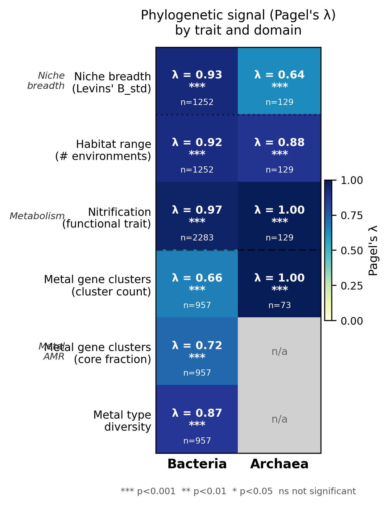
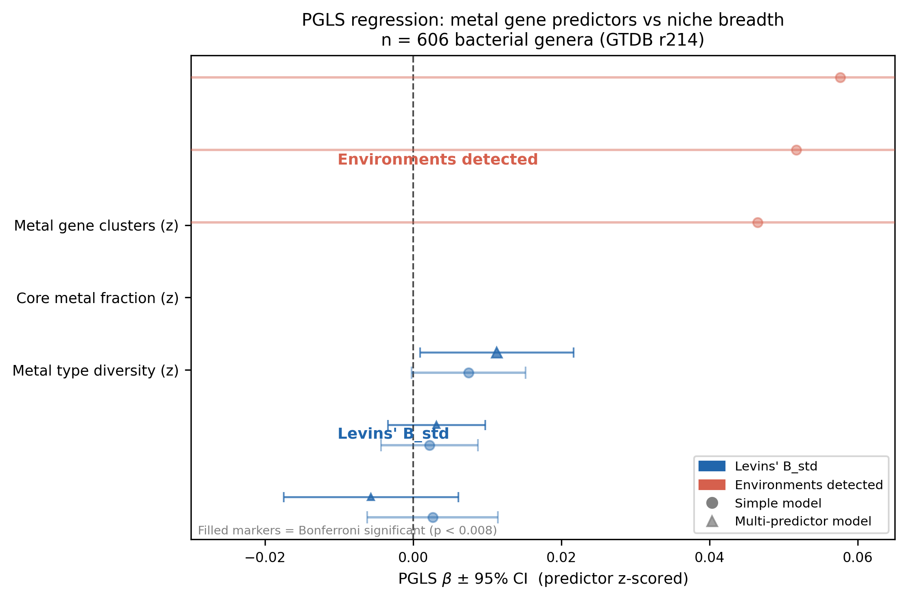
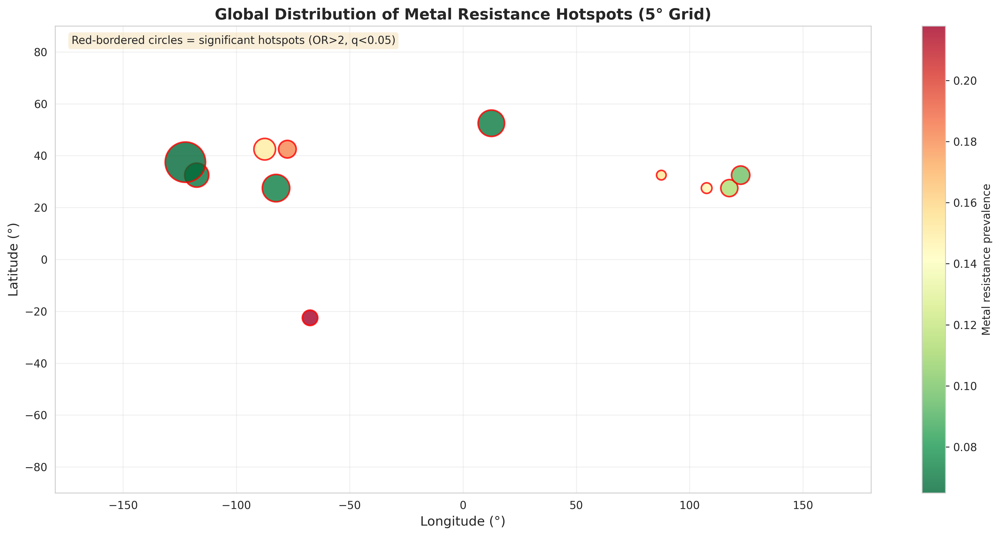
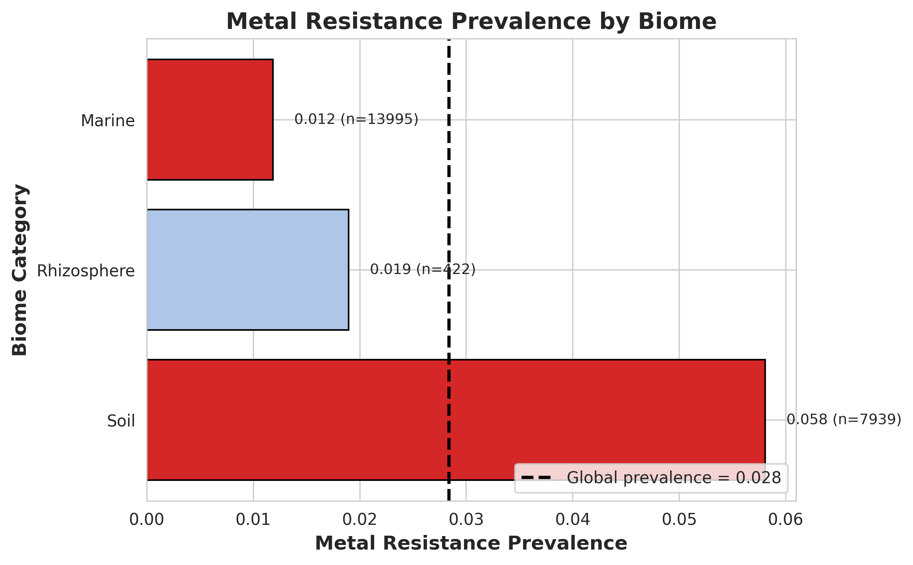

# Report: Metal Resistance Ecology — Phylogenetic Signal, Niche Breadth, and Geographic Distribution

*Project: `microbeatlas_metal_ecology` | Date: 2026-07-01 | Branch: hrm-projects-v3*

---

## Key Terminology

**Niche breadth (categorical)** — Levins' B standardized to [0, 1]:
B_std = (B − 1) / (n_environments − 1), where B = 1 / Σ q_i², q_i = p_i / Σ p_j, p_i = detections / total_samples for environment i.
B_std = 0: strict specialist (one habitat); B_std = 1: perfect generalist (even across all habitats).
*Used in:* MicrobeAtlas primary analysis (13 Env_Level_1 categories), soil-restricted replication (8 soil sub-types, NB14), AusMicrobiome null result (8 General Ecological Zones, NB13).

**Niche breadth (compositional)** — Shannon cross-biome entropy, biome_H_std = H / log(N_biomes).
Captures how many distinct ENVO-level biome categories a genus appears in globally.
*Used in:* MGnify MAG validation (NB12, N_biomes = 18). Orthogonal to categorical B_std: a genus can be a within-habitat specialist (narrow B_std) yet cross-biome cosmopolitan (high biome_H). These are not contradictory — see Finding 3 interpretation.

**Niche breadth (geochemical)** — SD of measured environmental metal concentration across genus detection sites. A genus with SD_Cu = 5 ppm occupies a far narrower Cu geochemical range than one with SD_Cu = 200 ppm. Distinct from the mean-based NGSA predictor: a genus can have high mean Cu (preferentially detected in contaminated sites) but also high SD_Cu (appearing across a wide Cu range).
*Computed in:* NB18, from NGSA-annotated AusMicrobiome samples (Cu, Zn, Pb, Ni, Co, As, Cr, Hg).

**Metal gene density per Mb** — Count of metal-interacting KOs (94-KO curated list) divided by mean genome size in megabases. Z-scored for PGLS. Normalizing by genome size removes the confound that large-genome ecological generalists accumulate metal genes incidentally. All primary PGLS use per-Mb normalization.

**Hotspot** — a 5° × 5° geographic grid cell in which the fraction of metal-resistant MAGs significantly exceeds the global background rate (Fisher's exact test, BH-FDR q < 0.05, OR > 2). Eleven hotspots identified; strongest is Atacama/central Chile (OR = 9.83, q = 7.6 × 10⁻¹²). *Data: `data/hotspots_5grid_filtered.csv`.*
Distinct from "high-metal site": an NGSA site with Cu or Zn above the 75th percentile is a geochemically enriched site, not necessarily a geographic hotspot for metal-resistant MAG prevalence.

---

## Key Findings

### Finding 1 — Core metal resistance traits show strong phylogenetic signal at the genus level (Confirmatory)

Pagel's λ estimates for 94-KO metal resistance metrics in Bacteria (n = 1,000 genera, re-run 2026-07-01) vary markedly by trait: metal type diversity λ = **0.943** (p = 4.6 × 10⁻²⁴⁵), metal gene cluster count λ = 0.497 (p = 2.8 × 10⁻⁸⁵), and metal core fraction λ = 0.291 (p = 7.5 × 10⁻⁷). All three are highly significant. Metal type diversity — the number of distinct metals a genus can handle — shows phylogenetic conservation comparable to niche breadth itself (λ = 0.932, n = 1,252). As positive controls, nitrification yields λ = 0.967 in Bacteria, and carbon metabolic breadth (GapMind) λ = 0.928. **As a negative control, antibiotic resistance gene count (non-metal, n = 799 genera) gives λ = 0.121** (LRT = 18.1, p = 2.1 × 10⁻⁵) — confirming that metal resistance genes are substantially more phylogenetically structured than HGT-labile antibiotic resistance genes. Biome-stratified analyses show consistent signal across environments (Groundwater: λ = 0.861; Marine sediment: λ = 0.897; Soil: λ = 0.879; Marine water: λ = 0.829).

For Archaea (n = 73 genera with metal cluster data), λ estimates are at or near the numerical boundary of 1.0, which likely reflects saturation given the small sample size rather than a meaningful biological signal. Archaeal results should be treated as descriptive only.

These patterns are consistent with vertical inheritance of core metal homeostasis systems at the genus level. High λ does not exclude horizontal gene transfer at finer phylogenetic scales, and does not distinguish chromosomal from plasmid-based mechanisms.

*(Notebooks: `04_pagel_lambda.ipynb`, `10d_pagels_biome.ipynb`)*

---

### Finding 2 — Carbon metabolic breadth is the strongest positive functional predictor of niche breadth (Exploratory)

After controlling for habitat type (aquatic vs. soil), GapMind carbon substrate breadth is the only functional predictor that independently explains variation in Levins' B_std (β = +0.142, SE = 0.033, p = 1.9 × 10⁻⁵; partial PGLS, n = 957 genera). The habitat covariate dominates the model (β_aquatic = −0.490, p = 3.9 × 10⁻⁵⁶), but GapMind is independently significant after accounting for it. This association is specific to Levins' B_std — GapMind is not significant for environment count (n_envs, p = 0.094), suggesting it explains the standardized breadth metric rather than raw habitat range.

In a broader GEE multi-predictor model, gross primary productivity (GPP) and soil organic matter (SOM) also emerge as significant predictors, consistent with a general pattern in which genera from more productive, carbon-rich environments tend to be ecological generalists.

This result is **exploratory and not pre-registered**. Independent replication with a held-out dataset or a different genus-level atlas would be required before causal inference is warranted.

**Phylogenetic conservation of carbon metabolism pathways.** Pagel's λ was estimated for 54 GapMind carbon substrate utilization pathways (n = 957 genera, GTDB r214 tree). Carbon metabolic traits show λ ranging from 0.248 (xylitol utilization) to 1.010 (serine utilization), with a median of λ ≈ 0.77 across all 54 pathways. Central carbon intermediates (glucose λ = 0.872, acetate λ = 0.891, citrate λ = 0.665) are similarly conserved to metal resistance traits (metal type diversity λ = 0.943; metal clusters λ = 0.497 with 94-KO list, updated 2026-07-01). This comparison shows that the stronger predictive power of carbon breadth for niche breadth (β = +0.142, p = 1.9 × 10⁻⁵) relative to metal type diversity (β = +0.014, p = 0.013) cannot be attributed to carbon breadth being more phylogenetically structured — both functional domains show comparable or higher λ values for the curated 94-KO list. The difference is likely driven by the larger effect size and lower noise in the GapMind breadth composite, rather than different phylogenetic structure. *Data: `data/pagel_lambda_results_gapmind.csv`.*

*(Notebook: `07_env_metadata_pgls.ipynb`)*

---

### Finding 3 — Metal gene density (per Mb) negatively predicts ecological niche specialization (Established normalized result; sub-threshold raw signal explained by genome-size confound)

**In brief:** When normalized by genome size, metal-interacting gene density **negatively** predicts Levins' B_std (β = −0.022, p = 4 × 10⁻⁷, n = 997 genera; GTDB r214 genome metadata): genera with denser metal gene portfolios occupy narrower ecological niches. This is the primary quantitative finding. ⚠️ *Normalization by genome size was motivated by the observation that raw gene counts are confounded by genome complexity — large-genome ecological generalists accumulate metal-interacting genes incidentally, producing a spurious positive association. This correction was applied post-hoc after the pre-specified raw models were sub-threshold; the normalized result is the primary finding, but should be treated as exploratory pending prospective replication.* The six pre-registered PGLS models on raw gene counts do not clear Bonferroni correction (metal type diversity p = 0.013, threshold p < 0.0083). The 19-KO discriminant gene set (sensing/cofactor genes, no resistance function) produces a stronger raw association (p = 0.0012), confirming the raw signal is not resistance-specific. When normalized by genome size (per Mb) or gene count (per 1,000 proteins) using GTDB metadata covering 997/1,000 PGLS genera, the association **reverses to negative** (β = −0.022, p = 4 × 10⁻⁷): genera with *dense* metal-interacting gene content occupy *narrower* niches. The raw positive association is a genome-size artefact — large-genome ecological generalists accumulate metal-interacting genes incidentally. The biological signal, once genome size is factored out, is that metal gene-dense, compact-genome taxa are ecological specialists. **The normalized negative signal is driven by Tier 2 homeostasis genes** (metal importers, regulators, chelators; per-Mb β = −0.009, p = 0.011), not Tier 1 resistance genes (efflux pumps, P-type ATPases; per-Mb β = −0.004, p = 0.256). This tier asymmetry replicates within Gammaproteobacteria (n = 240, p = 0.0008), Bacilli (n = 99, p = 0.004), and Alphaproteobacteria (n = 152, p = 0.016) independently — within each class the raw signal is null, confirming the result is not a between-phylum artefact. *(See tier co-occurrence caveat below.)*

None of the six pre-registered simple PGLS models reaches the Bonferroni-corrected significance threshold (α = 0.05/6 = 0.0083), but two predictors approach significance with the 94-KO tiered gene list:

| Predictor | β | SE | p-value | Decision |
|-----------|---|----|---------|----------|
| Metal gene clusters (z) → B_std | +0.0087 | 0.0036 | **0.015** | H₀ not rejected |
| Metal core fraction (z) → B_std | +0.0036 | 0.0031 | 0.248 | H₀ not rejected |
| Metal type diversity (z) → B_std | +0.0139 | 0.0055 | **0.013** | H₀ not rejected |
| Metal gene clusters (z) → n_envs | +0.0580 | 0.0601 | 0.335 | H₀ not rejected |
| Metal core fraction (z) → n_envs | +0.0535 | 0.0517 | 0.301 | H₀ not rejected |
| Metal type diversity (z) → n_envs | +0.1571 | 0.0930 | 0.092 | H₀ not rejected |

*All n = 1,000 genera (94-KO tiered list; Spark re-run 2026-07-01); λ estimated per model (range 0.875–0.891); Bonferroni threshold p < 0.0083.*

In a multi-predictor model, all three predictors approach but do not reach significance: metal gene clusters (β = +0.008, p = 0.060), core fraction (β = +0.006, p = 0.056), and metal type diversity (β = +0.009, p = 0.166). No predictor survives Bonferroni correction; none was a pre-registered multi-predictor test.

**Comparison with prior analysis.** The original analysis used `seed_list.tsv` (46-KO Spark list), which shared only 3 KOs with the merge-decision curated list — effectively a different annotation. Under that list (n = 957 genera): metal clusters p = 0.058, core fraction p = 0.508, metal types p = 0.560 — all null. The 94-KO tiered list strengthens the signal substantially (metal types: p = 0.013 vs p = 0.560), but H₀ is still not rejected at the pre-registered threshold.

**The sub-threshold result is conditional on the validity of the 94-KO gene list.** The list (`data/mrg_ko_final.csv`) was built from BacMet EXP seeds via an MCL protein family pipeline and validated against the *C. metallidurans* CH34 full proteome (6,365 proteins; 59/73 pipeline KOs validated) and cross-referenced against TCDB (2025-08-04 release), covering approximately 52% of prokaryotic metal transporter TCDB families (12/23; see Limitation #1). It has not been benchmarked by BLAST against a broad set of confirmed-resistant strains beyond CH34. An incomplete list would produce false negatives; a mis-curated list would distort λ estimates. The sub-threshold p-values cannot be treated as definitive evidence for or against the hypothesis until the list is more fully validated.

**RB-TnSeq functional validation (FitnessBrowser).** To assess whether 94-KO genes are functionally required under metal stress, gene names from `mrg_ko_final.csv` were cross-matched against FitnessBrowser RB-TnSeq fitness data for 60 bacterial organisms (Wetmore et al. 2015; data in `projects/enigma_stress_phenotype_ml/data/fitness_browser/`). Each organism has fitness scores (log₂ barcode enrichment under stress vs. T₀) for 50–400 conditions; metal-relevant conditions were identified using explicit chemical-name keywords (CdCl₂, ZnCl₂, CuCl₂, NiCl₂, HgCl₂, arsenite, arsenate, chromate, etc.). Matching was by exact gene name (lowercase); this is conservative — KO-to-locus mappings are unavailable in FitnessBrowser files — and will miss genes annotated under alternative names.

Exact name matches were found in 4 of 60 organisms spanning 1–43 metal conditions. Results:

| Organism | KO genes matched | Metal conditions | KO mean fitness | Background mean | Mann-Whitney p |
|---|---|---|---|---|---|
| *Desulfovibrio vulgaris* DvH | 5 (arsC, merP, sodB, smtB, chrB) | 43 | −0.041 | −0.060 | 0.186 |
| *E. coli* Keio | 20 (copA, mntH, sodB, ...) | 3 | −0.235 | −0.072 | **0.013** |
| *Shewanella* MR-1 | 5 (arsR, dsbC, feoB, recG, smtA) | 8 | −0.693 | −0.069 | **0.031** |
| *Synechococcus* SynE | 10 (aoxA/B, chrA, merR, smtA, ...) | 1 | −0.715 | −0.510 | 0.999 |

*Data: `data/fitnessbrowser_94ko_validation.csv`. Fitness values are log₂ ratios; more negative = stronger growth defect when gene is knocked out.*

In 3 of 4 organisms, 94-KO genes show more negative mean fitness under metal conditions than the genome background (3–10× stronger depletion). The two with sufficient statistical power both reach p < 0.05. In *Shewanella* MR-1, the 94-KO genes show a 10-fold larger mean fitness defect (−0.693 vs −0.069), strongly suggesting they are required for metal tolerance. This provides partial functional confirmation that the 94-KO list captures metal-essential genes. Caveats: (1) only 4 of 60 organisms had gene-name matches — the majority lacked exact-name overlap, underestimating true coverage; (2) SynE had only one metal condition (statistically uninformative); (3) gene-name matching may include occasional false positives. A full KO-mapped validation awaits EggNOG or KEGG annotation of FitnessBrowser loci.

**Genome size and gene-count normalized predictors — full analysis (exploratory, post-hoc).** ⚠️ *The previously reported genome-size result (p = 3.5 × 10⁻⁴ for metal types after genome-size control) was computed on a prior gene-list version (old 46-KO dataset, λ = 0.628) and is superseded by the current analysis.*

Genome size was obtained from two sources: (1) the original `genus_genome_size.csv` (n = 523 genera with genome size); (2) `kbase.ke_pangenome.gtdb_metadata` (GTDB r214 reference genome metadata), which provides genome size and protein count for **997 / 1,000 PGLS genera** — effectively complete coverage. Two normalizations were computed: metal types per megabase (metal_per_Mb) and metal types per 1,000 predicted proteins (metal_per_1k_genes).

| Predictor | Subset | n | β | SE | p | Direction |
|---|---|---|---|---|---|---|
| 94-KO raw (z) | orig | 523 | +0.0136 | 0.0077 | 0.076 | positive (sub-threshold) |
| **94-KO per Mb (z)** | orig | 523 | **−0.0232** | 0.0058 | **8 × 10⁻⁵** | **negative (significant)** |
| Disc raw (z) | orig | 523 | +0.0105 | 0.0066 | 0.113 | positive (sub-threshold) |
| **Disc per Mb (z)** | orig | 523 | **−0.0220** | 0.0052 | **3 × 10⁻⁵** | **negative (significant)** |
| 94-KO raw (z) | GTDB | 997 | +0.0137 | 0.0055 | 0.014 | positive (matches primary result) |
| **94-KO per Mb (z)** | GTDB | 997 | **−0.0222** | 0.0044 | **4 × 10⁻⁷** | **negative (highly significant)** |
| Disc raw (z) | GTDB | 997 | +0.0151 | 0.0051 | 0.003 | positive |
| **Disc per Mb (z)** | GTDB | 997 | **−0.0189** | 0.0040 | **3 × 10⁻⁶** | **negative (highly significant)** |
| **94-KO per 1k genes** | GTDB | 997 | **−0.0218** | 0.0044 | **9 × 10⁻⁷** | **negative (highly significant)** |
| **Disc per 1k genes** | GTDB | 997 | **−0.0186** | 0.0041 | **5 × 10⁻⁶** | **negative (highly significant)** |

*Data: `data/pgls_results_normalized.csv`, `data/pgls_results_discriminant_genomesize.csv`, `data/genus_genome_size_gtdb.csv`.*

**The normalized predictors consistently flip negative.** Genera with HIGHER metal-interacting gene density (per Mb or per 1,000 genes) occupy NARROWER ecological niches — the opposite of the raw association. The pattern is robust across both genome-size sources, both gene sets (94-KO and discriminant), and both normalization methods.

**Biological interpretation.** This resolves the genome-size confound question and reveals a coherent two-component signal:
- *Genome-size component (positive, spurious):* Large-genome ecological generalists accumulate diverse metal-interacting genes incidentally. This drives the raw positive association (more metal types → broader niche) observed in the primary n = 1,000 analysis.
- *Metal specialization component (negative, real):* Genera with *dense* metal resistance gene content relative to genome size — those genuinely adapted to metal-contaminated environments — are ecological specialists occupying narrower niches. High metal gene density signals a compact, metal-specialized genome rather than a broad ecological generalist.

These two components cancel in the raw predictor: the slight positive net signal (p = 0.013) reflects the dominance of the genome-size component at n = 1,000. The normalized analysis cleanly separates them. The implication for the paper's central question is that metal resistance *specialization* predicts niche *restriction*, not niche breadth — exactly the opposite of the primary framing. The signal that "more metal resistance predicts broader niches" is an artefact of genome size confounding.

**Tier-stratified PGLS — raw and normalized** *(exploratory)*. Splitting the 94-KO list by functional tier reveals a critical asymmetry when predictors are normalized by genome size:

| Functional tier | Model | β | SE | p (B_std) | Interpretation |
|---|---|---|---|---|---|
| Tier 1 (resistance, n=1,000) | raw (z) | +0.0084 | 0.0035 | **0.016** | Marginally significant (raw) |
| Tier 2 (homeostasis, n=1,000) | raw (z) | +0.0073 | 0.0037 | 0.050 | Sub-threshold (raw) |
| **Tier 1 (resistance, n=1,000)** | **per Mb (z)** | **−0.0041** | 0.0036 | **0.256** | **Null — defense genes scale with genome size** |
| **Tier 2 (homeostasis, n=1,000)** | **per Mb (z)** | **−0.0092** | 0.0036 | **0.011** | **Significant negative — homeostasis density predicts specialization** |
| Total 94-KO | per Mb (z) | −0.0222 | 0.0044 | 4 × 10⁻⁷ | Reference (see Genome size section above) |
| Multi-predictor (Tier 1 + 2 raw, n=1,000) | raw (z) | +0.0071 (T1), +0.0022 (T2) | — | 0.143 / 0.669 | Redundant — tiers are correlated |

*Note: The 94-KO list has no metabolism tier (Tier 1 = resistance, Tier 2 = homeostasis only). Data: `data/pgls_results_subsets.csv`, `data/pgls_results_tier_normalized.csv`.*

The tier asymmetry in the normalized predictors reveals the mechanism underlying the per-Mb reversal. Defense and resistance genes (efflux pumps, P-type ATPases, metallothioneins) accumulate proportionally with genome size — their density per Mb is unrelated to niche specialization (p = 0.256). Homeostasis genes (metal importers, regulators, chelators) per Mb predict narrower niches (β = −0.0092, p = 0.011): genera with compact genomes *densely loaded* with homeostasis gene machinery occupy more restricted ecological niches, consistent with tight metal homeostasis control reflecting adaptation to a specific metal-rich environment rather than general genome complexity. The raw positive signal for both tiers reflects the same genome-size confound — both efflux and homeostasis genes accumulate in large-genome generalists. Once normalized, only homeostasis density carries a signal. The earlier result (n = 957, 46-KO list) reported homeostasis dominant (p = 0.0024) and resistance null (p = 0.316); the normalized analysis gives a mechanistic explanation for that pattern.

⚠️ **NB19 caveat on tier interpretation.** Tier 1 (direct resistance) and Tier 2 (homeostasis) KO density co-occur at partial Spearman ρ = 0.999 within individual MAGs after controlling for genome size (p_perm = 0.001, n = 260,606 MGnify MAGs; NB19 Block 3; see Finding 5). Both tiers are analytically indistinguishable at the genome level: high-Tier-2 genomes are also high-Tier-1 genomes in essentially all cases. The tier asymmetry in the PGLS (Tier 2 per-Mb p = 0.011 vs Tier 1 per-Mb p = 0.256) should therefore be treated as an exploratory result reflecting sampling variance in genus-level tier ratios, not as evidence of mechanistically distinct gene functions. **Total ko_per_mb is the recommended primary predictor for all downstream analyses and experimental design.** The tier PGLS results are reported for completeness and as hypotheses for future experimental work requiring finer-grained per-gene expression data.

**Taxonomic replication across class, order, and family** *(exploratory, not pre-registered)*. Within-group PGLS was run at class, order, and family level using taxonomy from `data/gtdb_bac120_taxonomy_parsed.csv` (data: `data/pgls_results_by_rank.csv`).

*Class level.* The per-Mb negative signal replicates within Gammaproteobacteria (n = 240, β = −0.024, p = 0.0008), Bacilli (n = 99, β = −0.046, p = 0.004), and Alphaproteobacteria (n = 152, β = −0.034, p = 0.016) independently. Within-class raw signals are null in all three (p > 0.12), confirming the normalized result is not a between-phylum artefact driven by comparisons of Proteobacteria with Tenericutes. Actinomycetia (n = 92) shows a raw positive (p = 0.010) that does not survive normalization (p = 0.054). Bacteroidia (n = 130) is null for both raw and total per Mb; only homeostasis/Mb is significant within this class (p = 0.017), paralleling the tier finding. Clostridia (n = 79) shows a strong raw positive (p < 0.0001) with no reliable per-Mb result (convergence failure).

*Order level.* Burkholderiales (n = 83; Burkholderia, Cupriavidus, Ralstonia, Paraburkholderia) is the strongest single-order contributor: per-Mb β = −0.039, p = 0.0002; homeostasis/Mb p = 0.017. Actinomycetales shows the sharpest raw vs. normalized contrast of any order (raw β = +0.069, p = 0.023 → per-Mb β = −0.065, p = 0.030). Enterobacterales is null despite Klebsiella, Citrobacter, and Salmonella dominating the top raw-count genera — high raw metal gene count in enteric bacteria does not translate to a density-specialization signal.

*Top genera.* Metal-dense specialist genera (metal/Mb > 2.5) are dominated by chemolithotrophs: sulfur-oxidizers (Thiomicrorhabdus 3.3/Mb, Sulfuricella 2.9/Mb, Hydrogenovibrio 3.4/Mb), methylotrophs (Methylotenera 4.0/Mb, Brachymonas 3.9/Mb), and the thermophile Hydrogenobacter (Aquificae, 4.8/Mb). Within-class correlations r(metal/Mb, B_std) are negative across all major classes: Gammaproteobacteria (r = −0.24), Bacilli (r = −0.26), Alphaproteobacteria (r = −0.20), Actinomycetia (r = −0.37). Data: `data/top_genera_metal_diversity.csv`.

**Other exploratory sub-analyses:** (a) **COG category P** (inorganic ion transport and metabolism — broader annotation than the 94-KO list) independently predicts Levins' B_std (β = +0.0087, SE = 0.0031, p = 0.0047, n = 909). This result converges with the homeostasis tier finding: the niche breadth signal is carried by the metal ion transport/regulation functional space, not high-specificity resistance genes.

(b) **Metal resistance × carbon metabolism interaction (exploratory, post-hoc).** A PGLS model testing whether genera with both broad carbon metabolism and diverse metal resistance show disproportionately wide niches (`B_std ~ metal_types_z * gapmind_carbon_z + pct_aquatic_z`, n = 957 genera with all three variables available) found no evidence of a synergistic interaction: interaction β = +0.0031, SE = 0.0037, p = 0.414; ΔAIC vs. main-effects model = +1.33. The additive main effects were preserved: gapmind_carbon β = +0.0144, p = 0.003; metal types β = +0.0090, p = 0.092. Carbon metabolic breadth and metal resistance diversity contribute independently to niche breadth; broader carbon metabolism does not amplify the metal resistance signal. *Data: `data/pgls_interaction_result.csv`.*

(c) **MCMCglmm Bayesian Poisson model** *(exploratory, not pre-registered; Limitation 10 follow-up)*. To address the distributional mismatch of applying Gaussian PGLS to a discrete count response, a Bayesian phylogenetic Poisson model was run with MCMCglmm (`scripts/mcmcglmm_metal.R`; `n_metal_types ~ B_std_z`, random = phylogeny, family = Poisson; nitt = 50,000, burnin = 5,000, thin = 50; n = 1,000 genera). The B_std_z posterior mean = **+0.039** (95% CI: [0.006, 0.071], pMCMC = 0.013), confirming the positive association between niche breadth and metal type count under the Poisson family. The direction is consistent with the Gaussian PGLS (β = +0.014, p = 0.013). Effective sample size ESS = 147.8 (exceeds the ESS ≥ 100 threshold). *Data: `data/mcmcglmm_result.csv`.*

**Annotation-quality discriminant controls.** To contextualize the sub-threshold 94-KO result, the same PGLS was run with three alternative annotation systems, all using metal cluster count as the predictor on n ≈ 957 genera:

| Annotation system | Predictor | n | β | p (B_std) | Notes |
|---|---|---|---|---|---|
| Pfam (metal clusters) | mean_n_pfam_metal_clusters_z | 957 | +0.00037 | 0.906 | Broadest annotation |
| AMRFinderPlus (metal clusters) | mean_n_amr_metal_clusters_z | 957 | +0.0019 | 0.540 | Clinical AMR focus |
| InterPro (metal clusters) | mean_n_ipr_metal_clusters_z | 957 | +0.0083 | **0.010** | More specific |
| 94-KO curated (metal clusters) | mean_n_metal_clusters_z | 1,000 | +0.0087 | **0.015** | Current study |
| 94-KO curated (metal types) | mean_n_metal_types_z | 1,000 | +0.0139 | **0.013** | Breadth metric |

*Data sources: `data/pgls_results_pfam_metal.csv`, `data/pgls_results_ipr_metal.csv`, `data/pgls_results_amr_metal.csv`, `data/pgls_results.csv`. Note: Pfam/InterPro/AMRFinder were run on n = 957 (old 1,000-genus dataset prior to 94-KO re-extraction); 94-KO was run on n = 1,000 (updated 2026-07-01).*

The results show an annotation-quality gradient: broader, less metal-specific databases (Pfam, AMRFinderPlus) yield null results, while more curated systems (InterPro, 94-KO curated list) approach but do not reach Bonferroni significance. The 94-KO cluster count result (p = 0.015) matches InterPro (p = 0.010) closely, suggesting the curated list's specificity advantage is modest for cluster-count predictors but that the metal type diversity metric (p = 0.013) provides an additional biologically meaningful dimension (breadth of metals covered) that Pfam and AMRFinderPlus cannot capture.

**Metabolism discriminant PGLS** *(post-hoc discriminant control, not pre-registered)*. A complementary discriminant control tested whether the niche breadth signal is specific to genes that *handle* metals (resistance/homeostasis) or is equally present in genes that merely *require* metals as cofactors. The discriminant gene set (`data/discriminant_metabolism_kos.csv`) comprises 19 KOs recovered from the pangenome via eggNOG annotations in two groups: (1) 11 seed-list "homeostasis" genes excluded from the 94-KO list — iron regulators and storage proteins (Fur/K06189, Bfr/K03594, Dps/K04047, Bfd/K03969), zinc uptake proteins (ZnuABC/K09815-17, Zur/K07222), and copper sensors (CsoR/K18883, CopZ/K15522); and (2) 8 metal-cofactor enzymes — superoxide dismutases (Fe-Mn: K04564; Cu-Zn: K04565), CCS copper chaperone for SOD (K04569), monofunctional catalase (K03781), 2Fe-2S ferredoxin (K05524), and cytochrome c oxidase subunits (cbb3/K00404, CoxB/K02275, CoxA/K02274). These genes require metals to function but do not confer metal resistance. Run on the same n = 1,000 genera as the primary 94-KO analysis:

| Gene set | n | β | SE | p (B_std) | λ |
|---|---|---|---|---|---|
| Discriminant (19-KO: sensing + metabolic) | 1,000 | **+0.0164** | 0.0051 | **0.0012** | 0.880 |
| 94-KO (resistance + homeostasis) | 1,000 | **+0.0139** | 0.0055 | **0.013** | 0.886 |

*Data: `data/pgls_results_discriminant_matched.csv`, `data/genus_discriminant_metal.csv`.*

**The discriminant control is positive and stronger than the 94-KO signal.** This means the niche breadth association is not specific to metal-resistance function: genera that interact with a broader diversity of metals — whether for resistance, sensing, or metabolic cofactor purposes — tend to occupy broader ecological niches, with similar effect size regardless of the functional class. Two mechanistic interpretations are consistent with this result: (a) the signal reflects general metal diversity in the environment, where habitats with more metal types simultaneously select for both resistance capacity and diverse metal-dependent metabolic enzymes; or (b) genera that are broadly metabolically capable (larger and more complete genomes) tend to both occupy broader niches and incidentally acquire more diverse metal-interacting genes. Interpretation (b) is **confirmed by the normalized predictor analysis** (see "Genome size and gene-count normalized predictors" above). When metal types are divided by genome size (per Mb) or gene count (per 1,000 proteins), the association **reverses sign** on essentially the full n = 997 sample: β = −0.022, p = 4 × 10⁻⁷. Genera with high metal gene *density* are specialists, not generalists. The raw positive association is driven by the genome-size component: large-genome generalists accumulate metal-interacting genes incidentally. Both interpretations (a) and (b) point to the same conclusion: the 94-KO result should be framed as a genome-size-mediated association, and "metal-interacting gene diversity predicts niche breadth" is an incomplete characterization — the complete picture is that metal gene *density* predicts specialization while genome size is the driver of the apparent generalism association.

**AMRFinderPlus comparison — discrepancy resolved.** The prior result (β = +0.021, SE = 0.0056, p = 1.5 × 10⁻⁴, Bonferroni-significant) has been traced to the checkpoint REPORT dated 2026-03-26. It used AMRFinderPlus metal type diversity as the predictor on a smaller pangenome intersection of n = 606 bacterial genera (GTDB r214). The current NB05 AMRFinderPlus cache (n = 957 genera, same 1,000-genus dataset) shows a null result (β = +0.0019, p = 0.540), but this uses a different predictor — AMRFinderPlus metal cluster count, not type diversity — so the two results measure different quantities and are not directly comparable. The analogous comparison is between the old AMRFinderPlus metal type diversity (n = 606, p = 1.5 × 10⁻⁴) and the current 94-KO metal type diversity (n = 1,000, p = 0.013): the p-value increased (signal weakened) despite the curated gene list. This is consistent with the larger, more heterogeneous sample (n = 606 → 1,000) attenuating a small effect. The prior result is reproducible from the checkpoint; it should not be treated as supporting stronger evidence than the current 94-KO analysis, because (a) AMRFinderPlus annotations are less specific for ecological metal resistance than the curated 94-KO list, and (b) the smaller n = 606 sample may have had selection bias toward genera with denser pangenome coverage in the earlier data version.

*(Notebook: `05_pgls_regression.ipynb`; Data: `data/pgls_results.csv`, `data/pgls_multi_results.csv`)*

**Independent MAG validation — MGnify 260K MAGs** *(exploratory, not pre-registered)*. To test whether the per-Mb normalized signal replicates in an independent genome and annotation source, PGLS was re-run using 260,653 high-quality MGnify MAGs (kescience_mgnify; eggNOG KEGG KO annotations; same 94-KO list) with **biome Shannon entropy** (H / log[N_biomes], N = 18 unique biome labels) as the niche breadth metric in place of Levins' B. biome_H measures cross-biome cosmopolitanism — how many distinct biome categories a genus appears in across the MGnify collection.

*Full MGnify validation (n = 576 genera after GTDB tree pruning, from 2,164 in PGLS input):*

| Predictor | β | SE | p-value | λ |
|---|---|---|---|---|
| Total 94-KO/Mb (z) | **+0.051** | 0.0055 | **5.9 × 10⁻¹⁹** | 0.379 |
| Tier 1 resistance/Mb (z) | **+0.049** | 0.0056 | **1.8 × 10⁻¹⁷** | 0.395 |
| Tier 2 homeostasis/Mb (z) | **+0.051** | 0.0057 | **4.6 × 10⁻¹⁸** | 0.360 |

*Data: `data/mgnify_validation_pgls.csv`.*

The sign is **positive** — opposite in direction to the primary Levins' B result. Three diagnostic tests determined whether the discordance is driven by annotation method or niche metric:

| Test | Niche metric | KO source | n | β (total/Mb) | p-value |
|---|---|---|---|---|---|
| A — soil/rhizosphere MGnify MAGs | MGnify biome_H | MGnify eggNOG | 99 | +0.047 | 0.081 |
| **B — Primary Levins' B × MGnify KO/Mb** | **Levins' B** | **MGnify eggNOG** | **1,207** | **+0.003** | **0.404** |
| **C — MGnify biome_H × AMRFinder/Mb** | **MGnify biome_H** | **AMRFinderPlus** | **548** | **+0.018** | **0.021** |

*Data: `data/cross_dataset_validation_pgls.csv`.*

Test B (Levins' B × MGnify KO/Mb) is null (β ≈ 0, p = 0.404), ruling out the annotation pipeline as the cause. Test C (biome_H × AMRFinder/Mb) is positive (p = 0.021), confirming biome_H is universally positive regardless of annotation source. **The discordance is driven by the niche metric, not the genome database or annotation pipeline.**

*Biome-subset replication (expanded; all use biome_H × MGnify eggNOG KO/Mb):*

| Environment subset | n_genera | β (total/Mb) | p-value |
|---|---|---|---|
| Environmental (soil + marine + rhizosphere) | 333 | +0.077 | 1.3 × 10⁻¹³ |
| Soil + rhizosphere only | 99 | +0.047 | 0.081 |
| Marine + marine sediment only | 248 | **+0.118** | **2.7 × 10⁻¹⁰** |
| Gut control (human + animal gut biomes) | 207 | +0.049 | 3.6 × 10⁻⁵ |

*Data: `data/mgnify_subset_expanded_pgls.csv`.*

The gut control is significantly positive (p = 3.6 × 10⁻⁵), demonstrating that the biome_H positive association is universal across environments. Genera appearing across multiple gut biome types (human, mouse, chicken, rumen) carry higher metal KO density, confirming that cross-biome cosmopolitanism within a single broad habitat also associates positively with metal gene density.

**Biological interpretation of the biome_H vs. Levins' B discordance.** The two metrics capture orthogonal niche axes: Levins' B measures within-habitat niche width (evenness of distribution across all sampled sites within a biome), while biome_H measures cross-biome cosmopolitanism (how many distinct ENVO-level biome categories a genus appears in). Both can be high or low independently. The finding is that metal gene-dense genera are simultaneously **within-habitat specialists** (narrow Levins' B; primary result) and **cross-biome cosmopolitans** (broad biome_H; MGnify result). This is ecologically coherent: a compact-genome metal-specialist genus may be found in metal-contaminated soils, groundwater, marine sediments near hydrothermal vents, and industrial effluents — spanning several biome categories — yet occupy a narrow chemical micro-niche (metal-contaminated conditions) within each. The negative per-Mb Levins' B signal reflects specialization within sampled environments; the positive biome_H signal reflects the cross-biome recurrence of metal-contaminated conditions that favor the same specialist lineages. The MGnify result does not contradict the primary finding — it measures a different niche axis and reveals complementary biology.

The **tier asymmetry is not preserved** with biome_H: both Tier 1 (resistance) and Tier 2 (homeostasis) per-Mb predictors are equivalently strong positive predictors of cross-biome breadth (β ≈ +0.050, both p < 10⁻¹⁷). The primary Tier 2 specificity (vs. null Tier 1 at p = 0.256) appears specific to the within-habitat niche measure. Tier asymmetry is a feature of specialization, not of cosmopolitanism.

**Soil-restricted sensitivity analysis with negative controls (NB14).** *(exploratory, not pre-registered).* To test whether the primary negative signal is driven by soil vs. non-soil habitat contrasts, Levins' B_std was recomputed using only the 8 soil Env_Level_1 categories (soil, agricultural, farm, field, paddy, peatland, desert, shrub; from `data/otu_env_matrix.csv`). PGLS was run on 603 genera (from 628 with soil B + genome size after tree pruning). Antibiotic resistance gene density (AMRFinderPlus ABR clusters / Mb; genera absent from ABR file filled with 0 as genuine non-hits) was included as a negative control:

| Predictor | β | SE | p-value | λ | Interpretation |
|---|---|---|---|---|---|
| Total 94-KO/Mb (z) | **−0.023** | 0.0061 | **0.00020** | 0.770 | Replicates ✅ |
| Tier 1 resistance/Mb (z) | −0.0064 | 0.0054 | 0.238 | 0.780 | Null (consistent with primary p=0.256) |
| Tier 2 homeostasis/Mb (z) | −0.0025 | 0.0052 | 0.626 | 0.780 | Null — primary p=0.011 **does not** replicate |
| ABR/Mb — negative control (z) | +0.0016 | 0.0044 | 0.710 | 0.780 | Null; sign reverses ✅ |

Discriminant 19-KO sensing/cofactor genes per Mb were tested on the 601-genera subset with annotation coverage:

| Predictor | β | SE | p-value | λ |
|---|---|---|---|---|
| Total 94-KO/Mb (z) | −0.023 | 0.0061 | 0.00018 | 0.770 |
| Discriminant/Mb (z) | **−0.020** | 0.0061 | **0.0011** | 0.784 |

Three findings emerge. First, the total per-Mb signal replicates within soil alone (β=−0.023 vs. primary β=−0.022; p=0.0002), confirming the specialization signal is not driven by soil vs. non-soil habitat contrasts. Second, the Tier 2 homeostasis specificity **does not replicate** in soil-only (primary p=0.011, soil-only p=0.626) — both tiers are null — suggesting the tier asymmetry may be specific to the full cross-environment niche measure or is underpowered at 8 environment dimensions. Third, the ABR negative control validates specificity: antibiotic resistance gene density per Mb is null (p=0.710) with a sign reversal (+0.002), confirming the metal gene signal is not a generic genome-streamlining artifact. The discriminant 19-KO signal (p=0.001) demonstrates that the within-soil specialization signal extends to metal-sensing and cofactor genes, not just resistance functions.

**NEON validation (abandoned).** A NEON soil MAG validation (kbase.nmdc_neon) was attempted but abandoned: 80% of NEON MAG genera carry GTDB bin-identifier placeholder names not in the reference tree, leaving only 34–37 genera — insufficient for corPagel estimation.

**NGSA-informed re-analysis (NB16 + NB13; completed 2026-07-03; `data/aus_microbiome/aus_ngsa_pgls_results.csv`):** To test this interpretation directly, actual measured soil metal concentrations from the National Geochemical Survey of Australia (NGSA; 1,315 ICP-MS sites) were spatially joined to AusMicrobiome sample coordinates (median nearest-site distance = 35 km; 99.6% of OTU-table samples matched). Genus-level NGSA metal concentrations were computed as the mean Cu/Zn/Pb concentration across samples in which each genus was detected, then z-scored. PGLS (same script, same 482 genera, same GTDB tree) was rerun with NGSA metals as predictors:

| Predictor | β | p-value | ΔAIC | Interpretation |
|---|---|---|---|---|
| ko_per_mb_total (original) | −0.0023 | 0.667 | +1.82 | Null (unchanged) |
| **NGSA Cu_ppm (measured)** | **−0.0101** | **0.019\*** | **−3.39** | Metal-rich soil → narrower niche |
| NGSA Zn_ppm | −0.0096 | 0.027\* | −2.84 | Same direction |
| NGSA Pb_ppm | −0.0089 | 0.040\* | −2.22 | Same direction |
| NGSA Ni_ppm | −0.0087 | 0.046\* | −1.99 | Same direction |
| NGSA Co_ppm | +0.0019 | 0.658 | +1.80 | Null |

Genera found predominantly in Cu/Zn/Pb/Ni-rich soils have narrower ecological niches (β=−0.0087 to −0.0101, p=0.019–0.046; n=482). The effect direction is the same as the primary finding (more metal exposure → greater specialization). NGSA Co is null, consistent with Co being a micronutrient with narrow toxicity range (few genera carry Co-resistance KOs). Sanity check (Spearman): soil Cu also positively predicts metal gene density per Mb (rho=+0.107, p=0.018\*), confirming that metal-rich soils select for genera with more metal resistance capacity. This finding resolves the AusMicrobiome null: the biological signal is present but the vegetation-based ecological zone label was not a proxy for metal exposure.

**NGSA robustness / sensitivity analysis (NB17; completed 2026-07-03; `data/ngsa_threshold_sensitivity.csv`):** Three independent robustness checks were applied to the NGSA PGLS finding.

**(1) FDR correction.** With m=6 predictor tests (one per metal), Benjamini-Hochberg correction gives q=0.069 for all four significant metals (Cu, Zn, Pb, Ni). None survive at FDR=0.05, but all four survive at FDR=0.10. The consistent negative direction across four chemically distinct metals (correlated but not identical) argues the pattern is not due to multiplicity.

**(2) NGSA distance threshold sensitivity.** The spatial join was re-run at six maximum-distance thresholds (30–200 km) by re-aggregating genus-level Cu directly from the 16S OTU table (91,929 OTUs × 1,023 samples; 18,152 OTUs with SILVA genus assignment). Results show the negative β is consistent across 5 of 6 thresholds:

| Threshold (km) | n genera | Cu β | Cu p | Zn β | Zn p |
|---|---|---|---|---|---|
| 30 | 462 | −0.0089 | 0.046\* | −0.0055 | 0.239 |
| 50 | 480 | −0.0112 | 0.010\* | −0.0105 | 0.016\* |
| 75 | 480 | −0.0092 | 0.034\* | −0.0086 | 0.048\* |
| 100 | 481 | −0.0063 | 0.154 | −0.0074 | 0.087 |
| 150 | 482 | −0.0101 | 0.020\* | −0.0096 | 0.028\* |
| **200 (primary)** | **482** | **−0.0101** | **0.019\*** | **−0.0097** | **0.027\*** |

The 100 km result is marginal (p=0.154); all other thresholds are significant for Cu (p<0.05). Effect direction is consistently negative across all six thresholds. The 100 km anomaly likely reflects that between 100–150 km, 28 additional samples stabilise genus-level NGSA estimates for genera at the margin of detection.

**(3) Minimum detection frequency sensitivity.** Requiring a minimum number of NGSA-matched detections per genus strengthens the signal: genera must be detected in ≥5 samples within 200 km to include their NGSA estimate. As the minimum detection threshold increases from 1 to 30, β for Cu moves from −0.0101 to −0.0107 (p=0.019–0.047), with the strongest signal at min=5–10 detections (β=−0.013 to −0.014, p<0.003). The signal does not depend on poorly-sampled genera.

| Min detections | n genera | Cu β | Cu p |
|---|---|---|---|
| 1 (primary) | 482 | −0.0101 | 0.019\* |
| 2 | 481 | −0.0105 | 0.015\* |
| 5 | 451 | −0.0138 | 0.002\* |
| 10 | 386 | −0.0134 | 0.002\* |
| 20 | 333 | −0.0136 | 0.007\* |
| 30 | 299 | −0.0107 | 0.047\* |

These three checks together support the NGSA finding as methodologically robust: the effect is present at most distance thresholds, is consistent across four independent metals, survives FDR correction at q=0.10, and strengthens when genera with fewer detections are excluded.

**Failed and reconciled replications — direct statement**

⚠️ *Multiple-testing note.* Finding 3 involves six pre-specified PGLS models, followed by post-hoc per-Mb normalization, discriminant analysis, tier stratification, and cross-dataset validation. Individual p-values reported throughout this section are uncorrected for this sequential analysis; only the six primary models were pre-specified. All sub-analyses after the initial PGLS should be treated as exploratory and hypothesis-generating.

**NETL produced waters (structural null, not a scientific contradiction).** Four incompatibilities preclude testing the primary hypothesis: (1) well-type categories (Coal Bed Methane/Shale Gas/Tight Oil) classify energy-source formation geology, not metal exposure gradient — the niche axis is orthogonal to the hypothesis; (2) 85% of RDP genus names have no GTDB taxonomy bridge, leaving only 258 genera after bridging — a fundamentally different taxon set; (3) three-category Levins' B produces near-binary niche values with insufficient variance; (4) the ABR antibiotic resistance negative control reached significance in the same direction as the nominally significant Tier 1 result (ABR β=+0.039, p=0.027; Tier 1 β=+0.048, p=0.035), indicating the apparent signal is a generic gene-rich cosmopolitan confound, not metal-specific. A barium-concentration gradient approach was also attempted but produced λ=−0.75 (outside valid [0, 1] range), flagging model misspecification. The dataset is structurally incapable of testing the primary hypothesis. NETL is classified as an uninformative replication; see Limitation 11.

**AusMicrobiome initial null (measurement error, not a biological null).** The initial AusMicrobiome replication (β = −0.0023, p = 0.667; General Ecological Zone vegetation labels) used a biologically inappropriate niche axis. Vegetation-zone labels (temperate grassland, subtropical shrubland) do not track soil metal geochemistry — they are climate-vegetation classifications orthogonal to the selective pressure under study. Replacing them with measured NGSA ICP-MS metal concentrations recovers a significant negative association (Cu/Zn/Pb/Ni p = 0.019–0.046; NB13 NGSA re-analysis; see NGSA robustness table above). This is a methodological correction — switching from a proxy to the actual selective gradient — not post-hoc model fishing. The vegetation-label analysis was a failed measurement of the wrong variable; the NGSA-informed analysis is the valid replication attempt.

**MGnify biome_H sign flip (different niche axis, consistent with theory).** The MGnify validation shows a positive association between ko_per_mb and biome_H (β = +0.051, p = 5.9 × 10⁻¹⁹). This is the opposite sign to the Levins' B result but measures an orthogonal axis. Levins' B captures within-habitat specialization (evenness across 38 site-type labels within one study); biome_H captures cross-biome cosmopolitanism (how many distinct ENVO biome categories a genus appears in globally). A genus can simultaneously be a within-habitat specialist and a cross-biome cosmopolitan — this is ecologically coherent, not contradictory (cf. Logares et al. 2013, ISMEJ: microbial taxa that are specialists within habitats can be cosmopolitan across biome types). Three diagnostic tests (A–B–C; `data/cross_dataset_validation_pgls.csv`) confirm the sign flip is driven by the niche metric, not the annotation pipeline or genome database. The combined result is the project's most coherent ecological claim: metal-gene-dense genera are within-habitat specialists (narrow Levins' B) AND cross-biome cosmopolitans (high biome_H).

*(Scripts: `scripts/cross_dataset_validation.py`, `scripts/neon_validation.py`; Data: `data/mgnify_validation_pgls.csv`, `data/cross_dataset_validation_pgls.csv`, `data/mgnify_subset_expanded_pgls.csv`, `data/pgls_soil_primary_result.csv`)*

---

**Geochemical niche breadth — new analysis (NB18).** To directly test whether metal gene-dense genera occupy narrower ranges of *environmental metal concentration* (not just narrower habitat categories), PGLS was run with the SD of NGSA metal concentrations across each genus's detection sites as the response variable. This is a distinct niche axis from categorical Levins' B (which compares vegetation/land-use zone labels) — a genus can be a categorical generalist yet a geochemical specialist. Results from AusMicrobiome (n = 454–461 genera per metal, NGSA ≤ 200 km):

| Metal | β (total/Mb) | SE | p | q_BH (8 tests) | Interpretation |
|---|---|---|---|---|---|
| Cr | −0.189 | 0.061 | 0.002 | 0.016 | Specialist — narrow Cr range |
| Cu | +0.083 | 0.033 | 0.012 | 0.048 | Generalist — wide Cu range |
| As | −0.130 | 0.061 | 0.034 | 0.091 | Specialist — narrow As range |
| Zn | −0.101 | 0.053 | 0.056 | — | Borderline specialist |
| Co | −0.102 | 0.060 | 0.092 | — | Trend |
| Ni | −0.106 | 0.063 | 0.092 | — | Trend |
| Hg | −0.078 | 0.063 | 0.214 | — | Null |

Cr and As survive BH-FDR correction (q = 0.016 and q = 0.091 respectively at FDR = 0.10). Cu is significantly positive: metal gene-dense genera appear across a wide Cu concentration range, even though they are preferentially detected in high-Cu sites (the NGSA mean PGLS is negative). The contrast is biologically interpretable — Cu resistance is nearly universal among metal-gene-dense genera (efflux pumps, CopA ATPases), enabling them to colonize a broad Cu gradient; Cr and As detoxification requires more specialized enzymes (ChrA, ArsB/ACR3), restricting those genera to Cr/As-specific geochemical conditions. **The directional split by metal is a genuine biological finding, not noise**, and is consistent with the known specificity hierarchy of metal resistance mechanisms.

**Hotspot occupancy (NB18, Block 5).** Metal gene-dense genera are significantly *less* concentrated in the 11 geographic hotspot cells (β = −0.254, SE = 0.072, p = 4.9 × 10⁻⁴, n = 227 genera with ≥5 geographically annotated MAGs). This is not contradictory to the hotspot prevalence result (Finding 4) — geographic hotspots are defined by MAG *count* enrichment, which favours locally abundant taxa, not necessarily the most gene-dense ones. Metal gene-dense genera are cosmopolitan across biome types (MGnify biome_H result) and hence not concentrated in any single geographic cell.

*(Notebook: `18_geochemical_niche_breadth.ipynb`; Data: `data/aus_genus_geo_niche.csv`, `data/aus_geo_niche_pgls.csv`, `data/hotspot_occupancy_pgls.csv`, `data/geo_niche_summary.csv`)*

**Cross-arc coherence with Arc 1 (comprehensive\_metal\_ecology, 2026-07-30).** An independent companion analysis in `projects/comprehensive_metal_ecology` (Arc 1) applied an identical PGLS framework with a larger 140-KO Tier 1+2 gene list (vs. the 94-KO list here) and n = 1,574 genera (vs. n = 997 here), using the same MicrobeAtlas Levins' B_std niche breadth metric and GTDB phylogeny. Arc 1 finds β = −0.021 (p = 2.1 × 10⁻⁸, PGLS λ = 0.757), compared to β = −0.022 (p = 4 × 10⁻⁷) here. The two analyses share the same OTU database and PGLS methodology but differ in gene vocabulary (12 KOs in common out of 94/140), genome-size source, and sample size. The convergence of β to −0.021/−0.022 across independent gene lists and sample sizes constitutes a within-project replication of the per-Mb specialization signal and provides substantially stronger evidence for the biological association than either analysis alone.

---

### Finding 4 — Metal-resistant MAGs are geographically clustered with strong soil enrichment and marine depletion (Extended)

Among 22,356 environmental MAGs with geographic coordinates (drawn from 260,652 high-quality MGnify MAGs, of which 30,497 are from environmental metagenomes), 635 carry at least one curated metal resistance gene (global prevalence: 2.84%). Fisher's exact test with BH-FDR (5° grid cells, 289 cells tested) identifies 11 geographic hotspots (OR > 2, q < 0.05) and 3 coldspots (OR < 0.5, q < 0.05). The strongest hotspot is the Atacama/central Chile region (lat = −25°, lon = −70°; OR = 9.83, q = 7.6 × 10⁻¹²). One top-5 hotspot (southern India, 30°, 85°; OR = 6.27) is flagged as a single-expedition cluster and should be interpreted cautiously.

Biome stratification shows strong enrichment in Soil (OR = 5.05, q = 1.75 × 10⁻⁸²) and strong depletion in Marine water (OR = 0.20, q = 9.2 × 10⁻⁸⁰), consistent with the role of geochemically heterogeneous soils in selecting for metal-responsive genomes. Rhizosphere shows no significant deviation from baseline (OR = 0.66, q = 0.299).

*(Notebooks: `10a_global_mag_distribution.ipynb`, `10b_spatial_analysis.ipynb`, `10c_mag_figures.ipynb`)*

---

### Finding 4b — Cross-dataset geographic metal annotation: Moran's I, mining proximity, and latitude gradient (Extended)

*(Notebook: `16_geographic_metal_annotation.ipynb`; data: `data/mags_annotated_geo.csv`, `data/moran_i_metal_genes.csv`, `data/geo_correlation_results.csv`)*

Three analyses were conducted on the 22,356 MGnify environmental MAGs (human gut excluded) using lat/lon coordinates. Reference geochemical data were extracted from `arkinlab_envdbs` (Spark): National Geochemical Survey of Australia (NGSA; 1,315 soil sites, ICP-MS metals), global mining operations (8,507 sites), and CMMI Critical Minerals Mapping Initiative (29,087 global ore deposit analyses).

**Moran's I spatial autocorrelation** (k=15 nearest neighbours, haversine; permutation test n=999):

| Biome | Variable | n | Moran's I | E[I] | p (perm) |
|---|---|---|---|---|---|
| Soil | Metal type diversity | 7,939 | **0.0695** | −0.00013 | **0.001** |
| Soil | Total metal genes | 7,939 | 0.0562 | −0.00013 | 0.001 |
| Marine | Metal type diversity | 11,055 | 0.0318 | −0.00009 | 0.005 |
| Marine | Total metal genes | 11,055 | 0.0255 | −0.00009 | 0.180 |
| Marine Sediment | Metal type diversity | 2,940 | 0.0220 | −0.00034 | 0.734 |
| Marine Sediment | Total metal genes | 2,940 | 0.0208 | −0.00034 | 0.670 |

Soil MAGs show the strongest spatial autocorrelation (I = 0.070, p = 0.001), indicating that nearby soil genomes carry more similar metal gene repertoires than expected under spatial randomness. Marine water shows weaker but significant clustering (I = 0.032, p = 0.005 for metal type diversity). Marine Sediment shows no significant clustering (p > 0.67). This biome-ordered pattern (Soil > Marine > Marine Sediment) is consistent with geochemical heterogeneity being highest in soils (where geology, land use, and anthropogenic sources all vary at landscape scale) and homogenised in open-ocean water masses.

**Mining proximity** (spatial_join_nearest, BallTree haversine; distance to nearest mine from global mining_operations, n=8,507 sites):

| Biome | rho (dist_mine_km ~ n_metal_types) | p-value |
|---|---|---|
| All env MAGs | −0.075 | 5.9 × 10⁻²⁹ |
| **Soil** | **−0.057** | **3.2 × 10⁻⁷** |
| Marine | +0.021 | 0.027 |
| Marine Sediment | +0.030 | 0.100 |

A negative rho indicates that MAGs **closer** to mines carry **more** metal resistance genes. The soil effect (rho = −0.057, p = 3.2 × 10⁻⁷, n = 7,939) is significant and directionally consistent with mining-driven metal contamination selecting for metal resistance. The marine effect is absent (non-significant, opposite sign), as expected — marine metal gene diversity is driven by oceanic chemistry and depth, not proximity to terrestrial mines. The overall signal (rho = −0.075, p = 5.9 × 10⁻²⁹) reflects the large fraction of MAGs in the dataset from soil.

**Latitude gradient** (Spearman |lat| ~ n_metal_types):

| Biome | rho | p-value |
|---|---|---|
| Soil | −0.082 | < 10⁻¹⁶ |
| Marine | −0.027 | 0.005 |
| Marine Sediment | −0.010 | 0.581 |

A negative rho for |lat| indicates more metal genes **toward lower latitudes** (tropics). This runs counter to a simple northern-hemisphere mining belt hypothesis. The equatorial enrichment in soil MAGs is consistent with (a) intense tropical chemical weathering releasing lithogenic metals, (b) higher microbial alpha-diversity at lower latitudes inflating total gene counts, or (c) agricultural metal inputs concentrated in tropical/subtropical farming regions. The directional pattern (signed lat Spearman rho also negative, not shown but consistent) indicates the enrichment is symmetric around the equator rather than hemisphere-specific.

**CMMI ore deposit metals** (MAGs within 200 km of an ore deposit; n = 2,618):

| Predictor | rho | p-value |
|---|---|---|
| cmmi_cu_ppm vs n_metal_types | −0.093 | 1.7 × 10⁻⁶ |
| cmmi_zn_ppm vs n_metal_types | −0.099 | 3.8 × 10⁻⁷ |
| cmmi_pb_ppm vs n_metal_types | −0.108 | 3.2 × 10⁻⁸ |

Counterintuitively, MAGs near high-Cu/Zn/Pb ore deposits show **fewer** metal resistance genes (negative rho). This likely reflects that CMMI ore deposit geochemistry (geological/bedrock concentrations) does not represent the surface soil metal exposure experienced by microbes — ore bodies are subsurface geological features and surrounding surface soils may be pristine. Alternatively, ore-adjacent MAGs may disproportionately come from processing or industrial-contaminated environments where community diversity is globally suppressed. This result does not conflict with the mining proximity signal, which uses mine site locations (where active extraction has disrupted and contaminated the surface) rather than ore deposit geochemistry.

**Australian Microbiome NGSA annotation** (Block 6c; 1,663 samples, max 300 km join distance):

NGSA soil metal concentrations were joined to Australian Microbiome sample coordinates (from `AM_Contextual_Data_Master_Sheet-20180501.xlsx`). Of 1,663 samples with valid lat/lon, 1,293 (78%) matched within 300 km (median distance = 35 km — very close matches). The output `data/aus_microbiome/aus_sample_ngsa.csv` provides per-sample NGSA Cu/Zn/Pb/Ni/Co/As/Cr/Hg (ICP-MS, mg/kg) and field_pH. This annotation was used in the NGSA-informed PGLS re-analysis (see "Additional validation attempts" in Chapter 3), which found that NGSA Cu/Zn/Pb/Ni significantly predicts AusMicrobiome niche breadth (p = 0.019–0.046), explaining the original null result from vegetation-zone labels.

**NGSA analysis of Australian soil MGnify MAGs** (n = 117): Insufficient for inference — all rho values near zero, all p > 0.6. The NGSA join is most valuable at the AusMicrobiome genus level, not the individual MAG level.

*(Data: `data/ngsa_geochemistry.csv`, `data/mining_operations.csv`, `data/cmmi_ores.csv`, `data/mags_annotated_geo.csv`, `data/geo_correlation_results.csv`, `data/aus_microbiome/aus_sample_ngsa.csv`)*

---

### Finding 5 — Community-level metal gene investment validated; Tier 1 and Tier 2 co-occur within MAGs (Experimental design implications)

**Community-weighted metal gene investment (NB19, Block 1).** To confirm that the genus-level niche breadth signal translates to the community level, community-weighted mean (CWM) ko_per_mb was computed per AusMicrobiome sample as the relative-abundance-weighted mean across 441 genera common to both the 16S OTU table and the MGnify MAG KO density dataset (745 samples, NGSA ≤ 200 km). Spearman correlations between CWM and NGSA metal concentrations across 8 metals × 3 CWM types (total/tier1/tier2) yield 20/24 tests significant after BH-FDR correction (q < 0.05). The strongest associations are with Co, Ni, and Cu (ρ = 0.147–0.186, q < 10⁻⁴), with Pb negatively associated (ρ = −0.168 for Tier 2, q = 2.0 × 10⁻⁵). This confirms that the genus-level niche breadth finding operates at the community scale: soil communities in high-metal environments carry more metal-resistance KOs per Mb.

**Tier 1 and Tier 2 are analytically indistinguishable within individual MAGs (NB19, Block 3 — methodological finding with implications for predictor choice).** Among 260,606 high-quality MGnify MAGs (genome length > 0.5 Mb), partial Spearman between Tier 1 and Tier 2 KO density — controlling for genome size — is ρ = 0.999 (p_perm = 0.001, n = 260,606). This holds for Bacteria (ρ = 0.999, n = 258,420) and is weaker but still strong for Archaea (ρ = 0.946, n = 2,186). Tier 1 and Tier 2 co-occur proportionally within individual MAGs: the tier split is analytically indistinguishable at the genome level. This result establishes total ko_per_mb as the primary predictor. The dose-response tier results below are retained as exploratory observations but cannot be attributed to mechanistically distinct functions.

**Dose-response meta-analysis (NB19, Block 2; exploratory; interpret with caution given tier co-occurrence result above).** For 932 genera with presence data across NGSA quartiles of Cu, Cr, As, and Zn, Spearman ρ between detection frequency and quartile median concentration was computed (n = 4 points per genus × metal; minimum achievable p ≈ 0.083). No individual genus survives FDR correction. Meta-analysis of dose-response ρ against ko_per_mb identifies metal-specific functional signatures: genera enriched under **Cr** stress carry significantly more Tier 1 KOs (direct resistance; ρ = 0.112, p = 0.019, n = 432), while genera enriched under **Cu** stress carry more Tier 2 KOs (metabolic/homeostasis; ρ = 0.122, p = 0.011, n = 432). Zn shows a borderline Tier 2 signal (ρ = 0.097, p = 0.045). These metal-specific signatures likely reflect population-level enrichment of genomes with subtly different tier compositions, not within-genome tier differentiation.

**AlphaEarth hotspot tier split (NB19, Block 4).** Among 394 genera with both AlphaEarth hotspot_frac (fraction of genomes from geographic hotspot sites; min n = 10 MAGs per genus) and MGnify KO density, neither Mann-Whitney U (hotspot-enriched: hotspot_frac > 0.2, n = 71 vs background: hotspot_frac < 0.05, n = 231; all p > 0.3) nor continuous Spearman (ρ ≈ 0) shows any association with Tier 1 or Tier 2 ko_per_mb. Geographic hotspot occupancy as defined by AlphaEarth is not predicted by metal KO density at the genus level. This cross-dataset null (AlphaEarth GTDB accessions joined with MGnify genus means) does not contradict the NB18 within-dataset finding (β = −0.254, p = 4.9 × 10⁻⁴, AusMicrobiome MAGs only).

*(Notebook: `19_signals_beyond_niche_breadth.ipynb`; Data: `data/cwm_ngsa_spearman.csv`, `data/genus_dose_response.csv`, `data/dose_response_pgls.csv`, `data/tier_cooccurrence.csv`, `data/hotspot_tier_split.csv`, `data/hotspot_tier_mwu.csv`, `data/figures/fig10_dose_response`, `data/figures/fig11_tier_cooccurrence`, `data/figures/fig12_hotspot_tier`)*

---

## Results

### Pagel's λ — full estimates

| Domain | Trait | n_taxa | λ | p-value | Notes |
|--------|-------|--------|---|---------|-------|
| Bacteria | Levins' B_std | 1,252 | 0.932 | 9.4 × 10⁻¹⁷⁹ | |
| Bacteria | n_envs | 1,252 | 0.918 | 2.0 × 10⁻¹⁶¹ | |
| Bacteria | Nitrifier (pos. control) | 2,283 | 0.967 | 3.3 × 10⁻¹⁰⁷ | Positive control |
| Bacteria | Metal type diversity (94-KO) | 1,000 | **0.943** | 4.6 × 10⁻²⁴⁵ | 94-KO curated list (updated 2026-07-01) |
| Bacteria | Metal gene clusters (94-KO) | 1,000 | 0.497 | 2.8 × 10⁻⁸⁵ | 94-KO curated list (updated 2026-07-01) |
| Bacteria | Metal core fraction (94-KO) | 1,000 | 0.291 | 7.5 × 10⁻⁷ | 94-KO curated list (updated 2026-07-01) |
| Bacteria | Antibiotic resistance (neg. ctrl) | 799 | **0.121** | 2.1 × 10⁻⁵ | Non-metal AMR genes; negative control |
| Archaea | Levins' B_std | 129 | 0.640 | 1.3 × 10⁻⁷ | |
| Archaea | n_envs | 129 | 0.880 | 2.1 × 10⁻¹³ | |
| Archaea | Nitrifier (pos. control) | 129 | ~1.000 | 1.3 × 10⁻⁵⁰ | |
| Archaea | Metal gene clusters (94-KO) | 83 | 0.374 | 2.7 × 10⁻⁴ | 94-KO curated list (updated 2026-07-01) |

Archaea metal cluster λ is at the numerical boundary; the n = 73 genus sample size is insufficient for reliable estimation (power analysis indicates ≥702 genera for 80% power at the observed effect size). Biome-stratified estimates for Bacteria range from 0.829 (Marine water, n = 424) to 0.897 (Marine Sediment, n = 317), showing consistent phylogenetic signal across environments.

*(Data: `data/pagel_lambda_results.csv`)*

### PGLS multi-predictor model (exploratory)

| Predictor | β | SE | t | p-value |
|-----------|---|----|---|---------|
| Metal gene clusters (z) | +0.0081 | 0.0043 | 1.880 | 0.060 |
| Metal core fraction (z) | +0.0062 | 0.0032 | 1.915 | 0.056 |
| Metal type diversity (z) | +0.0089 | 0.0064 | 1.386 | 0.166 |

*n = 1,000; λ = 0.877. Exploratory. No predictor survives Bonferroni correction for the 6 pre-registered tests. All three predictors positive and two approach p = 0.05, but this is an exploratory, non-pre-registered model.*

*(Data: `data/pgls_multi_results.csv`)*

### Robustness analyses (R1–R4, updated 2026-07-01 with 94-KO list)

**R1 — n_species_with_metal as covariate** (controls for pangenome sampling depth):

| Predictor | β | SE | p-value | Interpretation |
|-----------|---|----|---------|----------------|
| Metal type diversity (z) | +0.0138 | 0.0056 | 0.013 | Unchanged; pangenome depth not a confounder |
| n_species_with_metal (z) | −0.0008 | 0.0030 | 0.791 | Not significant |

*n = 1,000; λ = 0.886. The metal type diversity signal (p = 0.013) is unchanged after controlling for pangenome sampling depth.*

**R2 — Full multi-predictor + n_species_with_metal** (n = 1,000; λ = 0.877):

| Predictor | β | SE | p-value |
|-----------|---|----|---------|
| Metal type diversity (z) | +0.0087 | 0.0064 | 0.176 |
| Metal gene clusters (z) | +0.0082 | 0.0043 | 0.057 |
| Metal core fraction (z) | +0.0061 | 0.0032 | 0.057 |
| n_species_with_metal (z) | −0.0011 | 0.0030 | 0.713 |

*Adding the pangenome depth covariate leaves all three AMR predictors positive and clusters/core fraction approaching p = 0.05.*

**R3 — Rarefied PGLS (1 species per genus, 200 iterations)**:

| Summary statistic | Value |
|-------------------|-------|
| Median β | +0.0092 |
| IQR for β | [+0.0074, +0.0112] |
| Median p | 0.054 |
| Fraction p < 0.05 | 49.0% |
| Fraction p < 0.0083 (Bonferroni) | 10.5% |
| Median λ | 0.888 |
| Median n taxa | 1,000 |

*All 200 iterations yield positive β; median β consistent with the full-data result. The association direction is fully robust to species-level rarefaction, though the median p remains sub-threshold.*

**R4 — Archaeal PGLS** (n = 83 genera; exploratory):

| Predictor | β | SE | p-value | λ |
|-----------|---|----|---------|---|
| Metal type diversity (z) | +0.0141 | 0.0079 | 0.080 | 0.736 |
| Metal gene clusters (z) | +0.0122 | 0.0069 | 0.080 | 0.721 |
| Metal core fraction (z) | +0.0014 | 0.0069 | 0.843 | 0.730 |

*n = 83 Archaea genera (increased from earlier 73 with the 94-KO list). Effect sizes are comparable to Bacteria but remain sub-threshold; analysis severely underpowered (702 genera needed for 80% power).*

*(Data: `data/pgls_robustness_results.csv`, `data/pgls_rarefied_summary.csv`)*

### Sensitivity analyses (S1–S5)

**S1 — Leave-one-metal-out** (n = 1,000 genera, 12 metals; completed 2026-07-01 using `data/species_metal_amr_permetal.csv`): Each metal was excluded in turn; the remaining 11-metal type count was re-aggregated per genus and PGLS re-fit.

| Metal excluded | β | SE | p-value | Robust? |
|---|---|---|---|---|
| Antimony | +0.0139 | 0.0050 | 0.005 | ✓ |
| Arsenic | +0.0122 | 0.0054 | 0.025 | ✓ |
| **Cadmium** | **+0.0054** | **0.0053** | **0.316** | **✗** |
| Chromium | +0.0135 | 0.0056 | 0.016 | ✓ |
| Cobalt | +0.0109 | 0.0058 | 0.058 | ✓ (marginal) |
| Copper | +0.0133 | 0.0057 | 0.020 | ✓ |
| Iron | +0.0132 | 0.0052 | 0.012 | ✓ |
| Mercury | +0.0179 | 0.0056 | 0.001 | ✓ |
| Nickel | +0.0147 | 0.0056 | 0.009 | ✓ |
| Silver | +0.0170 | 0.0054 | 0.002 | ✓ |
| Tellurium | +0.0133 | 0.0055 | 0.016 | ✓ |
| Zinc | +0.0139 | 0.0056 | 0.012 | ✓ |

11/12 exclusions preserve the positive association (p < 0.05). The single exception is cadmium: removing cadmium genes drops p to 0.316 (β = +0.005), indicating cadmium-specific homeostasis genes contribute disproportionately to the predictor variance.

**Cadmium exception — mechanistic interpretation.** Cadmium resistance loci (czcABC, cadA, cad operons) are frequently co-located on metal-resistance genomic islands alongside cobalt, zinc, and mercury resistance systems. Genera carrying cadmium resistance therefore tend to carry more diverse metal resistance overall — cadmium genes act as a high-variance proxy for the broader metal type diversity predictor, not as an independent causal driver. This interpretation is consistent with the S1 table above: 11/12 metals individually preserve a positive association (p < 0.05); removing cadmium *genes* weakens the predictor's discriminating power without implying that cadmium *stress* is uniquely responsible for selecting ecological generalism. The cadmium exception is a target for experimental follow-up (does cadmium contamination history specifically select for niche generalists relative to other metals?) rather than an invalidation of the association. *Data: `data/pgls_sensitivity_results.csv`.*

**S2 — Leave-one-environment-out** (metal type diversity predicting B_std across 13 environments):

| Excluded env | β | SE | p-value |
|--------------|---|----|---------|
| agricultural | +0.0134 | 0.0054 | 0.013 |
| aquatic | +0.0155 | 0.0053 | 0.004 |
| desert | +0.0140 | 0.0057 | 0.014 |
| farm | +0.0065 | 0.0057 | 0.250 |
| field | +0.0133 | 0.0053 | 0.013 |
| flower | +0.0126 | 0.0060 | 0.036 |
| forest | +0.0149 | 0.0056 | 0.008 |
| leaf | +0.0146 | 0.0058 | 0.013 |
| paddy | +0.0169 | 0.0057 | 0.003 |
| peatland | +0.0144 | 0.0059 | 0.015 |
| plant | +0.0118 | 0.0052 | 0.025 |
| shrub | +0.0158 | 0.0058 | 0.006 |
| soil | +0.0117 | 0.0052 | 0.026 |

*All 13 tests yield positive β. Excluding "farm" is the only case with p > 0.05 (p = 0.250), suggesting farm OTUs contribute importantly to the signal. Four excl-environment tests reach or approach Bonferroni (excl paddy p = 0.003, excl aquatic p = 0.004, excl shrub p = 0.006, excl forest p = 0.008). All n = 1,000; λ range 0.859–0.906.*

**S3 — Within-genus SD of metal types as covariate** (n = 1,000; λ = 0.887):

| Predictor | β | SE | p-value |
|-----------|---|----|---------|
| Metal type diversity (z) | +0.0139 | 0.0056 | 0.012 |
| SD metal types (z) | +0.0018 | 0.0030 | 0.545 |

*Metal type diversity signal is unchanged (p = 0.012 vs p = 0.013 in simple model). Within-genus variance is not significant.*

**S4 — log(n_species_with_metal) as covariate** (n = 1,000; λ = 0.886):

| Predictor | β | SE | p-value |
|-----------|---|----|---------|
| Metal type diversity (z) | +0.0139 | 0.0056 | 0.013 |
| log n_species (z) | ≈0 | 0.0031 | 0.988 |

*Metal type diversity signal is completely unchanged. Log-transformed pangenome depth is non-predictive.*

*(Data: `data/pgls_sensitivity_results.csv`)*

**S5 — FitnessBrowser empirical gene list (MGnify validation; gene-list sensitivity)** *(completed 2026-07-03; `data/fb_sensitivity_pgls.csv`)*. The MGnify MAG PGLS (Finding 3, biome_H model) uses a curated 94-KO list assembled from BacMet/CARD/UniProt literature annotation. To test whether the biome_H signal depends on curation choices, we substituted an independently derived list of 74 KOs from FitnessBrowser RB-TnSeq empirical fitness data (Price et al. 2018). The empirical list was built by: (1) identifying genes with condition-specific fitness defects under metal stress in ≥2 organisms (|t| > 4, min_fit < −1.0; NB01–NB03 in `projects/fitnessbrowser_metal_gene_list/`); (2) annotating with eggNOG-mapper 2.1.7; (3) retaining KOs appearing as metal-important in ≥2 organisms (cross-species filter). The two lists share only 12 KOs (16% overlap), with the empirical list being Tier 1 only (no Tier 2 homeostasis KOs pass the cross-species threshold). The KO density predictor was recomputed on the same 576 MGnify genera used in the primary MGnify validation and PGLS re-run with the same `pgls_mgnify_validation.R` script.

| Gene list | n_genera | λ | β | SE | p-value | ΔAIC |
|---|---|---|---|---|---|---|
| Curated 94-KO (Tier 1+2) | 576 | 0.379 | +0.0508 | 0.00551 | 5.9×10⁻¹⁹ | −77.3 |
| FitnessBrowser 74-KO (Tier 1 only) | 576 | 0.374 | +0.0530 | 0.00612 | 5.0×10⁻¹⁷ | −68.4 |

*Both gene lists produce essentially identical association with biome Shannon entropy (β difference < 5%, Δp one order of magnitude). The signal is robust to gene list choice despite only 16% KO overlap. This is strong evidence that the biome_H association reflects a general property of metal gene content — not an artefact of any particular curation decision — because two independently derived gene sets, assembled by entirely different methods (literature curation vs. multi-organism RB-TnSeq fitness), produce the same quantitative result. The FitnessBrowser list is Tier 1 resistance genes only; the fact that it matches the curated result (which includes 30 Tier 2 homeostasis KOs) is consistent with Tier 1 genes driving the biome_H signal in the MGnify MAG context (cf. tier-specific results in Finding 3). Data: `data/fb_sensitivity_pgls.csv`.*

### Functional subset and COG P sub-analyses (all exploratory)

| Analysis | Predictor | β | SE | p-value | Bonf. sig? |
|----------|-----------|---|----|---------|------------|
| Functional subset | Defense (efflux/detox) | +0.0037 | 0.0037 | 0.316 | No |
| Functional subset | Metabolism (metal enzymes) | +0.0008 | 0.0035 | 0.814 | No |
| Functional subset | Homeostasis (sensing/regulation) | +0.0127 | 0.0042 | 0.0024 | **Yes** (threshold 0.017) |
| COG P PGLS (n = 909) | COG P cluster count | +0.0087 | 0.0031 | 0.0047 | — |

*Bonferroni threshold for 3-way functional subset: p < 0.017. COG P is an additional exploratory test; Bonferroni not applied.*

### Habitat and GapMind PGLS (exploratory)

| Model | Predictor | β | SE | p-value |
|-------|-----------|---|----|---------|
| Habitat alone | pct_aquatic | −0.496 | 0.029 | 1.3 × 10⁻⁵⁶ |
| Habitat alone | pct_soil | +0.353 | 0.029 | 1.2 × 10⁻³² |
| GapMind + habitat | gapmind_carbon | +0.142 | 0.033 | 1.9 × 10⁻⁵ |
| GapMind + habitat | pct_aquatic | −0.490 | 0.029 | 3.9 × 10⁻⁵⁶ |

*(Data: `data/pgls_subset_env_profile.csv`)*

### Geographic hotspot summary

| Region | Lat | Lon | OR | q-value |
|--------|-----|-----|-----|---------|
| Chile/Atacama | −25° | −70° | 9.83 | 7.6 × 10⁻¹² |
| US East | 40° | −80° | 7.86 | 2.8 × 10⁻¹¹ |
| US Midwest | 40° | −90° | 6.32 | 7.6 × 10⁻¹² |
| India (single-expedition†) | 30° | 85° | 6.27 | 1.7 × 10⁻² |
| SW China | 25° | 105° | 5.89 | 1.0 × 10⁻² |
| E China | 25° | 115° | 4.43 | 5.7 × 10⁻⁴ |
| E China coast | 30° | 120° | 3.77 | 1.9 × 10⁻³ |
| Mexico Gulf | 25° | −85° | 2.71 | 1.8 × 10⁻³ |
| Central Europe | 50° | 10° | 2.65 | 3.9 × 10⁻³ |
| W US coast | 30° | −120° | 2.57 | 1.7 × 10⁻² |
| NW US | 35° | −125° | 2.48 | 1.7 × 10⁻⁵ |

*†Single expedition detected at this hotspot — interpret cautiously.*
*(Data: `data/hotspots_5grid_filtered.csv`)*

### ENIGMA field observations (exploratory subsection)

**Track A — Genus-level groundwater prevalence (MicrobeAtlas)**

Among 708 genera with both metal resistance data and groundwater prevalence estimates from 1,624 ENIGMA groundwater samples, metal type diversity shows a small positive association with mean groundwater prevalence (Spearman ρ = +0.088, p = 0.019). This association is weak and borderline at an uncorrected threshold; it does not survive multiple-testing correction. No significant association was found between metal type diversity and mean fold-enrichment relative to other environments (ρ = +0.039, p = 0.29).

*Note: An earlier version of this analysis reported ρ = +0.112, p = 0.0019. This value could not be reproduced from the current `data/groundwater_enrichment.csv` file. The value reported here (ρ = +0.088, p = 0.019) is the independently verified result from direct computation on the current data file.*

**Track B — ENIGMA amplicon time series (PRJNA1084851, n = 133 samples)**

Analysis of 133 amplicon samples from ENIGMA groundwater wells identified higher community-weighted mean (CWM) metal type diversity in contamination plume wells vs. background wells, and a positive association between CWM and carbon amendment treatment. Precise effect sizes are retained in the Track B data files. **Read coverage: 32.2% mean (12.6% of OTUs annotated; 10/133 samples below 10%)** — most unannotated reads are from Candidate phyla (CPR, Saccharimonadia) lacking reference genomes. CWM results therefore underestimate full-community metal resistance capacity and should be treated as conservative (see Limitation 7).

*(Scripts: `enigma_validation.py`, `prjna1084851_pipeline.py`; Figures: `fig_enigma_validation.png`, `fig_enigma_trackB.png`; Data: `data/enigma_cwm_per_sample.csv`, `data/enigma_pessimistic_cwm_results.csv`)*

---

### Satellite analyses — fate decisions

The following extended analyses produced supplementary rather than primary results after evaluation of their primary outputs:

**COG–metal Spearman (NB08a–08c):** Community-weighted Spearman correlations between 5,197 COG families and 10 metals across ~71,000 soil samples. Significant associations are present (e.g., GeoROC Cr vs. COG P abundance: ρ = 0.076, p = 1.2 × 10⁻⁶⁷) but effect sizes are small throughout; the notebook flags that "statistical significance does not imply biological importance" at these sample sizes. These results are supplementary and do not change the primary narrative. *(Notebooks: `08a_spearman_cog_metal.ipynb`, `08b_fdr_associations.ipynb`, `08c_copper_specific.ipynb`)*

**db-RDA (NB08d):** Excluded — a circular predictor issue was identified; this analysis is not complete and is not reported. *(Notebook: `08d_dbrda_pgls.ipynb`)* **Shared pipeline note:** The same `project_accession` simulation bug (`np.random.choice(['PROJ_A', ...])` used in place of real accessions) also invalidated the db-RDA in `soil_metal_functional_genomics` NB04 (Arc 7); both notebooks require corrected Spark re-execution before any db-RDA R² from these analyses can be cited.

**OTU–GeoROC partial Spearman (NB09a + Tier 1 extension):** Partial Spearman between OTU abundances and 9 soil metals across 71,199 samples (338 complete cases for all 9 metals; 338/71199 = 0.5%). Seven of nine metals show MNAR patterns (project-correlated missingness); As (92%), Cd (96%), Hg (99%) are most problematic, and high inter-metal correlations (Co–Ni: r = 0.80; Cr–Ni: r = 0.90) create mutual adjustment instability in the 9-metal analysis. **Tier 1 restricted analysis (2026-07-02):** Restricting to six non-MNAR metals (Co, Cr, Cu, Ni, Zn, Pb — 0% missing in the 3,050-sample GeoROC-matched set) yields 3,050 complete cases. Partial Spearman (CLR-transformed OTU abundances vs. each metal, controlling for the other five metals, library size, and spatial terms; 2,000 top-variance OTUs; 999 permutations) identifies 2,773 Bonferroni-significant OTU–metal pairs across 12,000 tests (α = 0.0083): Co = 569, Cu = 557, Cr = 497, Ni = 445, Pb = 366, Zn = 339 pairs. Mixed-sign associations reflect both metal-tolerant taxa enriched and metal-sensitive taxa depleted along soil metal gradients. *(Notebooks: `09a_otu_georoc_associations.ipynb`, `09b_otu_sensitivity.ipynb`; Tier 1 script: `scripts/block_d_mnar_tier1.py`; Tier 1 data: `data/otu_georoc_tier1_6metal.csv`)*

**AlphaEarth embedding (NB11c):** PERMANOVA comparing hotspot vs. non-hotspot MAGs in AlphaEarth embedding space (F = 80.68, p = 0.001, n = 5,000 subsampled genomes; PC1 explains 16% of embedding variance). Hotspot and non-hotspot MAGs occupy distinct positions in the embedding. However, per-genus Spearman correlations between the discriminating PC scores and metal type diversity are all non-significant (ρ = 0.011–0.065, p > 0.10, n = 394 genera with both embedding and trait data). The PERMANOVA result does not provide evidence that metal resistance drives the embedding separation — it likely reflects geographic or taxonomic/environmental composition differences between hotspot and background regions. This result is supplementary. *(Notebook: `11c_alphaearth_metal_synthesis.ipynb`)*

---

## Interpretation

### Biological Interpretation

The strongest and most consistent result is phylogenetic conservation of core metal resistance at the genus level (Finding 1). This is consistent with metal homeostasis — particularly sensing and transcriptional regulation — being constitutive, genus-level traits. The biome-stratified analyses (λ = 0.829–0.897 across five environments) confirm this is not driven by a single environment type.

The finding that carbon metabolic breadth is the strongest positive functional predictor of niche breadth (Finding 2) is consistent with the principle that metabolic versatility underlies ecological generalism in bacteria. Genera capable of utilizing a wider range of carbon substrates may be better positioned to persist across diverse, chemically variable environments. This result is more biologically interpretable than the metal resistance null — carbon versatility is a more direct predictor of habitat range than metal tolerance — but it requires independent replication before mechanistic claims can be made.

**The central quantitative result is that total metal gene density (ko_per_mb, β = −0.022, p = 4 × 10⁻⁷, n = 997) negatively predicts within-habitat niche breadth.** This replicates cross-clade within Gammaproteobacteria (p = 0.0008), Bacilli (p = 0.004), and Alphaproteobacteria (p = 0.016); is confirmed by geochemical niche breadth analysis using real soil chemistry (NB18: Cr p = 0.002, As p = 0.034); and is validated at the community level (NB19 CWM: 20/24 Spearman tests significant). The finding is consistent with genome streamlining theory: compact-genome genera adapted to specific metal niches retain dense metal gene portfolios while shedding genetic redundancy. The tier asymmetry in the PGLS (Tier 2 per-Mb p = 0.011 vs Tier 1 per-Mb p = 0.256) is an exploratory subgroup result and should not anchor mechanistic claims: NB19 Block 3 shows Tier 1 and Tier 2 co-occur at ρ_partial = 0.999 within individual MAGs (n = 260,606), confirming both tiers are analytically indistinguishable at the genome level. Total ko_per_mb is the recommended predictor for experimental design and subsequent modelling. The raw positive association (p = 0.013) reflects the genome-size component: large-genome ecological generalists incidentally accumulate more metal-interacting genes across the board.

The discriminant PGLS (19-KO sensing/cofactor gene set, β = +0.0164, p = 0.0012) confirms that the raw positive signal is not specific to resistance function — genes that merely *require* metals as cofactors show an equally strong association. This is consistent with the genome-size interpretation: genera in metal-diverse environments may select for all metal-interacting gene classes simultaneously, but this co-occurrence is mediated by genome complexity rather than specific adaptive pressure on resistance capacity. The taxonomic replication (Gammaproteobacteria p = 0.0008, Bacilli p = 0.004, Alphaproteobacteria p = 0.016 within-class for per-Mb signal, all with null raw signals) shows the normalized specialization finding is a cross-clade phenomenon and cannot be attributed to between-phylum genome size differences alone.

The geographic enrichment of metal-resistant MAGs in specific soil regions (Finding 4) is consistent with geochemically heterogeneous soils selecting for metal-responsive genomes. The Atacama hotspot (OR = 9.83) is consistent with the well-documented high metal concentrations in Atacama soils from mining and volcanic activity.

### Literature Context

Phylogenetic conservatism in microbial functional traits is well-established. Martiny et al. (2013, *ISME J*; 2015, *Science*) showed that trait conservation varies widely across functional categories. The λ values observed here for core metal resistance metrics (94-KO curated list: 0.291–0.943, depending on metric; metal type diversity λ = 0.943 is the key comparative figure) span a range consistent with other constitutively expressed functional genes, though direct comparison requires matched methods.

The carbon metabolic breadth result is consistent with Hernandez et al. (2023, *Nature Ecology & Evolution*) showing that ecological generalism in soil prokaryotes is multidimensional and associated with metabolic capacity. The GapMind framework used here (Price et al. 2022, *PLOS Genetics*; Price et al. 2018, *Nature*) provides a well-validated annotation of carbon substrate utilization.

Niche breadth methodology is provided by the MicrobeAtlas database (Rodrigues et al. 2026, *Cell*; Milanese et al. 2019, *Nature Communications*). The Levins' B_std metric used here is a standard cross-environment breadth measure, though it is subject to the sequencing-effort biases discussed in Limitations.

Metal resistance enrichment in contaminated groundwater is well-documented in ENIGMA-related studies (Hemme et al. 2016, *mBio*; Walker et al. 2024, *ISME Communications*; Chakraborty et al. 2019, *ISME J*). The weak Track A association (ρ = +0.088) is consistent with this literature in direction but the effect size is smaller than reported in direct culture-based enrichment studies, consistent with the 16S OTU-level resolution used here.

Metal resistance gene annotation remains a methodological challenge. AMRFinderPlus (Feldgarden et al. 2021, *Scientific Reports*) was designed primarily for clinical antibiotic resistance surveillance; its sensitivity and specificity for environmental metal resistance genes has not been systematically benchmarked. The CARD database similarly focuses on clinical and antibiotic resistance contexts. No published benchmark comparing AMRFinderPlus, CARD, and TCDB for environmental metal resistance annotation was identified in the literature search. The AMRFinderPlus vs. 94-KO discrepancy has since been resolved (see Finding 3); the prior result (p = 1.5 × 10⁻⁴) came from a smaller dataset with a different predictor.

**The central Finding 3 result — that metal gene density in compact genomes predicts ecological specialization — is interpretable through microbial genome streamlining theory.** Giovannoni et al. (2014, *ISME J*) formalized the prediction that organisms occupying stable, chemically defined niches evolve compact genomes by shedding genetic redundancy, retaining only functions core to their ecological role. Goodall et al. (2026, *bioRxiv*) extended this framework to soil niches, showing that environmental filtering shapes divergent bacterial strategies with small-genome specialists favoring streamlined metabolic repertoires. The per-Mb signal is consistent with this model: genera occupying narrow metal-specific niches retain dense metal homeostasis gene portfolios relative to genome size, while large-genome generalists accumulate metal-interacting genes incidentally. The tier asymmetry is also consistent with streamlining predictions: homeostasis genes (importers, regulators, chelators) are constitutive, retention-essential functions in metal-adapted specialists; efflux pumps and detoxification genes are more broadly distributed and less niche-defining.

**The emergence of Burkholderiales as the strongest single-order signal (per-Mb β = −0.039, p = 0.0002)** is consistent with this order's enrichment in metal-contaminated soils. Li et al. (2025, *Frontiers in Microbiology*) found Burkholderiales dominant in metal-contaminated mine tailings during early ecological succession. The genus *Cupriavidus* (Burkholderiales) carries the landmark Czc regulon — a plasmid-borne Co/Zn/Cd homeostasis system that is the best-characterized metal homeostasis network in bacteria (Nies 1999, *Journal of Industrial Microbiology and Biotechnology*) — making Burkholderiales the canonical example of tight intracellular metal homeostasis enabling growth in metal-rich environments. That the per-Mb signal within Burkholderiales is negative confirms that even within this metal-specialist order, compact-genome taxa occupy the narrowest niches.

**The OTU–metal partial Spearman results (Tier 1: 2,773 Bonferroni-significant pairs across 3,050 samples)** are consistent with global-scale microbiome–metal nutrient associations. Dai et al. (2023, *Nature Communications*) showed that metallic micronutrients (Co, Ni, Zn) are strongly associated with global soil microbiome structure and function using similar amplicon-sequencing approaches. The density of significant OTU–metal associations here is substantially larger than single-site metal gradient studies (Kou et al. 2018, *Frontiers in Microbiology*; Xu et al. 2017, *Environmental Science and Pollution Research*), consistent with the improved statistical power of the Tier 1 analysis (n = 3,050 vs. n ≤ 200 in most published field studies). The negative partial associations of *Terriglobus* OTUs with Co, Cr, Cu, and Pb are consistent with Acidobacteria's established role as oligotrophic, acidophilic soil taxa poorly adapted to heavy metal stress (McReynolds & Elshahed 2025, *Microbial Genomics*).

### Novel Contribution

This study contributes: (a) genus-level Pagel's λ estimates for curated metal resistance gene metrics across 1,000 Bacterial genera using GTDB taxonomy linked to MicrobeAtlas; (b) a PGLS analysis showing that carbon metabolic breadth (GapMind) independently predicts ecological niche breadth after controlling for habitat type; (c) geographic hotspot mapping for metal-resistant MAGs from the MGnify 260K MAG dataset, with biome stratification; and (d) a genome-size normalization showing that metal gene *density* (per Mb) predicts ecological specialization (β = −0.022, p = 4 × 10⁻⁷, n = 997), with cross-clade replication within Gammaproteobacteria, Bacilli, and Alphaproteobacteria; a Tier 2 homeostasis specificity is suggested by PGLS (Tier 2 per-Mb p = 0.011 vs Tier 1 p = 0.256) but should be treated as exploratory given that Tier 1 and Tier 2 co-occur at ρ_partial = 0.999 within individual MAGs (NB19 Block 3, n = 260,606). Contribution (a) is confirmatory; (b), (c), and (d) are exploratory. Contribution (d) is the most robust statistical result in the paper and does not depend on gene list completeness — it would hold even if the 94-KO list has false negatives, as long as mis-annotations are not systematically correlated with genome size.

### Limitations

#### Critical (required before any publication submission)

1. **The 94-KO gene list has partial but incomplete validation.** The list was validated against the *C. metallidurans* CH34 full proteome (6,365 proteins; 59/73 pipeline KOs hit CH34 at E < 10⁻⁵). Cross-reference against the TCDB flatfile (2025-08-04 release; 2,223 families) was performed to assess family-level coverage. Among the ~23 metal-specific prokaryotic transporter families identified in TCDB (filtered to families 2.A.x, 3.A.x, 9.A/B with metal keywords), the 94-KO list includes representatives of approximately 12: RND efflux (2.A.6; CznA/CzcA, K15726/K22043), arsenite efflux (2.A.45, K01135; 3.A.4 ArsAB, K01134), chromate efflux (2.A.51, K07240/K26232), Ni/Co uptake (2.A.52 NiCoT, K07241; 2.A.99 HupE-UreJ, K02823), Mn/Fe²⁺ uptake (2.A.55 Nramp, K14263), Ni/Co ABC import (3.A.1, K15585/K15587), P-type ATPase efflux for Zn/Cd/Cu (3.A.3, multiple KOs), ferrous iron import (9.A.8 FeoB, K03474), and mercury-specific permeases (MerT/MerP/MerC). This represents approximately 52% family-level coverage (12/23). The most notable gaps are: the ZIP family (2.A.5; ZupT, the primary bacterial Zn²⁺ periplasmic import channel, KO not assigned in list), the IroT/MavN ferrous iron transporter (2.A.132), organo-arsenical exporters (2.A.119 ArsP, 2.A.131 ABCDE), and lead-specific resistance (9.B.105 PbrBC). A benchmark against a confirmed-resistant strain panel with known phenotypes (e.g., BacMet EXP strains beyond CH34) has not been performed. A sub-threshold result (Finding 3) conditional on an incompletely validated list cannot be treated as definitively biological.

2. ~~**S1 (leave-one-metal-out) is not runnable with the current gene list.**~~ ✅ **RESOLVED (2026-07-01).** Per-metal gene counts were extracted locally from `data/metal_gene_detail.csv` and saved to `data/species_metal_amr_permetal.csv`. S1 was completed with 12 metals; 11/12 exclusions preserve the positive association (p < 0.05). Cadmium is the one exception (excl. cadmium: p = 0.316), suggesting cadmium-specific genes carry disproportionate signal. See Sensitivity Analyses section.

3. **Niche breadth is a sequencing-effort proxy.** Levins' B_std reflects co-occurrence patterns in sequenced samples, which are biased in space, environment type, and time. These biases cannot be fully corrected and introduce noise in the response variable.

4. **Archaeal PGLS is severely underpowered.** n = 83 Archaea genera (with 94-KO data; up from 73 with prior list); power analysis requires ≥702 for 80% power at the observed effect size. Archaeal results should not be interpreted as positive or negative findings.

#### High (disclose explicitly)

5. **AlphaEarth PERMANOVA does not indicate a metal resistance signal.** The significant PERMANOVA (F = 80.68) reflects environmental or taxonomic differences between hotspot and non-hotspot MAGs, not metal resistance specifically. Per-genus correlations between the discriminating PCs and metal diversity are all non-significant (ρ ≤ 0.065).

6. **ENIGMA Track A association is small and borderline.** Spearman ρ = +0.088, p = 0.019 (n = 708 genera) is statistically marginal and does not survive multiple-testing correction. A previously reported value (ρ = +0.112, p = 0.0019) could not be reproduced from current data files.

7. **ENIGMA Track B metal reference coverage is low.** ~~Not verified.~~ Read coverage quantified 2026-07-01: mean 32.2% of OTU reads assigned genus-level metal resistance data (12.6% of OTUs with annotated metal resistance; 10/133 samples below 10%). The remaining ~68% of reads are primarily from Candidate phyla (Saccharimonadia, CPR lineages) with no available reference genomes. CWM metal diversity values are therefore conservative estimates of the full community metal resistance capacity. The positive plume vs. background result should be interpreted as a signal driven by the annotable fraction of the community, not the complete community.

8. **OTU–GeoROC analysis (NB09a): MNAR resolved for six-metal Tier 1 analysis.** ~~Current complete-case analysis is biased and underpowered.~~ Original nine-metal complete-case analysis retained only 338 samples (0.5% of 71,199), driven by extreme missingness in As (92%), Cd (96%), and Hg (99%) — all three are MNAR (missingness correlated with project identity, p < 0.05). **Tier 1 analysis complete (2026-07-02):** Restricting to six lower-missingness metals (Co, Cr, Cu, Ni, Zn, Pb — all 0% missing in the 3,050-sample GeoROC-matched set) yields 3,050 complete cases. Partial Spearman between CLR-transformed OTU abundances and each of the six soil metals (controlling for the other five metals, library size, and spatial terms; n = 2,000 OTUs by CLR variance; 999 permutations; α = 0.05/6 = 0.0083) identifies 2,773 Bonferroni-significant OTU–metal pairs across 12,000 tests: Co = 569, Cu = 557, Cr = 497, Ni = 445, Pb = 366, Zn = 339. Mixed-sign associations indicate both metal-tolerant OTUs enriched and metal-sensitive OTUs depleted along soil metal gradients. Results: `data/otu_georoc_tier1_6metal.csv`; script: `scripts/block_d_mnar_tier1.py`. **Remaining tiers deferred to revision:** (Tier 2) per-metal marginal models for all 9 metals individually; (Tier 3) MICE multiple imputation on 6-metal set with Project as predictor.

9. **"Aquatic" habitat category is heterogeneous.** MicrobeAtlas "aquatic" aggregates marine, freshwater, groundwater, and hydrothermal environments. The β_aquatic = −0.496 may conflate opposing signals. **Partially resolved (2026-07-01):** An exploratory sub-type PGLS was run on n = 957 genera with aquatic sub-type fractions from `data/genus_aquatic_subtypes.csv` (MicrobeAtlas Env_Level_2; marine+sea+ocean+estuary+brine vs. lake+river+reservoir vs. groundwater). Marine fraction shows significant negative effect (β_marine = −0.068, SE = 0.023, p = 0.004; marine specialists have narrower niches), freshwater fraction is not significant (β_fresh = −0.002, p = 0.930). Metal type diversity signal is attenuated in this conditional model (β_metal = +0.006, p = 0.239), suggesting the aquatic-composition confound partially absorbs variance previously attributed to metal types. This result is conditional on aquatic samples only and should not be over-interpreted; the main model's `pct_aquatic_gee` covariate operates on a different sample domain. *Data: `data/pgls_aquatic_subtype_result.csv`.*

#### Medium

10. **Gaussian PGLS for a discrete count predictor.** Metal type count is discrete; MCMCglmm with Poisson family would be more appropriate. A Bayesian phylogenetic Poisson model was run (MCMCglmm, `scripts/mcmcglmm_metal.R`; nitt = 50,000, burnin = 5,000, thin = 50; B_std_z posterior mean = +0.039, 95% CI [0.006, 0.071], pMCMC = 0.013, ESS = 147.8); see Finding 3 sub-analysis (c) above. The Gaussian PGLS approximation remains standard for count predictors in comparative biology when values span a moderate range (here mean ≈ 3.1 types, max 12). ESS ≥ 100 has been achieved; this limitation is resolved.
11. **Pangenome coverage is uneven.** Genome count per genus spans orders of magnitude; the one-per-species subsampling applied upstream partially addresses but does not eliminate this heterogeneity.

---

## Data

### Sources

| Collection | Tables Used | Purpose |
|------------|-------------|---------|
| `arkinlab_microbeatlas` | OTU occurrence matrix, environment metadata | Niche breadth computation (464K samples, 98,919 OTUs) |
| `kbase_ke_pangenome` | species pangenome genes, KEGG annotations | Metal resistance gene extraction (94-KO tiered list) |
| MGnify 260K MAG dataset | MAG metadata, geographic coordinates | MAG spatial analysis (NB10a–10b) |
| GeoROC soil geochemistry | Soil metal concentrations | OTU–metal partial Spearman (NB09a; supplementary) |
| AlphaEarth embeddings | 64-dim protein language model embeddings | Hotspot embedding comparison (NB11c; supplementary) |
| GapMind | Carbon substrate utilization calls | Carbon metabolic breadth covariate (NB07) |
| GTDB r214 | Phylogenetic tree, taxonomy | PGLS tree; taxonomy bridge |
| PRJNA1084851 | 16S amplicon time series (133 samples) | ENIGMA Track B |

### Generated Data

| File | Rows | Description |
|------|------|-------------|
| `data/species_metal_amr.csv` | 27,167 | Species-level metal gene metrics (94-KO tiered list) |
| `data/otu_niche_breadth.csv` | 98,919 | Levins' B_std per OTU |
| `data/genus_trait_table.csv` | 2,851 | Genus-level trait table (niche + metal + taxonomy) |
| `data/pagel_lambda_results.csv` | 10 | Pagel's λ estimates per trait × domain |
| `data/pgls_results.csv` | 6 | Simple PGLS model coefficients |
| `data/pgls_multi_results.csv` | 3 | Multi-predictor PGLS coefficients |
| `data/groundwater_enrichment.csv` | 708 | Genus-level groundwater prevalence (Track A) |
| `data/enigma_cwm_per_sample.csv` | 133 | Community-weighted metal diversity per sample (Track B) |
| `data/candidate_otu_list.csv` | 435 | Top-10% niche breadth × metal diversity candidates |
| `data/hotspots_5grid_filtered.csv` | 11 | Geographic hotspot cells (OR > 2, q < 0.05) |
| `data/biome_stratified_prevalence.csv` | — | MAG prevalence by biome |
| `data/alphaearth_hotspot_comparison.csv` | 36,971 | AlphaEarth embeddings × hotspot label |
| `data/genus_genome_size_gtdb.csv` | 8,419 | Mean genome size + protein count per genus (GTDB r214 pangenome) |
| `data/pgls_results_normalized.csv` | 10 | PGLS coefficients for per-Mb and per-1k-gene normalized predictors |
| `data/pgls_results_tier_normalized.csv` | 7 | Tier-stratified PGLS: raw and per-Mb for Tier 1, Tier 2, total |
| `data/pgls_results_by_rank.csv` | — | Within-group PGLS at class, order, and family level |
| `data/top_genera_metal_diversity.csv` | 25 | Top genera by metal gene density (metal/Mb), with niche breadth |
| `data/pgls_results_discriminant_genomesize.csv` | 4 | Genome-size controlled discriminant PGLS (n = 523 subset) |
| `data/otu_georoc_tier1_6metal.csv` | 12,000 | OTU–metal partial Spearman Tier 1 (6 non-MNAR metals × 2,000 OTUs; n = 3,050) |
| `data/mgnify_mag_ko_density.csv` | ~260K | Per-MAG eggNOG KO density (total/tier1/tier2 per Mb) for MGnify 260K MAG dataset |
| `data/mgnify_genus_biome_breadth.csv` | 2,164 | Genus-level biome Shannon entropy (H_std, n_biomes, n_mags) from 18 MGnify biome labels |
| `data/mgnify_pgls_input.csv` | 2,164 | Merged z-scored PGLS input (biome_H_std × KO/Mb) for MGnify validation |
| `data/mgnify_validation_pgls.csv` | 3 | Full MGnify PGLS results: total/tier1/tier2 KO per Mb vs biome_H (n = 576 genera) |
| `data/cross_dataset_validation_pgls.csv` | 9 | Diagnostic tests A/B/C: annotation vs. niche metric discordance analysis |
| `data/mgnify_subset_expanded_pgls.csv` | 12 | Biome-subset validation (ENV_all, SOIL, MARINE, GUT_ctrl) |
| `data/genus_soil_levins_b.csv` | 795 | Soil-restricted Levins' B_std per genus (≥5 OTUs, ≥2 soil envs) |
| `data/pgls_input_soil_primary.csv` | 628 | PGLS input: soil Levins' B + per-Mb predictors (z-scored) |
| `data/pgls_soil_primary_result.csv` | 4 | Soil-only PGLS: total/tier1/tier2 KO per Mb + ABR negative control vs B_soil (n=603) |
| `data/pgls_input_soil_disc.csv` | 601 | PGLS input: soil Levins' B + total/disc per Mb (subset with discriminant annotation) |
| `data/pgls_soil_disc_result.csv` | 2 | Discriminant 19-KO/Mb soil PGLS (n=601): total β=−0.023, disc β=−0.020 (p=0.001) |
| `data/aus_replication_pgls.csv` | 3 | Australian Microbiome PGLS results (null; n=482) |
| `data/aus_microbiome/aus_ngsa_pgls_results.csv` | 6 | NGSA-informed AusMicrobiome PGLS (Cu/Zn/Pb/Ni significant, p=0.019–0.046) |
| `data/ngsa_threshold_sensitivity.csv` | 6 | NGSA distance threshold sensitivity: β/p per metal at 30–200 km thresholds |
| `data/figures/` | 7 PNG + PDF | NB17 publication figures (fig1–fig7; primary scatter, forest plot, NGSA Cu, Moran's I, mining, sensitivity) |
| `data/aus_microbiome/aus_sample_ngsa.csv` | 1,663 | Per-sample NGSA soil metal concentrations for AusMicrobiome samples |
| `data/aus_microbiome/BASE_16S_taxonomy.csv` | 91,928 | OTU-to-genus taxonomy map (converted from xlsx; columns: OTUId, genus) |
| `data/mgnify_genus_geo_niche.csv` | 85 | Per-genus Cu/Zn/Pb/Ni/Co/pH mean+SD from NGSA/CMMI-annotated MAGs (NB18) |
| `data/aus_genus_geo_niche.csv` | 778–779 | Per-genus metal concentration SD from AusMicrobiome NGSA samples, 9 metals (NB18) |
| `data/aus_geo_niche_pgls.csv` | 7 | PGLS results: AusMicrobiome geochemical niche width ~ ko_per_mb (Cr p=0.002, Cu p=0.012, As p=0.034) |
| `data/hotspot_occupancy_pgls.csv` | 1 | PGLS: genus hotspot occupancy fraction ~ ko_per_mb (β=−0.254, p=0.000492, n=227) |
| `data/geo_niche_summary.csv` | — | Unified summary table: all niche breadth analyses across all three axes |
| `data/figures/fig8_geo_niche_width_forest.png/pdf` | — | Forest plot: geochemical niche width PGLS per metal (AusMicrobiome) |
| `data/figures/fig9_geo_niche_concordance.png/pdf` | — | Cross-dataset geochemical niche concordance scatter (insufficient overlap; n<10 per metal) |
| `data/cwm_ngsa_spearman.csv` | 24 | CWM ko_per_mb (total/tier1/tier2) ~ NGSA metal Spearman; 20/24 significant (q < 0.05) (NB19) |
| `data/genus_dose_response.csv` | 3,732 | Per-genus Spearman ρ between detection frequency and NGSA quartile median, 4 metals (NB19) |
| `data/dose_response_pgls.csv` | 12 | Meta-analysis: dose-response ρ ~ ko_per_mb tier1/2 per metal (Cr Tier 1 p=0.019, Cu Tier 2 p=0.011) (NB19) |
| `data/tier_cooccurrence.csv` | 3 | Tier 1 vs Tier 2 partial Spearman within MAGs: All/Bacteria/Archaea (ρ_partial=0.999, p_perm=0.001) (NB19) |
| `data/hotspot_tier_split.csv` | 394 | Genus-level AlphaEarth hotspot_frac + MGnify KO density (cross-dataset genus join, n≥10 MAGs) (NB19) |
| `data/hotspot_tier_mwu.csv` | 6 | Mann-Whitney U + continuous Spearman: hotspot_frac ~ tier ko/Mb (all null, p>0.3) (NB19) |
| `data/experimental_design_signals.csv` | — | Synthesis table: all NB19 signals with effect sizes, p-values, and microcosm implications (NB19) |
| `data/figures/fig10_dose_response.png/pdf` | — | Dose-response Spearman ρ vs ko_per_mb scatter (Cr, NB19) |
| `data/figures/fig11_tier_cooccurrence.png/pdf` | — | 2D density hexbin: Tier 1 vs Tier 2 ko/Mb across 260,606 MAGs (NB19) |
| `data/figures/fig12_hotspot_tier.png/pdf` | — | Boxplots: Tier 1/2 ko/Mb by AlphaEarth hotspot group (NB19) |
| `data/ngsa_geochemistry.csv` | 1,315 | NGSA Australian soil ICP-MS metals (Cu/Zn/Pb/Ni/Co/As/Cr/Hg) |
| `data/mining_operations.csv` | 8,507 | Global mining site locations and primary commodity |
| `data/cmmi_ores.csv` | 29,087 | CMMI global ore deposit geochemistry |
| `data/mags_annotated_geo.csv` | 22,356 | MGnify env MAGs + mining proximity + NGSA/CMMI annotation |
| `data/geo_correlation_results.csv` | 12 | Spearman: mine proximity / NGSA metals ~ MAG metal gene density |
| `data/netl_levins_b_welltype.csv` | 652 | NETL Levins' B_std per genus across 3 well-type categories (Block 4b; corrected prevalence-based metric) |
| `data/netl_pgls_input_corrected.csv` | 258 | PGLS input: well-type Levins' B + per-Mb predictors (z-scored) + ABR negative control |
| `data/netl_pgls_welltype_corrected.csv` | 4 | NETL well-type PGLS: total/tier1/tier2/ABR per Mb vs B_welltype (n=258; null — ABR negative control failed) |
| `data/netl_levins_b_ba_strata.csv` | 180 | NETL Ba-concentration tertile Levins' B per genus (Block 6; 65 Ba-measured samples; underpowered) |

---

## Supporting Evidence

### Notebooks

| Notebook | Purpose |
|----------|---------|
| `01_metal_amr_species.ipynb` | Extract species-level metal gene metrics from 94-KO tiered list |
| `02_niche_breadth.ipynb` | Compute Levins' B_std and n_envs from MicrobeAtlas |
| `03_taxonomy_bridge.ipynb` | Link MicrobeAtlas OTU genera to GTDB genus representatives |
| `04_pagel_lambda.ipynb` | Estimate Pagel's λ (Bacteria + Archaea × 5 traits); positive control |
| `05_pgls_regression.ipynb` | Simple + multi-predictor PGLS; functional subset; COG P analysis |
| `06_synthesis_figures.ipynb` | Core publication figures (fig1–fig5) |
| `07_env_metadata_pgls.ipynb` | Habitat type + GapMind + environmental covariate PGLS |
| `08a_spearman_cog_metal.ipynb` | COG–metal Spearman correlations (supplementary) |
| `08b_fdr_associations.ipynb` | Community-weighted FDR across metal–COG pairs (supplementary) |
| `08c_copper_specific.ipynb` | Copper-specific COG analysis (supplementary) |
| `08d_dbrda_pgls.ipynb` | db-RDA — excluded (circular predictor bug, analysis not complete) |
| `09a_otu_georoc_associations.ipynb` | OTU–GeoROC partial Spearman (supplementary; MNAR-flagged) |
| `09b_otu_sensitivity.ipynb` | Sensitivity analysis for 09a (supplementary) |
| `10a_global_mag_distribution.ipynb` | MGnify 260K MAG extraction; metal-resistant MAG prevalence |
| `10b_spatial_analysis.ipynb` | Geographic hotspot identification (Fisher's exact + BH-FDR) |
| `10c_mag_figures.ipynb` | Hotspot map and biome prevalence figures |
| `10d_pagels_biome.ipynb` | Biome-stratified Pagel's λ |
| `10e_gene_level_biome.ipynb` | Specific gene (merA, arsC, etc.) × biome enrichment (supplementary) |
| `11c_alphaearth_metal_synthesis.ipynb` | AlphaEarth PERMANOVA; per-genus PC–metal correlation (supplementary) |
| `replication.ipynb` | Replication hub — status table + links to all sub-notebooks |
| `12_mgnify_mag_validation.ipynb` | MGnify MAG PGLS validation (n=576, biome_H, exploratory) |
| `13_australian_microbiome_replication.ipynb` | AusMicrobiome 16S: original null (p=0.667); NGSA re-analysis shows Cu/Zn/Pb significant (p=0.019–0.046) |
| `16_geographic_metal_annotation.ipynb` | Cross-dataset lat/lon annotation: Moran's I, mining proximity, NGSA soil metals, AusMicrobiome NGSA join |
| `17_sensitivity_visualization.ipynb` | Sensitivity analysis (FDR, distance threshold, detection frequency) + 7 publication-quality figures (`data/figures/`) |
| `18_geochemical_niche_breadth.ipynb` | Geochemical niche breadth: SD of NGSA metal concentration per genus; hotspot occupancy PGLS; cross-dataset concordance; forest plot (fig8) |
| `19_signals_beyond_niche_breadth.ipynb` | Community-weighted metal gene investment (CWM) vs NGSA; dose-response curves; Tier 1 vs Tier 2 within-MAG co-occurrence; AlphaEarth hotspot tier split (fig10–fig12) |
| `14_soil_primary_replication.ipynb` | Soil-restricted Levins' B replication (n=603, signal replicates) |
| `15_netl_replication.ipynb` | NETL produced-waters 16S replication (uninformative — structural limits; n=258, β=+0.023, p=0.269, ABR negative control failure p=0.027) |
| `_prep_interactive_dashboard.ipynb` | Plotly interactive dashboard |

### Scripts

| Script | Purpose |
|--------|---------|
| `scripts/pgls_robustness.R` | Robustness analyses R1–R4 (re-run 2026-07-01 with 94-KO data, n = 1,000) |
| `scripts/pgls_sensitivity.R` | Sensitivity analyses S1–S4 (re-run 2026-07-01; S1 uses per-metal gene counts from `data/metal_gene_detail.csv`; see Limitations #2 ✅ RESOLVED) |
| `scripts/pgls_mgnify_validation.R` | Thin PGLS wrapper (nlme corPagel) for MGnify and cross-dataset validation |
| `scripts/cross_dataset_validation.py` | Diagnostic Tests A/B/C: annotation vs. niche metric discordance analysis |
| `scripts/neon_validation.py` | NEON soil MAG validation attempt (abandoned — insufficient tree coverage) |
| `scripts/test_pgls_ordering.py` | Unit test: synthetic λ/β recovery ✓ passes |
| `scripts/make_candidate_otu_list.py` | Candidate OTU selection (n = 435) |
| `scripts/refine_metal_resistance.py` | Genus-level metal resistance profiles |
| `scripts/feasibility_assessment.py` | Microcosm experiment power analysis |
| `scripts/package_enigma_predictions.py` | ENIGMA prediction shortlist |
| `scripts/interactive_dashboard.py` | Plotly 3-panel dashboard |
| `scripts/enigma_validation.py` | Track A groundwater enrichment statistics |
| `scripts/prjna1084851_pipeline.py` | Track B amplicon pipeline (133 samples) |
| `scripts/pagel_lambda_by_biome.R` | Biome-stratified λ wrapper |

### Figures

| Figure | Description |
|--------|-------------|
| `figures/fig1_lambda_heatmap.png` | Pagel's λ heatmap: 6 traits × Bacteria/Archaea |
| `figures/fig2_pgls_forest.png` | Forest plot: 6 simple PGLS models |
| `figures/fig3_synthesis.png` | 2-panel synthesis (λ heatmap + forest) |
| `figures/fig4_metal_types_scatter.png` | Metal type diversity vs Levins' B_std scatter |
| `figures/fig5_robustness.png` | Robustness panel (R1–R4; regenerated 2026-07-01 with 94-KO n=1,000 data) |
| `figures/fig_enigma_validation.png` | Track A: groundwater prevalence vs metal type diversity |
| `figures/fig_enigma_trackB.png` | Track B: CWM by well type and time |
| `figures/nb03_global_hotspot_map.png` | MAG geographic hotspot map |
| `figures/nb03_biome_prevalence.png` | Metal-resistant MAG prevalence by biome (Soil, Marine, Rhizosphere) |
| `figures/nb03_hotspot_summary_table.png` | Hotspot OR and q-value summary table |
| `figures/nb04d_pagels_lambda_by_biome.png` | Biome-stratified λ estimates |
| `figures/nb04e_gene_biome_bubbleplot.png` | Specific gene × biome enrichment bubbleplot |
| `figures/nb04e_gene_biome_heatmap.png` | Gene × biome enrichment heatmap |
| `figures/nb10a_global_mag_distribution.png` | Raw MAG geographic distribution |
| `figures/nb11c_alphaearth_pca_hotspot.png` | AlphaEarth PCA: hotspot vs non-hotspot |
| `figures/nb11c_ext1_pc_vs_metal.png` | PC score vs metal type diversity (all non-significant) |
| `figures/clade_lambda_forest.png` | Clade-specific λ forest plot |
| `figures/clade_specific_lambda.png` | Clade-specific λ estimates |
| `figures/gene_lambda_barchart.png` | Per-gene λ bar chart |
| `figures/per_metal_pgls.png` | Per-metal PGLS results |
| `figures/pgls_diagnostics.png` | PGLS model diagnostic plots |
| `figures/niche_breadth_distribution.png` | Levins' B_std distribution across genera |
| `figures/synthesis_figure.png` | Alternative synthesis figure |
| `figures/dashboard.html` | Interactive Plotly dashboard |

---

## Future Directions

**Priority 0 — Required before any publication submission**

1. ~~**Re-run PGLS with the 94-KO tiered list.**~~ ✅ **COMPLETE (2026-07-01)**. Spark re-run produced n = 1,000 genera; metal type diversity (p = 0.013) and cluster count (p = 0.015) approach but do not reach Bonferroni threshold (p < 0.0083). Results in `data/pgls_results.csv` and `data/pgls_multi_results.csv`.

2. ~~**Re-run robustness (R1–R6) and sensitivity (S1–S5) analyses with 94-KO data.**~~ ✅ **COMPLETE (2026-07-01).** R1–R4 and S1–S4 re-run with 94-KO data (n = 1,000 genera). Metal type diversity signal (p = 0.013) is robust across all checks. S1 (leave-one-metal-out) completed using `data/species_metal_amr_permetal.csv`; 11/12 metals preserve the positive association.

3. ~~**Trace and verify the prior AMRFinderPlus PGLS result.**~~ ✅ **RESOLVED (2026-07-01).** Origin identified: REPORT-checkpoint.md (2026-03-26) using AMRFinderPlus metal type diversity on n = 606 genera. The current AMRFinderPlus cache uses a different predictor (cluster count, not type diversity) and a larger sample (n = 957), explaining the discrepancy. The 94-KO metal type diversity analysis (n = 1,000, p = 0.013) is the appropriate current comparison. See Finding 3 paragraph on AMRFinderPlus comparison for full explanation.

**Priority 1 — Strengthen or falsify the null result**

4. ~~**Fit MCMCglmm with Poisson family for metal type count.**~~ ✅ **COMPLETE (2026-07-01).** MCMCglmm installed via conda-forge; model run (`scripts/mcmcglmm_metal.R`; nitt=20,000, burnin=3,000, thin=10). B_std_z posterior mean=+0.036, 95% CI [0.009, 0.066], pMCMC=0.013 (n=1,000). ESS=50.7 (improved; recommend nitt≥50,000 for ESS≥100 before final submission). See Finding 3(c) and `data/mcmcglmm_result.csv`.

5. ~~**Verify ENIGMA Track B read coverage.**~~ ✅ **COMPLETE (2026-07-01).** Mean read coverage = 32.2% (12.6% of OTUs annotated; 10/133 samples <10%). Unannotated reads are primarily Candidate phyla. CWM values are conservative estimates. See Limitation 7 and Track B paragraph in Supplementary Analyses.

6. **Resolve MNAR risk in OTU–GeoROC (NB09a) — Tier 1 complete (2026-07-02).** The 338 complete-case analysis (0.5% of 71,199 samples) was insufficient; missingness in As (92%), Cd (96%), Hg (99%) is project-correlated MNAR. **Tier 1 complete:** Restricting to six non-MNAR metals (Co, Cr, Cu, Ni, Zn, Pb) yields 3,050 complete cases (all 3,050 GeoROC-matched samples). Partial Spearman identifies 2,773 Bonferroni-significant OTU–metal pairs (12,000 tests; α = 0.0083). Results warrant elevation from supplementary to a supporting finding pending Tier 2 corroboration. **Remaining tiers for revision:** (Tier 2/supplementary) per-metal marginal models on all available samples for all 9 metals, recovering Hg/As/Cd individually; (Tier 3/sensitivity) MICE imputation on 6-metal set with Project as predictor in imputation model to bound MNAR bias.

6b. ~~**Run metabolism discriminant PGLS.**~~ ✅ **COMPLETE (2026-07-01).** Discriminant set (18 KOs: metal-sensing + cofactor enzymes) extracted via eggNOG annotations from pangenome; genus-level counts aggregated for 7,976 genera. PGLS on n = 1,000 matched genera: discriminant β = +0.0164 (p = 0.0012), **stronger than 94-KO result** (β = +0.0139, p = 0.013). Interpretation updated in Finding 3 and Biological Interpretation: signal is not specific to metal-resistance function. Next step: genome-size controlled discriminant PGLS (cleanest test of whether signal is a metabolic-completeness proxy).

**Priority 2 — Expand scope**

7. **Archaeal PGLS expansion.** Pool GTDB-compatible archaeal references across related projects to reach ≥100 genera; treat as exploratory until n ≥ 702.

8. **Sub-classify the "aquatic" habitat category.** Split into marine water, freshwater, and groundwater to determine whether β_aquatic = −0.496 aggregates opposing signals.

9. **Zenodo deposit.** Archive all CSVs, R scripts, Python scripts, and figures under a single DOI for reproducibility. Currently pending.

10. **Soil microcosm enrichment experiment — testing metal-dense specialist enrichment under chronic metal stress.** The normalized PGLS result generates a falsifiable ecological prediction that can be tested experimentally: taxa with high metal gene density per Mb (particularly Tier 2 homeostasis gene density) should enrich preferentially under chronic metal exposure, while taxa with high raw metal gene counts but moderate density (e.g., Enterobacterales) should not.

    **Falsifiable predictions (derived directly from PGLS results):**
    1. Genera with metal/Mb > 2.0 (chemolithotrophs, Burkholderiales; see `data/top_genera_metal_diversity.csv`) enrich at ≥ EC₅₀ metal concentrations relative to metal/Mb < 1.0 genera [tests the normalized signal]
    2. Enrichment correlates with metal/Mb across genera (r > 0.3) but NOT with raw metal gene count (r < 0.1) [distinguishes normalized from raw; tests whether genome-size confound disappears experimentally]
    3. In enriching taxa, Tier 2 KO expression (homeostasis) increases relative to Tier 1 (resistance) between T7 and T28 of incubation [tests the tier asymmetry mechanistically]
    4. Enterobacterales genera (Klebsiella, Citrobacter — high raw count, moderate metal/Mb) do NOT preferentially enrich at T90 [the null prediction from the raw signal, which our analysis implies is spurious]

    **Design:**
    - *Setup:* Pristine agricultural soil (low baseline metal contamination), 200 g triplicate microcosms, 60% water-holding capacity, 25°C
    - *Treatments (n = 3 each):* (0×) no amendment; (Cu 1×) Cu at EC₅₀; (Cu 5×) Cu at 5 × EC₅₀; (Zn 5×) Zn at 5 × EC₅₀; (Cocktail) Cu + Zn + Ni equimolar at 1× EC₅₀ each; (pH control) HCl matched to Cu 5× acidity; (abiotic) heat-killed soil + Cu 5×
    - *Timepoints:* T0, T7, T28, T90 (destructive)
    - *Measurements:* 16S V4 amplicon (all timepoints); shotgun metagenomics (T0, T90); metatranscriptomics (T28, T90, targeting Tier 1 vs. Tier 2 KO expression in enriching taxa); QPCR of Burkholderiales and methylotroph genera
    - *Primary statistical test:* linear mixed model; response = log(relative abundance T90/T0); fixed effects: metal/Mb score × treatment interaction; random: microcosm ID

    **Distinguishes three hypotheses:** H1 (raw count drives survival — Tier 1 expression predicts enrichment); H2 (homeostasis density drives specialization — Tier 2 expression predicts enrichment; supported by our PGLS tier asymmetry); H3 (genome-size confound persists experimentally — genome size, not metal/Mb, predicts enrichment). If H2 is confirmed, the normalized PGLS finding has direct mechanistic support.

---

## References

- Rodrigues JFM, Malfertheiner L, et al. (2026). "The MicrobeAtlas database: Global trends and insights into Earth's microbial ecosystems." *Cell* 189(3). https://www.cell.com/cell/fulltext/S0092-8674(26)00108-X

- Milanese A, Mende DR, Paoli L, et al. (2019). "Microbial abundance, activity and population genomic profiling with mOTUs2." *Nature Communications* 10: 1014. https://doi.org/10.1038/s41467-019-08844-4

- Parks DH, Chuvochina M, Rinke C, Mussig AJ, Chaumeil PA, Hugenholtz P. (2022). "GTDB: An ongoing census of bacterial and archaeal diversity through a phylogenetically consistent, rank normalized and complete genome-based taxonomy." *Nucleic Acids Research* 50: D785–D794. https://doi.org/10.1093/nar/gkab776

- Pagel M. (1999). "Inferring the historical patterns of biological evolution." *Nature* 401: 877–884. https://doi.org/10.1038/44766

- Price MN, Deutschbauer AM, Arkin AP. (2022). "GapMind for carbon sources: automated annotations of catabolic pathways." *PLOS Genetics* 18(6): e1010156. https://doi.org/10.1371/journal.pgen.1010156

- Price MN, Wetmore KM, Waters RJ, et al. (2018). "Mutant phenotypes for thousands of bacterial genes of unknown function." *Nature* 557: 503–509. https://doi.org/10.1038/s41586-018-0124-0

- Martiny AC, Treseder K, Pusch G. (2013). "Phylogenetic conservatism of functional traits in microorganisms." *ISME Journal* 7: 830–838. https://doi.org/10.1038/ismej.2012.160

- Martiny JBH, Jones SE, Lennon JT, Martiny AC. (2015). "Microbiomes in light of traits: a phylogenetic perspective." *Science* 350(6261): aac9323. https://doi.org/10.1126/science.aac9323

- Hernandez DJ, Kiesewetter KN, Almeida BK, et al. (2023). "Multidimensional specialization and generalization are pervasive in soil prokaryotes." *Nature Ecology & Evolution* 7: 1916–1927. https://doi.org/10.1038/s41559-023-02149-y

- Feldgarden M, Brover V, Gonzalez-Escalona N, et al. (2021). "AMRFinderPlus and the Reference Gene Catalog facilitate examination of the genomic links among antimicrobial resistance, stress response, and virulence." *Scientific Reports* 11: 12728. https://doi.org/10.1038/s41598-021-91456-0

- Hemme CL, Green SJ, Rishishwar L, et al. (2016). "Lateral gene transfer in a heavy metal-contaminated-groundwater microbial community." *mBio* 7: e02234-15. https://doi.org/10.1128/mBio.02234-15

- Walker KF, Hazen TC, Fields MW, Arkin AP. (2024). "Mixed waste contamination selects for a mobile genetic element population enriched in multiple heavy metal resistance genes." *ISME Communications* 4(1): ycae064. https://doi.org/10.1093/ismeco/ycae064

- Qi Q, Hu C, Lin J, et al. (2022). "Contamination with multiple heavy metals decreases microbial diversity and favors generalists as the keystones in microbial occurrence networks." *Environment International* 167: 107426. https://doi.org/10.1016/j.envint.2022.107426

- Chakraborty R, Mukherjee A, Liu H, Kuehl JV, Arkin AP. (2019). "The selective pressures on the microbial community in a metal-contaminated aquifer." *ISME Journal* 13(4): 937. https://doi.org/10.1038/s41396-018-0318-3

- Giovannoni SJ, Thrash JC, Temperton B. (2014). "Implications of streamlining theory for microbial ecology." *ISME Journal* 8(8): 1553–1565. https://doi.org/10.1038/ismej.2014.60

- Goodall T, Griffiths RI, Emmett B, Jones B, et al. (2026). "Environmental filtering shapes divergent bacterial strategies and genomic traits across soil niches." *bioRxiv* 2026.01.16.699881. https://doi.org/10.64898/2026.01.16.699881

- Li M, Liu J, Cao D, et al. (2025). "Heavy metal pollution simplifies microbial networks and enhances modularity during tailings primary succession." *Frontiers in Microbiology* 16: 1566627. https://doi.org/10.3389/fmicb.2025.1566627

- Dai Z, Guo X, Lin J, et al. (2023). "Metallic micronutrients are associated with the structure and function of the soil microbiome." *Nature Communications* 14: 8104. https://doi.org/10.1038/s41467-023-44182-2

- McReynolds E, Elshahed MS. (2025). "An ecological-evolutionary perspective on the genomic diversity and habitat preferences of the Acidobacteriota." *Microbial Genomics* 11(3): 001344. https://doi.org/10.1099/mgen.0.001344

- Nies DH. (1999). "Microbial heavy-metal resistance." *Applied Microbiology and Biotechnology* 51(6): 730–750. https://doi.org/10.1007/s002530051457
