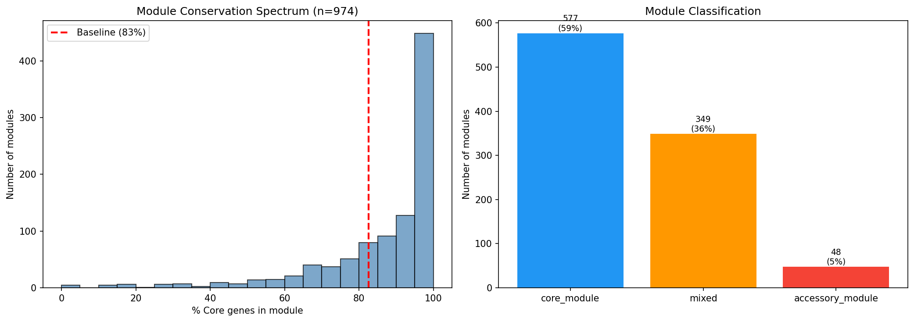
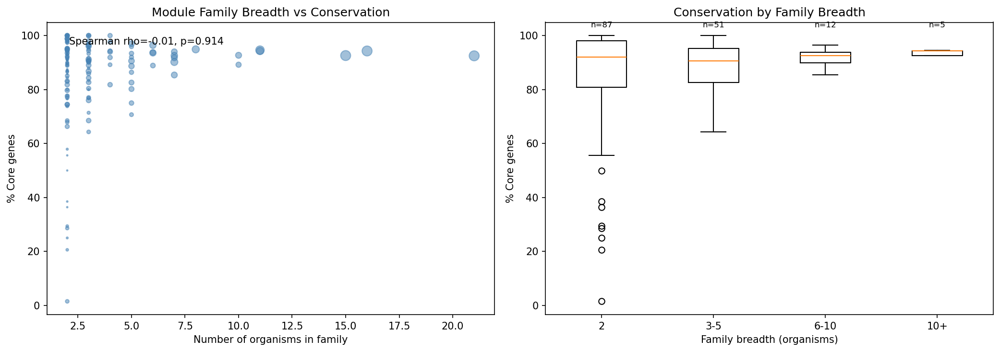

# Report: Fitness Modules x Pangenome Conservation

## Key Findings

### Module Genes Are More Core Than Average

- **Module genes: 86.0% core** vs all genes: 81.5% (+4.5 percentage points)
- Genes assigned to ICA modules are co-regulated functional units, and they skew toward the conserved core genome

*(Notebook: 01_module_conservation.ipynb)*

### Most Modules Are Core

Of 974 modules with >=3 mapped genes:
- **577 (59%) are core modules** (>90% core genes)
- 349 (36%) are mixed modules (50-90% core)
- **48 (5%) are accessory modules** (<50% core)

The median module is 93.4% core. Most co-regulated fitness response units are embedded in the conserved genome.

*(Notebook: 01_module_conservation.ipynb)*

### Family Breadth Does NOT Predict Conservation

Surprisingly, module families spanning more organisms do NOT have higher core fractions (Spearman rho=-0.01, p=0.914). Families are nearly all core regardless of how many organisms they span. The core genome baseline is so high (~82%) that there's little room for a gradient.

*(Notebook: 02_family_conservation.ipynb)*

### Accessory Module Families Exist

38 families have <50% core genes -- these are co-regulated accessory gene modules conserved across organisms. They may represent horizontally transferred functional units or niche-specific operons.

### Essential Genes Are Absent from Modules

0 essential genes appear in any module, confirming that ICA modules only capture genes with measurable fitness variation (non-essential genes with transposon insertions). Essential genes are invisible to ICA because they have no fitness data.

## Interpretation

ICA fitness modules are enriched in core genes (86% vs 81.5% baseline, OR=1.46, p=1.6e-87), confirming that co-regulated functional units preferentially reside in the conserved genome. However, the enrichment is modest due to a ceiling effect -- the baseline core rate is already very high. The surprising null result for family breadth vs conservation (rho=-0.01) suggests that conservation is a property of individual genes, not of the cross-organism scope of their regulatory module.

### Literature Context

- **Price et al. (2018)** generated the Fitness Browser data and developed the ICA decomposition approach used to identify co-regulated fitness modules. Our analysis shows these modules preferentially reside in the conserved core genome.
- **Saelens et al. (2018)** demonstrated that ICA outperforms other decomposition methods for microbial gene expression data, supporting the biological relevance of the modules analyzed here.
- **Vernikos et al. (2015)** reviewed core and accessory genome definitions in bacterial pangenomics. Our finding that 59% of fitness modules are >90% core extends the concept of "core" from individual genes to functionally coherent regulatory units.

### Limitations

- **Ceiling effect**: The baseline core rate is already ~81.5%, limiting the maximum observable enrichment. The +4.5pp difference to 86% is statistically significant but represents a modest absolute effect.
- **29/32 organism subset**: 3 module organisms (Cola, Kang, SB2B) lack pangenome links because their species had too few genomes in GTDB for pangenome construction.
- **Module membership threshold**: The upstream ICA module membership uses |Pearson r| >= 0.3 with max 50 genes per module. This threshold affects which genes are "in" a module and could influence conservation composition.
- **Classification thresholds are arbitrary**: The 90% and 50% cutoffs for core/mixed/accessory module classification are convenient but not biologically motivated.
- **Essential genes excluded**: ICA requires fitness data, so essential genes (no transposon insertions) are absent from all modules. This means modules only capture the non-essential portion of the genome.

## Data

### Sources

| Dataset | Description | Source |
|---------|-------------|--------|
| ICA fitness modules | 1,116 co-regulated modules across 32 organisms | `fitness_modules/data/modules/` |
| Module families | Cross-organism module families | `fitness_modules/data/module_families/` |
| KBase pangenome link table | Gene-to-cluster conservation mapping | `conservation_vs_fitness/data/fb_pangenome_link.tsv` |
| Essential genes | Essentiality classification | `conservation_vs_fitness/data/essential_genes.tsv` |

### Generated Data

| File | Description |
|------|-------------|
| `data/module_conservation.tsv` | Per-module conservation composition |
| `data/family_conservation.tsv` | Per-family conservation summary |

## References

- Price MN et al. (2018). "Mutant phenotypes for thousands of bacterial genes of unknown function." *Nature* 557:503-509. PMID: 29769716
- Parks DH et al. (2022). "GTDB: an ongoing census of bacterial and archaeal diversity through a phylogenetically consistent, rank normalized and complete genome-based taxonomy." *Nucleic Acids Res* 50:D199-D207. PMID: 34520557
- Saelens W et al. (2018). "A comprehensive evaluation of module detection methods for gene expression data." *Nat Commun* 9:1090. PMID: 29545622
- Vernikos G et al. (2015). "Ten years of pan-genome analyses." *Curr Opin Microbiol* 23:148-154. PMID: 25483351

## Supporting Evidence

| Type | Path | Description |
|------|------|-------------|
| Notebook | `notebooks/01_module_conservation.ipynb` | Per-module conservation profiles |
| Notebook | `notebooks/02_family_conservation.ipynb` | Family breadth vs conservation |
| Figure | `figures/module_core_distribution.png` | Module core gene distribution |
| Figure | `figures/family_breadth_vs_conservation.png` | Family breadth vs conservation |
| Data | `data/module_conservation.tsv` | Per-module conservation composition |
| Data | `data/family_conservation.tsv` | Per-family conservation summary |

## Revision History

- **v1** (2026-02): Migrated from README.md
- **v2** (2026-02): Added inline figures, notebook provenance, Data section, Literature Context, References
