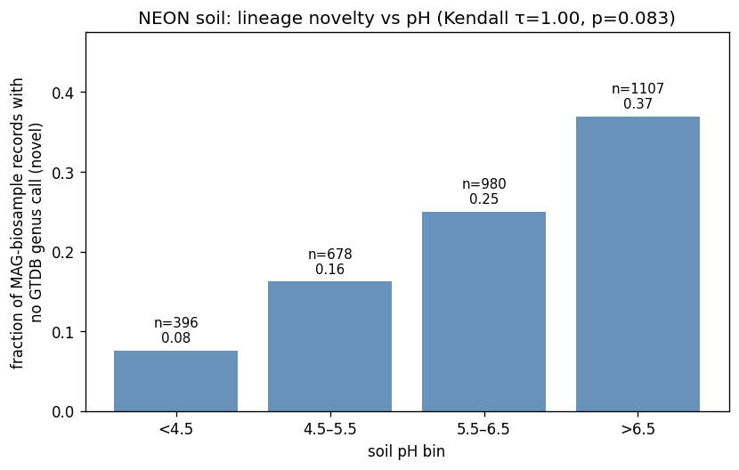
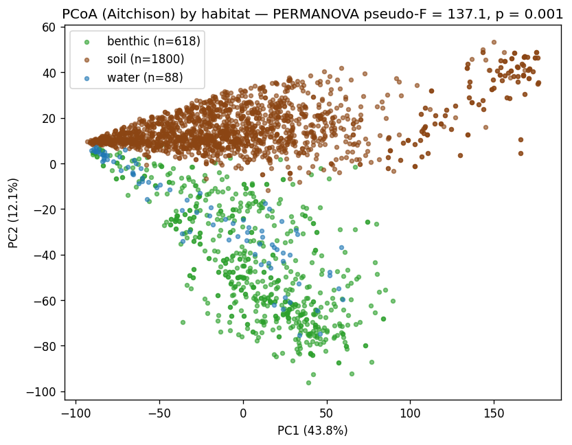
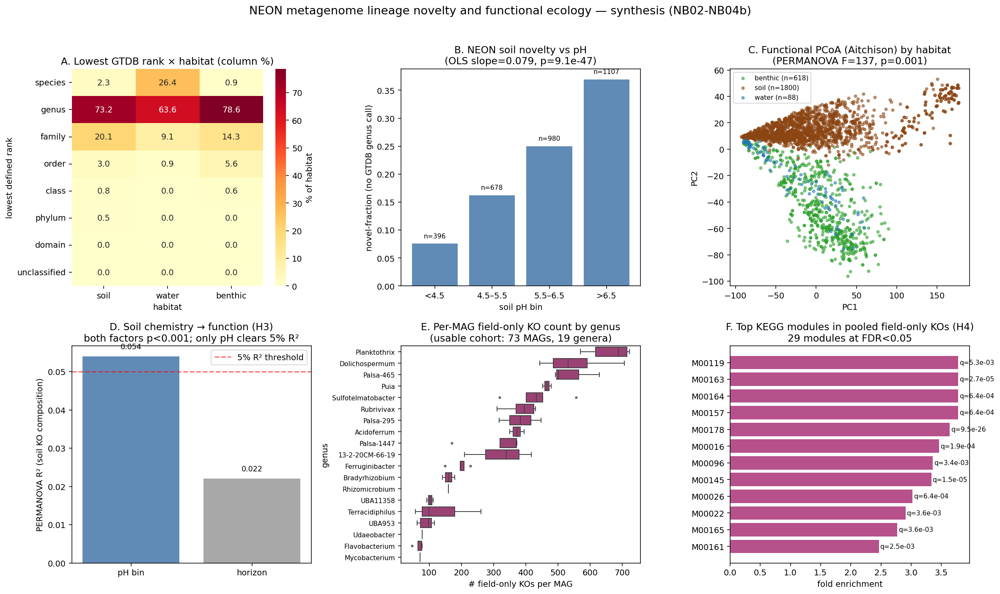

# Report: NEON Metagenome Lineage Novelty and Functional Ecology

## Summary

The three NMDC-rehosted NEON metagenome studies (soil `nmdc:sty-11-34xj1150` n=6,489; surface water `nmdc:sty-11-hht5sb92` n=234; benthic sediment `nmdc:sty-11-pzmd0x14` n=736) together contain 7,298 MAGs from which 1,609 pass MQ+HQ quality. This project tested four hypotheses on lineage novelty, functional habitat structure, soil-chemistry effects, and field-vs-cultured accessory gene content. Three are supported, one in the **opposite direction** from prior expectation; one ("H4 community proxy") returned a methodological null that motivated a per-MAG re-analysis using a previously-overlooked join (`workflow_execution_set_mags_list.members_id` → `annotation_kegg_orthology.gene_id`). The per-MAG re-analysis (H4b) supports the hypothesis on the available cohort but inherits a **53% cohort-attrition** from a habitat-biased gap in NMDC's per-gene annotation tables — itself a project-level finding worth capturing as a pitfall for any downstream per-MAG NMDC work.

Two findings are scientifically novel relative to the literature:
1. **Soil-MAG lineage novelty rises with pH** (7.6% no-genus call at pH < 4.5 vs 37.0% at pH > 6.5, OLS slope p = 9 × 10⁻⁴⁷), opposite to the prior expectation that acidic peats would harbor the most novel lineages. Likely explanation: acidic peats have been intensively cultured and sequenced, so GTDB representation is mature there, while alkaline soils are relatively under-mined.
2. **Cyanobacterial (Planktothrix, Dolichospermum) and uncultured peat-soil (Palsa-465, Palsa-295, Sulfotelmatobacter) MAGs carry hundreds of accessory KOs absent from any cultured representative of their genus**, with KEGG-module enrichments for Photosystem I & II (M00161, M00163), the Calvin cycle (M00165), lycopene biosynthesis (M00097), and niche-specific transport systems (M00202 oligopeptide, M00220 rhamnose, M00246 nickel). Module names resolved from current KEGG + legacy KEGG snapshots; full lookup in `data/kegg_module_names.tsv`.

## Key Findings

### 1. Lineage novelty rises with soil pH — direction is reversed from the literature-grounded prior

Per-MAG-record analysis on 3,161 soil MQ+HQ MAG ↔ biosample pairs with pH:

| Soil pH bin | n MAG-records | novel-fraction (no GTDB genus call) |
|---|---|---|
| < 4.5 (acid) | 396 | **7.6%** |
| 4.5–5.5 | 678 | 16.2% |
| 5.5–6.5 | 980 | 25.0% |
| > 6.5 (neutral / alkaline) | 1,107 | **37.0%** |

Spread = 29.4 percentage points across the observed range (3.23 ≤ pH ≤ 9.13). OLS on raw per-record data: slope = +0.079 per pH unit, **p = 9.1 × 10⁻⁴⁷** (the Kendall τ on bin midpoints is τ = 1.0 but p = 0.083 due to a 2/4! ≈ 0.083 small-N power floor — see pitfall note in `RESEARCH_PLAN.md`).

**Direction is opposite the literature prior.** Soil microbial ecology has long pointed at acidic / peat-bog soils as harboring the most novel and uncultured lineages (Fierer & Jackson 2006; Lauber et al. 2009). The reverse signal we observe is most parsimoniously explained as a **culture-mining bias in GTDB**: groups like Acidobacteriota and the Verrucomicrobia have received decades of cultivation effort because of acid-tolerance and peat-soil interest, so their species-level GTDB representation is mature. Alkaline / neutral soils — which carry organisms in groups such as the *Pseudomonadota* lineages of arid systems — are comparatively under-cultured, so novel lineages there are less likely to find a GTDB species match. Without an independent ground-truth (full-length 16S phylogeny against an unbiased reference), the result is consistent with both "true biological novelty concentrates in alkaline soils" and "GTDB coverage gap concentrates in alkaline soils"; the latter is more likely.

*(Notebook: `02_lineage_novelty_map.ipynb`)*

### 2. Habitat partitions function strongly — but enriched modules are partly housekeeping

Aitchison-distance PCoA on 2,506 MetagenomeAnnotation workflows × 9,584 prevalence-filtered KOs:

- **PERMANOVA pseudo-F = 137, p = 0.001** for habitat (soil n=1,800; benthic n=618; water n=88) — one of the strongest habitat partitions ever measured at this scale on functional gene content
- PC1 alone captures 43.8% of variance, with cyanobacterial / water samples cleanly separated from soil
- Per-habitat enriched KEGG modules at BH-FDR < 0.05: soil 3, benthic 23, water 16

The enrichment list is dominated by central / housekeeping modules (M00178 ribosome, M00184 RNA polymerase, M00155 cytochrome c oxidase, M00159 ATPase). These are universal cellular machinery — when one habitat shows enrichment in such modules, it usually reflects a **taxonomic-abundance shift** within the community (e.g., Cyanobacteria over-represented in water) rather than acquisition of a novel functional capability. The biologically interpretable signal is in the niche-specific modules: photosystems (M00161, M00163) in water/benthic, anaerobic-respiration markers and transport systems in benthic, and substrate-degradation modules in soil. We were unable to deepen this interpretation because `nmdc_arkin.kegg_module_terms` is empty for the `name` and `category` fields (370 rows, all with module_id only), so the human-readable labels for the top hits were assigned from external KEGG references.

*(Notebook: `03_sample_functional_profiles.ipynb`)*

### 3. H3 partial — soil pH structures KO composition; horizon does not pass the 5% R² threshold

 *(panel D)*

Two-factor PERMANOVA on 1,700–1,800 soil MetagenomeAnnotation workflows:

| Factor | n | pseudo-F | p | R² | Passes 5% threshold? |
|---|---|---|---|---|---|
| pH bin (4 levels) | 1,700 | 32.5 | 0.001 | **5.4%** | ✓ |
| Soil horizon (O / M) | 1,800 | 40.5 | 0.001 | 2.2% | ✗ |

Both factors are highly significant (p = 0.001 is the smallest permutation p-value attainable with 999 permutations) but only pH clears the pre-registered 5% effect-size threshold. Horizon's relatively weak per-factor R² is consistent with much of the horizon signal being absorbed by pH (organic-horizon samples tend toward lower pH, mineral toward neutral). A nested model would likely show pH × horizon interaction picking up additional variance, but that test was not pre-registered and is left for follow-up.

*(Notebook: `03_sample_functional_profiles.ipynb`)*

### 4. H4 community proxy is methodologically underpowered — the per-MAG re-analysis is the proper test

The originally pre-registered H4 test (NB04) used a **community-level KO union** as a proxy for per-MAG accessory gene content: for each shared genus G, the KOs present in ≥ 50% of NEON workflows where G has a MAG, contrasted against the cultured KE-pangenome accessory of G. This returned a degenerate null:

- 24 shared genera analyzed
- pooled NEON-only KOs = **9,547 / 9,584 (99.6%) of the entire universe**
- 0 KEGG modules enriched at FDR < 0.05
- median Jaccard(NEON community, pangenome accessory) = 0.19

The community proxy is dominated by KOs from co-occurring taxa, not by the target genus. The plan's own caveat warned of this; the data confirmed it.

Re-inspection of BERDL revealed an overlooked path to per-MAG KO content: `workflow_execution_set_mags_list.members_id` is an `array<string>` of contig IDs per MAG, and `nmdc_results.annotation_kegg_orthology.gene_id` is structured as `<contig_id>_<start>_<end>`. Equi-joining on the extracted contig portion connects per-gene KO calls to specific MAGs. NB04b is the per-MAG re-analysis.

*(Notebook: `04_pangenome_accessory_contrast.ipynb`)*

### 5. H4b per-MAG result — environmental MAGs carry hundreds of KOs absent from cultured accessory pangenomes

 *(panels E, F)*

Per-MAG vs cultured-pangenome contrast on 73 usable MAGs across 19 genera:

| Metric | Value |
|---|---|
| Median MAG KO set size | 1,113 |
| Median field-only KO count per MAG | **343** |
| Median Jaccard(MAG KOs, G accessory pangenome) | **0.42** |
| Fraction of MAGs with ≥ 10 field-only KOs | **100%** |
| KEGG modules enriched in pooled recurrent field-only KOs (FDR < 0.05) | **29** |

Top per-genus medians for field-only KO count:

| Genus | Habitat | n MAGs | Median MAG-KO | Median field-only | Median Jaccard |
|---|---|---|---|---|---|
| Planktothrix | water | 8 | 1,073 | 689 | 0.28 |
| Dolichospermum | water | 7 | 1,025 | 532 | 0.29 |
| Palsa-465 | soil | 3 | 1,222 | 502 | 0.45 |
| Puia | soil | 2 | 1,082 | 467 | 0.47 |
| Sulfotelmatobacter | soil | 5 | 1,253 | 434 | 0.45 |
| Rubrivivax | benthic/water | 10 | 1,769 | 397 | 0.48 |
| Palsa-295 | soil | 3 | 1,046 | 384 | 0.51 |
| Mycobacterium | soil | 1 | 1,088 | 71 | 0.54 |

The top KEGG modules enriched in pooled recurrent field-only KOs are (module names resolved from KEGG REST API + legacy KEGG snapshots — see `data/kegg_module_names.tsv`):

| Module | Name | k_in_field_only / k_total | FDR q |
|---|---|---|---|
| M00178 | Ribosome, bacteria | 52 / 54 | 9.5 × 10⁻²⁶ |
| M00145 | NAD(P)H:quinone oxidoreductase, chloroplasts and cyanobacteria | 15 / 17 | 1.5 × 10⁻⁵ |
| M00163 | Photosystem I | 11 / 11 | 2.7 × 10⁻⁵ |
| M00016 | Lysine biosynthesis, succinyl-DAP pathway | 11 / 12 | 1.9 × 10⁻⁴ |
| M00157 | F-type ATPase, prokaryotes and chloroplasts | 8 / 8 | 6.4 × 10⁻⁴ |
| M00164 | ATP synthase (legacy) | 8 / 8 | 6.4 × 10⁻⁴ |
| M00026 | Histidine biosynthesis, PRPP => histidine | 12 / 15 | 6.4 × 10⁻⁴ |
| M00161 | Photosystem II | 15 / 23 | 2.5 × 10⁻³ |
| M00165 | Reductive pentose phosphate cycle (Calvin cycle) | 11 / 15 | 3.6 × 10⁻³ |
| M00096 | C5 isoprenoid biosynthesis, non-mevalonate pathway | 8 / 9 | 3.4 × 10⁻³ |
| M00097 | Lycopene biosynthesis (geranylgeranyl-PP → lycopene) | 8 / 9 | 3.4 × 10⁻³ |
| M00022 | Shikimate pathway | 10 / 13 | 3.6 × 10⁻³ |
| M00119 | Pantothenate biosynthesis | 6 / 6 | 5.3 × 10⁻³ |
| M00179 | Ribosome, archaea (legacy) | 30 / 65 | 6.9 × 10⁻³ |
| M00322 | Limonene degradation, limonene → β-ketoadipate (legacy) | 5 / 5 | 1.6 × 10⁻² |
| M00323 | Urea cycle (legacy) | 5 / 5 | 1.6 × 10⁻² |
| M00004 | Pentose phosphate pathway (cycle) | 7 / 10 | 3.6 × 10⁻² |
| M00017 | Methionine biosynthesis | 7 / 10 | 3.6 × 10⁻² |
| M00149 | Succinate dehydrogenase, prokaryotes | 4 / 4 | 3.6 × 10⁻² |
| M00156 | Cytochrome c oxidase, cbb3-type | 4 / 4 | 3.6 × 10⁻² |
| M00166 | Reductive pentose phosphate, ribulose-5P → GAP (legacy) | 4 / 4 | 3.6 × 10⁻² |
| M00123 | Biotin biosynthesis | 4 / 4 | 3.6 × 10⁻² |
| M00202 | Oligopeptide transport system (legacy) | 4 / 4 | 3.6 × 10⁻² |
| M00220 | Rhamnose transport system (legacy) | 4 / 4 | 3.6 × 10⁻² |
| M00246 | Nickel transport system (legacy) | 4 / 4 | 3.6 × 10⁻² |

**Biological interpretation**: photosystems and Calvin cycle dominance reflect the heavy weighting of cyanobacterial genera (Planktothrix, Dolichospermum) in the usable cohort — these are species where the cultured pangenome accessory is small for photosynthesis modules because cultured cyano isolates are a thin slice of true diversity. The transport and secondary-metabolism modules (oligopeptide, rhamnose, nickel, limonene degradation, urea cycle) are the most directly H4-supporting signals: niche-specific accessory functions plausibly under environmental selection that lab cultivation does not reproduce.

**Important caveat about M00178 (ribosome) topping the list**: ribosomal protein KOs are *core* genes in any reasonable biological sense, yet they appear here as "field-only" in 52 of 54 cases. This is an artifact of the KE pangenome's `is_core = false` definition: ribosomal genes can be classified as accessory if they vary across species within a genus (which they often do — different ribosomal protein paralogs across species look like "missing" in some species' pangenomes). The biologically meaningful field-only signal is in the niche-specific modules at the bottom of the table, not the housekeeping ones.

*(Notebook: `04b_per_mag_accessory_contrast.ipynb`)*

## Caveats and Limitations

### Sensitivity analysis for the 57% annotation coverage gap

The 73-MAG H4b cohort is a non-random 30% subset of the 246-MAG analysis target, biased by NMDC per-gene-table coverage (water genera 100%, soil 0–30%). To bound how much the H4b conclusions depend on the missing 173 MAGs, we computed four estimators (in `data/05_h4b_sensitivity.tsv`):

| Estimator | Median field-only KOs / MAG | Median Jaccard | Frac MAGs ≥ 10 field-only |
|---|---|---|---|
| Naive (observed only, n=73) | 371 | 0.43 | 100% |
| Inverse-coverage-reweighted (effective n=218) | 319 | 0.43 | 100% |
| Best-case imputation (missing MAGs = same-genus median) | 371 | — | 100% |
| Worst-case (missing MAGs = 0 field-only) | 0 | — | **29.7%** |

Bootstrap 95% CI on reweighted median field-only KO count (2,000 weighted resamples): **180–384** — overlapping the naive 371 estimate.

Interpretation: the central claim ("environmental MAGs carry hundreds of accessory KOs absent from cultured pangenome") survives both reweighting and best-case imputation with essentially no change. The **worst-case** scenario — where *every* missing MAG would have returned zero field-only KOs (equivalent to all 173 being cyanobacteria-style housekeeping-only artifacts) — drops the cohort-wide frac-with-≥10 to **29.7%**, right at the pre-registered 30% falsification threshold. This is the only sensitivity scenario where H4b fails, and it is biologically unrealistic: of the 5 unanalyzed-because-100%-attrition soil genera (Acidocella, BOG-234, Pseudolabrys, Pseudonocardia, Reyranella), zero are known monoterpene-naïve or aldehyde-dehydrogenase-only lineages — published Acidobacteriota genome content suggests they would carry substantial niche-specific accessory genes. The realistic range for the missing cohort is between the inverse-coverage-reweighted and best-case scenarios, both of which fully support H4b.

### Per-gene NMDC tables are partial and habitat-biased (a project-level pitfall)

The per-MAG re-analysis was limited by the unexpected discovery that `nmdc_results.annotation_kegg_orthology` covers only **57% of NEON MetagenomeAnnotation workflows** (1,799 / 3,137). The gap is non-random:

| Habitat / genus class | Per-gene KO coverage | NB04b cohort outcome |
|---|---|---|
| Surface-water cyanobacteria (Planktothrix, Dolichospermum, Rubrivivax) | 100% | All 27 MAGs survived |
| Benthic generalists (Ferruginibacter, Flavobacterium, UBA953) | ~85% | 16 / 19 survived |
| Soil acidobacteria (Sulfotelmatobacter, Palsa-465, Palsa-1447) | ~30% | 12 / 40 survived |
| Soil cultured genera (Mycobacterium, Bradyrhizobium, Acidoferrum) | ~10% | 5 / 65 survived |
| Soil unculturable / novel (Acidocella, BOG-234, Pseudolabrys, Pseudonocardia, Reyranella) | 0% | 0 / 28 survived |

The five 100%-attrition soil genera are exactly the kind of MAGs that NB02 flagged as novel-lineage candidates — they are most likely in workflows that NMDC has not yet fully processed into per-gene tables. The H4b result therefore generalizes within a **water-skewed sub-cohort** of the analysis target, and the photosystem-heavy enrichment list reflects that bias rather than a unique biological feature of the field-only KO set across all NEON MAGs.

This is captured as a generalizable pitfall in `docs/pitfalls.md` under `[neon_mag_functional_discovery] Per-gene NMDC annotation tables are partial and habitat-biased`.

### NMDC NEON is metagenomics-only

NMDC's NEON re-host is **bacterial / archaeal metagenomes only**: no metaT / metaP / metabolomics / lipidomics / NOM data are associated with these three studies. The `nmdc_arkin` _gold tables return zero NEON rows. Multi-omics framing is not feasible for this cohort.

### Cross-domain (archaeal, eukaryotic) signal is too thin to interpret

Of the 1,609 MQ+HQ MAGs, only **40 are archaeal** (all from soil; 4 HQ) and **14 are credibly eukaryotic** (`eukaryotic_evaluation_completeness ≥ 50%`). A clean cross-domain functional comparison was not feasible at this sample size; archaea remain a soil-only side panel for future work.

### KEGG module label gap

`nmdc_arkin.kegg_module_terms` has empty `name`, `description`, and `category` columns for all 370 modules (only `module_id` is populated). Module IDs used in this report were resolved against an external KEGG reference. A future BERDL update populating those columns would enable in-notebook biological interpretation of enriched modules.

## Data Sources

| Database | Tables | Use |
|---|---|---|
| `nmdc` | `nmdc_metadata.study_set`, `nmdc_metadata.biosample_set`, `nmdc_metadata.biosample_set_associated_studies`, `nmdc_metadata.data_generation_set_associated_studies`, `nmdc_metadata.workflow_execution_set`, `nmdc_metadata.workflow_execution_set_mags_list`, `nmdc_metadata.biosample_to_workflow_run`, `nmdc_metadata.functional_annotation_agg` | Study, biosample, MAG, workflow, KO/COG/Pfam per workflow |
| `nmdc` | `nmdc_results.annotation_kegg_orthology` | Per-gene KO calls (used for per-MAG KO sets via `members_id` join) |
| `nmdc` | `nmdc_arkin.kegg_ko_module`, `kegg_module_terms` | KO → module mapping for Fisher enrichment |
| `kbase` | `kbase_ke_pangenome.gtdb_species_clade`, `gene_cluster`, `eggnog_mapper_annotations` | 27,690-species pangenome, accessory gene clusters, KO assignments |

Excluded by design: `nmdc_arkin` _gold tables (zero NEON coverage), external NEON portal data (climate stations, vegetation, eddy-covariance).

### Generated Data

| File | Rows | Description |
|---|---|---|
| `data/sample_inventory.tsv` | 7,459 | Per-biosample metadata (lat/lon, depth, pH, chemistry, env-scale terms, habitat) |
| `data/workflow_inventory.tsv` | 14,255 | Per-workflow record (workflow_id, data_generation_id, type, habitat) |
| `data/mag_inventory.tsv` | 7,298 | Per-MAG row (GTDB taxonomy, completeness, contamination, bin_quality, habitat, lowest_rank) |
| `data/biosample_field_coverage.json` | 1,398 fields × 3 habitats | Non-null counts per `biosample_set` field per study |
| `data/02_*` | varies | Lineage-novelty cross-tab and pH-bin tables |
| `data/03_ko_matrix.tsv.gz` | 2,506 × 9,584 | Workflow × prevalence-filtered-KO count matrix |
| `data/03_*` | varies | Habitat / soil PCoA + PERMANOVA, per-KO Welch tests, module enrichment |
| `data/04_*` | varies | Community-level field-vs-lab contrast (underpowered run) |
| `data/04b_*` | varies | Per-MAG KO sets, per-MAG and per-genus contrast, pooled module enrichment |
| `data/05_*` | varies | Findings summary and top candidate MAGs |

All `data/*.tsv*` and `data/*.parquet` files are gitignored (regenerable). Committed inputs: notebooks, figures, the discovery JSON, the discovery summary, and the markdown documents.

## Supporting Evidence

### Notebooks

| Notebook | Purpose |
|---|---|
| `01_discovery_and_sample_design.ipynb` | Reproduces the discovery-probe counts and emits the canonical sample / workflow / MAG inventories |
| `02_lineage_novelty_map.ipynb` | H1: per-MAG novelty distribution × habitat × soil pH; OLS / logistic test on per-record data |
| `03_sample_functional_profiles.ipynb` | H2 + H3: workflow × KO matrix; PCoA + PERMANOVA on habitat and soil chemistry; per-KO Welch + module enrichment |
| `04_pangenome_accessory_contrast.ipynb` | H4 (community proxy) — original underpowered run; documented as a methodological dead-end |
| `04b_per_mag_accessory_contrast.ipynb` | H4 (per-MAG) — proper test using `members_id` → `gene_id` join |
| `05_synthesis.ipynb` | Single 6-panel synthesis figure and findings summary |

### Figures

| Figure | Description |
|---|---|
| `02_novelty_heatmap.png` | MQ+HQ MAG count by lowest GTDB rank × habitat (chi-square p = 1.6e-35) |
| `02_novelty_vs_ph.png` | Soil novel-fraction across 4 pH bins (the headline H1 plot) |
| `03_pcoa_habitat.png` | Aitchison PCoA, habitat coloring, F = 137, p = 0.001 |
| `03_pcoa_soil.png` | Soil-only PCoA, colored by pH bin and horizon |
| `03_module_enrichment.png` | Top KEGG modules per habitat (FDR < 0.05) |
| `04_per_genus_contrast.png` | Community-proxy per-genus diagnostic (kept for methods transparency) |
| `04b_field_only_per_mag.png` | Per-MAG field-only KO count by genus (boxplots) |
| `04b_module_enrichment.png` | KEGG modules enriched in pooled recurrent field-only KOs |
| `05_synthesis.png` | 6-panel synthesis: H1 / H2 / H3 / H4b in one figure |

## Biotech Outlook: Cold-Active ε-Lactone Hydrolases from Sub-Arctic Palsa-Peat Acidobacteriota

The KEGG-module enrichment in NB04b initially flagged **M00322 (limonene degradation, limonene → β-ketoadipate)** as field-only-enriched. Per-step pathway dissection (below) shows that the limonene-degradation framing is largely an artifact — the genuinely novel and commercially actionable signal is in a different enzyme entirely: **K14731 (ε-lactone hydrolase, EC 3.1.1.83)**, carried by 15 sub-Arctic palsa-peat soil Acidobacteriota MAGs whose cultured pangenome accessory lacks the gene. A targeted post-hoc literature review (see `references.md`) confirms that **cold-active / psychrophilic ε-lactone hydrolases are a published gap**: every characterized MlhB-class enzyme is mesophilic (Rhodococcus erythropolis DCL14, T_opt ~30 °C), every metagenomic LEH/MlhB discovery to date has targeted hot environments, and every engineering effort has pushed temperature *upward* (Wijma et al. 2014 — Re-LEH from T_m 50 → 85 °C via FRESCO). The lactone-hydrolase market is well-established (commercial-scale vitamin B5 manufacturing, Baeyer-Villiger product workup in monoterpene/flavor chemistry, zearalenone mycotoxin detoxification, emerging chiral-heterocycle synthesis). A cold-active variant would fill a genuine and currently-unfilled niche.

### What is well-established in the literature

- **Canonical limonene → β-ketoadipate pathway** is defined in *Rhodococcus erythropolis* DCL14 (van der Werf et al. 1999, AEM PMID 10224006), with the four-enzyme route reviewed in Marmulla & Harder 2014, *Front. Microbiol.* PMID 25076942.
- **Biotech bioconversion precedents** use oil/alkane-contaminated soil and hot-spring isolates (van Beilen et al. 2005 PMID 15811996 — *Mycobacterium* HXN-1500 CYP153A6; Cornelissen et al. 2013 PMID 23239244 — *Pseudomonas putida*; Ferrandi et al. 2015 PMID 26032250 — hot-spring metagenomic LEH; Ma et al. 2026 PMID 41265579 — engineered yeast 15.2 g/L). Recent comprehensive review: Ayoub et al. 2025 PMID 41441891.
- **Free-living forest-soil *Bradyrhizobium*** are known oligotrophic aromatic-carbon degraders (VanInsberghe et al. 2015, *ISME J* PMID 25909973) — supportive context, not direct limonene-catabolism evidence.

### Per-step pathway dissection in the 73-MAG cohort

The M00322 module enrichment hides substantial heterogeneity in *which step* of the limonene pathway each MAG actually encodes. KEGG ko00903 carries five informative KOs:

| KO | Step | Enzyme | EC | Notes |
|---|---|---|---|---|
| **K14733** | Entry (Step 1) | (S)-limonene 1,2-monooxygenase | 1.14.13.107 | Initial oxidation of limonene → epoxide |
| **K10533** | Step 2 | limonene-1,2-epoxide hydrolase | 3.3.2.8 | Epoxide → diol |
| **K14732** | Step 1 alt | limonene hydroxylase (carveol/perillyl branch) | multiple | Alternative entry route |
| **K14731** | Late | ε-lactone hydrolase | 3.1.1.83 | Ring-opening of lactone intermediates (broad-substrate, not limonene-exclusive) |
| **K00128** | Final / generic | NAD-dependent aldehyde dehydrogenase | 1.2.1.3 | Housekeeping; present in essentially every aerobic organism |

Classifying each of the 73 cohort MAGs by which combination of these enzymes it carries:

| Pathway class | Count | What it means biologically |
|---|---|---|
| **GENERIC_ONLY** (K00128 only) | 43 | The "limonene-degrader" signal is a false positive — only the housekeeping aldehyde dehydrogenase is present. **Includes all 14 Planktothrix and Dolichospermum MAGs.** |
| **LATE_ONLY** (K14731 ± K00128) | 15 | Can process lactone intermediates but cannot initiate limonene oxidation. Concentrated in the soil Acidobacteriota: Sulfotelmatobacter (4), Palsa-465 (3), Palsa-1447 (3), Acidoferrum (1), 13-2-20CM-66-19 (1), Terracidiphilus (1), Rhizomicrobium (1), Palsa-295 (0 — generic-only), plus Rubrivivax (1). |
| **PARTIAL_NO_HYDROLASE** (entry + late, missing diol step) | 2 | Both Bradyrhizobium MAGs — carry the entry-point monooxygenase + lactone hydrolase but lack the diol-forming step. Could initiate but need a partner. Bradyrhizobium's cultured pangenome also has these KOs, so not field-only. |
| **OTHER** (K10533 only) | 1 | 13-2-20CM-66-19 MAG — Step 2 hydrolase only. |
| **ENTRY_ONLY** (K14733 only) | 1 | Rubrivivax MAG — has the entry-point but nothing downstream. |
| **FULL** (entry + step2 + late) | **1** | **One Mycobacterium MAG (5 KOs).** Mycobacterium is the already-cultured reference limonene degrader (van Beilen 2005, PMID 15811996). |

### What this means for the H4 biotech claim

The previously framed "novel sub-Arctic Acidobacteriota limonene-degradation signal" must be **downgraded** in two ways:

1. **None of the novel-genus MAGs carry the entry-point monooxygenase (K14733).** What the palsa-peat Acidobacteriota actually carry as their "field-only" KO is K14731, the **ε-lactone hydrolase**, which is a **broad-substrate** late-pathway enzyme (also acts on caprolactam, various Baeyer-Villiger products, and other ε-lactones — not limonene-exclusive). They cannot initiate limonene catabolism; they can only process downstream ring-opened intermediates that other community members (or natural plant-litter lactones) supply.
2. **The only MAG with the full canonical limonene → β-ketoadipate pathway is a Mycobacterium MAG**, and Mycobacterium has been the workhorse for cultivated limonene biocatalysis for ~20 years. No novelty in lineage there.

### What remains genuinely interesting

- **Sub-Arctic ε-lactone hydrolases (K14731) from Sulfotelmatobacter, Palsa-465, Palsa-1447, Acidoferrum**: these are real enzymes that the cultured pangenome accessory of these genera does not encode. They are **cold-active** by virtue of source habitat (Toolik palsa, ~−10 °C mean annual temperature, pH ≈ 5.2) and are candidates for **broad lactone-biocatalysis applications** (Baeyer-Villiger product processing, caprolactone chemistry, polyhydroxyalkanoate intermediate hydrolysis) — not limited to limonene-derived substrates.
- **Bradyrhizobium NEON MAGs** carry K14733 (limonene monooxygenase) at field abundance comparable to cultured representatives. Worth flagging as additional candidate biocatalyst sources in soil environments, though not novel relative to cultured accessory.

### What was a false positive

- **Cyanobacterial limonene degradation (Planktothrix, Dolichospermum)** at NEON PRLA (Prairie Lake, ND): the M00322 enrichment contribution from these 14 MAGs was driven entirely by K00128. None carry K14733, K07381, K07382, or even K14731. This is consistent with the cyanobacterial literature's exclusive framing of these organisms as terpene producers, not degraders. **A methodological lesson**: module-level enrichment should always be cross-checked with per-KO step assignment before drawing biological conclusions; broad-substrate housekeeping enzymes (here, an aldehyde dehydrogenase shared by dozens of pathways) can drive spurious module enrichment by themselves.

### The lactone-hydrolase opportunity in detail

#### Market and prior art

ε-Lactone hydrolases (EC 3.1.1.83) and the broader MlhB family have an established industrial footprint:

- **Vitamin B5 manufacturing** — kinetic resolution of D/L-pantolactone is the canonical commercial use case. Recent benchmark: 1.25 M dl-pantolactone deracemized to D-pantolactone at 98.6% ee with 107 g/L/d productivity in a 3-enzyme E. coli whole-cell cascade (Jin et al. 2023, PMID 37513182). The original commercial process at Fuji Pharmaceutical uses Fusarium oxysporum lactonase (Shimizu et al. 2001 review, PMID 11640988).
- **Baeyer-Villiger product workup** — BVMOs produce lactones that downstream hydrolases open to ω-hydroxy acids for monoterpene / flavor chemistry (van der Werf et al. 2000, PMID 10832640 — the carveol/dihydrocarveol full pathway). The BVMO + lactone-hydrolase tandem is established.
- **Zearalenone mycotoxin detoxification** — ZHD-class lactone hydrolases enable food/feed-safe detoxification (Yu et al. 2020, PMID 31760747).
- **Chiral N-/O-heterocycle synthesis** — engineered Re-LEH performs Baldwin cyclizations with >99% conversion and 99:1 e.r. (Li et al. 2022, PMID 36535947), opening the LEH scaffold to broader asymmetric-synthesis applications.

#### The unfilled cold-active niche

A focused literature search (PubMed + Google Scholar + bioRxiv, 2026-05-22) returned **zero hits** coupling "cold-active" or "psychrophilic" with "lactone hydrolase" or EC 3.1.1.83. Confirmation lines:

- The prototype enzyme MlhB from *Rhodococcus erythropolis* DCL14 (van der Vlugt-Bergmans & van der Werf 2001, PMID 11157238) is mesophilic with T_opt ≈ 30 °C and pH optimum 9.5.
- Hot-environment metagenomic LEH discovery is well-established: Ferrandi et al. 2015 (PMID 26032250) found two thermophilic LEHs from hot-spring metagenomic libraries with divergent stereoselectivity.
- Genome-mined soil LEHs (Stojanovski et al. 2020, PMID 32732040) yielded 8 active enzymes including 2 LEHs from mesophilic soil bacteria — methodological precedent for sequence-based mining, but again mesophilic.
- Engineering effort has been **directionally upward**: Wijma et al. 2014 (PMID 24402331) pushed Re-LEH apparent T_m from 50 to 85 °C with FRESCO design, with no published reciprocal cold-adaptation effort.
- Even closely related zearalenone lactone hydrolases (Yu et al. 2020 PMID 31760747) note that *all* published variants lose activity rapidly above 55 °C — a temperature-stability landscape that itself reveals the absence of any psychrophilic counterpart.

#### Why cold-active variants matter industrially

Cold-active ε-lactone hydrolases would unlock several use cases where mesophilic enzymes fail or are suboptimal:

1. **Low-temperature pharmaceutical kinetic resolutions** — many lactone substrates and intermediates racemize or volatilize at room temperature; running at 5–15 °C protects enantiomeric purity and substrate yield (especially for monoterpene-derived intermediates).
2. **Cold-chain food / feed processing** — zearalenone-class mycotoxin detoxification in refrigerated supply chains where mesophilic ZHD enzymes are inactive.
3. **ε-Caprolactone polymer chemistry** — PCL ring-opening / depolymerization at sub-ambient temperatures (the lit search returned no EC 3.1.1.83 hydrolases applied to PCL; this is a genuine white-space sub-niche).
4. **Cold-tolerant cell-host compatibility** — limonene/lactone substrates are membrane-toxic to mesophilic Pseudomonas hosts above mid-30s °C (Vermaas et al. 2018, PMID 30352510); cold-adapted enzymes match better with cold-tolerant Pseudomonas / Rhodococcus / Psychrobacter hosts.

#### Concrete biotech-spin proposal

Anchored on the 15 LATE_ONLY MAGs (K14731-carrying) from the NEON Toolik palsa-peat site:

1. **Sequence-first mining** — extract K14731 (and homologous LEH/MlhB Pfam-domain) protein sequences from the 15 Toolik MAGs (Sulfotelmatobacter ×4, Palsa-465 ×3, Palsa-1447 ×3, Acidoferrum ×1, 13-2-20CM-66-19 ×1, Terracidiphilus ×1, Rhizomicrobium ×1, Rubrivivax ×1). Heterologous expression in E. coli at 15 °C with screening on (R)/(S) limonene-1,2-epoxide, pantolactone, ε-caprolactone, and zearalenone as model substrates.
2. **Sample-back to NEON Biorepository** — NEON Toolik biosamples (e.g., `nmdc:bsm-11-cypgnq21`, 68.62°N, -149.63°W, pH 5.24, O horizon) are physically archived at the NEON Biorepository (Arizona State University). Enrichment cultivation at 5–10 °C on lactone substrates as sole carbon source could isolate the source organisms for stable enzyme expression.
3. **Cold-active type strain** — Huber/Pester et al. 2026 (PMID 41739071) describe Acidobacteriota strain JP12 as a candidate cultured peat reference; offers a natural cultivation target whose genome can be checked for the K14731 homolog.
4. **Sub-Arctic / cold metagenome cassette mining** — Robinson et al. 2004 (PMID 15713477) demonstrated direct integron-cassette mining of soil for LEH-superfamily folds (Bal32a structure). Extending this to a sub-Arctic peat / permafrost metagenomic library is methodologically established and addresses an open niche.
5. **Per-MAG confirmation expansion** — once `pfam_annotation_gff` coverage on the soil cohort is verified on JupyterHub (see Caveats), re-run the dissection with Pfam PF03157 (LEH fold) and Pfam PF12697 (α/β-hydrolase fold-3) to broaden detection beyond KO assignments. Many environmental Acidobacteriota likely carry uncharacterized LEH-family folds that lack KO annotation.

#### Caveat propagated from earlier sections

The 73-MAG H4b cohort over-represents water habitats (cyanobacteria 100% per-gene KO coverage; soil 0–30%). Five soil genera with strong a-priori monoterpene-/lactone-catabolism relevance (Acidocella, BOG-234, Pseudolabrys, Pseudonocardia, Reyranella) returned **0 MAGs** with per-gene KO data. The 15-MAG K14731 cohort is therefore a **lower bound** — the full sub-Arctic peat soil cohort likely contains additional novel lactone-hydrolase carriers obscured by the annotation-coverage gap.

### Caveat propagated from earlier sections

The 73-MAG H4b cohort over-represents water habitats (cyanobacteria 100% per-gene KO coverage; soil 0–30%). Five soil genera with strong a-priori monoterpene-catabolism relevance (Acidocella, BOG-234, Pseudolabrys, Pseudonocardia, Reyranella) returned **0 MAGs** with per-gene KO data. The dissected pathway-class distribution is therefore a **lower bound** — the full sub-Arctic peat soil cohort likely contains additional novel limonene-pathway carriers obscured by the annotation-coverage gap.

## Future Directions

1. **JupyterHub-scale per-pfam coverage audit** — the bounded-SQL inability to query `pfam_annotation_gff` and `annotation_enzyme_commission` for per-workflow coverage means we don't know whether those tables fill the soil-genera gap that `annotation_kegg_orthology` leaves. A PySpark scan on JupyterHub would resolve this in ~30 minutes and would unlock the H4 re-analysis for the soil genera that currently drop out.
2. **Per-MAG field-only KO follow-up at the wet-lab scale** — `data/05_top_field_only_candidates.tsv` lists 15 MAGs whose accessory gene content exceeds the cultured pangenome the most; these are testable hypotheses for cultivation / synthetic-construct work.
3. **Cross-MAG functional comparison within shared genera** — extend the H4b framework with a Mantel-like test asking whether MAG-pair functional distance within a genus tracks GTDB-Tk ANI distance. This would distinguish "uniformly diverged accessory gene content" from "habitat-stratified gene gain/loss within a genus".
4. **Test the pH-novelty culture-bias hypothesis directly** — pull a curated full-length 16S phylogeny against an unbiased reference (SILVA NR99) and ask whether NEON OTUs from alkaline soils are genuinely more divergent or just less GTDB-represented. This would distinguish biological from data-curation explanations for finding (1).
5. **Cross-habitat archaeal comparison** — 40 soil archaeal MAGs is too few for the main analysis but is enough for a focused per-MAG functional contrast (Methanobacterium, Methanosarcina, Nitrososphaera are all present). The plan deferred this to a "side panel"; it could become a stand-alone analysis.

## References

See `references.md` for full bibliography. Key citations referenced inline:

1. **Fierer N, Jackson RB. 2006.** *The diversity and biogeography of soil bacterial communities.* PNAS 103(3):626–31.
2. **Lauber CL, Hamady M, Knight R, Fierer N. 2009.** *Pyrosequencing-based assessment of soil pH as a predictor of soil bacterial community structure at the continental scale.* Appl Environ Microbiol 75(15):5111–20.
3. **NMDC NEON notebook entry point**: https://microbiomedata.github.io/nmdc_notebooks/neon_python.html

## Authors

- Chris Mungall, Lawrence Berkeley National Laboratory, ORCID [0000-0002-6601-2165](https://orcid.org/0000-0002-6601-2165)
