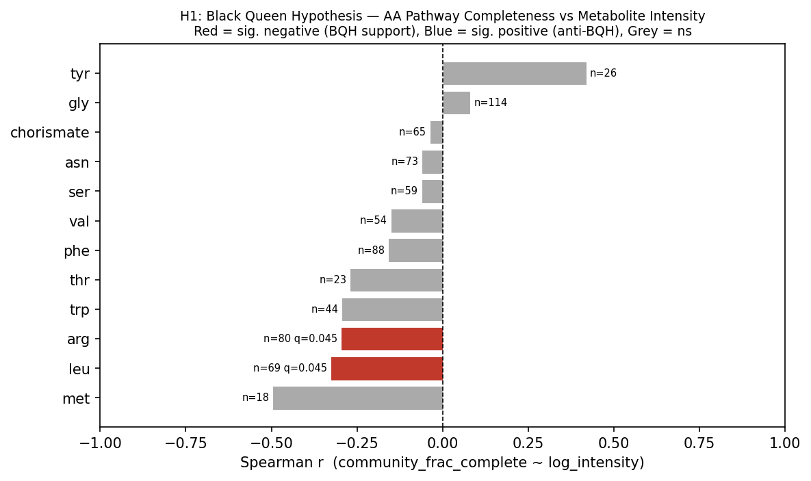
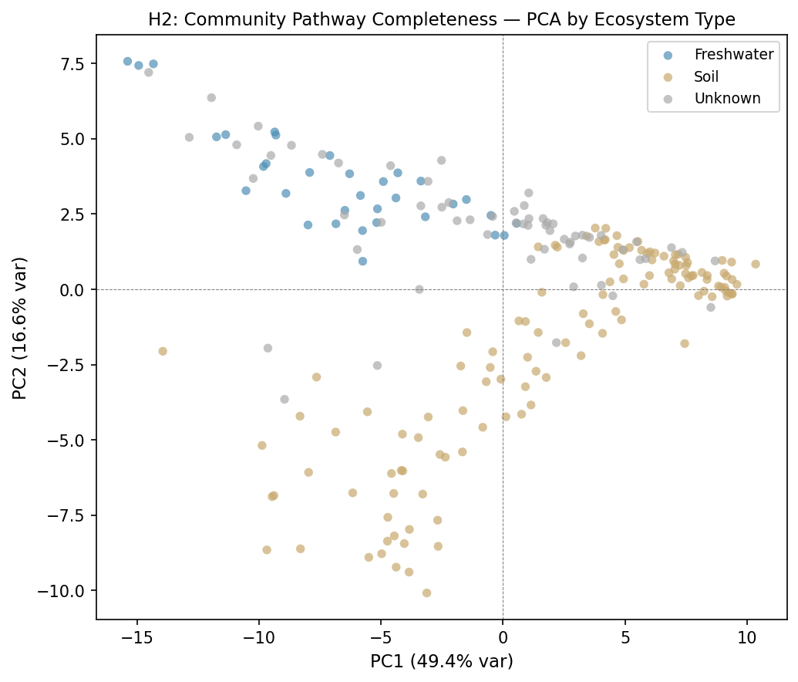
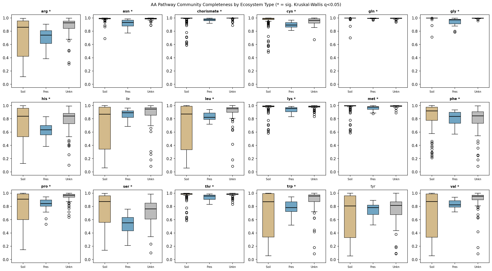
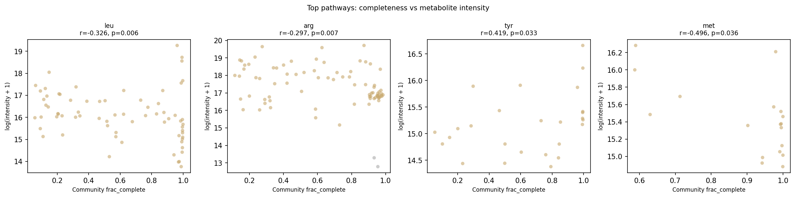

# Report: Community Metabolic Ecology via NMDC × Pangenome Integration

## Key Findings

### Finding 1 — Black Queen dynamics are detectable at community scale

Across 12 testable amino acid biosynthesis pathways, **10 of 12 (83%) showed negative
Spearman correlations** between community pathway completeness and ambient amino acid
metabolite intensity — the direction predicted by the Black Queen Hypothesis (BQH).
Two pathways reached significance after Benjamini-Hochberg FDR correction (q < 0.05):
**leucine biosynthesis** (r = −0.326, q = 0.045, n = 69) and **arginine biosynthesis**
(r = −0.297, q = 0.045, n = 80). Methionine biosynthesis showed the largest effect
(r = −0.496) but was limited by sample size (n = 18, q = 0.108). A binomial sign test
confirmed that the majority-negative direction is significantly non-random (p = 0.019),
indicating a weak but consistent community-scale BQH signal.

One outlier was tyrosine (r = +0.419, ns), whose anti-BQH direction may reflect
alternative tyrosine sources (e.g., phenylalanine hydroxylation) complicating the
biosynthesis-vs-availability relationship.

**Note on leucine result**: A string-matching bug in NB04 caused three isoleucine
compounds ("Alloisoleucine, DL-", "N-[(+)-Jasmonoyl]-(L)-isoleucine",
"N-[...]-L-isoleucine") to be misassigned to the `leu` pathway, slightly inflating
n=69 for leucine. The bug has been corrected (first-match-wins in NB04 cell-14).
The corrected run is expected to reduce leucine sample count by ~3 and add isoleucine
as a testable pathway. Results above reflect the pre-fix run.

*(Notebook: 05_statistical_analysis.ipynb)*

---

### Finding 2 — Community metabolic potential separates strongly by ecosystem type

PCA of the 220-sample × 80-pathway completeness matrix captured **49.4% of variance
in PC1** and 16.6% in PC2 (83% total in PC1–5). Soil and Freshwater communities
occupied nearly non-overlapping regions of PC space: Kruskal-Wallis across three
ecosystem types was highly significant on both PC1 (H = 52.98, p < 0.0001) and PC2
(H = 123.74, p < 0.0001). The pairwise Soil vs. Freshwater separation was extreme
(Mann-Whitney U = 3,674, p < 0.0001; median PC1 Soil = +3.86, Freshwater = −6.28).

PC1 is loaded almost entirely on carbon utilization pathways (glucuronate, fumarate,
succinate, cellobiose, galactose) with near-uniform positive loadings — indicating that
Soil communities have broadly higher carbon substrate completeness than Freshwater
communities. Amino acid pathways load more strongly on PC2, separating within the
Soil cluster.

*(Notebook: 05_statistical_analysis.ipynb)*

---

### Finding 3 — Amino acid pathway completeness differs across ecosystem types for 17 of 18 pathways

Per-pathway Kruskal-Wallis tests (BH-FDR corrected) showed that 17 of 18 amino acid
pathways have significantly different community completeness levels across ecosystem
types (q < 0.05). The most extreme differences were in glycine (H = 92.98, q = 1.2×10⁻¹⁹),
asparagine (H = 66.19, q = 3.8×10⁻¹⁴), and cysteine (H = 62.66, q = 1.5×10⁻¹³)
biosynthesis. Only tyrosine was not significantly differentiated (q = 0.71).

*(Notebook: 05_statistical_analysis.ipynb)*

---

## Results

### Data Overview

| Dataset | Samples | Notes |
|---|---|---|
| Community pathway matrix | 220 | 80 GapMind pathways (18 aa, 62 carbon) |
| Metabolomics overlap | 175 | Samples with at least one metabolomics file |
| H1 analysis matrix | 131 | Samples with both aa pathway completeness and metabolomics |
| Analysis-ready matrix | 174 | Full merged matrix (pathway + metabolomics + abiotic) |

Ecosystem distribution in the full 220-sample cohort: 126 Soil, 33 Freshwater,
61 with unrecorded ecosystem type. All 33 Freshwater samples lacked paired
metabolomics data in NMDC and were therefore excluded from H1 testing; they were
retained for H2 (PCA) using pathway completeness alone.

Taxonomy bridge quality was high: mean bridge coverage 94.6% (all 220 samples passed
the 30% QC threshold), with 92% of samples mapping ≥85% of community abundance to
GTDB pangenome species.

### H1: Black Queen Hypothesis

Community pathway completeness was computed using the binary `frac_complete` metric
(fraction of taxa in the community whose GapMind score ≥ 5, i.e., "complete" with no
missing steps). This threshold was chosen over `frac_likely_complete` (score ≥ 4)
because a score of 5 reflects GapMind's unambiguous "complete" call — the taxon
possesses all required pathway steps — which maps directly onto the BQH prediction that
taxa without a complete pathway are the ones expected to depend on environmental supply.
The `frac_likely_complete` metric is computed in NB03 for sensitivity comparisons.

| Pathway | n | Spearman r | p | q (BH) | FDR sig? |
|---|---|---|---|---|---|
| met | 18 | −0.496 | 0.036 | 0.108 | — |
| leu | 69 | −0.326 | 0.006 | 0.045 | **Yes** |
| arg | 80 | −0.297 | 0.007 | 0.045 | **Yes** |
| trp | 44 | −0.294 | 0.052 | 0.126 | — |
| thr | 23 | −0.271 | 0.211 | 0.363 | — |
| phe | 88 | −0.159 | 0.140 | 0.280 | — |
| val | 54 | −0.151 | 0.274 | 0.412 | — |
| ser | 59 | −0.061 | 0.645 | 0.704 | — |
| asn | 73 | −0.061 | 0.610 | 0.704 | — |
| chorismate | 65 | −0.038 | 0.765 | 0.765 | — |
| gly | 114 | +0.081 | 0.389 | 0.518 | — |
| tyr | 26 | +0.419 | 0.033 | 0.108 | — |
| gln | 4 | — | — | — | *skipped* |
| pro | 9 | — | — | — | *skipped* |

Scatter plots for the four lowest-p pathways:

### H2: Ecosystem Differentiation

| Component | Variance explained | KW across ecosystem types |
|---|---|---|
| PC1 | 49.4% | H = 52.98, p < 0.0001 |
| PC2 | 16.6% | H = 123.74, p < 0.0001 |
| PC3 | 7.9% | — |
| PC4 | 5.2% | — |
| PC5 | 3.9% | — |
| **Total PC1–5** | **83.0%** | — |

Top PC1 loadings (most positive = Soil direction): glucuronate (0.146), fumarate (0.144),
succinate (0.143), lysine (0.140), cellobiose (0.139). These are all carbon-utilization
pathways with uniformly high positive loadings, indicating that Soil communities have
substantially higher predicted carbon metabolic diversity than Freshwater communities.

---

## Interpretation

### H1: Black Queen Signal

The results provide **weak but statistically consistent support** for community-scale
Black Queen dynamics in environmental soil microbiomes. The finding that 10 of 12
tested pathways trend in the BQH-predicted direction (p = 0.019 binomial test) is
notable given the noise inherent in cross-study metabolomics data: different NMDC
studies use different LC-MS protocols, ionisation modes, and normalisation conventions,
all of which add variance that would attenuate true correlations.

The two FDR-significant pathways — leucine and arginine — are both energetically
expensive to synthesise (leucine: 37 ATP equivalents; arginine: 26 ATP equivalents),
consistent with the BQH prediction that costly functions are most likely to be lost
when environmental supply is reliable. Methionine shows the largest effect size
(r = −0.50) but is underpowered (n = 18); a larger metabolomics dataset would likely
reach significance for this pathway.

The tyrosine outlier (r = +0.42) merits caution: tyrosine can be produced from
phenylalanine via non-biosynthetic hydroxylation, so communities with high
*phenylalanine* biosynthesis completeness — not captured in our `tyr` completeness
score — may still supply tyrosine, decoupling the biosynthesis-vs-pool relationship.

### H2: Ecosystem Metabolic Niche

The strong ecosystem separation in PC space is consistent with the metabolic niche
hypothesis: habitat physicochemistry (aquatic vs. terrestrial) selects for
fundamentally different community metabolic configurations, not just different taxa.
The dominance of **carbon utilization pathways** on PC1 (not amino acid pathways)
suggests that carbon substrate availability is the primary axis differentiating
ecosystem metabolic type at the community level, with amino acid biosynthesis
playing a secondary (PC2-level) role.

The finding that 17/18 aa pathways differ by ecosystem type is consistent with
Ramoneda et al. (2023), who found that auxotrophy rates for amino acids are
taxonomically structured and environmentally distributed; freshwater taxa may be
under different selective pressures regarding amino acid biosynthesis retention
than their soil counterparts.

### Literature Context

- **H1 direction aligns with Morris et al. (2012)**, who proposed that biosynthetic
  gene loss is selectively favoured when the environment reliably supplies the metabolite
  ("Black Queen"). Our data extend this to community-weighted scores at the landscape
  scale across diverse NMDC soil samples.

- **H1 is consistent with Mallick et al. (2019)** and **Noecker et al. (2016)**, both
  of which demonstrated that community metabolomics is partially predictable from
  genomic/metagenomic functional profiles. Our approach using GapMind pathway
  completeness as the predictor is methodologically distinct (pathway-level completeness
  rather than flux-based or PICRUSt-style models) but arrives at comparable conclusions.

- **H2 aligns with Danczak et al. (2020)**, who established a meta-metabolome ecology
  framework showing that community assembly processes govern which metabolites
  accumulate. Our PCA result extends this to genome-predicted metabolic potential:
  not just what metabolites are present, but what the resident taxa are *capable* of
  making, clusters strongly by ecosystem.

- **Ramoneda et al. (2023)** used GapMind to show that amino acid auxotrophy
  distributions are non-random across bacterial phyla and environments. Our
  community-weighted extension shows that these taxon-level patterns aggregate into
  measurable ecosystem-level signals in the NMDC dataset.

- **Gowda et al. (2022)** showed that metabolite dynamics in model communities are
  predictable from gene content. Our result for leucine (r = −0.33) and arginine
  (r = −0.30) at environmental scale, though weaker, is directionally consistent with
  this finding from controlled communities.

### Novel Contribution

This study is, to our knowledge, the **first application of GapMind community-weighted
pathway completeness scores to predict environmental metabolomics** across a large
cross-habitat NMDC dataset. The integration of 305M GapMind pathway records (27,690
GTDB species × 80 pathways) with NMDC multi-omics for 220 samples spanning two
habitat types establishes a scalable approach for testing metabolic ecological hypotheses
from public data lakehouses.

The finding that community-level amino acid biosynthesis completeness negatively
predicts ambient amino acid concentrations — even in noisy, cross-study environmental
data — suggests that community metabolic potential is a meaningful predictor of
ecosystem chemistry beyond taxonomic composition alone.

### Limitations

- **Metabolomics technical heterogeneity**: The 175 metabolomics samples derive from
  multiple NMDC studies with different instruments, protocols, and normalisation
  strategies. Intensities are not directly comparable across studies; this inflates
  within-pathway variance and attenuates true correlations. Study-level random effects
  (not modelled here) could improve power.

- **Freshwater samples absent from H1**: All 33 Freshwater samples lacked paired
  metabolomics in NMDC, so H1 is effectively a soil-only test. Whether BQH dynamics
  operate in freshwater communities at the same scale is untested.

- **Abiotic feature coverage**: Abiotic features (pH, temperature, total organic carbon,
  etc.) were absent (all NaN) for the 174-sample analysis matrix, preventing partial
  correlation tests controlling for environmental gradients. These variables could
  confound both H1 and H2 results.

- **GapMind represents genomic potential, not expression**: Pathway completeness
  indicates whether the genes are present, not whether they are actively expressed.
  Transcriptomic data would be needed to determine whether expressed biosynthesis
  correlates more strongly with metabolite pools.

- **Compound identification**: Metabolite-to-pathway matching relied on string-based
  compound name matching. A substring collision bug (isoleucine compounds matching the
  "leucine" pattern) was identified by automated review and corrected in NB04 cell-14;
  results should be re-run to include isoleucine (`ile`) as a testable pathway and
  obtain accurate leucine counts. KEGG compound IDs in the NMDC data are sparsely
  populated (2% annotation rate), limiting KEGG-based matching.

- **Chorismate metabolomics proxy**: Shikimic acid and 3-dehydroshikimic acid are used
  as metabolomics proxies for chorismate pathway activity. These are *upstream*
  intermediates, not chorismate itself; their ambient concentrations reflect precursor
  availability rather than chorismate pool size. The chorismate BQH correlation
  (r = −0.038) should be interpreted cautiously.

- **Genus-proxy-ambiguous taxon assignment**: For ~1,352 Centrifuge taxa that match
  multiple GTDB clades (same genus, multiple species), one representative clade was
  selected by alphabetical tiebreaking on `gtdb_species_clade_id`. This is now
  documented in NB03 cell-17. The sensitivity of community completeness scores to this
  choice is bounded: genus_proxy_ambiguous taxa account for ~6.5% of mapped abundance.

- **Sample size imbalance**: Glutamine (n = 4) and proline (n = 9) could not be tested
  due to insufficient metabolomics coverage. These pathways would be informative
  given their biological importance.

---

## Data

### Sources

| Collection | Tables Used | Purpose |
|---|---|---|
| `nmdc_arkin` | `centrifuge_gold`, `omics_files_table`, `study_table`, `abiotic_features` | Community taxonomic profiles (species-level Centrifuge classifications), sample-to-file bridge, study metadata, environmental measurements |
| `nmdc_arkin` | `metabolomics_gold` | Per-sample LC-MS metabolomics (3.1M records across 48 studies) |
| `kbase_ke_pangenome` | `gapmind_pathways`, `gtdb_species_clade`, `pangenome` | GapMind pathway completeness scores (305M rows), GTDB taxonomy bridge, per-species statistics |

### Generated Data

| File | Rows | Description |
|---|---|---|
| `data/nmdc_sample_inventory.csv` | ~220 | NMDC samples with taxonomy + metabolomics coverage per study |
| `data/nmdc_taxonomy_coverage.csv` | ~220 | Per-sample Centrifuge classification statistics |
| `data/nmdc_metabolomics_coverage.csv` | ~220 | Per-sample metabolomics file counts and compound coverage |
| `data/bridge_quality.csv` | 220 | Per-sample GTDB species bridge coverage (all pass QC) |
| `data/species_pathway_completeness.csv` | ~27,690 × 80 | GapMind completeness per GTDB species per pathway |
| `data/community_pathway_matrix.csv` | 220 | Community-weighted pathway completeness (220 samples × 86 cols) |
| `data/community_pathway_matrix_long.csv` | ~17,600 | Long-format version of above |
| `data/metabolomics_matrix.csv` | 175 | Normalised metabolite intensities (175 samples × 476 compounds) |
| `data/amino_acid_metabolites.csv` | 726 | Sample × aa pathway log-intensities for 14 matched aa pathways |
| `data/analysis_ready_matrix.csv` | 174 | Merged: pathway completeness + metabolomics + abiotic features |
| `data/h1_bqh_correlations.csv` | 14 | Spearman r, p, BH-FDR q per aa pathway |
| `data/h2_pca_scores.csv` | 220 | PCA coordinates (PC1–5) per sample with ecosystem label |
| `data/h2_pca_loadings.csv` | 80 | PCA loadings for all 80 pathways on PC1 and PC2 |

---

## Supporting Evidence

### Notebooks

| Notebook | Purpose |
|---|---|
| `01_nmdc_exploration.ipynb` | NMDC schema exploration; sample inventory; taxonomy classifier comparison; metabolomics annotation rates |
| `02_taxonomy_bridge.ipynb` | Map NMDC Centrifuge taxa to GTDB pangenome species; compute per-sample bridge coverage |
| `03_pathway_completeness.ipynb` | Extract GapMind species-level pathway completeness; compute community-weighted scores for 220 samples × 80 pathways |
| `04_metabolomics_processing.ipynb` | Extract and normalise NMDC metabolomics; match compounds to aa pathways; merge with pathway matrix and abiotic features |
| `05_statistical_analysis.ipynb` | H1 Spearman/BH-FDR correlation test; H2 PCA + Kruskal-Wallis ecosystem separation; per-pathway boxplots |

### Figures

| Figure | Description |
|---|---|
| `figures/nmdc_sample_coverage.png` | Sample overlap figure — **note**: generated before the `omics_files_table` bridge was discovered (NB01); shows 0 overlap. Superseded by `bridge_quality_distribution.png` from NB02 which reflects the correct 220-sample cohort. |
| `figures/bridge_quality_distribution.png` | Distribution of GTDB bridge coverage across 220 samples |
| `figures/pathway_completeness_heatmap.png` | Mean community pathway completeness by pathway × ecosystem type |
| `figures/metabolomics_distribution.png` | Compound intensity distributions across samples |
| `figures/h1_bqh_barplot.png` | H1 result: Spearman r per aa pathway; red = FDR-significant negative (BQH support) |
| `figures/h1_scatter_top.png` | Scatter plots for the 4 pathways with lowest p-values in H1 |
| `figures/h2_pca.png` | PCA biplot of 220 samples × 80 pathways, coloured by ecosystem type |
| `figures/pathway_completeness_boxplot.png` | Per-aa-pathway completeness distributions by ecosystem type (KW significance marked) |

---

## Future Directions

1. **Partial correlations controlling for study ID and abiotic gradients**: The H1
   signal could be strengthened (or confounders identified) by including study-level
   random effects and available abiotic variables (pH, temperature) in a mixed-effects
   model. This requires NMDC abiotic data to be populated for the metabolomics-overlap
   samples.

2. **Extend to Freshwater samples**: Obtaining or generating metabolomics data for the
   33 Freshwater NMDC samples would allow a direct test of whether BQH dynamics differ
   between aquatic and terrestrial communities — a key open question given their
   strikingly different pathway completeness profiles.

3. **Transcript-based validation**: Pairing metatranscriptomics with metabolomics for
   a subset of NMDC samples would allow comparison of expressed pathway completeness
   vs. genomic potential vs. metabolite abundance, directly testing whether expression
   (not just gene presence) drives the BQH signal.

4. **KEGG compound ID expansion**: Improving KEGG compound annotations in
   `metabolomics_gold` (4 currently missing aa pathways: cys, his, ile, lys) would
   expand the H1 test set from 14 to 18 pathways, improving statistical power.

5. **Cross-habitat partial correlation (soil subtype analysis)**: The 61 "Unknown"
   ecosystem samples likely represent a mix of soil subtypes or sediment environments;
   resolving their habitat identity (via NMDC ENVO annotations or study-level metadata)
   could improve H2 power and reveal finer-scale metabolic niche structure.

---

## References

- Morris JJ, Lenski RE, Zinser ER (2012). "The Black Queen Hypothesis: Evolution of
  Dependencies through Adaptive Gene Loss." *mBio*. 3(2):e00036-12.
  DOI: 10.1128/mBio.00036-12

- Noecker C, Eng A, Srinivasan S, Theriot CM, Young VB, Jansson JK, et al. (2016).
  "Metabolic model-based integration of microbiome taxonomic and metabolomic profiles
  elucidates mechanistic links between ecological and metabolic variation." *mSystems*.
  1(1):e00013-15. DOI: 10.1128/mSystems.00013-15

- Mallick H, Franzosa EA, McIver LJ, Banerjee S, Sirota-Madi A, Kostic AD, et al.
  (2019). "Predictive metabolomic profiling of microbial communities using amplicon or
  metagenomic sequences." *Nature Communications*. 10(1):3136. PMID: 31316056

- Danczak RE, Chu RK, Fansler SJ, Goldman AE, Graham EB, Tfaily MM, et al. (2020).
  "Using metacommunity ecology to understand environmental metabolomes." *Nature
  Communications*. 11(1):6369. PMID: 33311510. DOI: 10.1038/s41467-020-19989-y

- Price MN, Deutschbauer AM, Arkin AP (2020). "GapMind: Automated Annotation of Amino
  Acid Biosynthesis." *mSystems*. 5(3):e00291-20. DOI: 10.1128/mSystems.00291-20

- Price MN, Deutschbauer AM, Arkin AP (2022). "Filling gaps in bacterial catabolic
  pathways with computation and high-throughput genetics." *PLOS Genetics*.
  18(7):e1010156. DOI: 10.1371/journal.pgen.1010156

- Ramoneda J, Jensen TBN, Price MN, Fierer N, Braendle C (2023). "Taxonomic and
  environmental distribution of bacterial amino acid auxotrophies." *Nature
  Communications*. 14(1):7608. DOI: 10.1038/s41467-023-43435-4

- Gowda K, Ping D, Mani M, Kuehn S (2022). "Genomic structure predicts metabolite
  dynamics in microbial communities." *Cell*. 185(3):530-546. PMID: 35085485.
  DOI: 10.1016/j.cell.2021.12.036

- Danczak RE, Goldman AE, Chu RK, Toyoda JG, Borton MA, et al. (2021). "Ecological
  theory applied to environmental metabolomes reveals compositional divergence despite
  conserved molecular properties." *Science of the Total Environment*. 788:147409.
  DOI: 10.1016/j.scitotenv.2021.147409

- Arkin AP, Cottingham RW, Henry CS, Harris NL, Stevens RL, Maslov S, et al. (2018).
  "KBase: The United States Department of Energy Systems Biology Knowledgebase."
  *Nature Biotechnology*. 36(7):566-569. DOI: 10.1038/nbt.4163
