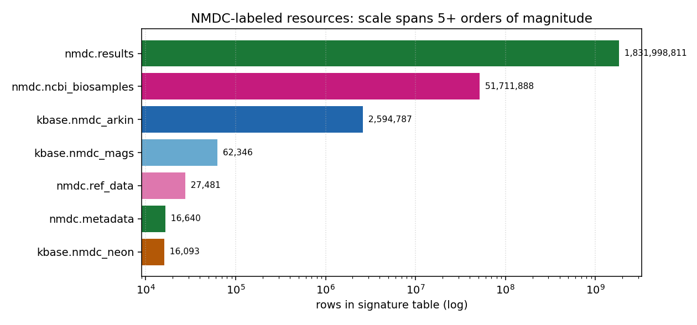
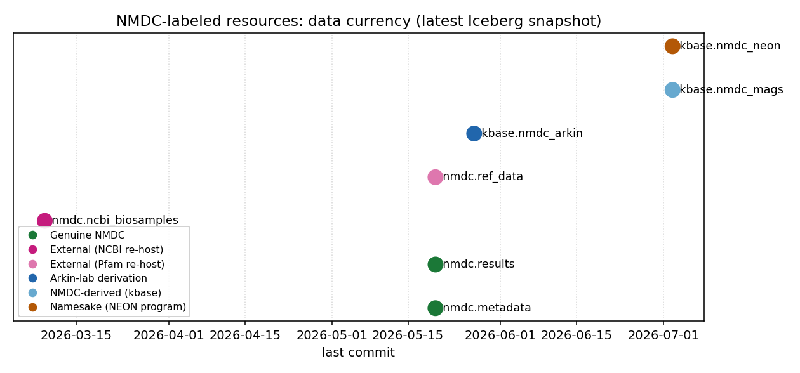

# Report: NMDC Context Audit

## Key Findings

### Finding 1 — One "NMDC" label spans three tenants and six provenance classes

Searching BERDL for `nmdc` returns resources that share only the substring — not
provenance, scope, scale, or currency. The 20 database names containing "nmdc" resolve to
**7 real, maintained resources** across **three tenants** (`nmdc`, `kbase`, plus broken
user copies), falling into six provenance classes:

| Provenance class | Resource(s) | Whose work |
|---|---|---|
| Genuine NMDC | `nmdc.metadata`, `nmdc.results` | NMDC program (DOE-BER) |
| External re-host (NCBI) | `nmdc.ncbi_biosamples` | NCBI |
| External re-host (Pfam) | `nmdc.ref_data` | Pfam consortium |
| Other-group derivation | `kbase.nmdc_arkin` | LBNL Arkin Lab |
| NMDC-derived, kbase tenant | `kbase.nmdc_mags` | KBase / NMDC |
| Namesake collision | `kbase.nmdc_neon` | **NEON** (NSF) — not NMDC |

The hypothesis (H1) is supported: the label is systematically overloaded, and every one of
the four predicted confusion modes is realized by an actual resource.

*(Notebook: 00_nmdc_landscape.ipynb)*

### Finding 2 — The `nmdc` tenant is neither "all NMDC" nor "only NMDC"

Two of the four databases in the `nmdc` tenant are **external data re-hosted**, not NMDC
output: `nmdc.ncbi_biosamples` (an NCBI BioSample harvest — 51,711,888 biosamples,
756,112,544 attribute rows) and `nmdc.ref_data` (Pfam, 27,481 terms). Meanwhile, three
NMDC-related databases live *outside* the tenant, in `kbase`: `nmdc_arkin`, `nmdc_mags`,
`nmdc_neon`. Because the inventory groups by catalog prefix, these are filed under "kbase"
and are invisible to anyone browsing the `nmdc` tenant.

A concrete scale trap: the genuine NMDC biosample universe is **16,640** samples
(`nmdc.metadata.biosample_set`), while the co-hosted NCBI mirror alongside it is **51.7M** —
a ~3,000× difference with nothing in the names to signal it.

*(Notebook: 00_nmdc_landscape.ipynb)*

### Finding 3 — Data currency spans days to months, and is invisible at discovery

Iceberg snapshot ages differ by ~4 months across the label, yet nothing surfaces this to a
user choosing a resource:

| Resource | Last commit | Freshness |
|---|---|---|
| `kbase.nmdc_mags` | 2026-07-02 | freshest (days) |
| `kbase.nmdc_neon` | 2026-07-02 | fresh |
| `kbase.nmdc_arkin` | 2026-05-27 | ~6 weeks |
| `nmdc.metadata` / `nmdc.results` / `nmdc.ref_data` | 2026-05-20 | ~7 weeks |
| `nmdc.ncbi_biosamples` | 2026-03-09 | **stalest (~4 months)** |

*(Notebook: 00_nmdc_landscape.ipynb)*

### Finding 4 — The context that would prevent all of this is missing from every layer

- **Catalog layer**: tables carry **no `Comment`**; databases have empty `Properties`
  (owner `tgu2`). Zero human-readable context in the lakehouse itself.
- **Static docs**: the canonical NMDC schema link `docs/schemas/nmdc.md` is a **404**
  (`docs/schemas/` does not exist); `docs/overview.md` never mentions NMDC.
- **Dynamic tooling**: the `berdl` skill has **zero** NMDC content; `berdl_inventory.py`
  groups purely by catalog prefix, so `kbase.nmdc_*` is never linked back to NMDC.
- **Provenance blur even where docs exist**: `berdl_data_atlas` tags Rhea/GO reference
  ontologies under `nmdc_arkin` as "NMDC integrated."

## Discoveries

- The "nmdc" tenant co-hosts a 51.7M-row NCBI BioSample mirror and Pfam vocabulary
  alongside genuine NMDC data; substring ≠ provenance. Any project treating "the nmdc
  tenant" as one coherent NMDC dataset will mis-scope or mis-attribute.
- NMDC-derived data is split across two tenant homes (`nmdc.*` and `kbase.nmdc_*`) with no
  cross-link; the freshest NMDC resource (`kbase.nmdc_mags`, 62,346 MAGs) sits in the tenant
  a user is least likely to search for NMDC.
- `kbase.nmdc_neon` is NEON (NSF National Ecological Observatory Network), a different
  program — an acronym collision that would corrupt agency attribution.
- Iceberg `.snapshots.committed_at` is the only available data-currency signal (no table
  comments, no changelog); it should be surfaced in discovery tooling.

## Performance Notes

- Row counts on all NMDC tables — including `nmdc.results.annotation_kegg_orthology`
  (1.83B rows) — return instantly via Iceberg metadata (`SELECT COUNT(*)`), so cataloguing
  scale is cheap and need not be avoided.
- `DESCRIBE DATABASE EXTENDED kbase.nmdc_*` raises `ForbiddenException` for a
  `kesciencero`/`microbialdiscoveryforge` principal even though `COUNT(*)` on the same
  tables succeeds — metadata introspection and data reads have different access surfaces.
- `get_databases()` returns **both** the dotted Iceberg alias (`nmdc.metadata`) and the
  underscore Hive alias (`nmdc_metadata`) for every tenant DB, so de-dupe to the dotted form
  before iterating to avoid double-counting. (The broader dotted-vs-underscore namespace
  migration is already documented repo-wide in `docs/pitfalls.md`; this note is only the
  `get_databases()`-returns-both-forms delta.)

## Results

The full evidence table (`data/nmdc_landscape.csv`) classifies each real resource by
provenance, scale, currency, and authority. The naming hazards (`data/nmdc_naming_cruft.csv`)
document the aliases, test databases (`globalusers.nmdc_core_test*`), phantom
(`kbase_nmdc_neon`, 0 tables), and broken user copies (`mamillerpa/my.nmdc_flattened_biosamples`,
dangling Iceberg pointer). Of 20 "nmdc" database names, only 7 are real, maintained resources.

The primary deliverable is `knowledge/` — a 15-file Open-Knowledge-Format directory
(repo-native `name`/`description`/`metadata` frontmatter with provenance/tenant/currency/
authority fields, one topic per file, fully cross-linked). Its entry points are
`knowledge/README.md` (index), `knowledge/nmdc-label-is-overloaded.md` (the thesis), and
`knowledge/nmdc-choosing-the-right-resource.md` (a goal→resource decision guide).

## Interpretation

The overloaded label is not a cosmetic issue — the evidence is consistent with it driving
the sub-optimal-resource selection the project set out to test (this is inferred from the
gap analysis and prior-project usage skew, not from a directly observed wrong choice; see
Limitations). A user who wants NMDC-curated microbiome metadata but
pulls `nmdc.ncbi_biosamples` operates on the wrong data at 3,000× the scale; a user who
searches only the `nmdc` tenant silently excludes the freshest MAG catalog; a user who cites
`kbase.nmdc_neon` as NMDC mis-attributes an NSF program. Each such mistake would plausibly
cost time and compute and weaken conclusions — the failure mode the knowledge layer is
designed to prevent — though, as noted in Limitations, this is inferred from the gap
analysis and prior-project reuse skew, not from a directly observed wrong choice.

The audit also clarifies that co-hosting is often *intentional and valuable*: the NCBI mirror
exists because BERDL adds an attribute-harmonization layer that makes 51.7M raw NCBI samples
analytically usable; the Arkin derivative adds embeddings/traits that do not exist upstream.
So the fix is **not** to relabel or remove resources but to **surface provenance and
value together** — which is what the knowledge base does.

### Literature / authority context
- **NMDC** — National Microbiome Data Collaborative, DOE-BER (https://microbiomedata.org/);
  its LinkML-based data model defines the `*_set` schema in `nmdc.metadata`.
- **NEON** — National Ecological Observatory Network, NSF (https://www.neonscience.org/);
  distinct agency and sampling design from NMDC.
- **NCBI BioSample** (https://www.ncbi.nlm.nih.gov/biosample) and **Pfam/InterPro** are the
  true authorities for `nmdc.ncbi_biosamples` and `nmdc.ref_data` respectively.
- Prior in-repo knowledge (`docs/pitfalls.md` `## nmdc_arkin`, `docs/discoveries.md`) covers
  `nmdc_arkin` well but leaves the other six resources thinly or undocumented — consistent
  with this audit's gap analysis.

### Novel contribution
No prior artifact in the repo classifies the *provenance* of the NMDC label or measures its
scale/currency spread. This audit is the first to (a) enumerate all seven real resources with
verified counts and snapshot ages, (b) name the six provenance classes, and (c) provide a
goal→resource decision guide.

### Limitations
- Provenance classes are inferred from schema, table properties, tenant metadata, and prior
  project usage — not from an ingestion manifest (none is exposed in-catalog).
- `kbase.nmdc_*` database descriptions are access-restricted (`ForbiddenException`), so some
  metadata (e.g. steward-authored notes, if any) could not be captured.
- Completeness is assessed relative to snapshot timestamps, not by diffing against live
  upstream NMDC/NCBI record counts (out of scope; would require external API calls).

## Recommendations (proposed, not applied)

Per the approved scope, this project produces the knowledge base and recommends — but does
not yet apply — the following reviewable fixes to the static docs and dynamic tooling:

1. **Repair the schema entry point.** `docs/schema.md:16` links to a non-existent
   `docs/schemas/nmdc.md`. Either create `docs/schemas/nmdc.md` (seeded from this
   `knowledge/` directory) or repoint the link. This is the single highest-value doc fix.
2. **Add a `berdl` skill NMDC module.** `.claude/skills/berdl/modules/nmdc.md` summarizing
   the seven resources, provenance classes, join pitfalls, and the decision guide, so
   discovery-time guidance disambiguates NMDC.
3. **Cross-link the split tenant homes in the inventory.** `berdl_inventory.py` should note,
   under the `nmdc` tenant, that `kbase.nmdc_arkin/mags/neon` are related-but-separate, and
   flag `kbase.nmdc_neon` as NEON (not NMDC).
4. **Surface currency at discovery.** Add `max(committed_at)` (Iceberg snapshot age) to
   inventory output; it is cheap and is the only currency signal users have.
5. **Fix provenance-blur labels.** In `berdl_data_atlas` data, retag Rhea/GO reference
   ontologies under `nmdc_arkin` as external reference, not "NMDC integrated."
6. **Mention NMDC in `docs/overview.md`** so top-level orientation acknowledges the collection.
7. **Housekeeping.** Repair or drop the broken `mamillerpa/my.nmdc_flattened_biosamples`
   copies and the phantom `kbase_nmdc_neon` alias (route via commit/PR, not ad-hoc FS ops).

## Data

### Sources
| Collection | Tables Used | Purpose |
|---|---|---|
| `nmdc_metadata` | `biosample_set`, `study_set`, `data_generation_set`, `workflow_execution_set`, `functional_annotation_agg` | Genuine NMDC metadata; scale/currency |
| `nmdc_results` | `annotation_kegg_orthology`, `annotation_statistics`, `gtdbtk_bacterial_summary`, `checkm_statistics` | Genuine NMDC pipeline outputs |
| `nmdc_ncbi_biosamples` | `biosamples_flattened`, `biosamples_attributes`, `bioprojects_flattened`, `sra_biosamples_bioprojects` | Prove NCBI (not NMDC) provenance + scale |
| `nmdc_ref_data` | `pfam_terms` | Prove Pfam provenance |
| `kbase_nmdc_arkin` | `taxonomy_dim`, `metabolomics_gold`, `embeddings_v1`, `omics_files_table`, `study_table` | Arkin-lab derivation characterization |
| `kbase_nmdc_mags` | `mag_catalog`, `bin_catalog`, `biosample_metadata`, `study_sample` | MAG catalog scale/currency |
| `kbase_nmdc_neon` | `neon_mag_catalog`, `sample_data`, `study_sample` | NEON namesake characterization |

### Generated Data
| File | Rows | Description |
|---|---|---|
| `data/nmdc_landscape.csv` | 7 | Per-resource provenance class, signature-table row count, currency, authority |
| `data/nmdc_naming_cruft.csv` | 5 | Aliases, test DBs, phantom and broken NMDC-named databases |
| `data/provenance_probe.md` | — | Raw DESCRIBE/count/snapshot probe output |

## Supporting Evidence

### Notebooks
| Notebook | Purpose |
|---|---|
| `00_nmdc_landscape.ipynb` | Enumerate every "nmdc" DB, classify provenance, count rows (Iceberg), measure currency, render figures |

### Figures
| Figure | Description |
|---|---|
| `figures/nmdc_scale.png` | Signature-table row counts (log) by resource, colored by provenance class |
| `figures/nmdc_currency.png` | Latest Iceberg snapshot per resource, colored by provenance class |

### Knowledge base (primary deliverable)
| File | Topic |
|---|---|
| `knowledge/README.md` | Index / map + one-glance summary table |
| `knowledge/nmdc-label-is-overloaded.md` | The thesis: 3 tenants × 6 provenance classes |
| `knowledge/nmdc-choosing-the-right-resource.md` | Goal→resource decision guide |
| `knowledge/nmdc-program-what-it-is.md` | NMDC program vs `nmdc` tenant |
| `knowledge/nmdc-tenant-inventory.md` | The four `nmdc.*` databases |
| `knowledge/ncbi-biosamples-not-nmdc.md` | `nmdc.ncbi_biosamples` is NCBI |
| `knowledge/nmdc-ref-data-is-pfam.md` | `nmdc.ref_data` is Pfam |
| `knowledge/nmdc-data-outside-nmdc-tenant.md` | The `kbase.nmdc_*` blind spot |
| `knowledge/nmdc-arkin-derived-product.md` | Arkin-lab enrichment + join pitfalls |
| `knowledge/nmdc-neon-namesake-collision.md` | NEON ≠ NMDC |
| `knowledge/nmdc-mags-catalog.md` | `kbase.nmdc_mags` (freshest) |
| `knowledge/nmdc-completeness-and-currency.md` | Scale + snapshot ages |
| `knowledge/nmdc-value-added-by-berdl.md` | Flattening/harmonization/embeddings |
| `knowledge/nmdc-naming-aliases-and-cruft.md` | Aliases, tests, phantom, broken DBs |
| `knowledge/nmdc-prior-project-usage.md` | Prior-project reuse map |

## Future Directions
1. Apply the recommendations (create `docs/schemas/nmdc.md` + `berdl` skill NMDC module) and
   measure whether new NMDC projects reach the right resource faster.
2. Add a lightweight currency/provenance annotation to `berdl_inventory.py` output so the
   disambiguation is dynamic, not just documentary.
3. Extend the provenance-audit method to other overloaded labels in BERDL (e.g. any tenant
   co-hosting external mirrors) — the six-class framework generalizes.
4. Diff `nmdc.metadata` / `nmdc.ncbi_biosamples` against live upstream record counts to
   quantify completeness lag precisely.

## References
See [`references.md`](references.md) for the full, canonical list of authoritative sources
for the data providers and programs disambiguated in this audit — NMDC (microbiomedata.org),
NEON (NSF), NCBI BioSample, Pfam/InterPro, and KBase — plus pointers to the relevant in-repo
prior knowledge. Maintained in one place to avoid drift.
