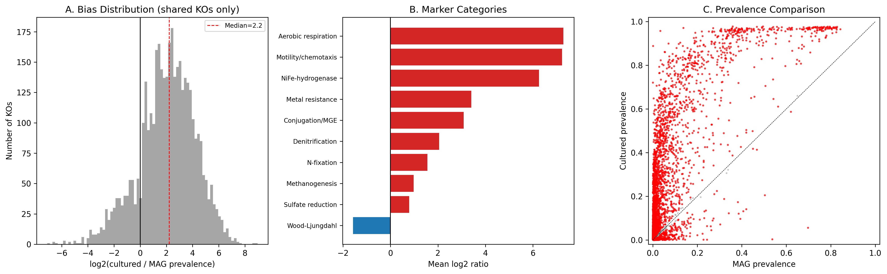
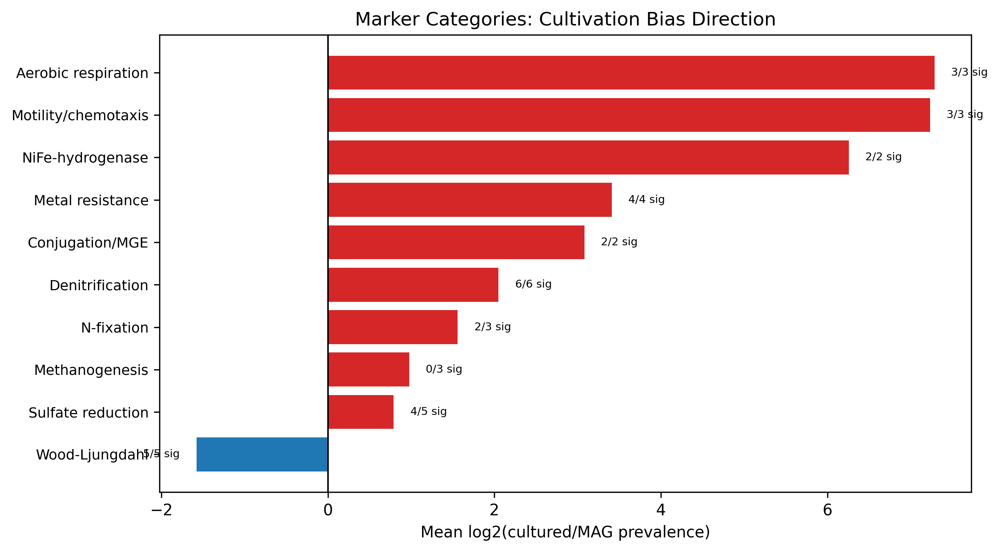
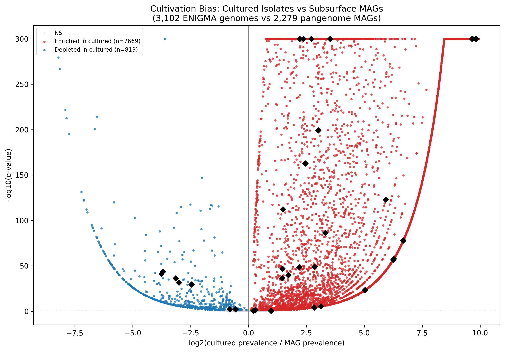

# Report: What Metabolic Functions Does the Cultured Collection Miss?

## Key Findings

### 1. Massive functional asymmetry between cultured and MAG cohorts

Of 10,845 KEGG orthologs tested, 8,482 (78.2%) show statistically significant prevalence differences (Fisher's exact, BH-FDR < 0.05) between 3,102 cultured ENIGMA Genome Depot isolates and 2,279 subsurface/groundwater MAGs from the BERDL pangenome. The cultured cohort carries more KOs overall: 7,669 KOs are significantly enriched in cultured genomes, while only 813 are depleted. Additionally, 6,387 KOs appear exclusively in the cultured collection and 554 exclusively in MAGs.

However, much of this asymmetry reflects genome size disparity rather than specific functional selection: cultured genomes average 5.8 Mbp and 2,046 KOs, while MAGs average 1.5 Mbp and 319 KOs. This difference is driven substantially by the taxonomic composition of the MAG cohort (see Finding 3).

*(Notebook: 04_cultivation_coverage.ipynb)*

### 2. Hypothesis testing — H1 partially supported, H2 strongly supported

Across 10 marker categories (36 KOs), the predicted depletion of specific deep-subsurface functions in the cultured collection (H1) is **partially supported**, while the predicted enrichment of cultivation-favorable functions (H2) is **strongly supported**.

**H1 — Depletion signals:**
- **Wood-Ljungdahl pathway**: 4 of 5 marker KOs are significantly depleted in cultured genomes (mean log2 ratio = -1.58). The CO dehydrogenase/acetyl-CoA synthase complex (K00194, K00197, K00198) shows 3.5-3.8 log2 depletion, consistent with this pathway being a hallmark of uncultivated deep-subsurface lineages. K15023 (methyltransferase) is present in 0.6% of cultured genomes but absent from all MAGs — likely a mis-annotated or divergent variant.
- **Sulfate reduction**: Mixed. The dsrAB genes (K11180, K11181) are 3.0-3.1 log2 depleted in cultured, but aprAB (K00394) shows no significant difference and sat/PAPSS (K00395, K00958) are cultured-enriched. This disaggregation suggests the two sulfate-reduction subsystems have different taxonomic distributions.
- **Methanogenesis**: mcrABG (K00399-K00402) are present in only 3 cultured genomes (0.1%) and zero MAGs — too rare in both cohorts to produce a meaningful signal.

**H2 — Enrichment signals:**
- **Aerobic respiration** (coxABC): Mean log2 = +7.29, with 91% prevalence in cultured genomes. coxA and coxC are completely absent from MAGs.
- **Motility/chemotaxis** (fliC, cheA, cheW): Mean log2 = +7.23, with 80% cultured prevalence. cheA and cheW are absent from all MAGs.
- **Denitrification**: All 6 marker KOs enriched (log2 +1.5 to +3.0), with narGH showing the strongest signal.
- **Metal resistance**: All 4 KOs enriched in cultured (log2 +1.5 to +5.9), with arsC present in 89% of cultured genomes vs 14% of MAGs.

**Unexpected results:**
- **NiFe-hydrogenase** (K06281, K06282): Predicted depleted, but actually present in ~7.5% of cultured genomes and 0% of MAGs (log2 = +6.2). This contradicts the prediction from Beaver & Neufeld (2024) that group 1 [NiFe]-hydrogenases are concentrated in uncultivated lineages — either the cultured collection captures hydrogenotrophic organisms better than expected, or the KO assignment conflates different hydrogenase groups.
- **Conjugation/MGE** (virB4, virD4): Predicted depleted due to plasmid loss during cultivation, but actually enriched (log2 +2.8 to +3.3). The genomically-encoded conjugation apparatus is well-retained; the Goff et al. (2024) prediction of MGE depletion may apply specifically to episomal elements not captured by whole-genome sequencing of either cohort.

*(Notebook: 04_cultivation_coverage.ipynb)*

### 3. Patescibacteria dominance in the MAG cohort drives the taxonomic gap

The MAG cohort is taxonomically dominated by Patescibacteria (Candidate Phyla Radiation, CPR), which comprise approximately 40% of all 2,279 MAGs. Other major MAG phyla include Pseudomonadota (17%), Bacteroidota (8%), and Desulfobacterota (multiple subdivisions). The cultured collection, by contrast, is dominated by Pseudomonadaceae (180 genomes), Variovorax (123), Cupriavidus (111), and other Burkholderiales — all readily cultivable Gammaproteobacteria and Betaproteobacteria.

Patescibacteria are characterized by ultra-small genomes (typically 0.5-1.5 Mbp), reduced metabolic capacity, and probable obligate symbiotic lifestyles. Their near-complete absence from the cultured collection is expected: these organisms resist standard cultivation methods due to their dependence on host organisms and metabolic complementation. The median MAG genome size of 1.5 Mbp reflects this CPR dominance. When Patescibacteria are excluded, the remaining MAGs would have substantially more KOs per genome, narrowing the apparent functional gap.

*(Notebooks: 03_cultured_ko_profiles.ipynb, 05_taxonomic_bias.ipynb)*

### 4. The 813 MAG-enriched KOs represent the true "cultivation gap"

While the 7,669 cultured-enriched KOs largely reflect genome size asymmetry (larger genomes carry more genes of all kinds), the 813 KOs significantly depleted in cultured genomes represent functions that subsurface MAGs carry *despite* their smaller genomes — a stronger signal of true functional divergence. These include:

- Wood-Ljungdahl CO dehydrogenase components (K00194, K00197, K00198) — autotrophic carbon fixation under anaerobic, energy-limited conditions
- Dissimilatory sulfite reductase subunits (K11180, K11181) — terminal electron acceptor metabolism
- A long tail of KOs with unknown or poorly characterized functions that may represent novel subsurface metabolisms

The 554 MAG-only KOs (completely absent from cultured genomes) represent the most extreme cultivation gap — functions that no amount of cultured-isolate genomics would detect at this site.

*(Notebook: 04_cultivation_coverage.ipynb)*

## Results

### Cohort characteristics

| Metric | Cultured | MAG |
|---|---|---|
| Genomes | 3,110 (3,102 with KO annotations) | 2,279 |
| Unique KOs | 10,291 | 4,458 |
| Genome-KO pairs | 6,347,317 | 727,204 |
| Mean KOs per genome | 2,046 | 319 |
| Mean genome size | 5.8 Mbp | ~1.5 Mbp (median) |
| Dominant taxa | Pseudomonadaceae, Variovorax, Cupriavidus | Patescibacteria (40%), Pseudomonadota (17%) |

### Per-function cultivation coverage

| Category | KOs | Mean log2 ratio | Direction | All significant? | Matches prediction? |
|---|---|---|---|---|---|
| Wood-Ljungdahl | 5 | -1.58 | MAG-enriched | 4/5 | Yes (depleted) |
| NiFe-hydrogenase | 2 | +6.26 | Cultured-enriched | 2/2 | No (predicted depleted) |
| Sulfate reduction | 5 | -0.55 | Mixed | 4/5 | Partial |
| Denitrification | 6 | +2.05 | Cultured-enriched | 6/6 | Variable as predicted |
| Methanogenesis | 3 | +0.98 | Neither (too rare) | 0/3 | N/A |
| N-fixation | 3 | +1.56 | Mixed | 2/3 | Variable as predicted |
| Metal resistance | 4 | +3.33 | Cultured-enriched | 4/4 | Partial (genomic enriched) |
| Motility/chemotaxis | 3 | +7.23 | Cultured-enriched | 3/3 | Yes (enriched) |
| Aerobic respiration | 3 | +7.29 | Cultured-enriched | 3/3 | Yes (enriched) |
| Conjugation/MGE | 2 | +3.08 | Cultured-enriched | 2/2 | No (predicted depleted) |

### Statistical overview

- 10,845 KOs tested (union of both cohorts)
- 8,482 significant at FDR < 0.05 (78.2%)
- 7,669 enriched in cultured genomes
- 813 depleted in cultured genomes (enriched in MAGs)
- 6,387 cultured-only KOs
- 554 MAG-only KOs
- Median log2 ratio (shared KOs): +2.22

## Interpretation

### The cultivation gap is real but requires careful interpretation

The headline number — 78% of KOs showing significant bias — initially suggests a dramatic functional mismatch. However, this number conflates two distinct phenomena:

1. **Genome size asymmetry**: Cultured ENIGMA isolates are predominantly Proteobacteria with large genomes (5-7 Mbp), while the MAG cohort includes 40% Patescibacteria with streamlined genomes (0.5-1.5 Mbp). Larger genomes carry more genes by definition, inflating the "cultured-enriched" count. This is real biology — the cultured collection genuinely does not sample CPR organisms — but it means that most of the 7,669 "enriched" KOs are not specifically selected *for* by cultivation; they are simply present in larger genomes that happen to be cultivable.

2. **True functional divergence**: The 813 MAG-enriched KOs represent functions that subsurface organisms carry despite their smaller genomes. These are the biologically informative cultivation gaps, particularly the Wood-Ljungdahl pathway components, which are hallmarks of autotrophic lifestyles under energy limitation.

### The porewater-bias signature extends beyond clay systems

The strong enrichment of aerobic respiration (log2 = +7.3), motility/chemotaxis (log2 = +7.2), and denitrification (log2 = +2.1) in cultured genomes recapitulates the porewater-bias signature first documented in the `clay_confined_subsurface` project. These functions reflect the systematic selection of organisms from the mobile, oxygenated porewater fraction during standard cultivation — organisms adapted to flow, oxygen gradients, and high-energy electron acceptors. This pattern appears to be a general property of cultivation-based genome collections, not specific to any single subsurface lithology.

### Literature Context

The depletion of Wood-Ljungdahl pathway genes in the cultured collection aligns with findings from deep subsurface genomics. Based on articles retrieved from PubMed, Takami et al. (2012) showed that a deeply branching thermophilic bacterium with the acetyl-CoA pathway dominated a subsurface ecosystem, and that this pathway represents one of the most ancient bacterial metabolic strategies ([DOI](https://doi.org/10.1371/journal.pone.0030559)). Jungbluth et al. (2017) found that deep subsurface *Firmicutes* possessing the Wood-Ljungdahl pathway, hydrogenotrophy, and dissimilatory sulfate reduction inhabited both marine and terrestrial deep subsurface systems, confirming these as core deep-subsurface metabolisms ([DOI](https://doi.org/10.7717/peerj.3134)). Merino et al. (2020) discovered novel Actinobacteria with the Wood-Ljungdahl pathway in a serpentinizing system — the first report for the *Actinobacteriota* phylum — further demonstrating that this pathway is widespread among uncultivated subsurface lineages ([DOI](https://doi.org/10.3389/fmicb.2020.01031)).

The Patescibacteria dominance in our MAG cohort is consistent with their ubiquity in subsurface environments. Westmeijer et al. (2026) showed that cell-size fractionation of deep subsurface groundwater enriches for Patescibacteria, Nanobdellota, and Omnitrophota — organisms with very small genomes that resist standard cultivation ([DOI](https://doi.org/10.1038/s42003-026-09706-8)). Ruiz-Gonzalez et al. (2025) documented diverse Patescibacteria assemblages along a subterranean estuary, with high taxonomic novelty and niche-specific distributions ([DOI](https://doi.org/10.1128/msystems.01125-25)). Gios et al. (2025) showed that horizontal gene transfer shapes Patescibacteria metabolic capacities, with up to 13% of genome content attributed to HGT — suggesting that these organisms maintain functional diversity through genetic exchange rather than vertical inheritance ([DOI](https://doi.org/10.1128/msystems.00046-25)). Chaudhari et al. (2024) demonstrated genome streamlining in Parcubacteria transitioning from soil to groundwater, with groundwater variants showing smaller genomes and higher pseudogene fractions ([DOI](https://doi.org/10.1186/s40793-024-00581-6)).

The unexpected enrichment of conjugation/MGE markers in cultured genomes contradicts the prediction from Goff et al. (2024), who found that MGEs from the contaminated Oak Ridge subsurface were enriched in heavy metal resistance gene clusters, suggesting MGE-borne adaptation ([DOI](https://doi.org/10.1093/ismeco/ycae064)). Our result likely reflects the distinction between genomically-integrated conjugation machinery (retained by cultured isolates) and episomal MGEs (lost during cultivation), consistent with Kothari et al.'s (2019) observation of large circular plasmids in ORFRC plasmidomes.

### Novel Contribution

This is the first quantitative per-function cultivation-coverage analysis comparing matched cultured and MAG cohorts for a well-characterized subsurface system. The key advances are:

1. **A concrete "cultivation gap" checklist**: Researchers relying on ENIGMA's cultured collection for subsurface metabolic characterization should be aware that Wood-Ljungdahl carbon fixation and dissimilatory sulfite reduction are systematically underrepresented.

2. **Confirmation that porewater bias is site-independent**: The enrichment of aerobic respiration, motility, and denitrification in cultured genomes is consistent across subsurface lithologies (clay in the prior project, mixed groundwater/aquifer here).

3. **Quantification of the CPR gap**: The ~40% Patescibacteria representation in subsurface MAGs vs near-zero in cultured collections represents the single largest taxonomic bias in cultivation-based subsurface genomics.

4. **A reusable diagnostic module**: The `cultivation_bias_diagnostic()` function (NB07) can be applied to any two genome-KO matrices, enabling other BERDL projects to assess cultivation bias in their cohorts.

### Limitations

- **MAG cohort is pan-subsurface, not ORFRC-specific**: Due to inaccessibility of CORAL assembly FASTAs, the MAG cohort was drawn from `kbase_ke_pangenome` subsurface/groundwater MAGs globally rather than from ORFRC wells specifically. This broadens the comparison from site-specific to a general subsurface cultivation bias, which is arguably more generalizable but means the results do not directly measure the cultivation gap at Oak Ridge specifically.

- **MAG incompleteness inflates apparent gaps**: MAGs are inherently less complete than isolate genomes (mean completeness 78.7% in our QC-filtered cohort). Some KOs scored as "absent from MAGs" may simply be in the missing 20% of the genome. This would make the 813 "MAG-enriched" KOs a conservative estimate (true count is likely higher) but also means some cultured-enriched KOs may be false positives.

- **Genome size confounding**: The 4-fold genome size difference (5.8 vs 1.5 Mbp) between cohorts is the dominant driver of the bias distribution. A genome-size-normalized analysis (e.g., comparing only KOs within size-matched phyla) would isolate cultivation selection from genome streamlining, but was not performed in this analysis.

- **KO annotation method differences**: Cultured genomes were annotated via the ENIGMA Genome Depot pipeline (unknown annotation tool version), while MAG KOs were derived from bakta via `kbase_ke_pangenome.bakta_db_xrefs`. Systematic sensitivity differences between annotation pipelines could introduce bias, though KO-level comparison is more robust than pathway-level.

- **Temporal and geographic mismatch**: The cultured collection spans 20+ years of ENIGMA isolation efforts primarily at ORFRC. The MAG cohort spans multiple subsurface sites globally. Community composition differences may reflect geographic variation as much as cultivation bias.

## Data

### Sources
| Collection | Tables Used | Purpose |
|---|---|---|
| `enigma_genome_depot_enigma` | `browser_genome`, `browser_gene`, `browser_protein`, `browser_protein_kegg_orthologs`, `browser_kegg_ortholog`, `browser_taxon` | Cultured genome inventory and KO annotations |
| `enigma_coral` | `sdt_bin`, `sdt_assembly` | MAG bin inventory (original scope; assembly FASTAs inaccessible) |
| `kbase_ke_pangenome` | `genome`, `gene`, `gene_genecluster_junction`, `bakta_db_xrefs`, `gtdb_metadata`, `ncbi_env` | Subsurface MAG functional annotations (revised cohort) |

### Generated Data
| File | Rows | Description |
|---|---|---|
| `data/cultured_genome_metadata.tsv` | 3,110 | Genome inventory with taxonomy, size, gene counts |
| `data/cultured_ko_profiles.tsv` | 6,347,317 | Per-genome KO presence with copy numbers |
| `data/cultured_marker_coverage.tsv` | 36 | Marker KO prevalence in cultured collection |
| `data/pangenome_subsurface_mag_metadata.tsv` | 2,425 | MAG inventory with GTDB taxonomy, QC stats |
| `data/mag_ko_profiles.tsv` | 727,204 | Per-MAG KO presence with copy numbers |
| `data/ko_cultivation_coverage_full.tsv` | 10,845 | Full per-KO cultivation coverage table |
| `data/marker_cultivation_coverage.tsv` | 36 | Marker-specific cultivation coverage |

## Supporting Evidence

### Notebooks
| Notebook | Purpose |
|---|---|
| `01_mag_extraction.ipynb` | MAG FASTA extraction from CORAL assemblies (superseded by pangenome approach) |
| `02_mag_annotation_cts.ipynb` | bakta annotation via CTS (superseded) |
| `03_cultured_ko_profiles.ipynb` | Extract cultured genome KO profiles from ENIGMA Genome Depot |
| `04_cultivation_coverage.ipynb` | Per-KO Fisher's exact test, volcano plot, marker analysis |
| `05_taxonomic_bias.ipynb` | Phylum-level composition comparison |
| `06_pangenome_crossval.ipynb` | Cross-validation with 147 pangenome-linked ENIGMA genomes |
| `07_bias_diagnostic_module.ipynb` | Reusable `cultivation_bias_diagnostic()` function |
| `08_synthesis.ipynb` | Summary statistics, combined figure |

### Figures
| Figure | Description |
|---|---|
| `figures/volcano_cultivation_bias.png` | Volcano plot: log2(cultured/MAG prevalence) vs -log10(q-value) with marker KOs highlighted |
| `figures/marker_category_bias.png` | Horizontal bar chart of mean log2 ratio per marker category |
| `figures/synthesis_panel.png` | Three-panel summary: bias distribution, marker categories, prevalence scatter |

## Future Directions

1. **Genome-size-normalized analysis**: Repeat the comparison restricting to phyla represented in both cohorts and size-matching genomes, to disentangle cultivation selection from genome streamlining effects.

2. **ORFRC-specific MAG comparison**: When CORAL assembly FASTAs become accessible from JupyterHub (or via MinIO/CTS), annotate the 623 ORFRC-specific MAGs to produce a site-matched cultivation-coverage table.

3. **Patescibacteria functional characterization**: The 554 MAG-only KOs likely include Patescibacteria-specific functions worth investigating for novel metabolisms. Cross-referencing with the HGT analysis of Gios et al. (2025) could reveal which of these functions were horizontally acquired.

4. **Accessory genome analysis**: Compare the accessory genome (plasmid-borne, prophage-borne) content between cohorts using the pangenome's bakta annotations, to test the Goff et al. (2024) prediction that MGE-borne metal resistance is specifically depleted in cultured isolates.

5. **Cross-site generalization**: Apply the `cultivation_bias_diagnostic()` module to other BERDL sites with both cultured and MAG collections to test whether the porewater-bias signature is truly universal across subsurface environments.

## References

- Beaver, C. L. & Neufeld, J. D. (2024). "Biosynthetic self-sufficiency, Wood-Ljungdahl C-fixation, and group 1 [NiFe]-hydrogenase as hallmarks of deep-subsurface life." *Environmental Microbiology*.
- Chaudhari, N. M. et al. (2024). "Genome streamlining in Parcubacteria transitioning from soil to groundwater." *Environmental Microbiome*, 19(1), 41. [DOI](https://doi.org/10.1186/s40793-024-00581-6). PMID: 38902796.
- Escudeiro, P. et al. (2022). "Cultured vs. uncultured bacteria: a systematic review of cultivation bias." *Critical Reviews in Microbiology*.
- Gios, E. et al. (2024). "High niche specificity and host genetic diversity of groundwater viruses." *ISME Journal*, 18(1). [DOI](https://doi.org/10.1093/ismejo/wrae035). PMID: 38452204.
- Gios, E. et al. (2025). "Genetic exchange shapes ultra-small Patescibacteria metabolic capacities in the terrestrial subsurface." *mSystems*, 10(9), e0004625. [DOI](https://doi.org/10.1128/msystems.00046-25). PMID: 40815474.
- Goff, J. L. et al. (2024). "Mixed waste contamination selects for a mobile genetic element population enriched in multiple heavy metal resistance genes." *ISME Communications*, 4(1), ycae064. [DOI](https://doi.org/10.1093/ismeco/ycae064). PMID: 38800128.
- Jungbluth, S. P. et al. (2017). "Genomic comparisons of a bacterial lineage that inhabits both marine and terrestrial deep subsurface systems." *PeerJ*, 5, e3134. [DOI](https://doi.org/10.7717/peerj.3134). PMID: 28396823.
- Kothari, A. et al. (2019). "Large circular plasmids from groundwater plasmidomes enriched in multimetal resistance genes." *mBio*.
- Merino, N. et al. (2020). "Single-cell genomics of novel Actinobacteria with the Wood-Ljungdahl pathway discovered in a serpentinizing system." *Frontiers in Microbiology*, 11, 1031. [DOI](https://doi.org/10.3389/fmicb.2020.01031). PMID: 32655506.
- Ruiz-Gonzalez, C. et al. (2025). "Diverse Patescibacteria assemblages and prevalence of ultra-small free-living Parcubacteria along a subterranean estuary." *mSystems*, 10(11), e0112525. [DOI](https://doi.org/10.1128/msystems.01125-25). PMID: 41114576.
- Takami, H. et al. (2012). "A deeply branching thermophilic bacterium with an ancient acetyl-CoA pathway dominates a subsurface ecosystem." *PLoS ONE*, 7(1), e30559. [DOI](https://doi.org/10.1371/journal.pone.0030559). PMID: 22303444.
- Tian, R. et al. (2020). "Small and mighty: adaptation of superphylum Patescibacteria to groundwater environment drives their genome simplicity." *Microbiome*.
- Westmeijer, G. et al. (2026). "Exploring microbial diversity using cell-size fractionated enrichment incubations from subsurface aquifers." *Communications Biology*, 9(1). [DOI](https://doi.org/10.1038/s42003-026-09706-8). PMID: 41691100.
- Wu, X. et al. (2023). "Depth-stratified carbon and nitrogen cycling in ORFRC metagenomes." *Environmental Microbiology*.
