# Report: PaperBLAST Data Explorer — Characterizing Literature Coverage Bias in Protein Sequence Space

## Key Findings

### Finding 1: One organism dominates nearly half of all literature

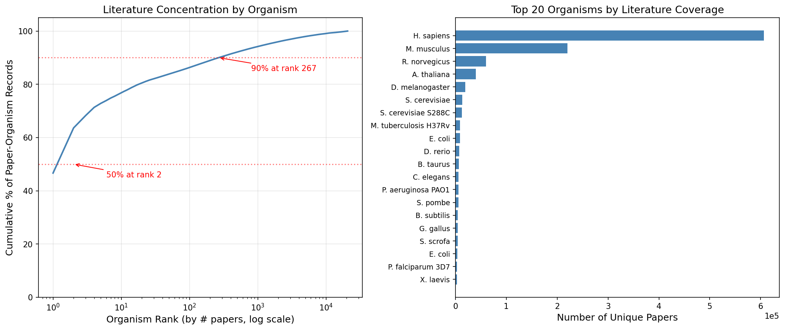

*Homo sapiens* alone accounts for **46.7%** of all gene-paper records in PaperBLAST. The top 5 organisms (*H. sapiens*, *M. musculus*, *R. norvegicus*, *A. thaliana*, *D. melanogaster*) capture **72.8%**. Of 20,723 organisms with any literature, the top 1,000 capture 94.2%, leaving the remaining 19,723 organisms sharing just 5.8% of the literature.

*(Notebook: 02_coverage_skew.ipynb)*

### Finding 2: 65.6% of genes have exactly one paper

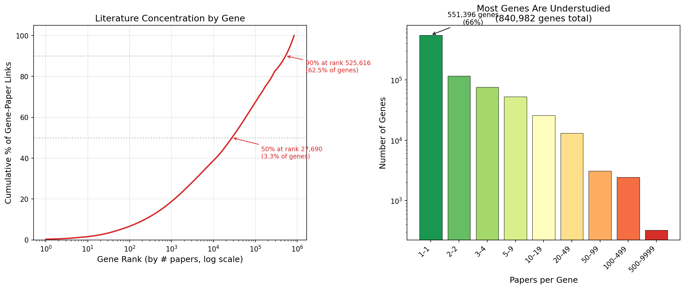

The distribution of papers per gene is extremely skewed. Of 841K genes with any text-mined paper link, **551K (65.6%)** have exactly 1 paper. The median is 1, the mean is 3.8. The top 50 most-referenced genes are all human — led by p53 (9,988 papers), TNF (6,002), and EGFR (5,895). Just 6% of genes (50K) account for 57.7% of all gene-paper links.

*(Notebook: 02_coverage_skew.ipynb)*

### Finding 3: Literature inequality is extreme — Lorenz curves

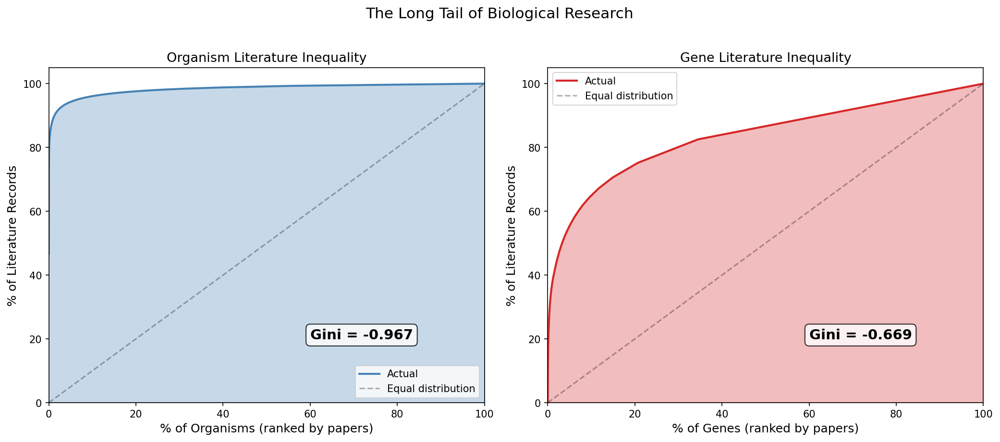

Lorenz curves quantify the inequality. For organisms, the Gini coefficient is **0.967** (where 1.0 is perfect inequality), indicating near-total concentration. For genes, the Gini is **0.669** — still very high. This mirrors wealth-inequality patterns in economics — a small fraction of biological entities receive nearly all research attention.

*(Notebook: 02_coverage_skew.ipynb)*

### Finding 4: Bacterial research is concentrated on pathogens

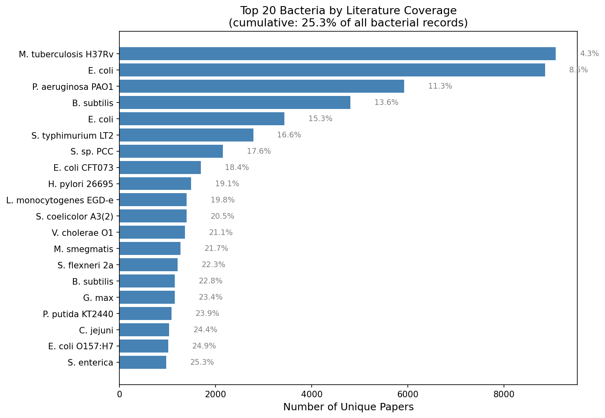

Among 15,312 bacterial organisms, the top 100 capture **44.3%** of bacterial literature. The top 3 bacteria are all well-known pathogens or model organisms: *M. tuberculosis* H37Rv (9,079 papers), *E. coli* K-12 (8,860), and *P. aeruginosa* PAO1 (5,928). Environmental and non-pathogenic organisms are dramatically underrepresented.

*(Notebook: 02_coverage_skew.ipynb)*

### Finding 5: 345K protein families from 816K sequences

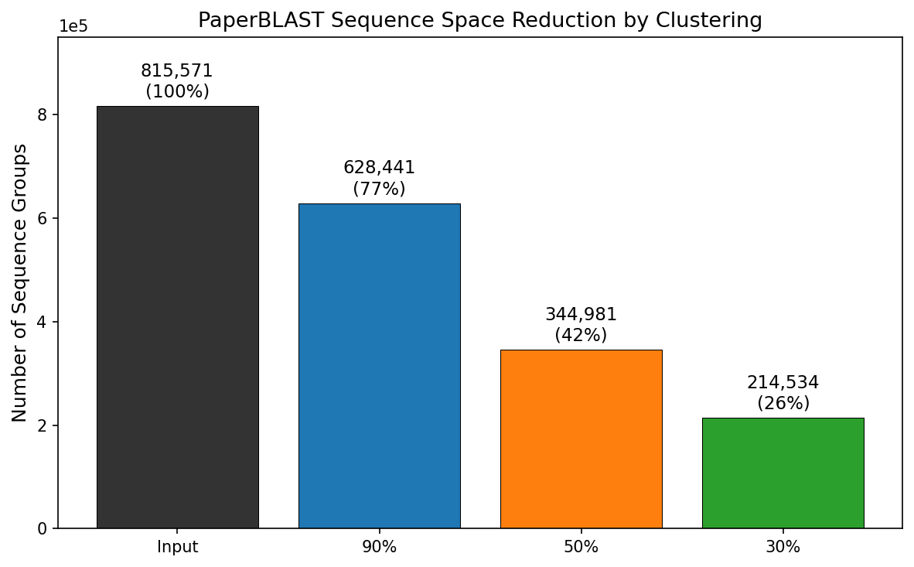

MMseqs2 clustering of 815,571 PaperBLAST protein sequences at three identity thresholds reveals: **628K clusters at 90%** (77% — low strain-level redundancy), **345K at 50%** (protein family level), and **215K at 30%** (superfamily level). The largest families are housekeeping proteins: HSP70/BiP (650 members at 50%), GAPDH (609), enolase (552), GroEL (443).

*(Notebook: 03_sequence_clustering.ipynb)*

### Finding 6: 55% of protein families are dark or dim

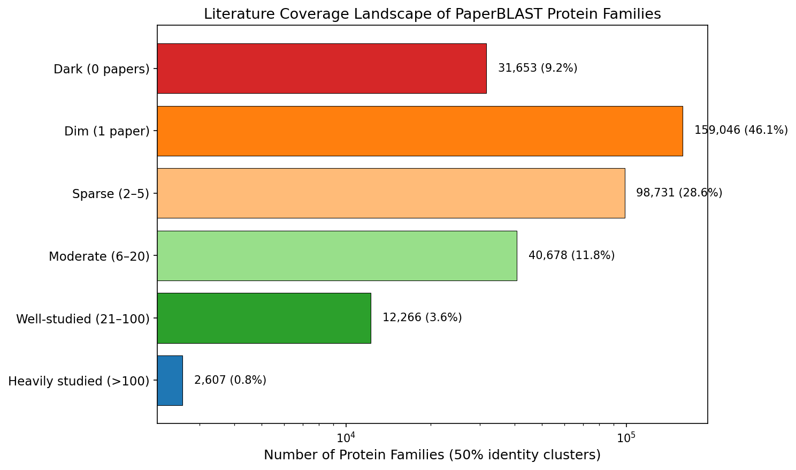

At 50% identity, **9.2% of protein families** (31,653) have **zero papers** across all members, and **46.1%** (159,046) have exactly 1 paper. Only **4.3%** of families (14,904) have 20 or more papers. 5,218 multi-member families — representing 14,534 sequences — have no literature whatsoever. These are the "dark" protein families.

*(Notebook: 03_sequence_clustering.ipynb)*

## Results

### Database Scale and Structure

The `kescience_paperblast` collection on BERDL contains **12.4 million rows** across 14 tables. The core data structure links genes to papers through text mining of PubMed Central full-text articles, supplemented by curated annotations from 13 databases and structural data from the PDB.

| Table | Rows | Description |
|-------|------|-------------|
| genepaper | 3,195,890 | Gene-to-paper links (text-mined) |
| site | 2,089,192 | PDB binding/active/modified sites |
| snippet | 1,951,949 | Text excerpts mentioning genes |
| generif | 1,358,798 | GeneRIF functional summaries |
| gene | 1,135,366 | Gene/protein metadata |
| uniq | 815,571 | Unique protein sequences |
| curatedpaper | 599,587 | Curated gene-paper links |
| curatedgene | 255,096 | Curated annotations (SwissProt, BRENDA, etc.) |

*(Notebook: 01_paperblast_overview.ipynb)*

### Temporal Coverage

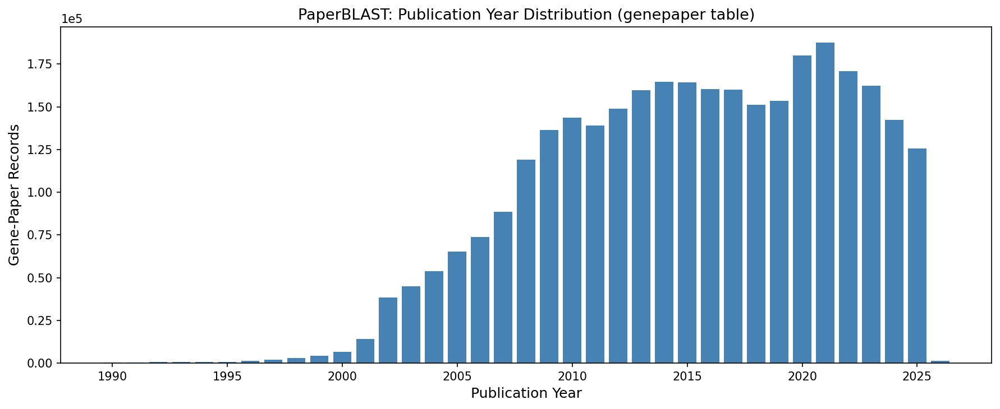

The database covers papers from **1951 to 2026**. Publications peak around 2020–2021, with 30.6% of records from 2020 onwards. The 2025 data includes 125,438 records from 22,271 papers. 1,425 records from 2026 are present, indicating the snapshot was taken in early 2026.

*(Notebook: 01_paperblast_overview.ipynb)*

### Taxonomic Coverage

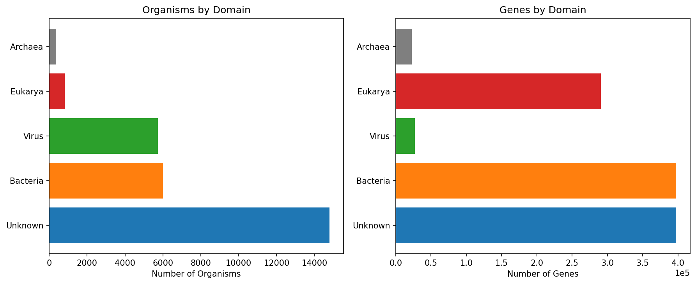

The 1.1M genes span 27,718 organisms across all domains of life. Bacteria dominate by organism count (6,000) but Eukarya dominate by gene count (291K) due to the massive over-representation of human and model organism genes. 14,798 organisms fell into an "Unknown" domain classification, indicating that the database includes many organisms not easily classified by name heuristics alone.

| Domain | Organisms | Genes | % of Genes |
|--------|-----------|-------|-----------|
| Bacteria | 5,997 | 397,544 | 35.0% |
| Unknown | 14,798 | 397,511 | 35.0% |
| Eukarya | 822 | 290,537 | 25.6% |
| Virus | 5,730 | 27,199 | 2.4% |
| Archaea | 371 | 22,575 | 2.0% |

*(Notebook: 01_paperblast_overview.ipynb)*

### Papers per Gene: The Many-to-Many Structure

845K genes are linked to 1.1M unique papers via 3.2M many-to-many associations. Each gene averages 3.8 papers and each paper mentions 2.9 genes. The similar counts (~1.1M each) are somewhat coincidental — driven by the fact that most genes have few papers and most papers mention few genes. 25.6% of genes in the gene table (290K) have no text-mined paper link at all and rely solely on curated or GeneRIF annotations.

*(Notebook: 02_coverage_skew.ipynb)*

### Curated Databases

SwissProt contributes the most curated entries (110K proteins, 182K unique papers). PaperBLAST includes approximately 19% of the full SwissProt database (~570K reviewed entries as of 2024) — the subset that could be matched to PMC open-access literature. EcoCyc has the highest paper density per protein (5.3), reflecting its deep curation of *E. coli* metabolism.

| Database | Proteins | Papers | Papers/Protein |
|----------|----------|--------|---------------|
| SwissProt | 110,171 | 181,916 | 1.7 |
| biolip | 42,571 | 23,768 | 0.6 |
| BRENDA | 33,012 | 43,760 | 1.3 |
| MetaCyc | 12,700 | 46,176 | 3.6 |
| EcoCyc | 4,198 | 22,304 | 5.3 |

*(Notebook: 01_paperblast_overview.ipynb)*

### Structural Data

PaperBLAST includes site annotations for **132,179 PDB structures** with 2.1M site records across 4 types: binding (1.69M), functional (182K), modified (112K), and mutagenesis (104K). The 48,991 unique ligands are topped by zinc ions (65K sites), chlorophyll A (58K), calcium ions (53K), and heme (44K).

*(Notebook: 01_paperblast_overview.ipynb)*

### Sequence Clustering

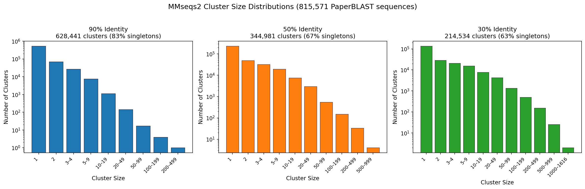

At 90% identity, 83.3% of clusters are singletons — indicating that most PaperBLAST sequences are already non-redundant at the strain level. The largest 90% cluster is actin (212 members). At 50% identity, 67.5% are singletons; at 30%, 62.8%.

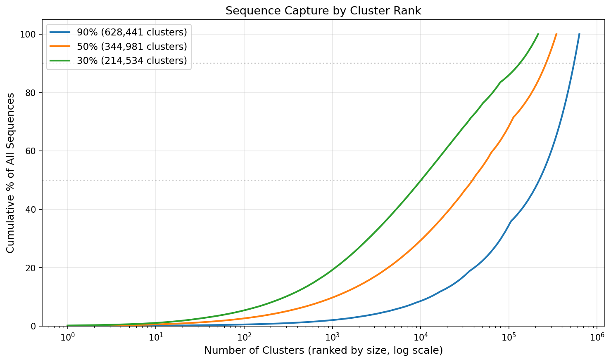

The cumulative capture curves show that at 30% identity, a relatively small number of large superfamily clusters capture a substantial fraction of all sequences, while the long tail of singleton families accounts for the remainder.

### Clustering and Literature: Larger Families Are Better Studied

There is a positive relationship between protein family size and literature coverage. 95.4% of multi-member 50% identity clusters have at least one member with a paper, but the remaining 4.6% (5,218 families) represent genuinely unstudied protein families. The "dark" families are dominated by REBASE methyltransferases and biolip structural entries — highly specialized proteins that lack published functional studies.

*(Notebook: 03_sequence_clustering.ipynb)*

### Papers per Gene Distribution

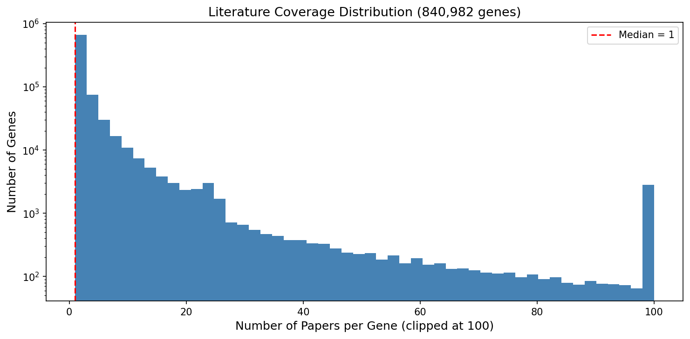

The log-scale histogram reveals the extreme right skew of the papers-per-gene distribution. The vast majority of genes cluster at 1 paper, with a long tail extending to nearly 10,000 papers for p53.

*(Notebook: 01_paperblast_overview.ipynb)*

## Interpretation

### Literature Context

The extreme concentration of biological research on a small number of genes and organisms is well-documented. **Stoeger et al. (2018)** showed that the most-studied human genes continue to attract the most new research, creating a self-reinforcing "rich-get-richer" dynamic. They demonstrated that gene attention can be predicted from a small set of chemical, physical, and biological properties — meaning the bias is systematic, not random. Our finding that the top 50 genes are exclusively human cancer/disease genes is consistent with their analysis.

The concept of "dark" or poorly characterized protein families aligns with work on the "dark proteome" by **Perdigao et al. (2015)**, who estimated that approximately 40% of protein residues fall in "dark" regions with no structural or functional information. Our finding that 55% of protein families at 50% identity have 0 or 1 papers extends this observation to the literature domain. **Rocha et al. (2023)** coined the term "functional unknomics" to describe the systematic study of conserved genes of unknown function, noting that significant and unexplored biology is encoded in the unstudied portion of genomes.

The PaperBLAST database itself was created by **Price & Arkin (2017)** specifically to address the challenge of connecting protein sequences to relevant literature. Their follow-up work on interactive tools for functional annotation (**Price & Arkin, 2024**) and Curated BLAST (**Price & Arkin, 2019**) further developed the approach of using literature text mining to aid gene function discovery.

### Novel Contribution

This analysis provides the first comprehensive characterization of the BERDL-hosted PaperBLAST collection at the protein family level. By combining sequence clustering with literature coverage data, we quantify the "dark matter" of protein biology: **5,218 multi-member protein families (at 50% identity) have zero literature coverage**. The Lorenz curve analysis and per-domain breakdowns provide presentation-ready figures for communicating the magnitude of the research coverage gap.

The cross-database linkage analysis reveals that 129,823 VIMSS cross-references connect PaperBLAST to the Fitness Browser, creating a path from literature coverage to experimental fitness phenotypes — a resource for identifying functionally important but understudied genes.

### Limitations

- **Text mining ≠ functional characterization**: A gene mentioned in a paper may be tangential to the study. The 65.6% with 1 paper likely includes many incidental mentions.
- **PMC open-access only**: PaperBLAST only mines full-text from PubMed Central. Papers behind paywalls are missed, creating a systematic bias against fields/journals with lower open-access rates.
- **Domain classification is approximate**: The heuristic organism-to-domain mapping classified 35% of organisms as "Unknown." A formal taxonomy lookup would improve accuracy.
- **Clustering identity thresholds are arbitrary**: The 50% identity cutoff for "protein family" is conventional but does not correspond to a universal biological boundary.
- **SwissProt coverage is partial**: Only 19% of SwissProt is in PaperBLAST, likely because many SwissProt entries lack matching PMC full-text. This means curated knowledge exists for many proteins that PaperBLAST cannot connect to.
- **No negative controls**: We cannot easily distinguish genes that are genuinely unstudied from genes whose literature was missed by text mining.

## Data

### Sources
| Collection | Tables Used | Purpose |
|------------|-------------|---------|
| `kescience_paperblast` | `genepaper`, `gene`, `snippet`, `generif`, `curatedgene`, `curatedpaper`, `uniq`, `site`, `hassites`, `pdbligand`, `paperaccess`, `seqtoduplicate`, `pdbclustinfo`, `seqhassite` | All 14 tables — gene-paper links, metadata, sequences, structural data |

### Generated Data
| File | Rows | Description |
|------|------|-------------|
| `data/organism_gene_counts.csv` | 27,718 | Gene counts per organism with domain classification |
| `data/year_distribution.csv` | 74 | Publication year distribution (1951–2026) |
| `data/curated_databases.csv` | 13 | Curated database breakdown |
| `data/papers_per_gene.csv` | 840,982 | Paper count per gene |
| `data/top50_organisms.csv` | 50 | Top 50 organisms by paper count |
| `data/top50_genes.csv` | 50 | Top 50 genes by paper count |
| `data/cluster_sizes_90pct.csv` | 628,441 | Cluster sizes at 90% identity |
| `data/cluster_sizes_50pct.csv` | 344,981 | Cluster sizes at 50% identity |
| `data/cluster_sizes_30pct.csv` | 214,534 | Cluster sizes at 30% identity |
| `data/cluster_literature_50pct.csv` | 344,981 | Cluster-level literature coverage at 50% identity |
| `data/clustering_summary.txt` | — | MMseqs2 clustering summary |

### Remote Data (MinIO)
| Path | Description |
|------|-------------|
| `cts/io/psdehal/paperblast_explorer/all_sequences.fasta` | 815,571 protein sequences (380 MB) |
| `cts/io/psdehal/output/mmseqs_full/` | Raw MMseqs2 clustering output TSVs |

## Supporting Evidence

### Notebooks
| Notebook | Purpose |
|----------|---------|
| `01_paperblast_overview.ipynb` | Database inventory, temporal/taxonomic coverage, structural data, cross-references |
| `02_coverage_skew.ipynb` | Literature concentration analysis — Lorenz curves, top-50 tables, bacterial focus |
| `03_sequence_clustering.ipynb` | MMseqs2 cluster analysis, size distributions, literature-vs-cluster correlations |

### Figures
| Figure | Description |
|--------|-------------|
| `year_distribution.png` | Publication year distribution (1990–2026) |
| `domain_distribution.png` | Organisms and genes by domain of life |
| `papers_per_gene.png` | Papers-per-gene histogram (log scale) |
| `organism_coverage_skew.png` | Cumulative organism coverage curve + top 20 bar chart |
| `gene_coverage_skew.png` | Gene Lorenz curve + papers-per-gene bins |
| `lorenz_curves.png` | Side-by-side Lorenz inequality curves for organisms and genes |
| `top20_bacteria.png` | Top 20 bacteria by paper count with cumulative % |
| `cluster_size_distributions.png` | MMseqs2 cluster size histograms at 90/50/30% |
| `cluster_cumulative_capture.png` | Cumulative sequence capture by cluster rank |
| `cluster_vs_literature.png` | Cluster size vs literature coverage |
| `sequence_space_reduction.png` | Sequence space reduction bar chart |
| `literature_coverage_landscape.png` | Dark/dim/sparse/well-studied family breakdown |

### CTS Jobs
| Job ID | Description |
|--------|-------------|
| `c10c4a0f-3d57-4219-9329-501b74c8f29a` | MMseqs2 clustering (815K sequences, 90/50/30% identity) |

## Future Directions

1. **Cross-reference with Fitness Browser**: Use the 130K VIMSS links to identify fitness-important genes that lack literature — candidates for "high-impact understudied genes."
2. **Formal taxonomy integration**: Replace heuristic domain classification with NCBI taxonomy lookup to accurately quantify Bacteria/Archaea/Eukarya/Virus coverage.
3. **Temporal trend analysis**: Track whether literature concentration is increasing or decreasing over time — are we studying a broader or narrower set of genes each year?
4. **Dark family characterization**: For the 5,218 dark protein families, use AlphaFold structure prediction and domain annotation to infer putative functions.
5. **Literature graph analysis**: Build a gene-gene co-citation network from genepaper data to identify functionally related but differentially studied gene clusters.

## References

- Price MN, Arkin AP. (2017). "PaperBLAST: Text Mining Papers for Information about Homologs." *mSystems* 2:e00039-17. PMID: 28845461.
- Price MN, Arkin AP. (2019). "Curated BLAST for Genomes." *mSystems* 4:e00072-19. PMID: 31164459.
- Price MN, Arkin AP. (2024). "Interactive tools for functional annotation of bacterial genomes." *Database* 2024:baae089.
- Stoeger T, Gerlach M, Morimoto RI, Nunes Amaral LA. (2018). "Large-scale investigation of the reasons why potentially important genes are ignored." *PLoS Biol* 16:e2006643. PMID: 30226837.
- Perdigao N, Heinrich J, Stolte C, et al. (2015). "Unexpected features of the dark proteome." *Proc Natl Acad Sci USA* 112:15898-15903. PMID: 26627242.
- Rocha JJ, Jayaram SA, Stevens TJ, et al. (2023). "Functional unknomics: Systematic screening of conserved genes of unknown function." *PLoS Biol* 21:e3002222. PMID: 37590228.
- Arkin AP, Cottingham RW, Henry CS, et al. (2018). "KBase: The United States Department of Energy Systems Biology Knowledgebase." *Nat Biotechnol* 36:566-569. PMID: 29979655.
