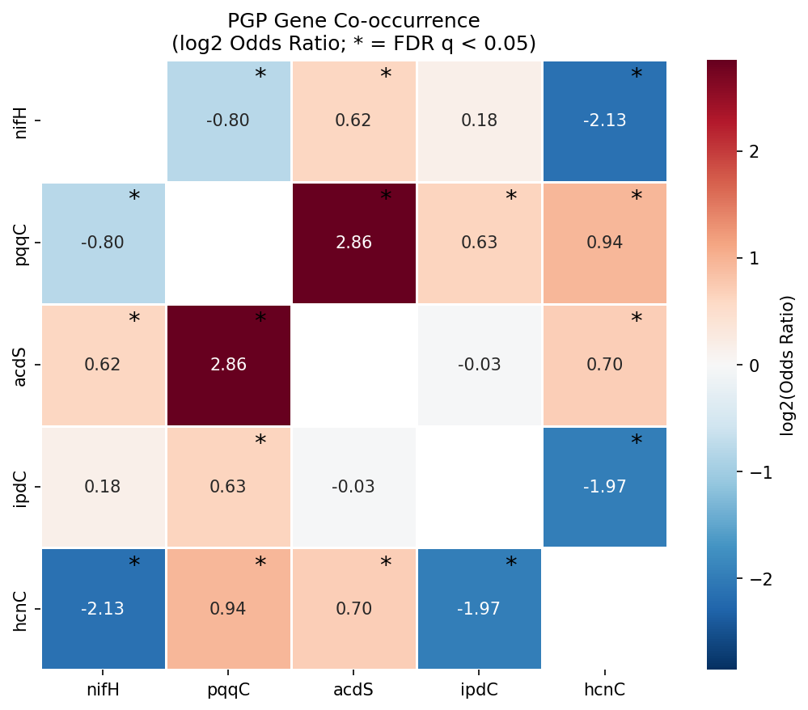
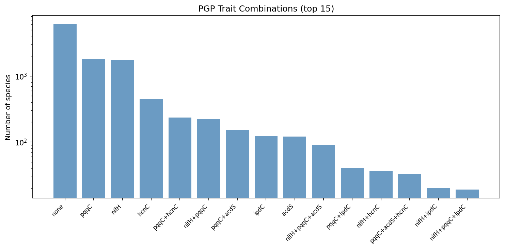
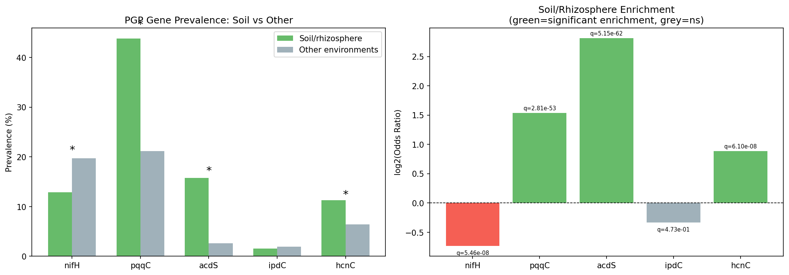
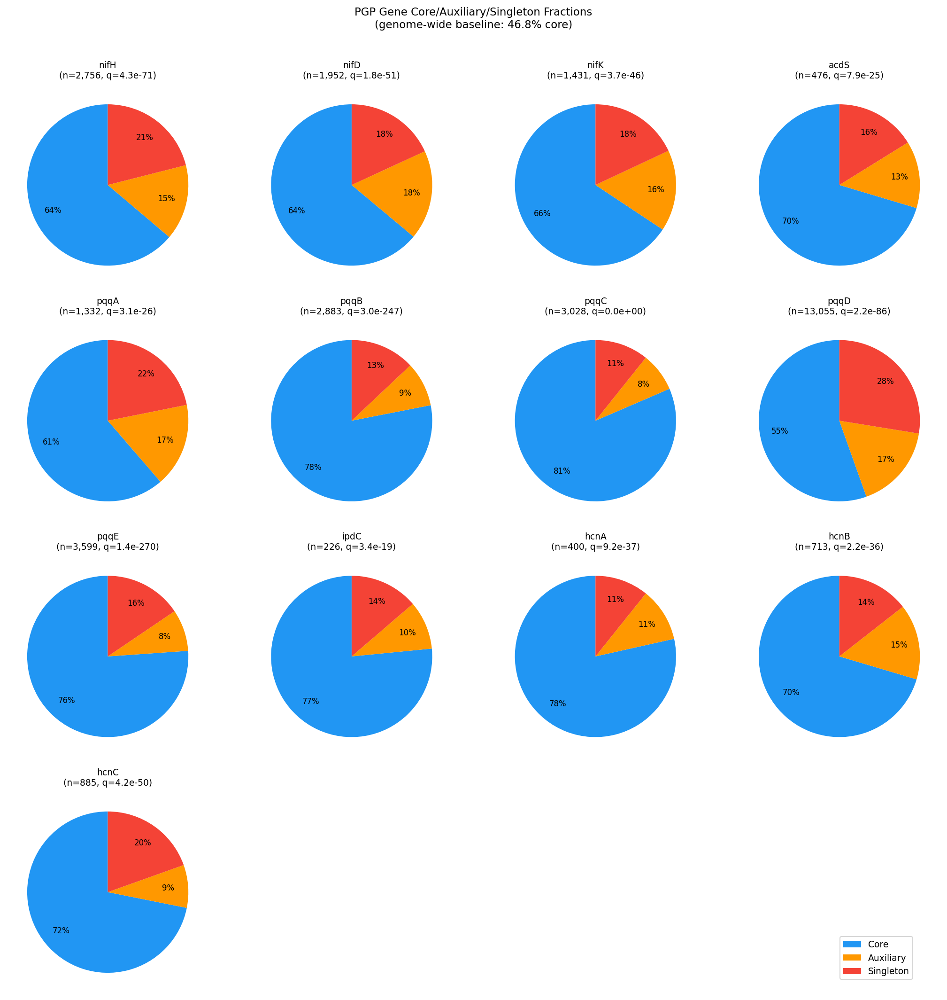
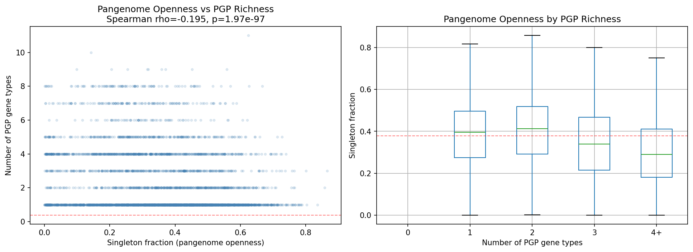
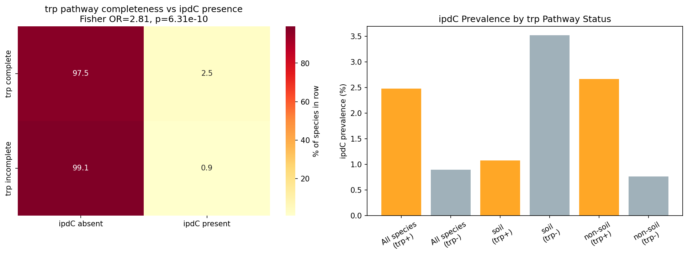

# Report: PGP Gene Distribution Across Environments & Pangenomes

## Key Findings

### H1 SUPPORTED — PGP traits form a non-random syndrome, but nitrogen fixation is ecologically distinct

Across 11,272 species with at least one PGP gene, 8 of 10 focal-gene pairs were significantly associated after BH-FDR correction. Five pairs showed positive co-occurrence and three showed negative co-occurrence. The strongest positive association was **pqqC × acdS** (OR = 7.24, n = 286 co-occurring species, q = 1.2e-83), indicating that phosphate solubilization (PQQ cofactor biosynthesis) and ethylene reduction (ACC deaminase) are nearly always found together when either is present. pqqC also co-occurred significantly with hcnC (OR = 1.91) and ipdC (OR = 1.55), forming a coherent "rhizosphere effectiveness" module.

In contrast, nifH (nitrogen fixation) was significantly **negatively** associated with both hcnC (OR = 0.23, q = 5.8e-29) and pqqC (OR = 0.57, q = 2.9e-19), and showed no significant association with ipdC (OR = 1.13, q = 0.54). This means diazotrophs form an ecologically separate guild from pqqC/acdS-bearing rhizobacteria — the classical "PGPB" suite appears to be primarily a non-diazotrophic phenotype.

Only 157 species (1.4%) carry ≥3 focal traits. The most common multi-trait genotype is pqqC + acdS (n = 153), followed by nifH + pqqC (n = 225, though these are negatively associated overall, they do co-occur in some generalist lineages).

*(Notebook: 02_pgp_cooccurrence.ipynb)*

---

### H2 SUPPORTED — Soil/rhizosphere environment strongly selects for acdS and pqqC, but not nifH

Comparing 1,039 soil/rhizosphere species against 10,233 species from other environments, three of five focal genes were significantly enriched in soil (BH-FDR q < 0.05):

| Gene | Soil prevalence | Other prevalence | Odds Ratio | q-value |
|------|----------------|-----------------|-----------|---------|
| acdS | 15.8% | 2.6% | **7.02** | 5.1e-62 |
| pqqC | 43.8% | 21.2% | **2.90** | 2.8e-53 |
| hcnC | 11.3% | 6.4% | **1.85** | 6.1e-08 |
| nifH | 12.9% | 19.7% | 0.60 | 5.5e-08 (depleted) |
| ipdC | 1.5% | 1.9% | 0.79 | 0.47 (ns) — see H4 for soil-specific reversal |

The acdS enrichment is particularly striking: ACC deaminase is 7× more prevalent in soil/rhizosphere species than in other environments and the effect survives phylum-level fixed effects in logistic regression (OR = 6.98, p = 4.8e-61). The enrichment also holds in a strict rhizosphere-only sensitivity analysis using only genomes with "rhizosphere" or "root nodule" in their isolation source (acdS OR = 10.6, q = 7.6e-38).

Unexpectedly, nifH is significantly **depleted** in soil-classified species (OR = 0.60). The phylum-stratified analysis reveals Bacillota_A as an exception (nifH enriched in soil; OR = ∞, q = 2.5e-4), reflecting anaerobic diazotrophs such as clostridia that are soil-specific. The overall nifH depletion reflects that the majority of nitrogen fixers in the database are aquatic/marine (cyanobacteria, Azotobacter) or host-associated (rhizobia).

*(Notebook: 03_environmental_selection.ipynb)*

---

### H3 REJECTED — PGP genes are predominantly core, not accessory: vertical inheritance dominates

All 13 PGP genes showed significantly higher core fractions than the genome-wide baseline of 46.8% core (chi-square vs baseline, BH-FDR q < 0.05 for all genes):

| Gene | % Core | % Auxiliary | % Singleton | q vs baseline |
|------|--------|------------|------------|--------------|
| pqqC | **81.5%** | 7.8% | 10.7% | 0.0 |
| pqqB | **78.1%** | 8.9% | 13.0% | 3.0e-247 |
| hcnA | **78.5%** | 10.8% | 10.8% | 9.2e-37 |
| ipdC | **76.5%** | 9.7% | 13.7% | 3.4e-19 |
| acdS | **70.4%** | 13.4% | 16.2% | 7.9e-25 |
| nifH | 63.8% | 15.1% | 21.0% | 4.3e-71 |
| pqqD | 55.5% | 17.0% | 27.5% | 2.2e-86 |

The mean accessory fraction across all PGP genes is **29.7%**, compared to the genome-wide 53.2%. The HGT hypothesis (H3) is clearly rejected: PGP genes are inherited vertically with the core genome, not acquired laterally.

Confirming this interpretation, pangenome openness (singleton fraction) correlates **negatively** with PGP gene richness (Spearman ρ = −0.195, p = 2.0e-97, n = 11,272 species with ≥2 genomes). Species with more PGP genes have *more closed* pangenomes, consistent with stable, specialized ecological niches rather than generalist HGT-driven gene acquisition.

*(Notebook: 04_core_accessory_status.ipynb)*

---

### H4 PARTIALLY SUPPORTED — trp completeness predicts ipdC, but ipdC regulation is aromatic-amino-acid-general

Tryptophan biosynthesis completeness (GapMind score ≥ 0.9) significantly predicts ipdC presence: species with complete trp pathway carry ipdC at 2.5% vs 0.9% in trp-incomplete species (Fisher OR = 2.81, p = 6.3e-10; Model 1 logit, trp only: OR = 2.81, 95% CI 1.97–4.01, p = 1.4e-08, n = 11,272; Model 2 adding soil covariate: OR_trp = 2.87, p = 7.0e-09).

However, the tyrosine pathway (negative control) also predicts ipdC presence at similar effect size (OR = 3.62, p = 2.3e-11). This is not merely a statistical artifact — it is mechanistically expected: the ipdC gene in *Enterobacter cloacae* and related species is regulated by TyrR, a transcription factor activated by all three aromatic amino acids (tryptophan, phenylalanine, and tyrosine; Ryu & Patten 2008, PMID 18757531). Species with complete aromatic amino acid biosynthesis pathways are more likely to maintain the full TyrR regulatory circuit, and thus ipdC.

The stratified analysis reveals an additional complexity: within soil/rhizosphere species (n = 1,039), the association **reverses** (OR = 0.30, p = 0.02), meaning trp-complete soil species are *less* likely to carry ipdC. In non-soil species (n = 10,233) the positive association holds strongly (OR = 3.56, p = 7.7e-13). This may reflect that soil-associated PGPB obtain tryptophan exogenously from plant root exudates, relaxing selective pressure to maintain autonomous trp biosynthesis, while retaining ipdC for IAA production from plant-supplied substrate.

A phylum + soil logistic model (Model 3) was attempted but failed due to quasi-complete separation caused by ipdC's rarity across phyla (214 species, 1.9%); conclusions are therefore based on Model 1 (trp only) and Model 2 (trp + is_soil).

*(Notebook: 05_tryptophan_iaa.ipynb)*

---

## Results

### Dataset Scale
- **11,272 species** carry at least one of the 13 PGP gene markers out of 27,702 total species in the BERDL pangenome
- **32,736 PGP gene clusters** extracted across all species
- **27,690 species** with GapMind tryptophan completeness scores
- **291,279 genomes** with ncbi_isolation_source metadata; 93.5% classifiable
- **nifH count note**: The RESEARCH_PLAN estimated ~1,913 nifH clusters; the actual count is 2,756 (43% higher), reflecting incremental growth in the GTDB r214 pangenome since the plan was written. This discrepancy does not affect any analysis; it is documented in NB01 cell 4.

### PGP gene prevalence
pqqD (55.5% core, present in 11,040 species) is the most widespread PGP gene — it is the most promiscuous pqq gene and appears as a single-gene orphan in many species lacking other pqq genes. Excluding pqqD, pqqC is the most prevalent focal trait (3,028 species, 26.8% of species with any PGP gene). ipdC is the rarest focal gene (214 species, 1.9%); note that 226 is the number of ipdC gene *clusters*, while 214 is the number of species carrying at least one such cluster.

### Environment classification coverage
The soil/rhizosphere category is conservative: only 1,637 species (5.9% of species with env label) are classified as soil/rhizosphere dominant, reflecting NCBI's clinical and host-associated sampling bias. The acdS and pqqC enrichment effects (ORs of 7.0 and 2.9) are therefore likely underestimates of the true rhizosphere enrichment, since many soil isolates are deposited under broader "environmental" labels.

---

## Interpretation

### ipdC is soil-depleted regardless of analysis: H2 and H4 are consistent

The ipdC non-enrichment in H2 (raw OR = 0.79, ns; phylum-controlled logit OR = 0.56, p = 0.027 showing soil *depletion*) connects directly with H4's stratified result: the trp→ipdC positive coupling exists only in *non-soil* species (OR = 3.56), while in soil species it reverses (OR = 0.30). Both analyses point to the same underlying pattern — ipdC is less prevalent in soil-dwelling species, and when it does occur in soil species, its prevalence is not predicted by autonomous trp biosynthesis capacity. This is consistent with soil PGPB obtaining aromatic amino acids from plant exudates rather than synthesizing them de novo.

### A non-diazotrophic PGP module dominates soil bacteria

The co-occurrence and environmental analyses together reveal that the "canonical" PGPB phenotype — as selected in agricultural inoculant strains — is built around **pqqC + acdS**, not around nitrogen fixation. This pqqC–acdS module is tightly co-selected (OR = 7.24), strongly rhizosphere-enriched (acdS OR = 7.0), and vertically inherited as part of the core genome. The module represents a stable, specialized niche adaptation to the plant rhizosphere rather than a recently acquired multi-trait package.

Nitrogen fixation (nifH) constitutes a separate ecological guild with different co-occurrence partners and environmental distribution. Diazotrophs are actually depleted in soil-classified genomes relative to aquatic and host-associated environments — a finding consistent with the fact that biological nitrogen fixation is energetically expensive and most relevant in oligotrophic aquatic environments and specific symbioses, rather than in bulk soil.

### Vertical inheritance over HGT for PGP genes

The rejection of H3 — PGP genes are predominantly *core*, not accessory — runs counter to the HGT narrative that has dominated the PGPB literature. This finding aligns with Nascimento et al. (2014), who used phylogenetic analysis to show that acdS is predominantly vertically inherited despite some HGT events. For pqqC, its use as a phylogenetic marker (Meyer et al. 2011) also implies sufficient vertical inheritance for phylogenetic signal. The pangenome-openness correlation (ρ = −0.195) reinforces this: PGP-rich species have more closed, stable genomes — the signature of ecological specialists rather than generalist HGT recipients.

An important caveat: pqqD is an outlier (55.5% core vs 63–81% for other PGP genes) and shows the highest singleton fraction (27.5%), suggesting it does occasionally spread horizontally as a standalone gene. But the functional pqq operon (pqqB–pqqC as a unit) is predominantly core.

### ipdC regulation explains the H4 confound

The failure of the tyrosine negative control (OR = 3.62, comparable to trp OR = 2.81) is mechanistically interpretable, not merely a statistical nuisance. The TyrR transcription factor — which induces ipdC in *Enterobacter cloacae* — responds to tryptophan, tyrosine, and phenylalanine (Ryu & Patten 2008). Species with complete aromatic amino acid biosynthesis maintain this regulatory circuit; those without are unlikely to produce IAA even if ipdC is present. A better test of H4 would require controlling for overall genome completeness (size, COG coverage) to separate the aromatic-pathway effect from general metabolic capacity.

### Limitations

1. **Environment classification**: Only 5.9% of species are soil/rhizosphere-dominant. ncbi_isolation_source is noisy and NCBI is heavily biased toward clinical and host-associated isolates. The soil enrichment effects are likely underestimates.
2. **Gene name search only**: PGP gene detection relied on bakta `gene` annotations matching exact names (nifH, acdS, pqqC, etc.). Genes annotated by product description only, or with variant names, are missed. This particularly affects less-characterized PGP genes.
3. **No functional validation**: A gene cluster annotated as pqqC is not necessarily functional. Truncations, frameshifts, and pseudogenization are not filtered.
4. **ipdC rarity**: Only 214/11,272 species (1.9%) carry ipdC, limiting statistical power for the H4 stratified analysis. The soil reversal (OR = 0.30, p = 0.02) should be treated as hypothesis-generating rather than conclusive.
5. **GapMind confound**: trp and tyr completeness scores are both proxies for overall metabolic pathway completeness. Controlling for genome size or total pathway count would be needed to isolate specific biochemical coupling.

### Literature Context

- The pqqC × acdS co-occurrence (OR = 7.24) aligns with observations in curated PGPB collections where phosphate-solubilizing and ethylene-reducing traits co-occur in effective inoculants (Glick 2014; Vejan et al. 2016), but is here demonstrated at pangenome scale for the first time.
- The acdS soil enrichment (OR = 7.0) is consistent with Manter et al. (2023), who used direct acdS gene sequencing to show ACCD+ bacteria are more abundant in soil, and with the ecological model of Glick (1998) and Ravanbakhsh et al. (2017) in which ACC deaminase is specifically advantageous in ethylene-rich root environments.
- The vertical inheritance of acdS confirms Nascimento et al. (2014), who found predominantly vertical inheritance of acdS despite documented HGT in some Proteobacteria.
- The nifH depletion in soil contradicts the naive expectation but is consistent with Wardell et al. (2022), who note that nif gene mobility on symbiosis islands is primarily relevant in legume-associated Rhizobiales rather than free-living soil diazotrophs.
- The pangenome openness–PGP richness negative correlation (ρ = −0.195) is consistent with Sentausa & Fournier (2024, PNAS), who showed that plant-associated and host-associated lifestyles tend toward more closed pangenomes.

### Novel Contribution

This is the first analysis of PGP gene distribution, co-occurrence, and core/accessory status across the full BERDL pangenome (27K species, 293K genomes), representing a ~100× scale-up over prior comparative genomic studies of PGPB. The key advances are: (1) demonstration that the pqqC–acdS module is a co-selected, vertically inherited rhizosphere niche marker; (2) quantification of the ecological separation between diazotrophic and non-diazotrophic PGPB; and (3) the mechanistic explanation of the trp–ipdC association via TyrR aromatic amino acid regulation.

---

## Data

### Sources

| Collection | Tables Used | Purpose |
|------------|-------------|---------|
| `kbase_ke_pangenome` | `bakta_annotations`, `gene_cluster` | PGP gene cluster extraction with core/auxiliary/singleton flags |
| `kbase_ke_pangenome` | `pangenome` | Species-level genome counts and core/accessory baseline statistics |
| `kbase_ke_pangenome` | `gtdb_metadata` | Per-genome ncbi_isolation_source for environment classification |
| `kbase_ke_pangenome` | `genome` | genome_id → species mapping |
| `kbase_ke_pangenome` | `gtdb_taxonomy_r214v1` | Phylum/family/genus taxonomy for phylogenetic controls |
| `kbase_ke_pangenome` | `gapmind_pathways` | GapMind tryptophan and tyrosine pathway completeness scores |

### Generated Data

| File | Rows | Description |
|------|------|-------------|
| `data/pgp_clusters.csv` | 32,736 | All PGP gene cluster records with core/aux/singleton flags |
| `data/species_pgp_matrix.csv` | 11,272 | Wide-format species × PGP gene presence/count matrix |
| `data/genome_environment.csv` | 291,279 | Per-genome isolation source, env class, and taxonomy |
| `data/species_environment.csv` | 27,690 | Species-level dominant environment label (majority vote) |
| `data/pangenome_stats.csv` | 27,702 | Species-level core/accessory/singleton fractions |
| `data/trp_completeness.csv` | 27,690 | GapMind trp and tyr completeness per species |
| `data/pgp_cooccurrence.csv` | 10 | Pairwise Fisher's exact results for 5 focal PGP genes |
| `data/env_enrichment_results.csv` | 66 | Soil enrichment ORs, phylum-stratified, and logit results |
| `data/pgp_core_accessory.csv` | 13 | Per-gene core/aux/singleton counts and chi-square vs baseline |
| `data/trp_iaa_results.csv` | 1 | Fisher's and logit results for trp → ipdC coupling |
| `data/trp_iaa_stratified.csv` | 2 | Trp → ipdC stratified by soil vs non-soil |

---

## Supporting Evidence

### Notebooks

| Notebook | Purpose |
|----------|---------|
| `01_data_extraction.ipynb` | Spark queries: PGP clusters, genome environment, pangenome stats, GapMind trp |
| `02_pgp_cooccurrence.ipynb` | H1: pairwise Fisher's exact tests, OR heatmap, trait combinations |
| `03_environmental_selection.ipynb` | H2: soil enrichment, phylum stratification, logit FE, sensitivity analysis |
| `04_core_accessory_status.ipynb` | H3: core/aux/singleton fractions, chi-square vs baseline, openness correlation |
| `05_tryptophan_iaa.ipynb` | H4: trp → ipdC Fisher, logit models, stratified by environment, negative control |

### Figures

| Figure | Description |
|--------|-------------|
| `figures/cooccurrence_heatmap.png` | Symmetric log2(OR) heatmap for 5 focal PGP gene pairs; asterisks mark FDR-significant pairs |
| `figures/cooccurrence_combinations.png` | Bar chart of top 15 multi-trait combinations across species |
| `figures/env_enrichment_barplot.png` | Soil vs other prevalence comparison and log2(OR) bar chart per gene |
| `figures/pgp_core_accessory_pie.png` | Per-gene pie charts of core/auxiliary/singleton fractions vs genome-wide baseline |
| `figures/openness_vs_pgp.png` | Scatter and boxplot of singleton fraction vs PGP gene richness (negative correlation) |
| `figures/trp_iaa_contingency.png` | Contingency heatmap and ipdC prevalence bar chart by trp status and environment |

---

## Future Directions

1. **Operonic context of pqqC–acdS co-occurrence**: Determine whether pqqC and acdS are physically co-located on the chromosome (same genomic island or operon) or co-occur between separate loci, distinguishing functional operon linkage from independent co-selection.
2. **nifH ecological stratification**: The nifH guild analysis deserves deeper investigation — specifically how the marine/aquatic diazotrophs (cyanobacteria, Azotobacter) compare to legume-symbiotic rhizobia vs free-living soil diazotrophs in genome structure and PGP trait co-occurrence.
3. **Controlled H4 test**: Regress ipdC presence on trp completeness while controlling for genome-wide pathway completeness (number of complete pathways or genome size) to isolate the aromatic-amino-acid-specific signal from global metabolic capacity.
4. **HCN production ecology**: hcnC is significantly soil-enriched (OR = 1.85) and co-occurs with pqqC (OR = 1.91), suggesting the hcnA–hcnC operon is part of the rhizosphere niche toolkit. A focused study of hcnA-C phylogeny and co-occurrence with biocontrol phenotypes would be valuable.
5. **Agronomic relevance**: Cross-reference species carrying the pqqC + acdS + hcnC combination with commercially used inoculant strains to assess whether the genomic signature can predict inoculant efficacy.

---

## References

- Glick BR, Penrose DM, Li J (1998). A model for the lowering of plant ethylene concentrations by plant growth-promoting bacteria. *J Theor Biol* 190:63–68.
- Glick BR (2014). Bacteria with ACC deaminase can promote plant growth and help to feed the world. *Microbiol Res* 169:30–39. PMID: 24095256
- Meyer JB, Frapolli M, Keel C, Maurhofer M (2011). Pyrroloquinoline quinone biosynthesis gene *pqqC*, a novel molecular marker for studying the phylogeny and diversity of phosphate-solubilizing pseudomonads. *Appl Environ Microbiol* 77:7345–7354. PMID: 21856827
- Nascimento FX, Brígido C, Glick BR, Oliveira S (2014). New insights into 1-aminocyclopropane-1-carboxylate (ACC) deaminase phylogeny, evolution and ecological significance. *PLoS ONE* 9:e99168. PMID: 24905353
- Ryu RJ, Patten CL (2008). Aromatic amino acid-dependent expression of indole-3-pyruvate decarboxylase is regulated by TyrR in *Enterobacter cloacae* UW5. *J Bacteriol* 190:7200–7208. PMID: 18757531
- Manter DK, Hamm AK, Deel HL (2023). Community structure and abundance of ACC deaminase containing bacteria in soils with 16S-PICRUSt2 inference or direct acdS gene sequencing. *Appl Soil Ecol* 188:104897. PMID: 37301376
- Zhang P, Jin T, Kumar Sahu S, et al. (2019). The distribution of tryptophan-dependent indole-3-acetic acid synthesis pathways in bacteria unraveled by large-scale genomic analysis. *Molecules* 24:1411. DOI: 10.3390/molecules24071411
- Herpell JB, Mitter B, Magori S, et al. (2023). Phyllosphere symbiont promotes plant growth through ACC deaminase production. *ISME J* 17:1267–1276. PMID: 37264153
- Ravanbakhsh M, Sasidharan R, Voesenek LACJ, et al. (2017). ACC deaminase-producing rhizosphere bacteria modulate plant responses to flooding. *J Ecol* 105:979–986.
- Wardell GE, Hynes MF, Young JPW, Harrison E (2022). Why are rhizobial symbiosis genes mobile? *Phil Trans R Soc B* 377:20200471. PMID: 34839705
- Sentausa E, Fournier PE (2024). Bacterial lifestyle shapes pangenomes. *PNAS* 121:e2320170121. PMID: 38743630
- Koonin EV, Wolf YI (2019). The ecology and evolution of pangenomes. *Curr Biol* 29:R1107–R1109. PMID: 31639358
- Vejan P, Abdullah R, Khadiran T, et al. (2016). Role of plant growth-promoting rhizobacteria in agricultural sustainability — a review. *Molecules* 21:573. PMID: 27092490
- Price MN, Deutschbauer AM, Arkin AP (2021). GapMind: automated annotation of amino acid biosynthesis. *mBio* 12:e00019-21. PMID: 33849968
