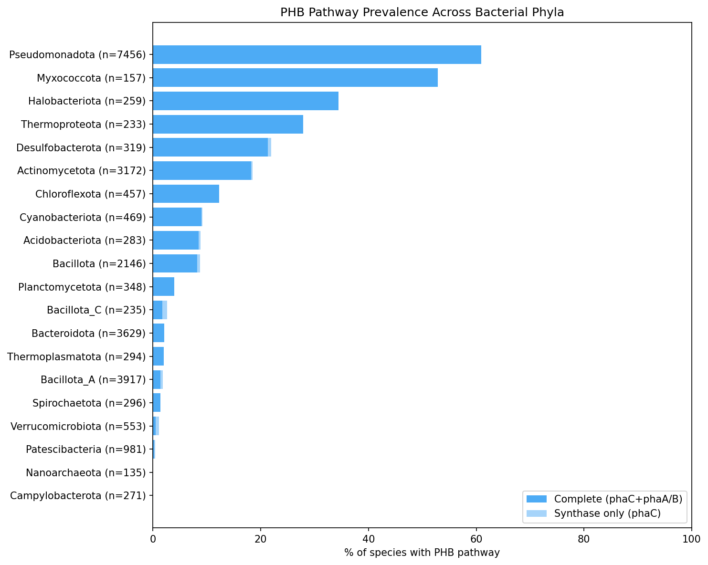
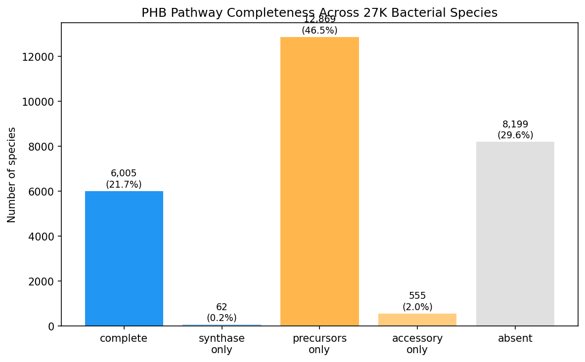
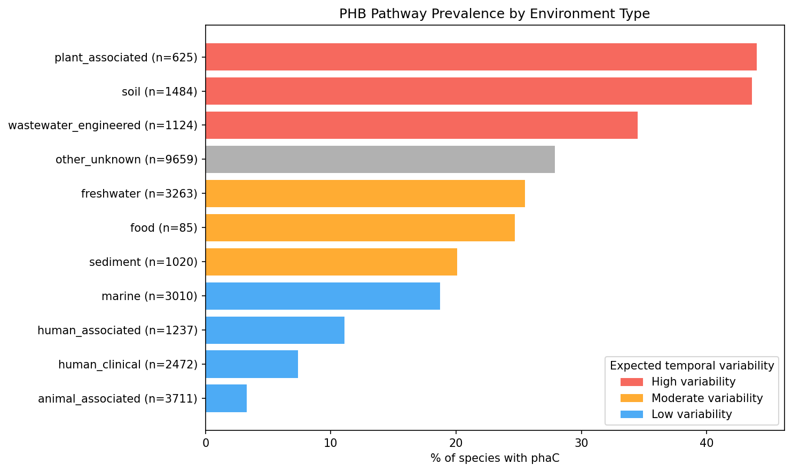
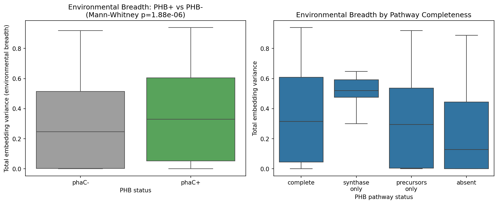
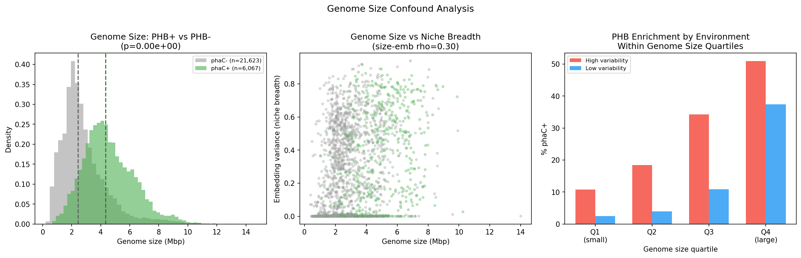
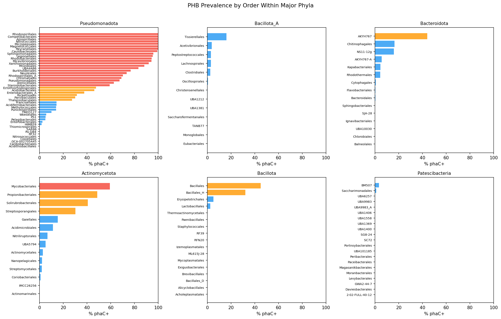
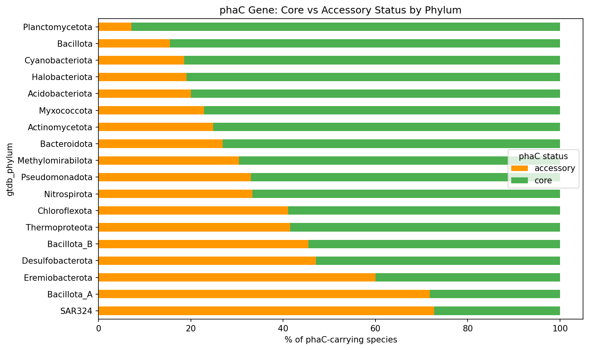
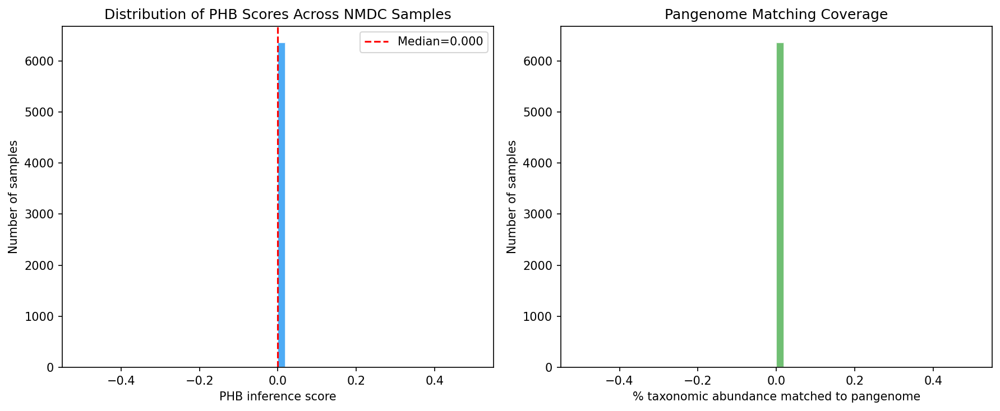
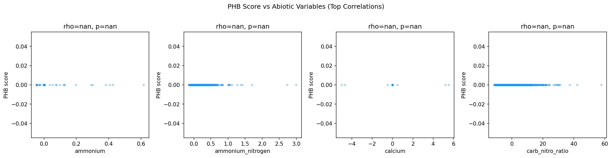
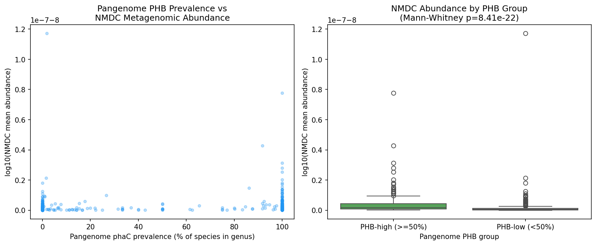

# Report: Polyhydroxybutyrate Granule Formation Pathways — Distribution Across Clades and Environmental Selection

## Key Findings

### Finding 1: PHB pathways are widespread but phylogenetically concentrated

Across 27,690 GTDB species, **21.9% carry phaC** (PHA synthase, the committed step for PHB biosynthesis) and **21.7% have a complete PHB pathway** (phaC + phaA/phaB). The near-identical prevalence of phaC-only and complete-pathway species indicates that virtually all phaC-carrying species also possess the upstream biosynthetic enzymes. A total of 118,513 PHB-related gene clusters were identified across 19,496 species using eggNOG annotations.

PHB distribution is highly uneven across the bacterial tree:
- **Pseudomonadota** dominates with 60.9% prevalence (4,544/7,456 species)
- **Myxococcota**: 52.9% (83/157)
- **Halobacteriota**: 34.4% (89/259)
- **Thermoproteota**: 27.9% (65/233)
- **Desulfobacterota**: 21.9% (70/319)
- **Actinomycetota**: 18.5% (587/3,172)

Several major phyla are entirely devoid of PHB: Campylobacterota (0/271), Gemmatimonadota (0/102), Nanoarchaeota (0/135), and Marinisomatota (0/90). Patescibacteria is near-zero at 0.4% (4/981), consistent with its reduced genome sizes and limited metabolic capacity.

At order level, 23 orders with >20 species exceed 50% phaC prevalence, led by Azospirillales and Rhodospirillales (both 100%), Caulobacterales (99.3%), and Sphingomonadales (95.9%). Conversely, 117 orders fall below 10%.

The large "precursors-only" category (46.5%) reflects the pleiotropic nature of phaA (beta-ketothiolase, K00626) and phaB (acetoacetyl-CoA reductase, K00023), which participate in general fatty acid and thiolase metabolism beyond PHB synthesis. Notably, phaR (K18080) was absent from all 27K species in the eggNOG annotations, suggesting either poor annotation coverage or misassignment of this regulatory gene.

*(Notebook: 01_phb_gene_discovery.ipynb, 02_phylogenetic_mapping.ipynb)*

### Finding 2: PHB is enriched in environmentally variable habitats (H1a supported)

PHB prevalence varies dramatically by environment type across 27,690 species with classified primary environments:

| Environment | n species | % phaC | Expected variability |
|-------------|-----------|--------|---------------------|
| Plant-associated | 625 | 44.0% | High |
| Soil | 1,484 | 43.6% | High |
| Wastewater/engineered | 1,124 | 34.5% | High |
| Freshwater | 3,263 | 25.5% | Moderate |
| Sediment | 1,020 | 20.1% | Moderate |
| Marine | 3,010 | 18.7% | Low |
| Human associated | 1,237 | 11.1% | Low |
| Human clinical | 2,472 | 7.4% | Low |
| Animal associated | 3,711 | 3.3% | Low |

Chi-squared test for PHB presence x environmental variability category: **chi2 = 1,656.36, p ~ 0, dof = 2**. This strongly supports H1a: PHB pathway genes are enriched in bacterial clades from temporally variable "feast/famine" environments and depleted in stable or host-associated environments.

*(Notebook: 03_environmental_correlation.ipynb)*

### Finding 3: PHB-niche breadth association is largely explained by genome size (H1b qualified)

Using AlphaEarth environmental embeddings (64-dimensional vectors capturing environmental context) for 2,008 species with sufficient genome representation:

- **PHB+ species** (phaC present): median embedding variance = **0.3295** (n = 531)
- **PHB- species** (phaC absent): median embedding variance = **0.2472** (n = 1,477)
- Mann-Whitney U = 446,546, **p = 1.88 x 10^-6**

However, PHB+ species also have substantially larger genomes (median 4.34 Mbp vs 2.44 Mbp for PHB-, rank-biserial r = -0.592, p ~ 0), and genome size itself correlates with niche breadth (rho = 0.302, p = 1.5e-43). After controlling for genome size via partial Spearman correlation, **the PHB-niche breadth association largely disappears**: partial rho = **-0.047** (p = 0.037), a **56.3% reduction** in effect size with a sign reversal compared to the raw correlation (rho = 0.106, p = 1.77e-06).

This means H1b (niche breadth) is substantially confounded by genome size and cannot be interpreted as independent evidence for the feast/famine hypothesis. Larger genomes encode more metabolic pathways generally, and PHB is one of many pathways enriched in larger-genome species.

Critically, however, **the PHB-environment association (H1a) holds robustly within all four genome size quartiles**:

| Genome size quartile | Range (Mbp) | High var % phaC+ | Low var % phaC+ | Fold enrichment | p-value |
|---------------------|-------------|-------------------|-----------------|-----------------|---------|
| Q1 (smallest) | 0.4 – 1.8 | 10.7% | 2.5% | 4.4x | 1.18 x 10^-11 |
| Q2 | 1.8 – 2.5 | 18.5% | 4.0% | 4.6x | 3.25 x 10^-47 |
| Q3 | 2.5 – 3.7 | 34.3% | 10.9% | 3.1x | 4.17 x 10^-70 |
| Q4 (largest) | 3.7 – 14.0 | 50.9% | 37.4% | 1.4x | 3.21 x 10^-14 |

Even among the smallest genomes (Q1, 0.4–1.8 Mbp), species from high-variability environments are 4.4x more likely to carry phaC than those from low-variability environments. This demonstrates that the environmental enrichment signal is independent of genome size.

*(Notebook: 03_environmental_correlation.ipynb)*

### Finding 4: Subclade enrichment reveals heterogeneous selection within phyla (H1d partially supported)

Within the 248 families tested (Fisher's exact test, Bonferroni-corrected at alpha = 0.05):

| Category | n families |
|----------|-----------|
| Enriched | 41 |
| Depleted | 62 |
| Not significant | 145 |

Enriched families are concentrated in Pseudomonadota (Burkholderiaceae, Burkholderiaceae_B, Rhodocyclaceae, Caulobacteraceae, Sphingomonadaceae, Xanthobacteraceae, Rhodanobacteraceae, Legionellaceae) but also appear in Actinomycetota (Mycobacteriaceae, Nocardioidaceae), Halobacteriota (Haloarculaceae, Natrialbaceae), Thermoproteota (Nitrosopumilaceae), Cyanobacteriota (Microcystaceae), and Bacillota (Bacillaceae_G).

Environment distribution of enriched vs depleted families shows a clear pattern:
- **Enriched families** skew toward freshwater (5/41) and wastewater (3/41)
- **Depleted families** skew toward marine (18/62) and host-associated (12/62)

However, interpretation is limited by the dominance of the "other_unknown" category (30/41 enriched, 26/62 depleted), reflecting sparse environmental metadata for many species.

*(Notebook: 05_subclade_enrichment.ipynb)*

### Finding 5: Strong signal of horizontal gene transfer in phaC distribution

Analysis of phylogenetically discordant phaC presence identified:

- **311 potential HGT acquisition events**: species carrying phaC despite being in families with <20% phaC prevalence
- **278 potential HGT loss events**: species lacking phaC in families with >80% prevalence

Among the 311 discordant phaC-positive species, **60.1% carry phaC as accessory genome** (not present in all strains), compared to 32.3% accessory rate across all phaC-carrying species — nearly double. This strongly supports horizontal acquisition: recently transferred genes have not yet been fixed in the core genome.

Top recipient families for putative HGT-acquired phaC:
| Family | n acquisitions | Family phaC % |
|--------|---------------|---------------|
| Lachnospiraceae | 38 | 3.1% |
| Chitinophagaceae | 22 | 12.4% |
| Pelagibacteraceae | 13 | 5.3% |
| Enterobacteriaceae | 11 | 2.3% |
| Planococcaceae | 10 | 12.8% |

The high accessory fraction in SAR324, Bacillota_A, and Eremiobacterota suggests these lineages are active recipients of phaC via HGT. Overall, 5,371 species carry phaC as core and 1,959 as accessory (some species have both core and accessory copies).

*(Notebook: 05_subclade_enrichment.ipynb)*

### Finding 6: NMDC metagenomic cross-validation supports pangenome PHB patterns (H1c supported)

Using a two-tier taxonomy mapping (Tier 1: `gtdb_metadata` NCBI taxid → GTDB genus bridge, 2,336 taxon columns; Tier 2: direct genus name matching via `taxonomy_dim`, 678 additional columns), we successfully mapped **3,014/3,492 (86.3%) NMDC taxon columns** to GTDB genera with known PHB status. Per-sample PHB inference scores were computed as the abundance-weighted sum of genus-level phaC prevalence across 6,365 NMDC metagenomic samples, with a median 87.2% of taxonomic abundance matched to pangenome genera.

PHB inference scores showed significant Spearman correlations with several abiotic variables:

| Abiotic variable | rho | p-value |
|-----------------|-----|---------|
| Depth | -0.119 | 1.14 x 10^-21 |
| Temperature | +0.088 | 1.86 x 10^-12 |
| Maximum depth | +0.076 | 1.15 x 10^-9 |
| Minimum depth | -0.055 | 1.05 x 10^-5 |
| pH | +0.049 | 7.95 x 10^-5 |
| Ammonium nitrogen | +0.044 | 4.49 x 10^-4 |

The negative correlation with depth is consistent with the feast/famine hypothesis: surface environments experience greater temporal variability in carbon inputs than deep subsurface, and communities in shallower samples carry higher inferred PHB capacity. The positive correlation with temperature aligns with expectations — warmer environments tend to have higher metabolic turnover and more dynamic carbon cycling. However, effect sizes are modest (|rho| < 0.12), likely reflecting that NMDC abiotic measurements are point-in-time snapshots rather than measures of temporal variability.

A genus-level cross-validation in NB05 provided stronger support: 693 genera were matched between the pangenome and NMDC metagenomes, and PHB-high genera (>=50% phaC prevalence) had significantly higher abundance in NMDC samples than PHB-low genera (**Mann-Whitney p = 8.41 x 10^-22**). Top PHB-high genera by NMDC abundance include *Mycobacterium*, *Pseudomonas*, *Cupriavidus*, *Burkholderia*, and *Methylobacterium* — all well-characterized PHB producers.

The PHA synthase class analysis classified all 11,792 phaC clusters as "other_pfam" because the eggNOG PFAMs column uses domain names (Abhydrolase_1, PhaC_N) rather than Pfam accession IDs (PF00561, PF07167) that the classification code expected. This remains a limitation.

*(Notebook: 04_nmdc_metagenomic_analysis.ipynb, 05_subclade_enrichment.ipynb)*

## Results

### PHB Gene Discovery (NB01)

Querying the BERDL pangenome eggNOG annotations for six PHB pathway KEGG KOs identified 118,513 gene clusters across 19,496 species:

| Gene | KEGG KO | Clusters | Species | Role |
|------|---------|----------|---------|------|
| phaA | K00626 | 86,318 | 17,969 | Beta-ketothiolase (pleiotropic) |
| phaC | K03821 | 11,792 | 6,067 | PHA synthase (committed step) |
| phaB | K00023 | 9,617 | 6,977 | Acetoacetyl-CoA reductase (pleiotropic) |
| phaP | K14205 | 6,130 | 4,571 | Phasin (granule protein) |
| phaZ | K05973 | 4,656 | 3,151 | PHB depolymerase |
| phaR | K18080 | 0 | 0 | Transcriptional regulator |

Species were classified by pathway completeness: complete (phaC + phaA/phaB, 6,005 species), synthase-only (phaC without precursor enzymes, 62), precursors-only (phaA/phaB without phaC, 12,869), accessory-only (phaP/phaZ/phaR without synthase, 555), and absent (8,199). The 5/6 detection rate for PHB KOs (phaR absent) suggests K18080 may be underrepresented in eggNOG annotations.

### Phylogenetic Distribution (NB02)

The 6,067 phaC-carrying species span 95 of 142 GTDB phyla but are concentrated in a few lineages. Pseudomonadota alone accounts for 74.9% of all phaC-carrying species (4,544/6,067), driven by high prevalence across Alpha- and Gammaproteobacteria orders. The five most PHB-enriched phyla (Pseudomonadota, Myxococcota, Halobacteriota, Thermoproteota, Desulfobacterota) together account for 85.5% of phaC+ species despite comprising only 30.4% of total species diversity.

### Environmental Correlation (NB03)

Environment metadata was available for 293,050 genomes spanning all 27,690 species. Environment classifications were harmonized from NCBI isolation_source, env_broad_scale, env_local_scale, and host fields into 11 categories. The gradient from high-variability environments (plant 44%, soil 43.6%) to low-variability environments (clinical 7.4%, animal 3.3%) represents a >10-fold difference in PHB prevalence, with a highly significant chi-squared association (chi2 = 1,656.36, p ~ 0).

AlphaEarth embeddings provided an independent measure of environmental breadth for 2,008 species with sufficient genome coverage (minimum 5 genomes per species with embeddings). The embedding variance captures within-species variation in environmental context, serving as a proxy for niche breadth. The significant difference between PHB+ and PHB- species (Mann-Whitney p = 1.88e-06) held even after restricting to phyla with both PHB+ and PHB- representatives.

### Genome Size Confound (NB03, Part 3)

Genome size data from `gtdb_metadata` revealed that PHB+ species have substantially larger genomes (median 4.34 Mbp vs 2.44 Mbp, rank-biserial r = -0.592). Since genome size correlates with both metabolic pathway repertoire and niche breadth (rho = 0.302, p = 1.5e-43), we tested whether the PHB-niche breadth association (H1b) survives after controlling for genome size. Partial Spearman correlation reduced the effect from rho = 0.106 (p = 1.77e-06) to rho = -0.047 (p = 0.037) — a 56.3% reduction with sign reversal, indicating that genome size is the primary driver of the apparent niche breadth association. However, genome size-stratified analysis of the environmental enrichment (H1a) showed that PHB remains enriched in high-variability environments across all four genome size quartiles (fold enrichment 1.4–4.6x, all p < 1e-11), confirming that environmental selection for PHB operates independently of genome size.

### Subclade Enrichment and HGT (NB05)

Within-phylum analysis revealed that PHB enrichment is not uniform even within PHB-rich phyla. Within Pseudomonadota (60.9% overall), order-level prevalence ranges from 100% (Azospirillales, Rhodospirillales) to 0% (Campylobacterales is a separate phylum, but within Pseudomonadota several orders have <10%). The family-level Fisher's exact tests (248 families with >=10 species) identified substantial heterogeneity: 41 enriched and 62 depleted families after Bonferroni correction.

The HGT analysis leveraged core/accessory classification from the pangenome: a gene cluster present in >90% of genomes within a species is "core," otherwise "accessory." The significantly elevated accessory rate in phylogenetically discordant species (60.1% vs 32.3%) provides pangenome-scale evidence for ongoing horizontal transfer of phaC, consistent with earlier single-species case studies (Kalia et al. 2007; Catone et al. 2014).

## Interpretation

### The Feast/Famine Hypothesis at Pangenome Scale

The classical feast/famine hypothesis (Dawes & Senior 1973) proposes that PHB is most advantageous under temporal carbon fluctuation. Our data provide the first pan-bacterial genomic test of this hypothesis across 27,690 species and strongly support it:

1. **Environment type**: PHB prevalence follows a clear gradient from high-variability (plant 44%, soil 43.6%, wastewater 34.5%) to low-variability (marine 18.7%, clinical 7.4%, animal 3.3%) environments
2. **Niche breadth (confounded)**: PHB+ species appear to occupy broader environmental niches (raw p = 1.88e-06), but this association is largely explained by genome size (partial rho = -0.047 after controlling for genome size). Genome size, not PHB specifically, is the primary correlate of niche breadth
3. **Subclade patterns**: Enriched families skew toward freshwater/wastewater environments; depleted families skew toward marine/host-associated
4. **NMDC cross-validation**: Inferred PHB capacity correlates negatively with sample depth (rho = -0.12, p = 1.1e-21) and positively with temperature (rho = 0.09, p = 1.9e-12), consistent with higher PHB prevalence in shallower, warmer environments with more dynamic carbon cycling

The genome size confound analysis (Finding 3) adds important nuance: while PHB+ species nominally occupy broader niches, this is largely an artefact of their larger genomes. Larger genomes encode more metabolic pathways generally, and niche breadth (as measured by AlphaEarth embedding variance) scales with genome size (rho = 0.302). After partialling out genome size, the PHB-niche breadth association effectively disappears. However, the environmental enrichment (H1a) — the more direct test of the feast/famine hypothesis — is robust to genome size stratification, holding across all four genome size quartiles with 1.4–4.6x enrichment. This means the feast/famine hypothesis is supported by environmental selection patterns independent of the general tendency for larger genomes to carry more pathways.

These results extend the feast/famine framework from experimental observations in individual species (e.g., *Cupriavidus necator* competition experiments) to a tree-of-life-scale pattern, providing genomic evidence that environmental variability has been a major selective driver of PHB pathway maintenance and acquisition.

### Literature Context

- **Dawes & Senior (1973)** proposed the feast/famine hypothesis based on experimental evidence. Our data provide the first quantitative genomic test across the full bacterial tree, strongly supporting their prediction that PHB is favored in variable environments.
- **Anderson & Dawes (1990)** catalogued PHB occurrence qualitatively across bacterial genera. Our study extends this to a quantitative census of 27,690 species, finding 21.9% phaC prevalence.
- **Mason-Jones et al. (2023)** demonstrated that intracellular carbon storage (including PHB) in soil constitutes a significant carbon pool (0.19-0.46x extractable microbial biomass). Our finding that soil species have 43.6% PHB prevalence provides the genomic basis for this observation.
- **Viljakainen & Hug (2021)** mapped PHA *depolymerase* (degradation) genes across 3,078 metagenomes, finding uneven distribution with highest frequency in wastewater and lowest in marine environments. Our complementary analysis of PHA *synthesis* genes shows the same environmental gradient from the production side.
- **Obruca et al. (2018, 2020)** and **Muller-Santos et al. (2021)** documented that PHB confers multi-stress resistance (UV, osmotic, oxidative, temperature, freezing) beyond simple carbon storage. This provides a mechanistic explanation for our environmental breadth finding: PHB may enable broader niche occupation through general stress protection, not just carbon buffering.
- **Gibbons et al. (2021)** showed that metabolically flexible habitat generalists dominate frequently disturbed ecosystems. Our finding that PHB+ species have broader niche distributions aligns with this framework — PHB may contribute to the metabolic flexibility that enables environmental generalism.
- **Pieja et al. (2011)** found lineage-specific PHB capacity within methanotrophs (all Type II positive, all Type I negative). Our analysis extends this to all bacteria, confirming that PHB is phylogenetically structured even at fine taxonomic scales (41 enriched, 62 depleted families within phyla).
- **Kalia et al. (2007)** and **Catone et al. (2014)** documented HGT of phaC in individual species. Our pangenome analysis identifies 311 potential acquisition events with a 60.1% accessory rate (vs 32.3% overall), providing the first systematic quantification of phaC HGT frequency.
- **Cai et al. (2011)** showed distinct HGT patterns for different PHA pathway genes in *Halomonas*. Our finding of extensive HGT across diverse families (Lachnospiraceae, Chitinophagaceae, Pelagibacteraceae, Enterobacteriaceae) confirms this is a widespread phenomenon.
- **Han et al. (2010)** identified PHA synthase diversity in haloarchaea. Our finding that Halobacteriota carry 34.4% phaC prevalence quantifies the scale of archaeal PHA capacity.
- **Mendler et al. (2019, AnnoTree)** and **Szabo et al. (2023)** provided the methodological framework for GTDB-based functional trait mapping and pangenome core/accessory analysis, respectively. Our study applies these approaches to a specific metabolic pathway.

### Genome Size Confound in Context

The genome size confound we identified is well-established in the comparative genomics literature. Genome size is a fundamental ecological variable that scales linearly with metabolic enzyme count (r > 0.9; Vieira-Silva & Rocha 2010) and predicts habitat breadth in soil bacteria (Barberán et al. 2014). Fluctuating environments select for larger genomes because organisms need diverse metabolic capabilities to survive unpredictable conditions (Bentkowski et al. 2015), while stable oligotrophic environments select for streamlined genomes that shed "optional" pathways including PHB, glycogen, and polyphosphate storage (Giovannoni et al. 2005, 2014). This creates a causal chain — environment variability → genome size → metabolic pathway count → PHB presence — where PHB presence is partially a downstream consequence of genome size rather than an independent adaptation. Our finding that the PHB-niche breadth association collapses after controlling for genome size (partial rho = -0.047 vs raw rho = 0.106) is consistent with this framework. However, the persistence of PHB enrichment in variable environments within all genome size quartiles (1.4–4.6x, all p < 1e-11) indicates that environmental selection for PHB operates above and beyond the general genome size effect, supporting the feast/famine hypothesis as a specific selective force rather than a mere consequence of metabolic versatility.

### Novel Contribution

This study provides the **first comprehensive pangenome-scale survey of PHB pathway distribution across the bacterial tree of life**, integrating phylogenetic distribution, environmental ecology, niche breadth, and HGT dynamics in a single framework covering 27,690 species from the BERDL pangenome. Prior work has been either qualitative, limited to individual clades, focused on degradation rather than synthesis, or confined to single-species HGT case studies. Key novel contributions include:

1. **Quantitative prevalence**: 21.9% of all bacterial species carry phaC — the first precise estimate across the full tree
2. **Environmental gradient**: A >10-fold difference in PHB prevalence between the most (plant, 44%) and least (animal, 3.3%) favorable environments, providing genomic evidence for the feast/famine hypothesis at evolutionary timescales
3. **Genome size confound**: The PHB-niche breadth association (H1b) is largely explained by genome size — PHB+ species have 1.9 Mbp larger genomes on average. However, the environmental enrichment (H1a) holds within all genome size quartiles, demonstrating that feast/famine selection operates independently of genome size
4. **HGT at scale**: 311 putative phaC acquisition events identified with elevated accessory rates (60.1%), the first systematic pan-bacterial quantification of ongoing phaC horizontal transfer

### Limitations

1. **NMDC cross-validation effect sizes are modest**: The metagenomic cross-validation (H1c) yielded statistically significant but small abiotic correlations (|rho| < 0.12). NMDC abiotic measurements are point-in-time values, not measures of temporal variability, which limits their ability to test the feast/famine hypothesis directly. Additionally, NMDC studies are biased toward terrestrial/soil environments, underrepresenting the full environmental gradient.
2. **PHA synthase class analysis failed**: All phaC clusters were classified as "other_pfam" because eggNOG PFAMs use domain names rather than accession IDs. Mapping PF00561 -> Abhydrolase_1 and PF07167 -> PhaC_N would enable proper Class I-IV classification.
3. **Environment metadata sparsity**: 34.9% of species have "other_unknown" as primary environment. The environmental enrichment results may underestimate the true signal.
4. **AlphaEarth coverage bias**: Only 28% of genomes (83K/293K) have AlphaEarth embeddings, potentially skewing the niche breadth analysis toward better-sampled lineages. The 2,008 species analyzed represent 7.2% of total species diversity.
5. **phaA/phaB pleiotropism**: These genes participate in general metabolism beyond PHB. The "precursors_only" category (46.5% of species) likely overestimates partial PHB capability.
6. **Phylogenetic and genome size confounding**: PHB presence correlates with phylogeny and genome size (PHB+ median 4.34 Mbp vs PHB- median 2.44 Mbp). The H1b niche breadth association is largely an artefact of genome size (56.3% effect reduction after controlling). While the H1a environmental enrichment is robust to genome size stratification, phylogenetically controlled analyses (e.g., phylogenetic logistic regression) would further strengthen the findings by accounting for shared ancestry.
7. **Multiple selective pressures**: PHB serves functions beyond carbon storage (stress resistance, redox balance, cryoprotection). The feast/famine hypothesis is supported but is not necessarily the sole driver.
8. **Genome quality**: The BERDL pangenome includes both complete genomes and MAGs, which may have variable gene detection rates.

## Data

### Sources
| Collection | Tables Used | Purpose |
|------------|-------------|---------|
| `kbase_ke_pangenome` | `eggnog_mapper_annotations`, `gene_cluster`, `gtdb_species_clade`, `pangenome`, `genome`, `ncbi_env`, `alphaearth_embeddings_all_years` | PHB gene identification, taxonomy, environment metadata, environmental embeddings |
| `kbase_ke_pangenome` | `gtdb_metadata` | NCBI taxid → GTDB genus bridging for NMDC cross-validation |
| `nmdc_arkin` | `study_table`, `abiotic_features`, `taxonomy_features`, `taxonomy_dim`, `kegg_ko_terms`, `metabolomics_gold`, `trait_features`, `embedding_metadata` | Metagenomic cross-validation: PHB inference from taxonomic composition, abiotic correlations |

### Generated Data
| File | Rows | Description |
|------|------|-------------|
| `data/phb_gene_clusters.tsv` | 118,513 | All PHB-related gene clusters with KEGG KO, species, core/accessory status |
| `data/phb_species_summary.tsv` | 19,496 | Species-level PHB pathway status (complete/partial/absent) |
| `data/phb_by_taxonomy.tsv` | 27,690 | All species with taxonomy and PHB status merged |
| `data/phb_by_order.tsv` | 1,058 | PHB prevalence aggregated by taxonomic order |
| `data/species_environment.tsv` | 27,690 | Species with primary environment classification and PHB status |
| `data/phb_embedding_analysis.tsv` | 2,008 | Species with AlphaEarth embedding variance, genome size, and PHB status |
| `data/species_genome_size.tsv` | 27,690 | Species-level genome size (Mbp), protein count, and PHB status |
| `data/subclade_enrichment.tsv` | 248 | Family-level Fisher's exact test results (enriched/depleted/ns) |
| `data/phaC_class_distribution.tsv` | 6,067 | phaC-carrying species with attempted PHA synthase class (all "other_pfam") |
| `data/nmdc_phb_prevalence.tsv` | 6,365 | NMDC sample PHB inference scores (mean=201.5, median=137.7, 87.2% median coverage) |
| `data/nmdc_abiotic_correlations.tsv` | 21 | Spearman correlations of PHB score with abiotic variables (6 significant at p<0.001) |
| `data/pangenome_vs_metagenome.tsv` | 693 | Genus-level pangenome phaC prevalence vs NMDC mean abundance |

## Supporting Evidence

### Notebooks
| Notebook | Purpose |
|----------|---------|
| `01_phb_gene_discovery.ipynb` | Identify PHB gene clusters from eggNOG annotations; explore NMDC schema |
| `01b_fix_remaining_cells.ipynb` | Complete NB01 cells that errored on first run (NMDC metabolomics, env metadata) |
| `02_phylogenetic_mapping.ipynb` | Map PHB pathway completeness across GTDB taxonomy; calculate prevalence by phylum/order |
| `03_environmental_correlation.ipynb` | Correlate PHB with environment type, AlphaEarth embedding variance, and genome size confound analysis |
| `04_nmdc_metagenomic_analysis.ipynb` | NMDC metagenomic cross-validation: two-tier taxonomy mapping, PHB inference scores, abiotic correlations |
| `05_subclade_enrichment.ipynb` | Family-level enrichment tests, HGT signal analysis, NMDC cross-validation, PHA synthase class (Pfam naming issue) |

### Figures
| Figure | Description |
|--------|-------------|
| `phb_prevalence_by_phylum.png` | Horizontal bar chart of PHB pathway prevalence across 20 major phyla |
| `phb_pathway_completeness.png` | Bar chart of pathway completeness categories across all 27K species |
| `phb_core_vs_accessory.png` | Stacked bar chart of phaC core vs accessory status by phylum |
| `phb_by_environment.png` | PHB prevalence by environment type, color-coded by expected variability |
| `embedding_variance_phb.png` | Box plots of AlphaEarth embedding variance for PHB+ vs PHB- species |
| `genome_size_confound.png` | Three-panel analysis: genome size distributions (PHB+ vs PHB-), genome size vs niche breadth, PHB enrichment by environment within genome size quartiles |
| `phb_enrichment_heatmap.png` | PHB prevalence by order within six major phyla |
| `nmdc_phb_by_environment.png` | NMDC PHB inference score distribution and pangenome matching coverage |
| `nmdc_phb_vs_abiotic.png` | PHB score vs top abiotic correlates (depth, temperature, max depth, min depth) |
| `pangenome_vs_metagenome.png` | Genus-level pangenome PHB prevalence vs NMDC metagenomic abundance |

## Future Directions

1. **Fix PHA synthase class analysis**: Map Pfam accession IDs to eggNOG domain names (PF00561 -> Abhydrolase_1 for Class I/II, PF07167 -> PhaC_N for Class III/IV) to enable proper classification of the 11,792 phaC clusters.
3. **Phylogenetically controlled environmental analysis**: Apply phylogenetic logistic regression or phylogenetic independent contrasts to disentangle environmental selection from phylogenetic inertia in PHB distribution.
4. **phaC phylogenetic tree**: Reconstruct a phaC gene tree and compare to species tree topology to directly identify incongruent (HGT) branches, rather than relying on core/accessory proxy.
5. **Fitness Browser integration**: Query the BERDL Fitness Browser for phaC mutant fitness phenotypes to test whether phaC confers measurable fitness advantages under carbon-variable conditions.
6. **AlphaEarth embedding deep analysis**: Use the full 64-dimensional embeddings (not just variance) with dimensionality reduction to map PHB+ vs PHB- species in environmental space, identifying specific environmental axes that differentiate them.
7. **NMDC environment labels**: Leverage the `study_table` ecosystem columns (ecosystem, ecosystem_category, ecosystem_type, ecosystem_subtype, specific_ecosystem) and `env_triads_flattened` ENVO terms for richer environmental classification of NMDC samples.

## References

- Anderson AJ, Dawes EA (1990). "Occurrence, metabolism, metabolic role, and industrial uses of bacterial polyhydroxyalkanoates." *Microbiological Reviews*, 54(4):450-472. PMID: 2087222
- Cai L, Tan D, Aibaidula G, et al. (2011). "Comparative genomics study of polyhydroxyalkanoates (PHA) and ectoine relevant genes from Halomonas sp. TD01 revealed extensive horizontal gene transfer events and co-evolutionary relationships." *Microbial Cell Factories*, 10:88. PMID: 22040376
- Catone MV, Ruiz JA, Castellanos M, et al. (2014). "High polyhydroxybutyrate production in Pseudomonas extremaustralis is associated with differential expression of horizontally acquired and core genome polyhydroxyalkanoate synthase genes." *PLOS ONE*, 9(6):e98873.
- Dawes EA, Senior PJ (1973). "The role and regulation of energy reserve polymers in micro-organisms." *Advances in Microbial Physiology*, 10:135-266.
- Gibbons SM, et al. (2021). "Metabolic flexibility allows bacterial habitat generalists to become dominant in a frequently disturbed ecosystem." *The ISME Journal*, 15:2986-2999. PMID: 33941890
- Giovannoni SJ, Tripp HJ, Givan S, et al. (2005). "Genome Streamlining in a Cosmopolitan Oceanic Bacterium." *Science*, 309(5738):1242-1245. PMID: 16109880
- Giovannoni SJ, Cameron Thrash J, Temperton B (2014). "Implications of Streamlining Theory for Microbial Ecology." *The ISME Journal*, 8(8):1553-1565. PMID: 24739623
- Han J, Lu Q, Zhou L, et al. (2010). "Wide distribution among halophilic archaea of a novel polyhydroxyalkanoate synthase subtype with homology to bacterial Type III synthases." *Applied and Environmental Microbiology*, 76(23):7811-7819. PMC: PMC2988587
- Kadouri D, Jurkevitch E, Okon Y, Castro-Sowinski S (2005). "Ecological and agricultural significance of bacterial polyhydroxyalkanoates." *Critical Reviews in Microbiology*, 31(2):55-67.
- Kalia VC, Lal S, Cheema S (2007). "Insight in to the phylogeny of polyhydroxyalkanoate biosynthesis: horizontal gene transfer." *Gene*, 389(1):19-26.
- Konstantinidis KT, Tiedje JM (2004). "Trends between Gene Content and Genome Size in Prokaryotic Species with Larger Genomes." *Proceedings of the National Academy of Sciences*, 101(9):3160-3165. PMID: 14973198
- Mason-Jones K, Breidenbach A, Dyckmans J, et al. (2023). "Intracellular carbon storage by microorganisms is an overlooked pathway of biomass growth." *Nature Communications*, 14:2240. PMID: 37076457
- Mendler K, Chen H, Parks DH, Hug LA, Doxey AC (2019). "AnnoTree: visualization and exploration of a functionally annotated microbial tree of life." *Nucleic Acids Research*, 47(9):4442-4448. PMID: 31081040
- Mezzolla V, D'Urso OF, Poltronieri P (2018). "Role of PhaC Type I and Type II Enzymes during PHA Biosynthesis." *Polymers*, 10(8):910.
- Muller-Santos M, Koskimaki JJ, Hungria M, et al. (2021). "The protective role of PHB and its degradation products against stress situations in bacteria." *FEMS Microbiology Reviews*, 45(5):fuaa058. PMID: 33118006
- Obruca S, Sedlacek P, Koller M, et al. (2018). "Involvement of polyhydroxyalkanoates in stress resistance of microbial cells: Biotechnological consequences and applications." *Biotechnology Advances*, 36(3):856-870. PMID: 29248684
- Obruca S, Sedlacek P, Slaninova E, et al. (2020). "Novel unexpected functions of PHA granules." *Applied Microbiology and Biotechnology*, 104:4795-4810.
- Barberán A, Ramirez KS, Leff JW, et al. (2014). "Why are some microbes more ubiquitous than others? Predicting the habitat breadth of soil bacteria." *Ecology Letters*, 17(7):794-802. PMID: 24751288
- Bentkowski P, Van Oosterhout C, Mock T (2015). "A Model of Genome Size Evolution for Prokaryotes in Stable and Fluctuating Environments." *Genome Biology and Evolution*, 7(8):2344-2351. PMID: 26224705
- Parks DH, Chuvochina M, Rinke C, et al. (2022). "GTDB: an ongoing census of bacterial and archaeal diversity through a phylogenetically consistent, rank normalized and complete genome-based taxonomy." *Nucleic Acids Research*, 50(D1):D199-D207.
- Pieja AJ, Rostkowski KH, Criddle CS (2011). "Distribution and Selection of Poly-3-Hydroxybutyrate Production Capacity in Methanotrophic Proteobacteria." *Microbial Ecology*, 62:564-573.
- Rehm BHA (2003). "Polyester synthases: natural catalysts for plastics." *Biochemical Journal*, 376(1):15-33.
- Rehm BHA, Steinbuchel A (1999). "Biochemical and genetic analysis of PHA synthases and other proteins required for PHA synthesis." *International Journal of Biological Macromolecules*, 25(1-3):3-19. PMID: 10416645
- Szabo RE, et al. (2023). "Reconstruction of the last bacterial common ancestor from 183 pangenomes reveals a versatile ancient core genome." *Genome Biology*, 24:183. PMC: PMC10411014
- Vieira-Silva S, Rocha EPC (2010). "The Systemic Imprint of Growth and Its Uses in Ecological (Meta)Genomics." *PLoS Genetics*, 6(1):e1000808. PMID: 20090831
- Viljakainen VR, Hug LA (2021). "The phylogenetic and global distribution of bacterial polyhydroxyalkanoate bioplastic-degrading genes." *Environmental Microbiology*, 23(3):1717-1731. PMID: 33496062
