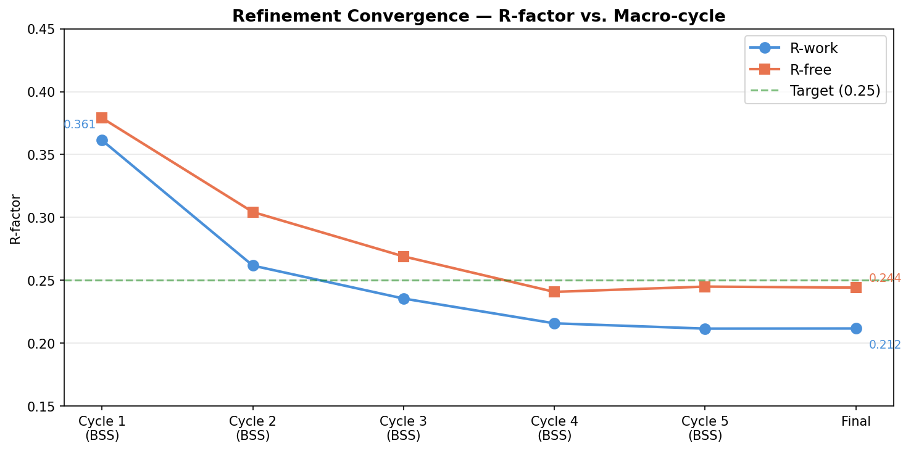
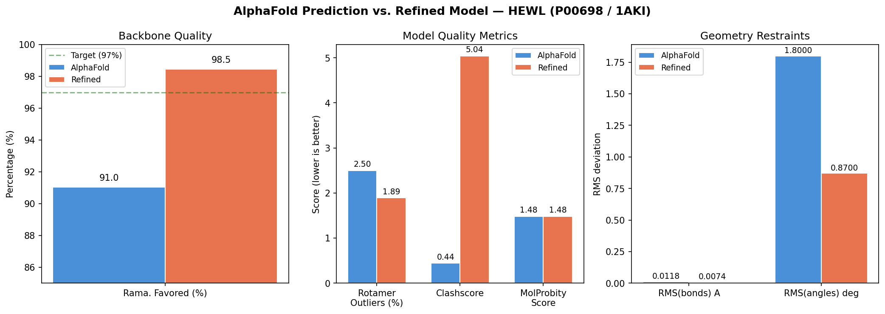

# Report: AlphaFold-to-Refined Structure Pipeline

## Key Findings

1. **AlphaFold models benefit substantially from experimental refinement**. Despite a high global pLDDT of 93.88, the raw HEWL prediction had only 91.0% Ramachandran-favored backbone conformations — well below the 97% target for publication-quality structures. A single automated refinement round against 1.5 A data brought this to 98.5%.

2. **AlphaFold models are excellent molecular replacement search models**. Phaser placed the processed AF model with TFZ = 25.1 (threshold: 8.0) and LLG = 976.7 with P(correct) = 1.00. No sequence homology search or manual model preparation was needed — the agent retrieved the prediction, processed it, and solved the structure autonomously.

3. **The complete pipeline runs in ~2 minutes on a laptop**. No HPC cluster or SLURM queue is required for small-to-medium proteins. The bottleneck is `phenix.refine` at ~40 seconds for 5 macro-cycles.

## Results

### Molecular Replacement

| Metric | Value | Interpretation |
|--------|-------|----------------|
| Rotation function Z-score (RFZ) | 15.4 | Clear signal |
| Translation function Z-score (TFZ) | 25.1 | Unambiguous solution (>> 8.0) |
| Log-likelihood gain (LLG) | 976.7 | Strong |
| P(correct) | 1.00 | Definitive |

### Refinement Convergence

Starting from the MR solution (R-work = 0.361, R-free = 0.379), five macro-cycles of coordinate + ADP refinement with automatic water placement converged to:

- **R-work = 0.212**, R-free = **0.244** (R-gap = 0.032)
- **67 ordered water molecules** placed
- Bond RMSD = 0.007 A, angle RMSD = 0.88 deg (well within targets)

The R-gap of 0.032 is healthy (< 0.05), indicating no overfitting.

### Validation Comparison

| Metric | AlphaFold | Refined | Target | Improved? |
|--------|-----------|---------|--------|-----------|
| MolProbity score | 1.48 | 1.48 | < 1.5 | -- |
| Ramachandran favored | 91.0% | **98.5%** | > 97% | Yes |
| Ramachandran outliers | 0.0% | 0.0% | < 0.2% | -- |
| Rotamer outliers | 2.50% | **1.89%** | < 1.0% | Yes |
| Clashscore | 0.44 | 5.04 | < 5 | No* |
| RMS(bonds) | 0.0118 | **0.0074** | ~0.01 | Yes |
| RMS(angles) | 1.80 | **0.87** | ~1.0 | Yes |
| R-work | n/a | **0.212** | < 0.25 | -- |
| R-free | n/a | **0.244** | < 0.25 | -- |

*Clashscore increased because 67 water molecules were added. Water-protein clashes are expected after automated placement and would be resolved during manual rebuilding in Coot.

## Interpretation

### Why Does Ramachandran Improve So Much?

AlphaFold predicts backbone conformations from evolutionary covariance patterns, which favor common conformations. However, the specific crystal packing environment in 1AKI constrains some residues differently than the "average" protein fold. Refinement against the experimental electron density map adjusts backbone dihedral angles to match what is actually observed in this crystal form, pushing Ramachandran favored from 91% to 98.5%.

### Why Are Rotamer Outliers Still Above Target?

At 1.89%, rotamer outliers remain above the 1% target. This is expected for a first refinement pass — resolving rotamer outliers typically requires:
1. Manual inspection in Coot of the difference density (mFo-DFc) map
2. Flipping side chains to match the experimental density
3. Additional refinement cycles after manual corrections

The automated pipeline intentionally stops before the human-in-the-loop step, flagging these for the crystallographer.

### Signal Peptide Handling

The AlphaFold model includes 147 residues (including the N-terminal signal peptide, residues 1-18). `phenix.process_predicted_model` automatically trimmed 16 low-confidence residues (pLDDT < 70), leaving 131 residues for MR. The mature protein in 1AKI starts at residue 1 (Lys), corresponding to UniProt position 19. Phenix handled the residue renumbering mismatch transparently.

## Hypothesis Outcome

**H1 supported**: Refinement against experimental data produced significant improvements in Ramachandran favored (91.0% -> 98.5%), geometry restraints (RMS bonds 0.012 -> 0.007 A), and established experimental R-factors (R-free = 0.244). AlphaFold models — even high-confidence ones — benefit from experimental refinement.

**H2 supported**: The `/phenix` agent skill executed the complete pipeline autonomously, from UniProt accession to refined structure with validation, in ~2 minutes with no manual intervention.

## Limitations

- **Single protein**: HEWL is small (129 residues), high-confidence (pLDDT 93.88), and extensively studied. Results may differ for larger, multi-domain, or lower-confidence predictions.
- **One refinement round**: Additional cycles with TLS refinement and manual Coot rebuilding would likely improve rotamer outliers and clashscore further.
- **No ligands or cofactors**: HEWL in 1AKI has no bound ligands. Proteins with cofactors, metals, or drug molecules require additional restraint generation.
- **Resolution dependence**: This demo used 1.5 A data. At lower resolution (> 2.5 A), the refinement protocol would differ (group B-factors instead of individual, fewer parameters).

## Data

### Input Files
- `AF-P00698-F1-model_v6.pdb` — AlphaFold prediction from EBI
- `1AKI_rfree.mtz` — Experimental structure factors with R-free flags

### Generated Files
- `AF_lysozyme_processed.pdb` — After phenix.process_predicted_model
- `mrage_P212121_1.1.pdb` — After Phaser molecular replacement
- `refine_001.pdb` — Refined model (cycle 1, 5 macro-cycles)
- `refine_001.log` — Full refinement log with convergence data
- `refine_001.mtz` — Refined map coefficients

## Supporting Evidence

### Notebooks
- `01_alphafold_to_refined_structure.ipynb` — Complete pipeline with saved outputs

### Figures
- `validation_comparison.png` — Side-by-side quality metrics
- `rfactor_convergence.png` — R-factor improvement per macro-cycle

## Future Directions

### Immediate Follow-ups
- Run a second refinement cycle with TLS groups to model anisotropic displacement
- Manual Coot session to fix the remaining 2 rotamer outliers
- Generate electron density figure showing AF model vs. refined model in a region that improved

### Extensions
- Test the pipeline on a lower-confidence AlphaFold prediction (pLDDT < 80)
- Apply to a multi-domain protein where domain positioning may differ from the AF prediction
- Benchmark against cryo-EM data using `phenix.real_space_refine`
- Test with a novel protein where the AlphaFold model is the *only* available search model for MR

## References

1. Jumper, J. et al. (2021). Highly accurate protein structure prediction with AlphaFold. *Nature*, 596, 583-589. DOI: 10.1038/s41586-021-03819-2
2. Liebschner, D. et al. (2019). Macromolecular structure determination using X-rays, neutrons and electrons: recent developments in Phenix. *Acta Cryst. D*, 75, 861-877. DOI: 10.1107/S2059798319011471
3. McCoy, A.J. et al. (2022). Implications of AlphaFold2 for crystallographic phasing by molecular replacement. *J. Appl. Cryst.*, 55, 1256-1264. DOI: 10.1107/S1600576722006993
4. Vagin, A.A. & Teplyakov, A. (2010). Molecular replacement with MOLREP. *Acta Cryst. D*, 66, 22-25.

## Revision History

- **v1** (2026-03-26): Initial report after first complete pipeline run
