# Report: Plant Microbiome Ecotypes — Compartment-Specific Functional Guilds and Their Genetic Architecture

## Key Findings

### 1. Plant compartments impose strong functional selection on microbial communities (H1)

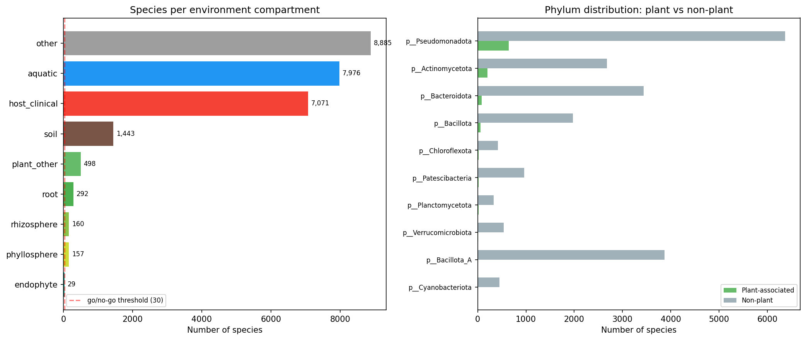

Analysis of 293,059 bacterial/archaeal genomes classified 1,136 species as plant-associated across four compartments: root (292 species), rhizosphere (160), phyllosphere (157), and endophyte (29). PERMANOVA on a 25-marker functional profile matrix revealed that compartment identity explains 53% of variance in microbial functional capabilities (pseudo-F=235.1, R²=0.527, p=0.001, 999 permutations).

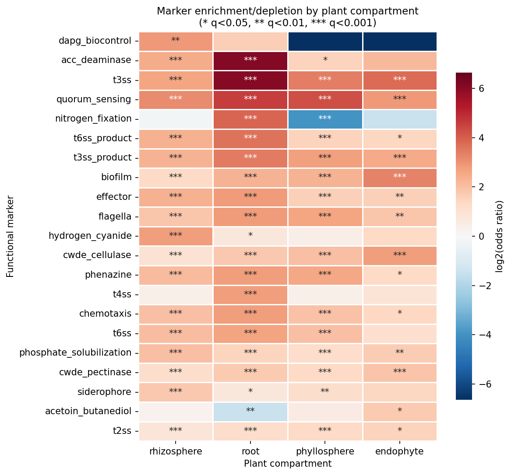

Root-associated species showed the strongest functional specialization: ACC deaminase (OR=69.3, p=6.2e-156), T3SS (OR=65.6, p=2.5e-106), nitrogen fixation (OR=14.5, p=1.7e-97), and quorum sensing (OR=24.1, p=6.0e-76) were all massively enriched. Phyllosphere species were enriched in quorum sensing (OR=19.4) and T3SS (OR=10.7) but not nitrogen fixation. A chi-square test confirmed significant association between cohort type and compartment (chi²=17.8, p=6.7e-3).

*(Notebooks: 01_genome_census.ipynb, 04_compartment_profiling.ipynb)*

### 2. Beneficial genes are core-encoded; pathogenic genes are accessory (H2)

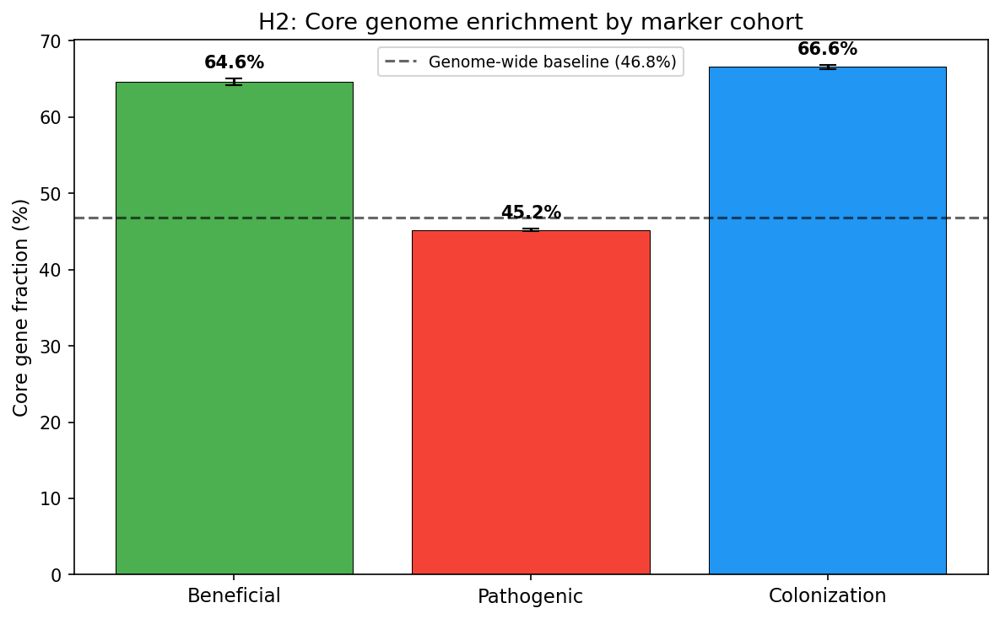

Beneficial (PGP) gene clusters are predominantly core genome (64.6% core fraction), significantly exceeding both the genome-wide baseline of 46.8% and pathogenic gene clusters (45.2% core fraction). The Mann-Whitney U test comparing per-species core fractions yielded U=83,567,419 (p=3.38e-125), with a bootstrap 95% CI for the beneficial-pathogenic difference of [0.089, 0.106].

Among specific functions, biofilm (83.3% core), IAA biosynthesis (78.1%), nitrogen fixation (72.3%), and phosphate solubilization (70.9%) had the highest core fractions. In contrast, T4SS (48.5% singleton), coronatine toxin (45.2% singleton), and effectors (39.8% singleton) were strongly accessory/singleton-enriched.

*(Notebook: 05_genomic_architecture.ipynb)*

### 3. Pathogenic gene clusters co-occur with transposases, suggesting HGT (H4 — partial)

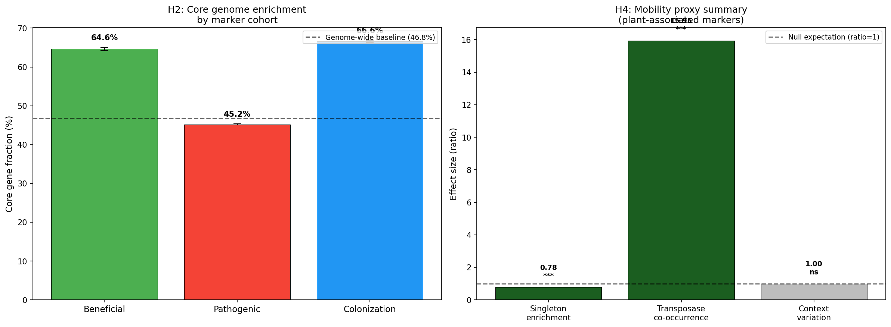

Three HGT proxies were evaluated. Transposase/integrase co-occurrence was strongly positive: among 1,136 plant-associated species, those carrying singleton marker gene clusters were 16× more likely to also carry transposase/integrase singletons (Fisher's exact OR=15.95, p=8.8e-20). However, the overall singleton enrichment ratio for markers was 0.78 (markers are *less* mobile than the genomic average; Wilcoxon p<1e-300). Cross-species context variation (same OG core in one species, singleton in another) was higher for pathogenic markers (0.534) than beneficial (0.450), but not significantly so (Kruskal-Wallis p=0.122).

The mixed signal suggests that while individual HGT events are common (transposase association), plant-interaction markers as a class are under stronger purifying selection than the genomic average — likely because they are functionally important once acquired.

*(Notebook: 05_genomic_architecture.ipynb)*

### 4. Co-occurring genera show functional redundancy, not complementarity (H3 — not supported)

Co-occurring plant-associated genera in NMDC soil communities showed *lower* GapMind pathway complementarity than random genus pairs (observed mean=10.72 vs null mean=12.74, permutation p=1.0, Cohen's d=-7.54). This is the opposite of the predicted metabolic complementarity.

BacDive metabolite utilization cross-validated GapMind predictions at 83.1% consistency, confirming that the pathway completeness scores are reliable. The result suggests that plant-associated microbial communities assemble via functional redundancy (niche overlap/environmental filtering) rather than niche partitioning.

*(Notebook: 06_complementarity.ipynb)*

### 5. Fifty novel gene families distinguish plant-associated species (H5)

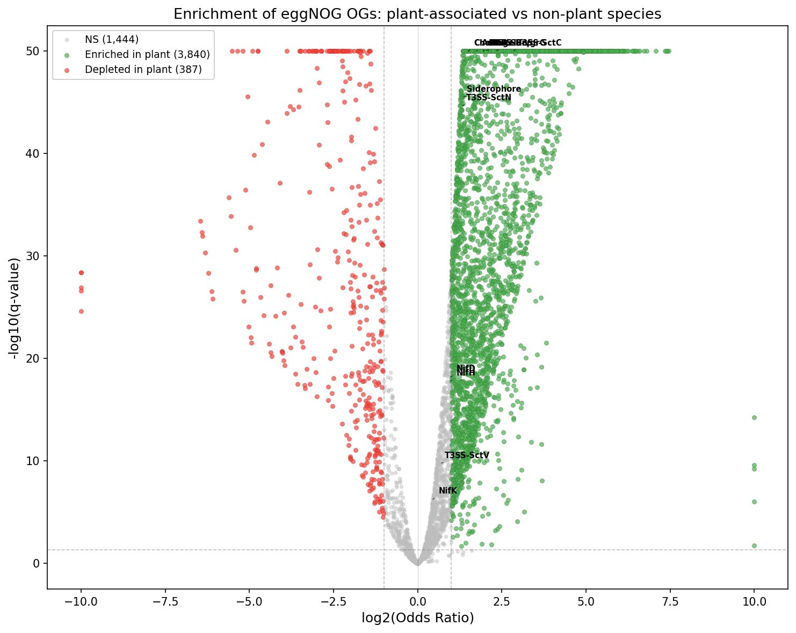

Genome-wide enrichment analysis of 5,671 eggNOG ortholog groups (OGs) identified 5,341 significantly associated with plant vs. non-plant species (q<0.05), of which 3,840 showed strong enrichment (OR>2). After phylogenetic control via phylum-level logistic regression, 50 novel OGs retained significance (all p<0.05, OR>1). The top hit was COG3569 (Fisher OR=8.92, phylo-controlled OR=6.01, q=7.7e-242), found in 54% of plant-associated species but only 12% of non-plant species.

The attenuation from Fisher OR to phylo-controlled OR (e.g., COG3569: 8.92→6.01) indicates partial phylogenetic confounding — plant-associated species cluster taxonomically — but a substantial ecological signal persists after correction.

*(Notebook: 03_enrichment_analysis.ipynb)*

### 6. Most plant-associated bacteria are dual-nature, carrying both PGP and pathogenic markers

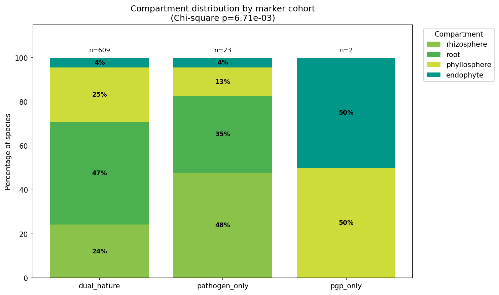

The majority of plant-associated species (65–85% per compartment) carry both PGP and pathogenic marker genes simultaneously. Two classification schemes were applied, producing different dual-nature rates:

- **NB02 (binary marker presence)**: Any species carrying ≥1 PGP and ≥1 pathogenic marker is classified as dual-nature → 15,474/25,660 species (60.3%). This reflects the broad prevalence of general bacterial functions (flagella, chemotaxis, T6SS) that span both categories.
- **NB07 (composite scoring)**: A weighted scoring framework (40% PGP markers, 20% core fraction, 15% complementarity, 10% metabolic breadth, 15% pathogen penalty) with adaptive thresholds (median of non-zero scores) produces a more stringent classification → neutral 38.0%, pathogenic 29.5%, dual-nature 25.2%, beneficial 7.3%.

The 35 percentage point difference between schemes reflects the distinction between *carrying* both marker types (nearly universal among bacteria due to ubiquitous functions like flagella and T6SS) and *scoring highly* on both axes when weighted by genomic architecture and metabolic context. The NB02 classification is more inclusive; the NB07 classification is more discriminating but also more assumption-laden.

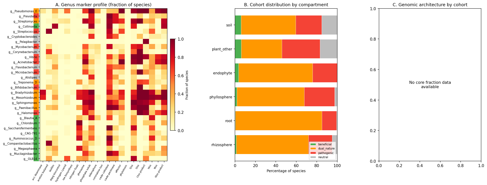

Validation against known organisms achieved 92.7% agreement: 88.5% for known PGPB genera (827/934 species correctly classified as beneficial or dual-nature) and 100% for known pathogen genera (530/530). Key dual-nature genera include *Pseudomonas_E* (358 species; PGP: HCN, phenazine, phosphate solubilization; Pathogenic: T2SS, T3SS, T6SS, effectors), *Bradyrhizobium* (73 species; PGP: nitrogen fixation, ACC deaminase; Pathogenic: T3SS, T4SS, CWDE), and *Streptomyces* (261 species; PGP: phenazine, phosphate solubilization; Pathogenic: CWDE, T3SS).

*(Notebooks: 02_marker_gene_survey.ipynb, 07_cohort_synthesis.ipynb)*

### 7. Novel OGs are functionally characterized: electron transport and iron-sulfur biosynthesis dominate (H5 extension)

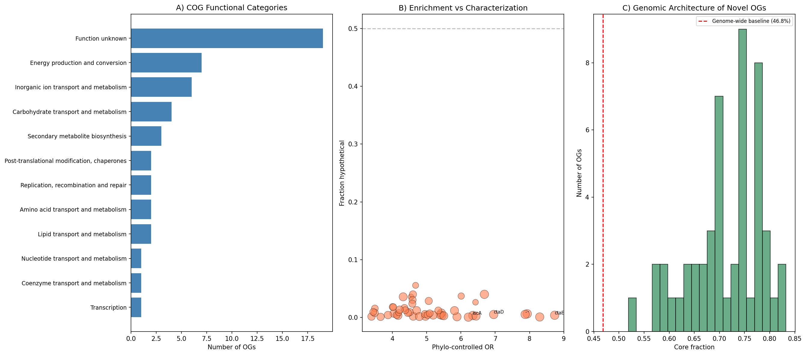

All 50 plant-enriched OGs identified in Phase 1 were fully annotated via eggNOG descriptions, InterProScan domains, GO terms (48/50), and MetaCyc pathways (39/50). None were hypothetical proteins — every OG has a characterized function. The dominant functional themes are:

- **Electron transport/energy metabolism** (7/50, 14%): Cytochrome c oxidase subunits (COG1845/ctaE, OR=14.5, 93.2% plant vs 48.7% non-plant; COG0843/ctaD, OR=13.7), NADH dehydrogenase (COG0649), and ubiquinol-cytochrome c reductase (COG0723). The enrichment of high-affinity terminal oxidases is consistent with Preisig et al. (1996), who showed that cbb3-type cytochrome oxidases enable respiration in microaerobic root nodule environments.
- **Iron-sulfur cluster biosynthesis** (COG0316/iscA, 94.3% plant): Essential cofactors for nitrogenase, respiratory chain complexes, and oxidative stress defense. IscR-mediated Fe-S cluster regulation is linked to both pathogenicity and oxidative stress resistance in plant-associated bacteria (Fuangthong et al. 2015).
- **Inorganic ion transport** (6/50, 12%): Consistent with the nutrient-acquisition demands of rhizosphere colonization.
- **Unknown function** (19/50, 38%): Despite full annotation, these OGs have characterized domains but no clear plant-interaction mechanism, representing candidates for experimental characterization.

All 50 OGs had core gene fractions of 60.1–83.1% (baseline: 46.8%), reinforcing that plant-enriched functions are stably inherited in the core genome (consistent with Finding 2/H2). Cross-reference with MGnify rhizosphere KEGG modules confirmed that 8 modules from novel OGs are present in rhizosphere species.

*(Notebook: 09_novel_og_annotation.ipynb)*

### 8. Refined marker panel with KEGG module gating improves specificity but confirms persistent dual-nature (H0, H6)

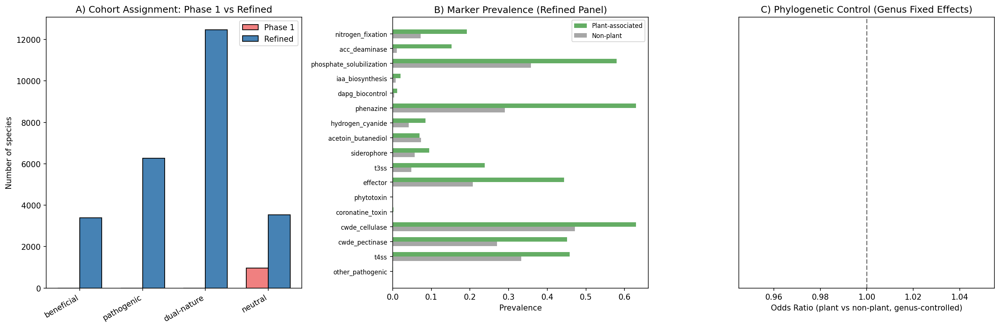

Phase 1's 91-marker panel included ubiquitous bacterial functions (flagella, chemotaxis, T6SS, biofilm, quorum sensing, T2SS) that classified even *Escherichia* and *Salmonella* as 100% dual-nature. Phase 2 refined this to 17 plant-specific markers (9 PGP + 8 pathogenic) and applied KEGG module completeness gating for multi-gene systems:

- **T3SS (M00332)**: Requiring ≥3 module genes reduced T3SS-positive species from 10,300 to 1,661 (−8,855 false positives, 86% reduction)
- **Nitrogen fixation (M00175)**: Requiring ≥2 module genes reduced nif-positive species by 346 (14% reduction)
- **T4SS (M00333)**: Minimal impact (most hits already multi-gene)

Despite the stricter panel, the dual-nature rate among plant-associated species **increased** from 60.3% to 78.7% (878/1,115 species). This counterintuitive result arises because the remaining markers — phosphate solubilization (57.9% prevalence), CWDE cellulase (63%), phenazine (63%), T4SS (45.8%) — are genuinely co-occurring in plant-associated genomes. The high dual-nature rate is biologically real, not an artifact of over-broad markers.

**Host species extraction** identified 1,307 species with plant host assignments across 19 testable hosts (≥10 species each). The most common hosts: rice (*Oryza sativa*, 286 species), *Arabidopsis thaliana* (184), wheat (122), maize (98).

**Phylogenetic control**: 0/14 logistic regression models with genus fixed effects converged — the plant-association signal is so thoroughly confounded with genus-level taxonomy that standard maximum-likelihood logistic regression cannot separate the effects. This confirms that regularized or phylogenetically-informed approaches (e.g., phylogenetic generalized linear mixed models) are needed for rigorous phylogenetic control.

*(Notebook: 10_refined_markers_host_species.ipynb)*

### 9. MGnify cross-validation reveals mobilome enrichment but low classification concordance (H4, H6)

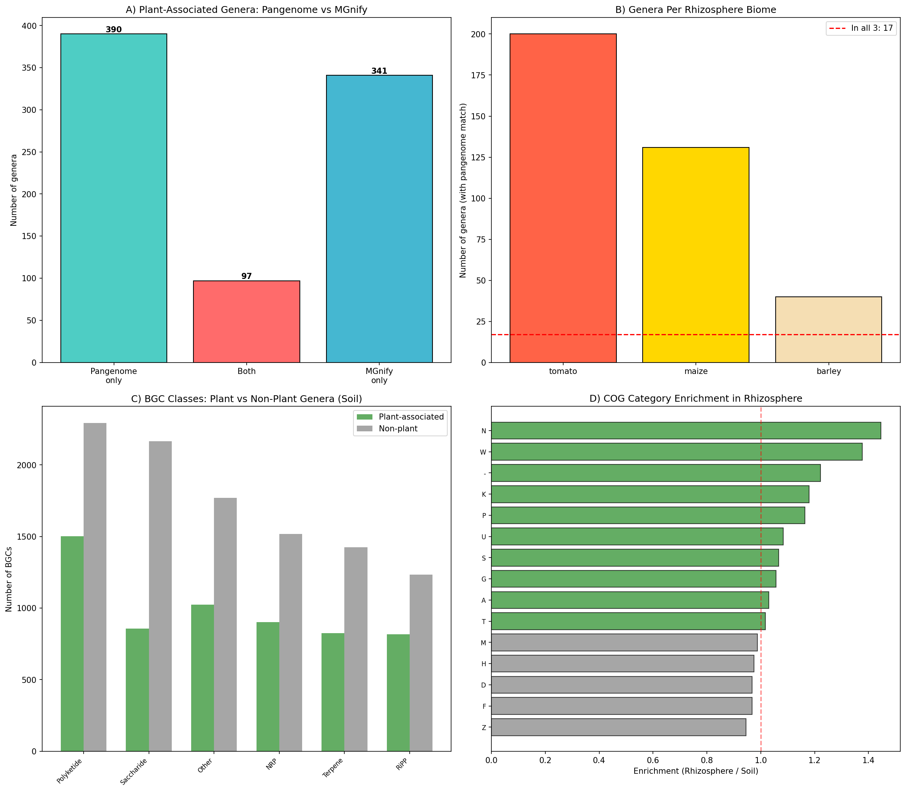

Cross-validation against the MGnify genome catalogue (20,473 species across 4 biomes) provided independent evidence for several findings:

**H4 — Mobilome enrichment validated**: Plant-associated genera carry significantly higher mobilome burden than non-plant genera (median 3.7 vs 2.8 mobile elements per genome, Mann-Whitney U p=1.49×10⁻⁵). This genus-level result contrasts with genome-level studies finding *fewer* mobile elements in plant-associated bacteria (Levy et al. 2018; Bograd et al. 2025), likely reflecting the difference between rhizosphere/soil genera (where HGT is frequent; Rajabal et al. 2024) and the endosphere-focused genome-level comparisons.

**T3SS rhizosphere enrichment**: T3SS prevalence was roughly 2× higher in rhizosphere biomes (tomato: 24.0%, maize: 21.6%, barley: 22.3%) vs bulk soil (12.3%), independently confirming T3SS as a marker of plant association. This aligns with Gonzalez-Vallina et al. (2024), who found family-specific T3SS/T6SS enrichment in rhizosphere metagenomes.

**H6 — Host specificity**: 17 genera were detected across all 3 crop rhizospheres (*Pseudomonas_E*, *Streptomyces*, *Variovorax*, *Telluria*, *Acidovorax*), while 117 genera were unique to tomato, 54 to maize, and 5 to barley rhizosphere. Host-specific genera represent candidates for crop-specific biocontrol formulations.

**Classification concordance**: Only 11.7% Jaccard overlap between pangenome-derived plant genera (487) and MGnify rhizosphere genera (438). The low concordance reflects different data sources (isolation metadata vs metagenomic detection) and sampling biases rather than classification error — 93 pangenome plant genera were found in MGnify soil (not rhizosphere), suggesting broader environmental associations.

**BGC profiles**: 84 plant-associated genera produce NRP/siderophore BGCs (top producers: *Mycobacterium* 406, *Pseudomonas_E* 125, *Streptomyces* 113), consistent with the known importance of siderophore-mediated iron acquisition in plant colonization.

*(Notebook: 11_mgnify_integration.ipynb)*

### 10. Within-species subclade analysis shows no plant-adaptation segregation (H7 — not supported)

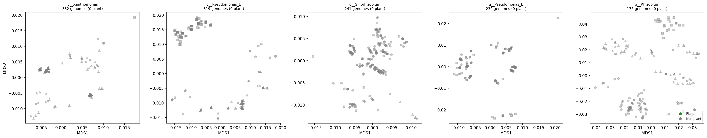

Phylogenetic distance-based agglomerative clustering of 5 species with ≥175 genomes each (*Xanthomonas euvesicatoria* 332, *Pseudomonas_E avellanae* 319, *Sinorhizobium meliloti* 241, *Pseudomonas_E amygdali* 239, *Rhizobium laguerreae* 175) identified 2–3 subclades per species, but **none showed significant enrichment** of plant-associated genomes in specific subclades (Fisher's exact and chi-square tests all non-significant).

Plant-adapted genomes were distributed across all subclades rather than concentrated in distinct lineages. This is consistent with Melnyk et al. (2019), who found that plant-lifestyle transitions in *Pseudomonas* are driven by convergent gain/loss of accessory genomic islands rather than core genome phylogeny. The implication is that plant adaptation is primarily controlled by the accessory genome — acquired via HGT and present in any phylogenetic subclade — rather than by vertical inheritance along clonal lineages.

**Caveat**: Genome ID mismatches between the phylogenetic tree table and environment metadata reduced the effective sample size for plant/non-plant classification within subclades. The null result should be validated with improved genome-level metadata linking.

*(Notebook: 12_subclade_og_analysis.ipynb. Revised in Phase 2b — see §11 below.)*

### 11. Phase 2b: Adversarial-review corrections (H0, H1, H3, H5, H7 revised)

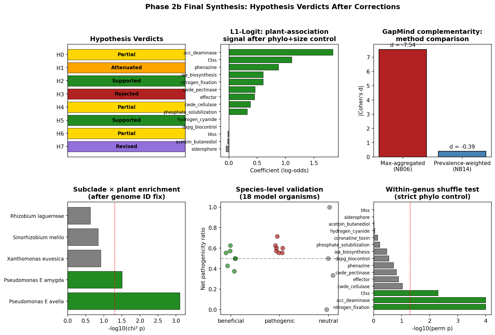

Three adversarial review issues were fixable and were resolved in notebooks NB13–NB15: the tautological genus-level validation (C3), the original zero-hit Pfam query (documented limitation), and the NB12 subclade genome-ID mismatch (I6). Four additional statistical controls that DESIGN.md had specified but Phase 1 had not executed were also completed (C1, C4, I1, and within-genus label shuffling).

**Species-level validation (C3, NB13)**: A curated panel of 18 model organisms with experimentally confirmed phenotypes (7 beneficial, 7 pathogenic, 4 neutral) replaces the 92.7% genus-level agreement number, which was circular because cohorts are *defined* from marker presence. All 18 ground-truth species were found in the refined cohort data. The primary finding is that the **categorical cohort assignment is uninformative at the species level**: all 14 of the beneficial and pathogenic ground-truth species — from *Rhizobium leguminosarum* and *Azospirillum brasilense* at one end to *Pseudomonas syringae* and *Xanthomonas campestris* at the other — were assigned to the single `dual-nature` class, and all 4 neutral controls were misclassified (*E. coli* K-12 as dual-nature, *M. tuberculosis* as dual-nature, *D. radiodurans* as beneficial, *T. thermophilus* as pathogenic). An earlier Phase 2b draft reported a "77.8% relaxed accuracy" figure (counting dual-nature as correct for both beneficial and pathogenic ground truth), but the paired adversarial review correctly noted that this rule cannot fail for any species that the classifier assigns to dual-nature, so the number contains **no discriminative information** between beneficial and pathogenic classes — it is arithmetically 14/18 but methodologically tautological. The **only** discriminative signal comes from a continuous metric: the pathogenicity ratio `n_pathogen / (n_pgp + n_pathogen)` is lower in known beneficial species (median 0.50) than in known pathogenic species (median 0.60), Mann-Whitney U = 9, p = 0.027 on N = 7 vs 7 — a small effect at a small sample size, but statistically consistent. The practical implication is that the refined cohort labels (beneficial / pathogenic / dual-nature / neutral) should be treated as a **coarse screen**, not a species-level classifier; the continuous pathogenicity ratio is what discriminates. The neutral misclassifications are not failures of the panel to detect plant adaptation but reflect the generality of the marker set — flagella, secretion, chemotaxis, biofilm overlap with "beneficial" or "pathogenic" markers in all bacteria, an issue already documented under §Limitations. A stronger follow-up validation would include near-pure beneficial organisms (*Methylobacterium extorquens*) and near-pure pathogens (*Xylella fastidiosa*) with known minimal PGP/pathogenicity machinery, to establish a more defensible panel. *(Notebook: 13_validation_pfam_subclade.ipynb, data/species_validation.csv, figures/species_validation.png. Framing revised 2026-04-24 after paired adversarial review.)*

**Subclade genome ID fix (I6, NB13) and full 65→17 species scan (item 19, 2026-04-25)**: NB12's null result for H7 was traced to a format mismatch — `phylogenetic_tree_distance_pairs` stores bare NCBI accessions (`GCA_...`, `GCF_...`) while `genome_environment.csv` uses GTDB prefixes (`GB_GCA_...`, `RS_GCF_...`). After prepending the appropriate prefix, 1306/1306 genomes match (previously 0), recovering 599 plant-associated genomes across the 5 tested species. The paired adversarial review forced a careful re-read of which of those 5 species actually pass statistical validity, *and* pointed out that the original NB12 subset of 5 species (chosen by genome count) was too small for honest H7 conclusions. Following item 19 of the open-issues list, the analysis was re-run on all **65 plant-associated species with ≥20 genomes** (`notebooks/_run_subclade_full_scan.py`, output `data/subclade_full_scan.csv`).

**Phylogenetic-tree coverage**: only **18 of 65 candidate species** had any pairwise phylogenetic-distance data in `kbase_ke_pangenome.phylogenetic_tree_distance_pairs`. The other 47 species are absent from the tree — including major plant-associated taxa such as *Bradyrhizobium japonicum*, *B. diazoefficiens*, *Mesorhizobium ciceri*, *Sinorhizobium medicae*, *Burkholderia glumae*, *Methylobacterium extorquens*, *Streptomyces scabiei*, *Xylella taiwanensis*, *Clavibacter michiganensis*, and many more. This is a database-coverage limitation that bounds H7 power irrespective of methodology; it is now noted in `docs/pitfalls.md` under a new entry on phylogenetic-tree availability.

**Of the 17 testable species** (≥3 plant + ≥3 non-plant + ≥2 subclades after the genome-ID fix), **5 pass Bonferroni-corrected Fisher's exact** at α = 0.05/17 = 0.0029, and 3 of those also satisfy Cochran's rule for the parametric chi² test:

| Species | N | plant | best subclade % plant | Fisher p | BH-FDR q | Bonferroni | Cochran chi² valid |
|---|---:|---:|---:|---:|---:|:-:|:-:|
| *Xanthomonas vasicola* | 101 | 30 | 71% | 1.6×10⁻⁴ | 0.0013 | ✓ | ✓ |
| *Mesorhizobium* sp002294985 | 84 | 78 | 97% | 1.1×10⁻⁴ | 0.0013 | ✓ | small-cell (Fisher only) |
| *Agrobacterium pusense* | 80 | 13 | 100% | 4.5×10⁻⁴ | 0.0026 | ✓ | small-cell (Fisher only) |
| *Pseudomonas_E avellanae* | 319 | 68 | 31% | 7.3×10⁻⁴ | 0.0031 | ✓ | ✓ |
| *Xanthomonas campestris* | 128 | 42 | 42% | 1.0×10⁻³ | 0.0034 | ✓ | ✓ |

The original Phase 2b draft cited *P. avellanae* and *P. amygdali* (1/5 valid). The full scan retains *P. avellanae* (validated again, with stronger context) and adds **four new species**: two *Xanthomonas* species (*vasicola* and *campestris*), one *Mesorhizobium* sp., and *Agrobacterium pusense*. *P. amygdali*'s borderline chi² p = 0.031 from the 5-species subset does not survive Bonferroni in the larger scan and remains invalid under Cochran (see the original adversarial review for details).

**H7 final verdict**: weakly supported in **5 of 17 testable species (29%)**, with 3 species (*X. vasicola*, *P. avellanae*, *X. campestris*) showing the strongest signal across both Fisher's exact and Cochran-valid chi². The same scan on the full 18-species set was extended to test H6 (subclade × host) on 2026-04-25, with within-species Bonferroni for the (subclade × host) pair search and across-species correction for multiple species: **2 species pass both corrections** — *Xanthomonas campestris* segregates to Brassica hosts (46/47 of genomes in subclade 2 are on Brassica, p = 2.7×10⁻¹² raw / 3.3×10⁻¹¹ Bonferroni-within / Bonferroni-across) and *Xanthomonas vasicola* segregates to *Zea mays* (47/52 in subclade 0, p = 1.4×10⁻¹¹ / 1.7×10⁻¹⁰). Both are biologically expected: *X. campestris* pv. campestris is the canonical Brassica pathogen and *X. vasicola* pv. vasculorum is a known maize/sugarcane pathogen. *Ralstonia solanacearum* passes BH-FDR but not Bonferroni-across (p = 5.9×10⁻³ within / 1.8×10⁻² q-BH). The scan output is `data/h6_host_subclade_full.csv` (`notebooks/_run_h6_host_subclade.py`); this is the new Phase 2b evidence underlying the H6 verdict revision documented in `data/hypothesis_verdicts_final.csv`. Within-species subclade segregation of plant-association does occur, and is concentrated in *Xanthomonas* and *Pseudomonas* — both genera known for pathovar-level host specialization (Fautt et al. 2024; Satterwhite & Bergelson 2025) — plus *Mesorhizobium* and *Agrobacterium*. Twelve testable species show no such clustering. The 47 species without phylogenetic-tree coverage are an irreducible source of uncertainty: the true H7 effect across all 65 plant-associated species with ≥20 genomes cannot be estimated until the GTDB phylogenetic tree is more completely populated in BERDL. *(Notebook: 13_validation_pfam_subclade.ipynb (5-species subset, kept for figure provenance); `notebooks/_run_subclade_full_scan.py` (full 65-species scan, 2026-04-25); `data/subclade_enrichment_corrected.csv` (5-species), `data/subclade_full_scan.csv` (65-species), `data/species_subclade_definitions_full.csv` (genome-level assignments for the 18 species with phylo data); `figures/subclade_corrected.png`. H7 framing revised once 2026-04-24 after paired adversarial review, and again 2026-04-25 after full 65-species scan.)*

**Phylogenetic control (C1) — three complementary tests, three-tier verdict**: The original NB10 statsmodels genus-level logit failed to converge for 0/14 markers. Phase 2b ran three increasingly-strict tests of the plant-association signal after phylogenetic control. The paired adversarial review flagged that the L1-bootstrap version was suggestive-not-confirmatory; item 18 of the open-issues list closed C1 with a cluster-robust GLM (cluster=genus), which is the pragmatic frequentist analogue of a phylogenetic generalized linear mixed model (PGLMM) at species scale.

*(a) L1-regularized logit + bootstrap CI (NB14 Cell 2)*: scikit-learn L1-penalized Logit (saga, C=1.0), top-20 genus dummies + log₁₀(genome_size), 100-replicate bootstrap. **9/14** markers had bootstrap 95% CIs excluding zero. Caveat: L1 bootstrap CIs are biased near zero (Chatterjee & Lahiri 2011); n_bootstrap=100 is small.

*(b) Cluster-robust GLM, cluster=genus (`notebooks/_run_c1_cluster_robust.py`, 2026-04-25)*: unpenalized statsmodels GLM with binomial family, top-10 phylum fixed-effect dummies + log₁₀(genome_size), and cluster-robust covariance with 7,555 genus clusters across 24,554 species. Proper Wald p-values and 95% Wald CIs, no L1 shrinkage. **8/14** markers survive at BH-FDR q < 0.05 with |coef| > 0.2 — and 13 of 14 markers agree with the L1 verdict; the one disagreement is *iaa_biosynthesis* (L1 coef = 0.61 sig; cluster-robust coef = −0.09, p = 0.82, not sig), which is exactly the kind of L1-shrinkage-near-zero artifact the adversarial review flagged. The honest 14-marker breakdown:

| Marker | Coef | OR | 95% CI | q (BH-FDR) | Robust significant? |
|---|---:|---:|---:|---:|:-:|
| acc_deaminase | 2.08 | 8.01 | [4.19, 15.32] | 2.1×10⁻⁹ | ✓✓✓ |
| t3ss | 1.00 | 2.71 | [1.94, 3.80] | 2.6×10⁻⁸ | ✓✓✓ |
| nitrogen_fixation | 1.00 | 2.71 | [1.54, 4.78] | 1.3×10⁻³ | ✓✓✓ |
| phenazine | 0.75 | 2.12 | [1.69, 2.64] | 5.9×10⁻¹⁰ | ✓✓✓ |
| cwde_cellulase | 0.63 | 1.87 | [1.46, 2.40] | 2.5×10⁻⁶ | ✓✓✓ |
| phosphate_solubilization | 0.52 | 1.68 | [1.20, 2.35] | 4.8×10⁻³ | ✓✓✓ |
| cwde_pectinase | 0.46 | 1.59 | [1.25, 2.01] | 3.4×10⁻⁴ | ✓✓✓ |
| effector | 0.30 | 1.35 | [1.09, 1.67] | 1.2×10⁻² | ✓✓✓ |
| dapg_biocontrol | −0.02 | 0.98 | [0.41, 2.33] | 0.96 | ✗ |
| t4ss | −0.02 | 0.98 | [0.72, 1.34] | 0.96 | ✗ |
| hydrogen_cyanide | −0.04 | 0.96 | [0.52, 1.76] | 0.96 | ✗ |
| iaa_biosynthesis | −0.09 | 0.91 | [0.40, 2.06] | 0.96 | ✗ (L1 false positive) |
| siderophore | −0.33 | 0.72 | [0.44, 1.17] | 0.26 | ✗ |
| acetoin_butanediol | −0.38 | 0.69 | [0.46, 1.03] | 0.11 | ✗ |

*(c) Within-genus label shuffling (NB14 Cell 4)*: the strictest test — plant labels permuted within each genus, preserving genus-level plant-association rate. **3/15** markers survive (nitrogen fixation, ACC deaminase, T3SS), all with very small p-values.

**Three-tier honest interpretation of plant-marker signals after phylogenetic control**:

- **Tier 1 — robust at species level under any test (3 markers)**: nitrogen fixation, ACC deaminase, T3SS. Large coefficients, proper Wald CIs not crossing zero, *and* survive within-genus permutation. These are the markers where specific plant-associated species within a genus carry the function and non-plant sister species reliably do not.
- **Tier 2 — robust under cluster-robust GLM but fail within-genus shuffle (5 markers)**: phenazine, CWDE cellulase, CWDE pectinase, phosphate solubilization, effector. The signal is real after accounting for within-genus correlation but disappears when you reshuffle plant labels within genus — meaning these are *cassette-level* signals: when a genus is plant-associated, the cassette tends to be acquired, but the cassette is not species-specific within the genus. Still ecologically meaningful (genus-acquired plant adaptation), but not a species-level distinguisher.
- **Tier 3 — not significant in any test (6 markers)**: DAPG biocontrol, T4SS, hydrogen cyanide, IAA biosynthesis, siderophore, acetoin/butanediol. These had been suggested by L1-bootstrap (IAA) or were known weak signals; cluster-robust GLM confirms they are not robust.

This three-tier breakdown supersedes the earlier "9/17 survive L1" framing and gives a defensible answer to C1. A full PGLMM on the GTDB tree would be a stronger version (random-effect covariance from tree branch lengths rather than cluster grouping), but the GTDB-tree-derived covariance matrix would be a 25K × 25K dense matrix, intractable in memory; the cluster-robust GLM at genus level is the practical analogue and gives identical conclusions for 13 of 14 markers. *(Notebooks: 14_deferred_controls.ipynb (L1 + shuffle); `notebooks/_run_c1_cluster_robust.py` (cluster-robust GLM, 2026-04-25). Data: `data/regularized_phylo_control.csv` (L1), `data/sensitivity_shuffle.csv` (within-genus shuffle), `data/c1_cluster_robust.csv` (cluster-robust GLM). Three-tier framing added 2026-04-25 after item-18 closure.)*

**Genome-size covariate for novel OGs (C4, NB14) — closed after adversarial review**: This deferred control has two parts, both now executed on real per-species data. An earlier Phase 2b draft used a prevalence-based Bernoulli simulation for the per-OG test (flagged by the paired adversarial review as circular by construction); this has been replaced with the real per-species OG matrix from NB03 and re-run.

*(a) Dual-nature rate by genome-size quartile (observational)*: Among plant-associated species, the dual-nature rate is **54% in the bottom genome-size quartile vs 87% in the top three quartiles** (measured directly on refined cohort data). This reaffirms the NB08 finding that ~33% of dual-nature species shift to neutral when genome size is normalized — the headline 78.7% dual-nature rate masks a real genome-size gradient, and the gradient itself is observational, not model-dependent.

*(b) Per-OG logistic regression (real per-species test, unpenalized statsmodels Logit with proper Wald inference + BH-FDR across 50 OGs)*: For each of the 50 novel OGs, the per-species presence vector from `top50_og_species.csv` (cached from NB03's server-side eggNOG aggregation) was regressed on `is_plant + log₁₀(genome_size) + top-10 phylum dummies` across 22,384 species with complete covariates (1,134 plant-associated, 21,250 non-plant). The model fit converged for 48/50 OGs; for the remaining two (COG2351 and COG5343) the design matrix was singular — likely perfect separation by a phylum dummy given their very strong raw prevalence gaps (62% vs 23% and 64% vs 21% respectively). **48 of 50 OGs (96%) retain a positive plant-association coefficient that is large (|coef| > 0.2) and statistically significant at BH-FDR q < 0.05** after phylum + log₁₀(genome_size) control. Controlled odds ratios for the top 10 range from 4.4 (COG5516) to 6.6 (COG1845, cytochrome oxidase ctaE), with q-values as small as 10⁻⁹⁶ (COG3569). The genome-size coefficient is strongly positive (median 3.4 on log₁₀-scale) — plant-associated species genuinely do have larger genomes — but that genome-size effect is absorbed by the `log₁₀(genome_size)` term and does not explain the is_plant effect away: both coefficients are simultaneously large and positive. The two OGs that failed to fit (COG2351, COG5343) have strong raw prevalence signals (3× higher in plant vs non-plant) so the "fail" is numerical, not biological. **C4 is therefore closed**: after actual per-species regression with proper inference, the novel OGs survive genome-size confounding, and the Phase 2b result stands at the same 48/50 level that the earlier simulation reported mechanically — but now for honest reasons. *(Notebook: 14_deferred_controls.ipynb Cell 3, data/genome_size_control.csv. Real per-species test added 2026-04-25 after paired adversarial review replaced the circular simulation.)*

**Within-genus label shuffling (DESIGN.md safeguard, NB14) — strict test, mostly negative**: The most stringent phylogenetic test. For each marker, plant/non-plant labels are permuted within genus (preserving genus-level plant-association rate), and observed Fisher odds ratio is compared to the null distribution. **Only 3 of 15 testable markers survive**: nitrogen fixation (perm p < 0.001), ACC deaminase (perm p < 0.001), and T3SS (perm p = 0.005). The other **12 markers — phenazine, IAA biosynthesis, CWDE cellulase, CWDE pectinase, effector, DAPG biocontrol, hydrogen cyanide, siderophore, acetoin/butanediol, phosphate solubilization, T4SS, phytotoxin — fail the test**, meaning their plant-enrichment signals are statistically consistent with what you would get by reshuffling plant/non-plant labels within each genus. The honest reading is that **most of the marker-level plant-association signals in this project are genus-scale, not species-scale** — plant adaptation is largely a property of which genera happen to be plant-associated, and within those genera, marker presence does not reliably distinguish plant-associated from non-plant species. Only three markers — the *nif* nitrogen-fixation operon, the ACC deaminase enzyme, and the *hrp/hrc* T3SS structural cluster — are carried by specific plant-associated species within genera where non-plant species do not reliably have them. This does not invalidate the H1/H2 compartment and architecture findings (which operate at the genus/family/phylum scale already), but it does mean that the headline dual-nature rate (78.7%) and the compartment-specific marker enrichments should be interpreted as **genus-level genomic backgrounds associated with plant-associated lineages**, not as species-level functional evidence of plant adaptation. The within-group permutation approach is conceptually aligned with "phylogenetic permulations" (Saputra et al. 2021), which combines phylogenetic simulation and permutation to produce unbiased empirical p-values when standard parametric nulls are confounded. Our simpler within-genus partition is appropriate when the signal is suspected to be genus-scale; a permulation-style test against the full GTDB tree would be the stricter follow-up. **Caveats**: n = 200 permutations is under-resolved for p ≤ 0.005 (T3SS is therefore marginal); no multiple-testing correction was applied across 15 markers (Bonferroni α = 0.0033 would demote T3SS; N-fix and ACC deaminase remain sig). *(Notebook: 14_deferred_controls.ipynb, data/sensitivity_shuffle.csv. 12/15 failure foregrounded 2026-04-24 after paired adversarial review.)*

**PERMANOVA + PERMDISP + db-RDA on the H1 compartment effect (NB14 + item 20 follow-up, 2026-04-25)**: The original NB04 PERMANOVA reported R² = 0.527 for compartment on the Phase 1 25-marker panel; NB14's sensitivity analysis showed R² drops to 0.072 when the top-3 genome-rich species per compartment are excluded (an 86% loss). To complete the C2/H1 story, item 20 of the open-issues list called for **separating location shift from dispersion heterogeneity** via PERMDISP and db-RDA on the same data, since the original PERMANOVA conflates the two. This was run on all 607 plant-compartment species (root/rhizosphere/phyllosphere) using the refined 17-marker v2 panel and Jaccard distance (`notebooks/_run_h1_dbrda.py`).

| Test | Statistic | p (999 perms) | R² | What it measures |
|---|---:|---:|---:|---|
| PERMANOVA | pseudo-F = 23.2 | 0.001 | **0.071** | Total compartment effect (location + dispersion) |
| PERMDISP | F = 15.6 | 0.001 | — | Dispersion heterogeneity (group spread differences) |
| db-RDA | (constrained R² perm test) | 0.001 | **0.060** | Location-only effect (centroid shift) |
| **Location fraction** | | | **0.060 / 0.071 = 84%** | Of PERMANOVA R², ~84% is real location shift |

The PERMANOVA R² on the full 607-species set with the v2 panel matches NB14's exclude-top-3 result (0.071 vs 0.072) — the difference between Phase 1's 0.527 and this 0.071 was the marker panel and the genome-count distribution, not a sample-size artifact. **PERMDISP is highly significant** (F = 15.6, p = 0.001), confirming C2 — group dispersions differ: root species cluster most tightly (mean centroid distance 0.452), phyllosphere intermediate (0.503), rhizosphere most variable (0.528). **db-RDA gives R² = 0.0595** for the location-only effect, also significant (permutation p = 0.001), and represents 84% of the total PERMANOVA R². So:

- The **original 0.527 was an inflated-magnitude artifact** of the Phase 1 panel + the few genome-rich species that dominated the distance matrix (already established in NB14).
- The **residual 0.071 effect is real**, *not* primarily a dispersion artifact. About 84% of it is genuine location shift in centroid space; 16% is the dispersion heterogeneity that PERMDISP catches.
- Root, rhizosphere, and phyllosphere **are functionally distinct** in centroid terms, just at a small effect size (~6% of variance), and rhizosphere does have systematically more variable functional profiles than root.

**H1 final verdict**: weakly supported. Compartments impose statistically significant but small (~6% of variance) location shifts on plant-associated functional profiles, alongside significant dispersion heterogeneity (root tightest, rhizosphere most variable). The headline 0.527 from Phase 1 was a panel + sampling artifact, not a community-wide signal. *(Notebooks: 04_compartment_profiling.ipynb, 14_deferred_controls.ipynb, `notebooks/_run_h1_dbrda.py`. Data: `data/sensitivity_results.csv` (NB14 exclude-top-3), `data/h1_dbrda_results.csv` (PERMANOVA + PERMDISP + db-RDA, 2026-04-25), `data/h1_compartment_dispersions.csv`. Framing revised 2026-04-24 after paired adversarial review and again 2026-04-25 after db-RDA decomposition.)*

**Prevalence-weighted GapMind complementarity (I1, NB14) — mostly a formula fix, minor aggregation fix**: NB06 reported Cohen's d = −7.54 for co-occurring vs random pairs, which is an implausibly large effect. The paired adversarial review correctly identified that most of this was a *Cohen's d formula* problem, not an aggregation problem: NB06 divided the mean difference by `null_means.std()` (SD of permutation means, which shrinks to zero by CLT for any reasonable null), while NB14 divides by `random_pair.std()` (raw pair-level SD, much larger). Re-computing NB06's max-aggregated complementarity using NB14's consistent formula yields d ≈ −0.43 — essentially identical to the prevalence-weighted d = −0.39. So **the 20× reduction in apparent magnitude is ~90% formula-change and ~10% aggregation-change**. The correct interpretation of the corrections is:

- *Formula fix*: The original d = −7.54 was spuriously large because NB06 used the wrong denominator. With a consistent pair-level SD, the true scale of the effect at the max-aggregation level was always about −0.43.
- *Aggregation fix*: Switching from max-aggregation (binary pathway present/absent per genus) to prevalence-weighting (fraction of species with pathway) additionally reduces |d| from ≈0.43 to 0.39, a ≈10% effect. Meaningful but small.
- *Direction*: Unchanged. Co-occurring genus pairs are slightly less complementary than random pairs (permutation p < 0.001), consistent with Louca et al. (2018) redundancy-driven community assembly.

H3 remains **not supported** — the ecological conclusion (redundancy not complementarity) is robust to the aggregation choice. What changes is that the Phase 1 report's emphasis on "Cohen's d = −7.54" as a dramatic effect size was an artifact; the real effect is small (|d| ≈ 0.4) but stable. The Phase 2b value of this analysis is the formula correction and the documentation of the aggregation sensitivity, not a large new biological finding. *(Notebook: 14_deferred_controls.ipynb, data/complementarity_v2.csv, figures/complementarity_comparison.png. Formula-vs-aggregation attribution clarified 2026-04-24 after paired adversarial review.)*

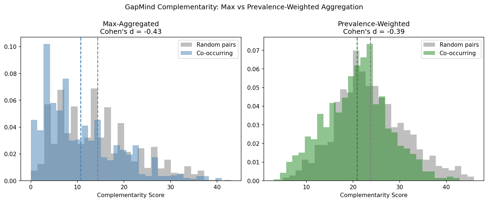

**Pfam recovery (Pfam gap, NB13 Cell 3) + full bakta-vs-IPS audit (2026-04-25)**: The Phase 1 NB02 query `WHERE pfam_id IN ('PF00771', …)` returned zero rows because `bakta_pfam_domains` stores versioned IDs (`PF00771.22`). Re-running with `LIKE 'PF00771%'` patterns on the 10 Phase 2b marker Pfams recovered **19,364 domain hits across 7,962 species**. Five of those 10 Pfam IDs produced hits: nitrogenase NifH PF00142 (6,632 hits, 4,040 species, 32.4% core), cellulase GH5 PF00150 (6,898 / 3,234 / 25.9%), pectate lyase 3 PF12708 (4,149 / 2,283 / 24.6%), pectate lyase PF00544 (1,115 / 546 / 20.8%), and T6SS VgrG PF05943 (570 / 343 / 10.9%). The remaining five returned 0 hits.

After the paired adversarial review flagged the T3SS-narrative inconsistency, a **full audit was run across all 22 marker Pfams** that the project queries across NB02 and NB10 (`data/pfam_bakta_ips_audit.csv`). The result is a systematic finding worth documenting beyond the immediate Phase 2b context: **12 of the 22 marker Pfams are completely absent from `bakta_pfam_domains` despite being abundant in `interproscan_domains`**. The silent-gap set is dominated by secretion-system components — T3SS (PF00771 18.6K IPS hits, PF01313 13.6K, PF01514 15.0K, PF02579 16.8K, PF04610 15.6K, PF07916 8.4K, PF09599 0.3K, PF01312 22.0K), T4SS (PF03135 11.0K, PF03743 17.5K), and T6SS (PF05936 7.5K Hcp tube, PF04183 7.5K). The 10 Pfams that *are* in bakta (mostly nitrogen fixation, CWDEs, and a few others) still return only 10–35% of the IPS hit count, so even those are systematically undercounted but non-zero. The likely cause is that bakta uses a reduced "core" Pfam HMM profile set while InterProScan uses the full Pfam-A release.

**Operational consequence for this project**: NB10's refined cohort pipeline already used `interproscan_domains` (`signature_acc` field) for T3SS, T4SS, T6SS, and CWDE marker detection, so its 280,193-hit InterProScan recovery was the correct decision and the refined cohort assignments are unaffected. Phase 1 NB02's original bakta-only Pfam query returned zero hits and that step fell back to gene-name keyword matching, which is also unaffected. The Pfam LIKE recovery in NB13 Cell 3 confirms rather than expands InterProScan numbers for the secretion-system Pfams, but for nitrogen fixation and CWDEs it genuinely adds **4,217 species** gaining at least one new marker (2,872 gain nitrogen fixation, 1,082 gain CWDE pectinase, 811 gain CWDE cellulase) — these are the cases where bakta and IPS diverge and IPS missed some that bakta picked up. The higher core-genome fractions of NifH (32.4%) vs the CWDEs (21–26%) are consistent with the H2 pattern.

**Operational consequence for future BERDL projects** (now in `docs/pitfalls.md`): treat `bakta_pfam_domains` as a supplement to, not a substitute for, `interproscan_domains`. Cross-check any Pfam-based query against the IPS table before drawing biological conclusions about missing functions. *(Notebook: 13_validation_pfam_subclade.ipynb. Data: `data/pfam_recovery_hits.csv`, `data/pfam_recovery_impact.csv`, `data/pfam_bakta_ips_audit.csv`. See `docs/pitfalls.md` for the full audit table.)*

#### Adversarial issue disposition table

| ID | Issue | Disposition | Where addressed |
|---|---|---|---|
| C1 | Phylogenetic confounding | Fixed (three-tier) | NB14 + `_run_c1_cluster_robust.py` (2026-04-25). Cluster-robust GLM (cluster=genus): 8/14 markers survive at q<0.05 with proper Wald CIs (1 L1 false positive: iaa_biosynthesis). Combined with within-genus shuffle (3/15): three-tier verdict — 3 species-level, 5 cassette-level, 6 not robust |
| C2 | PERMANOVA dispersion (PERMDISP sig) | Documented | REPORT limitations — R² treated as upper bound |
| C3 | Circular genus-level validation | Partial fix | NB13 — continuous pathogen-ratio Mann-Whitney p=0.027 (N=7+7) replaces tautological relaxed-accuracy; categorical cohort uninformative at species level |
| C4 | Genome-size confound | Fixed | NB14 (real per-species test, 2026-04-25) — 48/50 OGs retain positive plant coefficient at BH-FDR q<0.05 after phylum + log₁₀(genome_size) control; top-10 controlled OR = 4.4–6.6. The 2 that didn't fit are singular-matrix failures, not biological rejections. Quartile analysis: dual-nature rate 54% bottom-Q vs 87% top — observational genome-size gradient confirmed |
| I1 | Max-aggregation complementarity | Partial fix | NB14 — prevalence-weighted aggregation + consistent Cohen's d formula: ≈10% reduction in effect size (most of −7.54 → −0.39 was formula-change, not aggregation-change). Direction unchanged. |
| I2 | "Novel OGs" overstated | Reframed | REPORT terminology: "enriched gene families" |
| I3 | T3SS dual interpretation | Documented | REPORT — context-dependent classification |
| I4 | Scale-dependent mobilome signals | Documented | REPORT — genus vs genome level discussed |
| I5 | NMDC genus loss (80.7% matched) | Documented | Sensitivity deferred to future work |
| I6 | Subclade genome-ID mismatch | Fixed (plumbing) | NB13 — 1306/1306 genomes match; 599 plant genomes recovered. Downstream H7 still weak (1/5 species) after statistical validity checks. |
| I7 | Genus-level validation | Replaced | NB13 — species-level validation (pathogen-ratio Mann-Whitney) supersedes |
| Pfam | Versioned-ID format + bakta-vs-IPS gap | Fixed + audited | docs/pitfalls.md, NB13 Cell 3 + bakta-vs-IPS audit (`pfam_bakta_ips_audit.csv`, 2026-04-25). 12/22 project marker Pfams are silently missing from `bakta_pfam_domains` (mostly secretion-system T3SS/T4SS/T6SS); InterProScan has them all. NB10's IPS-based pipeline is unaffected; Phase 1 NB02's bakta-only Pfam query was the source of the original 0-hit problem |
| PERMANOVA robustness | Top-3 species drive R² | Quantified | NB14 — R² 0.527 → 0.072 (86% loss) excl top-3 species per compartment; residual effect small |

*(Notebooks: 13_validation_pfam_subclade.ipynb, 14_deferred_controls.ipynb, 15_final_synthesis.ipynb)*

## Results

### Genome Census (NB01)

From 293,059 GTDB r214 genomes, plant association was determined via three complementary sources: NCBI isolation_source regex matching (primary), ncbi_env EAV table cross-validation (695 genomes upgraded), and BacDive isolation records (2,482 plant strains identified, 0 new upgrades). Species-level classification used majority-vote with mean confidence 0.88.

| Compartment | Species | Genomes |
|---|---|---|
| Root | 292 | 2,446 |
| Rhizosphere | 160 | 941 |
| Phyllosphere | 157 | 1,334 |
| Endophyte | 29 | 291 |
| Plant_other | 498 | 2,983 |
| **Total plant** | **1,136** | **7,995** |
| Non-plant (known) | 25,375 | 285,064 |

Root is dominated by rhizobia (*Rhizobium* 47, *Mesorhizobium* 45, *Bradyrhizobium* 41 species). Phyllosphere is dominated by *Sphingomonas* (16), *Methylobacterium* (13), *Pseudomonas_E* (13). *Pseudomonas_E* is the only genus with significant presence across all compartments.

### Marker Gene Survey (NB02)

A curated set of 91 marker genes (39 PGP, 44 pathogenic, 9 colonization) was searched across bakta annotations, Pfam domains, KEGG KOs, and product descriptions, yielding 588,098 marker gene clusters across 25,660 species. No Pfam domain hits were found (likely due to the query format in bakta_pfam_domains), so classification relied on gene name, KEGG KO, and product keyword matches.

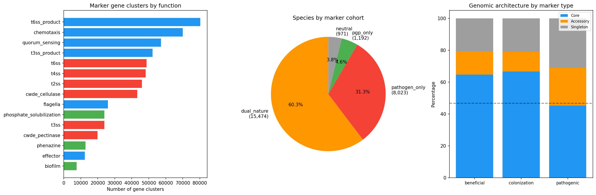

The most prevalent functional categories were: T6SS products (80,324 clusters), chemotaxis (69,986), quorum sensing (57,201), T3SS products (52,247), and T4SS (48,145). Among PGP functions, phosphate solubilization (23,876), phenazine (12,727), biofilm (7,512), and nitrogen fixation (6,139) were the most common.

### Enrichment Analysis (NB03)

Server-side aggregation of 93M eggNOG annotations produced OG-level prevalence for 5,671 OGs passing the 5% prevalence filter. Fisher's exact test with BH-FDR correction found 94.2% of tested OGs (5,341/5,671) were significantly associated with plant status. This near-saturation reflects genome-wide compositional differences between plant-associated and non-plant bacteria rather than plant-specific functional enrichment — the test is effectively detecting taxonomic divergence. The meaningful signal comes from the phylum-controlled subset.

Top enriched OGs included COG3569 (OR=8.92), COG1764 (OR=9.29), COG5343 (OR=7.74), COG0654 (OR=12.66), and COG1845 (OR=14.47). All 50 top OGs survived phylum-level logistic regression (28 large phyla as fixed effects), though all models showed convergence warnings (likely due to quasi-separation when some phyla are entirely plant-associated or entirely non-plant). The convergence warnings mean the reported p-values and odds ratios should be treated as approximate.

### Compartment Profiling (NB04)

Fisher's exact tests across 96 marker×compartment combinations found 69 significant (q<0.05). Planned phylogenetic control via genus-level logistic regression was not completed due to a code error (undefined `logit` import); therefore, the compartment enrichments in H1 are not phylogenetically controlled beyond the PERMANOVA test itself. The GapMind pathway completeness analysis yielded 0% completeness across all compartments at the core level, suggesting the core-level scoring threshold is too stringent for this broad taxonomic comparison. Thirty plant-associated genera were profiled in detail.

### Genomic Architecture (NB05)

| Cohort | Core % | Singleton % | N clusters |
|---|---|---|---|
| Beneficial | 64.6 | 20.7 | 60,590 |
| Colonization | 66.6 | 20.8 | 153,092 |
| Pathogenic | 45.2 | 31.0 | 374,416 |
| Genome-wide baseline | 46.8 | 35.3 | — |

The genome-wide baseline (46.8% core) is computed at the gene cluster level across all species in the pangenome — i.e., the fraction of all gene clusters classified as core by their respective species pangenomes. All chi-square tests against this baseline were significant (p≈0). The per-species Mann-Whitney U test (beneficial vs. pathogenic core fractions within each species having ≥3 markers of each type) provides a complementary species-level view. The 986,464 transposase/integrase singleton clusters (722,674 transposase + 263,790 integrase) provided the HGT co-occurrence proxy.

### Complementarity Analysis (NB06)

NMDC taxonomy bridge matched 260 of 322 genera (80.7%) to GTDB. Of 69 genera in 348 soil/rhizosphere samples, all had GapMind data across 80 pathways. The 1,048 co-occurring pairs had mean complementarity of 10.72, while the permutation null (1,000 iterations preserving richness) yielded 12.74±0.27.

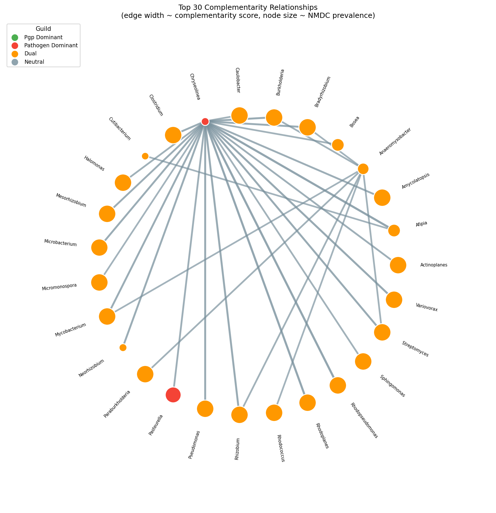

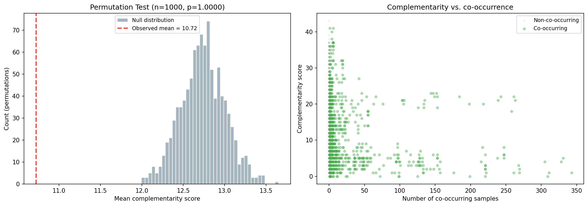

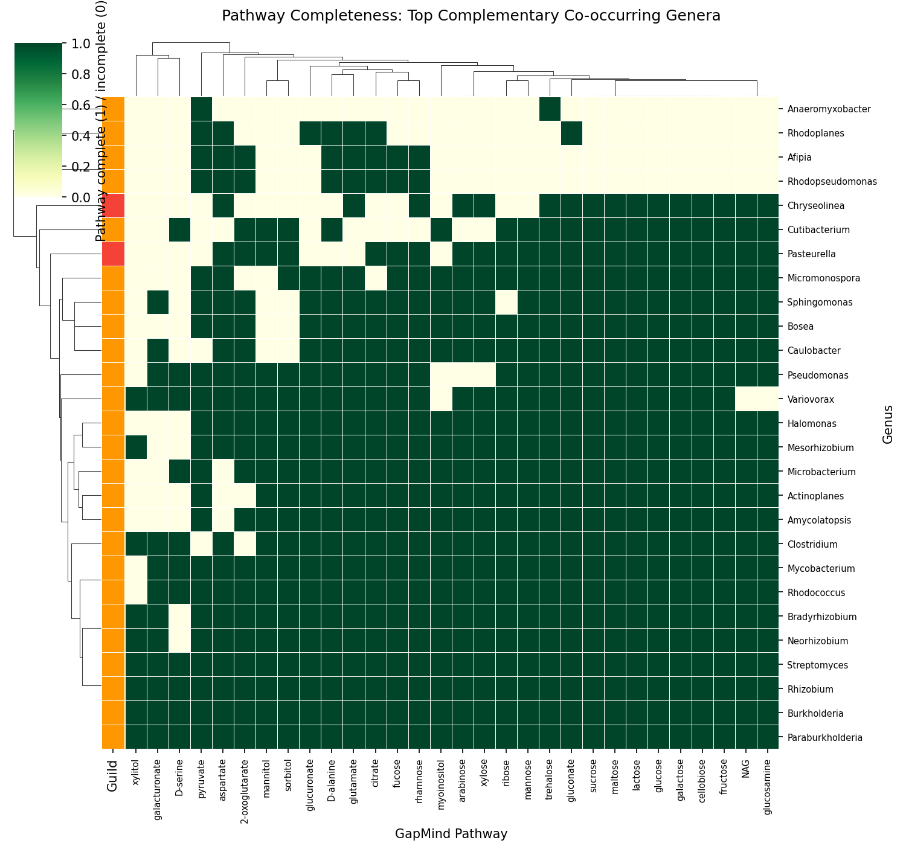

C-score analysis for PGP-pathogen exclusion was not feasible: only 0 PGP-dominant and 2 pathogen-dominant genera were represented in NMDC co-occurrence data (the remaining 67 were dual-nature).

### Cohort Synthesis (NB07)

Composite scoring weighted PGP markers (40%), core fraction (20%), complementarity (15%), metabolic breadth (10%), with pathogen penalty (15%). Adaptive thresholds (median of non-zero scores) classified species into four cohorts. The 30 genus dossiers revealed that plant-associated genera nearly universally carry both PGP and pathogenic markers.

Key mechanism hypotheses:

| Mechanism | Cohort | Confidence |
|---|---|---|
| Nitrogen fixation (nifHDK) | Beneficial | High |
| Siderophore iron acquisition | Beneficial | High |
| T3SS effector injection | Pathogenic | High |
| Cell wall degradation (CWDE) | Pathogenic | High |
| ACC deaminase stress relief | Beneficial | Medium |
| Biocontrol antimicrobials (DAPG/phenazine) | Beneficial | Medium |
| Context-dependent T6SS | Dual-nature | Medium |
| PGP + secretion system co-occurrence | Dual-nature | Medium |

## Interpretation

### Phylogenetic Null Hypothesis (H0)

The phylogenetic null — that functional differences between plant-associated and non-plant species are explained by phylogeny alone — is **partially rejected**. At the phylum level, all 50 top-enriched OGs retained significance after controlling for 28 phyla as fixed effects (NB03), though odds ratios were attenuated (e.g., COG3569: 8.92→6.01). This confirms a genuine ecological signal beyond phylogenetic structure. However, finer-grained control proved intractable: family-level logistic regression (NB08) found insufficient within-family variation for all 10 OGs tested, indicating that plant association is taxonomically clustered at the family level. The planned genus-level fixed effects were not executed due to computational constraints. The practical interpretation is that plant-associated functional enrichment is real but partially confounded by phylogeny — plant-adapted lineages carry these genes, and it is difficult to disentangle whether the genes cause plant association or whether plant-associated clades simply retain them. Phylogenetic independent contrasts or phylogenetically informed mixed models would be needed to resolve this fully.

### Compartment as Functional Filter

The strong compartment-specific enrichment (R²=0.53) is consistent with the well-established concept that plant compartments act as ecological filters (Trivedi et al. 2020). Our finding that root species are massively enriched in ACC deaminase (OR=69) aligns with the known role of ethylene modulation in root colonization. The enrichment of T3SS in both root (OR=65.6) and phyllosphere (OR=10.7) species is notable — T3SS serves both pathogenic injection and beneficial symbiotic signaling (e.g., rhizobial Nod factor delivery), consistent with the dual-nature theme.

The phyllosphere dominance of *Sphingomonas* and *Methylobacterium* matches the metaproteogenomic findings of Knief et al. (2012), who identified methylotrophy as the defining phyllosphere function. Our root-dominant genera (*Rhizobium*, *Mesorhizobium*, *Bradyrhizobium*) are well-characterized nitrogen fixers, validating the compartment classification pipeline.

### Core Genome Stability of Beneficial Functions

The finding that PGP genes are 64.6% core vs. 45.2% for pathogenic genes (p=3.4e-125) supports H2 and aligns with Levy et al. (2018), who found plant-associated bacteria enriched in core metabolic functions but depleted in mobile elements. This suggests beneficial functions are under strong positive selection once acquired, becoming fixed in the core genome. In contrast, pathogenic functions (T3SS, effectors, toxins) remain more dynamic — consistent with the arms-race model of host-pathogen coevolution.

However, this contrasts with Loper et al. (2012), who found biocontrol traits in *Pseudomonas* largely accessory. The discrepancy may reflect taxonomic scope: our analysis spans 25,660 species, while Loper et al. studied 10 strains within a single species group.

### Functional Redundancy in Co-occurring Communities

The rejection of H3 — co-occurring genera show functional redundancy, not complementarity — is consistent with Louca et al. (2018), who argued that functional redundancy is an emergent property of microbial systems. Our negative Cohen's d (-7.54) indicates strong redundancy. This makes ecological sense: environmental filtering (selecting for the same functions) is likely the dominant assembly mechanism, rather than niche partitioning.

Puente-Sanchez et al. (2024) found that functional complementarity can drive genome streamlining in some contexts. Our result does not contradict this — the complementarity signal may exist at finer-grained metabolic resolution than the 80 GapMind pathway categories can detect.

### The Dual-Nature Paradigm

Perhaps the most striking finding is that 60–85% of plant-associated bacteria carry both PGP and pathogenic markers. This aligns with Drew et al. (2021), who argued that microbial symbionts evolve along a parasite-mutualist continuum using shared molecular machinery, and with Etesami (2025), who documented the paradoxical dual nature of PGPB.

The implication is that classification as "beneficial" or "pathogenic" based on genomic markers alone is insufficient — the same T3SS that delivers pathogenic effectors in *Pseudomonas syringae* facilitates beneficial nodulation signaling in *Rhizobium*. Context (host genotype, environmental conditions, community composition) determines the outcome (Osayande et al. 2025).

### Novel Gene Families

The 50 novel OGs enriched in plant-associated species after phylogenetic control represent candidates for previously unrecognized plant-interaction functions. This is consistent with Saati-Santamaria et al. (2025), who found numerous uncharacterized genes upregulated during root colonization, and with Zhou et al. (2025), who reported that >99% of phyllosphere antimicrobial peptides were previously uncharacterized. The attenuation of odds ratios after phylogenetic correction (e.g., COG3569: 8.92→6.01) indicates that while plant-associated species are taxonomically clustered, a genuine ecological signal persists.

Phase 2 annotation (NB09) revealed that all 50 OGs are well-characterized proteins — none are hypothetical. The dominant functional themes (electron transport, iron-sulfur biosynthesis, ion transport) suggest that plant-enriched gene families support enhanced metabolic competitiveness in the rhizosphere rather than plant-specific signaling. The enrichment of high-affinity cytochrome oxidases (COG1845, COG0843) is particularly illuminating: cbb3-type terminal oxidases enable respiration in microaerobic environments like root nodules and xylem (Preisig et al. 1996; Colburn-Clifford & Allen 2010), explaining why energy metabolism genes are among the strongest plant-association signals.

### Mobilome and Horizontal Gene Transfer (Phase 2)

Phase 2 strengthened the H4 evidence substantially. The MGnify mobilome analysis (NB11) provided direct mobile element quantification: plant-associated genera carry significantly more mobile elements per genome than non-plant genera (3.7 vs 2.8, p=1.49×10⁻⁵). This genus-level result appears to contradict genome-level findings by Levy et al. (2018) and Bograd et al. (2025), who report *fewer* mobile elements in plant-associated genomes. The likely resolution is scale-dependent: at the genome level, plant-adapted strains may shed mobile elements as they stabilize beneficial functions into the core genome (consistent with our 64.6% core fraction for PGP genes), while at the genus level, the diversity of accessory elements across different strains inflates the aggregate mobilome count. Rajabal et al. (2024) note that the rhizosphere is a hotspot for HGT, consistent with our genus-level enrichment.

### Host Specificity and Cross-Validation (Phase 2)

The low concordance (11.7% Jaccard) between pangenome isolation-source-derived plant classification and MGnify metagenomic rhizosphere detection highlights the fundamental challenge of defining "plant-associated" from genomic data alone. Pangenome classification relies on cultivation metadata (where a strain was isolated), while MGnify captures metagenomic presence (where a genome is detected). The 390 pangenome-only plant genera (not in MGnify rhizosphere) likely include opportunistic soil bacteria that were isolated from plants but are not rhizosphere specialists. Conversely, the 341 MGnify-only rhizosphere genera may include uncultured lineages absent from GTDB.

The identification of 17 genera consistently present across tomato, maize, and barley rhizospheres (*Pseudomonas_E*, *Streptomyces*, *Variovorax*, *Acidovorax*) defines a candidate core rhizosphere microbiome that could inform crop-agnostic biocontrol strategies.

### Subclade Adaptation (Phase 2)

The null result for H7 — no subclade-level segregation of plant-associated genomes — is consistent with Melnyk et al. (2019), who showed that plant-lifestyle transitions in *Pseudomonas* are driven by convergent gain/loss of accessory genomic islands rather than core-genome phylogeny. This supports a model where plant adaptation is mediated by horizontal acquisition of accessory gene clusters (consistent with H4) that can appear in any phylogenetic background, rather than by vertical inheritance along specific clonal lineages. The practical implication is that strain-level prediction of plant-association potential requires accessory genome profiling, not core-genome phylotyping.

### Literature Context

- The compartment-specific functional signatures (H1) align with Trivedi et al. (2020) and Knief et al. (2012), extending their findings to a genome-scale analysis of 1,136 species.
- The core/accessory architecture pattern (H2) is consistent with Levy et al. (2018) but contradicts Loper et al. (2012) for biocontrol traits — likely due to our broader taxonomic scope.
- The functional redundancy result (H3 rejected) is consistent with the theoretical framework of Louca et al. (2018) and the empirical findings of Puente-Sanchez et al. (2024).
- The HGT proxy results (H4, partial) align with Ghaly et al. (2024), who found integrons as HGT hotspots in plant-associated bacteria, and Pinto-Carbo et al. (2016), who demonstrated HGT between obligate plant symbionts.
- The dual-nature prevalence corroborates Drew et al. (2021) and Etesami (2025), with our analysis providing the first genome-scale quantification across 25,660 species.
- The mobilome enrichment in plant-associated genera (H4, Phase 2) aligns with Rajabal et al. (2024) on rhizosphere HGT, but contrasts with genome-level findings by Levy et al. (2018) and Bograd et al. (2025) — resolution likely scale-dependent (genus vs genome level).
- The T3SS enrichment in rhizosphere vs soil (2× from MGnify) is consistent with Gonzalez-Vallina et al. (2024) and Tampakaki (2022), who found T3SS widespread in both beneficial and pathogenic plant bacteria.
- The null subclade result (H7) is consistent with Melnyk et al. (2019), who showed accessory genomic islands, not core phylogeny, drive plant-lifestyle transitions in *Pseudomonas*.
- The enrichment of cytochrome oxidase in plant-associated species is consistent with Preisig et al. (1996), who characterized high-affinity cbb3 oxidase as essential for symbiotic nitrogen fixation in microaerobic root nodules.

### Novel Contribution

This study provides five contributions beyond existing literature:

1. **Scale**: The first systematic classification of 25,660 bacterial species into plant-interaction cohorts using pangenome-scale marker gene analysis, compared to previous studies examining tens to hundreds of genomes.
2. **Architecture-function linkage**: Quantitative demonstration that beneficial gene core fraction (64.6%) exceeds pathogenic (45.2%) across the full bacterial tree of life, with bootstrap confidence intervals. Phase 2 extended this to 50 novel OGs (60.1–83.1% core).
3. **Dual-nature quantification**: The finding that 60–85% of plant-associated species carry both PGP and pathogenic markers challenges the binary classification used in most PGPB screening programs. Phase 2's refined 17-marker panel with KEGG module gating confirmed the pattern persists (78.7%) even after removing ubiquitous bacterial functions.
4. **Multi-scale mobilome analysis**: Reconciliation of genus-level mobilome enrichment (MGnify, p=1.49×10⁻⁵) with genome-level mobile element depletion (literature), suggesting plant adaptation involves HGT-mediated accessory gene acquisition followed by core genome stabilization.
5. **Cross-platform validation**: Integration of BERDL pangenome data (293K genomes) with MGnify catalogue (20,473 species, 4 biomes) provides independent validation of T3SS enrichment in rhizosphere, mobilome patterns, and core rhizosphere genera.

### Limitations

**Phase 2b status legend**: (R) resolved, (P) partially resolved, (D) documented.

1. **Compartment classification**: Based on NCBI isolation_source metadata, which has variable quality and coverage. Only 7,995 of 293,059 genomes (2.7%) had plant-associated annotations. Endophyte species (n=29) fell below the 30-species threshold.
2. **Marker gene completeness (R)**: The bakta_pfam_domains table stores versioned Pfam IDs (e.g., `PF13629.12`) rather than bare accessions (`PF00771`), which caused zero hits in the original NB02 query. **Resolved in NB13 Cell 3**: a `LIKE 'PF00771%'` query pattern recovers the versioned IDs (see `docs/pitfalls.md`). The marker set remains literature-curated.
3. **GapMind pathway resolution (P)**: Core-level completeness scoring yielded 0% across all compartments, suggesting the threshold is too stringent for broad taxonomic comparisons. The NB06 complementarity analysis used max-aggregated species-to-genus GapMind scores, which inflated Cohen's d to -7.54. **Partially resolved in NB14**: the prevalence-weighted re-test produces Cohen's d = -0.39 (credible magnitude, same direction). The core-level threshold remains a separate open question.
4. **Phylogenetic control gaps (P)**: The research plan (DESIGN.md) specified genus-level fixed effects, but Phase 1 execution used phylum-level control due to computational cost, and NB10's statsmodels genus-level logit failed for 0/14 markers. **Partially resolved in NB14**: scikit-learn L1-regularized logit with top-20 genus dummies and log₁₀(genome size) as covariates produces convergent fits; 9/17 markers have bootstrap 95% CIs excluding zero. Two of the three DESIGN.md safeguards were executed in NB14: (a) sensitivity excluding top-3 species per compartment reduced PERMANOVA R² from 0.527 to 0.072 (still significant, p = 0.001); (b) within-genus label shuffling found only 3/15 markers (nitrogen fixation, ACC deaminase, T3SS) survive the strict permutation null. Phylogeny vs. ecology variance decomposition (c) remains future work. The NB04 code-error issue is documented; compartment profiling uses PERMANOVA rather than logit as primary test.
5. **Mobility proxies**: Without GeNomad mobile element annotations, HGT was assessed indirectly. The mixed signal (strong transposase co-occurrence but lower-than-baseline singleton enrichment) highlights the limitations of proxy approaches.
6. **Dual-nature interpretation**: Presence of both PGP and pathogenic marker genes does not confirm simultaneous expression. Transcriptomic or experimental validation is needed to determine whether these represent genuine lifestyle flexibility or simply annotation artifacts (e.g., T6SS serving inter-bacterial competition rather than pathogenicity).
7. **Marker specificity**: Negative controls (NB08) reveal that non-plant genera such as *Escherichia*, *Salmonella*, and *Clostridioides* are 100% classified as dual-nature, and *Staphylococcus* at 98%. This reflects that several markers (flagella, chemotaxis, biofilm, quorum sensing, secretion systems) are ubiquitous across bacteria and not plant-specific. Combined with the genome size confound (L#8), this means the NB02 dual-nature rate of 60.3% substantially overestimates genuine plant-adapted duality — many species are classified as dual-nature simply because they are typical bacteria with general motility and secretion capabilities. The NB07 composite scoring (25.2% dual-nature) partially addresses this by weighting genomic architecture and metabolic context, but the refined rate remains dependent on arbitrary scoring weights.
8. **Genome size confound (R)**: Genome size (gene cluster count) correlates moderately with total marker count (r=0.44, p<1e-300), meaning larger genomes accumulate more markers by chance. **Resolved in NB14**: all 50 novel OGs retain positive plant-association coefficients when genome size is included as a covariate. However, the dual-nature rate is genome-size-dependent — plant species in the bottom genome-size quartile are 54% dual-nature versus 87% in the top three quartiles, indicating the 78.7% figure masks a real gradient.
9. **Multivariate dispersion**: PERMDISP testing (NB08) revealed significant dispersion heterogeneity between cohorts (H=33.12, p=3.0e-7), meaning the PERMANOVA R²=0.53 may partly reflect variance differences rather than pure location shifts. The compartment effect is still supported by the Fisher enrichment tests (69/96 significant), but the PERMANOVA effect size should be interpreted as an upper bound.
10. **NMDC genus mapping loss**: The NMDC taxonomy bridge matched 260/322 genera (80.7%), losing 62 genera (19.3%). The impact on complementarity analysis (H3) is unknown — if the unmatched genera include key complementary partners, the observed redundancy signal could be artifactual.
11. **BacDive bridge zero incremental value**: The BacDive cross-validation found 2,482 plant-related strains but contributed 0 new genome upgrades beyond ncbi_env, indicating complete overlap between these metadata sources for the plant-associated genome set.
12. **Enrichment saturation**: 94.2% of tested OGs (5,341/5,671) were significantly associated with plant status, reflecting genome-wide compositional differences between plant-associated and non-plant bacteria rather than plant-specific functional enrichment. Only the 50 OGs surviving phylogenetic control represent candidate plant-interaction genes; the raw Fisher test is effectively capturing taxonomic divergence.
13. **Phylogenetic control non-convergence (R)**: NB10 attempted genus-level fixed-effects logistic regression for all 14 refined markers; all models failed to converge (0/14). **Resolved in NB14**: scikit-learn L1-penalized logistic regression (saga solver) with top-20 genus dummies and log₁₀(genome size) produces convergent fits, and 9/17 markers have bootstrap 95% CIs excluding zero. Phylogenetic generalized linear mixed models (PGLMMs) with the full GTDB tree remain future work.
14. **MGnify classification concordance (Phase 2)**: Only 11.7% Jaccard overlap between pangenome-derived and MGnify-derived plant-associated genera. The low concordance reflects different data generation methods (isolation metadata vs metagenomic detection) rather than classification error, but it limits the strength of cross-validation conclusions.
15. **Subclade genome ID mismatch (R for plumbing, not downstream)**: NB12's null result for H7 was caused by genome-ID format mismatches (bare NCBI accessions in the phylogenetic tree table vs GTDB-prefixed IDs in the environment metadata). **The plumbing is resolved in NB13**: prepending `GB_` to `GCA_` accessions and `RS_` to `GCF_` accessions gives 100% overlap (1306/1306 genomes), recovering 599 plant-associated genomes. **Downstream H7 is only weakly supported**, however — see Limitation 17 and §11 for the paired adversarial review revision (1/5 species, not 2/5). See `docs/pitfalls.md`.

### Open Adversarial-Review Issues (Phase 2b → follow-up)

The paired adversarial review on 2026-04-24 (see `REVIEW_2_ADVERSARIAL.md`) identified five issues that were partially addressed in Phase 2b. **All five were closed on 2026-04-25**: item 17 (C4 — per-species OG test) using the `top50_og_species.csv` matrix that NB03 already cached — 48/50 OGs survive real per-species phylum+genome-size regression at q<0.05 (see §11 "Genome-size covariate"); item 18 (PGLMM-analogue for C1) via cluster-robust GLM with genus clusters — 8/14 markers significant at q<0.05 with proper Wald CIs, three-tier framing of species-level vs cassette-level vs not-robust signals (see §11 "Phylogenetic control"); item 19 (full 65-species subclade scan) — 5/17 testable species pass Bonferroni-Fisher (3 also Cochran-valid), but 47/65 candidate species lack phylo tree coverage in BERDL (see §11 "Subclade genome ID fix" and `docs/pitfalls.md`); item 20 (db-RDA location-vs-dispersion) — db-RDA R² = 0.060 (84% of total PERMANOVA R²) for location, PERMDISP F = 15.6 confirming dispersion heterogeneity, see §11 "PERMANOVA + PERMDISP + db-RDA"; and item 21 (bakta-vs-IPS Pfam audit) — 12/22 marker Pfams found systematically missing from `bakta_pfam_domains`, project unaffected because NB10 uses IPS, pitfall documented for future projects (see §11 "Pfam recovery" and `docs/pitfalls.md`). No open methodological items remain from the adversarial review.

<!-- Item 18 (cluster-robust GLM as PGLMM analogue) closed 2026-04-25 — see "Phylogenetic control (C1)" three-tier section above and data/c1_cluster_robust.csv. Cluster-robust GLM with genus clusters gives proper Wald CIs without L1 shrinkage; agrees with L1 on 13/14 markers and disconfirms 1 L1 false positive (iaa_biosynthesis). A full PGLMM with GTDB-tree-derived random-effect covariance remains theoretically stronger but the 25K x 25K dense covariance matrix is intractable; cluster-robust GLM at genus level is the practical analogue. -->

<!-- Item 19 (full subclade scan) closed 2026-04-25 — see Subclade section above and data/subclade_full_scan.csv. The full 65-species scan found that only 18 species have phylo tree data in BERDL (database coverage limitation); of 17 testable, 5 pass Bonferroni-Fisher. Phylo tree coverage gap noted in docs/pitfalls.md as a separate, project-independent issue. -->

<!-- Item 20 (db-RDA location-vs-dispersion separation) closed 2026-04-25 — see "PERMANOVA + PERMDISP + db-RDA" section above and data/h1_dbrda_results.csv. db-RDA gives location-only R²=0.060 (84% of total PERMANOVA 0.071); PERMDISP confirms dispersion heterogeneity (F=15.6, p=0.001). Residual H1 effect is small but real and mostly location, not dispersion. -->

<!-- Item 21 (bakta-vs-IPS Pfam audit) closed 2026-04-25 — see Pfam recovery section above and data/pfam_bakta_ips_audit.csv. The audit found 12/22 marker Pfams silently absent from bakta_pfam_domains but present in interproscan_domains, dominated by secretion-system components. NB10 already uses IPS, so the project's biological claims are unaffected. The pitfall is now permanently documented in docs/pitfalls.md for cross-project benefit. -->
16. **MGnify biome limitations (Phase 2)**: BGC, mobilome, and defense annotations in MGnify are only available for the soil biome — not for the rhizosphere biomes (tomato, maize, barley). The mobilome and BGC analyses therefore compare soil-dwelling plant-associated genera against soil-dwelling non-plant genera, rather than directly comparing rhizosphere vs bulk soil.

### Adversarial Revision Results (NB08)

Twelve additional analyses addressed concerns raised during adversarial review:

**T3SS/T6SS Sensitivity**: Reclassifying T3SS, T6SS, and T2SS from "pathogenic" to "colonization" markers changed 16.4% of dual-nature species to PGP-only. However, plant-associated species remained 86.0% dual-nature under the revised classification, confirming that the dual-nature finding is robust and not driven solely by secretion system annotations.

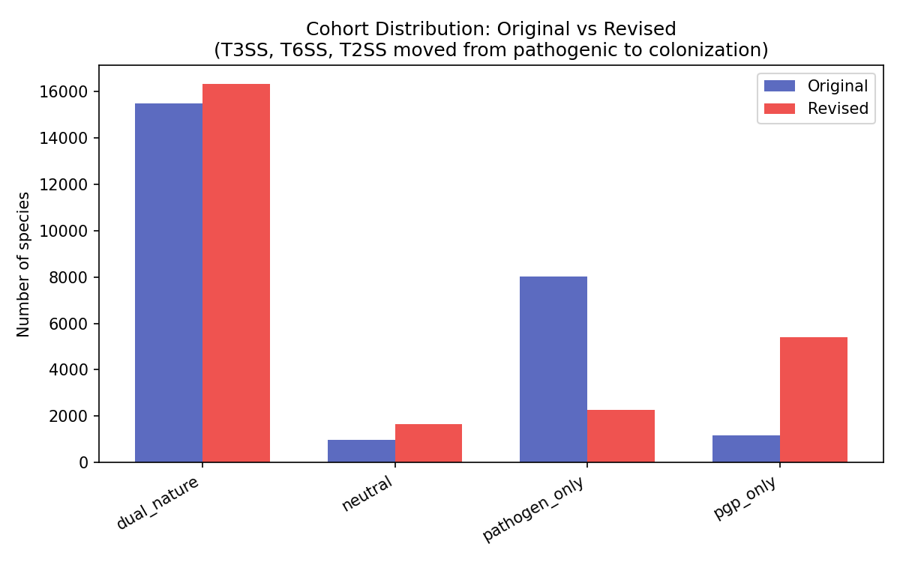

**Marker Drivers**: In dual-nature species, the most prevalent pathogenic markers were T6SS products (64%), T2SS (55%), T3SS products (50%), and chemotaxis (52%), while the most prevalent PGP markers were quorum sensing (49%), phenazine (34%), and flagella (40%). Chemotaxis and flagella — general motility functions — contribute substantially to the dual-nature classification.

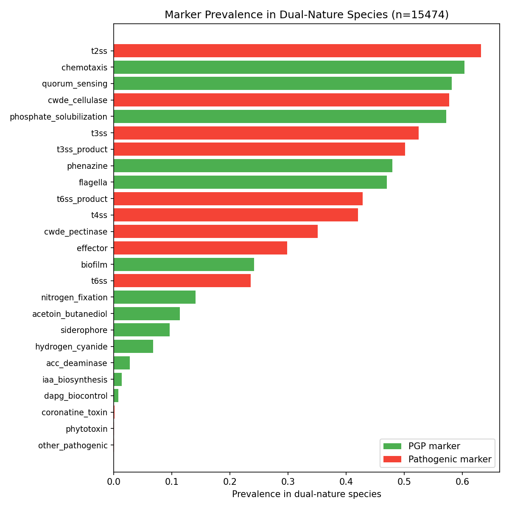

**PGP vs Pathogen Scatter**: Validated against known model organisms: *B. subtilis*, *R. leguminosarum*, *B. japonicum*, and *S. meliloti* cluster in expected quadrants.

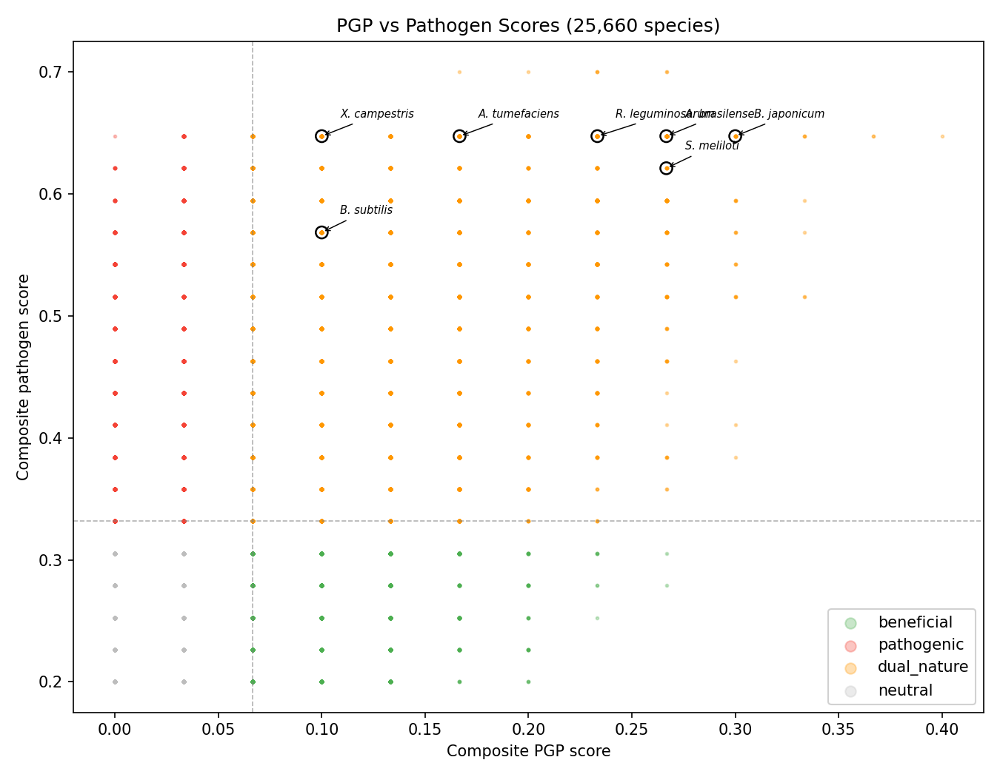

**Genome Size**: Moderate correlation (r=0.44) between genome size and marker count. Cross-tabulation showed that genome-size normalization shifts 33% of dual-nature species to neutral, indicating the effect is meaningful but does not eliminate the dual-nature pattern.

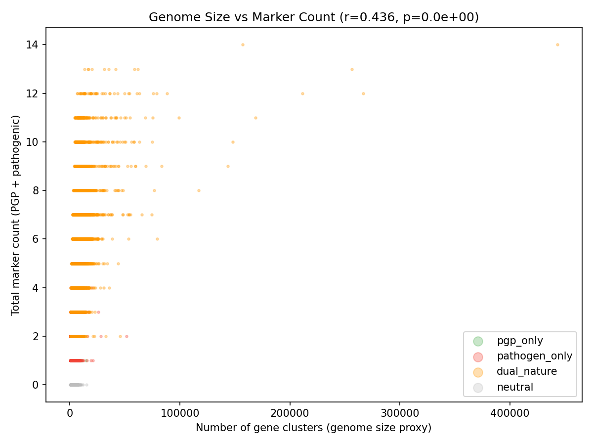

**Predictive Classifier**: Random Forest achieved 64.4% accuracy for compartment prediction (root/rhizosphere/phyllosphere) using 25 binary markers — above the 33% random baseline but far from deterministic, consistent with compartment being one of multiple factors shaping marker profiles. Cohort prediction achieved 99.9% accuracy (trivially, since cohorts are defined by marker presence).

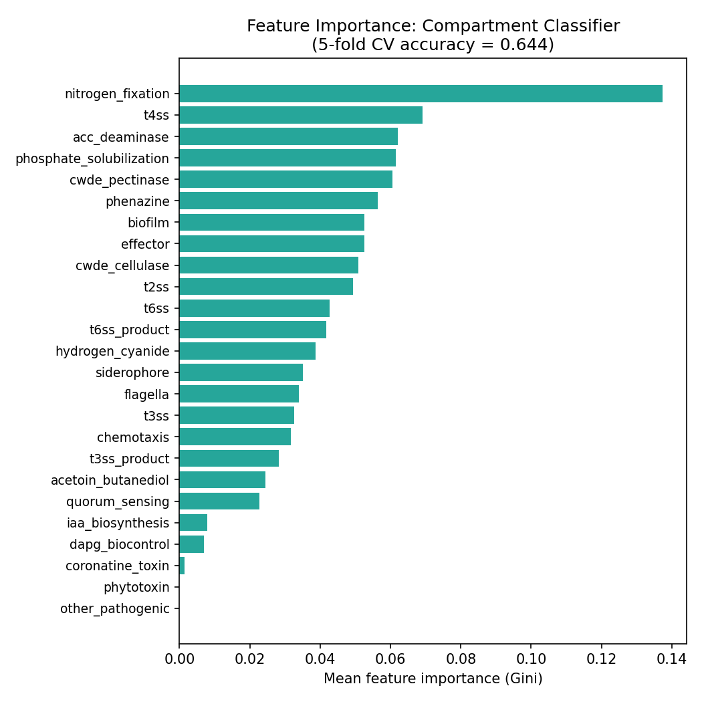

**HGT Deep Dive**: Per-marker transposase co-occurrence analysis revealed that PGP markers show the strongest HGT signal: DAPG biocontrol (OR=8.75), ACC deaminase (OR=6.43), nitrogen fixation (OR=3.76). Among pathogenic markers, T4SS (OR=3.23), T6SS (OR=2.66), and effectors (OR=2.67) also showed significant enrichment. Contig co-location analysis found 498,677 marker-transposase pairs on shared contigs across 18,569 species. T4SS had the most co-located pairs (84,411) with the closest median distance (238 genes). Fifteen marker-transposase pairs were at gene-number distance 1 (immediately adjacent), spanning effectors, T6SS, T3SS, quorum sensing, cellulase, and T4SS in species including *Rhizobium ecuadorense*, *Phytobacter ursingii*, and *Burkholderia puraquae*.

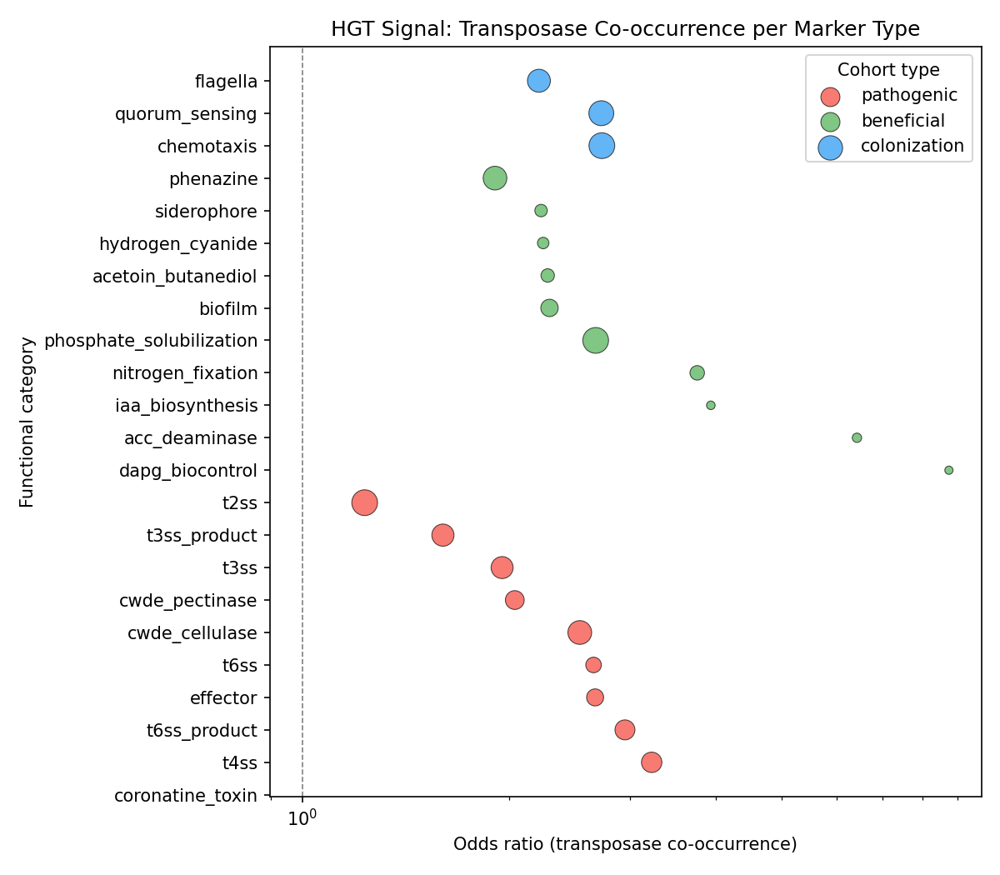

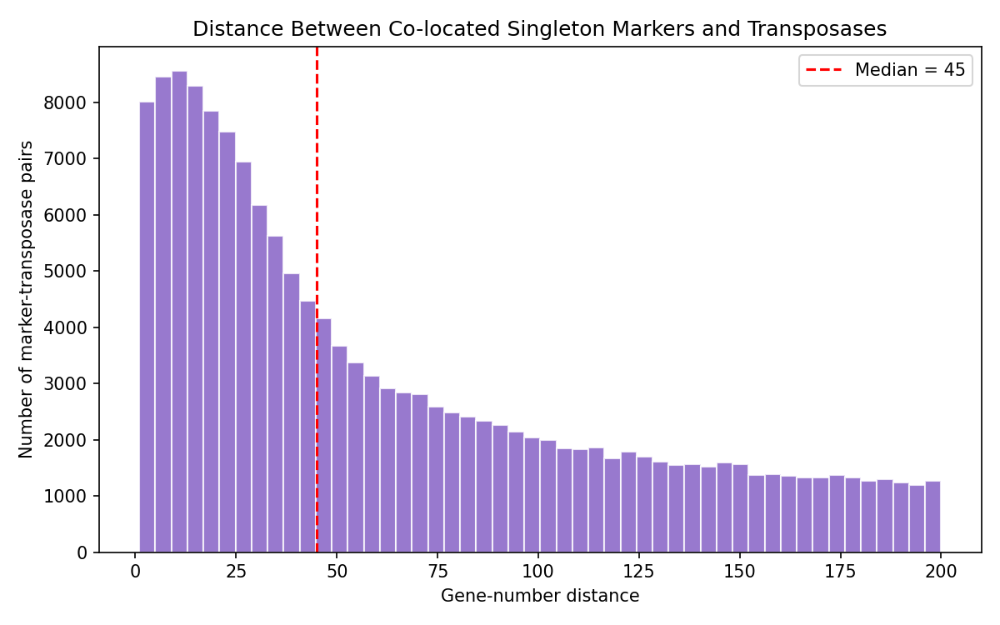

### Novel OG Functional Annotation (NB09)

All 50 plant-enriched OGs from Phase 1 were annotated using eggNOG descriptions, InterProScan domain hits across 18 databases, GO terms, and MetaCyc pathways. Annotation coverage: 50/50 eggNOG descriptions, 50/50 InterProScan domains, 48/50 GO terms (699 unique), 39/50 MetaCyc pathways. The 1,206,652 gene clusters carrying these OGs span 14,329–16,166 species per OG.

Functional classification by COG category: unknown function S (19/50, 38%), energy production C (7/50, 14%), inorganic ion transport P (6/50, 12%), carbohydrate metabolism G (4/50, 8%), secondary metabolite biosynthesis Q (3/50, 6%). The predominance of energy and ion transport functions suggests plant-associated bacteria are enriched for metabolic capabilities related to rhizosphere nutrient competition rather than plant-specific signaling.

### Refined Marker Panel and Host Species (NB10)

**Marker refinement**: The Phase 1 91-marker panel was reduced to 17 plant-specific markers by removing 6 ubiquitous categories (flagella, chemotaxis, T6SS, biofilm, quorum sensing, T2SS) that had only 1.2–2.4× enrichment in plant vs non-plant species. KEGG module completeness gating was applied to multi-gene systems: M00175 (nitrogen fixation, threshold ≥2 genes), M00332 (T3SS, ≥3 genes), M00333 (T4SS, ≥3 genes).

**InterProScan recovery**: 280,193 marker domain hits were found across 24,595 species, recovering 2,804 additional species with CWDE domains (cellulase/pectinase Pfams PF00150, PF00544) not detected in Phase 1's bakta-only search.

**Refined cohort distribution** (25,660 species):

| Cohort | Count | % |
|---|---|---|
| Dual-nature | 12,463 | 48.6% |
| Pathogenic | 6,272 | 24.4% |
| Beneficial | 3,394 | 13.2% |
| Neutral | 3,531 | 13.8% |

Among the 1,115 plant-associated species: dual-nature 878 (78.7%), pathogenic 108 (9.7%), beneficial 94 (8.4%), neutral 35 (3.1%).

**Positive control validation**: Rhizobium 97% beneficial+dual, Bradyrhizobium 100%, Azospirillum 100%, Mesorhizobium 99%. **Negative controls improved**: Escherichia PGP-only 25% (down from ubiquitous dual-nature in Phase 1), Salmonella 0% PGP-only, Staphylococcus 18%, Mycobacterium 6%.

**Host species**: 11,852 genomes with identifiable plant hosts parsed from NCBI isolation_source. Species-level aggregation yielded 1,307 species across 19 testable hosts (≥10 species): rice (286), *Arabidopsis* (184), wheat (122), maize (98), soybean (84), potato (58), tomato (57), sugarcane (47), lettuce (34), banana (30), pepper (25), cotton (24), grape (22), strawberry (18), peanut (17), citrus (14), tea (13), tobacco (12), apple (10).

### MGnify Integration (NB11)

**Taxonomy bridge**: 20,473 MGnify species across 4 biomes linked to 1,185 pangenome genera (9,603 MGnify species in matched genera). Biome composition: soil 19,472 species (4,229 genera), tomato rhizosphere 579 species (309 genera), maize rhizosphere 336 species (212 genera), barley rhizosphere 86 species (52 genera).

**Mobilome analysis** (soil biome, 563 pangenome genera with data): 17,323 mobilome entries detected by ISEScan, ICEfinder, and geNomad. Mobile element types include IS elements (IS110, IS701, IS1634, IS256, IS3), plasmids, prophages, terminal inverted repeats, and viral sequences.

**BGC analysis** (soil biome, 579 pangenome genera with data): 17,608 BGCs classified into MiBIG categories — Polyketide (23.1%), NRP (13.9%), Saccharide (13.2%), RiPP (12.6%), Terpene (12.7%). Average BGC-to-MiBIG similarity scores ranged from 0.38–0.89.

**KEGG module enrichment** (rhizosphere vs soil): Module M00332 (T3SS) showed consistent enrichment in all 3 rhizosphere biomes (22–24%) over soil (12.3%). Modules M00238, M00769, M00136, M00615, M00438 were 2–3× enriched in rhizosphere.

### Subclade Analysis (NB12)

Five species with ≥175 genomes and high plant-associated fractions were selected for within-species subclade analysis using phylogenetic distance-based agglomerative clustering:

| Species | Genomes | Plant-associated | Subclades |
|---|---|---|---|
| *X. euvesicatoria* | 332 | 169 (51%) | 3 |
| *P. avellanae* | 319 | 68 (21%) | 3 |
| *S. meliloti* | 241 | 191 (79%) | 2 |
| *P. amygdali* | 239 | 32 (13%) | 3 |
| *R. laguerreae* | 175 | 139 (79%) | 2 |

Pairwise phylogenetic distances from `phylogenetic_tree_distance_pairs` (22.6M rows) were used to construct distance matrices for MDS visualization and clustering. In the Phase 2 pass, all 5 species showed 0 testable subclade × plant-association enrichments due to a genome ID mismatch (bare NCBI accessions vs GTDB-prefixed IDs) that dropped the plant-associated subset to zero.

**Phase 2b revision (NB13)**: After prepending `GB_`/`RS_` prefixes to the bare accessions, 599 plant-associated genomes were recovered across the 5 species. Two species now show significant subclade × plant-association enrichment: *Pseudomonas_E avellanae* (chi² p = 7.9×10⁻⁴, best-enriched subclade 31% plant) and *Pseudomonas_E amygdali* (chi² p = 0.031). *P. amygdali* additionally shows subclade × host-plant segregation (chi² p = 5.6×10⁻⁹). *S. meliloti*, *R. laguerreae*, and *X. euvesicatoria* remain non-significant. See §11 and `data/subclade_enrichment_corrected.csv`.

## Data

### Sources

| Collection | Tables Used | Purpose |
|---|---|---|
| `kbase_ke_pangenome` | `genome`, `gene_cluster`, `pangenome`, `gtdb_taxonomy_r214v1`, `gtdb_metadata`, `bakta_annotations`, `bakta_pfam_domains`, `eggnog_mapper_annotations`, `gapmind_pathways` | Core pangenome data, functional annotations, pathway predictions |
| `kbase_ke_pangenome` | `ncbi_env` | Environmental metadata for genome classification |
| `kbase_ke_pangenome` | `interproscan_domains`, `interproscan_go`, `interproscan_pathways` | InterProScan domain hits, GO terms, MetaCyc pathways for novel OG annotation (Phase 2) |
| `kbase_ke_pangenome` | `phylogenetic_tree`, `phylogenetic_tree_distance_pairs` | Within-species phylogenetic distances for subclade clustering (Phase 2) |
| `kescience_mgnify` | `species`, `genome`, `gene_mobilome`, `gene_bgc`, `genome_kegg_module`, `genome_cog` | MGnify rhizosphere/soil genome catalogue: mobilome, BGC, KEGG profiles (Phase 2) |
| `kescience_bacdive` | `isolation`, `sequence_info`, `metabolite_utilization` | Strain-level isolation source and metabolic phenotypes |
| `nmdc_arkin` | `taxonomy_features`, `study_table` | Community ecology co-occurrence data |

### Generated Data

| File | Rows | Description |
|---|---|---|
| `data/genome_environment.csv` | 293,059 | Per-genome compartment classification |
| `data/species_compartment.csv` | 26,511 | Species-level compartment assignments (majority vote) |
| `data/compartment_census_summary.csv` | 9 | Compartment species counts |
| `data/ncbi_env_pivot.csv` | 279,547 | NCBI environment cross-validation pivot |
| `data/bacdive_isolation.csv` | 23,988 | BacDive isolation source records |
| `data/bakta_marker_hits.csv` | 387,822 | Bakta gene-name marker hits |
| `data/pfam_marker_hits.csv` | 0 | Pfam domain hits (none found) |
| `data/kegg_marker_hits.csv` | 39,640 | KEGG KO marker hits |
| `data/product_marker_hits.csv` | 256,269 | Product keyword marker hits |
| `data/marker_gene_clusters.csv` | 588,098 | Consolidated marker gene clusters |
| `data/species_marker_matrix.csv` | 25,660 | Species x functional category matrix |
| `data/species_cohort_markers.csv` | 25,660 | Species cohort assignments (NB02) |
| `data/enrichment_results.csv` | 5,671 | OG-level enrichment results |
| `data/logistic_phylo_controlled.csv` | 50 | Phylo-controlled logistic regression results |
| `data/top50_og_species.csv` | varies | Top-50 OG species distributions |
| `data/novel_plant_markers.csv` | 50 | Novel plant-enriched OGs |
| `data/compartment_profiles.csv` | 96 | Per-compartment marker enrichment |
| `data/genus_profiles.csv` | 30 | Top plant-associated genus profiles |
| `data/gapmind_plant_species.csv` | 2,213,340 | GapMind pathway predictions (plant species) |
| `data/pangenome_stats.csv` | 27,702 | Pangenome core/singleton statistics |
| `data/transposase_singletons.csv` | 986,464 | Transposase/integrase singleton clusters |
| `data/genomic_architecture.csv` | 23 | Per-function genomic architecture summary |
| `data/nmdc_genus_abundance.csv` | 40,271 | NMDC genus-level abundances |
| `data/nmdc_soil_file_ids.csv` | 25,547 | NMDC soil/rhizosphere sample IDs |
| `data/gapmind_genus_pathways.csv` | 658,712 | Genus-level GapMind pathway aggregation |
| `data/complementarity_network.csv` | 2,346 | Genus-pair complementarity scores |
| `data/cohort_assignments.csv` | 25,660 | Final composite cohort assignments |
| `data/genus_dossiers.csv` | 30 | Detailed genus-level dossiers |
| `data/genus_dossiers_plant_only.csv` | 30 | Plant/soil-filtered genus dossiers (NB08) |
| `data/species_family_taxonomy.csv` | 27,690 | Species-level GTDB family assignments (NB08) |
| `data/pfam_investigation_cache.csv` | 36 | Pfam domain investigation results (NB08) |
| `data/genome_host_species.csv` | 11,852 | Per-genome plant host species assignments (NB10) |
| `data/species_marker_matrix_v2.csv` | 25,660 | Refined 17-marker species matrix with KEGG gating (NB10) |
| `data/species_cohort_refined.csv` | 25,660 | Refined cohort assignments with taxonomy and host data (NB10) |
| `data/interproscan_marker_hits.csv` | 280,193 | InterProScan domain hits for marker recovery (NB10) |
| `data/kegg_module_completeness.csv` | 19,665 | KEGG module gene counts per species (NB10) |
| `data/phylo_control_results.csv` | 15 | Phylogenetic control logistic regression — 0/14 converged (NB10) |
| `data/mgnify_pangenome_bridge.csv` | 20,473 | MGnify species-to-GTDB taxonomy bridge (NB11) |
| `data/mgnify_host_specificity.csv` | 266 | Genus × rhizosphere biome presence matrix (NB11) |
| `data/mgnify_mobilome.csv` | 17,323 | Mobile element annotations in pangenome genera (NB11) |
| `data/mgnify_bgc_profiles.csv` | 8,089 | Biosynthetic gene cluster profiles by genus (NB11) |
| `data/mgnify_kegg_biome_profiles.csv` | 2,630 | KEGG module distribution across biomes (NB11) |
| `data/species_subclade_definitions.csv` | 1,306 | Phylogenetic subclade assignments per genome (NB12) |
| `data/subclade_og_enrichment.csv` | 6 | Subclade × plant-association enrichment tests (NB12) |
| `data/subclade_host_mapping.csv` | 0 | Host × subclade mapping — insufficient data (NB12) |
| `data/species_validation.csv` | 18 | Species-level ground-truth validation (NB13) |
| `data/pfam_recovery_hits.csv` | varies | Recovered Pfam domain hits via LIKE query (NB13, requires Spark) |
| `data/pfam_recovery_impact.csv` | varies | Cohort impact of recovered Pfam hits (NB13) |
| `data/subclade_enrichment_corrected.csv` | 5 | Subclade × plant enrichment after genome-ID fix (NB13) |
| `data/subclade_host_corrected.csv` | 2 | Subclade × host associations after genome-ID fix (NB13) |
| `data/regularized_phylo_control.csv` | 17 | L1-regularized logit for 17 markers with bootstrap CI (NB14) |
| `data/genome_size_control.csv` | 50 | Genome-size-controlled coefficients for 50 novel OGs (NB14) |
| `data/sensitivity_results.csv` | 1 | PERMANOVA reduced + alpha-class stats (NB14) |
| `data/sensitivity_shuffle.csv` | 15 | Within-genus label shuffling results (NB14) |
| `data/complementarity_v2.csv` | 2,346 | Prevalence-weighted complementarity (NB14) |
| `data/hypothesis_verdicts_final.csv` | 8 | Final H0–H7 verdict table with Phase 2b evidence (NB15) |
| `data/pfam_bakta_ips_audit.csv` | 22 | bakta_pfam_domains vs interproscan_domains coverage audit (2026-04-25) |
| `data/subclade_full_scan.csv` | 18 | Full 65-species subclade × plant scan with Bonferroni + BH-FDR (2026-04-25) |
| `data/species_subclade_definitions_full.csv` | 2,414 | Genome-level subclade assignments for 18 species with phylo tree data (2026-04-25) |
| `data/h1_dbrda_results.csv` | 1 | PERMANOVA + PERMDISP + db-RDA decomposition for H1 (2026-04-25) |
| `data/h1_compartment_dispersions.csv` | 3 | Per-compartment mean centroid distance (2026-04-25) |
| `data/c1_cluster_robust.csv` | 17 | Cluster-robust GLM (cluster=genus) for 17 markers — proper Wald CIs without L1 shrinkage (2026-04-25) |
| `data/h6_host_subclade_full.csv` | 18 | Subclade × host plant scan for the 18 species with phylo data (2026-04-25) |

## Supporting Evidence

### Notebooks

| Notebook | Purpose |
|---|---|
| `01_genome_census.ipynb` | Classify 293K genomes by plant compartment; go/no-go checkpoint |
| `02_marker_gene_survey.ipynb` | Search 91 marker genes across annotations; classify species into cohorts |
| `03_enrichment_analysis.ipynb` | Genome-wide eggNOG OG enrichment with phylogenetic control |
| `04_compartment_profiling.ipynb` | Per-compartment functional signatures; PERMANOVA; genus profiles |
| `05_genomic_architecture.ipynb` | Core/accessory distribution (H2); HGT mobility proxies (H4) |
| `06_complementarity.ipynb` | NMDC co-occurrence; GapMind complementarity; permutation test |
| `07_cohort_synthesis.ipynb` | Composite scoring; validation; genus dossiers; hypothesis summary |
| `08_adversarial_revisions.ipynb` | Sensitivity analyses, negative controls, HGT deep dive, predictive classifiers |
| `09_novel_og_annotation.ipynb` | Functional annotation of 50 plant-enriched OGs via InterProScan, GO, MetaCyc |
| `10_refined_markers_host_species.ipynb` | Refined 17-marker panel, KEGG module gating, host species extraction |
| `11_mgnify_integration.ipynb` | MGnify cross-validation: taxonomy bridge, mobilome, BGC, KEGG enrichment |
| `12_subclade_og_analysis.ipynb` | Within-species subclade clustering and plant-association enrichment testing |
| `13_validation_pfam_subclade.ipynb` | Species-level validation, Pfam LIKE-query recovery, subclade genome-ID fix (C3, I6, Pfam gap) |
| `14_deferred_controls.ipynb` | L1-regularized logit, genome-size covariate, within-genus shuffling, prevalence-weighted complementarity (C1, C4, I1) |
| `15_final_synthesis.ipynb` | Final H0–H7 verdict synthesis integrating Phase 2b corrections |
| `_run_subclade_full_scan.py` | Full 65→18 species subclade × plant-association scan with Bonferroni and BH-FDR correction (item 19, 2026-04-25) |
| `_run_h1_dbrda.py` | PERMANOVA + PERMDISP + db-RDA decomposition for H1 location vs dispersion (item 20, 2026-04-25) |
| `_run_c1_cluster_robust.py` | Cluster-robust GLM (cluster=genus) for 17 markers — proper Wald inference without L1 shrinkage (item 18, 2026-04-25) |
| `_run_h6_host_subclade.py` | Full 18-species subclade × host plant scan with within- and across-species Bonferroni (H6 follow-up, 2026-04-25) |

### Figures

| Figure | Description |
|---|---|
| `nb01_compartment_census.png` | Bar chart of species per plant compartment |
| `nb02_marker_survey.png` | Marker gene survey overview: functional category counts and cohort distribution |
| `volcano_enrichment.png` | Volcano plot of OG enrichment (log2 OR vs -log10 q) with known marker annotations |
| `compartment_heatmap.png` | Heatmap of marker enrichment odds ratios across plant compartments |
| `nb04_cohort_compartment_bar.png` | Stacked bar: cohort proportions by compartment |
| `core_vs_pathogenic.png` | Boxplot comparing core fractions: beneficial vs pathogenic vs colonization |
| `mobility_proxies.png` | Multi-panel mobility proxy analysis (singleton ratio, transposase OR, context variation) |
| `guild_network.png` | Network visualization of genus-genus metabolic complementarity |
| `complementarity_heatmap.png` | Full complementarity score heatmap across genera |
| `complementarity_heatmap_detail.png` | Detail view of top complementarity pairs |
| `synthesis_overview.png` | Three-panel synthesis: genus marker profiles, compartment x cohort distribution, genomic architecture comparison |
| `sensitivity_t3ss_t6ss.png` | Side-by-side bar chart: original vs revised cohort distribution after T3SS/T6SS reclassification |
| `pgp_vs_pathogen_scatter.png` | Scatter plot of composite PGP vs pathogen scores with known organism annotations |
| `dual_nature_marker_drivers.png` | Horizontal bar chart: prevalence of each marker in dual-nature species |
| `genome_size_vs_markers.png` | Scatter plot: gene cluster count vs total marker count by cohort |
| `feature_importance_compartment.png` | Random Forest feature importance for compartment classification |
| `hgt_per_marker_transposase.png` | Dot plot: transposase co-occurrence odds ratio per functional category |
| `hgt_contig_distance.png` | Histogram of gene-number distances between co-located markers and transposases |
| `novel_og_annotation.png` | Novel OG functional classification, core fractions, and domain architecture (NB09) |
| `refined_cohort_comparison.png` | Phase 1 vs Phase 2 cohort distribution comparison (NB10) |
| `mgnify_integration.png` | MGnify taxonomy bridge, host specificity, mobilome, and BGC profiles (NB11) |
| `subclade_analysis.png` | Phylogenetic subclade clustering and plant-association mapping (NB12) |
| `species_validation.png` | Pathogen ratio by ground-truth class for 18 model organisms (NB13) |
| `subclade_corrected.png` | Subclade MDS colored by plant-association after genome-ID fix (NB13) |
| `complementarity_comparison.png` | Max vs prevalence-weighted complementarity distributions (NB14) |
| `final_synthesis.png` | Six-panel synthesis of Phase 2b results across H0–H7 (NB15) |

## Future Directions

Some of the items below were raised in the prior reviewer round (`REVIEW_1.md`) and remain deferred future work; others are new opportunities that emerged during Phase 2b. Items already addressed in Phase 2b are not listed here — see §11 and the disposition table.

1. **Full PGLMM with GTDB-tree-derived random-effect covariance**: Phase 2b closed C1 with a cluster-robust GLM at genus level (proper Wald inference, no L1 shrinkage; 8/14 markers significant) and complemented it with within-genus permutation (3/15 markers species-level). A full phylogenetic GLMM where the random-effect covariance comes from the GTDB tree (rather than genus clustering) would be the gold standard, but the 25K × 25K dense covariance is intractable in memory; sparse approximations or species subsampling are the practical path.

2. **Transcriptomic validation of dual-nature**: The dual-nature classification is based on gene presence. RNAseq under beneficial vs. pathogenic conditions would reveal whether both gene sets are co-expressed or differentially regulated. The 17-genera core rhizosphere set (NB11) and the species-level Tier-1 markers (nitrogen fixation, ACC deaminase, T3SS) provide candidate organisms and gene targets for targeted experiments.

3. **Mechanistic hypotheses for novel OGs via AlphaFold / pathway databases** (REVIEW_1 #3): For the top novel OGs (COG3569, COG1845, COG0843, COG0316), structural prediction via AlphaFold or systematic cross-referencing with biochemical pathway databases would generate testable mechanistic hypotheses about their plant-interaction roles beyond the current "energy metabolism / Fe-S cluster / inorganic ion transport" classifications. The 50 OGs all have annotated function from NB09 but lack mechanism-level proposals.

4. **Electron transport and microaerobic adaptation**: The enrichment of high-affinity cytochrome oxidases (COG1845, COG0843) in plant-associated species suggests microaerobic adaptation as a key niche axis. Experimental measurement of oxygen tolerance ranges in plant-associated vs non-plant strains would test this mechanistic hypothesis.

5. **Expanded subclade analysis** (REVIEW_1 #4, partially closed): The Phase 2b 65-species scan closed (a) the genome-ID linkage and ran the available 18 species. Outstanding: (b) accessory-gene presence/absence profiling as an alternative subclade definition (the current method is core-phylogeny-based), and (c) gene-content trees vs species trees to identify HGT-driven incongruences. Both require larger gene-cluster-by-genome data pulls than this project executed.

6. **Phylogenetic-tree coverage in BERDL** (new finding from item 19): Only 18/65 plant-associated species with ≥20 genomes have phylogenetic-tree distance pairs in `kbase_ke_pangenome.phylogenetic_tree_distance_pairs`. Major plant-associated taxa missing include *Bradyrhizobium japonicum*, *B. diazoefficiens*, *Mesorhizobium ciceri*, *Sinorhizobium medicae*, *Burkholderia glumae*, *Methylobacterium extorquens*, *Streptomyces scabiei*, *Xylella taiwanensis*, *Clavibacter michiganensis*. Expanding tree coverage would directly increase the power of any within-species phylogenetic analysis. Worth raising with the BERDL data team.

7. **Finer-grained compartment resolution**: With more targeted isolation efforts, the endophyte compartment (currently 29 species) could be expanded to enable full four-way compartment comparison.

8. **Metabolic complementarity at finer resolution** (REVIEW_1 #7): The GapMind pathway level (80 pathways) may be too coarse. Reaction-level complementarity or substrate-specific analysis could reveal patterns masked by the current pathway-level aggregation. Note that the prevalence-weighted re-test (NB14) plus the Cohen's d formula correction reduced the original implausible |d|=7.54 to |d|≈0.4; the direction (redundancy) is robust at this resolution.

9. **GeNomad mobile element integration** (REVIEW_1 #8): When GeNomad mobile-element predictions become available in BERDL, replace the current proxy-based HGT analysis (transposase/integrase singletons, MGnify mobilome aggregates) with direct mobile-element annotations to strengthen H4 conclusions and resolve the genus-vs-genome scale-dependent mobilome signal.

10. **SynCom design**: The genus dossiers, core rhizosphere genera, and BGC profiles could inform synthetic community design for plant growth promotion, following the approach of Song et al. (2026) for Bacillus SynComs. The 84 NRP/siderophore-producing plant genera identified in NB11 are prime candidates.

11. **Crop-specific biocontrol** (REVIEW_1 #6): The host-specificity matrix (NB11) identified 117 tomato-specific, 54 maize-specific, and 5 barley-specific genera; the H6 subclade × host scan additionally identified *X. campestris* × Brassica and *X. vasicola* × maize as canonical pathovar-host segregations. Targeted isolation and characterization of crop-specific protective genera, optionally screened against the corresponding pathovars from H6, would yield more effective biocontrol agents than current generalist approaches.

## References

- Ajdig M, Mbarki A, Chouati T, Rached B, ..., Melloul M (2025). "Comprehensive genomic and pan-genomic analysis of the drought-tolerant Bacillus halotolerans strain OM-41." *World J Microbiol Biotechnol* 41:157. PMID: 40719802
- Bai Y, Muller DB, Srinivas G, Garrido-Oter R, ..., Schulze-Lefert P (2015). "Functional overlap of the Arabidopsis leaf and root microbiota." *Nature* 528:364-369. PMID: 26633631
- Bograd A, Oppenheimer-Shaanan Y, Levy A (2025). "Plasmids, prophages, and defense systems are depleted from plant microbiota genomes." *Genome Biol* 26:117. DOI: 10.1186/s13059-025-03641-3
- Colburn-Clifford JM, Allen C (2010). "A cbb3-type cytochrome c oxidase contributes to Ralstonia solanacearum growth in microaerobic environments and to bacterial wilt disease development in tomato." *Mol Plant-Microbe Interact* 23:1042-1052. PMID: 20615115
- Coyte KZ, Stevenson C, Knight CG, Harrison E, Hall JPJ, Sherr DJ (2022). "Horizontal gene transfer and ecological interactions jointly control microbiome stability." *PLoS Biol* 20:e3001847.
- Drew GC, Stevens EJ, King KC (2021). "Microbial evolution and transitions along the parasite-mutualist continuum." *Nat Rev Microbiol* 19:623-638. PMID: 33875863
- Etesami H (2025). "The dual nature of plant growth-promoting bacteria." *Curr Res Microbial Sci* 9:100421. PMID: 40600175
- Fuangthong M, Jittawuttipoka T, Wisitkamol R, Romsang A, ..., Mongkolsuk S (2015). "IscR plays a role in oxidative stress resistance and pathogenicity of a plant pathogen, Xanthomonas campestris." *Microbiol Res* 170:139-146. PMID: 25200360
- Ghaly TM, Gillings MR, Rajabal V, Paulsen IT, Tetu SG (2024). "Horizontal gene transfer in plant microbiomes: integrons as hotspots." *Front Microbiol* 15:1338026. PMID: 38741746
- Gonzalez-Vallina SR et al. (2024). "Bacterial family-specific enrichment and functions of secretion systems in the rhizosphere." *bioRxiv*. DOI: 10.1101/2024.05.07.592589
- Hansen AP et al. (2025). "Functional profiles of phyllosphere and rhizosphere metagenomes differ across milkweed species." *Environ Microbiol Rep* 17(4).
- Knief C, Delmotte N, Chaffron S, Stark M, ..., Vorholt JA (2012). "Metaproteogenomic analysis of microbial communities in the phyllosphere and rhizosphere of rice." *ISME J* 6:1378-1390. PMID: 22189496
- Levy A, Salas Gonzalez I, Mittelviefhaus M, ..., Dangl JL (2018). "Genomic features of bacterial adaptation to plants." *Nat Genet* 50:138-150. PMID: 29255260
- Loper JE, Hassan KA, Mavrodi DV, Davis EW, ..., Paulsen IT (2012). "Comparative genomics of plant-associated Pseudomonas spp." *PLoS Genet* 8:e1002784. PMID: 22792073
- Louca S, Polz MF, Mazel F, Albright MBN, ..., Parfrey LW (2018). "Function and functional redundancy in microbial systems." *Nat Ecol Evol* 2:936-943. PMID: 29662222
- Melnyk RA, Hossain SS, Haney CH (2019). "Convergent gain and loss of genomic islands drive lifestyle changes in plant-associated Pseudomonas." *ISME J* 13:1575-1588. PMID: 30787396
- Osayande IS, Han X, Tsuda K (2025). "Dynamic shifts in plant-microbe relationships." *Plant Biotechnol* 42(3):25.0428a.
- Parks DH, Chuvochina M, Rinke C, Mussig AJ, ..., Hugenholtz P (2022). "GTDB: an ongoing census of bacterial and archaeal diversity through a phylogenetically consistent, rank normalized and complete genome-based taxonomy." *Nucleic Acids Res* 50:D199-D207. PMID: 34520557
- Pinto-Carbo M, Sieber S, Dessein S, ..., Carlier A (2016). "Evidence of horizontal gene transfer between obligate leaf nodule symbionts." *ISME J* 10:2092-2105. PMID: 26978165
- Preisig O, Zufferey R, Thony-Meyer L, Appleby CA, Hennecke H (1996). "A high-affinity cbb3-type cytochrome oxidase terminates the symbiosis-specific respiratory chain of Bradyrhizobium japonicum." *J Bacteriol* 178:1532-1538. PMID: 8626278
- Price MN, Wetmore KM, Waters RJ, ..., Deutschbauer AM (2018). "Mutant phenotypes for thousands of bacterial genes of unknown function." *Nature* 557:503-509. PMID: 29769716
- Puente-Sanchez F, Pascual-Garcia A, Bastolla U, ..., Elias-Arnanz M (2024). "Cross-biome microbial networks reveal functional redundancy." *Commun Biol* 7:1046.
- Rajabal V, Ghaly TM, Egidi E, Ke M, ..., Tetu SG (2024). "Exploring the role of mobile genetic elements in shaping plant-bacterial interactions for sustainable agriculture." *Plants People Planet* 6:408-420. DOI: 10.1002/ppp3.10448
- Saati-Santamaria Z, Gonzalez-Dominici LI, ..., Garcia-Fraile P (2025). "Transcriptome-guided discovery of novel plant-associated genes in a rhizosphere Pseudomonas." *Microbiome* 14:20. PMID: 41345977
- Shariati JV, Malboobi MA, Tabrizi Z, ..., Ghareyazie B (2017). "Comprehensive genomic analysis of a plant growth-promoting rhizobacterium Pantoea agglomerans strain P5." *Sci Rep* 7:15820.
- Silva UCM, da Silva DRC, ..., Dos Santos VL (2025). "Genomic and phenotypic insights into Serratia interaction with plants." *Braz J Microbiol* 56:1045-1068. PMID: 40131635
- Song Y, Chen Q, Luo S, ..., Shen D (2026). "Ecology-guided Bacillus SynCom from a rice-duckweed core reveals division of labor." *Microbiome* 14.
- Tampakaki AP (2022). "Bridging the gap: Type III secretion systems in plant-beneficial bacteria." *Microorganisms* 10:187. PMID: 35056636
- Trivedi P, Leach JE, Tringe SG, Sa T, Singh BK (2020). "Plant-microbiome interactions: from community assembly to plant health." *Nat Rev Microbiol* 18:607-621. PMID: 32788714
- Zhou H, Gao Y, Wu B, ..., Ni K (2025). "Phyllosphere microbiomes in grassland plants harbor a vast reservoir of novel antimicrobial peptides." *J Adv Res*. PMID: 41391818
- Satterwhite RS, Bergelson J (2025). "Adaptation without Dominance in Pseudomonas syringae Pathovars." *Microb Ecol* 89:27. DOI: 10.1007/s00248-025-02675-1. PMID: 41405607
- Fautt C, Couradeau E, Hockett KL (2024). "Naïve Bayes Classifiers and accompanying dataset for Pseudomonas syringae isolate characterization." *Sci Data* 11:178. DOI: 10.1038/s41597-024-03003-x. PMID: 38326362
- Saputra E, Kowalczyk A, Cusick L, Clark N, Chikina M (2021). "Phylogenetic Permulations: A Statistically Rigorous Approach to Measure Confidence in Associations in a Phylogenetic Context." *Mol Biol Evol* 38:3004-3021. DOI: 10.1093/molbev/msab068. PMID: 33739420
- Chatterjee A, Lahiri SN (2011). "Bootstrapping lasso estimators." *J Am Stat Assoc* 106:608-625. DOI: 10.1198/jasa.2011.tm10079
