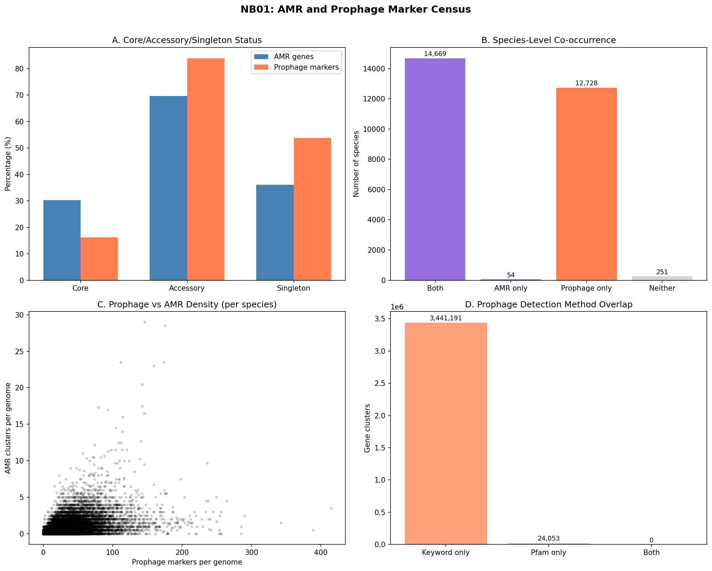
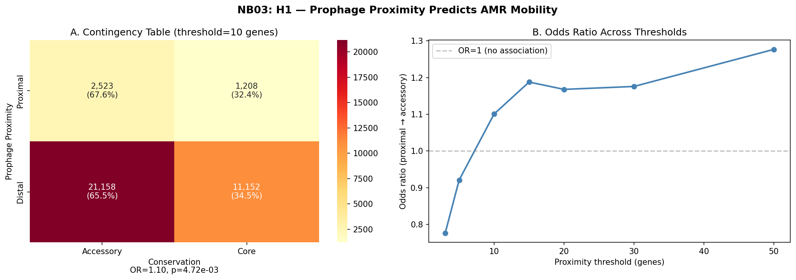
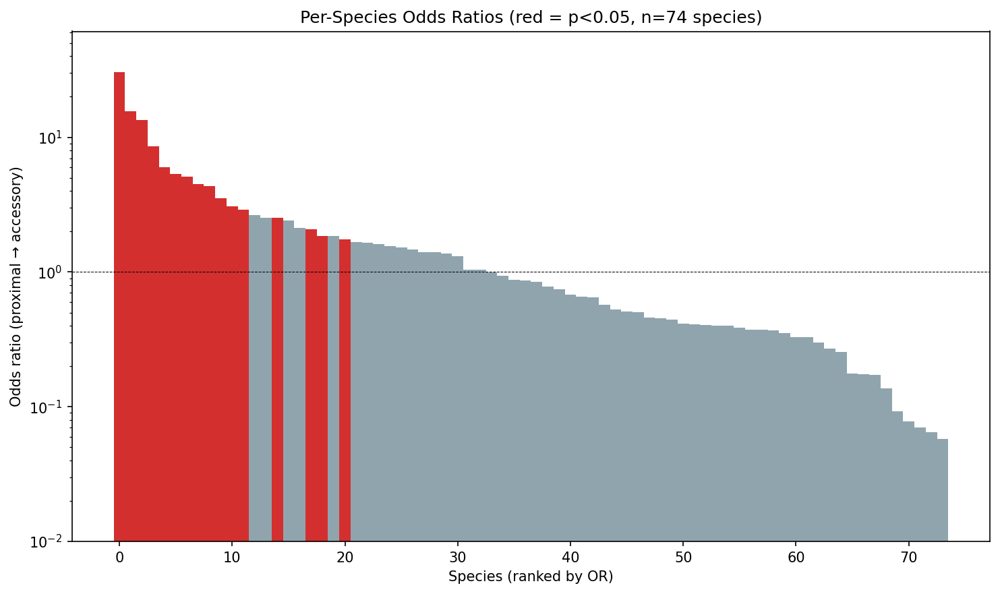
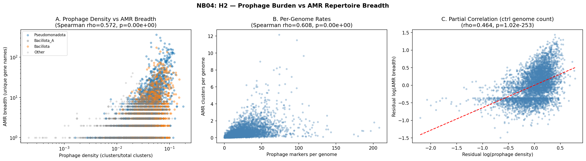
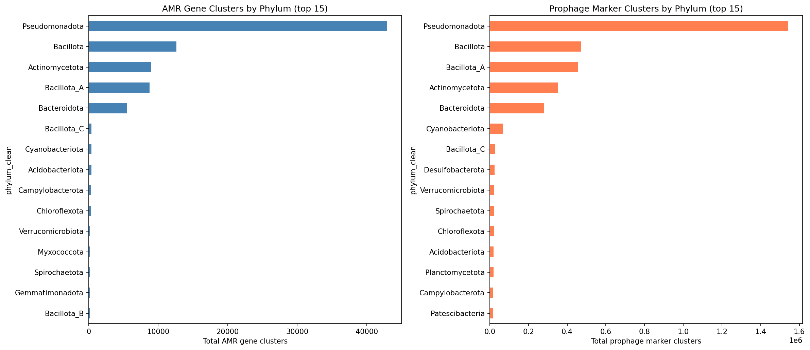
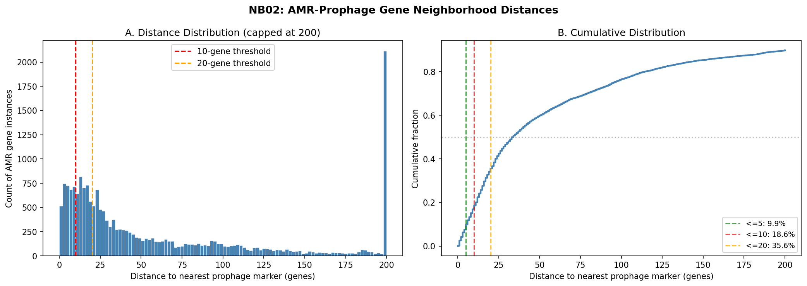
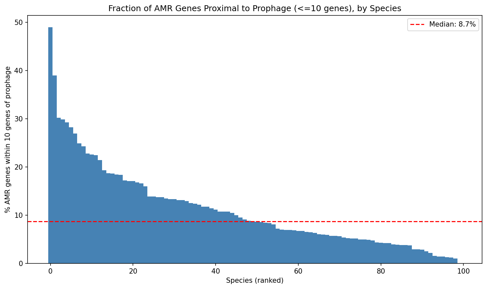

# Report: Prophage-AMR Co-mobilization Atlas

## Key Findings

### Finding 1: AMR genes frequently share contigs with prophage markers

Over half (55.7%) of AMR gene instances in the top-100 AMR-burdened species reside on contigs that also carry strict prophage markers (terminase, phage structural proteins, holin/lysin). Among these co-localized AMR genes, the median distance to the nearest prophage marker is 34 genes, and 10.4% of all AMR genes are within 10 genes of a prophage marker.

Across the full pangenome inventory, 83,008 AMR gene clusters and 3.47 million prophage marker clusters were identified. Prophage markers are overwhelmingly accessory (83.8%) and frequently singleton (53.8%), while AMR genes are also predominantly accessory (69.7%) but less singleton (36.1%). Of 27,702 species in the pangenome, 14,669 (52.9%) carry both AMR and prophage markers.

*(Notebook: 01_amr_prophage_census.py)*

### Finding 2: Prophage proximity weakly predicts AMR gene mobility (H1)

Prophage-proximal AMR genes (within 10 genes) are slightly more likely to be accessory (67.6%) than distal AMR genes (65.5%), yielding a statistically significant but modest effect (Fisher's exact OR=1.10, p=0.005, bootstrap 95% CI [1.024, 1.185]).

The effect is threshold-dependent: it is absent or reversed at very close range (OR=0.78 at 3 genes, OR=0.92 at 5 genes) and strengthens at broader thresholds (OR=1.19 at 15 genes, OR=1.28 at 50 genes). Per-species analysis reveals heterogeneity: only 33 of 74 testable species show OR>1, with a median species-level OR of 0.85.

*(Notebook: 03_conservation_test.py)*

### Finding 3: Prophage density strongly predicts AMR repertoire breadth (H2)

Species with higher prophage marker density carry significantly broader AMR gene repertoires (Spearman rho=0.572, p<10^-300, n=4,770 species). A log-log regression reveals that a 10-fold increase in prophage density predicts a ~6.6-fold increase in AMR breadth (slope=0.823, R²=0.30). The association is robust after controlling for genome count (partial Spearman rho=0.464, p=1.0×10^-253).

The correlation is significant across all five major phyla: Pseudomonadota (rho=0.54), Bacillota_A (rho=0.55), Bacillota (rho=0.40), Bacteroidota (rho=0.59), and Actinomycetota (rho=0.29). This pan-phylogenetic consistency argues against phylogenetic confounding.

*(Notebook: 04_species_breadth_test.py)*

### Finding 4: Fitness cost comparison not testable (H3)

The BERDL fitness browser covers only 48 model organisms with RB-TnSeq data, which do not overlap well with the GTDB pangenome species analyzed here. H3 could not be tested and remains an open question for future work with expanded fitness datasets.

*(Notebook: 05_synthesis.py)*

## Results

### Pangenome-Scale Census

| Metric | Value |
|--------|-------|
| AMR gene clusters | 83,008 |
| Prophage marker clusters (strict) | 1,261,929 |
| Prophage marker clusters (broad) | 3,465,244 |
| Species with both AMR and prophage | 14,669 |
| AMR clusters that are accessory | 69.7% |
| Prophage clusters that are accessory | 83.8% |

### Gene Neighborhood Co-localization

Across 100 species (20 genomes sampled per species, 1,953 genomes total), 36,041 AMR gene instances were analyzed:

| Distance threshold | AMR instances | % of total |
|-------------------|---------------|-----------|
| On prophage contig | 20,073 | 55.7% |
| Within 50 genes | 12,026 | 33.4% |
| Within 20 genes | 7,137 | 19.8% |
| Within 10 genes | 3,731 | 10.4% |
| Within 5 genes | 1,991 | 5.5% |

### H1: Conservation × Proximity

| Condition | Accessory | Core | % Accessory |
|-----------|-----------|------|-------------|
| Proximal (≤10 genes) | 2,523 | 1,208 | 67.6% |
| Distal (>10 genes) | 21,158 | 11,152 | 65.5% |

Fisher's exact test (one-sided): OR=1.10, p=0.005. Bootstrap 95% CI: [1.024, 1.185].

### H2: Species-Level Breadth

| Test | Statistic | p-value |
|------|-----------|---------|
| Spearman: prophage density vs AMR breadth | rho=0.572 | <10^-300 |
| Spearman: prophage/genome vs AMR/genome | rho=0.608 | <10^-300 |
| Log-log regression slope | 0.823 (SE=0.018) | <10^-300 |
| Partial Spearman (ctrl genome count) | rho=0.464 | 1.0×10^-253 |

## Interpretation

The strongest finding is that prophage density is a powerful species-level predictor of AMR repertoire breadth (H2). This is consistent with two non-exclusive mechanisms: (1) prophages directly mobilize resistance genes via specialized or generalized transduction, and (2) species with high recombination potential (indicated by many prophages) are also better at acquiring genes from other mobile elements. The effect persists after controlling for genome count and is consistent across all five major phyla, arguing against a purely phylogenetic explanation.

The gene-level co-localization result (H1) is more nuanced. While statistically significant in aggregate, the effect is modest (2.1 percentage point difference in accessory fraction) and heterogeneous across species. The reversal at very close range (3-5 genes) may reflect that genes immediately adjacent to phage structural genes are core phage components rather than recently acquired cargo. The strengthening at broader thresholds (15-50 genes) could capture "genomic islands" that include both phage remnants and laterally transferred genes.

### Literature Context

Based on articles retrieved from PubMed:

- Our H2 finding aligns with Rendueles et al. (2018) ([DOI](https://doi.org/10.1371/journal.pgen.1007862)), who showed that bacteria encoding capsules have more prophages AND more antibiotic resistance genes across >100 pangenomes. Our work extends this by demonstrating the prophage-AMR correlation at much larger scale (4,770 species vs ~100) and showing it persists after controlling for genome count rather than capsule presence.

- Chen et al. (2018) ([DOI](https://doi.org/10.1016/j.envpol.2018.11.024)) found ARG-MGE co-occurrence on assembled contigs from river metagenomes, including associations with prophages. Our pangenome-scale analysis provides a genomic-reference counterpart to their metagenomic observations, confirming that the ARG-prophage association is encoded in reference genomes, not just environmental assemblies.

- Bearson & Brunelle (2015) ([DOI](https://doi.org/10.1016/j.ijantimicag.2015.04.008)) demonstrated that fluoroquinolone exposure induces prophage in multidrug-resistant *Salmonella*, enabling phage-mediated transduction of resistance plasmids. This provides a direct mechanistic link supporting our correlative finding.

- Fisarova et al. (2021) ([DOI](https://doi.org/10.1128/mSphere.00223-21)) showed that *S. epidermidis* phages transduce antimicrobial resistance plasmids at high frequency, providing additional mechanistic evidence for phage-mediated AMR spread in clinically relevant organisms.

### Novel Contribution

1. **Scale**: This is the first pangenome-scale analysis of prophage-AMR gene-neighborhood co-localization across 100 species (1,953 genomes, 36,041 AMR gene instances).
2. **Species-level predictor**: Prophage density explains 30% of variance in AMR breadth across 4,770 species — a stronger predictor than previously documented.
3. **Threshold sensitivity**: The reversal of the proximity-accessory association at very close range (≤5 genes) suggests that immediate phage neighbors are core phage genes, not acquired cargo. This nuance was not captured in prior contig-level studies.

### Limitations

- **Gene position proxy**: Distances are in ordinal gene positions parsed from gene_id format, not base-pair resolution. True genomic distances may differ.
- **Prophage identification**: Uses keyword/Pfam matching on bakta_annotations rather than dedicated prophage prediction tools (e.g., PHASTER, geNomad). May include false positives (e.g., phage-defense systems) and miss divergent prophages.
- **Sampling**: 20 genomes sampled per species for co-localization (NB02). While representative, exhaustive analysis of all 293K genomes would strengthen the findings.
- **Core/accessory labels**: Depend on species-level pangenome calling (motupan). The same gene in different species may have different conservation status.
- **Fitness data gap**: H3 could not be tested due to limited overlap between fitness browser organisms and GTDB species.
- **Correlation vs causation**: The H2 association does not prove phage-mediated AMR transfer; species with open pangenomes may independently accumulate both prophages and AMR genes.

## Data

### Sources

| Collection | Tables Used | Purpose |
|------------|-------------|---------|
| `kbase_ke_pangenome` | `bakta_amr`, `bakta_annotations`, `bakta_pfam_domains` | AMR and prophage marker identification |
| `kbase_ke_pangenome` | `gene`, `gene_genecluster_junction`, `gene_cluster` | Gene coordinates and cluster membership |
| `kbase_ke_pangenome` | `genome`, `pangenome`, `gtdb_taxonomy_r214v1` | Species membership, genome counts, taxonomy |
| `kescience_fitnessbrowser` | `genefitness`, `gene`, `organism` | Attempted fitness cost comparison (H3) |

### Generated Data

| File | Rows | Description |
|------|------|-------------|
| `data/amr_clusters.csv` | 83,008 | AMR gene clusters with species, core/accessory status, gene names |
| `data/prophage_marker_clusters.csv` | 3,465,244 | Prophage marker clusters from keyword + Pfam detection |
| `data/amr_prophage_species_summary.csv` | 27,702 | Per-species AMR and prophage counts with taxonomy |
| `data/amr_prophage_distances.csv` | 36,041 | Per-AMR-gene-instance distance to nearest prophage marker |
| `data/census_summary.json` | — | Aggregate census statistics |
| `data/coloc_summary.json` | — | Co-localization summary statistics |
| `data/h1_test_results.json` | — | H1 Fisher's exact test results and threshold sensitivity |
| `data/h2_test_results.json` | — | H2 regression and correlation results |
| `data/h3_test_results.json` | — | H3 fitness comparison results (not tested) |
| `data/project_synthesis.json` | — | Integrated synthesis of all hypotheses |

## Supporting Evidence

### Notebooks

| Notebook | Purpose |
|----------|---------|
| `01_amr_prophage_census.py` | Census of AMR and prophage markers across all species |
| `02_gene_neighborhood_coloc.py` | Gene-level co-localization distances for top-100 species |
| `03_conservation_test.py` | H1: Fisher's exact test of proximity × conservation |
| `04_species_breadth_test.py` | H2: Regression of AMR breadth on prophage density |
| `05_synthesis.py` | H3 attempt + synthesis of all hypotheses |

### Figures

| Figure | Description |
|--------|-------------|
| `nb01_census_overview.png` | AMR and prophage marker census bar charts |
| `nb01_amr_prophage_phylum_distribution.png` | Distribution of AMR and prophage across phyla |
| `nb02_distance_distribution.png` | AMR-prophage distance histogram and CDF |
| `nb02_proximal_fraction.png` | Per-species fraction of AMR genes proximal to prophage |
| `nb03_h1_contingency.png` | H1 contingency table heatmap and threshold sensitivity |
| `nb03_h1_species_odds.png` | Per-species odds ratios for H1 |
| `nb04_h2_breadth_regression.png` | H2 scatter plots and partial correlation |
| `nb05_synthesis.png` | Multi-panel synthesis summary |

## Future Directions

1. **Dedicated prophage prediction**: Apply geNomad or PHASTER to BERDL genomes and ingest results as a new table. This would replace keyword-based prophage detection with a validated tool and reduce false positives.
2. **Base-pair resolution**: Use contig sequences (scaffoldseq) to calculate true genomic distances rather than ordinal gene positions.
3. **Expanded fitness analysis**: As fitness browser coverage expands, revisit H3 to test whether prophage-proximal AMR genes have distinct fitness costs.
4. **Plasmid vs phage partitioning**: Distinguish between AMR genes mobilized by prophages vs plasmids vs ICEs using the pangenome-level co-localization data.
5. **Clinical strain focus**: Analyze the WHO priority pathogen subset (K. pneumoniae, A. baumannii, P. aeruginosa, E. coli) in greater depth with all available genomes.

## References

- Rendueles O, de Sousa JAM, Bernheim A, Touchon M, Rocha EPC. (2018). "Genetic exchanges are more frequent in bacteria encoding capsules." *PLoS Genet*. 14(12):e1007862. [DOI](https://doi.org/10.1371/journal.pgen.1007862). PMID: 30576310.
- Chen H, Chen R, Jing L, Bai X, Teng Y. (2018). "A metagenomic analysis framework for characterization of antibiotic resistomes in river environment." *Environ Pollut*. 245:398-407. [DOI](https://doi.org/10.1016/j.envpol.2018.11.024). PMID: 30453138.
- Bearson BL, Brunelle BW. (2015). "Fluoroquinolone induction of phage-mediated gene transfer in multidrug-resistant Salmonella." *Int J Antimicrob Agents*. 46(2):201-4. [DOI](https://doi.org/10.1016/j.ijantimicag.2015.04.008). PMID: 26078016.
- Fisarova L, et al. (2021). "Staphylococcus epidermidis Phages Transduce Antimicrobial Resistance Plasmids and Mobilize Chromosomal Islands." *mSphere*. 6(3):e00223-21. [DOI](https://doi.org/10.1128/mSphere.00223-21). PMID: 33980677.
- Price MN, et al. (2018). "Mutant phenotypes for thousands of bacterial genes of unknown function." *Nature*. 557:503-509. [DOI](https://doi.org/10.1038/s41586-018-0124-0). PMID: 29769716.
- Arkin AP, et al. (2018). "KBase: The United States Department of Energy Systems Biology Knowledgebase." *Nat Biotechnol*. 36:566-569. [DOI](https://doi.org/10.1038/nbt.4163). PMID: 29979655.
