# Report: Prophage Gene Modules and Terminase-Defined Lineages Across Bacterial Phylogeny and Environmental Gradients

## Key Findings

### 1. Prophage gene modules are universal but structurally variable across 27,702 bacterial species

All 27,702 species in the BERDL pangenome carry prophage-associated gene clusters, with 4,005,537 total prophage gene clusters identified via eggNOG annotations. Three modules are near-universal: packaging (A, 100%), lysis (D, 99.9%), and lysogenic regulation (F, 100%). The structurally variable modules — head morphogenesis (B, 56.1%), tail (C, 55.6%), and anti-defense (G, 64.3%) — show the most phylogenetic and environmental variation. 34.9% of species carry all 7 modules.

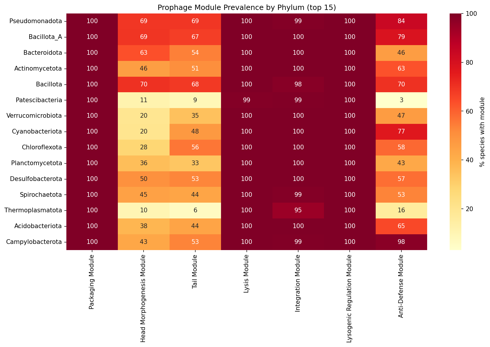

Modules A, D, and F likely include many "domesticated" prophage remnants (Bobay et al. 2014) — defective prophages under purifying selection that retain packaging, lysis, and regulatory genes. The structurally variable modules (B, C, G) are more informative for understanding prophage ecology because their presence indicates more complete prophage elements.

*(Notebook: 01_prophage_gene_discovery.ipynb)*

### 2. Environment explains more variance in prophage composition than host phylogeny

PERMANOVA on Bray-Curtis distances of prophage module composition (n=1,773 species subsample, 99 permutations) reveals that all three predictors are significant (p=0.01), but with strikingly different effect sizes:

| Predictor | F-statistic | p-value | Groups |
|-----------|-------------|---------|--------|
| Genome size quartile | **212.99** | 0.01 | 4 |
| Environment | **30.04** | 0.01 | 10 |
| Phylogeny (family) | **6.17** | 0.01 | 294 |

Genome size is the dominant predictor (rho=0.717 with prophage cluster count), followed by environment, then phylogeny. However, Kruskal-Wallis tests within each genome size quartile confirm that environment significantly affects prophage module count even after stratification (all p < 6.5e-78), demonstrating that the environmental signal is not a genome size artifact.

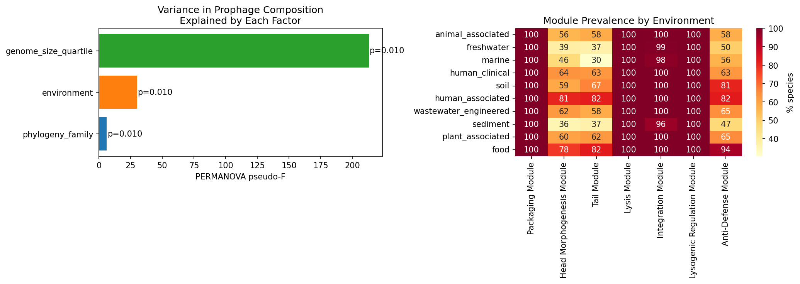

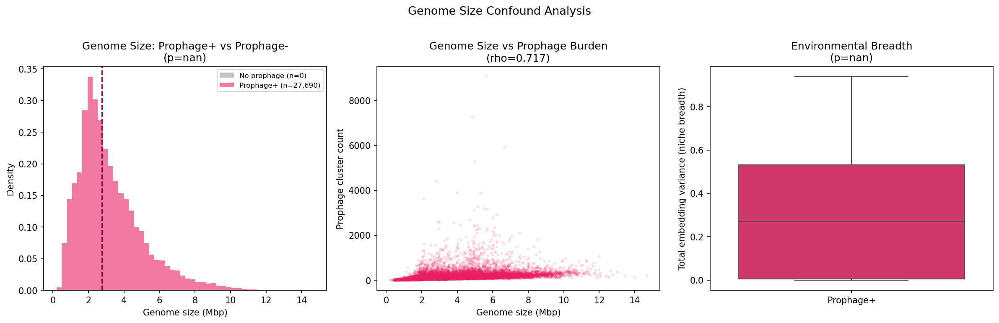

AlphaEarth environmental embedding analysis (2,008 species with ≥5 embedded genomes) confirms a strong partial correlation between environmental niche breadth and prophage module count after controlling for genome size (partial Spearman rho=0.468, p=8.41e-110).

*(Notebook: 04_phylogenetic_distribution.ipynb)*

### 3. Tail, head, and anti-defense modules are enriched in human-associated environments beyond phylogenetic expectation

Constrained permutation null models (500 permutations preserving host family × genome size quartile strata across 18,031 species) identify 8 significant module × environment enrichments (FDR < 0.05):

| Module | Environment | log2(OR) | Z-score | Direction |
|--------|-------------|----------|---------|-----------|
| Tail | human_associated | 2.21 | 10.86 | Enriched |
| Head Morphogenesis | human_associated | 1.98 | 10.00 | Enriched |
| Anti-Defense | human_associated | 1.70 | 8.76 | Enriched |
| Anti-Defense | human_clinical | 0.14 | 5.14 | Enriched |
| Tail | human_clinical | 0.77 | 3.90 | Enriched |
| Head Morphogenesis | human_clinical | 0.70 | 3.59 | Enriched |
| Anti-Defense | freshwater | -0.74 | -4.74 | Depleted |
| Anti-Defense | animal_associated | -0.24 | -8.77 | Depleted |

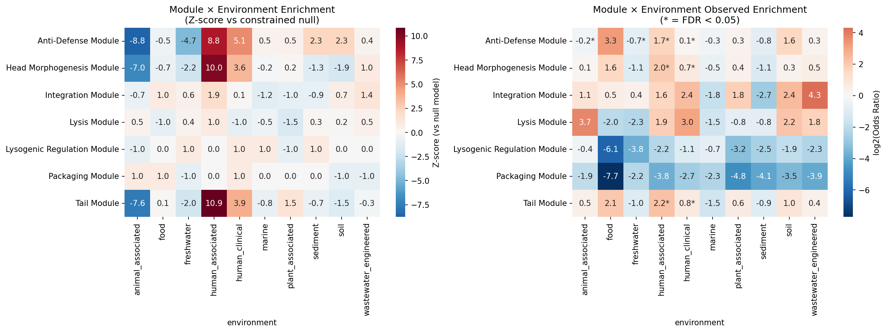

The enrichment of structural modules (tail, head) and anti-defense in human-associated bacteria is consistent with Low et al. (2024), who found prophage-encoded cargo genes enriched in human-impacted environments. The anti-defense module depletion in freshwater and animal-associated environments suggests that host-phage coevolutionary arms races are most intense in human-associated niches, where bacterial immune systems (CRISPR-Cas, restriction-modification) are under stronger selection (Bernheim & Sorek 2020).

*(Notebook: 06_enriched_modules_lineages.ipynb)*

### 4. TerL lineages are phylogenetically constrained but include both specialist and generalist strategies

MMseqs2 clustering of 38,085 TerL sequences at 70% AAI yields 10,991 lineages, with a highly skewed size distribution (median=1, max=1,094 across 869 species). Threshold sensitivity analysis shows lineage count scaling from 4,001 (50% AAI) to 16,283 (80% AAI).

No individual TerL lineage showed significant environment-specific enrichment after FDR correction (0/500 tests), indicating that lineage-level environmental adaptation does not exceed what host phylogeny predicts. However, Shannon entropy analysis of 824 lineages with ≥5 species reveals:
- **325 specialist lineages** (Shannon < 1.0 or dominant environment > 80%): concentrated in animal_associated, freshwater, and marine
- **499 generalist lineages**: distributed across 3+ environments

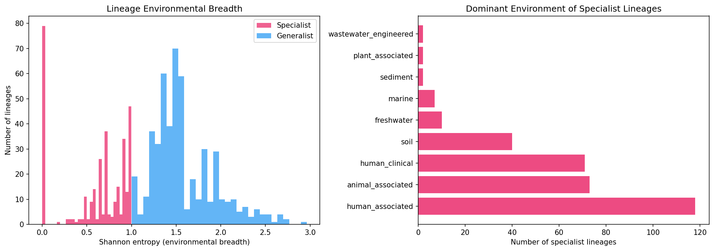

This is consistent with Mavrich & Hatfull (2017): temperate phages evolve in two modes (high and low gene flux), and lineage-level ecology largely mirrors host ecology rather than showing independent environmental adaptation.

*(Notebooks: 02_terL_lineage_clustering.ipynb, 06_enriched_modules_lineages.ipynb)*

### 5. NMDC metagenomic data independently validates module-level environmental signal

Taxonomy-based inference of prophage burden across 6,365 NMDC metagenomic samples (87.2% median matching coverage) reveals 57 significant module-abiotic correlations (FDR < 0.05). The strongest correlations:

| Module | Abiotic Variable | Spearman rho |
|--------|-----------------|--------------|
| Packaging | pH | 0.519 |
| All modules | pH | 0.474 |
| All modules | temperature | 0.399 |
| All modules | depth | 0.361 |
| All modules | total nitrogen | 0.333 |

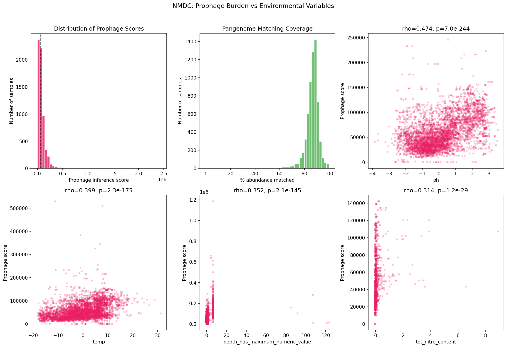

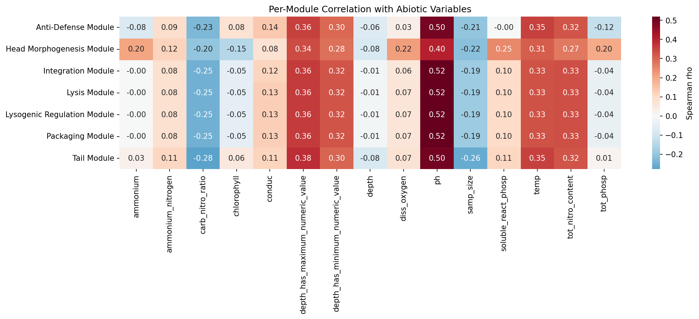

Cross-validation between pangenome enrichment and NMDC correlations shows concordance: **B_head_morphogenesis, C_tail, and G_anti_defense are significant in both analyses**. Four additional modules (A_packaging, D_lysis, E_integration, F_lysogenic_regulation) are NMDC-significant but not pangenome-enriched beyond phylogenetic expectation, consistent with their near-universal presence masking environment-specific variation in the pangenome analysis.

*(Notebooks: 05_nmdc_environmental_analysis.ipynb, 06_enriched_modules_lineages.ipynb)*

## Results

### Prophage Gene Discovery (NB01)

Querying 93M eggNOG annotations with 112 WHERE clause conditions identified 4,005,537 prophage-associated gene clusters across 27,702 species. Module classification:

| Module | Gene Clusters | Species Presence |
|--------|---------------|-----------------|
| A. Packaging | 707,217 | 100.0% |
| B. Head Morphogenesis | 87,336 | 56.1% |
| C. Tail | 189,271 | 55.6% |
| D. Lysis | 724,499 | 99.9% |
| E. Integration | 773,417 | 99.1% |
| F. Lysogenic Regulation | 1,682,902 | 100.0% |
| G. Anti-Defense | 63,508 | 64.3% |

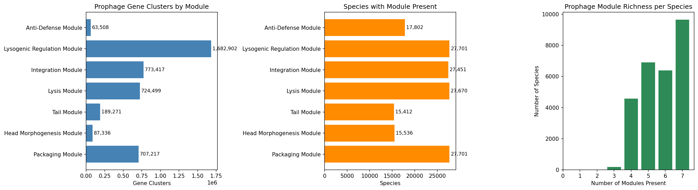

Conservation analysis reveals that modules D (lysis, 62.6% core) and A (packaging, 57.0% core) are dominated by core genes, while modules E (integration, 59.3% singleton) and B (head morphogenesis, 56.0% singleton) are dominated by singletons — consistent with the expectation that phage structural genes diversify rapidly while regulatory/lysis genes are more conserved (Hendrix et al. 2000).

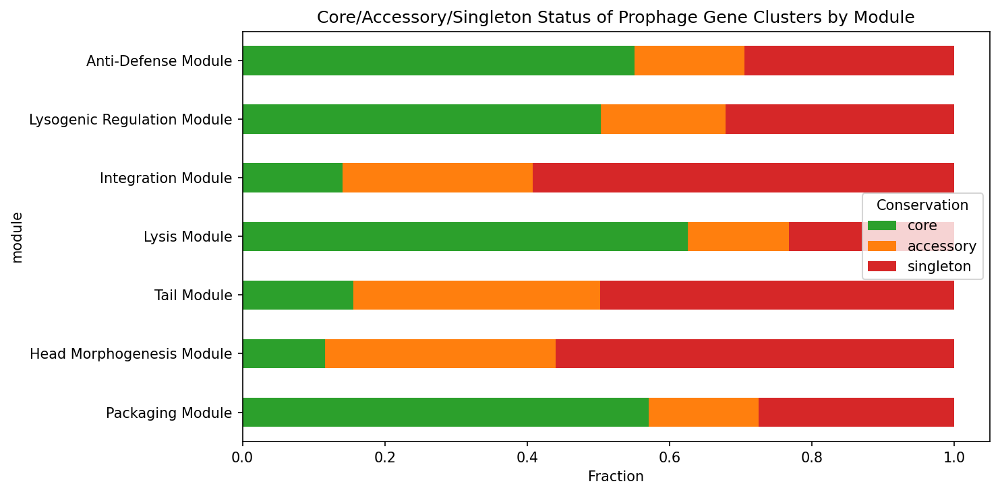

Validation against 8 well-characterized prophage-carrying species (E. coli, S. enterica, S. aureus, P. aeruginosa, M. tuberculosis, B. subtilis, V. cholerae, S. pyogenes) confirmed detection of all 7 modules in every case.

### TerL Lineage Clustering (NB02)

38,085 TerL protein sequences from 11,789 species were clustered at 70% amino acid identity using MMseqs2, yielding 10,991 lineages. The largest lineage (L_SFJM01000051.1_13) spans 1,094 members across 869 species, representing a cosmopolitan prophage type. 6,921 lineages (63%) are singletons — species-specific prophage types.

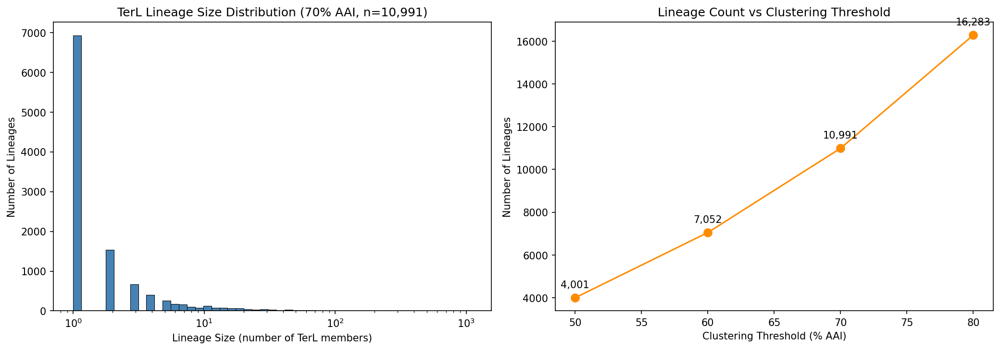

### Phylogenetic Distribution (NB04)

Prophage module prevalence mapped across 142 GTDB phyla shows remarkable uniformity for modules A, D, and F (all ≥99% in top 15 phyla). The most phylogenetically variable modules are:
- **B (Head morphogenesis)**: ranges from 10.2% (Thermoplasmatota) to 81% (human_associated species)
- **C (Tail)**: ranges from 6.5% (Thermoplasmatota) to 82% (food-associated species)
- **G (Anti-defense)**: ranges from 3.1% (Patescibacteria) to 97.8% (Campylobacterota)

Environment classification of 293,050 genomes via NCBI isolation_source metadata yielded 10 categories with ≥30 species. Chi-squared tests confirm significant environment × module associations for B_head (chi2=1,051, p=1.72e-220), C_tail (chi2=1,749, p≈0), and G_anti_defense (chi2=818, p=2.58e-170).

### NMDC Cross-Validation (NB05)

Genus-level prophage burden scores derived from the pangenome were applied to 6,365 NMDC metagenomic samples via two-tier taxonomy mapping (GTDB metadata bridge + taxonomy_dim genus matching). The positive correlation with pH (rho=0.519 for packaging, 0.474 overall) is notable — alkaline environments may favor lysogeny, consistent with stress-induced prophage induction being pH-sensitive.

### Module Co-occurrence Validation (NB03)

Testing H1c across 15 phylogenetically stratified species (one per phylum, max 300 genomes each, 200 null permutations) reveals that 44/95 module-species tests (46.3%) show significantly higher within-module gene co-occurrence than expected by chance (z > 1.96, one-tailed). Mean contig co-localization across all tests is 0.769.

| Module | Significant / Tested | Mean Z-score | Mean Co-localization | Interpretation |
|--------|---------------------|--------------|---------------------|----------------|
| A. Packaging | 11/15 | 3.40 | 0.986 | Strong co-occurrence; genes cluster on same contig |
| B. Head Morphogenesis | 1/6 | -0.44 | 0.474 | Weak; sparse across species |
| C. Tail | 5/12 | 1.43 | 0.752 | Moderate co-occurrence |
| D. Lysis | 13/15 | 4.45 | 0.901 | Strongest co-occurrence of any module |
| E. Integration | 1/15 | -1.93 | 0.420 | NOT co-occurring — expected for integrases |
| F. Lysogenic Regulation | 10/15 | 2.16 | 1.000 | Significant; perfect contig co-localization |
| G. Anti-Defense | 3/11 | 1.50 | 0.281 | Weak co-occurrence; scattered genomic placement |

The three core modules (A, D, F) show strong co-occurrence and high contig co-localization, consistent with their role as physically linked prophage functional units. Integration (E) genes explicitly do NOT co-occur — this is biologically expected, as integrases are distributed at different genomic insertion sites and many are domesticated remnants. Anti-defense (G) genes show low co-localization (0.281), consistent with their known tendency to cluster in "defense islands" (Pinilla-Redondo et al. 2020) separately from the core prophage backbone.

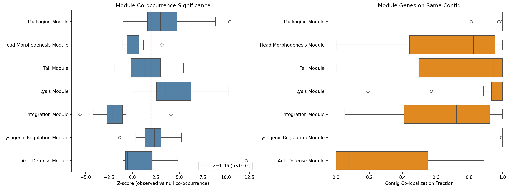

## Interpretation

### Hypothesis Outcomes

**H0 (phylogeny alone explains prophage distribution): REJECTED.** Environment significantly affects prophage module composition beyond phylogeny (PERMANOVA F=30.04 vs phylogeny F=6.17, both p=0.01). The null model analysis in NB06 confirms that 8 module × environment combinations exceed phylogenetic expectation after FDR correction.

**H1a (module prevalence varies by environment): SUPPORTED.** Human-associated and clinical environments show significantly higher prevalence of structurally complete prophages (tail, head morphogenesis modules) and anti-defense genes compared to freshwater, marine, and animal-associated environments. This holds after controlling for host family composition and genome size.

**H1b (TerL lineages show environment-specific enrichment): NOT SUPPORTED at the individual lineage level.** No individual lineage passed FDR correction. However, the specialist/generalist classification (325 vs 499) demonstrates that lineage-level niche breadth varies substantially, even if no single lineage's enrichment exceeds the constrained null model.

**H1c (module genes co-occur): PARTIALLY SUPPORTED.** Core prophage modules (packaging, lysis, lysogenic regulation) show strong within-module gene co-occurrence and contig co-localization across 15 diverse species. Lysis is the strongest (13/15 species significant, z=4.45). However, integration genes do NOT co-occur (z=-1.93), and anti-defense genes show weak co-occurrence (3/11), reflecting their distinct genomic organization. The module definitions are validated for the core prophage backbone (A, D, F) but less so for accessory functions (E, G).

**H1d (NMDC prophage burden correlates with abiotic variables): SUPPORTED.** 57 significant module-abiotic correlations (FDR < 0.05), with pH and temperature as the strongest predictors. Cross-validation with pangenome results confirms concordance for modules B, C, and G.

### Literature Context

The finding that **all 27,702 species carry prophage annotations** far exceeds Touchon et al.'s (2016) estimate that ~46% of bacterial genomes harbor prophages. This discrepancy likely reflects our broader definition: we identify individual prophage-associated gene clusters (including domesticated remnants), not intact prophages. The near-universal presence of packaging (A), lysis (D), and lysogenic regulation (F) modules is consistent with Bobay et al. (2014), who showed that defective prophages under purifying selection often retain core regulatory and lysis functions.

The enrichment of **anti-defense genes in human-associated environments** aligns with three recent findings:
1. Low et al. (2024) demonstrated enrichment of prophage-encoded cargo genes in human-impacted environments across 38,605 genomes
2. Tesson et al. (2024) found that 89% of anti-defense systems localize in mobile genetic elements, predominantly prophages
3. Bernheim & Sorek (2020) proposed the "pan-immune system" model where defense system diversity drives counter-defense evolution

The **Piggyback-the-Winner** framework (Knowles et al. 2016) predicts higher lysogeny at high microbial densities (host-associated environments). Our results extend this: it is not merely lysogeny that increases, but specifically the structural completeness and anti-defense repertoire of prophages. This suggests that human-associated bacteria face more intense phage-mediated selective pressure, driving retention of complete prophage lytic machinery and counter-defense genes.

The **co-occurrence results (NB03)** provide the first large-scale empirical validation of the modular theory of phage evolution (Hendrix et al. 2000) at the pangenome level. The strong co-occurrence and contig co-localization of packaging (A), lysis (D), and lysogenic regulation (F) genes confirms that these functions are physically linked in prophage elements, not independently distributed annotations. The finding that integration (E) genes do NOT co-occur is consistent with Bobay et al. (2014), who showed that domesticated prophage remnants — which are more common than intact prophages — often retain only integrases while losing the rest of the prophage backbone. The low co-localization of anti-defense genes (G, 0.281) aligns with Pinilla-Redondo et al. (2020) and Rahimian et al. (2026), who found that anti-defense and defense systems co-localize into functional "defense islands" that are genomically distinct from the core prophage.

The lack of significant lineage-level enrichment (H1b) contrasts with Paez-Espino et al.'s (2016) finding of strong habitat-type specificity for most viral groups. However, our analysis used constrained permutations preserving host family composition — the lineage distribution is well-explained by host phylogeny alone, consistent with Mavrich & Hatfull (2017) showing that temperate phage evolution is primarily shaped by host range rather than environmental selection.

### Novel Contribution

This study provides the first systematic, module-level analysis of prophage architecture across >27,000 bacterial species and 10 environment categories. Previous studies examined prophage presence/absence at the whole-prophage level (Touchon et al. 2016) or focused on specific phage types (Camarillo-Guerrero et al. 2021). Our module-level approach reveals that:

1. **Not all prophage functions respond equally to environment** — ubiquitous modules (A, D, F) show minimal environmental variation, while structurally variable modules (B, C, G) carry the environmental signal
2. **Anti-defense is the most environmentally responsive module** — showing the strongest enrichment (human-associated) and depletion (freshwater, animal-associated) signals
3. **Module-level and lineage-level ecology are decoupled** — modules show environment effects beyond phylogeny, but lineages do not, suggesting modular exchange rather than whole-phage adaptation to environments
4. **Empirical validation of prophage modularity at pangenome scale** — co-occurrence analysis across 15 phyla confirms that packaging, lysis, and lysogenic regulation genes behave as physically linked functional units, while integration and anti-defense genes are genomically independent, supporting a two-tier model of prophage organization (core backbone + scattered accessory functions)

### Limitations

1. **Annotation-based prophage identification**: We use eggNOG functional annotations as proxies for prophage genes, not dedicated prophage detection tools (e.g., geNomad, VIBRANT). This likely inflates prophage prevalence by including domesticated remnants and bacterial homologs of phage genes (e.g., bacterial integrases). The false positive rate is uncharacterized.

2. **Genome size confound**: Genome size is the dominant predictor of prophage burden (rho=0.717), and while we control for it via stratification and partial correlations, residual confounding cannot be excluded. Larger genomes have more genes of all types, not just prophage genes.

3. **Environment classification granularity**: NCBI isolation_source metadata is sparse and inconsistently labeled. Our classification into 10 categories collapses substantial within-category variation. The "other_unknown" category (9,659 species, 35%) limits statistical power.

4. **NMDC inference is indirect**: Taxonomy-based prophage burden inference assumes genus-level conservation of prophage content, which may not hold for recently acquired or lost prophages. This approach was validated for the PHB granule ecology project but has not been independently validated for prophage genes.

5. **Module co-occurrence scope**: NB03 tested 15 species (one per phylum), which provides broad phylogenetic coverage but limited within-phylum replication. Head morphogenesis (B) was testable in only 6 species due to sparsity. The 200-permutation null model provides adequate but not exhaustive precision for z-score estimation.

6. **AlphaEarth embeddings**: Only 28% of genomes have environmental embeddings, creating a biased subsample toward clinically and environmentally well-sampled lineages.

## Data

### Sources

| Collection | Tables Used | Purpose |
|------------|-------------|---------|
| `kbase_ke_pangenome` | `eggnog_mapper_annotations`, `gene_cluster`, `genome`, `gtdb_species_clade`, `gtdb_taxonomy_r214v1`, `gtdb_metadata`, `pangenome`, `ncbi_env`, `alphaearth_embeddings_all_years`, `gene`, `gene_genecluster_junction` | Prophage gene identification, taxonomy, environment metadata, genome size, co-occurrence |
| `nmdc_arkin` | `taxonomy_features`, `taxonomy_dim`, `abiotic_features`, `study_table` | Metagenomic cross-validation of prophage burden |

### Generated Data

| File | Rows | Description |
|------|------|-------------|
| `data/prophage_gene_clusters.tsv` | 4,005,537 | All prophage-associated gene clusters with module assignments |
| `data/species_module_summary.tsv` | 27,702 | Species-level module presence/absence and counts |
| `data/terL_sequences.fasta` | 38,085 | TerL protein sequences for lineage clustering |
| `data/terL_lineages.tsv` | 38,085 | Gene cluster to lineage ID mapping (70% AAI) |
| `data/lineage_summary.tsv` | 10,991 | Lineage-level statistics |
| `data/species_prophage_environment.tsv` | 27,702 | Merged species × module × environment × genome size |
| `data/variance_partitioning_results.tsv` | 3 | PERMANOVA results |
| `data/species_genome_size.tsv` | 27,690 | Species genome size and prophage burden |
| `data/nmdc_prophage_prevalence.tsv` | 6,365 | NMDC sample-level prophage burden scores |
| `data/nmdc_module_by_environment.tsv` | 105 | Module × abiotic variable correlations |
| `data/enriched_modules.tsv` | 70 | Module × environment enrichment with null model z-scores |
| `data/enriched_lineages.tsv` | 500 | Lineage × environment enrichment results |
| `data/module_cooccurrence_stats.tsv` | 95 | Per-species per-module co-occurrence z-scores and p-values |
| `data/contig_colocation.tsv` | 95 | Per-species per-module contig co-localization fractions |

## Supporting Evidence

### Notebooks

| Notebook | Purpose |
|----------|---------|
| `01_prophage_gene_discovery.ipynb` | Identify prophage gene clusters via eggNOG; classify into 7 modules; extract TerL sequences |
| `02_terL_lineage_clustering.ipynb` | Cluster TerL at 70% AAI with MMseqs2; threshold sensitivity analysis |
| `03_module_cooccurrence.ipynb` | Test module gene co-occurrence vs random in 15 stratified species; contig co-localization |
| `04_phylogenetic_distribution.ipynb` | PERMANOVA variance partitioning; environment classification; genome size confound |
| `05_nmdc_environmental_analysis.ipynb` | NMDC taxonomy-inferred prophage burden vs abiotic variables |
| `06_enriched_modules_lineages.ipynb` | Constrained permutation null models; lineage specialist/generalist classification |

### Figures

| Figure | Description |
|--------|-------------|
| `figures/prophage_module_discovery.png` | Gene cluster counts, species presence, and module richness distribution |
| `figures/prophage_conservation_by_module.png` | Core/accessory/singleton status of prophage gene clusters by module |
| `figures/prophage_prevalence_by_phylum.png` | Heatmap of module prevalence across top 15 phyla |
| `figures/terL_lineage_overview.png` | TerL lineage size distribution and clustering threshold sensitivity |
| `figures/variance_partitioning.png` | PERMANOVA F-statistics and module prevalence by environment |
| `figures/genome_size_confound.png` | Genome size vs prophage burden scatter and stratified analysis |
| `figures/module_cooccurrence_heatmap.png` | Z-scores of within-module gene co-occurrence across 15 species |
| `figures/module_environment_enrichment.png` | Z-score heatmap and log2(OR) for module × environment enrichment |
| `figures/lineage_environment_heatmap.png` | Lineage Shannon entropy distribution and specialist dominant environments |
| `figures/nmdc_prophage_vs_abiotic.png` | NMDC prophage burden vs pH, temperature, depth |
| `figures/nmdc_module_abiotic_heatmap.png` | NMDC module-abiotic correlation heatmap |

## Future Directions

1. **Validate with dedicated prophage detection tools**: Run geNomad or VIBRANT on representative genomes to estimate false positive/negative rates of the annotation-based approach and calibrate module prevalence estimates.

2. **Partial PERMANOVA**: Implement sequential/partial PERMANOVA to formally quantify the unique variance explained by environment after controlling for phylogeny and genome size simultaneously, rather than testing each predictor independently.

3. **Module definition refinement**: NB03 results suggest integration (E) and anti-defense (G) behave differently from core prophage modules — consider splitting the analysis into "core prophage backbone" (A, D, F) vs "accessory functions" (B, C, E, G) in future work.

4. **Anti-defense island analysis**: Investigate whether anti-defense genes (Module G) co-localize with defense system genes in the same genomes, testing the "arms race" hypothesis at the genomic level.

5. **Prophage induction signals**: Cross-reference environment-enriched modules with known prophage induction triggers (SOS response, pH stress, temperature shifts) to mechanistically explain the pH and temperature correlations observed in NMDC data.

6. **Temporal dynamics**: Use NMDC longitudinal samples (if available) to test whether prophage burden changes over time within the same site, providing causal evidence beyond cross-sectional correlations.

## References

- Anderson MJ (2001). "A new method for non-parametric multivariate analysis of variance." *Austral Ecol* 26:32-46.
- Bernheim A, Sorek R (2020). "The pan-immune system of bacteria: antiviral defence as a community resource." *Nat Rev Microbiol* 18:113-119. PMID: 31695182
- Bobay L-M et al. (2014). "Pervasive domestication of defective prophages by bacteria." *PNAS* 111:12127-12132. PMID: 25092302
- Camarillo-Guerrero LF et al. (2021). "Massive expansion of human gut bacteriophage diversity." *Cell* 184:1098-1109. PMID: 33606979
- Casjens SR, Gilcrease EB (2009). "Determining DNA packaging strategy by analysis of the termini of the chromosomes in tailed-bacteriophage virions." *Methods Mol Biol* 502:91-111.
- Casjens SR, Hendrix RW (2015). "Bacteriophage lambda: Early pioneer and still relevant." *Virology* 479-480:310-330.
- Costa AR et al. (2025). "Bacteriophage genomes encode both broad and specific counter-defense repertoires." *Cell Host Microbe*. PMID: 40639337
- Dion MB et al. (2020). "Phage diversity, genomics and phylogeny." *Nat Rev Microbiol* 18:125-138.
- Doron S et al. (2018). "Systematic discovery of antiphage defense systems in the microbial pangenome." *Science* 359:eaar4120. PMID: 29371424
- Georjon H, Bernheim A (2023). "The highly diverse antiphage defence systems of bacteria." *Nat Rev Microbiol* 21:686-700.
- Hendrix RW et al. (2000). "Evolutionary relationships among diverse bacteriophages and prophages." *Trends Microbiol* 8:504-508.
- Howard-Varona C et al. (2017). "Lysogeny in nature: mechanisms, impact and ecology of temperate phages." *ISME J* 11:1511-1520.
- Kim MS, Bae JW (2018). "Lysogeny is prevalent and widely distributed in the murine gut microbiota." *ISME J* 12:1127-1141. PMID: 29416123
- Knowles B et al. (2016). "Lytic to temperate switching of viral communities." *Nature* 531:466-470. PMID: 26982729
- Low SJ et al. (2019). "Evaluation of a concatenated protein phylogeny for classification of tailed double-stranded DNA viruses belonging to the order Caudovirales." *Nat Microbiol* 4:1306-1315.
- Low SJ et al. (2024). "Prophage-encoded antibiotic resistance genes are enriched in human-impacted environments." *Nat Commun* 15:8178.
- Luque A, Silveira CB (2020). "Quantification of lysogeny caused by phage coinfections in microbial communities from biophysical principles." *mSystems* 5:e00353-20. PMID: 32934113
- Mavrich TN, Hatfull GF (2017). "Bacteriophage evolution differs by host, lifestyle and genome." *Nat Microbiol* 2:17112. PMID: 28692019
- Paez-Espino D et al. (2016). "Uncovering Earth's virome." *Nature* 536:425-430. PMID: 27533034
- Pinilla-Redondo R et al. (2020). "Discovery of multiple anti-CRISPRs highlights anti-defense gene clustering in mobile genetic elements." *Nat Commun* 11:5652. PMID: 33159058
- Pons BJ et al. (2023). "Ecology and evolution of phages encoding anti-CRISPR proteins." *J Mol Biol* 435:167974. PMID: 36690071
- Rahimian M et al. (2026). "Genomic landscape of biosynthetic gene clusters in Iranian extremophiles reveals prolific metabolite potential, prophage associations, and integrated defensive-metabolic islands." *BMC Microbiol*. PMID: 41578173
- Roux S et al. (2015). "Viral dark matter and virus-host interactions resolved from publicly available microbial genomes." *eLife* 4:e08490.
- Tesson F et al. (2024). "Exploring the diversity of anti-defense systems across prokaryotes, phages, and mobile genetic elements." *Nucleic Acids Res* 53:gkae1171. PMID: 39657785
- Touchon M et al. (2016). "Genetic and life-history traits associated with the distribution of prophages in bacteria." *ISME J* 10:2744-2754. PMID: 27015004
- Yutin N et al. (2018). "Discovery of an expansive bacteriophage family that includes the most abundant viruses from the human gut." *Nat Microbiol* 3:38-46.
