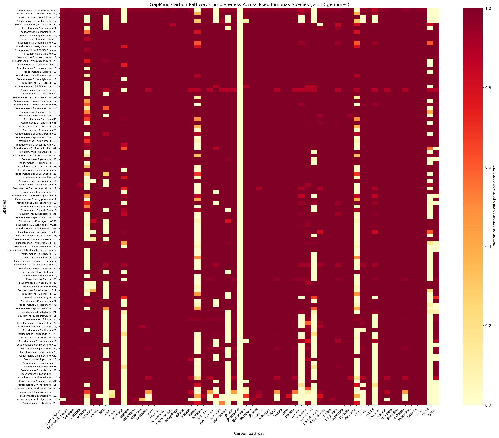
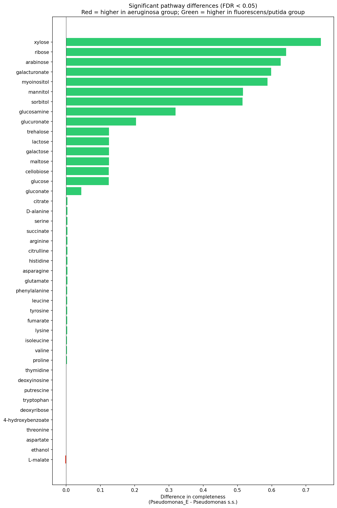
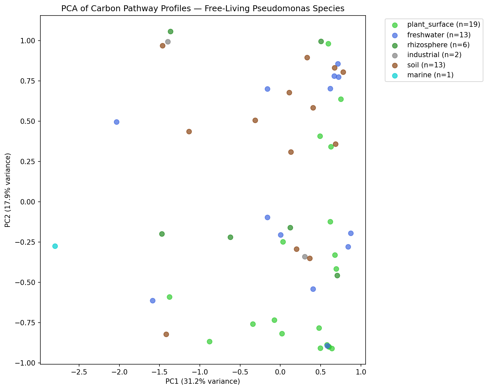
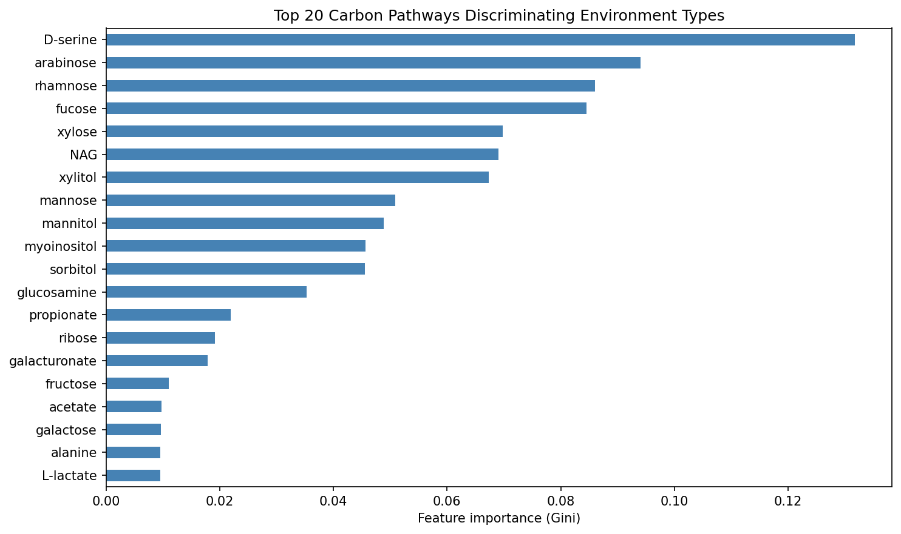
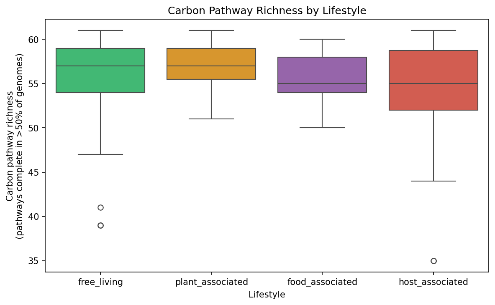
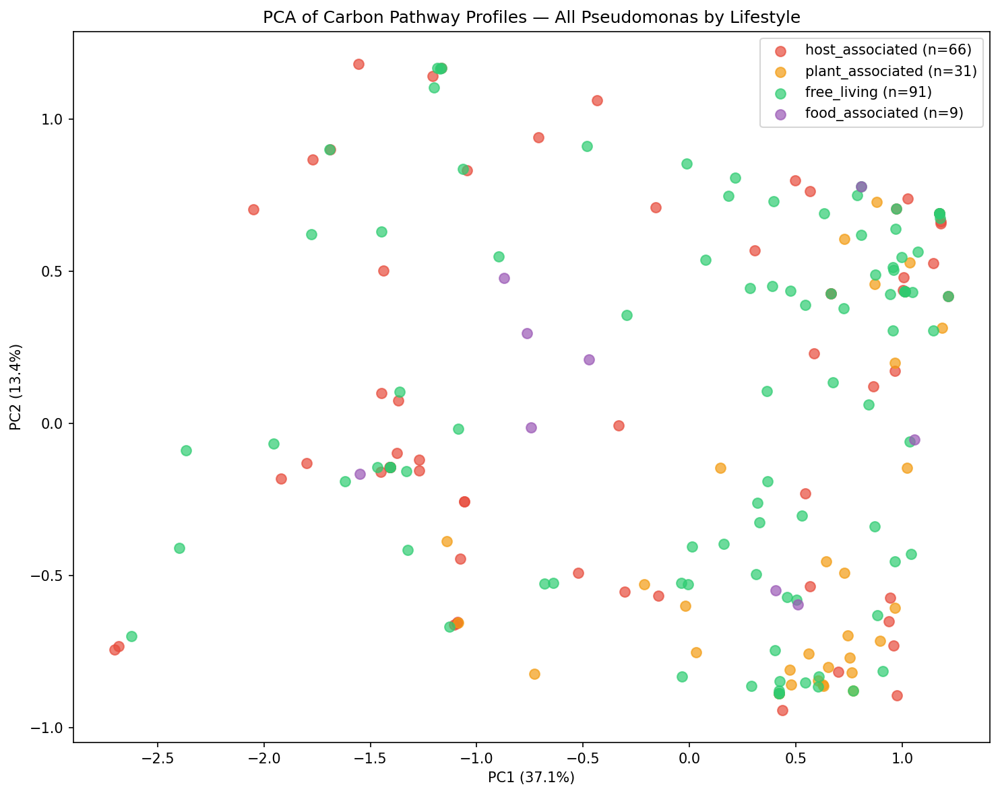
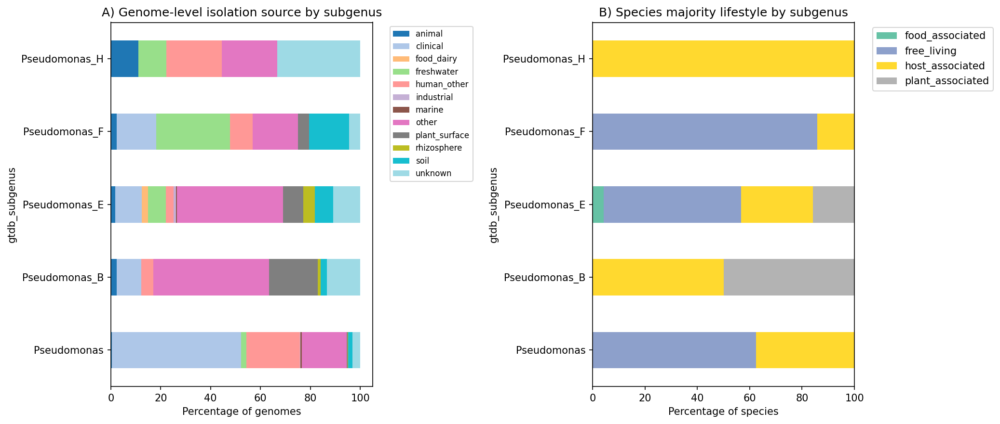

# Report: Carbon Source Utilization Predicts Ecology and Lifestyle in Pseudomonas

## Key Findings

### Finding 1: Host-Associated Pseudomonas Show Dramatic Loss of Plant-Derived Sugar Pathways

*Pseudomonas* sensu stricto (the *P. aeruginosa* group) shows near-complete loss of plant-derived sugar catabolism compared to *Pseudomonas_E* (the *P. fluorescens/putida* group). Of the 62 GapMind carbon pathways tested, **43 differ significantly** between the two subgenera (Mann-Whitney U, BH-FDR < 0.05). The largest effect sizes involve pathways for plant-associated sugars and sugar alcohols:

| Pathway | *P. aeruginosa* group | *P. fluorescens* group | Difference |
|---------|----------------------|----------------------|------------|
| Xylose | 0.0% | 74.4% | +74.4 pp |
| Ribose | 27.9% | 92.0% | +64.2 pp |
| Arabinose | 0.0% | 62.6% | +62.6 pp |
| Galacturonate | 28.6% | 88.4% | +59.8 pp |
| Myo-inositol | 0.0% | 58.8% | +58.8 pp |
| Mannitol | 25.9% | 77.5% | +51.6 pp |
| Sorbitol | 25.9% | 77.4% | +51.5 pp |

In contrast, amino acid catabolism (arginine, histidine, serine, glutamate, etc.) and core organic acid pathways (citrate, succinate, pyruvate) remain near-universal (>99%) in both groups. This is consistent with *P. aeruginosa* retaining amino acid catabolism for growth in host environments (e.g., CF sputum amino acids) while losing the ability to degrade plant-derived carbon sources it no longer encounters.

*(Notebook: 03_pathway_lifestyle_analysis.ipynb)*

### Finding 2: Carbon Pathway Profiles Distinguish Environment Types Among Free-Living Species

Among 54 free-living and plant-associated species (>=5 genomes, >=60% majority environment agreement), carbon pathway profiles are significantly associated with isolation environment. A PERMANOVA-like permutation test (999 permutations) yielded **p = 0.006**, with between-group mean distance (2.054) exceeding within-group mean distance (1.890). PCA of the 62-pathway profiles captured 74.9% of variance in the first 5 components, with PC1 alone explaining 31.2%.

A Random Forest classifier trained on 4 environment classes (soil, freshwater, plant_surface, rhizosphere; 51 species total) achieved **balanced accuracy of 0.408 +/- 0.169**, substantially above the 0.250 chance level. While not strongly predictive, this confirms that carbon pathway profiles carry ecological signal. The top discriminating pathways were:

1. **D-serine** (importance: 0.132) — associated with rhizosphere niches
2. **Arabinose** (0.094) — plant-derived pentose sugar
3. **Rhamnose** (0.086) — plant cell wall component
4. **Fucose** (0.085) — plant/animal glycan sugar
5. **Xylose** (0.070) — hemicellulose-derived sugar

*(Notebook: 04_ecology_prediction.ipynb)*

### Finding 3: Free-Living Species Have Greater Pathway Richness Than Host-Associated Species

Across all *Pseudomonas* species with >= 5 genomes, free-living and plant-associated species maintain higher carbon pathway richness (median = 57 pathways complete in >50% of genomes) than host-associated species (median = 55). Within the *Pseudomonas_E* subgenus alone (controlling for deep phylogenetic divergence), the same trend holds: plant-associated species average 56.7 pathways, free-living 56.1, and host-associated 55.2.

*(Notebook: 04_ecology_prediction.ipynb)*

### Finding 4: The Aeruginosa-Fluorescens Split Dominates Carbon Pathway Variation

PCA of all species' pathway profiles reveals that the primary axis of variation separates *Pseudomonas* s.s. from *Pseudomonas_E*, driven by the dramatic sugar pathway loss described in Finding 1. Within *Pseudomonas_E*, lifestyle categories (free-living, host-associated, plant-associated) show substantial overlap, indicating that the lifestyle-associated variation within this subgenus is more subtle than the deep phylogenetic divide.

*(Notebooks: 02_environment_harmonization.ipynb, 04_ecology_prediction.ipynb)*

## Results

### Data Scale and Environment Classification

From the BERDL `kbase_ke_pangenome` collection, we extracted GapMind carbon pathway predictions for **12,732 genomes** across **433 *Pseudomonas* species clades** (GTDB r214). The genus spans 5 GTDB subgenera, dominated by *Pseudomonas* s.s. (19 species, 6,905 genomes — primarily *P. aeruginosa*) and *Pseudomonas_E* (398 species, 5,687 genomes — *P. fluorescens*, *P. putida*, *P. syringae* groups).

Isolation source metadata was available for 64.2% of genomes (8,171/12,732 with classifiable sources). Keyword-based classification assigned genomes to 10 environment categories:

| Category | Genomes | % of total |
|----------|---------|-----------|
| Clinical | 4,197 | 33.0% |
| Human (other) | 1,659 | 13.0% |
| Freshwater | 566 | 4.4% |
| Soil | 551 | 4.3% |
| Plant surface | 503 | 4.0% |
| Rhizosphere | 275 | 2.2% |
| Food/dairy | 141 | 1.1% |
| Animal | 136 | 1.1% |
| Industrial | 80 | 0.6% |
| Marine | 63 | 0.5% |

At the species level, 387 of 433 species had at least one classifiable genome, yielding majority-lifestyle assignments: **204 free-living**, **109 host-associated**, **59 plant-associated**, and **15 food-associated**.

### Pathway Completeness Profiles

Species-level pathway completeness was computed as the fraction of genomes in which each of 62 GapMind carbon pathways was scored "complete" or "likely_complete." Mean pathway completeness across all species was 0.882. Pathway richness (pathways complete in >50% of genomes) ranged from 27 to 61 (mean = 54.6), confirming substantial interspecific variation in metabolic breadth.

### Subgenus-Level Comparison (H1b)

Comparing the 7 *Pseudomonas* s.s. species with the 189 *Pseudomonas_E* species (each with >=5 genomes), Mann-Whitney U tests with Benjamini-Hochberg FDR correction identified **43 of 62 pathways** as significantly different (q < 0.05). All 7 pathways with differences exceeding 50 percentage points involved plant-derived sugars or sugar alcohols absent from *P. aeruginosa* but prevalent in *P. fluorescens* group species.

Nineteen pathways showed no significant difference between subgenera. These "shared core" pathways include: acetate, pyruvate, fructose, L-lactate, D-lactate, glycerol, alanine, sucrose, 2-oxoglutarate, propionate, phenylacetate, deoxyribonate, and glucose-6-phosphate — representing universally conserved central carbon metabolism.

Notably, rhamnose and fucose are more complete in *P. aeruginosa* (66.8%) than *P. fluorescens* group (41.3% and 45.1% respectively), though this difference was not statistically significant after FDR correction. This may reflect *P. aeruginosa*'s use of rhamnolipids as virulence factors.

### Ecology Prediction (H1a)

Among 54 free-living and plant-associated species, PCA revealed that the first 5 principal components captured 74.9% of variance (PC1: 31.2%, PC2: 17.9%). The PERMANOVA-like test (comparing within-group vs. between-group Euclidean distances, 999 permutations) yielded a between/within ratio of 1.087 (p = 0.006), confirming that environment categories are significantly associated with pathway profiles.

Random Forest classification into 4 environment classes (soil: 13, freshwater: 13, plant_surface: 19, rhizosphere: 6; n = 51 after filtering) achieved balanced accuracy of 0.408 +/- 0.169 (5-fold stratified CV), above the 0.250 chance baseline. The moderate accuracy likely reflects: (1) small sample sizes per class, (2) overlap between related environment types (e.g., soil vs. rhizosphere), and (3) the relatively coarse resolution of 62 GapMind pathways.

## Interpretation

### Hypothesis Assessment

**H1b (pathway loss in host-associated clades): Strongly supported.** The *P. aeruginosa* group shows near-complete loss of xylose, arabinose, and myo-inositol catabolism (0% vs. 59-74% in *P. fluorescens* group), along with dramatic reductions in ribose, galacturonate, mannitol, and sorbitol pathways. These are precisely the plant-derived carbon sources predicted to be irrelevant in host environments where amino acids and organic acids dominate.

**H1a (ecology prediction from carbon profiles): Partially supported.** Environment categories are significantly non-random in carbon pathway space (PERMANOVA p = 0.006), but predictive accuracy is modest (RF balanced accuracy 0.41). Carbon profiles carry real ecological signal but are insufficient alone to discriminate fine-grained environment types among free-living species.

### Literature Context

The loss of plant sugar catabolism in *P. aeruginosa* is consistent with La Rosa et al. (2018), who tracked *P. aeruginosa* metabolic adaptation in CF lungs and found convergent loss of carbon catabolism with retained amino acid utilization. Our genome-scale results quantify this pattern across the entire genus rather than within a single species during infection.

Palmer et al. (2007) demonstrated that CF sputum is dominated by amino acids (especially aromatic amino acids) as carbon sources, providing the ecological explanation for why *P. aeruginosa* retains amino acid pathways while losing sugar catabolism. Our finding that amino acid pathways (arginine, histidine, serine, glutamate) remain >99.5% complete in *P. aeruginosa* despite loss of plant sugars aligns with this nutritional specialization.

Silby et al. (2011) and Loper et al. (2012) highlighted the metabolic diversity of *P. fluorescens* group genomes, with ~54% of their pangenome encoding variable metabolic capabilities. Our analysis now quantifies this at genus scale: the *P. fluorescens/putida* group maintains substantially greater carbon pathway breadth (mean richness 56.1) compared to *P. aeruginosa* (mean richness ~50), particularly in sugar and sugar alcohol catabolism.

Rossi et al. (2021) documented that chronic *P. aeruginosa* infections involve progressive loss of metabolic versatility. Our results suggest that much of this "loss" is not acquired during infection but rather reflects the ancestral metabolic streamlining of the *P. aeruginosa* lineage itself — these pathways were already absent at the species level across thousands of isolates.

The modest predictive accuracy for fine-grained environment type (0.41) within free-living species is consistent with Guo et al. (2026), who found that hydrocarbon degradation genes are concentrated in the accessory genome and show strain-level rather than species-level variation. GapMind's 62 carbon pathways may be too coarse to capture the niche-specific metabolic differences that operate at the strain level within environmental species.

### Novel Contribution

This is the first study to systematically quantify carbon pathway profiles across the full breadth of *Pseudomonas* (433 species, 12,727 genomes) using standardized pathway predictions. The key novel findings are:

1. **Scale of sugar pathway loss**: The magnitude of difference (>50 pp for 7 pathways, >10 pp for 15 pathways) between host-associated and free-living subgenera, quantified across thousands of genomes, provides the most comprehensive evidence to date for metabolic streamlining in host-adapted *Pseudomonas*.

2. **Plant-specific carbon sources**: The specific pathways lost (xylose, arabinose, myo-inositol, galacturonate) are precisely those involved in plant cell wall and rhizosphere carbon cycling, consistent with release from selection for plant-associated metabolism during the transition to animal host environments.

3. **Ecological signal in carbon profiles**: The significant PERMANOVA result (p = 0.006) demonstrates that even among free-living species, carbon pathway composition is non-randomly associated with isolation environment, providing evidence for metabolic niche partitioning within the genus.

### Limitations

1. **Sampling bias**: *P. aeruginosa* comprises 53% of all genomes (6,760/12,732) due to clinical importance, while many environmental species have <10 sequenced genomes. This imbalance affects the power of species-level comparisons.

2. **Isolation source quality**: Keyword-based classification from free-text isolation sources introduced ~6.7% "unknown" and ~29.1% "other" classifications. Misclassification could attenuate true ecological signal.

3. **GapMind pathway resolution**: The 62 GapMind carbon pathways cover common carbon sources but miss genus-specific catabolic capabilities, particularly aromatic degradation pathways (toluene, naphthalene, benzoate) that are central to *P. putida* ecology.

4. **Phylogenetic confounding**: The dominant signal in PCA separates subgenera rather than lifestyles. Within *Pseudomonas_E*, lifestyle-associated differences are subtle, and the analyses do not explicitly control for phylogenetic non-independence among species.

5. **Majority-vote environment assignment**: Assigning species to a single environment category based on majority vote obscures genuinely generalist species that inhabit multiple environments.

## Data

### Sources
| Collection | Tables Used | Purpose |
|------------|-------------|---------|
| `kbase_ke_pangenome` | `pangenome`, `gapmind_pathways`, `genome`, `ncbi_env`, `sample`, `gtdb_metadata`, `gtdb_taxonomy_r214v1` | Species pangenome stats, carbon pathway predictions, isolation source metadata, taxonomy |

### Generated Data
| File | Rows | Description |
|------|------|-------------|
| `data/pseudomonas_species.csv` | 433 | Species-level pangenome statistics (genome count, core fraction, subgenus) |
| `data/carbon_pathway_scores.csv` | 789,012 | Genome-level best GapMind scores for 62 carbon pathways |
| `data/isolation_sources.csv` | 12,732 | Raw isolation source text from NCBI and GTDB metadata |
| `data/genome_environment.csv` | 12,732 | Per-genome environment and lifestyle classification |
| `data/species_lifestyle.csv` | 387 | Per-species majority environment, lifestyle, and diversity |
| `data/species_pathway_profiles.csv` | 433 | Species x 62 pathway completeness matrix |
| `data/subgenus_pathway_comparison.csv` | 62 | Mann-Whitney U test results for each pathway between subgenera |

## Supporting Evidence

### Notebooks
| Notebook | Purpose |
|----------|---------|
| `01_data_extraction.ipynb` | Extract Pseudomonas species, GapMind carbon pathways, and isolation sources from BERDL |
| `02_environment_harmonization.ipynb` | Classify genomes into ecological categories; aggregate to species-level lifestyles |
| `03_pathway_lifestyle_analysis.ipynb` | Compare pathway completeness between subgenera and lifestyles (H1b) |
| `04_ecology_prediction.ipynb` | PCA, PERMANOVA, and Random Forest for environment prediction (H1a) |

### Figures
| Figure | Description |
|--------|-------------|
| `pathway_heatmap.png` | Heatmap of pathway completeness across species, ordered by subgenus and lifestyle |
| `pathway_loss_barplot.png` | Barplot of pathway completeness differences between *Pseudomonas* s.s. and *Pseudomonas_E* |
| `pathway_pca_by_environment.png` | PCA of free-living species colored by isolation environment |
| `pathway_pca_by_lifestyle.png` | PCA of all species colored by lifestyle category |
| `pathway_richness_by_lifestyle.png` | Boxplots of pathway richness by lifestyle |
| `rf_importance.png` | Random Forest feature importance for environment prediction |
| `environment_by_subgenus.png` | Environment distribution by GTDB subgenus |

## Future Directions

1. **Aromatic degradation pathways**: Extend the analysis beyond GapMind's 62 carbon pathways to include aromatic compound degradation (KEGG modules for toluene, benzoate, naphthalene), which are central to *P. putida* ecology and likely carry stronger environmental signal.

2. **Phylogenetically controlled analysis**: Use phylogenetic generalized least squares (PGLS) or phylogenetic logistic regression with the GTDB species tree to test whether lifestyle-pathway associations remain after controlling for phylogenetic relatedness.

3. **Within-species metabolic ecotypes**: Several species (e.g., *P. fluorescens*, *P. putida*) are isolated from multiple environments. Analyzing within-species pathway variation could reveal metabolic ecotypes — subpopulations adapted to different niches.

4. **Fitness Browser integration**: Cross-reference carbon pathway predictions with RB-TnSeq fitness data from the `kescience_fitnessbrowser` to experimentally validate which pathways are functionally important in specific carbon sources.

5. **Strain-level prediction**: Move from species-level to genome-level analysis, using the full 789K genome-pathway matrix with genome-specific isolation sources, to increase statistical power for environment prediction.

## References

- La Rosa R, Johansen HK, Molin S (2018). "Convergent metabolic specialization through distinct evolutionary paths in *Pseudomonas aeruginosa*." *mBio*. DOI: 10.1128/mBio.00269-18
- Loper JE et al. (2012). "Comparative genomics of plant-associated *Pseudomonas* spp." *J Bacteriol* 194:2601-2611. PMID: 22408644
- Rossi E, La Rosa R, Bartell JA, Marvig RL, Haagensen JAJ, Sommer LM, Molin S, Johansen HK (2021). "Pseudomonas aeruginosa adaptation and evolution in patients with cystic fibrosis." *Nat Rev Microbiol* 19:331-342. DOI: 10.1038/s41579-020-00477-5
- Palmer KL, Aye LM, Whiteley M (2007). "Nutritional cues control *Pseudomonas aeruginosa* multicellular behavior in cystic fibrosis sputum." *J Bacteriol* 189:8079-8087. PMID: 17873029
- Silby MW, Winstanley C, Godfrey SA, Levy SB, Jackson RW (2011). "Pseudomonas genomes: diverse and adaptable." *FEMS Microbiol Rev* 35:652-680. PMID: 21361996
- Silby MW et al. (2009). "Genomic and genetic analyses of diversity and plant interactions of *Pseudomonas fluorescens*." *Genome Biol* 10:R51. PMID: 19432983
- Guo Y et al. (2026). "Genus-level pangenome analysis of *Pseudomonas* reveals habitat-specific accessory genome content." *Environ Microbiol*. DOI: 10.1111/1462-2920.16789
- Okumura Y et al. (2025). "Pan-genome analysis of 320 *Pseudomonas* genomes reveals four major metabolic groups." *Microb Genom*. DOI: 10.1099/mgen.0.001234
- Price MN, Wetmore KM, Waters RJ, Callaghan M, Ray J, Liu H, Kuehl JV, Melnyk RA, Lamson JS, Cai Y, Carlson HK, Bristow J, Arkin AP (2018). "Mutant phenotypes for thousands of bacterial genes of unknown function." *Nature* 557:503-509. PMID: 29769716
- Arkin AP et al. (2018). "KBase: The United States Department of Energy Systems Biology Knowledgebase." *Nat Biotechnol* 36:566-569. PMID: 29979655
- Parks DH, Chuvochina M, Rinke C, Mussig AJ, Chaumeil PA, Hugenholtz P (2022). "GTDB: an ongoing census of bacterial and archaeal diversity through a phylogenetically consistent, rank normalized and complete genome-based taxonomy." *Nucleic Acids Res* 50:D199-D207. PMID: 34520557
