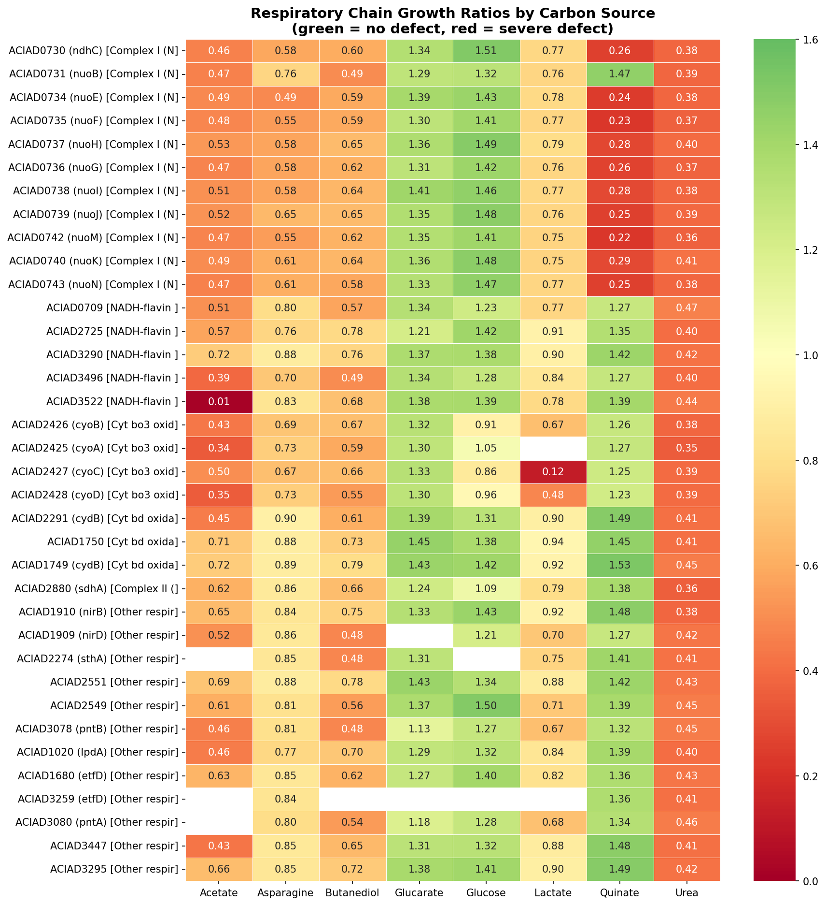
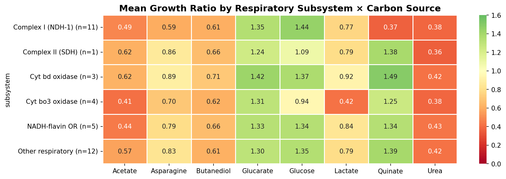
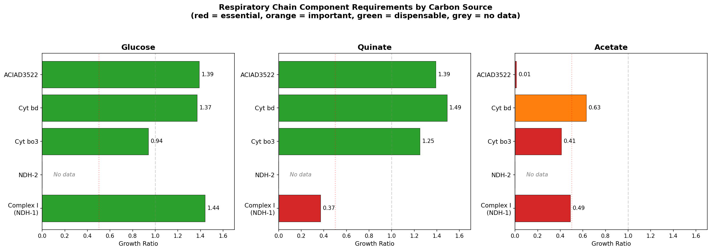
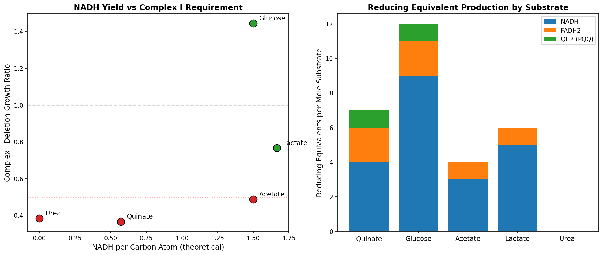
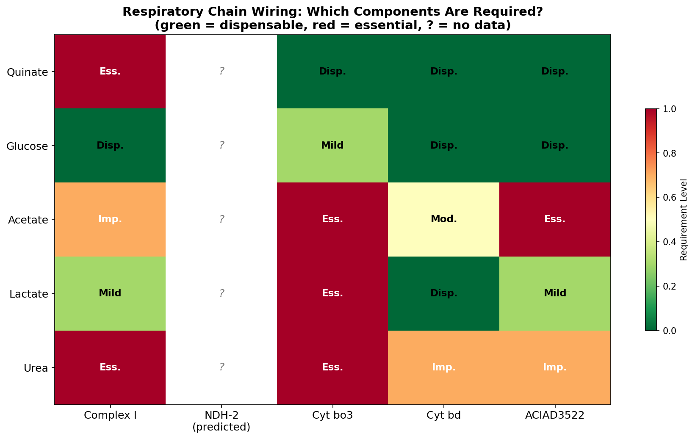
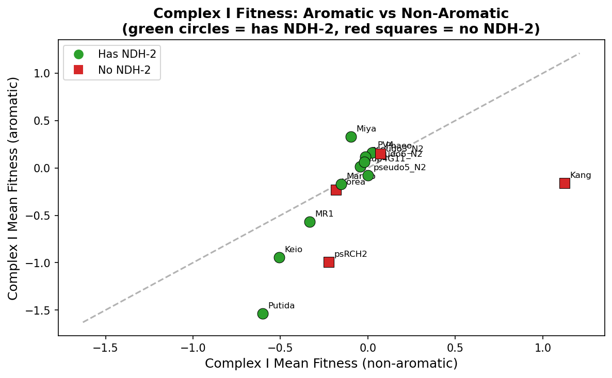
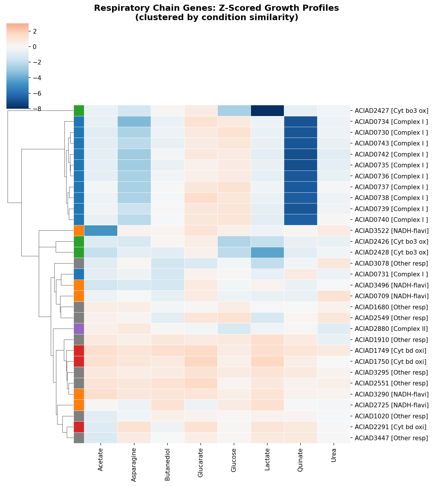

# Report: Condition-Specific Respiratory Chain Wiring in ADP1

## Key Findings

### 1. Each carbon source uses a distinct respiratory chain configuration

ADP1's branched respiratory chain (62 genes across 8 subsystems) is wired in a condition-dependent manner. Quinate requires only Complex I; acetate requires Complex I, cytochrome bo3, ACIAD3522, and more; glucose requires no specific respiratory component. This is not a quantitative gradient — it's qualitatively different respiratory configurations per substrate.

| Carbon Source | Required Components | Dispensable Components |
|---------------|--------------------|-----------------------|
| Quinate | Complex I only | Cyt bo3, Cyt bd, SDH, all others |
| Acetate | Complex I + Cyt bo3 + ACIAD3522 + more | None — most demanding |
| Lactate | Cyt bo3 | Complex I (mild), Cyt bd |
| Glucose | None specifically | All (full redundancy) |
| Urea | Everything (generally demanding) | None |

*(Notebook: 01_respiratory_chain_map.ipynb)*

### 2. ADP1 has three parallel NADH dehydrogenases with distinct condition profiles

| Dehydrogenase | Subunits | Proton pumping | Quinate | Glucose | Acetate |
|---------------|----------|---------------|---------|---------|---------|
| Complex I (NDH-1) | 13 | Yes (4 H⁺/NADH) | 0.37 (essential) | 1.44 (dispensable) | 0.49 (defect) |
| NDH-2 | 1 | No | No data | No data | No data |
| ACIAD3522 (NADH-FMN OR) | 1 | No | 1.39 (dispensable) | 1.39 (dispensable) | 0.013 (lethal) |

NDH-2 (ACIAD_RS16420, KO K03885) is TnSeq-dispensable but missing from the deletion collection — it has no growth data. FBA predicts zero flux through NDH-2 on all standard carbon sources, routing all NADH through Complex I. NDH-2 is a standalone gene (not in a respiratory operon) and is core genome.

*(Notebook: 02_ndh2_indirect.ipynb)*

### 3. The quinate-Complex I paradox is resolved by NADH flux rate, not total yield

Quinate produces FEWER NADH per carbon atom (0.57) than glucose (1.50) or acetate (1.50), yet Complex I is MORE essential on quinate. The resolution: aromatic ring cleavage via the β-ketoadipate pathway produces succinyl-CoA + acetyl-CoA simultaneously, creating a concentrated NADH burst in the TCA cycle that exceeds NDH-2's reoxidation capacity. Glucose distributes NADH production across Entner-Doudoroff pathway steps plus TCA, staying within NDH-2's capacity.

| Substrate | Total NADH | NADH/Carbon | Pathway Distribution | Complex I Growth |
|-----------|-----------|-------------|---------------------|-----------------|
| Quinate | 4 | 0.57 | Concentrated TCA burst | 0.37 (essential) |
| Glucose | 9 | 1.50 | Distributed (ED + TCA) | 1.44 (dispensable) |
| Acetate | 3 | 1.50 | All through TCA | 0.49 (defect) |
| Lactate | 5 | 1.67 | Pyruvate + TCA | 0.77 (mild) |

*(Notebook: 03_stoichiometry.ipynb)*

### 4. Cross-species: NDH-2 presence correlates with reduced Complex I aromatic dependency

Across 14 Fitness Browser organisms with aromatic experiments, organisms WITH NDH-2 show smaller Complex I aromatic deficits (mean = -0.086) than organisms WITHOUT NDH-2 (mean = -0.505). The difference is not statistically significant (p = 0.24, n = 4 without NDH-2) but the direction supports the compensation hypothesis. *Pseudomonas putida* shows a large Complex I aromatic deficit (-0.93) despite having NDH-2, suggesting that active aromatic catabolism can overwhelm NDH-2 capacity even when present.

*(Notebook: 04_cross_species_respiratory.ipynb)*

## Results

### Respiratory Chain Inventory

ADP1 has 62 respiratory chain genes across 8 subsystems: Complex I (13 genes), NDH-2 (1), NADH-flavin oxidoreductases (5), cytochrome bo3 (4), cytochrome bd (5), Complex II/SDH (5), ATP synthase (9), and other respiratory components (20). Of these, 36 have growth data and 26 do not (including NDH-2 and several ATP synthase subunits).

### The Wiring Model

The condition-specific wiring follows a biochemical logic:
- **Quinate**: aromatic ring cleavage → TCA burst → Complex I bottleneck. Cyt bo3 and cyt bd are dispensable because the terminal oxidase step is not the bottleneck — NADH reoxidation is.
- **Acetate**: direct TCA entry → continuous NADH production requiring all available dehydrogenases + cyt bo3 as the primary terminal oxidase. ACIAD3522 is specifically lethal (0.013 growth ratio).
- **Lactate**: pyruvate entry → moderate NADH flux + specific cyt bo3 requirement. Complex I is only mildly important (0.77), suggesting NDH-2 partially compensates.
- **Glucose**: Entner-Doudoroff → distributed NADH across multiple steps → NDH-2 capacity sufficient → no specific respiratory component required.

### FBA Model Limitations

The FBA model predicts zero flux through NDH-2 and ACIAD3522 on all standard media, because FBA optimizes for growth rate and preferentially routes NADH through Complex I (which generates more ATP per NADH). This is the fundamental reason FBA models fail to predict condition-specific respiratory requirements — they assume the optimal pathway is always used, missing the capacity constraints that force cells to use alternative, suboptimal pathways under high flux.

## Interpretation

### Literature Context

- The branched respiratory chain architecture is consistent with Melo & Teixeira (2016), who described bacterial respiratory supercomplexes with multiple entry and exit points for electrons. Our data shows this branching is not just structural redundancy — it's functionally specialized by substrate.

- NDH-2 as a low-capacity backup for Complex I is consistent with Lencina et al. (2018), who showed NDH-2 can be the sole NADH dehydrogenase in some organisms (*S. agalactiae*). ADP1 has both, with Complex I as the high-capacity primary system.

- The P. putida aromatic fitness data aligns with published knowledge of Pseudomonas aromatic catabolism — P. putida KT2440 is a well-studied aromatic degrader that channels diverse aromatic compounds through the β-ketoadipate pathway.

### Novel Contribution

1. **Condition-specific respiratory wiring map**: First systematic demonstration that a single bacterium uses qualitatively different respiratory configurations for different carbon sources, not just quantitative flux adjustments.

2. **Rate vs yield resolution**: The paradox that quinate (lower NADH yield) requires Complex I more than glucose (higher NADH yield) is resolved by NADH flux rate — concentrated TCA burst vs distributed production. This principle should apply to any substrate whose catabolism produces concentrated reducing equivalents.

3. **Three-dehydrogenase system**: ADP1's three NADH dehydrogenases (Complex I, NDH-2, ACIAD3522) with non-overlapping condition requirements demonstrate metabolic division of labor in electron transport.

4. **Cross-species NDH-2 compensation trend**: Organisms with NDH-2 show smaller Complex I aromatic deficits, supporting the compensation model across species (though not statistically significant with current sample size).

### Limitations

- NDH-2 has no growth data — the central prediction (NDH-2 compensates on glucose) cannot be directly tested with this dataset
- The stoichiometry analysis uses theoretical pathway biochemistry, not measured flux distributions
- Cross-species comparison has only 4 organisms without NDH-2, insufficient for statistical significance
- The NDH-2 gene search in FB organisms may miss some orthologs due to variable annotation
- ACIAD3522 may not be a true NADH dehydrogenase in the respiratory sense — "NADH-FMN oxidoreductase" could serve other metabolic functions

## Data

### Sources
| Collection | Tables Used | Purpose |
|------------|-------------|---------|
| User-provided SQLite (`berdl_tables.db`) | `genome_features`, `gene_phenotypes`, `gene_reaction_data`, `genome_reactions` | Growth ratios, FBA predictions, reaction stoichiometry |
| `kescience_fitnessbrowser` | `experiment`, `gene`, `genefitness` | Cross-species aromatic experiments, Complex I/NDH-2 fitness |

### Generated Data
| File | Rows | Description |
|------|------|-------------|
| `data/respiratory_chain_genes.csv` | 62 | All respiratory chain genes with growth data and subsystem assignments |
| `data/subsystem_profiles.csv` | 6 | Mean growth per subsystem × condition |
| `data/ndh2_comparison.csv` | 3 | Comparison of Complex I, NDH-2, and ACIAD3522 |
| `data/nadh_stoichiometry.csv` | 5 | Theoretical NADH yield per substrate |
| `data/cross_species_respiratory.csv` | 14 | Complex I aromatic fitness across FB organisms |
| `data/fb_aromatic_experiments.csv` | 33 | FB experiments with aromatic substrates |

## Supporting Evidence

### Notebooks
| Notebook | Purpose |
|----------|---------|
| `01_respiratory_chain_map.ipynb` | Extract 62 respiratory genes, build condition × subsystem heatmap |
| `02_ndh2_indirect.ipynb` | NDH-2 characterization via FBA, genomic context, ortholog fitness |
| `03_stoichiometry.ipynb` | NADH/ATP balance calculations, rate vs yield resolution |
| `04_cross_species_respiratory.ipynb` | FB Spark queries: aromatic experiments, NDH-2 compensation test |

### Figures
| Figure | Description |
|--------|-------------|
| `respiratory_chain_heatmap.png` | All 36 respiratory genes × 8 conditions (raw growth ratios) |
| `subsystem_profiles.png` | Mean growth by subsystem × condition |
| `respiratory_clustermap.png` | Z-scored respiratory gene profiles clustered by similarity |
| `wiring_model.png` | Side-by-side comparison: glucose vs quinate vs acetate requirements |
| `nadh_stoichiometry.png` | NADH yield vs Complex I requirement, reducing equivalent bar chart |
| `wiring_matrix.png` | Summary matrix: substrate × component requirement level |
| `ndh2_vs_complex_I.png` | Cross-species: Complex I aromatic vs non-aromatic fitness by NDH-2 status |

## Future Directions

1. **Construct an NDH-2 deletion mutant**: The central prediction — that NDH-2 deletion makes Complex I essential on glucose — can only be tested experimentally. An NDH-2 knockout in ADP1 would be the definitive test.

2. **Measure NADH/NAD⁺ ratios per carbon source**: The flux rate hypothesis predicts that quinate-grown cells have higher NADH/NAD⁺ ratios than glucose-grown cells. Metabolomics could test this directly.

3. **Expand cross-species analysis**: With only 4 organisms lacking NDH-2, the compensation test is underpowered. Querying the full BERDL pangenome for NDH-2 (K03885) and Complex I (K00330-K00343) co-occurrence across 27K species would provide a much larger sample.

4. **Characterize ACIAD3522**: Is it a true respiratory NADH dehydrogenase or a metabolic enzyme? Its acetate-lethality and FMN cofactor suggest a specific role in acetate catabolism that deserves further investigation.

5. **Respiratory chain proteomics**: Does ADP1 upregulate Complex I on aromatic substrates and NDH-2 on glucose? Stuani et al. (2014) did quinate vs succinate proteomics — reanalyzing their data for respiratory chain proteins could test the wiring model.

## References

- de Berardinis V et al. (2008). "A complete collection of single-gene deletion mutants of Acinetobacter baylyi ADP1." *Molecular Systems Biology* 4:174. PMID: 18319726
- Lencina AM et al. (2018). "Type 2 NADH dehydrogenase is the only point of entry for electrons into the Streptococcus agalactiae respiratory chain." *mBio* 9(4):e01034-18.
- Melo AMP & Teixeira M (2016). "Supramolecular organization of bacterial aerobic respiratory chains." *BBA - Bioenergetics* 1857(3):190-197.
- Price MN et al. (2018). "Mutant phenotypes for thousands of bacterial genes of unknown function." *Nature* 557:503-509.
- Sena FV et al. (2024). "The two alternative NADH:quinone oxidoreductases from Staphylococcus aureus." *Microbiology Spectrum* 12(4):e04152-23.
- Stuani L et al. (2014). "Novel metabolic features in Acinetobacter baylyi ADP1 revealed by a multiomics approach." *Metabolomics* 10(6):1223-1238. PMID: 25374488
