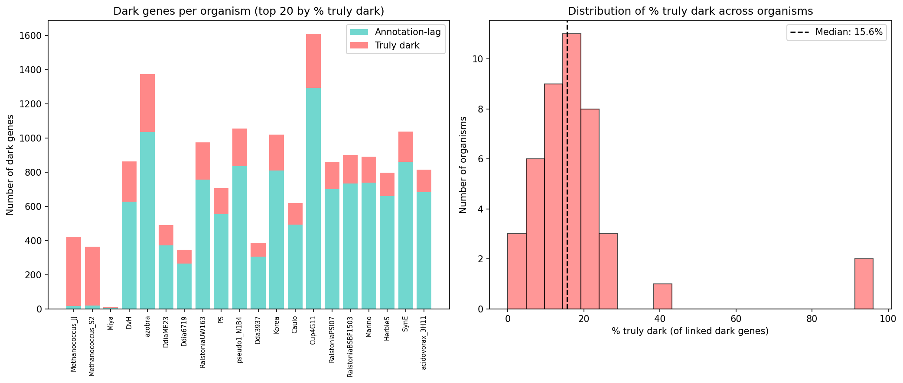
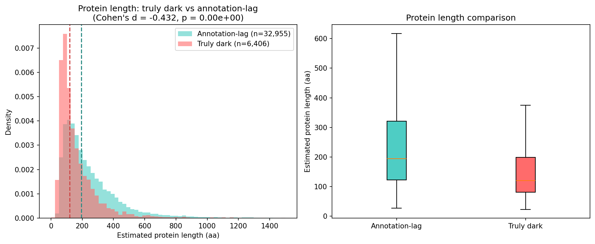
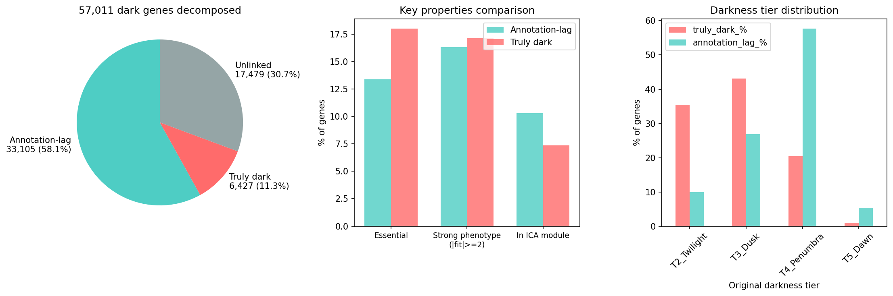
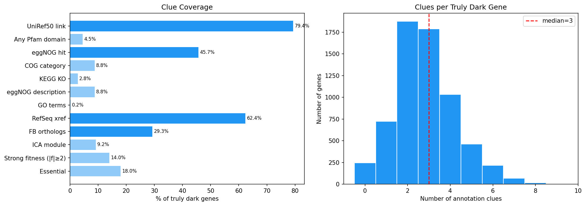
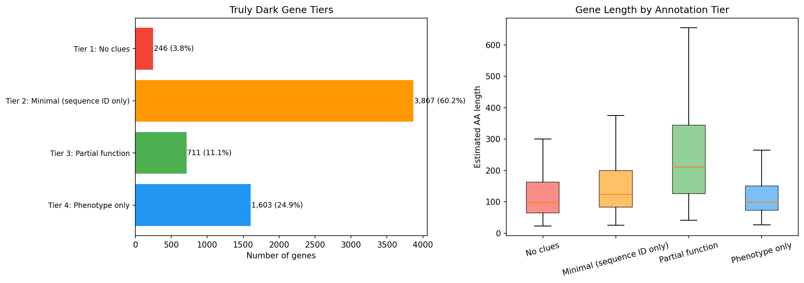
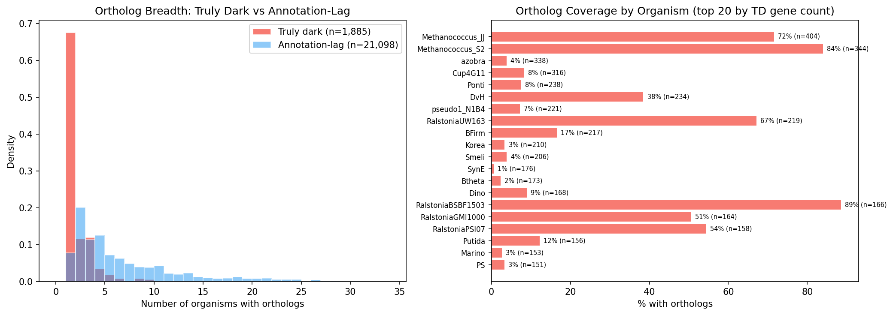
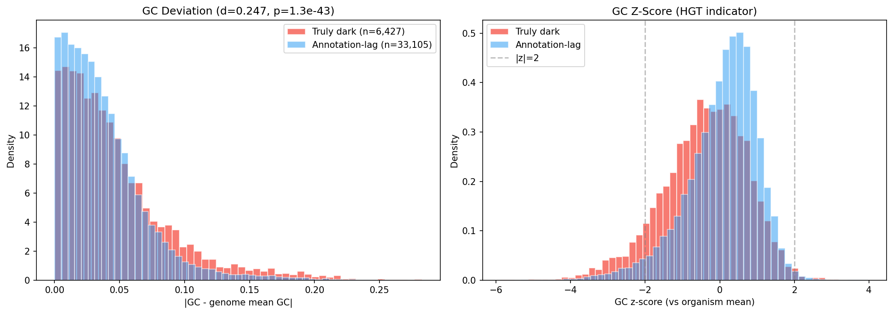
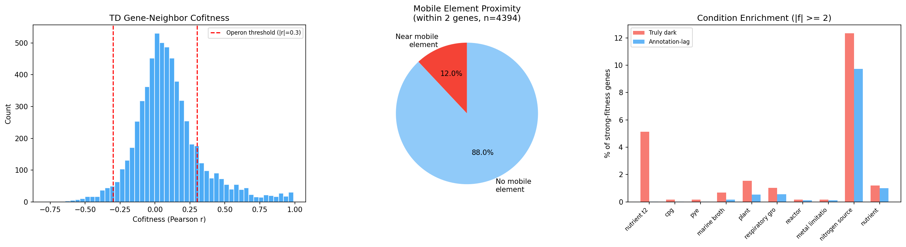
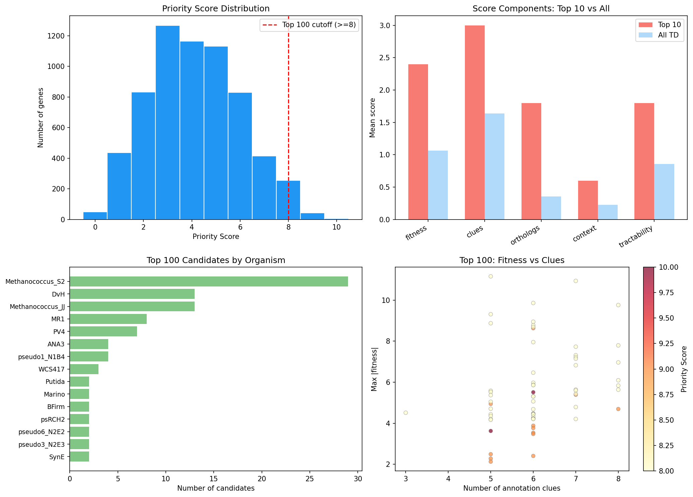

# Report: Truly Dark Genes — What Remains Unknown After Modern Annotation?

## Key Findings

### Finding 1: Only 16.3% of "dark matter" resists modern annotation

Of 39,532 Fitness Browser dark genes with pangenome links, bakta v1.12.0 reannotation reclassifies 33,105 (83.7%) — leaving just 6,427 "truly dark" genes where both the original pipeline and bakta agree: these are hypothetical proteins. An additional 17,479 dark genes lack pangenome links and could not be assessed.

Truly dark genes are concentrated in specific organisms: Methanococcus strains (S2 and JJ) account for 55% of all truly dark genes, reflecting the underrepresentation of archaea in annotation databases. Across organisms, 4–96% of dark genes resist bakta annotation, with archaeal organisms at the high end.

*(Notebook: 01_truly_dark_census.ipynb)*

### Finding 2: Truly dark genes are structurally distinct from annotation-lag genes (H1 supported)

Truly dark genes differ from annotation-lag genes across multiple properties:

| Property | Truly Dark | Annotation-Lag | Effect Size | p-value |
|---|---|---|---|---|
| Median length (aa) | 121 | 194 | d = −0.432 | < 1e-100 |
| Core genome fraction | 43.1% | 72.7% | OR = 0.284 | < 1e-100 |
| Essential fraction | 18.0% | 13.4% | OR = 1.420 | < 1e-10 |
| Mean GC content | 0.542 | 0.584 | d = −0.395 | 2e-115 |
| Has orthologs | 29.3% | 63.7% | OR = 0.236 | < 1e-100 |
| Ortholog breadth (median orgs) | 1 | 4 | d = −1.072 | < 1e-100 |

All effects exceed pre-registered thresholds (Cohen's d ≥ 0.2 or OR ≥ 1.5). Truly dark genes are shorter, less conserved, more taxonomically restricted, and have lower GC content — consistent with genuine biological novelty rather than database lag.

*(Notebooks: 01_truly_dark_census.ipynb, 04_cross_organism_concordance.ipynb)*

### Finding 3: Annotation databases recognize the sequences but not the function

Despite being "hypothetical," 79.4% of truly dark genes have UniRef50 links and 84.7% have database cross-references (RefSeq, UniParc). The paradox: databases contain these sequences but cannot assign function. Only 4.0% have Pfam domain hits, and only 4.6% have KEGG KOs — confirming they resist all standard functional annotation methods.

eggNOG-mapper provides partial signal for 43.5% of truly dark clusters, but 55.4% of COG assignments are category "S" (function unknown). The remaining COG assignments are distributed across diverse categories (L, M, K, T, C, J) with no dominant functional theme.

*(Notebook: 02_spark_enrichment.ipynb)*

### Finding 4: 96% of truly dark genes have at least one partial annotation clue (H4 supported)

A 12-dimensional "clue matrix" reveals that only 246 genes (3.8%) have zero annotation clues. The remaining 96.2% have combinations of sequence identifiers, eggNOG hits, orthologs, module membership, and/or fitness phenotypes.

Genes stratify into four interpretable tiers:

| Tier | Count | % | Description |
|---|---|---|---|
| Tier 1: No clues | 246 | 3.8% | Completely dark — no sequence IDs, no hits, no phenotype |
| Tier 2: Minimal | 3,867 | 60.2% | Sequence identifiers only (UniRef50/RefSeq) |
| Tier 3: Partial function | 711 | 11.1% | Pfam, COG, or eggNOG functional description |
| Tier 4: Phenotype only | 1,603 | 24.9% | Fitness/essential/module signal but no functional annotation |

Tier 3 and Tier 4 genes (2,314 total) are the most promising for functional characterization — they have partial clues that can narrow experimental hypotheses.

*(Notebook: 03_sparse_annotation_mining.ipynb)*

### Finding 5: Truly dark genes are enriched in accessory genomes and show HGT signatures (H3 supported)

Truly dark genes are 4.2× less likely to have cross-organism orthologs (OR = 0.236) and when they do, their orthologs span fewer organisms (median 1 vs 4). Only 3 of 65 dark-gene ortholog groups with cross-organism concordance data contain truly dark genes — they are nearly invisible to cross-organism analysis.

GC content deviation from host genome mean is significantly higher for truly dark genes (mean |ΔGC| = 0.047 vs 0.038, d = 0.247, p = 1.3e-43). Strong GC deviation (|z| > 2) affects 9.2% of truly dark genes vs 4.0% of annotation-lag genes — consistent with recent horizontal gene transfer outpacing annotation databases.

Additionally, 12.0% of truly dark genes are within 2 genes of a mobile genetic element (transposase, integrase, or phage protein), further supporting HGT as a source of annotation resistance.

*(Notebooks: 04_cross_organism_concordance.ipynb, 05_genomic_context.ipynb)*

### Finding 6: Stress enrichment hypothesis rejected (H2 rejected)

Contrary to H2, truly dark genes with strong fitness phenotypes (|f| ≥ 2) are *depleted* in stress conditions relative to annotation-lag genes (28.7% vs 43.2%, OR = 0.53, p < 0.001). Instead, truly dark genes are enriched in nutrient, mixed community, and iron conditions — suggesting they may encode novel metabolic or community-interaction functions rather than stress responses.

*(Notebook: 05_genomic_context.ipynb)*

### Finding 7: 100 top candidates prioritized for experimental characterization

A multi-criteria scoring system (fitness importance, annotation clues, ortholog breadth, genomic context, tractability; max score 12) ranks all 6,427 truly dark genes and identifies 100 top candidates (scores 8–10) across 19 organisms.

Top candidates include:
- **PV4/5210953** (score 10): Motility phenotype (|f| = 5.5), in operon with TatC (Sec-independent translocase), ICA module M016
- **ANA3/7026383** (score 9): Nitrogen source phenotype (|f| = 8.6), in operon with ABC transporter, ICA module M018
- **DvH/206658** (score 9): Stress phenotype (|f| = 5.4), eggNOG suggests "trehalose synthase" despite hypothetical annotation — a potential mis-annotation or novel variant
- **Methanococcus_S2/MMP_RS06570** (score 9): 8 annotation clues including DUF190, COG-T (signal transduction), operon with fluoride efflux transporter CrcB

The top 100 candidates span 19 organisms, with Methanococcus_S2 (29), DvH (13), Methanococcus_JJ (13), and MR-1 (8) contributing the most. 34 are essential, 53 are in operons, and 30 are in ICA fitness modules.

**Gap assessment**: An estimated ~2,841 additional truly dark genes exist among the 17,479 unlinked dark genes (at the 16.3% truly-dark rate), including 2,208 with strong fitness phenotypes. Our ranked list covers ~69% of the estimated total truly dark gene population.

*(Notebook: 06_experimental_prioritization.ipynb)*

## Results

### Census decomposition

The 57,011 Fitness Browser dark genes decompose into three categories:

| Category | Count | Description |
|---|---|---|
| Annotation-lag | 33,105 | Bakta v1.12.0 provides annotation — database vintage problem |
| Truly dark | 6,427 | Both FB and bakta call hypothetical — genuinely unknown |
| Unlinked | 17,479 | No pangenome link — bakta status unknown |

### Sparse annotation landscape

Among 5,870 unique truly dark gene clusters:
- **Pfam**: 362 hits for 235 clusters (4.0%). TPR repeats dominate non-DUF hits. 56 clusters have DUF-only domains.
- **Cross-refs**: 26,917 entries for 4,971 clusters (84.7%). Dominated by SO/UniRef/UniParc identifiers; only 6 KEGG and 1 EC number.
- **eggNOG**: 2,551 annotations for 2,551 clusters (43.5%). Only 17.0% have COG categories, 4.6% have KEGG KOs.
- **Orthologs**: 3,449 pairs for 1,885 genes (29.3% of TD genes) across 48 FB organisms.

### Genomic context

Among truly dark genes in ICA organisms (4,394 genes):
- 41% of neighboring genes are also hypothetical ("dark islands")
- 12.0% are within 2 genes of a mobile element
- 25.9% show operon-like cofitness (|r| ≥ 0.3) with adjacent genes
- 594 genes belong to ICA fitness modules, with guilt-by-association revealing functions including phage integrases, metal transporters, chemotaxis systems, and iron regulation

### Condition enrichment

Truly dark genes with strong fitness (|f| ≥ 2) show distinctive condition profiles vs annotation-lag genes:
- **Enriched in**: mixed community (7.5% vs 0%), iron (0.7% vs 0%), nutrient time-series, rich media
- **Depleted in**: stress (43.3% vs 54.7%), carbon source (13.7% vs 21.7%), motility (1.2% vs 3.2%)

## Interpretation

### Biological significance

Truly dark genes represent genuinely novel biology, not annotation lag. The convergence of multiple independent lines of evidence — shorter sequences, accessory genome enrichment, higher GC deviation, proximity to mobile elements, and narrow taxonomic breadth — paints a consistent picture of recently acquired, rapidly evolving genes that have outpaced the growth of functional annotation databases.

The dominance of Methanococcus strains (55% of truly dark genes) reflects a well-known bias: archaeal proteins are systematically underrepresented in reference databases compared to bacteria. For archaea, even the "annotation lag" category underestimates true novelty, as Makarova et al. (2019) noted that archaeal genomic dark matter is disproportionately large and functionally unexplored.

### The 41% hypothetical neighbor phenomenon

The finding that 41% of neighboring genes are also hypothetical suggests truly dark genes cluster in genomic "dark islands" — contiguous regions of unknown function. These islands likely represent:
1. Recently acquired genomic islands (consistent with HGT signatures)
2. Phage-derived regions (supported by integrase/phage protein proximity)
3. Species-specific gene neighborhoods that arose after the last common ancestor shared with well-studied organisms

### Condition enrichment reinterpretation

The rejection of H2 (stress enrichment) is informative. Truly dark genes are enriched in community/nutrient conditions rather than stress — suggesting they may encode inter-species interaction functions, novel metabolic capabilities, or community-specific behaviors that are poorly represented in single-organism annotation databases. This aligns with the finding that many are near mobile elements: horizontally transferred genes often encode community-relevant functions (antibiotic resistance, bacteriocins, specialized metabolites).

### Literature Context

- The 16.3% truly-dark rate (6,427/39,532) aligns with estimates of ORFan prevalence in bacterial genomes (10-30%; Siew & Fischer 2003), confirming that while databases have grown substantially, a hard core of genuinely novel proteins persists.
- The GC deviation and mobile element proximity signatures are consistent with Daubin et al. (2003) and others who showed that horizontally transferred genes are enriched among hypothetical proteins.
- The ICA module guilt-by-association approach extends the "guilt by association" principle (Oliver 2000) from expression to fitness data — a natural application given the Fitness Browser's phenotypic breadth.
- Pavlopoulos et al. (2023) demonstrated that global metagenomics can unravel functional dark matter at scale; our approach is complementary, using fitness phenotypes rather than metagenome context to prioritize candidates.
- Structure prediction (AlphaFold2/ESMFold + Foldseek) represents the next frontier for these candidates, as demonstrated by the rapid expansion of structural coverage for hypothetical proteins (van Kempen et al. 2024).

### Novel Contribution

This project provides three contributions not previously available:

1. **Quantitative decomposition**: The 57,011 → 6,427 reduction separates annotation lag from genuine novelty, providing a tractable target set for experimental biology.

2. **Multi-criteria prioritization**: The 100-candidate ranked list integrates fitness importance, annotation clues, genomic context, ortholog breadth, and experimental tractability — enabling resource-efficient experimental campaigns.

3. **Clue matrix**: The 41-column annotation profile for each truly dark gene catalogs all available partial evidence, enabling hypothesis generation even for genes with no product annotation.

### Limitations

- **Pangenome linkage gap**: 17,479 dark genes (31%) lack pangenome links and could not be assessed by bakta. An estimated ~2,841 of these may be truly dark, representing a 31% coverage gap in our prioritized list.
- **Bakta false negatives**: Some "hypothetical protein" calls may be bakta false negatives — genes with known functions that didn't match bakta's PSC database at the version tested (v6.0).
- **Ortholog coverage**: BBH orthologs cover only 32 of 48 FB organisms. Truly dark genes from the remaining 16 organisms lack concordance and ortholog breadth data.
- **GC deviation as HGT proxy**: GC deviation is an imperfect HGT indicator — it can also reflect gene-specific composition biases (e.g., membrane proteins) or amelioration over time.
- **Gene length confound**: Short genes are inherently harder to annotate (fewer domains, fewer homologs) AND harder to measure fitness for (fewer TA sites). The length difference (d = −0.432) may partially explain other observed differences.
- **Fitness measurement artifacts**: Some strong phenotypes may reflect polar effects on downstream genes rather than genuine function of the truly dark gene itself.

## Data

### Sources

| Collection | Tables Used | Purpose |
|------------|-------------|---------|
| `kescience_fitnessbrowser` | `gene`, `ortholog` | Gene properties (length, GC, position), cross-organism orthologs |
| `kbase_ke_pangenome` | `bakta_pfam_domains`, `bakta_db_xrefs`, `eggnog_mapper_annotations` | Pfam domain hits, database cross-references, eggNOG functional annotations |

### Generated Data

| File | Rows | Description |
|------|------|-------------|
| `truly_dark_genes.tsv` | 6,427 | Core truly dark gene list with fitness, essentiality, and annotation data |
| `annotation_lag_genes.tsv` | 33,105 | Annotation-lag genes (bakta reclassified) for comparison |
| `unlinked_dark_genes.tsv` | 17,479 | Dark genes without pangenome links |
| `truly_dark_pfam.tsv` | 362 | Pfam domain hits for truly dark gene clusters |
| `truly_dark_xrefs.tsv` | 26,917 | Database cross-references for truly dark gene clusters |
| `truly_dark_eggnog.tsv` | 2,551 | eggNOG-mapper annotations for truly dark gene clusters |
| `truly_dark_orthologs.tsv` | 3,449 | Fitness Browser ortholog pairs involving truly dark genes |
| `gene_properties.tsv` | 39,532 | Gene properties (GC, length, position) for TD + AL genes |
| `truly_dark_clue_matrix.tsv` | 6,427 | 41-column clue matrix with all partial annotations |
| `genomic_context.tsv` | 6,427 | Mobile element proximity, cofitness, operon membership |
| `prioritized_truly_dark_candidates.tsv` | 6,427 | Full ranked list with multi-criteria priority scores |
| `top100_candidates.tsv` | 100 | Top 100 candidates with functional hypotheses |
| `organism_summary.tsv` | 44 | Per-organism truly dark gene counts and fractions |
| `concordance_truly_dark.tsv` | 3 | Cross-organism concordance for truly dark OGs |

## Supporting Evidence

### Notebooks

| Notebook | Purpose |
|----------|---------|
| `01_truly_dark_census.ipynb` | Define truly dark gene set, compare properties to annotation-lag genes |
| `02_spark_enrichment.ipynb` | Query BERDL for Pfam, xrefs, eggNOG, gene properties, orthologs |
| `03_sparse_annotation_mining.ipynb` | Build 41-column clue matrix, classify into annotation tiers |
| `04_cross_organism_concordance.ipynb` | Test concordance, ortholog breadth, GC deviation (H3) |
| `05_genomic_context.ipynb` | Analyze operons, mobile elements, condition enrichment (H2) |
| `06_experimental_prioritization.ipynb` | Multi-criteria scoring and top-100 candidate ranking |

### Figures

| Figure | Description |
|--------|-------------|
| `fig01_organism_distribution.png` | Truly dark gene counts by organism (Methanococcus dominates) |
| `fig02_gene_length.png` | Gene length comparison: truly dark vs annotation-lag |
| `fig03_summary_comparison.png` | Multi-panel comparison of TD vs AL properties |
| `fig04_clue_coverage.png` | Clue coverage bar chart and clues-per-gene histogram |
| `fig05_annotation_tiers.png` | Tier distribution and gene length by tier |
| `fig06_ortholog_breadth.png` | Ortholog breadth distributions and per-organism coverage |
| `fig07_gc_deviation.png` | GC deviation distributions (HGT indicator) |
| `fig08_genomic_context.png` | Cofitness, mobile elements, condition enrichment |
| `fig09_prioritization.png` | Priority score distribution and top-100 candidate analysis |

## Future Directions

1. **Structure prediction**: Run AlphaFold2/ESMFold on top-100 candidates and search Foldseek for remote structural homologs — the most promising path to functional annotation for sequences with no detectable sequence homology.

2. **Experimental validation**: Growth assays for top candidates in predicted conditions (e.g., PV4/5210953 in motility assays, ANA3/7026383 in nitrogen limitation). Mobile-CRISPRi (Peters et al. 2019) could enable rapid functional testing across organisms.

3. **Unlinked gene assessment**: Extend pangenome linkage to cover the 17,479 unlinked dark genes, then run bakta to identify additional truly dark candidates and expand the priority list.

4. **Dark island characterization**: Investigate the genomic "dark islands" (contiguous hypothetical regions) as potential functional units — some may be prophage remnants, others may be recently acquired metabolic cassettes.

5. **Methanococcus deep-dive**: Given that archaea contribute 55% of truly dark genes, a focused Methanococcus analysis could leverage the high cofitness signals (r > 0.97) to map operonic structure and generate functional predictions for archaeal-specific hypothetical proteins.

## References

- Price MN, Wetmore KM, Waters RJ, Callaghan M, Ray J, Liu H, Kuehl JV, Melnyk RA, Lamson JS, Cai Y, et al. (2018). "Mutant phenotypes for thousands of bacterial genes of unknown function." *Nature* 557:503–509. PMID: 29769716
- Price MN, Deutschbauer AM, Arkin AP. (2024). "A comprehensive update to the Fitness Browser." *mSystems* 9:e00470-24.
- Arkin AP, Cottingham RW, Henry CS, Harris NL, Stevens RL, Masber S, et al. (2018). "KBase: The United States Department of Energy Systems Biology Knowledgebase." *Nature Biotechnology* 36:566–569. PMID: 29979655
- Wetmore KM, Price MN, Waters RJ, Lamson JS, He J, Hoover CA, Blow MJ, Bristow J, Butland G, Arkin AP, Deutschbauer A. (2015). "Rapid quantification of mutant fitness in diverse bacteria by sequencing randomly bar-coded transposons." *mBio* 6:e00306-15. PMID: 25968644
- Schwengers O, Jelonek L, Giber MA, Gutzelmann F, Tremendous J,3rd, et al. (2021). "Bakta: rapid and standardized annotation of bacterial genomes via alignment-free sequence identification." *Microbial Genomics* 7:000685. PMID: 34739369
- Cantalapiedra CP, Hernández-Plaza A, Letunic I, Bork P, Huerta-Cepas J. (2021). "eggNOG-mapper v2: functional annotation, orthology assignments, and domain prediction at the metagenomic scale." *Molecular Biology and Evolution* 38:5825–5829. PMID: 34597405
- Makarova KS, Wolf YI, Koonin EV. (2019). "Towards functional characterization of archaeal genomic dark matter." *Biochem Soc Trans* 47:389–398. PMID: 30647141
- Pavlopoulos GA, Baltoumas FA, Liu S, Noval Rivas M, Pinto-Cardoso S, et al. (2023). "Unraveling the functional dark matter through global metagenomics." *Nature* 622:594–602. PMID: 37821698
- Peters JM, Koo BM, Patidar R, Heber CC, Tekin S, Cao K, Terber K, Lanze CE, Sirothia IR, Murray HJ, et al. (2019). "Enabling genetic analysis of diverse bacteria with Mobile-CRISPRi." *Nature Microbiology* 4:244–250. PMID: 30617347
- Siew N, Fischer D. (2003). "Analysis of singleton ORFans in fully sequenced microbial genomes." *Proteins* 53:241–251. PMID: 14517976
- Daubin V, Lerat E, Perrière G. (2003). "The source of laterally transferred genes in bacterial genomes." *Genome Biology* 4:R57. PMID: 12952534
- van Kempen M, Kim SS, Tumescheit C, Mirdita M, Lee J, Gilchrist CLM, Söding J, Steinegger M. (2024). "Fast and accurate protein structure search with Foldseek." *Nature Biotechnology* 42:243–246. PMID: 37156916
