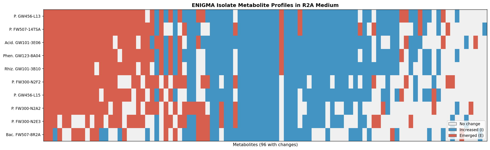

# Report: Web of Microbes Data Explorer

## Key Findings

### 1. WoM Action Encoding Uses Four Distinct Semantics, Not Three

The WoM database encodes metabolite observations with a 4-action system that differs between control and organism entries:

| Actor | Action | Meaning | Count |
|-------|--------|---------|-------|
| Control ("The Environment") | D | Detected in starting medium | 742 |
| Control ("The Environment") | N | Not detected | 1,023 |
| Organisms | I | Increased (present in medium, level went up) | 1,338 |
| Organisms | E | Emerged (NOT in medium, now detected = de novo production) | 1,155 |
| Organisms | N | No significant change | 7,509 |

**'E' and 'I' are mutually exclusive** (zero overlap across all 10,744 observations). 'E' encodes genuine de novo metabolite synthesis — the organism produced a metabolite that was absent from the starting medium. This distinction is biologically meaningful: 'I' represents amplification of existing metabolites, while 'E' represents novel biosynthetic output.

**There is no "Decreased" (consumption) action for any organism** in this 2018 snapshot. All 742 'D' observations belong exclusively to the control. The original Kosina et al. (2018) paper describes "decrease" as a valid action, so consumption data may exist in the newer GNPS2 version.

*(Notebook: 01_database_overview.ipynb)*

### 2. Two Direct Fitness Browser Strain Matches Plus Two Genus-Level Matches

| WoM Organism | FB Match | Match Type | FB Genes | FB Experiments |
|-------------|----------|------------|----------|---------------|
| Pseudomonas sp. FW300-N2E3 | `pseudo3_N2E3` | Direct strain | 5,854 | 211 |
| Pseudomonas sp. GW456-L13 | `pseudo13_GW456_L13` | Direct strain | 5,243 | 106 |
| E. coli BW25113 | `Keio` | Same strain | 4,610 | 168 |
| Synechococcus PCC7002 | `SynE` (PCC 7942) | Genus only | 2,722 | 129 |

The two Pseudomonas direct matches are ENIGMA groundwater isolates with rich FB data. Keio (E. coli BW25113) is the same strain but WoM data is limited to 12 observations in ZMMG medium (sulfur metabolism focus only).

*(Notebook: 01_database_overview.ipynb, 02_cross_collection_links.ipynb)*

### 3. 19 WoM-Produced Metabolites Are Tested as FB Carbon/Nitrogen Sources

For `pseudo3_N2E3`, curated matching identified **19 metabolites** that the organism produces (WoM) and that the Fitness Browser tests as carbon or nitrogen sources:

| WoM Metabolite | Action | FB Condition | FB Type |
|---------------|--------|-------------|---------|
| alanine | I | L-Alanine, D-Alanine | carbon/nitrogen |
| arginine | I | L-Arginine | nitrogen source |
| glycine | I | Glycine | nitrogen source |
| lactate | E | Sodium D-Lactate | carbon source |
| proline | I | L-Proline | carbon source |
| phenylalanine | I | L-Phenylalanine | carbon source |
| tryptophan | I | L-Tryptophan | nitrogen source |
| valine | E | L-Valine | carbon source |
| lysine | E | L-Lysine | nitrogen source |
| threonine | I | L-Threonine | nitrogen source |
| trehalose | I | D-Trehalose dihydrate | carbon source |
| adenine | I | Adenine hydrochloride | nitrogen source |
| adenosine | I | Adenosine | nitrogen source |
| inosine | I | Inosine | nitrogen source |
| thymine | E | Thymine | nitrogen source |
| malate | I | L-Malic acid | carbon source |
| nicotinamide | I | Nicotinamide | — |
| carnitine | E | Carnitine hydrochloride | — |

This enables the question: "Pseudomonas FW300-N2E3 produces lactate de novo (WoM action=E). Which genes are fitness-important for lactate utilization (FB)?" — directly connecting metabolite output to gene function. Of the 19 matches, 5 are de novo products (E) and 14 are amplified metabolites (I).

*(Notebook: 02_cross_collection_links.ipynb)*

### 4. 26.8% of WoM Metabolites Have Definitive ModelSEED Links (68.5% with Ambiguous Formula Matches)

| Match Type | WoM Compounds | Confidence | Percentage |
|-----------|---------------|-----------|------------|
| Exact name match | 69 | **High** — 1:1 mapping | 26.8% |
| Formula-only match | 107 | **Low** — 1:8.4 avg expansion (107 WoM → 900 MS molecules) | 41.6% |
| **Total with any link** | **176** | Mixed | **68.5%** |
| Unmatched | 81 | — | 31.5% |

Of 257 identified (non-unknown) WoM compounds, **69 (26.8%) have definitive ModelSEED links** by exact name match. An additional 107 match by molecular formula alone, but formula matches are inherently ambiguous — each WoM formula maps to an average of 8.4 ModelSEED molecules (e.g., C5H11NO2 matches valine, norvaline, betaine, 5-aminopentanoate, and others). Formula matches provide candidate sets for manual curation, not definitive identifications.

*(Notebook: 02_cross_collection_links.ipynb)*

### 5. ENIGMA Isolates Show Distinct "Metabolic Novelty Rates"

The fraction of metabolite changes that represent de novo production ('E') versus amplification of existing metabolites ('I') varies 2-fold across ENIGMA isolates in R2A medium:

| Organism | Increased (I) | Emerged (E) | % Novel |
|----------|--------------|-------------|---------|
| Pseudomonas GW456-L13 | 49 | 34 | 32.4% |
| Pseudomonas FW507-14TSA | 44 | 33 | 31.4% |
| Pseudomonas FW300-N2A2 | 26 | 32 | 30.5% |
| Acidovorax GW101-3E06 | 48 | 30 | 28.6% |
| Bacillus FW507-8R2A | 39 | 16 | 15.2% |

GW456-L13 produces the most novel metabolites (32.4%), while FW507-8R2A produces the fewest (15.2%). This "metabolic novelty rate" is a potential phenotype for cross-referencing with pangenome gene content.

*(Notebook: 01_database_overview.ipynb)*

### 6. All WoM Genera Have Pangenome Species Clades

| Genus | Pangenome Species (top 5) | Total Genomes |
|-------|--------------------------|---------------|
| Bacillus | 5 | 2,557 |
| Rhizobium | 5 | 449 |
| Pseudomonas fluorescens | 5 | 139 |
| Synechococcus | 5 | 88 |
| Phenylobacterium | 5 | 80 |
| Acidovorax | 5 | 79 |
| Zymomonas mobilis | 1 | 26 |
| Escherichia coli | 1 | 2 |

Pangenome context (gene clusters, conservation, functional annotations) is available for all WoM organism genera, enabling future genome-content ↔ metabolite-output analyses.

*(Notebook: 02_cross_collection_links.ipynb)*

## Results

### Database Scale

The 2018 WoM snapshot contains 37 organisms across 5 ENIGMA-funded projects:

- **6 biocrust isolates** (5,604 observations in BG11 media) — the largest data block
- **10 ENIGMA groundwater isolates** (1,050 observations in R2A medium)
- **4 other isolates** (E. coli, Zymomonas, Synechococcus, Microcoleus)
- **10 triculture time-series entries** and 2 native microbiome entries
- **4 theoretical auxotroph predictions** and 1 control

589 metabolites are tracked, of which 332 (56.4%) are unidentified ("Unk_" prefix). Of the 257 identified metabolites, 408 (69.3% of all 589) show at least one change across the database. The most metabolically active compounds are amino acids (glutamine, proline, phenylalanine) and nucleotides (adenine, adenosine, guanine).

### Cross-Collection Link Quality

**WoM ↔ Fitness Browser**: Strong for 3 organisms. The two Pseudomonas strains have >5,000 genes and >100 experiments each, with FB conditions that directly test metabolites WoM detects as produced. E. coli Keio is the same strain but WoM data is thin (12 observations, sulfur focus only).

**WoM ↔ ModelSEED**: Moderate. 26.8% of identified metabolites have definitive name-based links to ModelSEED molecules (high confidence). An additional 41.6% match by formula only (ambiguous, ~8:1 expansion ratio). Combined, 68.5% have at least one candidate link.

**WoM ↔ GapMind**: Blocked by naming convention mismatch. GapMind pathway names (internal IDs) don't contain simple metabolite names. A proper lookup table mapping GapMind pathways to substrate/product metabolites is needed.

**WoM ↔ Pangenome**: Available at genus level for all WoM organisms. Species-level matching requires strain-to-genome mapping (not attempted in this project).

## Interpretation

### Hypothesis Outcome

**H1 is partially supported.** Cross-collection links are real and actionable:
- 3 organisms have direct WoM ↔ FB connections with substantial fitness data
- 19 metabolites that N2E3 produces are tested as FB carbon/nitrogen sources
- 26.8% of identified metabolites have definitive ModelSEED links (68.5% with ambiguous formula matches)
- All genera have pangenome representation

However, the **absence of consumption data** is a fundamental limitation. The 2018 WoM snapshot records only what organisms produce, not what they consume. This prevents testing the most interesting question — whether consumed metabolites predict gene essentiality. The data is also small (37 organisms, 5 projects) and from a single laboratory.

### Literature Context

- **Kosina et al. (2018)** introduced WoM with the same data we analyzed. Their paper describes "decrease" as a valid action, confirming that consumption data is part of the WoM schema but absent from this specific export.
- **de Raad et al. (2022)** developed the Northen Lab Defined Medium (NLDM) supporting growth of 108/110 phylogenetically diverse soil bacteria, with all metabolites trackable via LC-MS/MS. This represents a major expansion of the exometabolomics approach and likely contains consumption data. The NLDM dataset may be available in the current GNPS2 version of WoM.
- **Jacoby & Kopriva (2019)** reviewed exometabolomics as a tool for understanding microbial cross-feeding and resource competition, noting its complementarity with genomics data — precisely the integration this project assessed.
- **Douglas (2020)** framed the microbial exometabolome as an "ecological resource and architect of microbial communities," highlighting the need for databases linking exometabolomics to genomics.

### Novel Contribution

This project provides the first characterization of WoM data within a multi-collection lakehouse context. Key novel findings:

1. **Action encoding clarification**: The E/I distinction (emerged vs increased) was not prominently documented and required data exploration to decode. This is critical for correct biological interpretation.
2. **Cross-collection link assessment**: Quantified that 26.8% of WoM metabolites have definitive ModelSEED links, 19 metabolites bridge directly to FB carbon/nitrogen source experiments, and 3 organisms span both collections — demonstrating that metabolite-to-gene integration is technically feasible.
3. **Metabolic novelty rate**: The 15–32% range of de novo production across ENIGMA isolates is a new phenotypic measure enabled by the E/I distinction.

### Limitations

- **No consumption data**: The most scientifically valuable WoM data (what organisms consume) is absent from this snapshot.
- **Small organism set**: 37 organisms (20 experimental) is too few for statistical analyses across organism groups.
- **2018 frozen snapshot**: The Wayback Machine archive may not reflect the current state of WoM. The GNPS2-hosted version or the Northen lab's internal datasets (including the NLDM 110-organism panel from de Raad et al. 2022) would be substantially richer.
- **GapMind pathway matching requires a lookup table**: Simple name matching failed. A dedicated pathway-to-metabolite mapping table would enable this link.
- **WoM E. coli data is minimal**: Despite Keio being one of the richest FB organisms, WoM has only 12 observations for E. coli BW25113 (sulfur/cysteine focus).

## Data

### Sources
| Collection | Tables Used | Purpose |
|------------|-------------|---------|
| `kescience_webofmicrobes` | `compound`, `environment`, `organism`, `project`, `observation` | Exometabolomics data (metabolite production/excretion profiles) |
| `kescience_fitnessbrowser` | `organism`, `gene`, `experiment` | Fitness data for organism overlap and condition matching |
| `kbase_msd_biochemistry` | `molecule` | Compound name/formula matching for reaction-level annotation |
| `kbase_ke_pangenome` | `pangenome`, `gapmind_pathways` | Species clade counts and pathway predictions |

### Generated Data
| File | Rows | Description |
|------|------|-------------|
| `data/wom_organisms.csv` | 37 | WoM organisms with observation counts and category labels |
| `data/wom_compounds.csv` | 589 | WoM metabolites with action counts and chemical class |
| `data/wom_environments.csv` | 10 | Growth media with organism/observation counts |
| `data/wom_projects.csv` | 5 | ENIGMA projects with DOIs |
| `data/fb_overlap.csv` | 2 | Direct WoM ↔ FB strain matches |
| `data/modelseed_name_matches.csv` | 75 | WoM ↔ ModelSEED exact name matches |
| `data/modelseed_formula_matches.csv` | 900 | WoM ↔ ModelSEED formula matches |

## Supporting Evidence

### Notebooks
| Notebook | Purpose |
|----------|---------|
| `01_database_overview.ipynb` | Inventory of WoM contents, organism categorization, FB strain matching, action encoding analysis |
| `02_cross_collection_links.ipynb` | ModelSEED compound matching, GapMind pathway mapping, pangenome species search, FB condition overlap |

### Figures
| Figure | Description |
|--------|-------------|
| `enigma_metabolite_heatmap.png` | Heatmap of 10 ENIGMA isolate metabolite profiles in R2A medium, showing Increased (blue) vs Emerged (red) actions |

## Future Directions

1. **Obtain the current WoM dataset from GNPS2 or the Northen lab**: The de Raad et al. (2022) NLDM study tested 110 soil bacteria with full consumption and production tracking. This dataset, if ingested, would resolve the no-consumption limitation and increase the organism count 3–5×.
2. **Build a GapMind pathway ↔ metabolite lookup table**: Map each GapMind pathway to its substrate and product metabolites using the GapMind documentation, enabling the WoM ↔ GapMind link that failed in NB02.
3. **Gene fitness ↔ metabolite production analysis**: For pseudo3_N2E3 and pseudo13_GW456_L13, identify which genes are fitness-important on carbon sources that the same organism produces. This tests whether metabolic output predicts gene essentiality.
4. **Metabolic novelty rate ↔ pangenome openness**: Test whether organisms with higher E/(E+I) ratios (more de novo production) have more open pangenomes or more accessory genes.
5. **Re-ingest with consumption data**: When a newer WoM dataset is available, re-run the ingestion pipeline (`data/wom_ingest/`) to update `kescience_webofmicrobes` and enable the consumption-based analyses that are currently blocked.

## References

- Kosina SM, Greiner AM, Lau RK, Jenkins S, Baran R, Bowen BP, Northen TR. (2018). "Web of microbes (WoM): a curated microbial exometabolomics database for linking chemistry and microbes." *BMC Microbiology*, 18:139. PMID: 30208844
- de Raad M, Li YV, Kuehl JV, Andeer PF, Kosina SM, Hendrickson A, Saichek NR, Golini AN, Han Z, Wang Y, Bowen BP, Deutschbauer AM, Arkin AP, Chakraborty R, Northen TR. (2022). "A Defined Medium for Cultivation and Exometabolite Profiling of Soil Bacteria." *Front Microbiol*, 13:855331. PMID: 35694313
- Douglas AE. (2020). "The microbial exometabolome: ecological resource and architect of microbial communities." *Phil Trans R Soc B*, 375:20190250.
- Jacoby RP, Kopriva S. (2019). "Metabolic niches in the rhizosphere microbiome: new tools and approaches to analyse metabolic mechanisms of plant-microbe nutrient exchange." *J Exp Bot*, 70:697-713. PMID: 30576534
- Price MN, Wetmore KM, Waters RJ, Callaghan M, Ray J, Liu H, Kuehl JV, Melnyk RA, Lamson JS, Cai Y, Carlson HK, Bristow J, Arkin AP, Deutschbauer AM. (2018). "Mutant phenotypes for thousands of bacterial genes of unknown function." *Nature*, 557:503-509.
