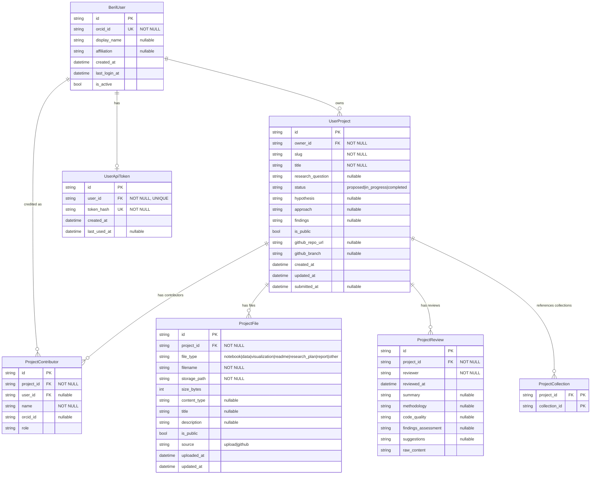

# BERIL Observatory — Database Schema

```mermaid
erDiagram
    BerilUser {
        string id PK
        string orcid_id UK "NOT NULL"
        string display_name "nullable"
        string affiliation "nullable"
        datetime created_at
        datetime last_login_at
        bool is_active
    }

    UserProject {
        string id PK
        string owner_id FK "NOT NULL"
        string slug "NOT NULL"
        string title "NOT NULL"
        string research_question "nullable"
        string status "proposed|in_progress|completed"
        string hypothesis "nullable"
        string approach "nullable"
        string findings "nullable"
        bool is_public
        string github_repo_url "nullable"
        string github_branch "nullable"
        datetime created_at
        datetime updated_at
        datetime submitted_at "nullable"
    }

    ProjectContributor {
        string id PK
        string project_id FK "NOT NULL"
        string user_id FK "nullable"
        string name "NOT NULL"
        string orcid_id "nullable"
        string role
    }

    ProjectFile {
        string id PK
        string project_id FK "NOT NULL"
        string file_type "notebook|data|visualization|readme|research_plan|report|other"
        string filename "NOT NULL"
        string storage_path "NOT NULL"
        int size_bytes
        string content_type "nullable"
        string title "nullable"
        string description "nullable"
        bool is_public
        string source "upload|github"
        datetime uploaded_at
        datetime updated_at
    }

    ProjectReview {
        string id PK
        string project_id FK "NOT NULL"
        string reviewer "NOT NULL"
        datetime reviewed_at
        string summary "nullable"
        string methodology "nullable"
        string code_quality "nullable"
        string findings_assessment "nullable"
        string suggestions "nullable"
        string raw_content
    }

    UserApiToken {
        string id PK
        string user_id FK "NOT NULL, UNIQUE"
        string token_hash UK "NOT NULL"
        datetime created_at
        datetime last_used_at "nullable"
    }

    ProjectCollection {
        string project_id FK "PK"
        string collection_id "PK"
    }

    BerilUser ||--o{ UserProject : "owns"
    BerilUser ||--o| UserApiToken : "has"
    BerilUser ||--o{ ProjectContributor : "credited as"
    UserProject ||--o{ ProjectContributor : "has contributors"
    UserProject ||--o{ ProjectFile : "has files"
    UserProject ||--o{ ProjectReview : "has reviews"
    UserProject ||--o{ ProjectCollection : "references collections"
```
